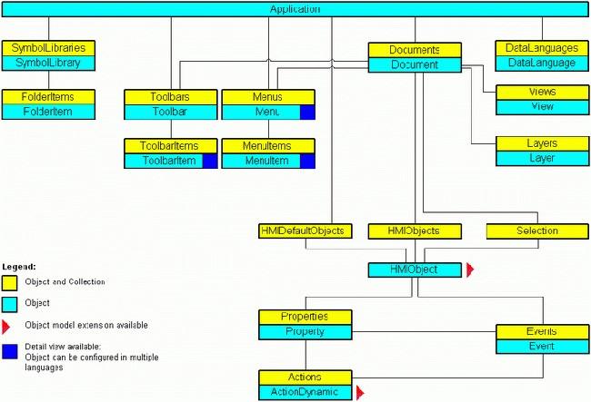
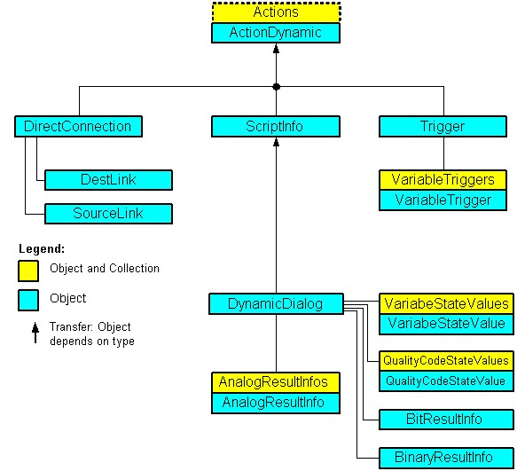
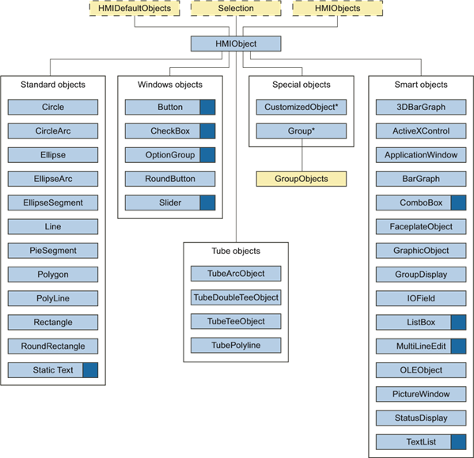
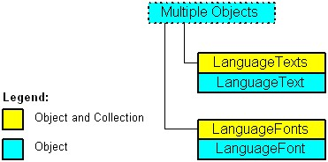

## 3.6 VBA 参考

### 3.6.1 图形编辑器的对象模型

#### 3.6.1.1 VBA 参考

**VBA 对象模型**

当您点击一个对象名称时，您将看到一个详细的描述。

> **注意**
>
> 在接下来的描述中，前缀 "HMI" 将被省略。请注意，在代码中您必须为对象添加 "HMI" 前缀，例如 "HMISymbolLibrary"。



**另请参见**
*   Events 对象 (列表) (Page 2050)
*   SymbolLibraries 对象 (列表) (Page 2160)
*   Actions 对象 (列表) (Page 1982)
*   Application 对象 (Page 1993)
*   DataLanguage 对象 (Page 2024)
*   DataLanguages 对象 (列表) (Page 2025)
*   Document 对象 (Page 2032)
*   Documents 对象 (列表) (Page 2035)
*   Event 对象 (Page 2049)
*   HMIDefaultObjects 对象 (列表) (Page 2067)
*   HMIObject 对象 (Page 2070)
*   HMIObjects 对象 (列表) (Page 2072)
*   FolderItem 对象 (Page 2055)
*   FolderItems 对象 (列表) (Page 2056)
*   VBA 参考: ActionDynamic (Page 1832)
*   VBA 参考: HMIObjects (Page 1834)
*   VBA 参考: Languages (Page 1836)
*   Layer 对象 (Page 2083)
*   Layers 对象 (列表) (Page 2084)
*   Menu 对象 (Page 2091)
*   Menus 对象 (列表) (Page 2093)
*   MenuItem 对象 (Page 2095)
*   MenuItems 对象 (列表) (Page 2097)
*   Properties 对象 (列表) (Page 2123)
*   Toolbar 对象 (Page 2167)
*   Toolbars 对象 (列表) (Page 2168)
*   ToolbarItem 对象 (Page 2170)
*   ToolbarItems 对象 (列表) (Page 2172)
*   View 对象 (Page 2189)
*   Views 对象 (列表) (Page 2190)
*   SelectedObjects 对象 (列表) (Page 2141)
*   SymbolLibrary 对象 (Page 2162)
*   Property 对象 (Page 2124)

---

#### 3.6.1.2 VBA 参考: ActionDynamic

**VBA 对象模型: ActionDynamic**

"ActionDynamic" 代表了动态和动作的接口端口，例如脚本、动态对话框、直接连接和触发器。

当您点击一个对象名称时，您将看到一个详细的描述。



**另请参见**
*   VBA 参考 (Page 1830)
*   AnalogResultInfo 对象 (Page 1991)
*   AnalogResultInfos 对象 (列表) (Page 1992)
*   BinaryResultInfo 对象 (Page 2002)
*   BitResultInfo 对象 (Page 2003)
*   Actions 对象 (列表) (Page 1982)
*   DestLink 对象 (Page 2028)
*   DirectConnection 对象 (Page 2030)
*   DynamicDialog 对象 (Page 2038)
*   QualityCodeStateValue 对象 (Page 2126)
*   QualityCodeStateValues 对象 (列表) (Page 2128)
*   ScriptInfo 对象 (Page 2140)
*   SourceLink 对象 (Page 2147)
*   Trigger 对象 (Page 2174)
*   VariableStateValue 对象 (Page 2183)
*   VariableStateValues 对象 (列表) (Page 2184)
*   VariableTrigger 对象 (Page 2186)
*   VariableTriggers 对象 (列表) (Page 2188)
*   ActionType 属性 (Page 2194)
*   DynamicStateType 属性 (Page 2303)

---

#### 3.6.1.3 VBA 参考: HMIObjects

**VBA 对象模型: HMIObjects**

当您点击一个对象名称时，您将看到一个详细的描述。



| 图例 | 描述 |
| :--- | :--- |
| **对象和列表** | |
| **对象** | |
|  | 提供详细视图。 |
|  | 可以进行多语言对象组态。 |
| * | 不在 DefaultObjects 列表中。 |

**另请参见**
*   VBA 参考 (Page 1830)
*   PolyLine 对象 (Page 2120)
*   GroupDisplay 对象 (Page 2063)
*   3DBarGraph 对象 (Page 1978)
*   ActiveXControl 对象 (Page 1984)
*   ApplicationWindow 对象 (Page 1995)
*   Button 对象 (Page 2004)
*   CheckBox 对象 (Page 2008)
*   Circle 对象 (Page 2011)
*   CircularArc 对象 (Page 2014)
*   Line 对象 (Page 2086)
*   OLEObject 对象 (Page 2105)
*   OptionGroup 对象 (Page 2107)
*   PictureWindow 对象 (Page 2111)
*   PieSegment 对象 (Page 2114)
*   Polygon 对象 (Page 2117)
*   Property 对象 (Page 2124)
*   Rectangle 对象 (Page 2131)
*   RoundButton 对象 (Page 2133)
*   RoundRectangle 对象 (Page 2137)
*   Slider 对象 (Page 2144)
*   StaticText 对象 (Page 2149)
*   StatusDisplay 对象 (Page 2152)
*   TextList 对象 (Page 2163)
*   Ellipse 对象 (Page 2040)
*   EllipseArc 对象 (Page 2043)
*   EllipseSegment 对象 (Page 2046)
*   GraphicObject 对象 (Page 2058)
*   Group 对象 (Page 2061)
*   HMIDefaultObjects 对象 (列表) (Page 2067)
*   HMIObject 对象 (Page 2070)
*   HMIObjects 对象 (列表) (Page 2072)
*   IOField 对象 (Page 2074)
*   BarGraph 对象 (Page 1998)
*   GroupedObjects 对象 (列表) (Page 2066)
*   VBA 参考: Languages (Page 1836)
*   SelectedObjects 对象 (列表) (Page 2141)
*   CustomizedObject 对象 (Page 2021)
*   FaceplateObject 对象 (Page 2052)
*   AdvancedAnalogDisplay 对象 (Page 1986)
*   AdvancedStateDisplay 对象 (Page 1989)

---

#### 3.6.1.4 VBA 参考: Languages

**VBA 对象模型: Languages**

当您点击一个对象名称时，您将看到一个详细的描述。



**另请参见**
*   VBA 参考 (Page 1830)
*   LanguageFont 对象 (Page 2078)
*   LanguageFonts 对象 (列表) (Page 2079)
*   LanguageText 对象 (Page 2081)
*   LanguageTexts 对象 (列表) (Page 2082)

---

#### 3.6.1.5 事件

**A-D**

##### Activated 事件

**描述**
当一个画面在图形编辑器中被激活时发生。例如，当您在两个画面之间切换时会发生这种情况。

**语法**
`Document_Activated(CancelForwarding As Boolean)`

**参数**

| 参数 (数据类型) | 描述 |
| :--- | :--- |
| `CancelForwarding` (Boolean) | 如果事件不打算被转发，则为 `TRUE`。默认设置为 `False`。 |

**示例:**
在以下示例中，当画面被激活时会输出一条消息：

```vb
Private Sub Document_Activated(CancelForwarding As Boolean)
'VBA76
MsgBox "文档获得了焦点。" & vbCrLf &_
"此事件 (Document_Activated) 由文档本身引发"
End Sub
```

**另请参见**
*   VBA 参考 (Page 1830)
*   事件处理 (Page 1795)

##### BeforeClose 事件

**描述**
在画面关闭之前立即发生。

**语法**
`Document_BeforeClose(Cancel As Boolean, CancelForwarding As Boolean)`

**参数**

| 参数 (数据类型) | 描述 |
| :--- | :--- |
| `Cancel` (Boolean) | 如果要取消命令处理，则为 `TRUE`。 |
| `CancelForwarding` (Boolean) | 如果事件不打算被转发，则为 `TRUE`。默认设置为 `False`。 |

**示例:**
在以下示例中，在画面关闭前会输出一条消息：

```vb
Private Sub Document_BeforeClose(Cancel As Boolean, CancelForwarding As Boolean)
'VBA77
MsgBox "事件 Document_BeforeClose 被引发"
End Sub
```

**另请参见**
*   VBA 参考 (Page 1830)

##### BeforeDocumentClose 事件

**描述**
在画面关闭之前立即发生。

**语法**
> **注意**
>
> 为确保应用程序级事件在项目中可用，必须让图形编辑器知道该应用程序。这通过以下语句完成：
> `Dim WithEvents <Name> As grafexe.Application`
> 在下面的示例中，名称 "objGDApplication" 被用来替代 `<Name>`。

`objGDApplication_BeforeDocumentClose(Document As HMIDocument, Cancel As Boolean)`

**参数**

| 参数 (数据类型) | 描述 |
| :--- | :--- |
| `Document` (HMIDocument) | 即将被关闭的画面。 |
| `Cancel` (Boolean) | 如果要取消命令处理，则为 `TRUE`。 |

**示例:**
执行以下过程以使下面的示例正常工作：

```vb
Private Sub SetApplication()
'此过程必须首先用 "F5" 执行
Set objGDApplication = grafexe.Application
End Sub
```
在以下示例中，在画面关闭前会输出一条消息：

```vb
Private Sub objGDApplication_BeforeDocumentClose(ByVal Document As IHMIDocument, Cancel As Boolean)
'VBA78
MsgBox "文档 " & Document.Name & " 将在点击确定后关闭"
End Sub
```

**另请参见**
*   VBA 参考 (Page 1830)

##### BeforeDocumentSave 事件

**描述**
在画面保存之前立即发生。

**语法**
> **注意**
>
> 为确保应用程序级事件在项目中可用，必须让图形编辑器知道该应用程序。这通过以下语句完成：
> `Dim WithEvents <Name> As grafexe.Application`
> 在下面的示例中，名称 "objGDApplication" 被用来替代 `<Name>`。

`objGDApplication_BeforeDocumentSave(Document As HMIDocument, Cancel As Boolean)`

**参数**

| 参数 (数据类型) | 描述 |
| :--- | :--- |
| `Document` (HMIDocument) | 即将被保存的画面。 |
| `Cancel` (Boolean) | 如果要取消命令处理，则为 `TRUE`。 |

**示例:**
执行以下过程以使下面的示例正常工作：

```vb
Private Sub SetApplication()
'此过程必须首先用 "F5" 执行
Set objGDApplication = grafexe.Application
End Sub
```
在以下示例中，在画面保存前会输出一条消息：

```vb
Private Sub objGDApplication_BeforeDocumentSave(ByVal Document As IHMIDocument, Cancel As Boolean)
'VBA79
MsgBox Document.Name & "-保存将在点击确定后开始。"
End Sub
```

**另请参见**
*   VBA 参考 (Page 1830)

##### BeforeHMIObjectDelete 事件

**描述**
在画面中的一个对象被删除之前立即发生。

**语法**
`BeforeHMIObjectDelete(ByVal HMIObject As IHMIObject, Cancel As Boolean, CancelForwarding As Boolean)`

**参数**

| 参数 (数据类型) | 描述 |
| :--- | :--- |
| `HMIObject` (IHMIObject) | 标识要被删除的对象。 |
| `Cancel` (Boolean) | 如果要取消命令处理，则为 `TRUE`。 |
| `CancelForwarding` (Boolean) | 如果事件不打算被转发，则为 `TRUE`。默认设置为 `False`。 |

**示例:**
在以下示例中，会输出一条消息，标识要被删除的对象：

```vb
Private Sub Document_BeforeHMIObjectDelete(ByVal HMIObject As IHMIObject, Cancel As Boolean, CancelForwarding As Boolean)
'VBA80
Dim strObjName As String
Dim strAnswer As String
' '"strObjName" 包含了被删除对象的名称
strObjName = HMIObject.ObjectName
strAnswer = MsgBox("您确定要删除 " & strObjName & "?", vbYesNo)
If strAnswer = vbNo Then
'如果按下 "No" -> 设置 Cancel 为 true 以阻止删除
Cancel = True
End If
End Sub
```

**另请参见**
*   VBA 参考 (Page 1830)

##### BeforeLibraryFolderDelete 事件

**描述**
在组件库中的一个文件夹被删除之前立即发生。

**语法**
> **注意**
>
> 为确保应用程序级事件在项目中可用，必须让图形编辑器知道该应用程序。这通过以下语句完成：
> `Dim WithEvents <Name> As grafexe.Application`
> 在下面的示例中，名称 "objGDApplication" 被用来替代 `<Name>`。

`objGDApplication_BeforeLibraryFolderDelete(LibObject As HMIFolderItem, Cancel As Boolean)`

**参数 (可选)**

| 参数 (数据类型) | 描述 |
| :--- | :--- |
| `LibObject` (HMIFolderItem) | 即将被删除的文件夹。 |
| `Cancel` (Boolean) | 如果要取消命令处理，则为 `TRUE`。 |

**示例:**
执行以下过程以使下面的示例正常工作：

```vb
Private Sub SetApplication()
'此过程必须首先用 "F5" 执行
Set objGDApplication = grafexe.Application
End Sub
```在以下示例中，在组件库中的一个文件夹被删除前会输出一条消息：

```vb
Private Sub objGDApplication_BeforeLibraryFolderDelete(ByVal LibObject As HMIFolderItem, Cancel As Boolean)
'VBA81
MsgBox "库文件夹 " & LibObject.Name & " 即将被删除..."
End Sub
```

**另请参见**
*   VBA 参考 (Page 1830)

##### BeforeLibraryObjectDelete 事件

**描述**
在组件库中的一个对象被删除之前立即发生。

**语法**
> **注意**
>
> 为确保应用程序级事件在项目中可用，必须让图形编辑器知道该应用程序。这通过以下语句完成：
> `Dim WithEvents <Name> As grafexe.Application`
> 在下面的示例中，名称 "objGDApplication" 被用来替代 `<Name>`。

`objGDApplication_BeforeLibraryObjectDelete(LibObject As HMIFolderItem, Cancel As Boolean)`

**参数 (可选)**

| 参数 (数据类型) | 描述 |
| :--- | :--- |
| `LibObject` (HMIFolderItem) | 即将被删除的对象。 |
| `Cancel` (Boolean) | 如果要取消命令处理，则为 `TRUE`。 |

**示例:**
执行以下过程以使下面的示例正常工作：

```vb
Private Sub SetApplication()
'此过程必须首先用 "F5" 执行
Set objGDApplication = grafexe.Application
End Sub
```
在以下示例中，在组件库中的一个对象被删除前会输出一条消息：

```vb
Private Sub objGDApplication_BeforeLibraryObjectDelete(ByVal LibObject As HMIFolderItem, Cancel As Boolean)
'VBA82
MsgBox "对象 " & LibObject.Name & " 即将被删除..."
End Sub
```

**另请参见**
*   VBA 参考 (Page 1830)

##### BeforeQuit 事件

**描述**
在图形编辑器关闭之前立即发生。

**语法**
> **注意**
>
> 为确保应用程序级事件在项目中可用，必须让图形编辑器知道该应用程序。这通过以下语句完成：
> `Dim WithEvents <Name> As grafexe.Application`
> 在下面的示例中，名称 "objGDApplication" 被用来替代 `<Name>`。

`objGDApplication_BeforeQuit(Cancel As Boolean)`

**参数**

| 参数 (数据类型) | 描述 |
| :--- | :--- |
| `Cancel` (Boolean) | 如果要取消命令处理，则为 `TRUE`。 |

**示例:**
执行以下过程以使下面的示例正常工作：

```vb
Private Sub SetApplication()
'此过程必须首先用 "F5" 执行
Set objGDApplication = grafexe.Application
End Sub
```
在此示例中，在图形编辑器关闭前不久会输出一条消息。

```vb
Private Sub objGDApplication_BeforeQuit(Cancel As Boolean)
'VBA83
MsgBox "图形编辑器即将关闭"
End Sub
```

**另请参见**
*   VBA 参考 (Page 1830)

##### BeforeSave 事件

**描述**
在画面保存之前立即发生。

**语法**
`Document_BeforeSave(Cancel As Boolean, CancelForwarding As Boolean)`

**参数**

| 参数 (数据类型) | 描述 |
| :--- | :--- |
| `Cancel` (Boolean) | 如果要取消命令处理，则为 `TRUE`。 |
| `CancelForwarding` (Boolean) | 如果事件不打算被转发，则为 `TRUE`。默认设置为 `False`。 |

**示例:**
在以下示例中，在画面保存前会输出一条消息：

```vb
Private Sub Document_BeforeSave(Cancel As Boolean, CancelForwarding As Boolean)
'VBA84
MsgBox "文档即将保存..."
End Sub
```

**另请参见**
*   VBA 参考 (Page 1830)

##### BeforeVisibleFalse 事件

**描述**
在图形编辑器应用程序从可见设置为不可见之前立即发生。

**语法**
`Document_BeforeVisibleFalse(Cancel As Boolean, CancelForwarding As Boolean)`

**参数**

| 参数 (数据类型) | 描述 |
| :--- | :--- |
| `Cancel` (Boolean) | 如果要取消命令处理，则为 `TRUE`。 |
| `CancelForwarding` (Boolean) | 如果事件不打算被转发，则为 `TRUE`。默认设置为 `False`。 |

**示例:**

--

**另请参见**
*   VBA 参考 (Page 1830)

##### ConnectionEvent 事件

**描述**
当两个对象通过连接器连接时发生。

**语法**
`ConnectionEvent(eConnEventType, HMIConnector, HMIConnectedObject, CancelProcess, CancelForwarding)`

**参数 (可选)**

| 参数 (数据类型) | 描述 |
| :--- | :--- |
| `eConnEventType` (HMIConnectionEventType) | -- |
| `HMIConnector` (HMIObject) | -- |
| `HMIConnectedObject` (HMIObject) | -- |
| `CancelProcess` (Boolean) | 如果要取消命令处理，则为 `TRUE`。 |
| `CancelForwarding` (Boolean) | 如果事件不打算被转发，则为 `TRUE`。默认设置为 `False`。 |

**示例:**

---

**另请参见**
*   VBA 参考 (Page 1830)

##### DataLanguageChanged 事件

**描述**
当项目语言已更改时发生。

**语法**
> **注意**
>
> 为确保应用程序级事件在项目中可用，必须让图形编辑器知道该应用程序。这通过以下语句完成：
> `Dim WithEvents <Name> As grafexe.Application`
> 在下面的示例中，名称 "objGDApplication" 被用来替代 `<Name>`。

`objGDApplication_DataLanguageChanged(lCID As Long)`

**参数**

| 参数 (数据类型) | 描述 |
| :--- | :--- |
| `lCID` (Long) | 项目语言标识符。 |

**示例:**
执行以下过程以使下面的示例正常工作：

```vb
Private Sub SetApplication()
'此过程必须首先用 "F5" 执行
Set objGDApplication = grafexe.Application
End Sub
```
在以下示例中，会输出新设置的项目语言：

```vb
Private Sub objGDApplication_DataLanguageChanged(ByVal lCID As Long)
'VBA87
MsgBox "数据语言已更改为 " & Application.CurrentDataLanguage & "."
End Sub
```

**另请参见**
*   使用 VBA 进行与语言相关的组态 (Page 1706)
*   VBA 参考 (Page 1830)

##### DesktopLanguageChanged 事件

**描述**
当用户界面语言已更改时发生。

**语法**
> **注意**
>
> 为确保应用程序级事件在项目中可用，必须让图形编辑器知道该应用程序。这通过以下语句完成：
> `Dim WithEvents <Name> As grafexe.Application`
> 在下面的示例中，名称 "objGDApplication" 被用来替代 `<Name>`。

`objGDApplication_DesktopLanguageChanged(lCID As Long)`

**参数**

| 参数 (数据类型) | 描述 |
| :--- | :--- |
| `lCID` (Long) | 用户界面语言标识符。 |

**示例:**
执行以下过程以使下面的示例正常工作：

```vb
Private Sub SetApplication()
'此过程必须首先用 "F5" 执行
Set objGDApplication = grafexe.Application
End Sub
```
在以下示例中，会输出新设置的桌面语言：

```vb
Private Sub objGDApplication_DesktopLanguageChanged(ByVal lCID As Long)
'VBA88
MsgBox "桌面语言已更改为 " & Application.CurrentDesktopLanguage & "."
End Sub
```

**另请参见**
*   VBA 参考 (Page 1830)
*   使用 VBA 进行与语言相关的组态 (Page 1706)

##### DocumentActivated 事件

**描述**
当一个画面在图形编辑器中被激活时发生。例如，当您在两个画面之间切换时会发生这种情况。

**语法**
> **注意**
>
> 为确保应用程序级事件在项目中可用，必须让图形编辑器知道该应用程序。这通过以下语句完成：
> `Dim WithEvents <Name> As grafexe.Application`
> 在下面的示例中，名称 "objGDApplication" 被用来替代 `<Name>`。

`objGDApplication_DocumentActivated(Document As HMIDocument)`

**参数**

| 参数 (数据类型) | 描述 |
| :--- | :--- |
| `Document` (HMIDocument) | 即将被激活的画面。 |

**示例:**
执行以下过程以使下面的示例正常工作：

```vb
Private Sub SetApplication()
'此过程必须首先用 "F5" 执行
Set objGDApplication = grafexe.Application
End Sub
```
在以下示例中，会输出一条消息，标识已激活的画面：

```vb
Private Sub objGDApplication_DocumentActivated(ByVal Document As IHMIDocument)
'VBA89
MsgBox "文档 " & Document.Name & " 获得了焦点。" & vbCrLf &_
"此事件由应用程序引发。"
End Sub
```

**另请参见**
*   VBA 参考 (Page 1830)

##### DocumentCreated 事件

**描述**
当在图形编辑器中创建了一个新画面时发生。

**语法**
> **注意**
>
> 为确保应用程序级事件在项目中可用，必须让图形编辑器知道该应用程序。这通过以下语句完成：
> `Dim WithEvents <Name> As grafexe.Application`
> 在下面的示例中，名称 "objGDApplication" 被用来替代 `<Name>`。

`objGDApplication_DocumentCreated(Document As HMIDocument)`

**参数**

| 参数 (数据类型) | 描述 |
| :--- | :--- |
| `Document` (HMIDocument) | 已被创建的画面。 |

**示例:**
执行以下过程以使下面的示例正常工作：

```vb
Private Sub SetApplication()
'此过程必须首先用 "F5" 执行
Set objGDApplication = grafexe.Application
End Sub
```
在以下示例中，会输出新创建的画面的名称：

```vb
Private Sub objGDApplication_DocumentCreated(ByVal Document As IHMIDocument)
'VBA90
MsgBox Document.Name & " 即将被创建。"
End Sub
```

**另请参见**
*   VBA 参考 (Page 1830)

##### DocumentOpened 事件

**描述**
当一个画面已被打开时发生。

**语法**
> **注意**
>
> 为确保应用程序级事件在项目中可用，必须让图形编辑器知道该应用程序。这通过以下语句完成：
> `Dim WithEvents <Name> As grafexe.Application`
> 在下面的示例中，名称 "objGDApplication" 被用来替代 `<Name>`。

`objGDApplication_DocumentOpened(Document As HMIDocument)`

**参数**

| 参数 (数据类型) | 描述 |
| :--- | :--- |
| `Document` (HMIDocument) | 已被打开的画面。 |

**示例:**
执行以下过程以使下面的示例正常工作：

```vb
Private Sub SetApplication()
'此过程必须首先用 "F5" 执行
Set objGDApplication = grafexe.Application
End Sub
```
在以下示例中，会输出一条消息，标识已打开的画面：

```vb
Private Sub objGDApplication_DocumentOpened(ByVal Document As IHMIDocument)
'VBA91
MsgBox Document.Name & " 已打开。"
End Sub
```

**另请参见**
*   VBA 参考 (Page 1830)

##### DocumentSaved 事件

**描述**
当一个画面已在图形编辑器中保存时发生。

**语法**
> **注意**
>
> 为确保应用程序级事件在项目中可用，必须让图形编辑器知道该应用程序。这通过以下语句完成：
> `Dim WithEvents <Name> As grafexe.Application`
> 在下面的示例中，名称 "objGDApplication" 被用来替代 `<Name>`。

`objGDApplication_DocumentSaved(Document As HMIDocument)`

**参数**

| 参数 (数据类型) | 描述 |
| :--- | :--- |
| `Document` (HMIDocument) | 已被保存的画面。 |

**示例:**
执行以下过程以使下面的示例正常工作：

```vb
Private Sub SetApplication()
'此过程必须首先用 "F5" 执行
Set objGDApplication = grafexe.Application
End Sub
```
在以下示例中，会输出一条消息，标识已保存的画面：

```vb
Private Sub objGDApplication_DocumentSaved(ByVal Document As IHMIDocument)
'VBA92
MsgBox Document.Name & " 已保存。"
End Sub
```

**另请参见**
*   VBA 参考 (Page 1830)

##### DocumentPropertyChanged 事件

**描述**
当画面属性更改时发生。

**语法**
`Document_DocumentPropertyChanged(ByVal Property As IHMIProperty, CancelForwarding As Boolean)`

**参数**

| 参数 (数据类型) | 描述 |
| :--- | :--- |
| `Property` (IHMIProperty) | 标识已更改的属性。 |
| `CancelForwarding` (Boolean) | 如果事件不打算被转发，则为 `TRUE`。默认设置为 `False`。 |

**示例:**
在以下示例中，会输出一条消息，标识正在更改的画面属性：

```vb
Private Sub Document_DocumentPropertyChanged(ByVal Property As IHMIProperty, CancelForwarding As Boolean)
'VBA93
Dim strPropName As String
'"strPropName" 包含了被修改属性的名称
strPropName = Property.Name
MsgBox "画面属性 " & strPropName & " 已被修改..."
End Sub
```

**另请参见**
*   VBA 参考 (Page 1830)

**F-Z**

##### HMIObjectAdded 事件

**描述**
当添加一个对象时发生。

**语法**
`Document_HMIObjectAdded(ByVal HMIObject As IHMIObject, CancelForwarding As Boolean)`

**参数**

| 参数 (数据类型) | 描述 |
| :--- | :--- |
| `HMIObject` (IHMIObject) | 标识正在添加的对象。 |
| `CancelForwarding` (Boolean) | 如果事件不打算被转发，则为 `TRUE`。默认设置为 `False`。 |

**示例:**
在以下示例中，会输出一条消息，标识已添加的对象：

```vb
Private Sub Document_HMIObjectAdded(ByVal HMIObject As IHMIObject, CancelForwarding As Boolean)
'VBA94
Dim strObjName As String
' '"strObjName" 包含了被添加对象的名称
strObjName = HMIObject.ObjectName
MsgBox "对象 " & strObjName & " 已被添加..."
End Sub
```

**另请参见**
*   VBA 参考 (Page 1830)

##### HMIObjectMoved 事件

**描述**
当一个对象被移动时发生。

**语法**
`Document_HMIObjectMoved(ByVal HMIObject As IHMIObject, CancelForwarding As Boolean)`

**参数**

| 参数 (数据类型) | 描述 |
| :--- | :--- |
| `HMIObject` (IHMIObject) | 标识正在移动的对象。 |
| `CancelForwarding` (Boolean) | 如果事件不打算被转发，则为 `TRUE`。默认设置为 `False`。 |

**示例:**
在以下示例中，会输出一条消息，标识已移动的对象：

```vb
Private Sub Document_HMIObjectMoved(ByVal HMIObject As IHMIObject, CancelForwarding As Boolean)
'VBA95
Dim strObjName As String
' '"strObjName" 包含了被移动对象的名称
strObjName = HMIObject.ObjectName
MsgBox "对象 " & strObjName & " 已被移动..."
End Sub
```

**另请参见**
*   VBA 参考 (Page 1830)

##### HMIObjectPropertyChanged 事件

**描述**
当一个对象属性被更改时发生。

**语法**
`Document_HMIObjectPropertyChanged(ByVal Property As IHMIProperty, CancelForwarding As Boolean)`

**参数**

| 参数 (数据类型) | 描述 |
| :--- | :--- |
| `Property` (IHMIProperty) | 标识已更改的属性。 |
| `CancelForwarding` (Boolean) | 如果事件不打算被转发，则为 `TRUE`。默认设置为 `False`。 |

**示例:**
在以下示例中，会输出一条消息，标识已更改的对象属性：

```vb
Private Sub Document_HMIObjectPropertyChanged(ByVal Property As IHMIProperty, CancelForwarding As Boolean)
'VBA96
Dim strObjProp As String
Dim strObjName As String
Dim varPropValue As Variant
'
'"strObjProp" 包含了被修改属性的名称
'"varPropValue" 包含了新值
strObjProp = Property.Name
varPropValue = Property.value
'
'"strObjName" 包含了被选中对象的名称，其属性被修改
strObjName = Property.Application.ActiveDocument.Selection(1).ObjectName
MsgBox "对象 " & strObjName & " 的属性 " & strObjProp & " 已被修改... " & vbCrLf & "新值为: " & varPropValue
End Sub
```

**另请参见**
*   VBA 参考 (Page 1830)

##### HMIObjectResized 事件

**描述**
当一个对象的大小被更改时发生。

**语法**
`Document_HMIObjectResized(ByVal HMIObject As IHMIObject, CancelForwarding As Boolean)`

**参数**

| 参数 (数据类型) | 描述 |
| :--- | :--- |
| `HMIObject` (IHMIObject) | 标识正在调整大小的对象。 |
| `CancelForwarding` (Boolean) | 如果事件不打算被转发，则为 `TRUE`。默认设置为 `False`。 |

**示例:**
在以下示例中，当一个对象的大小已更改时，会输出一条消息：

```vb
Private Sub Document_HMIObjectResized(ByVal HMIObject As IHMIObject, CancelForwarding As Boolean)
'VBA97
Dim strObjName As String
' '"strObjName" 包含了被修改对象的名称
strObjName = HMIObject.ObjectName
MsgBox "" & strObjName & " 的大小已被修改..."
End Sub
```

**另请参见**
*   VBA 参考 (Page 1830)

##### LibraryFolderRenamed 事件

**描述**
当组件库中的一个文件夹已被重命名时发生。

**语法**
> **注意**
>
> 为确保应用程序级事件在项目中可用，必须让图形编辑器知道该应用程序。这通过以下语句完成：
> `Dim WithEvents <Name> As grafexe.Application`
> 在下面的示例中，名称 "objGDApplication" 被用来替代 `<Name>`。

`objGDApplication_LibraryFolderRenamed(LibObject As HMIFolderItem, OldName As String)`

**参数**

| 参数 (数据类型) | 描述 |
| :--- | :--- |
| `LibObject` (HMIFolderItem) | 已重命名的文件夹。 |
| `OldName` (String) | 已重命名文件夹的原始名称。 |

**示例:**
执行以下过程以使下面的示例正常工作：

```vb
Private Sub SetApplication()
'此过程必须首先用 "F5" 执行
Set objGDApplication = grafexe.Application
End Sub
```
在以下示例中，会输出旧的和新的文件夹名称：

```vb
Private Sub objGDApplication_LibraryFolderRenamed(ByVal LibObject As HMIFolderItem, ByVal OldName As String)
'VBA98
MsgBox "库文件夹 " & OldName & " 已重命名为: " & LibObject.DisplayName
End Sub
```

**另请参见**
*   VBA 参考 (Page 1830)
*   使用 VBA 访问组件库 (Page 1728)

##### LibraryObjectRenamed 事件

**描述**
当组件库中的一个对象已被重命名时发生。

**语法**
> **注意**
>
> 为确保应用程序级事件在项目中可用，必须让图形编辑器知道该应用程序。这通过以下语句完成：
> `Dim WithEvents <Name> As grafexe.Application`
> 在下面的示例中，名称 "objGDApplication" 被用来替代 `<Name>`。

`objGDApplication_LibraryObjectRenamed(LibObject As HMIFolderItem, OldName As String)`

**参数**

| 参数 (数据类型) | 描述 |
| :--- | :--- |
| `LibObject` (HMIFolderItem) | 已重命名的对象。 |
| `OldName` (String) | 已重命名对象的原始名称。 |

**示例:**
执行以下过程以使下面的示例正常工作：

```vb
Private Sub SetApplication()
'此过程必须首先用 "F5" 执行
Set objGDApplication = grafexe.Application
End Sub
```
在以下示例中，会输出旧的和新的对象名称：

```vb
Private Sub objGDApplication_LibraryObjectRenamed(ByVal LibObject As IHMIFolderItem, ByVal OldName As String)
'VBA99
MsgBox "对象 " & OldName & " 已重命名为: " & LibObject.DisplayName
End Sub
```

**另请参见**
*   VBA 参考 (Page 1830)
*   使用 VBA 访问组件库 (Page 1728)

##### LibraryObjectAdded 事件

**描述**
当一个对象已被添加到组件库时发生。

**语法**
`HMIObjectPropertyChanged(ByVal Property As IHMIProperty, CancelForwarding As Boolean)`

**参数**

| 参数 (数据类型) | 描述 |
| :--- | :--- |
| `LibObject` (IHMIFolderItem) | 标识库对象。 |
| `CancelForwarding` (Boolean) | 如果事件不打算被转发，则为 `TRUE`。默认设置为 `False`。 |

**示例:**
在以下示例中，当一个对象已被添加到组件库时，会输出一条消息：

```vb
Private Sub Document_LibraryObjectAdded(ByVal LibObject As IHMIFolderItem, CancelForwarding As Boolean)
'VBA100
Dim strObjName As String
' '"strObjName" 包含了被添加对象的名称
strObjName = LibObject.DisplayName
MsgBox "对象 " & strObjName & " 已被添加到画面中。"
End Sub
```

**另请参见**
*   VBA 参考 (Page 1830)

##### MenuItemClicked 事件

**描述**
当用户定义的菜单中的一个条目被点击时发生。

> **注意**
>
> 此事件既是应用程序级的也是文档级的。
> 为确保应用程序级事件在项目中可用，必须让图形编辑器知道该应用程序。这通过以下语句完成：
> `Dim WithEvents <Name> As grafexe.Application`

**语法**
`<Name>_MenuItemClicked(ByVal MenuItem As IHMIMenuItem)`

**参数**

| 参数 (数据类型) | 描述 |
| :--- | :--- |
| `MenuItem` (IHMIMenuItem) | 标识用户定义的菜单。 |

**示例**
执行以下过程以使下面的示例正常工作：

```vb
Private Sub SetApplication()
'首先用 "F5" 执行此过程
Set objGDApplication = grafexe.Application
End Sub
```
在以下示例中，当用户定义的菜单中的第一个条目被点击时，会输出一条消息：

```vb
Private Sub objGDApplication_MenuItemClicked(ByVal MenuItem As IHMIMenuItem)
'VBA101
Dim objMenuItem As HMIMenuItem
Dim varMenuItemKey As Variant
Set objMenuItem = MenuItem
'
'"objMenuItem" 包含了被点击的菜单项
'"varMenuItemKey" 包含了被点击的用户定义菜单项的 "Key" 参数的值
varMenuItemKey = objMenuItem.Key
Select Case MenuItem.Key
Case "mItem1_1"
MsgBox "第一个菜单项被点击了。"
End Select
End Sub
```

**另请参见**
*   如何为菜单和工具栏分配 VBA 宏 (Page 1723)
*   VBA 参考 (Page 1830)

##### NewLibraryFolder 事件

**描述**
当组件库中已创建一个文件夹时发生。

**语法**
> **注意**
>
> 为确保应用程序级事件在项目中可用，必须让图形编辑器知道该应用程序。这通过以下语句完成：
> `Dim WithEvents <Name> As grafexe.Application`
> 在下面的示例中，名称 "objGDApplication" 被用来替代 `<Name>`。

`objGDApplication_NewLibraryFolder(LibObject As HMIFolderItem)`

**参数**

| 参数 (数据类型) | 描述 |
| :--- | :--- |
| `LibObject` (HMIFolderItem) | 新创建的文件夹。 |

**示例:**
执行以下过程以使下面的示例正常工作：

```vb
Private Sub SetApplication()
'此过程必须首先用 "F5" 执行
Set objGDApplication = grafexe.Application
End Sub
```
在以下示例中，会输出新文件夹的名称：

```vb
Private Sub objGDApplication_NewLibraryFolder(ByVal LibObject As HMIFolderItem)
'VBA102
MsgBox "库文件夹 " & LibObject.DisplayName & " 已被添加。"
End Sub
```

**另请参见**
*   VBA 参考 (Page 1830)
*   使用 VBA 访问组件库 (Page 1728)

##### NewLibraryObject 事件

**描述**
当组件库中已创建一个对象时发生。

**语法**
> **注意**
>
> 为确保应用程序级事件在项目中可用，必须让图形编辑器知道该应用程序。这通过以下语句完成：
> `Dim WithEvents <Name> As grafexe.Application`
> 在下面的示例中，名称 "objGDApplication" 被用来替代 `<Name>`。

`objGDApplication_NewLibraryObject(LibObject As HMIFolderItem)`

**参数**

| 参数 (数据类型) | 描述 |
| :--- | :--- |
| `LibObject` (HMIFolderItem) | 新创建的对象。 |

**示例:**
执行以下过程以使下面的示例正常工作：

```vb
Private Sub SetApplication()
'此过程必须首先用 "F5" 执行
Set objGDApplication = grafexe.Application
End Sub
```
在以下示例中，会输出新对象的名称：

```vb
Private Sub objGDApplication_NewLibraryObject(ByVal LibObject As IHMIFolderItem)
'VBA103
MsgBox "对象 " & LibObject.DisplayName & " 已被添加。"
End Sub
```

**另请参见**
*   VBA 参考 (Page 1830)
*   使用 VBA 访问组件库 (Page 1728)

##### Opened 事件

**描述**
当一个画面被打开时发生。

**语法**
`Document_Opened(CancelForwarding As Boolean)`

**参数**

| 参数 (数据类型) | 描述 |
| :--- | :--- |
| `CancelForwarding` (Boolean) | 如果事件不打算被转发，则为 `TRUE`。默认设置为 `False`。 |

**示例:**
在以下示例中，当画面被打开时会输出一条消息：

```vb
Private Sub Document_Opened(CancelForwarding As Boolean)
'VBA104
MsgBox "文档现在已打开..."
End Sub
```

**另请参见**
*   VBA 参考 (Page 1830)

##### Saved 事件

**描述**
在一个画面被保存后发生。

**语法**
`Document_Saved(CancelForwarding As Boolean)`

**参数**

| 参数 (数据类型) | 描述 |
| :--- | :--- |
| `CancelForwarding` (Boolean) | 如果事件不打算被转发，则为 `TRUE`。默认设置为 `False`。 |

**示例:**
在以下示例中，当画面已被保存时会输出一条消息：

```vb
Private Sub Document_Saved(CancelForwarding As Boolean)
'VBA105
MsgBox "文档已保存..."
End Sub
```

**另请参见**
*   VBA 参考 (Page 1830)

##### SelectionChanged 事件

**描述**
当选择已更改时发生。

**语法**
`Document_SelectionChanged(CancelForwarding As Boolean)`

**参数**

| 参数 (数据类型) | 描述 |
| :--- | :--- |
| `CancelForwarding` (Boolean) | 如果事件不打算被转发，则为 `TRUE`。默认设置为 `False`。 |

**示例:**
在以下示例中，当一个新对象被选中时会输出一条消息：

```vb
Private Sub Document_SelectionChanged(CancelForwarding As Boolean)
'VBA106
MsgBox "选择已更改..."
End Sub
```

**另请参见**
*   VBA 参考 (Page 1830)

##### Started 事件

**描述**
当图形编辑器已启动时发生。

**语法**
`objGDApplication_Started()`

> **注意**
>
> 为确保应用程序级事件在项目中可用，必须让图形编辑器知道该应用程序。这通过以下语句完成：
> `Dim WithEvents <Name> As grafexe.Application`
> 在下面的示例中，名称 "objGDApplication" 被用来替代 `<Name>`。

**参数**

--

**示例**
声明应用程序。
`Dim WithEvents objGDApplication As grafexe.Application`
设置事件标签。

```vb
Private Sub Document_Opened(CancelForwarding As Boolean)
 Set objGDApplication = Me.Application
End Sub
```
查询 "Started" 事件并输出消息。

```vb
Private Sub objGDApplication_Started()
'VBA107
'此事件在 objGDApplication_Started() 之前引发
 MsgBox "图形编辑器已启动！"
End Sub
```

**另请参见**
*   VBA 参考 (Page 1830)

##### ToolbarItemClicked 事件

**描述**
当用户定义的工具栏中的一个图标被点击时发生。

> **注意**
>
> 此事件既是应用程序级的也是文档级的。
> 为确保应用程序级事件在项目中可用，必须让图形编辑器知道该应用程序。这通过以下语句完成：
> `Dim WithEvents <Name> As grafexe.Application`

**语法**
`Document_ToolbarItemClicked(ByVal ToolbarItem As IHMIToolbarItem)`

**参数**

| 参数 (数据类型) | 描述 |
| :--- | :--- |
| `ToolbarItem` (IHMIToolbarItem) | 标识该符号。 |

**示例:**
执行以下过程以使下面的示例正常工作：

```vb
Private Sub SetApplication()
'此过程必须首先用 "F5" 执行
Set objGDApplication = grafexe.Application
End Sub
```
在以下示例中，当第一个用户定义的图标被点击时，会输出一条消息：

```vb
Private Sub Document_ToolbarItemClicked(ByVal ToolbarItem As IHMIToolbarItem)
'VBA108
Dim objToolbarItem As HMIToolbarItem
Dim varToolbarItemKey As Variant
Set objToolbarItem = ToolbarItem
'
'"varToolbarItemKey" 包含了被点击的用户定义工具栏项的 "Key" 参数的值
varToolbarItemKey = objToolbarItem.Key
'
Select Case varToolbarItemKey
Case "tItem1_1"
MsgBox "第一个工具栏图标被点击了！"
End Select
End Sub
```

**另请参见**
*   如何为菜单和工具栏分配 VBA 宏 (Page 1723)
*   VBA 参考 (Page 1830)

##### ViewCreated 事件

**描述**
当一个画面的副本已创建时发生。

> **注意**
>
> 此事件既是应用程序级的也是文档级的。
> 为确保应用程序级事件在项目中可用，必须让图形编辑器知道该应用程序。这通过以下语句完成：
> `Dim WithEvents <Name> As grafexe.Application`

**语法**
`Document_ViewCreated(ByVal pView As IHMIView, CancelForwarding As Boolean)`

**参数**

| 参数 (数据类型) | 描述 |
| :--- | :--- |
| `pView` (IHMIView) | 标识画面的副本。 |
| `CancelForwarding` (Boolean) | 如果事件不打算被转发，则为 `TRUE`。默认设置为 `False`。 |

**示例:**
执行以下过程以使下面的示例正常工作：

```vb
Private Sub SetApplication()
'此过程必须首先用 "F5" 执行
Set objGDApplication = grafexe.Application
End Sub
```
在以下示例中，当创建了画面的新副本时，会输出副本画面的数量。

```vb
Private Sub Document_ViewCreated(ByVal pView As IHMIView, CancelForwarding As Boolean)
'VBA109
Dim iViewCount As Integer
' '读取视图的数量
iViewCount = pView.Application.ActiveDocument.Views.Count
MsgBox "创建了一个新的画面副本 (数量 " & iViewCount & ")。"
End Sub
```

**另请参见**
*   VBA 参考 (Page 1830)

##### WindowStateChange 事件

**描述**
当窗口大小更改时发生（例如，从“最小化”到“最大化”）。

**语法**
`objGDApplication_WindowStateChanged()`

**参数 (可选)**

---

**示例:**
在以下示例中，当窗口大小更改时会输出一条消息：

```vb
Private Sub objGDApplication_WindowStateChanged()
'VBA110
MsgBox "应用程序窗口的状态已更改！"
End Sub
```

**另请参见**
*   VBA 参考 (Page 1830)

---

#### 3.6.1.6 方法

**A-C**

##### Activate 方法

**描述**
激活指定的对象。

**语法**
`Expression.Activate()`

**Expression**
必需。一个返回 "Application" 或 "View" 类型对象的表达式或元素。

**参数**

--

**示例:**
在以下示例中，创建了活动画面的一个副本，然后将其激活：

```vb
Sub CreateAndActivateView()
'VBA111
Dim objView As HMIView
Set objView = ActiveDocument.Views.Add
objView.Activate
End Sub
```

**另请参见**
*   View 对象 (Page 2189)
*   Application 对象 (Page 1993)
*   VBA 参考 (Page 1830)

##### Add 方法

**描述**
向列表中添加另一个元素。

下表显示了可以应用 Add 方法的列表。相应 Add 方法的参数和语法可以在“方法”下找到。

| 列表 | Add 方法的应用 |
| :--- | :--- |
| `AnalogResultInfos` 列表 | 在动态对话框中添加一个新的模拟值范围。 |
| `Documents` 列表 | 在图形编辑器中创建一个新画面。 |
| `GroupedObjects` 列表 | 向组对象中添加一个新对象。 |
| `Toolbars` 列表 | 创建一个新的、用户定义的工具栏。 |
| `Tag Triggers` 列表 | 创建一个新的变量触发器。 |
| `Views` 列表 | 创建指定画面的一个副本。 |

**另请参见**
*   Add 方法 (Views 列表) (Page 1878)
*   Add 方法 (TagTriggers 列表) (Page 1877)
*   Add 方法 (CustomToolbars 列表) (Page 1873)
*   Add 方法 (GroupedObjects 列表) (Page 1876)
*   Add 方法 (Documents 列表) (Page 1875)
*   Add 方法 (AnalogResultInfos 列表) (Page 1871)

##### Add 方法 (AnalogResultInfos 列表)

**描述**
在动态对话框中添加一个新的模拟值范围。

**语法**
`Expression.Add(RangeTo, ResultValue)`

**Expression**
必需。一个返回 "AnalogResultInfos" 类型对象的表达式或元素。

**参数**

| 参数 (数据类型) | 描述 |
| :--- | :--- |
| `RangeTo` (Variant) | 属性更改所引起的数值范围。 |
| `ResultValue` (Variant) | 当达到该数值范围时，对象属性被赋予的值。 |

**示例:**
在以下示例中，一个圆的半径被动态化，分配了一个变量名并创建了三个模拟值范围：

```vb
Sub AddDynamicDialogToCircleRadiusTypeAnalog()
'VBA112
Dim objDynDialog As HMIDynamicDialog
Dim objCircle As HMICircle
Set objCircle = ActiveDocument.HMIObjects.AddHMIObject("Circle_A", "HMICircle")
Set objDynDialog = objCircle.Radius.CreateDynamic(hmiDynamicCreationTypeDynamicDialog, "'NewDynamic1'")
With objDynDialog
.ResultType = hmiResultTypeAnalog
.AnalogResultInfos.Add 50, 40
.AnalogResultInfos.Add 100, 80
.AnalogResultInfos.ElseCase = 100
End With
End Sub
```
该图显示了执行该过程后的动态对话框：


**另请参见**
*   DynamicDialog 对象 (Page 2038)
*   AnalogResultInfos 对象 (列表) (Page 1992)
*   CreateDynamic 方法 (Page 1911)
*   如何使用动态对话框动态化属性 (Page 1777)

##### Add 方法 (CustomToolbars 列表)

**描述**
创建一个新的、用户定义的工具栏。应用程序级和画面级的用户定义工具栏有所不同：
*   **应用程序级工具栏**: 链接到图形编辑器，并且在图形编辑器中的所有画面都关闭时也可见。将 VBA 代码放在名为 "GlobalTemplateDocument" 或 "ProjectTemplateDocument" 的文档中，并使用 `Application` 属性。
*   **画面级工具栏**: 与特定画面链接，并且只要该画面可见就保持可见。将 VBA 代码放在所需画面的 "ThisDocument" 文档中，并使用 `ActiveDocument` 属性。

**语法**
`Expression.Add(Key)`

**Expression**
必需。一个返回 "CustomToolbars" 类型对象的表达式或元素。

**参数**

| 参数 (数据类型) | 描述 |
| :--- | :--- |
| `Key` (Variant) | 标识用户定义的工具栏。为 "Key" 使用唯一的名称（例如 "DocToolbar1"）。 |

**示例:**
在以下示例中，在活动画面中创建了一个带有两个图标的用户定义工具栏。这些图标由一条分割线分隔：

```vb
Sub AddDocumentSpecificCustomToolbar()
'VBA115
Dim objToolbar As HMIToolbar
Dim objToolbarItem As HMIToolbarItem
 
Set objToolbar = ActiveDocument.CustomToolbars.Add("DocToolbar")
 
'向用户定义的工具栏添加工具栏项
Set objToolbarItem = objToolbar.ToolbarItems.InsertToolbarItem(1, "tItem1_1", "我的第一个符号图标")
Set objToolbarItem = objToolbar.ToolbarItems.InsertToolbarItem(3, "tItem1_3", "我的第二个符号图标")
'
'在两个工具栏项之间插入分割线
Set objToolbarItem = objToolbar.ToolbarItems.InsertSeparator(2, "tSeparator1_2")
End Sub
```

**另请参见**
*   Toolbars 对象 (列表) (Page 2168)
*   InsertToolbarItem 方法 (Page 1940)
*   InsertSeparator 方法 (Page 1937)
*   InsertFromMenuItem 方法 (Page 1932)
*   VBA 参考 (Page 1830)
*   创建自定义菜单和工具栏 (Page 1709)

##### Add 方法 (Documents 列表)

**描述**
在图形编辑器中创建一个新画面。

**语法**
`Expression.Add [HMIOpenDocumentType]`

**Expression**
必需。一个返回 "Documents" 类型对象的表达式或元素。

**参数**

| 参数 (数据类型) | 描述 |
| :--- | :--- |
| `HMIOpenDocumentType` (HMIDocumentType) | 定义画面将如何打开：<br> - `HMIDocumentTypeVisible`: 打开画面以供直接处理。如果您不指定该参数，这是默认设置。<br> - `HMIDocumentTypeInvisible`: 以不可见模式打开画面，即它不会显示在图形编辑器中。您只能通过 `Documents` 列表来寻址该画面，并通过 `Hide` 属性使其再次可见。 |

**示例:**
在以下示例中，在图形编辑器中创建了一个新画面：

```vb
Sub AddNewDocument()
'VBA113
Application.Documents.Add hmiOpenDocumentTypeVisible
End Sub
```

**另请参见**
*   Hide 属性 (Page 2356)
*   Documents 对象 (列表) (Page 2035)
*   VBA 参考 (Page 1830)

##### Add 方法 (GroupedObjects 列表)

**描述**
将一个现有对象添加到指定的组对象中。

**语法**
`Expression.Add(Index)`

**Expression**
必需。一个返回 "GroupedObjects" 类型对象的表达式或元素。

**参数**

| 参数 (数据类型) | 描述 |
| :--- | :--- |
| `Index` (Variant) | 打算添加的对象。您可以使用索引号或对象名称。 |

**示例:**
在此示例中，从多个对象创建了组对象 "My Group"。然后将一个椭圆段添加到该组对象中：

```vb
Sub CreateGroup()
'VBA114
Dim objCircle As HMICircle
Dim objRectangle As HMIRectangle
Dim objEllipseSegment As HMIEllipseSegment
Dim objGroup As HMIGroup
 
Set objCircle = ActiveDocument.HMIObjects.AddHMIObject("sCircle", "HMICircle")
Set objRectangle = ActiveDocument.HMIObjects.AddHMIObject("sRectangle", "HMIRectangle")
With objCircle
.Top = 40
.Left = 40
.Selected = True
End With
With objRectangle
.Top = 80
.Left = 80
.Selected = True
End With
 
MsgBox "对象已选择！"
Set objGroup = ActiveDocument.Selection.CreateGroup
 
'为新组对象设置名称
'该名称标识了组对象
objGroup.ObjectName = "My Group"
'向活动文档添加新对象...
Set objEllipseSegment = ActiveDocument.HMIObjects.AddHMIObject("EllipseSegment", "HMIEllipseSegment")
Set objGroup = ActiveDocument.HMIObjects("My Group")
 '...并将其添加到组中：
objGroup.GroupedHMIObjects.Add ("EllipseSegment")
End Sub
```

**另请参见**
*   GroupedObjects 对象 (列表) (Page 2066)

##### Add 方法 (TagTriggers 列表)

**描述**
创建一个新的变量触发器。

**语法**
`Expression.Add(VarName, Type)`

**Expression**
必需。一个返回 "TagTriggers" 类型对象的表达式或元素。

**参数**

| 参数 (数据类型) | 描述 |
| :--- | :--- |
| `VarName` (String) | 打算用作触发器的变量名称。请注意，您必须在变量选择对话框中创建该变量。 |
| `Type` (CycleType) | 这是循环类型。当您使用此方法时，在 VBA 编辑器中从列表中选择循环类型。 |

**示例:**
在以下示例中，一个圆的半径使用一个触发变量动态化：

```vb
Sub DynamicWithVariableTriggerCycle()
'VBA69
Dim objVBScript As HMIScriptInfo
Dim objVarTrigger As HMIVariableTrigger
Dim objCircle As HMICircle
Set objCircle = ActiveDocument.HMIObjects.AddHMIObject("Circle_VariableTrigger", "HMICircle")
Set objVBScript = objCircle.Radius.CreateDynamic(hmiDynamicCreationTypeVBScript)
With objVBScript
Set objVarTrigger = .Trigger.VariableTriggers.Add("VarTrigger", hmiVariableCycleType_10s)
.SourceCode = ""
End With
End Sub
```

**另请参见**
*   VariableTriggers 对象 (列表) (Page 2188)
*   VBA 参考 (Page 1830)

##### Add 方法 (Views 列表)

**描述**
创建指定画面的一个副本。

**语法**
`Expression.Add()`

**Expression**
必需。一个返回 "Views" 类型对象的表达式或元素。

**参数**

--

**示例:**
在以下示例中，创建了活动画面的一个副本，然后将其激活：

```vb
Sub CreateViewAndActivateView()
'VBA117
Dim objView As HMIView
Set objView = ActiveDocument.Views.Add
objView.Activate
End Sub
```

**另请参见**
*   Views 对象 (列表) (Page 2190)
*   VBA 参考 (Page 1830)

##### AddAction 方法

**描述**
在一个对象或属性上组态一个动作。当定义的事件发生时，此动作被触发。

**语法**
`Expression.Method(HMIActionCreationType)`

**Expression**
必需。一个返回 "Actions" 类型对象的表达式或元素。

**参数**

| 参数 (数据类型) | 描述 |
| :--- | :--- |
| `HMIActionCreationType` (Variant) | 定义动作：<br> - `hmiActionCreationTypeCScript`: 组态一个 C 动作<br> - `hmiActionCreationTypeVBScript`: 组态一个 VBS 动作<br> - `hmiActionCreationTypeDirectConnection`: 组态一个直接连接 |

**示例:**
在以下示例中，组态了一个用于更改圆半径的 VBS 动作：

```vb
Sub AddActionToPropertyTypeVBScript()
'VBA118
Dim objEvent As HMIEvent
Dim objVBScript As HMIScriptInfo
Dim objCircle As HMICircle
'在画面中创建圆。当属性 "Radius" 更改时，
'一个 VBS 动作将被启动：
Set objCircle = ActiveDocument.HMIObjects.AddHMIObject("Circle_AB", "HMICircle")
Set objEvent = objCircle.Radius.Events(1)
Set objVBScript = objEvent.Actions.AddAction(hmiActionCreationTypeVBScript)
End Sub
```

**另请参见**
*   Event 对象 (Page 2049)
*   Actions 对象 (列表) (Page 1982)

##### AddActiveXControl 方法

**描述**
向 "HMIObjects" 列表中添加一个新的 `ActiveXControl` 对象。该对象被插入到指定画面的左上角。

**语法**
`Expression.AddActiveXControl("ObjectName", "ProgID")`

**Expression**
必需。一个返回 "HMIObjects" 类型对象的表达式或元素。

**参数**

| 参数 (数据类型) | 描述 |
| :--- | :--- |
| `ObjectName` (String) | 对象的名称。您可以在列表中通过其名称来寻址该对象。 |
| `ProgID` (String) | 要插入的 ActiveX 控件。 |

**确定 ProgID**
要确定一个 ActiveX 控件的 ProgID，请在图形编辑器中的 "对象面板" 的 "默认" 选项卡下的 "智能对象" 中，将控件对象插入到画面中。"插入控件" 对话框会显示所选控件的路径和 ProgID：


下表显示了由 WinCC 安装的 WinCC 控件的 ProgID 列表：

| WinCC 控件名称 | ProgID |
| :--- | :--- |
| Siemens HMI Symbol Library | SiemensHMI.SymbolLibrary.1 |
| WinCC AlarmControl | CCAxAlarmControl.AxAlarmControl.1 |
| WinCC digital/analog clock control | DACLOCK.DaclockCtrl.1 |
| WinCC FunctionTrendControl | CCAxFunctionTrendControl.AxFunctionTrendControl.1 |
| WinCC gauge control | XGAUGE.XGaugeCtrl.1 |
| WinCC media control | CCMediaControl.CCMediaControl.1 |
| WinCC OnlineTableControl | CCAxOnlineTableControl.AxOnlineTableControl.1 |
| WinCC OnlineTrendControl | CCAxOnlineTrendControl.AxOnlineTrendControl.1 |
| WinCC Push Button Control (up to WinCC V7.3) | PBUTTON.PbuttonCtrl.1 |
| WinCC slider control | SLIDER.SliderCtrl.1 |
| WinCC RulerControl | CCAxTrendRulerControl.AxRulerControl.1 |
| WinCC UserArchiveControl | CCAxUserArchiveControl.AxUserArchiveControl.1 |

**示例:**
在以下示例中，ActiveX 控件 "WinCC Gauge Control" 被插入到活动画面中。

```vb
Sub AddActiveXControl()
'VBA119
Dim objActiveXControl As HMIActiveXControl
Set objActiveXControl = ActiveDocument.HMIObjects.AddActiveXControl("WinCC_Gauge", "XGAUGE.XGaugeCtrl.1")
With ActiveDocument
.HMIObjects("WinCC_Gauge").Top = 40
.HMIObjects("WinCC_Gauge").Left = 40
End With
End Sub
```

> **注意**
>
> 执行该方法后，图形编辑器将不会完全关闭。"Grafexe.exe" 文件保留在内存中。为了重新启动图形编辑器，请在任务管理器中退出 "Grafexe.exe" 应用程序。

**另请参见**
*   ActiveX 控件 (Page 1757)
*   HMIObjects 对象 (列表) (Page 2072)
*   ActiveXControl 对象 (Page 1984)
*   VBA 参考 (Page 1830)

##### AddDotNetControl 方法

**描述**
向 "HMIObjects" 列表中添加一个新的 ".Net-Control" 对象。

**语法**
`Expression.AddDotNetControl(ObjectName, ControlType, InGAC, AssemblyInfo)`

**Expression**
必需。一个返回 "HMIObjects" 类型对象的表达式或元素。

**参数**

| 参数 (数据类型) | 描述 |
| :--- | :--- |
| `ObjectName` (String) | 对象的名称。您可以在列表中通过其名称来寻址该对象。 |
| `ControlType` (String) | 对象的命名空间。 |
| `InGAC` (String) | `TRUE`: 对象已在全局程序集缓存中注册。<br> `FALSE`: 对象未在全局程序集缓存中注册。 |
| `AssemblyInfo` (String) | 如果 "InGAC=TRUE"，则将指定以下信息：<br> - Assembly<br> - Version<br> - Culture<br> - PublicKeyToken<br> 如果 "InGAC=FALSE"，则只在 "Assembly" 中指定对象的路径。 |

**示例**
在以下示例中，来自全局程序集缓存的 ".NETControl" 对象被插入到活动画面中。

```vb
'VBA851
Dim DotNetControl As HMIDotNetControl 
Set DotNetControl = ActiveDocument.HMIObjects.AddDotNetControl("MyVBAControl", "System.Windows.Forms.Label", True,"Assembly=System.Windows.Forms, Version=2.0.0.0, Culture=neutral, PublicKeyToken=b77a5c561934e089")
```

##### AddFolder 方法

**描述**
在组件库中创建一个新文件夹。类型为 "Folder" 的 `FolderItem` 对象被添加到 `FolderItems` 列表中。

新创建的文件夹会接收内部名称 "FolderX"，其中 "X" 代表一个从 1 开始的连续数字。使用内部名称在 `FolderItems` 列表中寻址该文件夹。

**语法**
`Expression.AddFolder(DefaultName)`

**Expression**
必需。一个返回 "FolderItems" 类型对象的表达式或元素。

**参数**

| 参数 (数据类型) | 描述 |
| :--- | :--- |
| `DefaultName` (String) | 要创建的文件夹的名称。 |

**示例:**
在以下示例中，将在 "项目库" 中创建文件夹 "My Folder"：

```vb
Sub AddNewFolderToProjectLibrary()
'VBA120
Dim objProjectLib As HMISymbolLibrary
Set objProjectLib = Application.SymbolLibraries(2)
objProjectLib.FolderItems.AddFolder ("My Folder")
End Sub
```

**另请参见**
*   SymbolLibrary 对象 (Page 2162)
*   FolderItems 对象 (列表) (Page 2056)
*   VBA 参考 (Page 1830)
*   使用 VBA 访问组件库 (Page 1728)

##### AddFromClipboard 方法

**描述**
将剪贴板中的一个对象复制到组件库的一个文件夹中。类型为 "Item" 的 `FolderItem` 对象被添加到 `FolderItems` 列表中。

> **注意**
>
> 剪贴板必须包含来自图形编辑器的对象。其他内容（如 ASCII 文本）将不会被粘贴。

**语法**
`Expression.AddFromClipboard(DefaultName)`

**Expression**
必需。一个返回 "FolderItems" 类型对象的表达式或元素。

**参数**

| 参数 (数据类型) | 描述 |
| :--- | :--- |
| `DefaultName` (String) | 要赋予粘贴到组件库中的对象的名称。 |

**示例:**
在以下示例中，来自 "全局库" 的对象 "PC" 将被复制到 "项目库" 的文件夹 "Folder 3" 中：

```vb
Sub CopyObjectFromGlobalLibraryToProjectLibrary()
'VBA121
Dim objGlobalLib As HMISymbolLibrary
Dim objProjectLib As HMISymbolLibrary
Set objGlobalLib = Application.SymbolLibraries(1)
Set objProjectLib = Application.SymbolLibraries(2)
objProjectLib.FolderItems.AddFolder ("My Folder3")
'
'将对象从 "全局库" 复制到剪贴板
With objGlobalLib
.FolderItems(2).Folder.Item(2).Folder.Item(1).CopyToClipboard
End With
' '将对象从剪贴板粘贴到 "项目库"
objProjectLib.FolderItems(objProjectLib.FindByDisplayName("My Folder3").Name).Folder.AddFromClipBoard ("Copy of PC/PLC")
End Sub
```

**另请参见**
*   FolderItems 对象 (列表) (Page 2056)
*   SymbolLibrary 对象 (Page 2162)
*   VBA 参考 (Page 1830)
*   使用 VBA 访问组件库 (Page 1728)

##### AddHMIObject 方法

**描述**
向 "HMIObjects" 列表中添加一个新的标准、智能或 Windows 对象。该对象被插入到指定画面的左上角。

> **注意**
>
> 使用 `AddActiveXControl` 方法插入 ActiveXControl。
> 使用 `AddOLEObject` 方法插入 OLE 元素。

**语法**
`Expression.AddHMIObject("ObjectName", "ProgID")`

**Expression**
必需。一个返回 "HMIObjects" 类型对象的表达式或元素。

**参数**

| 参数 (数据类型) | 描述 |
| :--- | :--- |
| `ObjectName` (String) | 对象的名称。您可以在列表中通过其名称来寻址该对象。 |
| `ProgID` (String) | 要插入的对象类型。通过在 VBA 对象名前加上 "HMI" 来获取 "ProgID"（例如 HMICircle 或 HMIRectangle）。 |

**示例:**
在以下示例中，将在活动画面中插入一个圆，并将其背景色设置为 "红色"：

```vb
Sub AddCircleToActiveDocument()
'VBA122
Dim objCircle As HMICircle
Set objCircle = ActiveDocument.HMIObjects.AddHMIObject("VBA_Circle", "HMICircle")
objCircle.BackColor = RGB(255, 0, 0)
End Sub
```

**另请参见**
*   PieSegment 对象 (Page 2114)
*   TextList 对象 (Page 2163)
*   StatusDisplay 对象 (Page 2152)
*   StaticText 对象 (Page 2149)
*   Slider 对象 (Page 2144)
*   RoundRectangle 对象 (Page 2137)
*   RoundButton 对象 (Page 2133)
*   Rectangle 对象 (Page 2131)
*   PolyLine 对象 (Page 2120)
*   PictureWindow 对象 (Page 2111)
*   OptionGroup 对象 (Page 2107)
*   HMIObjects 对象 (列表) (Page 2072)
*   Line 对象 (Page 2086)
*   IOField 对象 (Page 2074)
*   GraphicObject 对象 (Page 2058)
*   EllipseArc 对象 (Page 2043)
*   EllipseSegment 对象 (Page 2046)
*   Ellipse 对象 (Page 2040)
*   CircularArc 对象 (Page 2014)
*   Circle 对象 (Page 2011)
*   CheckBox 对象 (Page 2008)
*   Button 对象 (Page 2004)
*   BarGraph 对象 (Page 1998)
*   ApplicationWindow 对象 (Page 1995)
*   AddOLEObject 方法 (Page 1888)
*   AddActiveXControl 方法 (Page 1880)
*   VBA 参考 (Page 1830)

##### AddItem 方法

**描述**
将指定画面的一个对象复制到组件库的一个文件夹中。类型为 "Item" 的 `FolderItem` 对象被添加到 `FolderItems` 列表中。

**语法**
`Expression.Folder.AddItem "DefaultName", pHMIObject`

**Expression**
必需。一个返回 "FolderItems" 类型对象的表达式或元素。

**参数**

| 参数 (数据类型) | 描述 |
| :--- | :--- |
| `DefaultName` (String) | 要赋予粘贴到组件库中的对象的名称。 |
| `pHMIObject` (HMIObject) | 要从指定画面插入到组件库中的对象。 |

**示例:**
在以下示例中，一个圆将被复制到 "项目库"。为此，该圆将被粘贴到活动画面中，并且文件夹 "My Folder 2" 将被创建。

```vb
Sub VBA123()
'VBA123
Dim objProjectLib As HMISymbolLibrary
Dim objCircle As HMICircle
Set objCircle = ActiveDocument.HMIObjects.AddHMIObject("Circle", "HMICircle")
Set objProjectLib = Application.SymbolLibraries(2)
objProjectLib.FolderItems.AddFolder ("My Folder2")
objProjectLib.FindByDisplayName("My Folder2").Folder.AddItem "ProjectLib Circle", ActiveDocument.HMIObjects("Circle")
End Sub
```

**另请参见**
*   FolderItems 对象 (列表) (Page 2056)
*   SymbolLibrary 对象 (Page 2162)
*   VBA 参考 (Page 1830)
*   使用 VBA 访问组件库 (Page 1728)

##### AddOLEObject 方法

**描述**
向 "HMIObjects" 列表中添加一个新的 OLE 元素。该对象被插入到指定画面的左上角。

**语法**
`Expression.AddOLEObject(ObjectName, ServerName, [CreationType], [UseSymbol])`

**Expression**
必需。一个返回 "HMIObjects" 类型对象的表达式或元素。

**参数**

| 参数 (数据类型) | 描述 |
| :--- | :--- |
| `ObjectName` (String) | 对象的名称。您可以在列表中通过其名称来寻址该对象。 |
| `ServerName` (String) | 将包含 OLE 元素的应用程序的名称，或带完整路径的文件名。"ServerName" 的值对应于 "插入对象" 对话框中的 "对象类型"。 |
| `CreationType` (HMIOLEObjectCreationType) | 定义 OLE 元素是新建还是使用现有文件：<br> - `HMIOLEObjectCreationTypeDirect`: 对应于设置 "新建"。如果您不指定该参数，则使用此设置。<br> - `HMIOLEObjectCreationTypeByLink`: 对应于设置 "从文件创建"。这将创建文件的一个副本。对 OLE 元素的任何更改都不会影响原始文件。通过 "ServerName" 参数为文件分配一个名称。<br> - `HMIOLEObjectCreationTypeByLinkWithReference`: 与上述相同，只是对 OLE 元素的更改会影响原始文件。通过 "ServerName" 参数为文件分配一个名称。 |
| `UseSymbol` (Boolean) | 如果要使用文件类型的标准图标，则为 `TRUE`。双击该图标将打开关联的应用程序。此参数的默认设置为 `FALSE`。 |

**示例:**
在以下示例中，一个包含 Wordpad 文档的 OLE 元素将被插入到活动画面中：

```vb
Sub AddOLEObjectToActiveDocument()
'VBA124
Dim objOLEObject As HMIOLEObject
Set objOLEObject = ActiveDocument.HMIObjects.AddOLEObject("MS Wordpad Document", "Wordpad.Document.1")
End Sub
```
在以下示例中，将使用 `AddOLEObject` 方法并指定 "HMIOLEObjectCreationTypeByLink" 参数：

```vb
Sub AddOLEObjectByLink()
'VBA805
Dim objOLEObject As HMIOLEObject
Dim strFilename As String
'
'通过文件名添加 OLEObject。在这种情况下，文件名必须
'包含文件名和路径。
'用您系统上存在的带路径的文件名替换 strFilename 的定义
strFilename = Application.ApplicationDataPath & "Test.bmp"
Set objOLEObject = ActiveDocument.HMIObjects.AddOLEObject("OLEObject1", strFilename, hmiOLEObjectCreationTypeByLink, False)
End Sub
```
在以下示例中，将使用 `AddOLEObject` 方法并指定 "HMIOLEObjectCreationTypeByLinkWithReference" 参数：

```vb
Sub AddOLEObjectByLinkWithReference()
'VBA806
Dim objOLEObject As HMIOLEObject
Dim strFilename As String
'
'通过文件名添加 OLEObject。在这种情况下，文件名必须
'包含文件名和路径。
'用您系统上存在的带路径的文件名替换 strFilename 的定义
strFilename = Application.ApplicationDataPath & "Test.bmp"
Set objOLEObject = ActiveDocument.HMIObjects.AddOLEObject("OLEObject1", strFilename, hmiOLEObjectCreationTypeByLinkWithReference, True)
End Sub
```

**另请参见**
*   OLEObject 对象 (Page 2105)
*   HMIObjects 对象 (列表) (Page 2072)
*   VBA 参考 (Page 1830)

##### AddWPFControl 方法

**描述**
向 "HMIObjects" 列表中添加一个新的 "WPF-Control" 对象。

**语法**
`Expression.AddWPFControl(ObjectName, ControlType, InGAC, AssemblyInfo)`

**Expression**
必需。一个返回 "HMIObjects" 类型对象的表达式或元素。

**参数**

| 参数 (数据类型) | 描述 |
| :--- | :--- |
| `ObjectName` (String) | 对象的名称。您可以在列表中通过其名称来寻址该对象。 |
| `ControlType` (String) | 对象的命名空间。 |
| `InGAC` (String) | `TRUE`: 对象已在全局程序集缓存中注册。<br> `FALSE`: 对象未在全局程序集缓存中注册。 |
| `AssemblyInfo` (String) | 如果 "InGAC=TRUE"，则将指定以下信息：<br> - Assembly<br> - Version<br> - Culture<br> - PublicKeyToken<br> 如果 "InGAC=FALSE"，则只在 "Assembly" 中指定对象的路径。 |

**示例**
在以下示例中，来自全局程序集缓存外部的 "WPF Control" 对象被插入到活动画面中。

```vb
'VBA852
Dim WPFControl As HMIWPFControl
Set WPFControl = ActiveDocument.HMIObjects.AddWPFControl("MyWPFVBAControl", "WinCCWPFControl.TestControl", False, "Assembly=Z:\TestControl\WinCCWPFControl.dll")
```

##### AlignBottom 方法

**描述**
将指定画面中选定的对象与底边对齐。对齐方式以您选择的第一个对象为基准。

**语法**
`Expression.AlignBottom()`

**Expression**
必需。一个返回 "Selection" 类型对象的表达式或元素。

**示例:**
在以下示例中，在当前画面中的不同位置插入两个对象，然后将它们与底边对齐：

```vb
Sub AlignSelectedObjectsBottom()
'VBA125
Dim objCircle As HMICircle
Dim objRectangle As HMIRectangle
Set objCircle = ActiveDocument.HMIObjects.AddHMIObject("sCircle", "HMICircle")
Set objRectangle = ActiveDocument.HMIObjects.AddHMIObject("sRectangle", "HMIRectangle")
With objCircle
.Top = 40
.Left = 40
.Selected = True
End With
With objRectangle
.Top = 80
.Left = 80
.Selected = True
End With
MsgBox "对象已选择！"
ActiveDocument.Selection.AlignBottom
End Sub
```

**另请参见**
*   SelectedObjects 对象 (列表) (Page 2141)
*   VBA 参考 (Page 1830)

##### AlignLeft 方法

**描述**
将指定画面中选定的对象左对齐。对齐方式以您选择的第一个对象为基准。

**语法**
`Expression.AlignLeft()`

**Expression**
必需。一个返回 "Selection" 类型对象的表达式或元素。

**参数**

--

**示例:**
在以下示例中，在当前画面中的不同位置插入两个对象，然后将它们左对齐：

```vb
Sub AlignSelectedObjectsLeft()
'VBA126
Dim objCircle As HMICircle
Dim objRectangle As HMIRectangle
Set objCircle = ActiveDocument.HMIObjects.AddHMIObject("sCircle", "HMICircle")
Set objRectangle = ActiveDocument.HMIObjects.AddHMIObject("sRectangle", "HMIRectangle")
With objCircle
.Top = 40
.Left = 40
.Selected = True
End With
With objRectangle
.Top = 80
.Left = 80
.Selected = True
End With
MsgBox "对象已选择！"
ActiveDocument.Selection.AlignLeft
End Sub
```

**另请参见**
*   SelectedObjects 对象 (列表) (Page 2141)
*   VBA 参考 (Page 1830)

##### AlignRight 方法

**描述**
将指定画面中选定的对象右对齐。对齐方式以您选择的第一个对象为基准。

**语法**
`Expression.AlignRight()`

**Expression**
必需。一个返回 "Selection" 类型对象的表达式或元素。

**示例:**
在以下示例中，在当前画面中的不同位置插入两个对象，然后将它们右对齐：

```vb
Sub AlignSelectedObjectsRight()
'VBA127
Dim objCircle As HMICircle
Dim objRectangle As HMIRectangle
Set objCircle = ActiveDocument.HMIObjects.AddHMIObject("sCircle", "HMICircle")
Set objRectangle = ActiveDocument.HMIObjects.AddHMIObject("sRectangle", "HMIRectangle")
With objCircle
.Top = 40
.Left = 40
.Selected = True
End With
With objRectangle
.Top = 80
.Left = 80
.Selected = True
End With
MsgBox "对象已选择！"
ActiveDocument.Selection.AlignRight
End Sub
```

**另请参见**
*   SelectedObjects 对象 (列表) (Page 2141)
*   VBA 参考 (Page 1830)

##### AlignTop 方法

**描述**
将指定画面中选定的对象与顶边对齐。对齐方式以您选择的第一个对象为基准。

**语法**
`Expression.AlignTop()`

**Expression**
必需。一个返回 "Selection" 类型对象的表达式或元素。

**参数**

--

**示例:**
在以下示例中，在当前画面中的不同位置插入两个对象，然后将它们与顶边对齐：

```vb
Sub AlignSelectedObjectsTop()
'VBA128
Dim objCircle As HMICircle
Dim objRectangle As HMIRectangle
Set objCircle = ActiveDocument.HMIObjects.AddHMIObject("sCircle", "HMICircle")
Set objRectangle = ActiveDocument.HMIObjects.AddHMIObject("sRectangle", "HMIRectangle")
With objCircle
.Top = 40
.Left = 40
.Selected = True
End With
With objRectangle
.Top = 80
.Left = 80
.Selected = True
End With
MsgBox "对象已选择！"
ActiveDocument.Selection.AlignTop
End Sub
```

**另请参见**
*   SelectedObjects 对象 (列表) (Page 2141)
*   VBA 参考 (Page 1830)

##### ArrangeMinimizedWindows 方法

**描述**
将所有最小化的画面排列在图形编辑器的下边缘。

**语法**
`Expression.ArrangeMinimizedWindows()`

**Expression**
必需。一个返回 "Application" 类型对象的表达式或元素。

**示例:**
在以下示例中，所有最小化的画面都被排列在图形编辑器的下边缘。要使此示例正常工作，您必须已在图形编辑器中最小化了多个画面：

```vb
Sub ArrangeMinimizedWindows()
'VBA129
Application.ArrangeMinimizedWindows
End Sub
```

**另请参见**
*   Application 对象 (Page 1993)
*   VBA 参考 (Page 1830)

##### BackwardOneLevel 方法

**描述**
将选定的对象在其当前图层内向后移动一个层级。

**语法**
`Expression.BackwardOneLevel()`

**Expression**
必需。一个返回 "Selection" 类型对象的表达式或元素。

**参数**

--

**示例:**
在以下示例中，在活动画面中插入了两个对象。最后插入的对象然后被向后移动一个层级：

```vb
Sub MoveObjectOneLevelBackward()
'VBA173
Dim objCircle As HMICircle
Dim objRectangle As HMIRectangle
Set objCircle = ActiveDocument.HMIObjects.AddHMIObject("sCircle", "HMICircle")
Set objRectangle = ActiveDocument.HMIObjects.AddHMIObject("sRectangle", "HMIRectangle")
With objCircle
.Top = 40
.Left = 40
.Selected = False
End With
With objRectangle
.Top = 40
.Left = 40
.Width = 100
.Height = 50
.BackColor = RGB(255, 0, 255)
.Selected = True
End With
MsgBox "对象已创建并选择！"
ActiveDocument.Selection.BackwardOneLevel
End Sub
```

**另请参见**
*   SelectedObjects 对象 (列表) (Page 2141)
*   VBA 参考 (Page 1830)

##### BringToFront 方法

**描述**
将选定的对象在其当前图层内移到最前面。

> **注意**
>
> 如果使用 "BringToFront" 方法，HMIObjects 列表中的 HMI 对象序列可能会改变。

**语法**
`Expression.BringToFront()`

**Expression**
必需。一个返回 "Selection" 类型对象的表达式或元素。

**参数**

--

**示例:**
在以下示例中，在活动画面中插入了两个对象。最后插入的对象然后被移到最前面：

```vb
Sub MoveObjectToFront()
'VBA198
Dim objCircle As HMICircle
Dim objRectangle As HMIRectangle
Set objCircle = ActiveDocument.HMIObjects.AddHMIObject("sCircle", "HMICircle")
Set objRectangle = ActiveDocument.HMIObjects.AddHMIObject("sRectangle", "HMIRectangle")
With objCircle
.Top = 40
.Left = 40
.Selected = True
End With
With objRectangle
.Top = 40
.Left = 40
.Width = 100
.Height = 50
.BackColor = RGB(255, 0, 255)
.Selected = False
End With
MsgBox "圆形和矩形对象已创建" & vbCrLf & "只有圆形被选中！"
ActiveDocument.Selection.BringToFront
MsgBox "选中的对象已被移到最前面。"
End Sub
```

**另请参见**
*   SelectedObjects 对象 (列表) (Page 2141)
*   VBA 参考 (Page 1830)

##### CascadeWindows 方法

**描述**
将图形编辑器中所有打开的画面以层叠方式（即重叠）排列。

**语法**
`Expression.Methode(Parameter)`

**Expression**
必需。一个返回 "Application" 类型对象的表达式或元素。

**参数**

--

**示例:**
在以下示例中，图形编辑器中所有打开的画面都以层叠方式排列。要使此示例正常工作，您必须已在图形编辑器中打开了多个画面：

```vb
Sub CascadeWindows()
'VBA130
Application.CascadeWindows
End Sub
```

**另请参见**
*   VBA 参考 (Page 1830)
*   Application 对象 (Page 1993)

##### CenterHorizontally 方法

**描述**
使用此方法，指定画面中选定的对象将水平居中。

**语法**
`Expression.CenterHorizontally()`

**Expression**
必需。一个返回 "Selection" 类型对象的表达式或元素。

**参数**

--

**示例:**
在以下示例中，在当前画面中的不同位置插入两个对象，然后水平居中：

```vb
Sub CenterSelectedObjectsHorizontally()
'VBA131
Dim objCircle As HMICircle
Dim objRectangle As HMIRectangle
Set objCircle = ActiveDocument.HMIObjects.AddHMIObject("sCircle", "HMICircle")
Set objRectangle = ActiveDocument.HMIObjects.AddHMIObject("sRectangle", "HMIRectangle")
With objCircle
.Top = 40
.Left = 40
.Selected = True
End With
With objRectangle
.Top = 80
.Left = 80
.Selected = True
End With
MsgBox "对象已选择！"
ActiveDocument.Selection.CenterHorizontally
End Sub
```

**另请参见**
*   SelectedObjects 对象 (列表) (Page 2141)
*   VBA 参考 (Page 1830)

##### CenterVertically 方法

**描述**
使用此方法，指定画面中选定的对象将垂直居中。

**语法**
`Expression.CenterVertically()`

**Expression**
必需。一个返回 "Selection" 类型对象的表达式或元素。

**参数**

--

**示例:**
在以下示例中，在当前画面中的不同位置插入两个对象，然后垂直居中：

```vb
Sub CenterSelectedObjectsVertically()
'VBA132
Dim objCircle As HMICircle
Dim objRectangle As HMIRectangle
Set objCircle = ActiveDocument.HMIObjects.AddHMIObject("sCircle", "HMICircle")
Set objRectangle = ActiveDocument.HMIObjects.AddHMIObject("sRectangle", "HMIRectangle")
With objCircle
.Top = 40
.Left = 40
.Selected = True
End With
With objRectangle
.Top = 80
.Left = 80
.Selected = True
End With
MsgBox "对象已选择！"
ActiveDocument.Selection.CenterVertically
End Sub
```

**另请参见**
*   SelectedObjects 对象 (列表) (Page 2141)
*   VBA 参考 (Page 1830)

##### CheckSyntax 方法

**描述**
检查指定 C 脚本的语法是否正确。
与 `Compiled` 属性结合使用 `CheckSyntax` 方法。

**语法**
`Expression.CheckSyntax(CheckOK, Error)`

**Expression**
必需。一个返回 "DynamicDialog" 类型对象的表达式或元素。

**参数**

| 参数 (数据类型) | 描述 |
| :--- | :--- |
| `CheckOK` (Boolean) | 如果指定 C 脚本的语法正确，则为 `TRUE`。 |
| `Error` (String) | 如果 C 脚本不正确，则输出的消息文本。 |

**示例:**

--

**另请参见**
*   DynamicDialog 对象 (Page 2038)
*   VBA 参考 (Page 1830)

##### Close 方法

**描述**
关闭指定的画面并将其从文档列表中移除。

> **注意**
>
> 未保存的更改将会丢失。

**语法 1**
`Expression.Close(FileName)`

**Expression**
必需。一个返回 "Documents" 类型对象的表达式或元素。

**语法 2**
`Expression.Close()`

**Expression**
必需。一个返回 "Document" 类型对象的表达式或元素。

**参数**

| 参数 (数据类型) | 描述 |
| :--- | :--- |
| `FileName` (String) | 要关闭的 PDL 文件的名称。 |

**示例:**
在以下示例中，将关闭画面 "Test.PDL"。要使此示例正常工作，您必须已打开画面 "Test.PDL"：

```vb
Sub CloseDocumentUsingTheFileName()
'VBA134
Dim strFile As String
strFile = Application.ApplicationDataPath & "test.pdl"
Application.Documents.Close (strFile)
End Sub
```
在以下示例中，将关闭图形编辑器中的活动画面：

```vb
Sub CloseDocumentUsingActiveDocument()
'VBA135
ActiveDocument.Close
End Sub
```

**另请参见**
*   Document 对象 (Page 2032)
*   ActiveDocument 属性 (Page 2194)
*   Documents 对象 (列表) (Page 2035)
*   VBA 参考 (Page 1830)

##### CloseAll 方法

**描述**
关闭在图形编辑器中打开的所有画面，并将它们从文档列表中移除。

> **注意**
>
> 未保存的更改将会丢失。

**语法**
`Expression.CloseAll()`

**Expression**
必需。一个返回 "Documents" 类型对象的表达式或元素。

**参数**

--

**示例:**
在以下示例中，关闭了图形编辑器中所有打开的画面：

```vb
Sub CloseAllDocuments()
'VBA136
Application.Documents.CloseAll
End Sub
```

**另请参见**
*   Documents 对象 (列表) (Page 2035)
*   VBA 参考 (Page 1830)

##### ConvertToScript 方法

**描述**
将指定的动态对话框转换为 C 脚本。
转换时，关联的 `DynamicDialog` 对象将被删除。

> **注意**
>
> 您无法撤销转换。

**语法**
`Expression.ConvertToScript()`

**Expression**
必需。一个返回 "DynamicDialog" 类型对象的表达式或元素。

**参数**

--

**示例:**
在以下示例中，将在活动画面中插入一个圆，并使用动态对话框动态组态其半径。然后，动态对话框将被转换为 C 脚本。

```vb
Sub ConvertDynamicDialogToScript()
'VBA137
Dim objDynDialog As HMIDynamicDialog
Dim objCircle As HMICircle
Set objCircle = ActiveDocument.HMIObjects.AddHMIObject("Circle_A", "HMICircle")
'
'创建动态
Set objDynDialog = objCircle.Radius.CreateDynamic(hmiDynamicCreationTypeDynamicDialog, "'NewDynamic1'")
' '组态动态。"ResultType" 定义了数值范围类型：
With objDynDialog
.ResultType = hmiResultTypeAnalog
.AnalogResultInfos.Add 50, 40
.AnalogResultInfos.Add 100, 80
.AnalogResultInfos.ElseCase = 100
MsgBox "动态对话框将被更改为 C 脚本。"
.ConvertToScript
End With
End Sub```

**另请参见**
*   DynamicDialog 对象 (Page 2038)
*   VBA 参考 (Page 1830)

##### ConvertToVBScript 方法

**描述**
将指定的动态对话框转换为 VB 脚本。
转换时，关联的 `DynamicDialog` 对象将被删除。

> **注意**
>
> 您无法撤销转换。

**语法**
`Expression.ConvertToVBScript()`

**Expression**
必需。一个返回 "DynamicDialog" 类型对象的表达式。

**参数**
--

**示例**
在以下示例中，一个圆被插入到活动画面中，并使用动态对话框动态组态其半径。然后，动态对话框被转换为 VB 脚本。

```vb
Sub ConvertDynamicDialogToVBScript()
'VBA908
Dim objDynDialog As HMIDynamicDialog
Dim objCircle As HMICircle
Set objCircle = ActiveDocument.HMIObjects.AddHMIObject("Circle_A", "HMICircle")
'
'创建动态
Set objDynDialog = objCircle.Radius.CreateDynamic(hmiDynamicCreationTypeDynamicDialog, "'NewDynamic1'")
' '组态动态。"ResultType" 定义了数值范围类型：
With objDynDialog
.ResultType = hmiResultTypeAnalog
.AnalogResultInfos.Add 50, 40
.AnalogResultInfos.Add 100, 80
.AnalogResultInfos.ElseCase = 100
MsgBox "动态对话框将被更改为 VB 脚本。"
.ConvertToVBScript
End With
End Sub
```

**另请参见**
*   DynamicDialog 对象 (Page 2038)

##### ConvertWM 方法

**描述**
内部用于 PowerCC。

##### CopySelection 方法

**描述**
使用此方法，画面中选定的对象被复制到剪贴板。

**语法**
`Expression.CopySelection()`

**Expression**
必需。一个返回 "Document" 或 "Selection" 类型对象的表达式或元素。

**参数**

--

**示例:**
在以下示例中，选择了活动画面中插入的两个对象。选择内容被复制并粘贴到一个新画面中：

```vb
Sub CopySelectionToNewDocument()
'VBA138
Dim objCircle As HMICircle
Dim objRectangle As HMIRectangle
Dim iNewDoc As Integer
Set objCircle = ActiveDocument.HMIObjects.AddHMIObject("sCircle", "HMICircle")
Set objRectangle = ActiveDocument.HMIObjects.AddHMIObject("sRectangle", "HMIRectangle")
With objCircle
.Top = 40
.Left = 40
.Selected = True
End With
With objRectangle
.Top = 80
.Left = 80
.Selected = True
End With
MsgBox "对象已选择！"
'除了 "ActiveDocument.CopySelection"，您也可以写：
'"ActiveDocument.Selection.CopySelection"。
ActiveDocument.CopySelection
Application.Documents.Add hmiOpenDocumentTypeVisible
iNewDoc = Application.Documents.Count
Application.Documents(iNewDoc).PasteClipboard
End Sub
```

**另请参见**
*   Document 对象 (Page 2032)
*   ActiveDocument 属性 (Page 2194)
*   SelectedObjects 对象 (列表) (Page 2141)
*   PasteClipboard 方法 (Page 1952)
*   Add 方法 (Documents 列表) (Page 1875)
*   Activate 方法 (Page 1870)
*   VBA 参考 (Page 1830)

##### CopyToClipboard 方法

**描述**
将组件库中一个文件夹里的对象复制到剪贴板。

**语法**
`Expression.CopyToClipboard()`

**Expression**
必需。一个返回类型为 "Item" 的 `FolderItem` 对象的表达式或元素。

**参数**

--

**示例:**
在以下示例中，来自 "全局库" 的对象 "PC" 将被复制到 "项目库" 的文件夹 "My Folder3" 中：

```vb
Sub CopyObjectFromGlobalLibraryToProjectLibrary()
'VBA139
Dim objGlobalLib As HMISymbolLibrary
Dim objProjectLib As HMISymbolLibrary
Dim objFolderItem As HMIFolderItem
 
Set objGlobalLib = Application.SymbolLibraries(1)
Set objProjectLib = Application.SymbolLibraries(2)
objProjectLib.FolderItems.AddFolder ("My Folder3")
'
'将对象从 "全局库" 复制到剪贴板
With objGlobalLib
.FolderItems(2).Folder.Item(2).Folder.Item(1).CopyToClipboard
End With
'
'将对象从剪贴板粘贴到 "项目库"
Set objFolderItem = objProjectLib.FindByDisplayName("My Folder3")
objFolderItem.Folder.AddFromClipBoard ("Copy of PC/PLC")
End Sub
```

**另请参见**
*   SymbolLibrary 对象 (Page 2162)
*   FolderItem 对象 (Page 2055)
*   VBA 参考 (Page 1830)
*   使用 VBA 访问组件库 (Page 1728)

##### CreateCustomizedObject 方法

**描述**
从指定画面中选定的对象创建一个自定义对象。然后您必须在 "组态对话框" 中组态该自定义对象。
有关此主题的更多信息，请参阅本文档中的 "自定义对象" 和 WinCC 文档中的 "自定义对象"。

**语法**
`Expression.CreateCustomizedObject()`

**Expression**
必需。一个返回 "Selection" 类型对象的表达式或元素。

**参数**

--

**示例:**
在以下示例中，在当前画面中的不同位置插入两个对象，然后创建一个自定义对象：

```vb
Sub CreateCustomizedObject()
'VBA140
Dim objCircle As HMICircle
Dim objRectangle As HMIRectangle
Dim objCustObject As HMICustomizedObject
Set objCircle = ActiveDocument.HMIObjects.AddHMIObject("sCircle", "HMICircle")
Set objRectangle = ActiveDocument.HMIObjects.AddHMIObject("sRectangle", "HMIRectangle")
With objCircle
.Top = 40
.Left = 40
.Selected = True
End With
With objRectangle
.Top = 80
.Left = 80
.Selected = True
End With
MsgBox "对象已选择！"
Set objCustObject = ActiveDocument.Selection.CreateCustomizedObject
objCustObject.ObjectName = "myCustomizedObject"
End Sub
```

**另请参见**
*   SelectedObjects 对象 (列表) (Page 2141)
*   CustomizedObject 对象 (Page 2021)
*   VBA 参考 (Page 1830)
*   自定义对象 (Page 1768)

##### CreateDynamicDialog 方法

**描述**
根据特定的值范围或变量状态动态化画面和对象的属性。

**语法**
`Expression.CreateDynamicDialog([Code as String],iResultType as Long)`

**Expression**
必需。一个返回 "Property" 类型对象的表达式或元素。

**参数**

| 参数 (数据类型) | 描述 |
| :--- | :--- |
| `Code` (String) | 定义用于动态目的的函数或变量。同时以单引号指定变量名称："'变量名'" |
| `iResultType` (Long) | 定义值范围的类型：<br> - `hmiResultTypeDirect` = 0<br> - `hmiResultTypeAnalog` = 1<br> - `hmiResultTypeBool` = 2<br> - `hmiResultTypeBit` = 3 |

**示例**
在以下示例中，一个圆的半径被动态对话框动态化。一个变量名和一个 "ResultType" 被分配给该动态对话框。

```vb
Sub AddDynamicDialogToCircleRadiusTypeAnalog()
'VBA820
Dim objDynDialog As HMIDynamicDialog
Dim objCircle As HMICircle
'创建对象
Set objCircle = ActiveDocument.HMIObjects.AddHMIObject("myCircle","HMICircle")
'创建动态 (变量 "myTest" 必须存在)
Set objDynDialog = objCircle.Radius.CreateDynamicDialog("'myTest'",0)
End Sub
```

**另请参见**
*   FaceplateProperty 对象 (Page 2054)

##### CreateDynamic 方法

**描述**
使指定的属性动态化。

**语法**
`Expression.CreateDynamic(DynamicType, [SourceCode])`

**Expression**
必需。一个返回 "Property" 类型对象的表达式或元素。

**参数**
只有当您希望借助动态对话框使指定属性动态化时，才需要使用 "SourceCode" 参数。
在所有其他类型的动态化中，您可以省略该参数。

| 参数 (数据类型) | 描述 |
| :--- | :--- |
| `DynamicType` (HMIDynamicCreationType) | 定义动态的类型：<br> - `hmiDynamicCreationTypeVariableDirect`: 使用变量的动态<br> - `hmiDynamicCreationTypeVariableIndirect`: 使用变量的动态。在这种类型的动态中，您只指定其值将用于动态目的的变量的名称。<br> - `hmiDynamicCreationTypeScript`: 使用脚本（C、VB）的动态。<br> - `hmiDynamicCreationTypeDynamicDialog`: 使用动态对话框进行动态化。 |
| `SourceCode` (String) | 定义将用于动态目的的函数或变量。也以单引号指定变量名称："'变量名'" |

**示例:**
在此示例中，一个圆的属性 "Top" 将借助变量 "NewDynamic" 动态化：

```vb
Sub AddDynamicAsVariableDirectToProperty()
'VBA141
Dim objVariableTrigger As HMIVariableTrigger
Dim objCircle As HMICircle
Set objCircle = ActiveDocument.HMIObjects.AddHMIObject("MyCircle", "HMICircle")
'使属性 "Top" 动态化：
Set objVariableTrigger = objCircle.Top.CreateDynamic(hmiDynamicCreationTypeVariableDirect, "NewDynamic")
'
'定义循环时间
With objVariableTrigger
.CycleType = hmiCycleType_2s
End With
End Sub
```

**另请参见**
*   Property 对象 (Page 2124)
*   DeleteDynamic 方法 (Page 1916)
*   VBA 参考 (Page 1830)

##### CreateGroup 方法

**描述**
从指定画面中选定的对象创建一个组对象。
有关此主题的更多信息，请参阅本文档中的 "组对象" 和 WinCC 文档中的 "组对象"。

**语法**
`Expression.CreateGroup()`

**Expression**
必需。一个返回 "Selection" 类型对象的表达式或元素。

**参数**

--

**示例:**
在以下示例中，在当前画面中的不同位置插入两个对象，然后创建一个组对象：

```vb
Sub CreateGroup()
'VBA142
Dim objCircle As HMICircle
Dim objRectangle As HMIRectangle
Dim objGroup As HMIGroup
Set objCircle = ActiveDocument.HMIObjects.AddHMIObject("sCircle", "HMICircle")
Set objRectangle = ActiveDocument.HMIObjects.AddHMIObject("sRectangle", "HMIRectangle")
With objCircle
.Top = 40
.Left = 40
.Selected = True
End With
With objRectangle
.Top = 80
.Left = 80
.Selected = True
End With
MsgBox "对象已选择！"
Set objGroup = ActiveDocument.Selection.CreateGroup
objGroup.ObjectName = "myGroup"
End Sub
```

**另请参见**
*   SelectedObjects 对象 (列表) (Page 2141)
*   Group 对象 (Page 2061)
*   VBA 参考 (Page 1830)
*   组对象 (Page 1760)

**D-M**

##### Delete 方法

**描述**
删除指定的对象并将其从列表中移除。

**语法**
`Expression.Delete()`

**Expression**
必需。一个返回以下类型对象的表达式或元素：
*   Assignment
*   FolderItem
*   LanguageText
*   Menu
*   MenuItem
*   Object
*   Toolbar
*   ToolbarItem
*   VariableTrigger
*   View

**参数**

--

**示例:**
在以下示例中，将删除活动画面中的第一个对象。要使此示例正常工作，您必须已在活动画面中创建了至少一个对象：

```vb
Sub ObjectDelete()
'VBA143
ActiveDocument.HMIObjects(1).Delete
End Sub
```

**另请参见**
*   LanguageText 对象 (Page 2081)
*   View 对象 (Page 2189)
*   VariableTrigger 对象 (Page 2186)
*   ToolbarItem 对象 (Page 2170)
*   FolderItem 对象 (Page 2055)
*   HMIObject 对象 (Page 2070)
*   MenuItem 对象 (Page 2095)
*   Menu 对象 (Page 2091)
*   VBA 参考 (Page 1830)

##### DeleteAll 方法

**描述**
删除指定画面中所有选定的对象，并将它们从 "Selection" 和 "HMIObjects" 列表中移除。

**语法**
`Expression.DeleteAll()`

**Expression**
必需。一个返回 "Selection" 类型对象的表达式或元素。

**参数**

--

**示例:**
在以下示例中，首先插入并选择了两个对象，然后将它们删除：

```vb
Sub DeleteAllSelectedObjects()
'VBA145
Dim objCircle As HMICircle
Dim objRectangle As HMIRectangle
Set objCircle = ActiveDocument.HMIObjects.AddHMIObject("sCircle", "HMICircle")
Set objRectangle = ActiveDocument.HMIObjects.AddHMIObject("sRectangle", "HMIRectangle")
With objCircle
.Top = 40
.Left = 40
.Selected = True
End With
With objRectangle
.Top = 80
.Left = 80
.Selected = True
End With
MsgBox "对象已选择！"
ActiveDocument.Selection.DeleteAll
End Sub
```

**另请参见**
*   SelectedObjects 对象 (列表) (Page 2141)
*   VBA 参考 (Page 1830)

##### DeleteDynamic 方法

**描述**
从指定的属性中移除动态特性。

**语法**
`Expression.DeleteDynamic`

**Expression**
必需。一个返回 "Property" 类型对象的表达式或元素。

**参数**

--

**示例:**
在以下示例中，将移除借助 `CreateDynamic` 方法创建的动态特性：

```vb
Sub DeleteDynamicFromObjectMeinKreis()
'VBA146
Dim objCircle As HMICircle
Set objCircle = ActiveDocument.HMIObjects("MyCircle")
objCircle.Top.DeleteDynamic
End Sub
```

**另请参见**
*   Property 对象 (Page 2124)
*   CreateDynamic 方法 (Page 1911)
*   VBA 参考 (Page 1830)

##### DeselectAll 方法

**描述**
取消选择指定画面中所有选定的对象，并将它们从 `Selection` 列表中移除。

**语法**
`Expression.DeselectAll()`

**Expression**
必需。一个返回 "Selection" 类型对象的表达式或元素。

**参数**

--

**示例:**
在以下示例中，首先插入并选择了两个对象。然后取消选择所有选定的对象：

```vb
Sub SelectObjectsAndDeselectThemAgain()
'VBA147
Dim objCircle As HMICircle
Dim objRectangle As HMIRectangle
Set objCircle = ActiveDocument.HMIObjects.AddHMIObject("sCircle", "HMICircle")
Set objRectangle = ActiveDocument.HMIObjects.AddHMIObject("sRectangle", "HMIRectangle")
With objCircle
.Top = 40
.Left = 40
.Selected = True
End With
With objRectangle
.Top = 80
.Left = 80
.Selected = True
End With
MsgBox "对象已创建并选择！"
ActiveDocument.Selection.DeselectAll
MsgBox "对象已取消选择！"
End Sub
```

**另请参见**
*   SelectedObjects 对象 (列表) (Page 2141)
*   VBA 参考 (Page 1830)

##### Destroy 方法

**描述**
解组指定的自定义对象。对象保持不变。

**语法**
`Expression.Destroy()`

**Expression**
一个返回 "CustomizedObject" 类型对象的表达式或元素。

**参数**

--

**示例**
显示如何使用 `Destroy` 方法的示例可以在本文档的“使用 VBA 编辑自定义对象”标题下找到。

**另请参见**
*   CustomizedObject 对象 (Page 2021)
*   Destroy 方法 (Page 1918)
*   Delete 方法 (Page 1914)
*   CreateCustomizedObject 方法 (Page 1909)
*   如何使用 VBA 编辑自定义对象 (Page 1769)

##### DuplicateSelection 方法

**描述**
复制指定画面中选定的对象。这样创建的对象被添加到 `HMIObjects` 列表中。每次复制时，新对象的名称会按顺序编号。
例如，如果您复制一个名为 "Circle" 的对象，复制的对象将被称为 "Circle1"。如果您再次复制名为 "Circle" 的对象，生成的对象将被称为 "Circle2"，依此类推。

**语法**
`Expression.DuplicateSelection()`

**Expression**
必需。一个返回 "Selection" 类型对象的表达式或元素。

**参数**

--

**示例:**
在以下示例中，插入并选择了两个对象。然后它们被复制：

```vb
Sub DuplicateSelectedObjects()
'VBA149
Dim objCircle As HMICircle
Dim objRectangle As HMIRectangle
Set objCircle = ActiveDocument.HMIObjects.AddHMIObject("sCircle", "HMICircle")
Set objRectangle = ActiveDocument.HMIObjects.AddHMIObject("sRectangle", "HMIRectangle")
With objCircle
.Top = 40
.Left = 40
.Selected = True
End With
With objRectangle
.Top = 80
.Left = 80
.Selected = True
End With
MsgBox "对象已创建并选择！"
ActiveDocument.Selection.DuplicateSelection
End Sub
```

**另请参见**
*   SelectedObjects 对象 (列表) (Page 2141)
*   HMIObjects 对象 (列表) (Page 2072)
*   VBA 参考 (Page 1830)

##### EvenlySpaceHorizontally 方法

**描述**
使用此方法，指定画面中选定的对象将以均匀的距离水平间隔。

**语法**
`Expression.EvenlySpaceHorizontally()`

**Expression**
必需。一个返回 "Selection" 类型对象的表达式或元素。

**参数**

--

**示例:**
在以下示例中，在当前画面中的不同位置插入三个对象并选择它们。然后它们被以均匀的距离水平放置：

```vb
Sub EvenlySpaceObjectsHorizontally()
'VBA150
Dim objCircle As HMICircle
Dim objRectangle As HMIRectangle
Dim objEllipse As HMIEllipse
Set objCircle = ActiveDocument.HMIObjects.AddHMIObject("sCircle", "HMICircle")
Set objRectangle = ActiveDocument.HMIObjects.AddHMIObject("sRectangle", "HMIRectangle")
Set objEllipse = ActiveDocument.HMIObjects.AddHMIObject("sEllipse", "HMIEllipse")
With objCircle
.Top = 30
.Left = 0
.Selected = True
End With
With objRectangle
.Top = 80
.Left = 42
.Selected = True
End With
With objEllipse
.Top = 48
.Left = 162
.BackColor = RGB(255, 0, 0)
.Selected = True
End With
MsgBox "对象已创建并选择！"
ActiveDocument.Selection.EvenlySpaceHorizontally
End Sub
```

**另请参见**
*   VBA 参考 (Page 1830)
*   SelectedObjects 对象 (列表) (Page 2141)

##### EvenlySpaceVertically 方法

**描述**
使用此方法，指定画面中选定的对象将以均匀的距离垂直间隔。

**语法**
`Expression.EvenlySpaceVertically()`

**Expression**
必需。一个返回 "Selection" 类型对象的表达式或元素。

**参数**

--

**示例:**
在以下示例中，在当前画面中的不同位置插入三个对象并选择它们。然后它们被以均匀的距离垂直放置：

```vb
Sub EvenlySpaceObjectsVertically()
'VBA151
Dim objCircle As HMICircle
Dim objRectangle As HMIRectangle
Dim objEllipse As HMIEllipse
Set objCircle = ActiveDocument.HMIObjects.AddHMIObject("sCircle", "HMICircle")
Set objRectangle = ActiveDocument.HMIObjects.AddHMIObject("sRectangle", "HMIRectangle")
Set objEllipse = ActiveDocument.HMIObjects.AddHMIObject("sEllipse", "HMIEllipse")
With objCircle
.Top = 30
.Left = 0
.Selected = True
End With
With objRectangle
.Top = 80
.Left = 42
.Selected = True
End With
With objEllipse
.Top = 48
.Left = 162
.BackColor = RGB(255, 0, 0)
.Selected = True
End With
MsgBox "对象已创建并选择"
ActiveDocument.Selection.EvenlySpaceVertically
End Sub
```

**另请参见**
*   SelectedObjects 对象 (列表) (Page 2141)
*   VBA 参考 (Page 1830)

##### Export 方法

**描述**
将指定的画面另存为 EMF 文件。

**语法**
`Expression.Export(Type, Path)`

**Expression**
必需。一个返回 "Document" 类型对象的表达式或元素。

**参数**

| 参数 (数据类型) | 描述 |
| :--- | :--- |
| `Type` (HMIImportExportType) | 定义导出的画面将以何种格式保存。 |
| `Path` (String) | 画面将要导出的路径。该路径必须存在。 |

**示例**

```vb
Sub ExportAllPicturesAsPDL()
'VBA152
Dim iPictureCounter As Integer
Dim strPath As String
strPath = "C:\WinCC_PDL_Export\"
'计算图形编辑器中的画面数量...
For iPictureCounter = 1 To grafexe.Documents.Count
    '...并将每个画面作为 PDL 文件导出到指定路径：
    grafexe.Documents(iPictureCounter).Export hmiImportExportTypePDL, strPath
Next iPictureCounter
End Sub
```

**另请参见**
*   View 对象 (Page 2189)
*   Document 对象 (Page 2032)

##### Find 方法

**描述**
在指定的画面中搜索对象，并以集合对象的形式返回搜索结果。您可以搜索以下对象属性：
*   Type
*   Name
*   Property

**语法**
`Expression.Find([ObjectType], [ObjectName], [PropertyName])`

**Expression**
必需。一个返回 "HMIObjects" 类型对象的表达式或元素。

**参数**
您必须至少指定三个参数中的一个。

| 参数 (数据类型) | 描述 |
| :--- | :--- |
| `ObjectType` (String) | 要搜索的对象类型。指定相关对象的 "ProgID"。通过在 VBA 对象名前加上 "HMI" 来获取 "ProgID"（例如 HMICircle 或 HMIRectangle）。 |
| `ObjectName` (String) | 要搜索的对象的名称。您可以在对象名称中使用占位符 (?,*) 来查找名称相似的对象。 |
| `PropertyName` (String) | 要搜索的对象属性的名称。指定相关的 VBA 属性名称（例如，用 "BackColor" 代替 "Background Color"）。 |

**示例:**
在以下示例中，将在活动画面中搜索 "HMICircle" 类型的对象，并输出搜索结果：

```vb
Sub FindObjectsByType()
'VBA153
Dim colSearchResults As HMICollection
Dim objMember As HMIObject
Dim iResult As Integer
Dim strName As String
Set colSearchResults = ActiveDocument.HMIObjects.Find(ObjectType:="HMICircle")
For Each objMember In colSearchResults
iResult = colSearchResults.Count
strName = objMember.ObjectName
MsgBox "找到: " & CStr(iResult) & vbCrLf & "对象名称: " & strName)
Next objMember
End Sub
```

> **注意**
>
> 有关使用 `Find` 方法的更多信息，可以在本文档的“编辑标准对象、智能对象和 Windows 对象”标题下找到。

**另请参见**
*   Type 属性 (Page 2532)
*   Name 属性 (Page 2428)
*   Property 对象 (Page 2124)
*   HMIObjects 对象 (列表) (Page 2072)
*   如何编辑默认对象、智能对象、Windows 对象和管道对象 (Page 1752)
*   VBA 参考 (Page 1830)

##### FindByDisplayName 方法

**描述**
在整个组件库中搜索指定的对象。
搜索结果以 `FolderItem` 对象的形式返回。

> **注意**
>
> **搜索范围**
> 搜索在找到第一个对象时结束。
>
> **语言依赖性**
> 对象的显示名称是与语言相关的。
> 搜索时只考虑当前设置的语言。
>
> **图形编辑器：搜索依赖性**
> 如果在图形编辑器中选择了被搜索的对象或其上级文件夹，该方法可能无法访问该对象。
> 在这种情况下，搜索将不返回结果或返回错误消息。

**语法**
`Expression.FindByDisplayName(DisplayName)`

**Expression**
必需。一个返回 "SymbolLibrary" 类型对象或 "FolderItems" 列表的表达式或元素。

**参数**

| 参数 (数据类型) | 描述 |
| :--- | :--- |
| `DisplayName` (String) | 要在块库中搜索的对象的显示名称。 |

**示例**
在以下示例中，将在整个库中搜索对象 "PC" 并输出其显示名称：

```vb
Sub FindObjectInSymbolLibrary()
'VBA154
Dim objGlobalLib As HMISymbolLibrary
Dim objFItem As HMIFolderItem
Set objGlobalLib = Application.SymbolLibraries(1)
Set objFItem = objGlobalLib.FindByDisplayName("PC")
MsgBox objFItem.DisplayName
End Sub
```

**另请参见**
*   FolderItem 对象 (Page 2055)
*   使用 VBA 访问组件库 (Page 1728)

##### FireConnectionEvents 方法

**描述**
由图形编辑器内部使用。

##### FlipHorizontally 方法

**描述**
将指定画面中选定的对象沿水平中线镜像。
对象类型决定了是否允许镜像（例如，OLE 元素不能被镜像）。执行镜像时，属性会被适当地修改。例如，如果您将 "StaticText" 类型的对象沿水平中线镜像，"AlignmentTop" 属性的值将从 "0" 变为 "2"。

**语法**
`Expression.FlipHorizontally()`

**Expression**
必需。一个返回 "Selection" 类型对象的表达式或元素。

**参数**

--

**示例:**
在以下示例中，将在活动画面中插入一个 `StaticText` 对象，并沿水平中线镜像：

```vb
Sub FlipObjectHorizontally()
'VBA155
Dim objStaticText As HMIStaticText
Dim strPropertyName As String
Dim iPropertyValue As Integer
Set objStaticText = ActiveDocument.HMIObjects.AddHMIObject("Textfield", "HMIStaticText")
strPropertyName = objStaticText.Properties("Text").Name
With objStaticText
.Width = 120
.Text = "示例文本"
.Selected = True
iPropertyValue = .AlignmentTop
MsgBox "翻转前 '" & strPropertyName & "' 的值: " & iPropertyValue
ActiveDocument.Selection.FlipHorizontally
iPropertyValue = objStaticText.AlignmentTop
MsgBox "翻转后 '" & strPropertyName & "' 的值: " & iPropertyValue
End With
End Sub
```

**另请参见**
*   SelectedObjects 对象 (列表) (Page 2141)
*   VBA 参考 (Page 1830)

##### FlipVertically 方法

**描述**
将指定画面中选定的对象沿垂直中线镜像。
对象类型决定了是否允许镜像（例如，OLE 元素不能被镜像）。执行镜像时，属性会被适当地修改。例如，如果您将 "StaticText" 类型的对象沿垂直中线镜像，"AlignmentLeft" 属性的值将从 "0" 变为 "2"。

**语法**
`Expression.FlipVertically()`

**Expression**
必需。一个返回 "Selection" 类型对象的表达式或元素。

**参数**

--

**示例:**
在以下示例中，将在活动画面中插入一个 `StaticText` 对象，并沿垂直中线镜像：

```vb
Sub FlipObjectVertically()
'VBA156
Dim objStaticText As HMIStaticText
Dim strPropertyName As String
Dim iPropertyValue As Integer
Set objStaticText = ActiveDocument.HMIObjects.AddHMIObject("Textfield", "HMIStaticText")
strPropertyName = objStaticText.Properties("Text").Name
With objStaticText
.Width = 120
.Text = "示例文本"
.Selected = True
.AlignmentLeft = 0
iPropertyValue = .AlignmentLeft
MsgBox "翻转前 '" & strPropertyName & "' 的值: " & iPropertyValue
ActiveDocument.Selection.FlipVertically
iPropertyValue = objStaticText.AlignmentLeft
MsgBox "翻转后 '" & strPropertyName & "' 的值: " & iPropertyValue
End With
End Sub
```

**另请参见**
*   SelectedObjects 对象 (列表) (Page 2141)
*   VBA 参考 (Page 1830)

##### ForwardOneLevel 方法

**描述**
将选定的对象在其当前图层内向前移动一个层级。

**语法**
`Expression.ForwardOneLevel()`

**Expression**
必需。一个返回 "Selection" 类型对象的表达式或元素。

**参数**

--

**示例:**
在以下示例中，在活动画面中插入了两个对象。第一个插入的对象然后被向前移动一个层级：

```vb
Sub MoveObjectOneLevelForward()
'VBA174
Dim objCircle As HMICircle
Dim objRectangle As HMIRectangle
Set objCircle = ActiveDocument.HMIObjects.AddHMIObject("sCircle", "HMICircle")
Set objRectangle = ActiveDocument.HMIObjects.AddHMIObject("sRectangle", "HMIRectangle")
With objCircle
.Top = 40
.Left = 40
.Selected = True
End With
With objRectangle
.Top = 40
.Left = 40
.Width = 100
.Height = 50
.BackColor = RGB(255, 0, 255)
.Selected = False
End With
MsgBox "对象已创建并选择！"
ActiveDocument.Selection.ForwardOneLevel
End Sub
```

**另请参见**
*   SelectedObjects 对象 (列表) (Page 2141)
*   VBA 参考 (Page 1830)

##### GetDeclutterObjectSize 方法

**描述**
读取指定画面中显示和隐藏对象（清理）的限制。

**语法**
`Expression.GetDeclutterObjectSize(Min, Max)`

**Expression**
必需。一个返回 "Document" 类型对象的表达式或元素。

**参数**

| 参数 (数据类型) | 描述 |
| :--- | :--- |
| `Min` (Long) | 以像素为单位的较小尺寸范围。 |
| `Max` (Long) | 以像素为单位的较大尺寸范围。 |

**示例**
在以下示例中，读取并输出活动画面的清理限制：

```vb
Sub ReadSettingsOfPicture()
'VBA848
Dim objectsize_min As Long, objectsize_max As Long
 
ActiveDocument.GetDeclutterObjectSize objectsize_min, objectsize_max
MsgBox objectsize_min & " " & objectsize_max
 
End Sub
```

##### GetItemByPath 方法

**描述**
返回位于组件库中指定内部访问路径上的一个 `FolderItem` 对象（文件夹或对象）。

> **注意**
>
> 要获取内部访问路径，请从弹出菜单中选择 "复制路径" 命令。文件夹或对象的内部访问路径将被复制到剪贴板。

**语法**
`Expression.GetItemByPath(PathName)`

**Expression**
必需。一个返回 "SymbolLibrary" 类型对象的表达式或元素。

**参数**

| 参数 (数据类型) | 描述 |
| :--- | :--- |
| `PathName` (String) | 对象在组件库中的内部访问路径。 |

**示例:**
在此示例中，将返回整个库中的一个对象并输出其显示名称：

```vb
Sub ShowDisplayName()
'VBA157
Dim objGlobalLib As HMISymbolLibrary
Dim objFItem As HMIFolderItem
Set objGlobalLib = Application.SymbolLibraries(1)
Set objFItem = objGlobalLib.GetItemByPath("\Folder1\Folder2\Object1")
MsgBox objFItem.DisplayName
End Sub
```

**另请参见**
*   SymbolLibrary 对象 (Page 2162)
*   FolderItem 对象 (Page 2055)
*   使用 VBA 访问组件库 (Page 1728)

##### InsertFromMenuItem 方法

**描述**
在现有的用户定义工具栏中插入一个新图标，该图标引用用户定义菜单中现有的菜单项。
如果您希望设置一个工具栏，使其包含与现有用户定义菜单相同的命令，请使用此方法。

**语法**
`Expression.InsertFromMenuItem(Position, Key, pMenuItem, DefaultToolTipText)`

**Expression**
必需。一个返回 "ToolbarItems" 类型对象的表达式或元素。

**参数**

| 参数 (数据类型) | 描述 |
| :--- | :--- |
| `Position` (Long) | 定义图标在用户定义工具栏中的位置。 |
| `Key` (Variant) | 标识该符号。为 "Key" 使用唯一的名称（例如 tItem1_1）。 |
| `pMenuItem` (HMIMenuItem) | 打算引用的 `MenuItem` 对象。 |
| `DefaultToolTipText` (String) | 为相关图标定义当您将鼠标悬停在图标上时将显示的工具提示文本。 |

**示例:**
在此示例中，将在活动画面中插入一个用户定义的菜单和一个用户定义的工具栏。该图标调用用户定义菜单中的 "Hello World" 菜单项：

```vb
Sub ToolbarItem_InsertFromMenuItem()
'VBA158
Dim objMenu As HMIMenu
Dim objToolbarItem As HMIToolbarItem
Dim objToolbar As HMIToolbar
Dim objMenuItem As HMIMenuItem
Set objMenu = Application.CustomMenus.InsertMenu(1, "Menu1", "TestMenu")
'
'*************************************************
'* 注意：
'* 对象引用必须是唯一的。
'*************************************************
'
Set objMenuItem = Application.CustomMenus(1).MenuItems.InsertMenuItem(1, "MenuItem1", "Hello World")
Application.CustomMenus(1).MenuItems(1).Macro = "HelloWorld"
Set objToolbar = Application.CustomToolbars.Add("Toolbar1")
Set objToolbarItem = Application.CustomToolbars(1).ToolbarItems.InsertFromMenuItem(1, "ToolbarItem1", objMenuItem, "调用 TestMenu 的 Hello World")
End Sub
 
Sub HelloWorld()
MsgBox "过程 'HelloWorld()' 已执行。"
End Sub
```

**另请参见**
*   ToolbarItems 对象 (列表) (Page 2172)
*   InsertSeparator 方法 (Page 1937)
*   Add 方法 (CustomToolbars 列表) (Page 1873)
*   VBA 参考 (Page 1830)
*   创建自定义菜单和工具栏 (Page 1709)

##### InsertMenu 方法

**描述**
创建一个新的、用户定义的菜单。应用程序级和画面级的用户定义菜单有所不同：
*   **应用程序级菜单**: 链接到图形编辑器，并且在图形编辑器中的所有画面都关闭时也可见。将 VBA 代码放在名为 "GlobalTemplateDocument" 或 "ProjectTemplateDocument" 的文档中，并使用 `Application` 属性。
*   **画面级菜单**: 与特定画面链接，并且只要该画面可见就保持可见。将 VBA 代码放在所需画面的 "ThisDocument" 文档中，并使用 `ActiveDocument` 属性。

**语法**
`Expression.InsertMenu(Position, Key, DefaultLabel)`

**Expression**
必需。一个返回 "CustomMenus" 类型对象的表达式或元素。

**参数**

| 参数 (数据类型) | 描述 |
| :--- | :--- |
| `Position` (Long) | 定义用户定义菜单在菜单栏中的位置。但是，画面级菜单总是位于应用程序级菜单的右侧。 |
| `Key` (Variant) | 标识用户定义的菜单。为 "Key" 使用唯一的名称（例如 "DocMenu1"）。 |
| `DefaultLabel` (String) | 用户定义菜单的名称。 |

**示例:**
在以下示例中，将在活动画面中创建一个带有两个菜单项和一个带有两个条目的子菜单的用户定义菜单。子菜单将通过一条分割线在视觉上区分开来：

```vb
Sub CreateDocumentMenus()
'VBA159
Dim objDocMenu As HMIMenu
Dim objMenuItem As HMIMenuItem
Dim objSubMenu As HMIMenuItem
'
Set objDocMenu = ActiveDocument.CustomMenus.InsertMenu(1, "DocMenu1", "Doc_Menu_1")
'
Set objMenuItem = objDocMenu.MenuItems.InsertMenuItem(1, "dmItem1_1", "第一个菜单项")
Set objMenuItem = objDocMenu.MenuItems.InsertMenuItem(2, "dmItem1_2", "第二个菜单项")
' '在自定义菜单中插入一条分割线：
Set objMenuItem = objDocMenu.MenuItems.InsertSeparator(3, "dSeparator1_3")
'
Set objSubMenu = objDocMenu.MenuItems.InsertSubMenu(4, "dSubMenu1_4", "第一个子菜单")
'
Set objMenuItem = objSubMenu.SubMenu.InsertMenuItem(5, "dmItem1_5", "子菜单中的第一个项")
Set objMenuItem = objSubMenu.SubMenu.InsertMenuItem(6, "dmItem1_6", "子菜单中的第二个项")
End Sub
```该图显示了生成的菜单结构。

**另请参见**
*   Menus 对象 (列表) (Page 2093)
*   InsertSubmenu 方法 (Page 1938)
*   InsertSeparator 方法 (Page 1937)
*   InsertMenuItem 方法 (Page 1936)
*   VBA 参考 (Page 1830)
*   创建自定义菜单和工具栏 (Page 1709)

---

##### InsertMenuItem 方法

**描述**
在用户定义的菜单中插入一个新条目。

**语法**
`Expression.InsertMenuItem(Position, Key, DefaultLabel)`

**Expression**
必需。一个返回 "MenuItems" 类型对象的表达式或元素。

**参数**

| 参数 (数据类型) | 描述 |
| :--- | :--- |
| `Position` (Long) | 定义子菜单在用户定义菜单中的位置。 |
| `Key` (Variant) | 标识子菜单。为 "Key" 使用唯一的名称（例如 dSubMenu1_4）。 |
| `DefaultLabel` (String) | 定义子菜单的名称。 |

**示例:**
在以下示例中，将在活动画面中创建一个带有两个菜单项和一个带有两个条目的子菜单的用户定义菜单。子菜单将通过一条分割线在视觉上区分开来：

```vb
Sub CreateDocumentMenus()
'VBA160
Dim objDocMenu As HMIMenu
Dim objMenuItem As HMIMenuItem
Dim objSubMenu As HMIMenuItem
'
Set objDocMenu = ActiveDocument.CustomMenus.InsertMenu(1, "DocMenu1", "Doc_Menu_1")
'
Set objMenuItem = objDocMenu.MenuItems.InsertMenuItem(1, "dmItem1_1", "第一个菜单项")
Set objMenuItem = objDocMenu.MenuItems.InsertMenuItem(2, "dmItem1_2", "第二个菜单项")
' '在自定义菜单中插入一条分割线：
Set objMenuItem = objDocMenu.MenuItems.InsertSeparator(3, "dSeparator1_3")
'
Set objSubMenu = objDocMenu.MenuItems.InsertSubMenu(4, "dSubMenu1_4", "第一个子菜单")
'
Set objMenuItem = objSubMenu.SubMenu.InsertMenuItem(5, "dmItem1_5", "子菜单中的第一个项")
Set objMenuItem = objSubMenu.SubMenu.InsertMenuItem(6, "dmItem1_6", "子菜单中的第二个项")
End Sub
```
该图显示了菜单结构。

**另请参见**
*   MenuItems 对象 (列表) (Page 2097)
*   MenuItem 对象 (Page 2095)
*   InsertSubmenu 方法 (Page 1938)
*   InsertSeparator 方法 (Page 1937)
*   InsertMenu 方法 (Page 1934)
*   VBA 参考 (Page 1830)
*   创建自定义菜单和工具栏 (Page 1709)

---

##### InsertSeparator 方法

**描述**
在用户定义的菜单或用户定义的工具栏中插入一条分割线。

**语法**
`Expression.InsertSeparator(Position, Key)`

**Expression**
必需。一个返回 "MenuItems" 或 "ToolbarItems" 类型对象的表达式或元素。

**参数**

| 参数 (数据类型) | 描述 |
| :--- | :--- |
| `Position` (Long) | 定义分割线在用户定义菜单或用户定义工具栏中的位置。 |
| `Key` (Variant) | 标识该分割线。为 "Key" 使用唯一的名称（例如 "tSeparator1_2"）。 |

**示例:**
在以下示例中，在活动画面中创建了一个带有两个图标的用户定义工具栏。这些图标由一条分割线分隔：

```vb
Sub AddDocumentSpecificCustomToolbar()
'VBA161
Dim objToolbar As HMIToolbar
Dim objToolbarItem As HMIToolbarItem
Set objToolbar = ActiveDocument.CustomToolbars.Add("DocToolbar")
'向用户定义的工具栏添加工具栏项
Set objToolbarItem = objToolbar.ToolbarItems.InsertToolbarItem(1, "tItem1_1", "第一个符号图标")
Set objToolbarItem = objToolbar.ToolbarItems.InsertToolbarItem(3, "tItem1_3", "第二个符号图标")
'
'在第一个和第二个符号图标之间插入分割线
Set objToolbarItem = objToolbar.ToolbarItems.InsertSeparator(2, "tSeparator1_2")
End Sub
```

**另请参见**
*   ToolbarItems 对象 (列表) (Page 2172)
*   MenuItems 对象 (列表) (Page 2097)
*   InsertToolbarItem 方法 (Page 1940)
*   VBA 参考 (Page 1830)
*   创建自定义菜单和工具栏 (Page 1709)

---

##### InsertSubmenu 方法

**描述**
在现有的用户定义菜单中插入一个子菜单。

**语法**
`Expression.InsertSubmenu(Position, Key, DefaultLabel)`

**Expression**
必需。一个返回 "MenuItem" 类型对象的表达式或元素。

**参数**

| 参数 (数据类型) | 描述 |
| :--- | :--- |
| `Position` (Long) | 定义子菜单在用户定义菜单中的位置。 |
| `Key` (Variant) | 标识子菜单。为 "Key" 使用唯一的名称（例如 dSubMenu1_4）。 |
| `DefaultLabel` (String) | 定义子菜单的名称。 |

**示例:**
在以下示例中，将在活动画面中创建一个带有两个菜单项和一个带有两个条目的子菜单的用户定义菜单。子菜单将通过一条分割线在视觉上区分开来：

```vb
Sub CreateDocumentMenus()
'VBA162
Dim objDocMenu As HMIMenu
Dim objMenuItem As HMIMenuItem
Dim objSubMenu As HMIMenuItem
'
Set objDocMenu = ActiveDocument.CustomMenus.InsertMenu(1, "DocMenu1", "Doc_Menu_1")
'
Set objMenuItem = objDocMenu.MenuItems.InsertMenuItem(1, "dmItem1_1", "第一个菜单项")
Set objMenuItem = objDocMenu.MenuItems.InsertMenuItem(2, "dmItem1_2", "第二个菜单项")
' '在自定义菜单中插入一条分割线：
Set objMenuItem = objDocMenu.MenuItems.InsertSeparator(3, "dSeparator1_3")
'
Set objSubMenu = objDocMenu.MenuItems.InsertSubMenu(4, "dSubMenu1_4", "第一个子菜单")
'
Set objMenuItem = objSubMenu.SubMenu.InsertMenuItem(5, "dmItem1_5", "子菜单中的第一个项")
Set objMenuItem = objSubMenu.SubMenu.InsertMenuItem(6, "dmItem1_6", "子菜单中的第二个项")
End Sub
```
该图显示了菜单结构：

**另请参见**
*   MenuItem 对象 (Page 2095)
*   InsertSeparator 方法 (Page 1937)
*   InsertMenuItem 方法 (Page 1936)
*   InsertMenu 方法 (Page 1934)
*   VBA 参考 (Page 1830)
*   创建自定义菜单和工具栏 (Page 1709)

---

##### InsertToolbarItem 方法

**描述**
在现有的用户定义工具栏中插入一个新图标。

**语法**
`Expression.InsertToolbarItem(Position, Key, DefaultToolTipText)`

**Expression**
必需。一个返回 "ToolbarItems" 类型对象的表达式或元素。

**参数**

| 参数 (数据类型) | 描述 |
| :--- | :--- |
| `Position` (Long) | 定义图标在用户定义工具栏中的位置。 |
| `Key` (Variant) | 标识该符号。为 "Key" 使用唯一的名称（例如 tItem1_1）。 |
| `DefaultToolTipText` (String) | 为相关图标定义当您将鼠标悬停在图标上时将显示的工具提示文本。 |

**示例:**
在以下示例中，在活动画面中创建了一个带有两个图标的用户定义工具栏。这些图标由一条分割线分隔：

```vb
Sub AddDocumentSpecificCustomToolbar()
'VBA163
Dim objToolbar As HMIToolbar
Dim objToolbarItem As HMIToolbarItem
Set objToolbar = ActiveDocument.CustomToolbars.Add("DocToolbar")
'向用户定义的工具栏添加工具栏项
Set objToolbarItem = objToolbar.ToolbarItems.InsertToolbarItem(1, "tItem1_1", "第一个符号图标")
Set objToolbarItem = objToolbar.ToolbarItems.InsertToolbarItem(3, "tItem1_3", "第二个符号图标")
'
'在第一个和第二个符号图标之间插入分割线
Set objToolbarItem = objToolbar.ToolbarItems.InsertSeparator(2, "tSeparator1_2")
End Sub
```

**另请参见**
*   ToolbarItems 对象 (列表) (Page 2172)
*   InsertSeparator 方法 (Page 1937)
*   Add 方法 (CustomToolbars 列表) (Page 1873)
*   VBA 参考 (Page 1830)
*   创建自定义菜单和工具栏 (Page 1709)

---

##### IsCSLayerVisible 方法

**描述**
如果指定的 CS 层可见，则返回 `TRUE`。

**语法**
`Expression.IsCSLayerVisible(Index)`

**Expression**
必需。一个返回 "Document" 类型对象的表达式或元素。

**参数**

| 参数 (数据类型) | 描述 |
| :--- | :--- |
| `Index` (Variant) | 定义 CS 层。值范围从 1 到 32。Layer0 对应于索引值 "1"。 |

**示例:**
以下示例确定活动画面的副本中的 CS 层 1 是否可见，并输出结果：

```vb
Sub IsCSLayerVisible()
'VBA164
Dim objView As HMIView
Dim strLayerName As String
Dim iLayerIdx As Integer
Set objView = ActiveDocument.Views(1)
objView.Activate
iLayerIdx = 2
strLayerName = ActiveDocument.Layers(iLayerIdx).Name
If objView.IsCSLayerVisible(iLayerIdx) = True Then
MsgBox "CS " & strLayerName & " 是可见的"
Else
MsgBox "CS " & strLayerName & " 是不可见的"
End If
End Sub
```

**另请参见**
*   Document 对象 (Page 2032)
*   VBA 参考 (Page 1830)
*   使用 VBA 编辑图层 (Page 1744)

---

##### IsRTLayerVisible 方法

**描述**
如果指定的 RT 层可见，则返回 `TRUE`。

**语法**
`Expression.IsRTLayerVisible(Index)`

**Expression**
必需。一个返回 "Document" 类型对象的表达式或元素。

**参数**

| 参数 (数据类型) | 描述 |
| :--- | :--- |
| `Index` (Variant) | 定义 RT 层。值范围从 1 到 32。Layer0 对应于索引值 "1"。 |

**示例:**
以下示例确定 RT 层 1 是否可见，并输出结果：

```vb
Sub RTLayerVisibility()
'VBA165
Dim strLayerName As String
Dim iLayerIdx As Integer
iLayerIdx = 2
strLayerName = ActiveDocument.Layers(iLayerIdx).Name
If ActiveDocument.IsRTLayerVisible(iLayerIdx) = True Then
MsgBox "RT " & strLayerName & " 是可见的"
Else
MsgBox "RT " & strLayerName & " 是不可见的"
End If
End Sub
```

**另请参见**
*   Document 对象 (Page 2032)
*   VBA 参考 (Page 1830)
*   使用 VBA 编辑图层 (Page 1744)

---

##### Item 方法

**描述**
从列表中返回一个元素。

**语法**
`Expression.Item(Index)`

**Expression**
必需。一个返回对象的表达式或元素。

**参数**

| 参数 (数据类型) | 描述 |
| :--- | :--- |
| `Index` (Variant) | 列表中元素的名称或索引号。您可以使用对象名称作为名称。作为索引号，您可以使用一个数值表达式（从 1 到列表的 `Count` 属性的值）。如果输入的值与列表中的任何元素都不匹配，则视为错误。 |

**示例:**
> **注意**
>
> `Item` 方法是列表的默认方法。以下两个示例给出相同的结果。

在以下示例中，输出了图形编辑器中第一个画面的名称：

```vb
Sub ShowDocumentNameLongVersion()
'VBA166
Dim strDocName As String
strDocName = Application.Documents.Item(3).Name
MsgBox strDocName
End Sub
 
Sub ShowDocumentNameShortVersion()
'VBA167
Dim strDocName As String
strDocName = Application.Documents(3).Name
MsgBox strDocName
End Sub
```

**另请参见**
*   VariableStateValues 对象 (列表) (Page 2184)
*   Count 属性 (Page 2286)
*   Views 对象 (列表) (Page 2190)
*   VariableTriggers 对象 (列表) (Page 2188)
*   ToolbarItems 对象 (列表) (Page 2172)
*   Toolbars 对象 (列表) (Page 2168)
*   SymbolLibraries 对象 (列表) (Page 2160)
*   SelectedObjects 对象 (列表) (Page 2141)
*   Properties 对象 (列表) (Page 2123)
*   HMIObjects 对象 (列表) (Page 2072)
*   HMIDefaultObjects 对象 (列表) (Page 2067)
*   MenuItems 对象 (列表) (Page 2097)
*   Menus 对象 (列表) (Page 2093)
*   Layers 对象 (列表) (Page 2084)
*   LanguageTexts 对象 (列表) (Page 2082)
*   LanguageFonts 对象 (列表) (Page 2079)
*   GroupedObjects 对象 (列表) (Page 2066)
*   FolderItems 对象 (列表) (Page 2056)
*   Events 对象 (列表) (Page 2050)
*   Documents 对象 (列表) (Page 2035)
*   DataLanguages 对象 (列表) (Page 2025)
*   ConnectionPoints 对象 (列表) (Page 2019)
*   AnalogResultInfos 对象 (列表) (Page 1992)
*   Actions 对象 (列表) (Page 1982)
*   VBA 参考 (Page 1830)
*   SVGLibraries 对象 (列表) (Page 2155)
*   SVGLibrary 对象 (Page 2156)

---

##### ItemByLcid 方法

**描述**
选择您希望为其输入字体设置的语言。只读访问。

> **注意**
>
> 您只能选择您已经组态过的语言。

**语法**
`Expression.ItemByLcid(LangID)`

**Expression**
必需。一个返回 "LanguageFonts" 类型对象的表达式或元素。

**参数**

| 参数 (数据类型) | 描述 |
| :--- | :--- |
| `LangID` (Long) | 这是语言标识符。语言标识符的列表包含在 WinCC 文档索引中的 "Languages.csv" 文件中。 |

**示例**
以下示例为一个按钮设置了法语和英语的字体属性。与英语相比，法语在按钮上以较小的字体和固定的字间距显示（Courier New, 12pt）：

```vb
Sub ExampleForLanguageFonts()
'VBA168
Dim objLangFonts As HMILanguageFonts
Dim objButton As HMIButton
Set objButton = ActiveDocument.HMIObjects.AddHMIObject("myButton", "HMIButton")
objButton.Text = "Hello"
Set objLangFonts = objButton.LDFonts
' '为英语设置字体：
With objLangFonts.ItemByLCID(1033)
.Family = "Times New Roman"
.Bold = False
.Italic = True
.Underlined = False
.Size = 14
End With
' '为法语设置字体：
With objLangFonts.ItemByLCID(1036)
.Family = "Courier New"
.Bold = True
.Italic = False
.Underlined = True
.Size = 12
End With
 
End Sub
```

**另请参见**
*   LanguageFonts 对象 (列表) (Page 2079)

---

##### LoadDefaultConfig 方法

**描述**
加载保存了对象默认设置的文件。PDD 文件位于当前项目的 "GraCS" 文件夹中。

**语法**
`Expression.LoadDefaultConfig(FileName)`

**Expression**
必需。一个返回 "Application" 类型对象的表达式或元素。

**参数**

| 参数 (数据类型) | 描述 |
| :--- | :--- |
| `FileName` (String) | 要加载的 PDD 文件的名称。 |

**示例:**
在以下示例中，将加载文件 "Test.PDD"。要使此示例正常工作，您必须先前已保存该文件。您可以使用 `SaveDefaultConfig` 方法来执行此操作：

```vb
Sub LoadDefaultConfig()
'VBA169
Application.LoadDefaultConfig ("Test.PDD")
End Sub
```

**另请参见**
*   Application 对象 (Page 1993)
*   SaveDefaultConfig 方法 (Page 1965)
*   VBA 参考 (Page 1830)

---

##### MoveOneLayerDown 方法

**描述**
将指定画面中的选定对象移动到下一较低的图层。

**语法**
`Expression.MoveOneLayerDown()`

**Expression**
必需。一个返回 "Selection" 类型对象的表达式或元素。

**参数**

--

**示例:**
在以下示例中，在活动画面中的第三层插入一个圆，然后将其移动到下一较低的图层：

```vb
Sub MoveObjectOneLayerDown()
'VBA170
Dim objCircle As HMICircle
Dim objRectangle As HMIRectangle
Set objCircle = ActiveDocument.HMIObjects.AddHMIObject("sCircle", "HMICircle")
With objCircle
.Top = 40
.Left = 40
.Selected = True
.Layer = 3
MsgBox "圆被插入到图层" & Str(.Layer)
ActiveDocument.Selection.MoveOneLayerDown
MsgBox "圆被移动到图层" & Str(.Layer)
End With
End Sub
```

**另请参见**
*   SelectedObjects 对象 (列表) (Page 2141)
*   VBA 参考 (Page 1830)

---

##### MoveOneLayerUp 方法

**描述**
将指定画面中的选定对象移动到下一较高的图层。

**语法**
`Expression.MoveOneLayerUp()`

**Expression**
必需。一个返回 "Selection" 类型对象的表达式或元素。

**参数**

--

**示例:**
在以下示例中，在活动画面中的第三层插入一个圆，然后将其移动到下一较高的图层：

```vb
Sub MoveObjectOneLayerUp()
'VBA171
Dim objCircle As HMICircle
Dim objRectangle As HMIRectangle
Set objCircle = ActiveDocument.HMIObjects.AddHMIObject("sCircle", "HMICircle")
With objCircle
.Top = 40
.Left = 40
.Selected = True
.Layer = 3
MsgBox "圆被插入到图层" & Str(.Layer)
ActiveDocument.Selection.MoveOneLayerUp
MsgBox "圆被移动到图层" & Str(.Layer)
End With
End Sub
```

**另请参见**
*   SelectedObjects 对象 (列表) (Page 2141)
*   VBA 参考 (Page 1830)

---

##### MoveSelection 方法

**描述**
按指定的坐标移动画面中一个或多个选定的对象。

> **注意**
>
> 当您想重新定位一个或多个选定的对象时，请使用 "Left" 和 "Top" 属性。

**语法**
`Expression.MoveSelection(PosX, PosY)`

**Expression**
必需。一个返回 "Document" 或 "Selection" 类型对象的表达式或元素。

**参数**

| 参数 (数据类型) | 描述 |
| :--- | :--- |
| `PosX` (Long) | 选择内容要水平移动的像素数。 |
| `PosY` (Long) | 选择内容要垂直移动的像素数。 |

**示例:**
在以下示例中，在当前画面中的不同位置插入并选择了两个对象。然后，选择内容向右移动 30 像素，向下移动 40 像素：

```vb
Sub MoveSelectionToNewPostion()
'VBA172
Dim nPosX As Long
Dim nPosY As Long
Dim objCircle As HMICircle
Dim objRectangle As HMIRectangle
Set objCircle = ActiveDocument.HMIObjects.AddHMIObject("sCircle", "HMICircle")
Set objRectangle = ActiveDocument.HMIObjects.AddHMIObject("sRectangle", "HMIRectangle")
With objCircle
.Top = 40
.Left = 40
.Selected = True
End With
With objRectangle
.Top = 80
.Left = 80
.Selected = True
End With
MsgBox "对象已选择！"
nPosX = 30
nPosY = 40
ActiveDocument.MoveSelection nPosX, nPosY
End Sub
```

**另请参见**
*   Top 属性 (Page 2528)
*   Left 属性 (Page 2390)
*   Document 对象 (Page 2032)
*   VBA 参考 (Page 1830)

**O-Z**

##### Open 方法

**描述**
在图形编辑器中打开一个现有的画面，并将其添加到文档列表中。

**语法**
`Expression.Open(FileName, [HMIOpenDocumentType])`

**Expression**
必需。一个返回 "Documents" 类型对象的表达式或元素。

**参数**

| 参数 (数据类型) | 描述 |
| :--- | :--- |
| `FileName` (String) | 要打开的 PDL 文件的名称。除非您将 PDL 文件保存在打开项目的 "GraCS" 文件夹中，否则您必须同时指定路径。 |
| `HMIOpenDocumentType` (HMIDocumentType) | 定义画面将如何打开：<br> - `HMIDocumentTypeVisible`: 打开画面以供直接处理。如果您不指定该参数，这是默认设置。<br> - `HMIDocumentTypeInvisible`: 以不可见模式打开画面，即它不会显示在图形编辑器中。您只能通过 `Documents` 列表来寻址该画面，并通过 `Hide` 属性使其再次可见。 |

**示例:**
在以下示例中，将打开画面 "Test"。要使此示例正常工作，您必须先前已在打开项目的 "GraCS" 文件夹中保存了一个名为 "Test" 的画面。

```vb
Sub OpenDocument()
'VBA175
Application.Documents.Open "Test.PDL", hmiOpenDocumentTypeVisible
End Sub
```

**另请参见**
*   Hide 属性 (Page 2356)
*   Documents 对象 (列表) (Page 2035)
*   VBA 参考 (Page 1830)

##### PasteClipboard 方法

**描述**
将剪贴板的内容粘贴到指定的画面中。

> **注意**
>
> 剪贴板必须包含来自图形编辑器的对象。其他内容（如 ASCII 文本）将不会被粘贴。

**语法**
`Expression.PasteClipboard()`

**Expression**
必需。一个返回 "Document" 类型对象的表达式或元素。

**参数**

--

**示例:**
在以下示例中，活动画面中所有选定的对象都被复制到剪贴板，然后粘贴到一个新画面中。要使此示例正常工作，您必须已在活动画面中选择了至少一个对象：

```vb
Sub CopySelectionToNewDocument()
'VBA176
Dim iNewDoc As String
ActiveDocument.CopySelection
Application.Documents.Add hmiOpenDocumentTypeVisible
iNewDoc = Application.Documents.Count
Application.Documents(iNewDoc).PasteClipboard
End Sub
```

**另请参见**
*   ActiveDocument 属性 (Page 2194)
*   Document 对象 (Page 2032)
*   CopySelection 方法 (Page 1906)
*   Add 方法 (Documents 列表) (Page 1875)
*   Activate 方法 (Page 1870)
*   VBA 参考 (Page 1830)

##### PrintDocument 方法

**描述**
使用当前的打印机设置打印指定的画面副本。

**语法**
`Expression.PrintDocument()`

**Expression**
必需。一个返回 "View" 类型对象的表达式或元素。

**参数**

--

**示例:**
在以下示例中，创建了活动画面的一个副本，然后将其激活并打印：

```vb
Sub CreateAndPrintView()
'VBA177
Dim objView As HMIView
Set objView = ActiveDocument.Views.Add
objView.Activate
objView.PrintDocument
End Sub
```

**另请参见**
*   View 对象 (Page 2189)
*   VBA 参考 (Page 1830)

##### PrintProjectDocumentation 方法

**描述**
通过 WinCC 中的报表系统（报表设计器）打印出当前画面的项目文档，包括其包含的所有对象及其属性。
您必须首先在 "打印作业属性" 对话框中设置打印设置（如页面范围）。为此，请转到图形编辑器并选择菜单命令 "文件" > "项目文档 - 设置"。

> **注意**
>
> 项目文档将在报表设计器中设置的打印机上输出。您可以借助报表设计器根据需要设计打印布局。

**语法**
`Expression.PrintProjectDocumentation()`

**Expression**
必需。一个返回 "Document" 类型对象的表达式或元素。

**参数**

--

**示例:**
在以下示例中，将打印活动画面的项目文档：

```vb
Sub ToPrintProjectDocumentation()
'VBA178
ActiveDocument.PrintProjectDocumentation
End Sub
```

**另请参见**
*   Document 对象 (Page 2032)
*   VBA 参考 (Page 1830)

##### Remove 方法

**描述**
从一组选定的对象或一个组对象中移除一个对象。

**语法**
`Expression.Remove(Index)`

**Expression**
必需。一个返回 "GroupedObjects" 或 "Selection" 类型对象的表达式或元素。

**参数**

| 参数 (数据类型) | 描述 |
| :--- | :--- |
| `Index` (Variant) | 打算移除的对象的名称或索引号。您可以使用对象名称作为名称。作为索引号，您可以使用一个数值表达式（从 1 到列表的 `Count` 属性的值）。如果输入的值与列表中的任何元素都不匹配，则视为错误。 |

**示例:**
在以下示例中，将首先在活动画面中插入并选择三个对象。然后从选择中移除一个对象，并将剩余的对象分组。然后从组对象中移除第一个对象：

```vb
Sub RemoveObjectFromGroup()
'VBA179
Dim objCircle As HMICircle
Dim objRectangle As HMIRectangle
Dim objEllipse As HMIEllipse
Dim objGroup As HMIGroup
Set objCircle = ActiveDocument.HMIObjects.AddHMIObject("sCircle", "HMICircle")
Set objRectangle = ActiveDocument.HMIObjects.AddHMIObject("sRectangle", "HMIRectangle")
Set objEllipse = ActiveDocument.HMIObjects.AddHMIObject("sEllipse", "HMIEllipse")
With objCircle
.Top = 30
.Left = 0
.Selected = True
End With
With objRectangle
.Top = 80
.Left = 42
.Selected = True
End With
With objEllipse
.Top = 48
.Left = 162
.Width = 40
.BackColor = RGB(255, 0, 0)
.Selected = True
End With
MsgBox "对象已选择！"
Set objGroup = ActiveDocument.Selection.CreateGroup
MsgBox "组对象已创建。"
objGroup.GroupedHMIObjects.Remove ("sEllipse")
MsgBox "椭圆已从组对象中移除。"
End Sub
```

**另请参见**
*   SelectedObjects 对象 (列表) (Page 2141)
*   GroupedObjects 对象 (列表) (Page 2066)
*   VBA 参考 (Page 1830)

##### Rotate 方法

**描述**
将指定画面中选定的对象顺时针旋转 90°。

**语法**
`Expression.Rotate()`

**Expression**
必需。一个返回 "Selection" 类型对象的表达式或元素。

**参数**

--

**示例:**
在以下示例中，将在活动画面中插入两个对象，然后将它们分组。然后将该组对象旋转一次：

```vb
Sub RotateGroupObject()
'VBA180
Dim objCircle As HMICircle
Dim objRectangle As HMIRectangle
Dim objGroup As HMIGroup
Set objRectangle = ActiveDocument.HMIObjects.AddHMIObject("sRectangle", "HMIRectangle")
Set objCircle = ActiveDocument.HMIObjects.AddHMIObject("sCircle", "HMICircle")
With objRectangle
.Top = 30
.Left = 30
.Width = 80
.Height = 40
.Selected = True
End With
With objCircle
.Top = 30
.Left = 30
.BackColor = RGB(255, 255, 255)
.Selected = True
End With
MsgBox "对象已选择！"
Set objGroup = ActiveDocument.Selection.CreateGroup
MsgBox "组对象已创建。"
objGroup.Selected = True
ActiveDocument.Selection.Rotate
End Sub
```

**另请参见**
*   VBA 参考 (Page 1830)
*   SelectedObjects 对象 (列表) (Page 2141)

##### SameHeight 方法

**描述**
将指定画面中所有选定对象的 "Height" 属性设置为可用的最小值。

**语法**
`Expression.SameHeight()`

**Expression**
必需。一个返回 "Selection" 类型对象的表达式或元素。

**参数**

--

**示例:**
在以下示例中，将在活动画面中插入三个不同大小的对象。然后将所有对象选中并设置为相同的高度：

```vb
Sub ApplySameHeightToSelectedObjects()
'VBA181
Dim objCircle As HMICircle
Dim objRectangle As HMIRectangle
Dim objEllipse As HMIEllipse
Dim objGroup As HMIGroup
Set objCircle = ActiveDocument.HMIObjects.AddHMIObject("sCircle", "HMICircle")
Set objRectangle = ActiveDocument.HMIObjects.AddHMIObject("sRectangle", "HMIRectangle")
Set objEllipse = ActiveDocument.HMIObjects.AddHMIObject("sEllipse", "HMIEllipse")
With objCircle
.Top = 30
.Left = 0
.Height = 15
.Selected = True
End With
With objRectangle
.Top = 80
.Left = 42
.Height = 40
.Selected = True
End With
With objEllipse
.Top = 48
.Left = 162
.Width = 40
.Height = 120
.BackColor = RGB(255, 0, 0)
.Selected = True
End With
MsgBox "对象已选择！"
ActiveDocument.Selection.SameHeight
End Sub
```

**另请参见**
*   Height 属性 (Page 2355)
*   SelectedObjects 对象 (列表) (Page 2141)
*   VBA 参考 (Page 1830)

##### SameWidth 方法

**描述**
将指定画面中所有选定对象的 "Width" 属性设置为可用的最小值。

**语法**
`Expression.SameWidth()`

**Expression**
必需。一个返回 "Selection" 类型对象的表达式或元素。

**参数**

--

**示例:**
在以下示例中，将在活动画面中插入三个不同大小的对象。然后将所有对象选中并设置为相同的宽度：

```vb
Sub ApplySameWidthToSelectedObjects()
'VBA182
Dim objCircle As HMICircle
Dim objRectangle As HMIRectangle
Dim objEllipse As HMIEllipse
Dim objGroup As HMIGroup
Set objCircle = ActiveDocument.HMIObjects.AddHMIObject("sCircle", "HMICircle")
Set objRectangle = ActiveDocument.HMIObjects.AddHMIObject("sRectangle", "HMIRectangle")
Set objEllipse = ActiveDocument.HMIObjects.AddHMIObject("sEllipse", "HMIEllipse")
With objCircle
.Top = 30
.Left = 0
.Width = 15
.Selected = True
End With
With objRectangle
.Top = 80
.Left = 42
.Width = 40
.Selected = True
End With
With objEllipse
.Top = 48
.Left = 162
.Width = 120
.BackColor = RGB(255, 0, 0)
.Selected = True
End With
MsgBox "对象已选择！"
ActiveDocument.Selection.SameWidth
End Sub
```

**另请参见**
*   Width 属性 (Page 2636)
*   SelectedObjects 对象 (列表) (Page 2141)
*   VBA 参考 (Page 1830)

##### SameWidthAndHeight 方法

**描述**
将指定画面中所有选定对象的 "Height" 和 "Width" 属性设置为可用的最小值。

**语法**
`Expression.SameWidthAndHeight()`

**Expression**
必需。一个返回 "Selection" 类型对象的表达式或元素。

**参数**

--

**示例:**
在以下示例中，将在活动画面中插入三个不同大小的对象。然后将所有对象选中并设置为相同的高度：

```vb
Sub ApplySameWidthAndHeightToSelectedObjects()
'VBA183
Dim objCircle As HMICircle
Dim objRectangle As HMIRectangle
Dim objEllipse As HMIEllipse
Dim objGroup As HMIGroup
Set objCircle = ActiveDocument.HMIObjects.AddHMIObject("sCircle", "HMICircle")
Set objRectangle = ActiveDocument.HMIObjects.AddHMIObject("sRectangle", "HMIRectangle")
Set objEllipse = ActiveDocument.HMIObjects.AddHMIObject("sEllipse", "HMIEllipse")
With objCircle
.Top = 30
.Left = 0
.Height = 15
.Selected = True
End With
With objRectangle
.Top = 80
.Left = 42
.Width = 25
.Height = 40
.Selected = True
End With
With objEllipse
.Top = 48
.Left = 162
.Width = 40
.Height = 120
.BackColor = RGB(255, 0, 0)
.Selected = True
End With
MsgBox "对象已选择！"
ActiveDocument.Selection.SameWidthAndHeight
End Sub
```

**另请参见**
*   Width 属性 (Page 2636)
*   Height 属性 (Page 2355)
*   SelectedObjects 对象 (列表) (Page 2141)
*   VBA 参考 (Page 1830)

##### Save 方法

**描述**
以其当前名称保存指定的画面。

**语法**
`Expression.Save()`

**Expression**
必需。一个返回 "Document" 类型对象的表达式或元素。

**参数**

--

**示例:**
在以下示例中，将保存图形编辑器中的活动画面：

```vb
Sub SaveDocument()
'VBA184
ActiveDocument.Save
End Sub
```

**另请参见**
*   ActiveDocument 属性 (Page 2194)
*   Document 对象 (Page 2032)
*   VBA 参考 (Page 1830)

##### SaveAll 方法

**描述**
以其当前名称保存图形编辑器中所有打开的画面。

**语法**
`Expression.SaveAll()`

**Expression**
必需。一个返回 "Documents" 类型对象的表达式或元素。

**参数**

--

**示例:**
在以下示例中，保存了图形编辑器中所有打开的画面：

```vb
Sub SaveAllDocuments()
'VBA185
Application.Documents.SaveAll
End Sub
```

**另请参见**
*   Documents 对象 (列表) (Page 2035)
*   VBA 参考 (Page 1830)

##### SaveAs 方法

**描述**
以新名称保存指定的画面。
如果要覆盖一个先前存在的画面，必须在调用 `SaveAs` 方法之前确定该画面允许被覆盖。您必须查询要被覆盖的画面的 `LockedByCreatorID` 属性。否则，VBA 中将触发错误。

**语法**
`Expression.SaveAs(FileName)`

**Expression**
必需。一个返回 "Document" 类型对象的表达式或元素。

**参数**

| 参数 (数据类型) | 描述 |
| :--- | :--- |
| `FileName` (String) | 要将画面保存为的文件名。 |

**示例:**
在以下示例中，活动画面将被保存为名称 "Test2.PDL"：

```vb
Sub SaveDocumentAs()
'VBA186
ActiveDocument.SaveAs ("Test2.PDL")
End Sub
```

**另请参见**
*   LockedByCreatorID 属性 (Page 2398)
*   ActiveDocument 属性 (Page 2194)
*   Document 对象 (Page 2032)
*   VBA 参考 (Page 1830)

##### SaveDefaultConfig 方法

**描述**
将对象的默认设置保存到一个 PDD 文件。该文件被保存到当前项目的 "GraCS" 文件夹中。

**语法**
`Expression.SaveDefaultConfig(FileName)`

**Expression**
必需。一个返回 "Application" 类型对象的表达式或元素。

**参数**

| 参数 (数据类型) | 描述 |
| :--- | :--- |
| `FileName` (String) | PDD 文件的名称。 |

**示例:**
在以下示例中，对象的默认设置被保存到文件 "Test.PDD" 中。

```vb
Sub SaveDefaultConfig()
'VBA187
Application.SaveDefaultConfig ("Test.PDD")
End Sub
```

**另请参见**
*   Application 对象 (Page 1993)
*   LoadDefaultConfig 方法 (Page 1947)
*   VBA 参考 (Page 1830)

##### SelectAll 方法

**描述**
选择指定画面中的所有对象，并将它们添加到选择列表中。

**语法**
`Expression.SelectAll()`

**Expression**
必需。一个返回 "Selection" 类型对象的表达式或元素。

**参数**

--

**示例:**
在以下示例中，将在活动画面中插入三个对象，然后将它们全部选中。

```vb
Sub SelectAllObjectsInActiveDocument()
'VBA188
Dim objCircle As HMICircle
Dim objRectangle As HMIRectangle
Dim objEllipse As HMIEllipse
Set objCircle = ActiveDocument.HMIObjects.AddHMIObject("sCircle", "HMICircle")
Set objRectangle = ActiveDocument.HMIObjects.AddHMIObject("sRectangle", "HMIRectangle")
Set objEllipse = ActiveDocument.HMIObjects.AddHMIObject("sEllipse", "HMIEllipse")
With objCircle
.Top = 30
.Left = 0
.Height = 15
End With
With objRectangle
.Top = 80
.Left = 42
.Width = 25
.Height = 40
End With
With objEllipse
.Top = 48
.Left = 162
.Width = 40
.Height = 120
.BackColor = RGB(255, 0, 0)
End With
ActiveDocument.Selection.SelectAll
End Sub
```

**另请参见**
*   SelectedObjects 对象 (列表) (Page 2141)
*   VBA 参考 (Page 1830)

##### SendToBack 方法

**描述**
将选定的对象在其当前图层内移到最后面。

> **注意**
>
> 如果使用 "SendToBack" 方法，HMIObjects 列表中的 HMI 对象序列可能会改变。

**语法**
`Expression.SendToBack()`

**Expression**
必需。一个返回 "Selection" 类型对象的表达式或元素。

**参数**

--

**示例:**
在以下示例中，在活动画面中插入了两个对象。第一个插入的对象然后被移到最后面：

```vb
Sub SendObjectToBack()
'VBA197
Dim objCircle As HMICircle
Dim objRectangle As HMIRectangle
Set objCircle = ActiveDocument.HMIObjects.AddHMIObject("sCircle", "HMICircle")
Set objRectangle = ActiveDocument.HMIObjects.AddHMIObject("sRectangle", "HMIRectangle")
With objCircle
.Top = 40
.Left = 40
.Selected = False
End With
With objRectangle
.Top = 40
.Left = 40
.Width = 100
.Height = 50
.BackColor = RGB(255, 0, 255)
.Selected = True
End With
MsgBox "圆形和矩形对象已创建" & vbCrLf & "只有矩形被选中！"
ActiveDocument.Selection.SendToBack
MsgBox "选中的对象已被移到最后面。"
End Sub
```

**另请参见**
*   SelectedObjects 对象 (列表) (Page 2141)
*   VBA 参考 (Page 1830)

##### SetCSLayerVisible 方法

**描述**
显示或隐藏指定的 CS 层。

**语法**
`Expression.SetCSLayerVisible(Index, Val)`

**Expression**
必需。一个返回 "View" 类型对象的表达式或元素。

**参数**

| 参数 (数据类型) | 描述 |
| :--- | :--- |
| `Index` (Variant) | 定义将要显示或隐藏的 CS 层。值范围从 1 到 32。 |
| `Val` (Boolean) | 如果指定的 CS 层打算可见，则为 `TRUE`。 |

**示例:**
在以下示例中，活动画面的副本中的第二个 CS 层被隐藏（即设为不可见）：

```vb
Sub SetCSLayerVisible()
'VBA189
Dim objView As HMIView
Set objView = ActiveDocument.Views.Add
objView.Activate
objView.SetCSLayerVisible 2, False
End Sub
```

**另请参见**
*   Document 对象 (Page 2032)
*   VBA 参考 (Page 1830)
*   使用 VBA 编辑图层 (Page 1744)

##### SetOpenContext 方法

**描述**
`SetOpenContext` 方法设置密码。然后可以打开受密码保护的过程画面。

**语法**
`Expression.SetOpenContext (Password)`

**Expression**
必需。一个返回 "Documents" 类型对象的表达式或元素。

**参数**

| 参数 (数据类型) | 描述 |
| :--- | :--- |
| `Password` (String) | 可用画面的密码。 |

**示例**
在以下示例中，使用相同的密码字符串 "Test123" 打开了多个画面（"A.pdl"、"B.pdl" 和 "C.pdl"）。输入画面的密码以打开这些画面。用空字符串 "" 终止 `SetOpenContext` 方法，以防止对密码的进一步访问。

```vb
Sub OpenProtectedPicture()
'VBA853
Documents.SetOpenContext ("Test123")
Documents.Open ("A.pdl")
Documents.Open ("B.pdl")
Documents.Open ("C.pdl")
Documents.SetOpenContext ("")
End Sub
```

##### SetDeclutterObjectSize 方法

**描述**
指定在指定画面中淡入和淡出对象的尺寸区域。如果对象的高度和宽度在指定的尺寸区域之外，则对象被淡出。
"ObjectSizeDecluttering" 属性必须设置为 `TRUE`。

**语法**
`Expression.SetDeclutterObjectSize(Min, Max)`

**Expression**
必需。一个返回 "Document" 类型对象的表达式或元素。

**参数**

| 参数 (数据类型) | 描述 |
| :--- | :--- |
| `Min` (Long) | 以像素为单位的较小尺寸范围。 |
| `Max` (Long) | 以像素为单位的较大尺寸范围。 |

**示例:**
在以下示例中，为活动画面中的最低层配置了设置：

```vb
Sub ConfigureSettingsOfLayer()
'VBA190
Dim objLayer As HMILayer
Set objLayer = ActiveDocument.Layers(1)
With objLayer
'组态 "Layer 0"
.MinZoom = 10
.MaxZoom = 100
.Name = "用 VBA 组态"
End With
'定义对象的淡入和淡出：
With ActiveDocument
.LayerDecluttering = True
.ObjectSizeDecluttering = True
.SetDeclutterObjectSize 50, 100
End With
End Sub
```

**另请参见**
*   ObjectSizeDecluttering 属性 (Page 2434)
*   Document 对象 (Page 2032)
*   VBA 参考 (Page 1830)

##### SetRTLayerVisible 方法

**描述**
显示或隐藏指定的 RT 层。

**语法**
`Expression.SetRTLayerVisible(Index, Val)`

**Expression**
必需。一个返回 "Document" 类型对象的表达式或元素。

**参数**

| 参数 (数据类型) | 描述 |
| :--- | :--- |
| `Index` (Variant) | 定义将要显示或隐藏的 RT 层。值范围从 1 到 32。 |
| `Val` (Boolean) | 如果指定的 RT 层打算可见，则为 `TRUE`。 |

**示例:**
在以下示例中，活动画面中的第一个 RT 层将被设为可见：

```vb
Sub SetRTLayerVisibleWithVBA()
'VBA191
ActiveDocument.SetRTLayerVisible 1, False
End Sub
```

**另请参见**
*   Document 对象 (Page 2032)
*   VBA 参考 (Page 1830)
*   使用 VBA 编辑图层 (Page 1744)

##### ShowPropertiesDialog 方法

**描述**
打开 "对象属性" 对话框。

**语法**
`Expression.ShowPropertiesDialog()`

**Expression**
必需。一个返回 "Application" 类型对象的表达式或元素。

**参数**

--

**示例:**
在以下示例中，打开了 "对象属性" 对话框：

```vb
Sub ShowPropertiesDialog()
'VBA192
Application.ShowPropertiesDialog
End Sub
```

**另请参见**
*   Application 对象 (Page 1993)
*   VBA 参考 (Page 1830)

##### ShowSymbolLibraryDialog 方法

**描述**
打开组件库。

**语法**
`Expression.ShowSymbolLibraryDialog()`

**Expression**
必需。一个返回 "Application" 类型对象的表达式或元素。

**参数**

--

**示例:**
在以下示例中，打开了组件库：

```vb
Sub ShowSymbolLibraryDialog()
'VBA193
Application.ShowSymbolLibraryDialog
End Sub
```

**另请参见**
*   Application 对象 (Page 1993)
*   VBA 参考 (Page 1830)

##### ShowTagDialog 方法

**描述**
打开 "变量" 对话框。

**语法**
`Expression.ShowTagDialog()`

**Expression**
必需。一个返回 "Application" 类型对象的表达式或元素。

**参数**

--

**示例:**
在以下示例中，打开了 "变量" 对话框：

```vb
Sub ShowTagDialog()
'VBA194
Application.ShowTagDialog
End Sub
```

**另请参见**
*   Application 对象 (Page 1993)
*   VBA 参考 (Page 1830)

##### TileWindowsHorizontally 方法

**描述**
将图形编辑器中所有打开的画面水平平铺。

**语法**
`Expression.Methode()`

**Expression**
必需。一个返回 "Application" 类型对象的表达式或元素。

**参数**

--

**示例:**
在以下示例中，图形编辑器中所有打开的画面都水平平铺。要使此示例正常工作，您必须已在图形编辑器中打开了多个画面：

```vb
Sub TileWindowsHorizontally()
'VBA195
Application.TileWindowsHorizontally
End Sub
```

**另请参见**
*   Application 对象 (Page 1993)
*   VBA 参考 (Page 1830)

##### TileWindowsVertically 方法

**描述**
将图形编辑器中所有打开的画面垂直平铺。

**语法**
`Expression.Methode()`

**Expression**
必需。一个返回 "Application" 类型对象的表达式或元素。

**参数**

--

**示例:**
在以下示例中，图形编辑器中所有打开的画面都垂直平铺。要使此示例正常工作，您必须已在图形编辑器中打开了多个画面：

```vb
Sub TileWindowsVertically()
'VBA196
Application.TileWindowsVertically
End Sub
```

**另请参见**
*   Application 对象 (Page 1993)
*   VBA 参考 (Page 1830)

##### TransformDisplayCoordinate 方法

**描述**
内部用于 PowerCC。

##### TransformPixelCoordinate 方法

**描述**
内部用于 PowerCC。

##### Ungroup 方法

**描述**
解组一个组对象。对象保持不变。

**语法**
`Expression.Ungroup(Parameter)`

**Expression**
必需。一个返回 "Group" 类型对象的表达式或元素。

**参数**

--

**示例:**
在以下示例中，在当前画面中创建了三个对象，然后从它们创建了一个组对象：然后该组对象被移动并解组。

```vb
Sub DissolveGroup()
'VBA199
Dim objCircle As HMICircle
Dim objRectangle As HMIRectangle
Dim objEllipse As HMIEllipse
Dim objGroup As HMIGroup
Set objCircle = ActiveDocument.HMIObjects.AddHMIObject("sCircle", "HMICircle")
Set objRectangle = ActiveDocument.HMIObjects.AddHMIObject("sRectangle", "HMIRectangle")
Set objEllipse = ActiveDocument.HMIObjects.AddHMIObject("sEllipse", "HMIEllipse")
With objCircle
.Top = 30
.Left = 0
.Selected = True
End With
With objRectangle
.Top = 80
.Left = 42
.Selected = True
End With
With objEllipse
.Top = 48
.Left = 162
.Width = 40
.BackColor = RGB(255, 0, 0)
.Selected = True
End With
MsgBox "对象已选择！"
Set objGroup = ActiveDocument.Selection.CreateGroup
MsgBox "组对象已创建。"
With objGroup
.Left = 120
.Top = 300
MsgBox "组对象已移动。"
.UnGroup
MsgBox "组已解散。"
End With
End Sub
```

**另请参见**
*   Group 对象 (Page 2061)
*   CreateGroup 方法 (Page 1913)
*   VBA 参考 (Page 1830)
*   组对象 (Page 1760)

---

#### 3.6.1.7 对象和列表

**0-9, A-C**

##### 3DBarGraph 对象

**描述**
代表 "3D 柱状图" 对象。`3DBarGraph` 对象是以下列表的元素：
*   `HMIObjects`: 包含一个画面的所有对象。
*   `Selection`: 包含一个画面的所有选定对象。

**VBA 对象名称**
`HMI3DBarGraph`

**应用**
使用 `Add` 方法在画面中创建一个新的 "3D 柱状图" 对象：

```vb
Sub Add3DBarGraph()
'VBA200
Dim obj3DBarGraph As HMI3DBarGraph
Set obj3DBarGraph = ActiveDocument.HMIObjects.AddHMIObject("3DBar", "HMI3DBarGraph")
End Sub
```
使用 `"HMIObjects"(Index)"` 从 `HMIObjects` 列表中返回一个对象，其中 "Index" 在这种情况下通过名称标识对象：

```vb
Sub Edit3DBarGraph()
'VBA201
Dim obj3DBarGraph As HMI3DBarGraph
Set obj3DBarGraph = ActiveDocument.HMIObjects("3DBar")
obj3DBarGraph.BorderColor = RGB(255, 0, 0)
End Sub
```
使用 `"Selection(Index)"` 从 `Selection` 列表中返回一个对象：

```vb
Sub ShowNameOfFirstSelectedObject()
'VBA202
'选择画面中的所有对象：
ActiveDocument.Selection.SelectAll
'从选择的第一个对象获取名称：
MsgBox ActiveDocument.Selection(1).ObjectName
End Sub
```

**对象属性**
3D 柱状图对象拥有以下属性：
*   AngleAlpha
*   AngleBeta
*   Application
*   Axe
*   BackColor
*   Background
*   BarDepth
*   BarHeight
*   BarWidth
*   BaseX
*   BaseY
*   BorderColor
*   BorderStyle
*   BorderWidth
*   Direction
*   FillColor
*   FillStyle
*   GlobalColorScheme
*   GlobalShadow
*   GroupParent
*   Height
*   Layer
*   Layer00Checked ... Layer10Checked
*   Layer00Color ... Layer10Color
*   Layer00FillColor ... Layer10FillColor
*   Layer00FillStyle ... Layer10FillStyle
*   Layer00Value ... Layer10Value
*   Left
*   LightEffect
*   Max.
*   Min.
*   ObjectName
*   Operation
*   Parent
*   PasswordLevel
*   PredefinedAngles
*   Process
*   Selected
*   ShowBadTagState
*   TabOrderAlpha
*   TabOrderSwitch
*   ToolTipText
*   Top
*   Transparency
*   Type
*   Visible
*   Width
*   ZeroPointValue

**另请参见**
*   SelectedObjects 对象 (列表) (Page 2141)
*   HMIObjects 对象 (列表) (Page 2072)
*   HMIDefaultObjects 对象 (列表) (Page 2067)
*   AddHMIObject 方法 (Page 1885)
*   VBA 参考 (Page 1830)
*   使用 VBA 编辑对象 (Page 1748)
*   ZeroPointValue 属性 (Page 2641)
*   Width 属性 (Page 2636)
*   Visible 属性 (Page 2633)
*   Top 属性 (Page 2528)
*   ToolTipText 属性 (Page 2527)
*   Process 属性 (Page 2466)
*   PredefinedAngels 属性 (Page 2464)
*   PasswordLevel 属性 (Page 2446)
*   Operation 属性 (Page 2437)
*   Name 属性 (Page 2428)
*   Min 属性 (Page 2424)
*   Max 属性 (Page 2406)
*   LightEffect 属性 (Page 2391)
*   Left 属性 (Page 2390)
*   Layer 属性 (Page 2378)
*   Layer00..10Value 属性 (Page 2381)
*   Height 属性 (Page 2355)
*   Direction 属性 (Page 2298)
*   BorderWidth 属性 (Page 2246)
*   BorderStyle 属性 (Page 2245)
*   BorderColor 属性 (Page 2238)
*   BaseY 属性 (Page 2232)
*   BaseX 属性 (Page 2231)
*   BarWidth 属性 (Page 2227)
*   BarHeight 属性 (Page 2227)
*   BarDepth 属性 (Page 2226)
*   Background 属性 (Page 2225)
*   Axe 属性 (Page 2214)
*   AngleBeta 属性 (Page 2207)
*   AngleAlpha 属性 (Page 2206)
*   Layer00..10Checked 属性 (Page 2378)
*   Layer00..10Color 属性 (Page 2379)
*   Application 属性 (Page 2207)
*   BackColor 属性 (Page 2217)
*   FillColor 属性 (Page 2316)
*   FillStyle 属性 (Page 2320)
*   GlobalColorScheme 属性 (Page 2349)
*   GlobalShadow 属性 (Page 2349)
*   GroupParent 属性 (Page 2354)
*   ObjectName 属性 (Page 2432)
*   Parent 属性 (Page 2443)
*   Selected 属性 (Page 2494)
*   TabOrderSwitch 属性 (Page 2513)
*   TabOrderAlpha 属性 (Page 2510)
*   Transparency 属性 (Page 2529)
*   Type 属性 (Page 2532)
*   Layer00..10FillColor 属性 (Page 2380)
*   Layer00..10FillStyle 属性 (Page 2380)
*   ConnectionPoints 属性 (Page 2283)
*   ConnectorObjects 属性 (Page 2284)

---

##### Actions 对象 (列表)

**描述**
显示一个在事件上组态的动作列表。

**VBA 对象名称**
`HMIActions`

**用法**
使用 `AddAction` 方法在一个事件上组态一个或多个动作。在此示例中，将在活动画面中插入一个按钮和一个圆。在运行时，每次点击按钮，圆的半径都会增大：

```vb
Sub CreateVBActionToClickedEvent()
'VBA203
Dim objButton As HMIButton
Dim objCircle As HMICircle
Dim objVBScript As HMIScriptInfo
Dim strVBCode As String
Set objCircle = ActiveDocument.HMIObjects.AddHMIObject("Circle_VB", "HMICircle")
Set objButton = ActiveDocument.HMIObjects.AddHMIObject("myButton", "HMIButton")
With objCircle
.Top = 100
.Left = 100
.BackColor = RGB(255, 0, 0)
End With
With objButton
.Top = 10
.Left = 10
.Text = "增大半径"
End With
'定义事件并为其分配源代码：
Set objVBScript = objButton.Events(1).Actions.AddAction(hmiActionCreationTypeVBScript)
strVBCode = "Dim myCircle" & vbCrLf & "Set myCircle = "
strVBCode = strVBCode & "HMIRuntime.ActiveScreen.ScreenItems(""Circle_VB"")"
strVBCode = strVBCode & vbCrLf & "myCircle.Radius = myCircle.Radius + 5"
With objVBScript
.SourceCode = strVBCode
End With
End Sub
```

**另请参见**
*   AddAction 方法 (Page 1879)
*   使用 VBA 组态事件驱动的动作 (Page 1785)
*   Parent 属性 (Page 2443)
*   Item 属性 (Page 2368)
*   Count 属性 (Page 2286)
*   Application 属性 (Page 2207)

---

##### ActiveXControl 对象

**描述**
代表 ActiveX 控件对象。
ActiveX 控件对象是以下列表的元素：
*   `HMIObjects`: 包含一个画面的所有对象。
*   `Selection`: 包含一个画面的所有选定对象。

> **注意**
>
> **Visual Studio 版本**
> 对于自定义 ActiveX 控件，请检查用于创建这些控件的 Visual Studio 版本。
> 如有必要，请从 WinCC 的 "Additional Content" DVD 中安装所需的 Visual C++ 可再发行组件。

**VBA 对象名称**
`HMIActiveXControl`

**用法**
使用 `AddActiveXControl` 方法在画面中插入一个 ActiveX 控件。
在以下示例中，ActiveX 控件 "WinCC Gauge Control" 被插入到活动画面中。

```vb
Sub AddActiveXControl()
'VBA204
Dim objActiveXControl As HMIActiveXControl
Set objActiveXControl = ActiveDocument.HMIObjects.AddActiveXControl("WinCC_Gauge", "XGAUGE.XGaugeCtrl.1")
With ActiveDocument
.HMIObjects("WinCC_Gauge").Top = 40
.HMIObjects("WinCC_Gauge").Left = 40
End With
End Sub
```

**另请参见**
*   ServerName 属性 (Page 2497)
*   AddActiveXControl 方法 (Page 1880)
*   VBA 参考 (Page 1830)
*   ActiveX 控件 (Page 1757)
*   ProgID 属性 (Page 2468)
*   Application 属性 (Page 2207)
*   Events 属性 (Page 2308)
*   GlobalColorScheme 属性 (Page 2349)
*   GlobalShadow 属性 (Page 2349)
*   GroupParent 属性 (Page 2354)
*   Height 属性 (Page 2355)
*   Layer 属性 (Page 2378)
*   LDTooltipTexts 属性 (Page 2388)
*   Left 属性 (Page 2390)
*   ObjectName 属性 (Page 2432)
*   Operation 属性 (Page 2437)
*   Parent 属性 (Page 2443)
*   PasswordLevel 属性 (Page 2446)
*   Properties 属性 (Page 2470)
*   Selected 属性 (Page 2494)
*   TabOrderSwitch 属性 (Page 2513)
*   TabOrderAlpha 属性 (Page 2510)
*   ToolTipText 属性 (Page 2527)
*   Top 属性 (Page 2528)
*   Transparency 属性 (Page 2529)
*   Type 属性 (Page 2532)
*   Visible 属性 (Page 2633)
*   Width 属性 (Page 2636)
*   ConnectionPoints 属性 (Page 2283)
*   ConnectorObjects 属性 (Page 2284)

---

##### AdvancedAnalogDisplay 对象

**描述**
代表 "模拟量显示 (高级)" 对象。"AdvancedAnalogDisplay" 对象是以下列表的元素：
*   `Objects`: 包含一个画面的所有对象。
*   `Selection`: 包含一个画面的所有选定对象。
*   `HMIDefaultObjects`: 包含所有标准、Windows 和智能对象的默认属性值。

**VBA 对象名称**
`HMIAdvancedAnalogDisplay`

**应用**
使用 `AddHMIObject` 方法在画面中创建一个新的 "模拟量显示 (高级)" 对象：

```vb
Sub AddAdvancedAnalogDisplay()
'VBA857
Dim objAdvancedAnalogDisplay As HMIAdvancedAnalogDisplay
Set objAdvancedAnalogDisplay = ActiveDocument.HMIObjects.AddHMIObject("Analogdisplay1", "HMIAdvancedAnalogDisplay")
End Sub
```
使用 `"HMIObjects"(Index)"` 从 `HMIObjects` 列表中返回一个对象，其中 "Index" 在这种情况下通过名称标识对象：

```vb
Sub EditAdvancedAnalogDisplay()
'VBA858
Dim objAdvancedAnalogDisplay As HMIAdvancedAnalogDisplay
Set objAdvancedAnalogDisplay = ActiveDocument.HMIObjects("Analogdisplay1")
objAdvancedAnalogDisplay.BackColor_Simulation = RGB(255, 0, 0)
End Sub
```

**另请参见**
*   AlarmGoneVisible 属性 (Page 2201)
*   AlignmentLeft 属性 (Page 2203)
*   AlignmentTop 属性 (Page 2204)
*   Application 属性 (Page 2207)
*   BackColor 属性 (Page 2217)
*   BackColor_Alarm.._Warning 属性 (Page 2219)
*   BackFillColor 属性 (Page 2221)
*   BackFillColor_OK 属性 (Page 2221)
*   BackFillColor_Simulation 属性 (Page 2222)
*   BackFillStyle 属性 (Page 2222)
*   BackFillStyle_OK 属性 (Page 2222)
*   BackFillStyle_Simulation 属性 (Page 2222)
*   BorderColor 属性 (Page 2238)
*   BorderWidth 属性 (Page 2246)
*   UseGlobalAlarmClasses 属性 (Page 2547)
*   CBackColorOff..ColorOn 属性 (Page 2254)
*   CBackFlash 属性 (Page 2255)
*   CollectValue 属性 (Page 2267)
*   CornerRadius 属性 (Page 2286)
*   CQBackColorOff..ColorOn 属性 (Page 2288)
*   CQBackFlash 属性 (Page 2288)
*   CQTextColorOff..ColorOn 属性 (Page 2288)
*   CTextColorOff..ColorOn 属性 (Page 2289)
*   CQTextFlash 属性 (Page 2289)
*   CTextFlash 属性 (Page 2289)
*   EventQuitMask 属性 (Page 2307)
*   EnableFlashing 属性 (Page 2306)
*   Events 属性 (Page 2308)
*   FontBold 属性 (Page 2341)
*   FontItalic 属性 (Page 2342)
*   FontName 属性 (Page 2342)
*   FontSize 属性 (Page 2343)
*   FontUnderline 属性 (Page 2344)
*   ForeColor 属性 (Page 2345)
*   Format 属性 (Page 2348)
*   ForeColor_Alarm.._Warning 属性 (Page 2346)
*   GlobalShadow 属性 (Page 2349)
*   GNQBackColorOff..ColorOn 属性 (Page 2349)
*   GNQBackFlash 属性 (Page 2350)
*   GNQTextColorOff..ColorOn 属性 (Page 2350)
*   GNQTextFlash 属性 (Page 2350)
*   GroupParent 属性 (Page 2354)
*   Height 属性 (Page 2355)
*   Layer 属性 (Page 2378)
*   LDTooltipTexts 属性 (Page 2388)
*   Left 属性 (Page 2390)
*   MessageClass 属性 (Page 2424)
*   ObjectName 属性 (Page 2432)
*   Operation 属性 (Page 2437)
*   Orientation 属性 (Page 2440)
*   OutputValue 属性 (Page 2443)
*   PaintColor_QualityCodeBad 属性 (Page 2443)
*   PaintColor_QualityCodeUnCertain 属性 (Page 2443)
*   Parent 属性 (Page 2443)
*   PasswordLevel 属性 (Page 2446)
*   PrioAlarm..Warning 属性 (Page 2466)
*   PrioBit16..31 属性 (Page 2466)
*   Properties 属性 (Page 2470)
*   Relevant 属性 (Page 2480)
*   Selected 属性 (Page 2494)
*   ServerName 属性 (Page 2497)
*   ShowBadTagState 属性 (Page 2500)
*   Simulation 属性 (Page 2500)
*   SimulationBit 属性 (Page 2500)
*   Tag 属性 (图形对象更新向导) (Page 2515)
*   tagname 属性 (Page 2516)
*   tagtype 属性 (Page 2518)
*   trend 属性 (Page 2530)
*   TabOrderSwitch 属性 (Page 2513)
*   TabOrderAlpha 属性 (Page 2510)
*   ToolTipText 属性 (Page 2527)
*   Top 属性 (Page 2528)
*   Transparency 属性 (Page 2529)
*   Type 属性 (Page 2532)
*   UseValueText 属性 (Page 2552)
*   Visible 属性 (Page 2633)
*   Width 属性 (Page 2636)
*   ConnectionPoints 属性 (Page 2283)
*   FlashState 属性 (Page 2337)
*   ConnectorObjects 属性 (Page 2284)

---

##### AdvancedStateDisplay 对象

**描述**
代表 "状态显示 (高级)" 对象。"AdvancedStateDisplay" 对象是以下列表的元素：
*   `Objects`: 包含一个画面的所有对象。
*   `Selection`: 包含一个画面的所有选定对象。
*   `HMIDefaultObjects`: 包含所有标准、Windows 和智能对象的默认属性值。

**VBA 对象名称**
`HMIAdvancedStateDisplay`

**应用**
使用 `AddHMIObject` 方法在画面中创建一个新的 "状态显示 (高级)" 对象：

```vb
Sub AddAdvancedStateDisplay()
'VBA859
Dim objAdvancedStateDisplay As HMIAdvancedStateDisplay
Set objAdvancedStateDisplay = ActiveDocument.HMIObjects.AddHMIObject("Statedisplay1", "HMIAdvancedStateDisplay")
End Sub
```
使用 `"HMIObjects"(Index)"` 从 `HMIObjects` 列表中返回一个对象，其中 "Index" 在这种情况下通过名称标识对象：

```vb
Sub EditAdvancedStateDisplay()
'VBA860
Dim objAdvancedStateDisplay As HMIAdvancedStateDisplay
Set objAdvancedStateDisplay = ActiveDocument.HMIObjects("Statedisplay1")
objAdvancedStateDisplay.PaintColor_QualityCodeBad = RGB(255, 0, 0)
End Sub
```

**另请参见**
*   UseGlobalAlarmClasses 属性 (Page 2547)
*   EventQuitMask 属性 (Page 2307)
*   TabOrderSwitch 属性 (Page 2513)
*   TabOrderAlpha 属性 (Page 2510)
*   Tag 属性 (图形对象更新向导) (Page 2515)
*   tagname 属性 (Page 2516)
*   tagtype 属性 (Page 2518)
*   ToolTipText 属性 (Page 2527)
*   Top 属性 (Page 2528)
*   Transparency 属性 (Page 2529)
*   trend 属性 (Page 2530)
*   Type 属性 (Page 2532)
*   UseEventState 属性 (Page 2546)
*   Visible 属性 (Page 2633)
*   Width 属性 (Page 2636)
*   Selected 属性 (Page 2494)
*   ServerName 属性 (Page 2497)
*   ShowBadTagState 属性 (Page 2500)
*   Properties 属性 (Page 2470)
*   Relevant 属性 (Page 2480)
*   Process 属性 (Page 2467)
*   Process1 属性 (Page 2467)
*   Process2 属性 (Page 2468)
*   Process3 属性 (Page 2468)
*   PaintColor_QualityCodeBad 属性 (Page 2443)
*   PaintColor_QualityCodeUnCertain 属性 (Page 2443)
*   Parent 属性 (Page 2443)
*   PasswordLevel 属性 (Page 2446)
*   PrioAlarm..Warning 属性 (Page 2466)
*   PrioBit16..31 属性 (Page 2466)
*   MaxIndex 属性 (Page 2407)
*   ObjectName 属性 (Page 2432)
*   Operation 属性 (Page 2437)
*   Layer 属性 (Page 2378)
*   LDTooltipTexts 属性 (Page 2388)
*   Left 属性 (Page 2390)
*   GlobalShadow 属性 (Page 2349)
*   GroupParent 属性 (Page 2354)
*   Height 属性 (Page 2355)
*   Index 属性 (Page 2362)
*   Events 属性 (Page 2308)
*   CollectValue 属性 (Page 2267)
*   AlarmGoneVisible 属性 (Page 2201)
*   Application 属性 (Page 2207)
*   BasePicture 属性 (Page 2230)
*   BitPosition0..3 属性 (Page 2234)
*   BitSelect0..3 属性 (Page 2235)
*   ConnectionPoints 属性 (Page 2283)
*   FlashPictureState 属性 (Page 2330)
*   NibbleSelect 属性 (Page 2430)
*   ConnectorObjects 属性 (Page 2284)

---

##### AnalogResultInfo 对象

**描述**
在动态对话框中显示一个模拟值范围和相关的属性值。`AnalogResultInfo` 对象是 `AnalogResultInfos` 列表的一个元素。

**VBA 对象名称**
`HMIAnalogResultInfo`

**用法**
使用 `AnalogResultInfo` 对象返回单个值范围和属性值。有关详细示例，请参阅本文档中的 "AnalogResultInfos 对象 (列表)"。

**另请参见**
*   AnalogResultInfos 对象 (列表) (Page 1992)
*   Delete 方法 (Page 1914)
*   Value 属性 (Page 2552)
*   RangeTo 属性 (Page 2478)
*   Parent 属性 (Page 2443)
*   Application 属性 (Page 2207)

---

##### AnalogResultInfos 对象 (列表)

**描述**
`AnalogResultInfo` 对象的列表，包含动态对话框中所有的模拟值范围和相关的属性值。

**VBA 对象名称**
`HMIAnalogResultInfos`

**用法**
使用 `Add` 方法在动态对话框中添加一个新的值范围。在以下示例中，一个圆的半径被动态组态，分配了一个变量名并创建了三个模拟值范围：

```vb
Sub AddDynamicDialogToCircleRadiusTypeAnalog()
'VBA206
Dim objDynDialog As HMIDynamicDialog
Dim objCircle As HMICircle
Set objCircle = ActiveDocument.HMIObjects.AddHMIObject("Circle_A", "HMICircle")
Set objDynDialog = objCircle.Radius.CreateDynamic(hmiDynamicCreationTypeDynamicDialog, "'NewDynamic1'")
With objDynDialog
.ResultType = hmiResultTypeAnalog
.AnalogResultInfos.Add 50, 40
.AnalogResultInfos.Add 100, 80
.AnalogResultInfos.ElseCase = 100
End With
End Sub
```
使用 `AnalogResultInfos` 返回 `AnalogResultInfos` 列表。在此示例中，将输出上述示例中创建的值范围：

```vb
Sub ShowAnalogResultInfosOfCircleRadius()
'VBA207
Dim colAResultInfos As HMIAnalogResultInfos
Dim objAResultInfo As HMIAnalogResultInfo
Dim objDynDialog As HMIDynamicDialog
Dim objCircle As HMICircle
Dim iAnswer As Integer
Dim varRange As Variant
Dim varValue As Variant
Set objCircle = ActiveDocument.HMIObjects("Circle_A")
Set objDynDialog = objCircle.Radius.Dynamic
Set colAResultInfos = objDynDialog.AnalogResultInfos
For Each objAResultInfo In colAResultInfos
varRange = objAResultInfo.RangeTo
varValue = objAResultInfo.value
iAnswer = MsgBox("Circle_A-Radius 的值范围:" & vbCrLf & "值范围至: " & varRange & vbCrLf & "属性值: " & varValue, vbOKCancel)
If vbCancel = iAnswer Then Exit For
Next objAResultInfo
End Sub
```

**另请参见**
*   Add 方法 (AnalogResultInfos 列表) (Page 1871)
*   Parent 属性 (Page 2443)
*   Item 属性 (Page 2368)
*   ElseCase 属性 (Page 2304)
*   Count 属性 (Page 2286)
*   Application 属性 (Page 2207)

---

##### Application 对象

**描述**
代表图形编辑器。`Application` 对象包含返回顶层对象的属性和方法。例如 `ActiveDocument` 返回一个 `Document` 对象。

**VBA 对象名称**
`HMIApplication`

**用法**
使用 `Application` 返回 `Application` 对象。在以下示例中，输出了应用程序版本：

```vb
Sub ShowApplicationVersion()
'VBA208
MsgBox Application.Version
End Sub
```

**另请参见**
*   ShowTagDialog 方法 (Page 1974)
*   CurrentDesktopLanguage 属性 (Page 2290)
*   TileWindowsVertically 方法 (Page 1975)
*   TileWindowsHorizontally 方法 (Page 1974)
*   ShowSymbolLibraryDialog 方法 (Page 1973)
*   ShowPropertiesDialog 方法 (Page 1972)
*   SaveDefaultConfig 方法 (Page 1965)
*   LoadDefaultConfig 方法 (Page 1947)
*   CascadeWindows 方法 (Page 1898)
*   ArrangeMinimizedWindows 方法 (Page 1895)
*   Activate 方法 (Page 1870)
*   VBA 参考 (Page 1830)
*   WindowState 属性 (Page 2640)
*   Visible 属性 (Page 2633)
*   Version 属性 (Page 2632)
*   VBE 属性 (Page 2632)
*   VBAVersion 属性 (Page 2632)
*   SymbolLibraries 属性 (Page 2509)
*   ProjectType 属性 (Page 2470)
*   ProjectName 属性 (Page 2469)
*   ProfileName 属性 (Page 2468)
*   Parent 属性 (Page 2443)
*   Name 属性 (Page 2428)
*   IsConnectedToProject 属性 (Page 2365)
*   Documents 属性 (Page 2302)
*   DefaultHMIObjects 属性 (Page 2295)
*   CustomToolbars 属性 (Page 2292)
*   CustomMenus 属性 (Page 2292)
*   CurrentDataLanguage 属性 (Page 2289)
*   ConfigurationFileName 属性 (Page 2283)
*   AvailableDataLanguages 属性 (Page 2213)
*   ApplicationDataPath 属性 (Page 2208)
*   Application 属性 (Page 2207)
*   ActiveDocument 属性 (Page 2194)
*   CommandLine 属性 (Page 2281)
*   DisableVBAEvents 属性 (Page 2299)
*   AddIns 属性 (Page 2200)
*   CopyPasteSettings 属性 (Page 2286)
*   DisablePerformanceWarnings 属性 (Page 2298)

---

##### ApplicationWindow 对象

**描述**
代表 "应用程序窗口" 对象。`ApplicationWindow` 对象是以下列表的元素：
*   `HMIObjects`: 包含一个画面的所有对象。
*   `Selection`: 包含一个画面的所有选定对象。
*   `HMIDefaultObjects`: 包含所有标准、Windows 和智能对象的默认属性值。

**VBA 对象名称**
`HMIApplicationWindow`

**用法**
使用 `Add` 方法在画面中创建一个新的 "应用程序窗口" 对象：

```vb
Sub AddApplicationWindow()
'VBA209
Dim objApplicationWindow As HMIApplicationWindow
Set objApplicationWindow = ActiveDocument.HMIObjects.AddHMIObject("AppWindow", "HMIApplicationWindow")
End Sub
```
使用 `"HMIObjects"(Index)"` 从 `HMIObjects` 列表中返回一个对象，其中 `Index` 在这种情况下通过名称标识对象：

```vb
Sub EditApplicationWindow()
'VBA210
Dim objApplicationWindow As HMIApplicationWindow
Set objApplicationWindow = ActiveDocument.HMIObjects("AppWindow")
objApplicationWindow.Sizeable = True
End Sub
```
使用 `"Selection"(Index)"` 从 `Selection` 列表中返回一个对象：

```vb
Sub ShowNameOfFirstSelectedObject()
'VBA211
'选择画面中的所有对象：
ActiveDocument.Selection.SelectAll
'从选择的第一个对象获取名称：
MsgBox ActiveDocument.Selection(1).ObjectName
End Sub
```

**另请参见**
*   Caption 属性 (Page 2253)
*   SelectedObjects 对象 (列表) (Page 2141)
*   HMIObjects 对象 (列表) (Page 2072)
*   HMIDefaultObjects 对象 (列表) (Page 2067)
*   AddHMIObject 方法 (Page 1885)
*   VBA 参考 (Page 1830)
*   使用 VBA 编辑对象 (Page 1748)
*   WindowBorder 属性 (Page 2638)
*   Width 属性 (Page 2636)
*   Visible 属性 (Page 2633)
*   Top 属性 (Page 2528)
*   Sizeable 属性 (Page 2502)
*   OnTop 属性 (Page 2436)
*   Name 属性 (Page 2428)
*   Moveable 属性 (Page 2427)
*   MaximizeButton 属性 (Page 2407)
*   Left 属性 (Page 2390)
*   Layer 属性 (Page 2378)
*   Height 属性 (Page 2355)
*   CloseButton 属性 (Page 2267)
*   Application 属性 (Page 2207)
*   Events 属性 (Page 2308)
*   GroupParent 属性 (Page 2354)
*   LDTooltipTexts 属性 (Page 2388)
*   ObjectName 属性 (Page 2432)
*   Operation 属性 (Page 2437)
*   Parent 属性 (Page 2443)
*   PasswordLevel 属性 (Page 2446)
*   Properties 属性 (Page 2470)
*   Selected 属性 (Page 2494)
*   TabOrderSwitch 属性 (Page 2513)
*   TabOrderAlpha 属性 (Page 2510)
*   ToolTipText 属性 (Page 2527)
*   ConnectionPoints 属性 (Page 2283)
*   Template 属性 (Page 2518)
*   ConnectorObjects 属性 (Page 2284)

---

##### BarGraph 对象

**描述**
代表 "柱状图" 对象。`BarGraph` 对象是以下列表的元素：
*   `HMIObjects`: 包含一个画面的所有对象。
*   `Selection`: 包含一个画面的所有选定对象。
*   `HMIDefaultObjects`: 包含所有标准、Windows 和智能对象的默认属性值设置。

**VBA 对象名称**
`HMIBarGraph`

**应用**
使用 `Add` 方法在画面中创建一个新的 "柱状图" 对象：

```vb
Sub AddBarGraph()
'VBA212
Dim objBarGraph As HMIBarGraph
Set objBarGraph = ActiveDocument.HMIObjects.AddHMIObject("Bar1", "HMIBarGraph")
End Sub
```
使用 `"HMIObjects"(Index)"` 从 `HMIObjects` 列表中返回一个对象，其中 `Index` 在这种情况下通过名称标识对象：

```vb
Sub EditBarGraph()
'VBA213
Dim objBarGraph As HMIBarGraph
Set objBarGraph = ActiveDocument.HMIObjects("Bar1")
objBarGraph.BorderColor = RGB(255, 0, 0)
End Sub
```
使用 `"Selection(Index)"` 从 `Selection` 列表中返回一个对象：

```vb
Sub ShowNameOfFirstSelectedObject()
'VBA214
'选择画面中的所有对象：
ActiveDocument.Selection.SelectAll
'从选择的第一个对象获取名称：
MsgBox ActiveDocument.Selection(1).ObjectName
End Sub
```

**另请参见**
*   TypeWarningHigh 属性 (Page 2540)
*   Max 属性 (Page 2406)
*   FillColor 属性 (Page 2316)
*   BorderStyle 属性 (Page 2245)
*   SelectedObjects 对象 (列表) (Page 2141)
*   HMIObjects 对象 (列表) (Page 2072)
*   HMIDefaultObjects 对象 (列表) (Page 2067)
*   AddHMIObject 方法 (Page 1885)
*   VBA 参考 (Page 1830)
*   使用 VBA 编辑对象 (Page 1748)
*   ZeroPointValue 属性 (Page 2641)
*   ZeroPoint 属性 (Page 2641)
*   Width 属性 (Page 2636)
*   WarningLow 属性 (Page 2635)
*   WarningHigh 属性 (Page 2634)
*   Visible 属性 (Page 2633)
*   TypeWarningLow 属性 (Page 2541)
*   TypeToleranceLow 属性 (Page 2539)
*   TypeToleranceHigh 属性 (Page 2538)
*   TypeLimitLow4 属性 (Page 2536)
*   TypeLimitHigh4 属性 (Page 2534)
*   TypeAlarmLow 属性 (Page 2534)
*   TypeAlarmHigh 属性 (Page 2533)
*   Trend 属性 (Page 2530)
*   TrendColor 属性 (Page 2531)
*   Top 属性 (Page 2528)
*   ToolTipText 属性 (Page 2527)
*   ToleranceLow 属性 (Page 2524)
*   ToleranceHigh 属性 (Page 2523)
*   ScalingType 属性 (Page 2487)
*   Scaling 属性 (Page 2486)
*   ScaleTicks 属性 (Page 2486)
*   ScaleColor 属性 (Page 2485)
*   RightComma 属性 (Page 2481)
*   Process 属性 (Page 2466)
*   PasswordLevel 属性 (Page 2446)
*   Operation 属性 (Page 2437)
*   Name 属性 (Page 2428)
*   Min 属性 (Page 2424)
*   Marker 属性 (Page 2406)
*   LongStrokesTextEach 属性 (Page 2404)
*   LongStrokesSize 属性 (Page 2404)
*   LongStrokesOnly 属性 (Page 2403)
*   LongStrokesBold 属性 (Page 2402)
*   LimitLow4 属性 (Page 2393)
*   LimitHigh4 属性 (Page 2391)
*   Left 属性 (Page 2390)
*   LeftComma 属性 (Page 2390)
*   Layer 属性 (Page 2378)
*   HysteresisRange 属性 (Page 2360)
*   Hysteresis 属性 (Page 2359)
*   Height 属性 (Page 2355)
*   FontSize 属性 (Page 2343)
*   FontName 属性 (Page 2342)
*   FontBold 属性 (Page 2341)
*   FlashRateBorderColor 属性 (Page 2334)
*   FlashRateBackColor 属性 (Page 2332)
*   FlashBorderColor 属性 (Page 2325)
*   FlashBackColor 属性 (Page 2324)
*   FillStyle 属性 (Page 2320)
*   Exponent 属性 (Page 2311)
*   Direction 属性 (Page 2298)
*   ColorWarningLow 属性 (Page 2278)
*   ColorWarningHigh 属性 (Page 2277)
*   ColorToleranceLow 属性 (Page 2275)
*   ColorToleranceHigh 属性 (Page 2274)
*   ColorLimitLow4 属性 (Page 2272)
*   ColorLimitHigh4 属性 (Page 2271)
*   ColorChangeType 属性 (Page 2270)
*   ColorAlarmLow 属性 (Page 2268)
*   ColorAlarmHigh 属性 (Page 2267)
*   CheckWarningLow 属性 (Page 2264)
*   CheckWarningHigh 属性 (Page 2263)
*   CheckToleranceLow 属性 (Page 2262)
*   CheckToleranceHigh 属性 (Page 2261)
*   CheckLimitLow4 属性 (Page 2259)
*   CheckLimitHigh4 属性 (Page 2257)
*   CheckAlarmLow 属性 (Page 2256)
*   CheckAlarmHigh 属性 (Page 2255)
*   BorderWidth 属性 (Page 2246)
*   BorderFlashColorOn 属性 (Page 2244)
*   BorderFlashColorOff 属性 (Page 2242)
*   BorderColor 属性 (Page 2238)
*   BorderBackColor 属性 (Page 2237)
*   BackFlashColorOn 属性 (Page 2224)
*   BackFlashColorOff 属性 (Page 2223)
*   BackColor 属性 (Page 2217)
*   BackColor3 属性 (Page 2219)
*   BackColor2 属性 (Page 2218)
*   AxisSection 属性 (Page 2215)
*   Average 属性 (Page 2214)
*   Alignment 属性 (Page 2203)
*   AlarmLow 属性 (Page 2202)
*   AlarmHigh 属性 (Page 2201)
*   FillStyle2 属性 (Page 2322)
*   Application 属性 (Page 2207)
*   Events 属性 (Page 2308)
*   ObjectName 属性 (Page 2432)
*   Selected 属性 (Page 2494)
*   TabOrderSwitch 属性 (Page 2513)
*   TabOrderAlpha 属性 (Page 2510)
*   Transparency 属性 (Page 2529)
*   ConnectionPoints 属性 (Page 2283)
*   ConnectorObjects 属性 (Page 2284)

---

##### BinaryResultInfo 对象

**描述**
在动态对话框中显示二进制（布尔）值范围和相关的属性值。

**VBA 对象名称**
`HMIBinaryResultInfo`

**用法**
使用 `BinaryResultInfo` 返回 `BinaryResultInfo` 对象。在以下示例中，一个圆的半径被动态组态，分配了一个变量名，并为两个二进制值范围分配了相关的属性值：

```vb
Sub AddDynamicDialogToCircleRadiusTypeBinary()
'VBA215
Dim objDynDialog As HMIDynamicDialog
Dim objCircle As HMICircle
Set objCircle = ActiveDocument.HMIObjects.AddHMIObject("Circle_C", "HMICircle")
Set objDynDialog = objCircle.Radius.CreateDynamic(hmiDynamicCreationTypeDynamicDialog, "'NewDynamic1'")
With objDynDialog
.ResultType = hmiResultTypeBool
.BinaryResultInfo.NegativeValue = 20
.BinaryResultInfo.PositiveValue = 40
End With
End Sub
```

**另请参见**
*   VBA 参考 (Page 1830)
*   PositiveValue 属性 (Page 2463)
*   Parent 属性 (Page 2443)
*   NegativeValue 属性 (Page 2429)
*   Application 属性 (Page 2207)

---

##### BitResultInfo 对象

**描述**
在动态对话框中显示位设置/未设置的值范围和相关的属性值。

**VBA 对象名称**
`HMIBitResultInfo`

**用法**
使用 `BitResultInfo` 返回一个 `BitResultInfo` 对象。在以下示例中，一个圆的半径被动态组态，分配了一个变量名，定义了要设置的位，并为 "设置"/"未设置" 状态分配了相关的属性值：

```vb
Sub AddDynamicDialogToCircleRadiusTypeBit()
'VBA216
Dim objDynDialog As HMIDynamicDialog
Dim objCircle As HMICircle
Set objCircle = ActiveDocument.HMIObjects.AddHMIObject("Circle_B", "HMICircle")
'变量 "NewDynmic1" 必须存在
Set objDynDialog = objCircle.Radius.CreateDynamic(hmiDynamicCreationTypeDynamicDialog, "'NewDynamic1'")
With objDynDialog
.ResultType = hmiResultTypeBit
.BitResultInfo.BitNumber = 1
.BitResultInfo.BitSetValue = 40
.BitResultInfo.BitNotSetValue = 80
End With
End Sub
```

**另请参见**
*   Delete 方法 (Page 1914)
*   VBA 参考 (Page 1830)
*   BitSetValue 属性 (Page 2235)
*   BitNumber 属性 (Page 2233)
*   BitNotSetValue 属性 (Page 2232)
*   Application 属性 (Page 2207)
*   Parent 属性 (Page 2443)

---

##### Button 对象

**描述**
代表 "按钮" 对象。`Button` 对象是以下列表的元素：
*   `HMIObjects`: 包含一个画面的所有对象。
*   `Selection`: 包含一个画面的所有选定对象。
*   `HMIDefaultObjects`: 包含所有标准、Windows 和智能对象的默认属性值设置。

**VBA 对象名称**
`HMIButton`

**应用**
使用 `Add` 方法在画面中创建一个新的 "按钮" 对象：

```vb
Sub AddButton()
'VBA217
Dim objButton As HMIButton
Set objButton = ActiveDocument.HMIObjects.AddHMIObject("Button", "HMIButton")
End Sub
```
使用 `"HMIObjects"(Index)"` 从 `HMIObjects` 列表中返回一个对象，其中 `Index` 在这种情况下通过名称标识对象：

```vb
Sub EditButton()
'VBA218
Dim objButton As HMIButton
Set objButton = ActiveDocument.HMIObjects("Button")
objButton.BorderColor = RGB(255, 0, 0)
End Sub
```
使用 `"Selection(Index)"` 从 `Selection` 列表中返回一个对象：

```vb
Sub ShowNameOfFirstSelectedObject()
'VBA219
'选择画面中的所有对象：
ActiveDocument.Selection.SelectAll
'从选择的第一个对象获取名称：
MsgBox ActiveDocument.Selection(1).ObjectName
End Sub
```

**另请参见**
*   ForeFlashColorOn 属性 (Page 2347)
*   BorderColorBottom 属性 (Page 2240)
*   SelectedObjects 对象 (列表) (Page 2141)
*   HMIObjects 对象 (列表) (Page 2072)
*   HMIDefaultObjects 对象 (列表) (Page 2067)
*   AddHMIObject 方法 (Page 1885)
*   VBA 参考 (Page 1830)
*   使用 VBA 编辑对象 (Page 1748)
*   Width 属性 (Page 2636)
*   Visible 属性 (Page 2633)
*   Top 属性 (Page 2528)
*   ToolTipText 属性 (Page 2527)
*   Text 属性 (Page 2519)
*   PictureUp 属性 (Page 2457)
*   PictureDown 属性 (Page 2455)
*   PasswordLevel 属性 (Page 2446)
*   Orientation 属性 (Page 2440)
*   Operation 属性 (Page 2437)
*   Left 属性 (Page 2390)
*   Layer 属性 (Page 2378)
*   Hotkey 属性 (Page 2358)
*   Height 属性 (Page 2355)
*   ForeFlashColorOff 属性 (Page 2346)
*   ForeColor 属性 (Page 2345)
*   FontUnderline 属性 (Page 2344)
*   FontSize 属性 (Page 2343)
*   FontName 属性 (Page 2342)
*   FontItalic 属性 (Page 2342)
*   FontBold 属性 (Page 2341)
*   FlashRateForeColor 属性 (Page 2336)
*   FlashRateBorderColor 属性 (Page 2334)
*   FlashRateBackColor 属性 (Page 2332)
*   FlashForeColor 属性 (Page 2327)
*   FlashBorderColor 属性 (Page 2325)
*   FlashBackColor 属性 (Page 2324)
*   FillStyle 属性 (Page 2320)
*   FillingIndex 属性 (Page 2318)
*   Filling 属性 (Page 2317)
*   FillColor 属性 (Page 2316)
*   DisplayOptions 属性 (Page 2300)
*   BorderWidth 属性 (Page 2246)
*   BorderStyle 属性 (Page 2245)
*   BorderFlashColorOn 属性 (Page 2244)
*   BorderFlashColorOff 属性 (Page 2242)
*   BorderColorTop 属性 (Page 2240)
*   BorderColor 属性 (Page 2238)
*   BorderBackColor 属性 (Page 2237)
*   BackFlashColorOn 属性 (Page 2224)
*   BackFlashColorOff 属性 (Page 2223)
*   BackColor 属性 (Page 2217)
*   BackBorderWidth 属性 (Page 2216)
*   AlignmentTop 属性 (Page 2204)
*   AlignmentLeft 属性 (Page 2203)
*   AdaptBorder 属性 (Page 2198)
*   Events 属性 (Page 2308)
*   GlobalColorScheme 属性 (Page 2349)
*   GlobalShadow 属性 (Page 2349)
*   GroupParent 属性 (Page 2354)
*   LDFonts 属性 (Page 2383)
*   LDTexts 属性 (Page 2388)
*   LDTooltipTexts 属性 (Page 2388)
*   ObjectName 属性 (Page 2432)
*   Parent 属性 (Page 2443)
*   PicDownReferenced 属性 (Page 2451)
*   PicDownTransparent 属性 (Page 2452)
*   PicDownUseTransColor 属性 (Page 2452)
*   PictAlignment 属性 (Page 2454)
*   PicUpReferenced 属性 (Page 2458)
*   PicUpTransparent 属性 (Page 2459)
*   PicUpUseTransColor 属性 (Page 2459)
*   PicUseTransColor 属性 (Page 2460)
*   Properties 属性 (Page 2470)
*   Selected 属性 (Page 2494)
*   TabOrderSwitch 属性 (Page 2513)
*   TabOrderAlpha 属性 (Page 2510)
*   Transparency 属性 (Page 2529)
*   Type 属性 (Page 2532)
*   WinCCStyle 属性 (Page 2637)
*   WindowsStyle 属性 (Page 2639)
*   DrawInsideFrame 属性 (Page 2302)
*   ConnectionPoints 属性 (Page 2283)
*   ConnectorObjects 属性 (Page 2284)

---

##### CheckBox 对象

**描述**
代表 "复选框" 对象。`CheckBox` 对象是以下列表的元素：
*   `HMIObjects`: 包含一个画面的所有对象。
*   `Selection`: 包含一个画面的所有选定对象。
*   `HMIDefaultObjects`: 包含所有标准、Windows 和智能对象的默认属性值设置。

**VBA 对象名称**
`HMICheckBox`

**应用**
使用 `Add` 方法在画面中创建一个新的 "复选框" 对象：

```vb
Sub AddCheckBox()
'VBA220
Dim objCheckBox As HMICheckBox
Set objCheckBox = ActiveDocument.HMIObjects.AddHMIObject("CheckBox", "HMICheckBox")
End Sub
```
使用 `"HMIObjects"(Index)"` 从 `HMIObjects` 列表中返回一个对象，其中 `Index` 在这种情况下通过名称标识对象：

```vb
Sub EditCheckBox()
'VBA221
Dim objCheckBox As HMICheckBox
Set objCheckBox = ActiveDocument.HMIObjects("CheckBox")
objCheckBox.BorderColor = RGB(255, 0, 0)
End Sub
```
使用 `"Selection(Index)"` 从 `Selection` 列表中返回一个对象：

```vb
Sub ShowNameOfFirstSelectedObject()
'VBA222
'选择画面中的所有对象：
ActiveDocument.Selection.SelectAll
'从选择的第一个对象获取名称：
MsgBox ActiveDocument.Selection(1).ObjectName
End Sub
```

**另请参见**
*   SelectedObjects 对象 (列表) (Page 2141)
*   HMIObjects 对象 (列表) (Page 2072)
*   HMIDefaultObjects 对象 (列表) (Page 2067)
*   AddHMIObject 方法 (Page 1885)
*   VBA 参考 (Page 1830)
*   使用 VBA 编辑对象 (Page 1748)
*   Application 属性 (Page 2207)
*   AdaptBorder 属性 (Page 2198)
*   AlignmentLeft 属性 (Page 2203)
*   AlignmentTop 属性 (Page 2204)
*   BackColor 属性 (Page 2217)
*   BackFlashColorOff 属性 (Page 2223)
*   BackFlashColorOn 属性 (Page 2224)
*   BorderBackColor 属性 (Page 2237)
*   BorderColor 属性 (Page 2238)
*   BorderFlashColorOff 属性 (Page 2242)
*   BorderFlashColorOn 属性 (Page 2244)
*   BorderStyle 属性 (Page 2245)
*   BorderWidth 属性 (Page 2246)
*   BoxAlignment 属性 (Page 2248)
*   BoxCount 属性 (Page 2249)
*   Events 属性 (Page 2308)
*   FillColor 属性 (Page 2316)
*   Filling 属性 (Page 2317)
*   FillingIndex 属性 (Page 2318)
*   FillStyle 属性 (Page 2320)
*   FlashBackColor 属性 (Page 2324)
*   FlashBorderColor 属性 (Page 2325)
*   FlashForeColor 属性 (Page 2327)
*   FlashRateBackColor 属性 (Page 2332)
*   FlashRateBorderColor 属性 (Page 2334)
*   FlashRateForeColor 属性 (Page 2336)
*   FontBold 属性 (Page 2341)
*   FontItalic 属性 (Page 2342)
*   FontName 属性 (Page 2342)
*   FontSize 属性 (Page 2343)
*   FontUnderline 属性 (Page 2344)
*   ForeColor 属性 (Page 2345)
*   ForeFlashColorOff 属性 (Page 2346)
*   ForeFlashColorOn 属性 (Page 2347)
*   GlobalColorScheme 属性 (Page 2349)
*   GlobalShadow 属性 (Page 2349)
*   GroupParent 属性 (Page 2354)
*   Height 属性 (Page 2355)
*   Index 属性 (Page 2362)
*   Layer 属性 (Page 2378)
*   LDFonts 属性 (Page 2383)
*   LDTexts 属性 (Page 2388)
*   LDTooltipTexts 属性 (Page 2388)
*   Left 属性 (Page 2390)
*   ObjectName 属性 (Page 2432)
*   Operation 属性 (Page 2437)
*   OperationMessage 属性 (Page 2438)
*   Orientation 属性 (Page 2440)
*   Parent 属性 (Page 2443)
*   PasswordLevel 属性 (Page 2446)
*   Process 属性 (Page 2466)
*   Properties 属性 (Page 2470)
*   Selected 属性 (Page 2494)
*   TabOrderSwitch 属性 (Page 2513)
*   TabOrderAlpha 属性 (Page 2510)
*   Text 属性 (Page 2519)
*   ToolTipText 属性 (Page 2527)
*   Top 属性 (Page 2528)
*   Transparency 属性 (Page 2529)
*   Type 属性 (Page 2532)
*   Visible 属性 (Page 2633)
*   Width 属性 (Page 2636)
*   WindowsStyle 属性 (Page 2639)
*   DrawInsideFrame 属性 (Page 2302)
*   ConnectionPoints 属性 (Page 2283)
*   ConnectorObjects 属性 (Page 2284)
*   Textlist 属性 (Page 2520)

---

##### Circle 对象

**描述**
代表 "圆形" 对象。`Circle` 对象是以下列表的元素：
*   `Objects`: 包含一个画面的所有对象。
*   `Selection`: 包含一个画面的所有选定对象。
*   `HMIDefaultObjects`: 包含所有标准、Windows 和智能对象的默认属性值。

**VBA 对象名称**
`HMICircle`

**用法**
使用 `Add` 方法在画面中创建一个新的 "圆形" 对象：

```vb
Sub AddCircle()
'VBA223
Dim objCircle As HMICircle
Set objCircle = ActiveDocument.HMIObjects.AddHMIObject("Circle", "HMICircle")
End Sub
```
使用 `"HMIObjects"(Index)"` 从 `HMIObjects` 列表中返回一个对象，其中 `Index` 在这种情况下通过名称标识对象：

```vb
Sub EditCircle()
'VBA224
Dim objCircle As HMICircle
Set objCircle = ActiveDocument.HMIObjects("Circle")
objCircle.BorderColor = RGB(255, 0, 0)
End Sub
```
使用 `"Selection"(Index)"` 从 `Selection` 列表中返回一个对象：

```vb
Sub ShowNameOfFirstSelectedObject()
'VBA225
'选择画面中的所有对象：
ActiveDocument.Selection.SelectAll
'从选择的第一个对象获取名称：
MsgBox ActiveDocument.Selection(1).ObjectName
End Sub
```

**另请参见**
*   FillColor 属性 (Page 2316)
*   SelectedObjects 对象 (列表) (Page 2141)
*   HMIObjects 对象 (列表) (Page 2072)
*   HMIDefaultObjects 对象 (列表) (Page 2067)
*   AddHMIObject 方法 (Page 1885)
*   VBA 参考 (Page 1830)
*   使用 VBA 编辑对象 (Page 1748)
*   Width 属性 (Page 2636)
*   Visible 属性 (Page 2633)
*   Top 属性 (Page 2528)
*   ToolTipText 属性 (Page 2527)
*   Radius 属性 (Page 2476)
*   PasswordLevel 属性 (Page 2446)
*   Operation 属性 (Page 2437)
*   Left 属性 (Page 2390)
*   Layer 属性 (Page 2378)
*   Height 属性 (Page 2355)
*   FlashRateBorderColor 属性 (Page 2334)
*   FlashRateBackColor 属性 (Page 2332)
*   FlashBorderColor 属性 (Page 2325)
*   FlashBackColor 属性 (Page 2324)
*   FillStyle 属性 (Page 2320)
*   FillingIndex 属性 (Page 2318)
*   Filling 属性 (Page 2317)
*   BorderWidth 属性 (Page 2246)
*   BorderStyle 属性 (Page 2245)
*   BorderFlashColorOn 属性 (Page 2244)
*   BorderFlashColorOff 属性 (Page 2242)
*   BorderColor 属性 (Page 2238)
*   BorderBackColor 属性 (Page 2237)
*   BackFlashColorOn 属性 (Page 2224)
*   BackFlashColorOff 属性 (Page 2223)
*   BackColor 属性 (Page 2217)
*   Application 属性 (Page 2207)
*   Events 属性 (Page 2308)
*   GlobalColorScheme 属性 (Page 2349)
*   GlobalShadow 属性 (Page 2349)
*   GroupParent 属性 (Page 2354)
*   LDTooltipTexts 属性 (Page 2388)
*   ObjectName 属性 (Page 2432)
*   Parent 属性 (Page 2443)
*   Properties 属性 (Page 2470)
*   Selected 属性 (Page 2494)
*   TabOrderSwitch 属性 (Page 2513)
*   TabOrderAlpha 属性 (Page 2510)
*   Transparency 属性 (Page 2529)
*   Type 属性 (Page 2532)
*   DrawInsideFrame 属性 (Page 2302)
*   ConnectionPoints 属性 (Page 2283)
*   ConnectorObjects 属性 (Page 2284)

---

##### CircularArc 对象

**描述**
代表 "圆弧" 对象。`CircularArc` 对象是以下列表的元素：
*   `Objects`: 包含一个画面的所有对象。
*   `Selection`: 包含一个画面的所有选定对象。
*   `HMIDefaultObjects`: 包含所有标准、Windows 和智能对象的默认属性值。

**VBA 对象名称**
`HMICircularArc`

**用法**
使用 `Add` 方法在画面中创建一个新的 "圆弧" 对象：

```vb
Sub AddCiruclarArc()
'VBA226
Dim objCiruclarArc As HMICircularArc
Set objCiruclarArc = ActiveDocument.HMIObjects.AddHMIObject("CircularArc", "HMICircularArc")
End Sub
```
使用 `"HMIObjects"(Index)"` 从 `HMIObjects` 列表中返回一个对象，其中 `Index` 在这种情况下通过名称标识对象：

```vb
Sub EditCiruclarArc()
'VBA227
Dim objCiruclarArc As HMICircularArc
Set objCiruclarArc = ActiveDocument.HMIObjects("CircularArc")
objCiruclarArc.BorderColor = RGB(255, 0, 0)
End Sub
```
使用 `"Selection"(Index)"` 从 `Selection` 列表中返回一个对象：

```vb
Sub ShowNameOfFirstSelectedObject()
'VBA228
'选择画面中的所有对象：
ActiveDocument.Selection.SelectAll
'从选择的第一个对象获取名称：
MsgBox ActiveDocument.Selection(1).ObjectName
End Sub
```

**另请参见**
*   HMIObjects 对象 (列表) (Page 2072)
*   BorderBackColor 属性 (Page 2237)
*   SelectedObjects 对象 (列表) (Page 2141)
*   HMIDefaultObjects 对象 (列表) (Page 2067)
*   AddHMIObject 方法 (Page 1885)
*   VBA 参考 (Page 1830)
*   使用 VBA 编辑对象 (Page 1748)
*   Width 属性 (Page 2636)
*   Visible 属性 (Page 2633)
*   Top 属性 (Page 2528)
*   ToolTipText 属性 (Page 2527)
*   StartAngle 属性 (Page 2507)
*   Radius 属性 (Page 2476)
*   PasswordLevel 属性 (Page 2446)
*   Operation 属性 (Page 2437)
*   Left 属性 (Page 2390)
*   Layer 属性 (Page 2378)
*   Height 属性 (Page 2355)
*   FlashRateBorderColor 属性 (Page 2334)
*   FlashBorderColor 属性 (Page 2325)
*   EndAngle 属性 (Page 2307)
*   BorderWidth 属性 (Page 2246)
*   BorderStyle 属性 (Page 2245)
*   BorderFlashColorOn 属性 (Page 2244)
*   BorderFlashColorOff 属性 (Page 2242)
*   BorderColor 属性 (Page 2238)
*   Application 属性 (Page 2207)
*   Events 属性 (Page 2308)
*   GlobalColorScheme 属性 (Page 2349)
*   GlobalShadow 属性 (Page 2349)
*   GroupParent 属性 (Page 2354)
*   LDTooltipTexts 属性 (Page 2388)
*   ObjectName 属性 (Page 2432)
*   Parent 属性 (Page 2443)
*   Properties 属性 (Page 2470)
*   Selected 属性 (Page 2494)
*   TabOrderSwitch 属性 (Page 2513)
*   TabOrderAlpha 属性 (Page 2510)
*   Transparency 属性 (Page 2529)
*   Type 属性 (Page 2532)
*   DrawInsideFrame 属性 (Page 2302)
*   ConnectionPoints 属性 (Page 2283)
*   ConnectorObjects 属性 (Page 2284)

---

##### Collection 对象

**描述**
允许访问相同类型对象的列表，例如，"Documents" 对象。

**另请参见**
*   Application 属性 (Page 2207)
*   Count 属性 (Page 2286)
*   Item 属性 (Page 2368)
*   Parent 属性 (Page 2443)

---

##### ComboBox 对象

**描述**
代表 "组合框" 对象。`ComboBox` 对象是以下列表的元素：
*   `HMIObjects`: 包含一个画面的所有对象。
*   `Selection`: 包含一个画面的所有选定对象。
*   `HMIDefaultObjects`: 包含所有默认、智能、窗口和管道对象的默认属性值。

**VBA 对象名称**
`HMIComboBox`

**用法**
使用 `Add` 方法在画面中创建一个新的 "组合框" 对象：

```vb
Sub AddComboBox()
'VBA822
Dim objComboBox As HMIComboBox
Set objComboBox = ActiveDocument.HMIObjects.AddHMIObject("ComboBox", "HMIComboBox")
End Sub
```
使用 `"HMIObjects"(Index)"` 从 `HMIObjects` 列表中返回一个对象，其中 `Index` 在这种情况下通过名称标识对象：

```vb
Sub EditComboBox()
'VBA850
Dim objComboBox As HMIComboBox
Set objComboBox = ActiveDocument.HMIObjects("ComboBox")
objComboBox.BorderColor = RGB(255, 0, 0)
End Sub
```
使用 `"Selection"(Index)"` 从 `Selection` 列表中返回一个对象：

```vb
Sub ShowNameOfFirstSelectedObject()
'VBA824
'选择画面中的所有对象：
ActiveDocument.Selection.SelectAll
'从选择的第一个对象获取名称：
MsgBox ActiveDocument.Selection(1).ObjectName
End Sub
```

**另请参见**
*   ObjectName 属性 (Page 2432)
*   Left 属性 (Page 2390)
*   Layer 属性 (Page 2378)
*   Top 属性 (Page 2528)
*   Width 属性 (Page 2636)
*   Height 属性 (Page 2355)
*   NumberLines 属性 (Page 2431)
*   ForeColor 属性 (Page 2345)
*   BorderColor 属性 (Page 2238)
*   BorderBackColor 属性 (Page 2237)
*   BackColor 属性 (Page 2217)
*   BorderStyle 属性 (Page 2245)
*   BorderWidth 属性 (Page 2246)
*   FillColor 属性 (Page 2316)
*   FillStyle 属性 (Page 2320)
*   FontName 属性 (Page 2342)
*   FontSize 属性 (Page 2343)
*   FontBold 属性 (Page 2341)
*   FontItalic 属性 (Page 2342)
*   FontUnderline 属性 (Page 2344)
*   AlignmentLeft 属性 (Page 2203)
*   GlobalShadow 属性 (Page 2349)
*   Index 属性 (Page 2362)
*   Text 属性 (Page 2519)
*   Operation 属性 (Page 2437)
*   PasswordLevel 属性 (Page 2446)
*   Visible 属性 (Page 2633)
*   ToolTipText 属性 (Page 2527)
*   SelText 属性 (Page 2496)
*   SelIndex 属性 (Page 2496)
*   Application 属性 (Page 2207)
*   Events 属性 (Page 2308)
*   GlobalColorScheme 属性 (Page 2349)
*   GroupParent 属性 (Page 2354)
*   LDFonts 属性 (Page 2383)
*   LDTexts 属性 (Page 2388)
*   LDTooltipTexts 属性 (Page 2388)
*   Parent 属性 (Page 2443)
*   Properties 属性 (Page 2470)
*   Selected 属性 (Page 2494)
*   TabOrderSwitch 属性 (Page 2513)
*   TabOrderAlpha 属性 (Page 2510)
*   Type 属性 (Page 2532)
*   ConnectionPoints 属性 (Page 2283)
*   ConnectorObjects 属性 (Page 2284)
*   Textlist 属性 (Page 2520)

---

##### ConnectionPoints 对象 (列表)

**描述**
该列表返回连接器可以附加到指定对象的点的数量。

**VBA 对象名称**
`HMIConnectionPoints`

**对象属性**
`ConnectionPoints` 对象拥有以下属性：
*   Application
*   Count
*   Item
*   Parent

**示例 1**
在此示例中，插入了一个矩形，并输出了连接点的数量：

```vb
Sub CountConnectionPoints()
'VBA229
Dim objRectangle As HMIRectangle
Dim objConnPoints As HMIConnectionPoints
Set objRectangle = ActiveDocument.HMIObjects.AddHMIObject("Rectangle1", "HMIRectangle")
Set objConnPoints = ActiveDocument.HMIObjects("Rectangle1").ConnectionPoints
MsgBox "Rectangle1 有 " & objConnPoints.Count & " 个连接点。"
End Sub
```
**示例 2:**
在此示例中，插入了一个文本字段，并通过 "ConnectionPoints.Item" 访问连接点。连接点的坐标显示在一个输出窗口中。

```vb
Sub GetConnectionPoints()
'VBA825
Dim xPos As Long
Dim yPos As Long
Dim objConnPoints As HMIConnectionPoints
 
Set objDoc = Application.ActiveDocument
Set objObject = objDoc.HMIObjects.AddHMIObject("Text","HMIStaticText")
Set objConnPoints = ActiveDocument.HMIObjects("Text").ConnectionPoints
 For i = 1 To objConnPoints.Count
    xPos = objObject.ConnectionPoints.Item(i)(0)
    yPos = objObject.ConnectionPoints.Item(i)(1)
    MsgBox "坐标 " & i & ". 连接点:" & Chr(13) & "x: " & xPos & Chr(13) & "y: " & yPos
Next
 
End Sub
```
下图显示了文本字段的 4 个连接点的位置。

> **注意**
>
> 如果您使用 VBA 激活连接器的连接点，连接点索引从 "1" 开始。
> 如果您在图形界面的连接器属性窗口中确定连接点，连接点索引从 "0" 开始。
> 例如，图中下部连接点的索引号分配如下：
> *   VBA：索引 = 3
> *   图形界面：索引 = 2

**另请参见**
*   Parent 属性 (Page 2443)
*   Item 属性 (Page 2368)
*   Count 属性 (Page 2286)
*   Application 属性 (Page 2207)

---

##### CustomizedObject 对象

**描述**
代表名为 "自定义对象" 的对象。`CustomizedObject` 对象是以下列表的元素：
*   `Objects`: 包含一个画面的所有对象。
*   `Selection`: 包含一个画面的所有选定对象。

对于 `CustomizedObject` 对象，只有您在相关自定义对象的 "组态" 对话框中选择的那些属性才在该对象中可用。

> **注意**
>
> 您无法使用 VBA 组态 `CustomizedObject` 对象。

有关自定义对象的更多信息，请参阅 WinCC 文档中的 "自定义对象"。

**VBA 对象名称**
`HMICustomizedObject`

**应用**
使用 `CreateCustomizedObject` 方法和 `Selection` 列表在画面中创建一个新的 "自定义对象" 对象：

```vb
Sub CreateCustomizedObject()
'VBA230
Dim objCircle As HMICircle
Dim objRectangle As HMIRectangle
Dim objCustomizedObject As HMICustomizedObject
Set objCircle = ActiveDocument.HMIObjects.AddHMIObject("Circle_A", "HMICircle")
Set objRectangle = ActiveDocument.HMIObjects.AddHMIObject("Rectangle_B", "HMIRectangle")
With objCircle
.Left = 10
.Top = 10
.Selected = True
End With
With objRectangle
.Left = 50
.Top = 50
.Selected = True
End With
MsgBox "对象已创建并选择！"
Set objCustomizedObject = ActiveDocument.Selection.CreateCustomizedObject
objCustomizedObject.ObjectName = "Customer-Object"
End Sub
```
使用 `"HMIObjects"(Index)"` 从 `HMIObjects` 列表中返回一个对象，其中 `Index` 在这种情况下通过名称标识对象：

```vb
Sub EditCustomizedObject()
'VBA231
Dim objCustomizedObject As HMICustomizedObject
Set objCustomizedObject = ActiveDocument.HMIObjects("Customer-Object")
MsgBox objCustomizedObject.ObjectName
End Sub
```

**另请参见**
*   SelectedObjects 对象 (列表) (Page 2141)
*   HMIObjects 对象 (列表) (Page 2072)
*   Destroy 方法 (Page 1918)
*   Delete 方法 (Page 1914)
*   CreateCustomizedObject 方法 (Page 1909)
*   如何使用 VBA 编辑自定义对象 (Page 1769)
*   VBA 参考 (Page 1830)
*   自定义对象 (Page 1768)
*   使用 VBA 编辑对象 (Page 1748)
*   Application 属性 (Page 2207)
*   Events 属性 (Page 2308)
*   GroupParent 属性 (Page 2354)
*   Height 属性 (Page 2355)
*   InheritState 属性 (Page 2364)
*   Layer 属性 (Page 2378)
*   LDTooltipTexts 属性 (Page 2388)
*   Left 属性 (Page 2390)
*   ObjectName 属性 (Page 2432)
*   Operation 属性 (Page 2437)
*   Parent 属性 (Page 2443)
*   PasswordLevel 属性 (Page 2446)
*   Properties 属性 (Page 2470)
*   Selected 属性 (Page 2494)
*   TabOrderSwitch 属性 (Page 2513)
*   TabOrderAlpha 属性 (Page 2510)
*   ToolTipText 属性 (Page 2527)
*   Top 属性 (Page 2528)
*   Type 属性 (Page 2532)
*   Visible 属性 (Page 2633)
*   Width 属性 (Page 2636)
*   ConnectionPoints 属性 (Page 2283)
*   HMIUdoObjects 属性 (Page 2358)
*   ConnectorObjects 属性 (Page 2284)

---

**D-I**

##### DataLanguage 对象

**描述**
代表已安装的项目语言，由其名称和语言标识符标识。`DataLanguage` 对象是 `DataLanguages` 列表的一个元素。
语言代码列表可在 WinCC 文档中找到（索引 > 语言代码）。列表中指定的十六进制值必须转换为其等效的十进制值。

**VBA 对象名称**
`HMIDataLanguage`

**用法**
使用 `DataLanguages` 属性返回一个单独的 `DataLanguage` 对象。在以下示例中，输出了第一个已安装的项目语言：

```vb
Sub ShowFirstObjectOfCollection()
'VBA232
Dim strName As String
strName = ActiveDocument.Application.AvailableDataLanguages(1).LanguageName
MsgBox strName
End Sub
```

**另请参见**
*   DataLanguages 对象 (列表) (Page 2025)
*   VBA 参考 (Page 1830)
*   使用 VBA 进行与语言相关的组态 (Page 1706)
*   Parent 属性 (Page 2443)
*   LanguageName 属性 (Page 2375)
*   LanguageID 属性 (Page 2375)
*   Application 属性 (Page 2207)

---

##### DataLanguages 对象 (列表)

**描述**
代表所有已安装的项目语言的 `DataLanguage` 对象的列表。

**VBA 对象名称**
`HMIDataLanguages`

**用法**
使用 `AvailableDataLanguages` 属性返回 `DataLanguages` 列表。在以下示例中，输出了已安装的项目语言：

```vb
Sub ShowDataLanguage()
'VBA233
Dim colDataLanguages As HMIDataLanguages
Dim objDataLanguage As HMIDataLanguage
Dim strLanguages As String
Dim iCount As Integer
iCount = 0
Set colDataLanguages = Application.AvailableDataLanguages
For Each objDataLanguage In colDataLanguages
If "" <> strLanguages Then
strLanguages = strLanguages & "/"
End If
strLanguages = strLanguages & objDataLanguage.LanguageName & " "
'每 15 个数据语言项在一个消息框中输出
If 0 = iCount Mod 15 And 0 <> iCount Then
MsgBox strLanguages
strLanguages = ""
End If
iCount = iCount + 1
Next objDataLanguage
MsgBox strLanguages
End Sub
```

**另请参见**
*   使用 VBA 进行与语言相关的组态 (Page 1706)
*   DataLanguage 对象 (Page 2024)
*   Item 方法 (Page 1943)
*   VBA 参考 (Page 1830)
*   Parent 属性 (Page 2443)
*   Count 属性 (Page 2286)
*   Application 属性 (Page 2207)

---

##### DataSetObj 对象

**描述**
"DataSetObj" 对象作为容器，用于内部存储用户对象或面板类型的数据。`DataSetObj` 对象是以下列表的元素：
*   `Objects`: 包含一个画面的所有对象。
*   `Selection`: 包含一个画面的所有选定对象。

**VBA 对象名称**
`HMIDataSetObj`

**另请参见**
*   Application 属性 (Page 2207)
*   ConnectionPoints 属性 (Page 2283)
*   Events 属性 (Page 2308)
*   GroupParent 属性 (Page 2354)
*   Height 属性 (Page 2355)
*   Layer 属性 (Page 2378)
*   LDFonts 属性 (Page 2383)
*   Left 属性 (Page 2390)
*   ObjectName 属性 (Page 2432)
*   Operation 属性 (Page 2437)
*   Parent 属性 (Page 2443)
*   PasswordLevel 属性 (Page 2446)
*   Properties 属性 (Page 2470)
*   Selected 属性 (Page 2494)
*   TabOrderSwitch 属性 (Page 2513)
*   TabOrderAlpha 属性 (Page 2510)
*   ToolTipText 属性 (Page 2527)
*   Top 属性 (Page 2528)
*   Type 属性 (Page 2532)
*   Visible 属性 (Page 2633)
*   Width 属性 (Page 2636)
*   ConnectorObjects 属性 (Page 2284)

---

##### DestLink 对象

**描述**
代表直接连接的目标。

**VBA 对象名称**
`HMIDestLink`

**用法**
使用 `DestinationLink` 属性返回 `DestLink` 对象。在以下示例中，通过点击按钮，"Rectangle_A" 的 X 位置被复制到 "Rectangle_B" 的 Y 位置（原文此处有误，代码中是Top->Left，即Y->X）：

```vb
Sub DirectConnection()
'VBA234
Dim objButton As HMIButton
Dim objRectangleA As HMIRectangle
Dim objRectangleB As HMIRectangle
Dim objEvent As HMIEvent
Dim objDirConnection As HMIDirectConnection
Set objRectangleA = ActiveDocument.HMIObjects.AddHMIObject("Rectangle_A", "HMIRectangle")
Set objRectangleB = ActiveDocument.HMIObjects.AddHMIObject("Rectangle_B", "HMIRectangle")
Set objButton = ActiveDocument.HMIObjects.AddHMIObject("myButton", "HMIButton")
With objRectangleA
.Top = 100
.Left = 100
End With
With objRectangleB
.Top = 250
.Left = 400
.BackColor = RGB(255, 0, 0)
End With
With objButton
.Top = 10
.Left = 10
.Width = 90
.Height = 50
.Text = "SetPosition"
End With
' '直接连接由鼠标点击启动：
Set objDirConnection = objButton.Events(1).Actions.AddAction(hmiActionCreationTypeDirectConnection)
With objDirConnection
'源对象： "Rectangle_A" 的 "Top" 属性
.SourceLink.Type = hmiSourceTypeProperty
.SourceLink.ObjectName = "Rectangle_A"
.SourceLink.AutomationName = "Top"
'
'目标对象： "Rectangle_B" 的 "Left" 属性
.DestinationLink.Type = hmiDestTypeProperty
.DestinationLink.ObjectName = "Rectangle_B"
.DestinationLink.AutomationName = "Left"
End With
End Sub
```

**另请参见**
*   DirectConnection 对象 (Page 2030)
*   VBA 参考 (Page 1830)
*   Type 属性 (Page 2532)
*   ObjectName 属性 (Page 2432)
*   AutomationName 属性 (Page 2211)
*   Parent 属性 (Page 2443)

---

##### DirectConnection 对象

**描述**
代表一个直接连接。

**VBA 对象名称**
`HMIDirectConnection`

**用法**
使用 `DestinationLink` 和 `SourceLink` 属性来组态直接连接的源和目标。在以下示例中，通过点击按钮，"Rectangle_A" 的 X 位置被复制到 "Rectangle_B" 的 Y 位置（原文此处有误，代码中是Top->Left，即Y->X）：

```vb
Sub DirectConnection()
'VBA235
Dim objButton As HMIButton
Dim objRectangleA As HMIRectangle
Dim objRectangleB As HMIRectangle
Dim objEvent As HMIEvent
Dim objDirConnection As HMIDirectConnection
Set objRectangleA = ActiveDocument.HMIObjects.AddHMIObject("Rectangle_A", "HMIRectangle")
Set objRectangleB = ActiveDocument.HMIObjects.AddHMIObject("Rectangle_B", "HMIRectangle")
Set objButton = ActiveDocument.HMIObjects.AddHMIObject("myButton", "HMIButton")
With objRectangleA
.Top = 100
.Left = 100
End With
With objRectangleB
.Top = 250
.Left = 400
.BackColor = RGB(255, 0, 0)
End With
With objButton
.Top = 10
.Left = 10
.Width = 90
.Height = 50
.Text = "SetPosition"
End With
' '直接连接由鼠标点击启动：
Set objDirConnection = objButton.Events(1).Actions.AddAction(hmiActionCreationTypeDirectConnection)
With objDirConnection
'源对象： "Rectangle_A" 的 "Top" 属性
.SourceLink.Type = hmiSourceTypeProperty
.SourceLink.ObjectName = "Rectangle_A"
.SourceLink.AutomationName = "Top"
'
'目标对象： "Rectangle_B" 的 "Left" 属性
.DestinationLink.Type = hmiDestTypeProperty
.DestinationLink.ObjectName = "Rectangle_B"
.DestinationLink.AutomationName = "Left"
End With
End Sub
```

**另请参见**
*   DestinationLink 属性 (Page 2296)
*   SourceLink 对象 (Page 2147)
*   DestLink 对象 (Page 2028)
*   VBA 参考 (Page 1830)
*   SourceLink 属性 (Page 2503)
*   Application 属性 (Page 2207)
*   Parent 属性 (Page 2443)

---

##### Document 对象

**描述**
在图形编辑器中显示一个画面。`Document` 对象是 `Documents` 列表的一个元素。

**VBA 对象名称**
`HMIDocument`

**用法**
使用 `Documents(Index)` 返回一个单独的 `Document` 对象。在以下示例中，显示了第一个画面的文件名：

```vb
Sub ShowFirstObjectOfCollection()
'VBA236
Dim strName As String
strName = Application.Documents(3).Name
MsgBox strName
End Sub
```
如果您希望寻址当前文档，也可以使用对象 "Me"：

```vb
Sub ShowDocumentName()
'VBA812
Dim obj As Document
set obj = Me
MsgBox obj.Name
End Sub
```
例如，使用 `SaveAs` 方法将画面另存为不同的名称。在以下示例中，第一个画面将被保存为 "CopyOfPicture1"：

```vb
Sub SaveDocumentAs()
'VBA237
Application.Documents(3).SaveAs ("CopyOfPicture1")
End Sub
```

**另请参见**
*   使用 VBA 编辑画面 (Page 1741)
*   GridHeight 属性 (Page 2352)
*   Documents 对象 (列表) (Page 2035)
*   SetRTLayerVisible 方法 (Page 1971)
*   SaveAs 方法 (Page 1964)
*   Save 方法 (Page 1963)
*   PrintProjectDocumentation 方法 (Page 1954)
*   PasteClipboard 方法 (Page 1952)
*   MoveSelection 方法 (Page 1949)
*   IsRTLayerVisible 方法 (Page 1942)
*   Export 方法 (Page 1923)
*   CopySelection 方法 (Page 1906)
*   Close 方法 (Page 1902)
*   VBA 参考 (Page 1830)
*   ExtendedZoomingEnable 属性 (Page 2313)
*   Width 属性 (Page 2636)
*   Visible 属性 (Page 2633)
*   Views 属性 (Page 2633)
*   UpdateCycle 属性 (Page 2545)
*   TabOrderOtherAction 属性 (Page 2513)
*   TabOrderMouse 属性 (Page 2512)
*   TabOrderKeyboard 属性 (Page 2511)
*   TabOrderAllHMIObjects 属性 (Page 2511)
*   SnapToGrid 属性 (Page 2503)
*   HMIDefaultObjects 对象 (列表) (Page 2067)
*   Selection 属性 (Page 2495)
*   Properties 属性 (Page 2470)
*   Path 属性 (Page 2447)
*   PasswordLevel 属性 (Page 2446)
*   Parent 属性 (Page 2443)
*   Operation 属性 (Page 2437)
*   Name 属性 (Page 2428)
*   LockedByCreatorID 属性 (Page 2398)
*   LastChange 属性 (Page 2377)
*   HMIObjects 属性 (Page 2357)
*   Hide 属性 (Page 2356)
*   Height 属性 (Page 2355)
*   GridWidth 属性 (Page 2353)
*   GridColor 属性 (Page 2352)
*   Grid 属性 (Page 2351)
*   FillStyle 属性 (Page 2320)
*   Events 属性 (Page 2308)
*   CustomToolbars 属性 (Page 2292)
*   CustomMenus 属性 (Page 2292)
*   CursorMode 属性 (Page 2291)
*   BackColor 属性 (Page 2217)
*   Application 属性 (Page 2207)
*   BackPictureAlignment 属性 (Page 2226)
*   BackPictureName 属性 (Page 2226)
*   CommonVBSCode 属性 (Page 2279)
*   CommonVBSEventArea 属性 (Page 2280)
*   CommonVBSPropertyArea 属性 (Page 2280)
*   GlobalColorScheme 属性 (Page 2349)
*   LayerDecluttering 属性 (Page 2381)
*   Layers 属性 (Page 2382)
*   Modified 属性 (Page 2426)
*   ObjectSizeDecluttering 属性 (Page 2434)
*   PdlProtection 属性 (Page 2448)
*   GetDeclutterObjectSize 方法 (Page 1930)
*   SetDeclutterObjectSize 方法 (Page 1970)
*   FireConnectionEvents 方法 (Page 1927)
*   TransformDisplayCoordinate 方法 (Page 1976)
*   TransformPixelCoordinate 方法 (Page 1976)
*   FillBackColor 属性 (Page 2316)

---

##### Documents 对象 (列表)

**描述**
一个 `Document` 对象的列表，代表所有打开的画面。

**VBA 对象名称**
`HMIDocuments`

**用法**
> **注意**
>
> 如果您希望引用活动画面，请使用 "ActiveDocument" 属性。

使用 `Documents` 属性返回 `Documents` 列表。在以下示例中，输出了所有打开的画面的名称：

```vb
Sub ShowDocuments()
'VBA238
Dim colDocuments As Documents
Dim objDocument As Document
Set colDocuments = Application.Documents
For Each objDocument In colDocuments
MsgBox objDocument.Name
Next objDocument
End Sub
```
使用 `Add` 方法向 `Documents` 列表中添加一个新的 `Document` 对象。在以下示例中，创建了一个新画面：

```vb
Sub AddNewDocument()
'VBA239
Dim objDocument As Document
Set objDocument = Application.Documents.Add
End Sub
```

**另请参见**
*   Add 方法 (Page 1871)
*   Document 对象 (Page 2032)
*   SaveAll 方法 (Page 1963)
*   Open 方法 (Page 1951)
*   CloseAll 方法 (Page 1903)
*   Close 方法 (Page 1902)
*   VBA 参考 (Page 1830)
*   使用 VBA 编辑画面 (Page 1741)
*   Parent 属性 (Page 2443)
*   Count 属性 (Page 2286)
*   Application 属性 (Page 2207)
*   ActiveDocument 属性 (Page 2194)
*   Item 属性 (Page 2368)
*   SetOpenContext 方法 (Page 1970)
*   ConvertWM 方法 (Page 1906)

---

##### DotNetControl 对象

**描述**
代表 ".NetControl" 对象。`DotNetControl` 对象是以下列表的元素：
*   `HMIObjects`: 包含一个画面的所有对象。
*   `Selection`: 包含一个画面的所有选定对象。

**VBA 对象名称**
`HMIDotNetControl`

**应用**
使用 `AddDotNetControl` 方法在画面中插入一个 `DotNetControl`。
在以下示例中，来自全局程序集缓存的 ".NETControl" 对象被插入到活动画面中。

```vb
'VBA851
Dim DotNetControl As HMIDotNetControl 
Set DotNetControl = ActiveDocument.HMIObjects.AddDotNetControl("MyVBAControl", "System.Windows.Forms.Label", True,"Assembly=System.Windows.Forms, Version=2.0.0.0, Culture=neutral, PublicKeyToken=b77a5c561934e089")
```

**另请参见**
*   AddDotNetControl 方法 (Page 1882)
*   Delete 方法 (Page 1914)
*   Application 属性 (Page 2207)
*   AssemblyInfo 属性 (Page 2209)
*   ControlType 属性 (Page 2286)
*   Events 属性 (Page 2308)
*   GroupParent 属性 (Page 2354)
*   Height 属性 (Page 2355)
*   Layer 属性 (Page 2378)
*   LDTooltipTexts 属性 (Page 2388)
*   Left 属性 (Page 2390)
*   ObjectName 属性 (Page 2432)
*   Operation 属性 (Page 2437)
*   Parent 属性 (Page 2443)
*   PasswordLevel 属性 (Page 2446)
*   Properties 属性 (Page 2470)
*   Selected 属性 (Page 2494)
*   TabOrderSwitch 属性 (Page 2513)
*   TabOrderAlpha 属性 (Page 2510)
*   ToolTipText 属性 (Page 2527)
*   Top 属性 (Page 2528)
*   Type 属性 (Page 2532)
*   Visible 属性 (Page 2633)
*   Width 属性 (Page 2636)
*   ConnectionPoints 属性 (Page 2283)
*   ConnectorObjects 属性 (Page 2284)

---

##### DynamicDialog 对象

**描述**
代表动态对话框。您可以使用动态对话框使画面和对象的属性对不同的值范围做出动态响应。
使用 `ResultType` 属性定义值范围。

**VBA 对象名称**
`HMIDynamicDialog`

**用法**
使用 `DynamicDialog` 对象使对象属性动态化。在以下示例中，一个圆的半径被动态组态，分配了一个变量名并创建了三个模拟值范围：

```vb
Sub AddDynamicDialogToCircleRadiusTypeAnalog()
'VBA240
Dim objDynDialog As HMIDynamicDialog
Dim objCircle As HMICircle
Set objCircle = ActiveDocument.HMIObjects.AddHMIObject("Circle_A", "HMICircle")
Set objDynDialog = objCircle.Radius.CreateDynamic(hmiDynamicCreationTypeDynamicDialog, "'NewDynamic1'")
With objDynDialog
.ResultType = hmiResultTypeAnalog
.Trigger.VariableTriggers.Add "NewDynamic2", hmiVariableCycleType_5s
.AnalogResultInfos.Add 50, 40
.AnalogResultInfos.Add 100, 80
.AnalogResultInfos.ElseCase = 100
End With
End Sub
```

**另请参见**
*   Delete 方法 (Page 1914)
*   ConvertToScript 方法 (Page 1904)
*   CheckSyntax 方法 (Page 1901)
*   VariableStateValues 属性 (Page 2629)
*   VariableStateChecked 属性 (Page 2628)
*   Trigger 属性 (Page 2531)
*   SourceCode 属性 (Page 2505)
*   ScriptType 属性 (Page 2488)
*   ResultType 属性 (Page 2481)
*   Parent 属性 (Page 2443)
*   Compiled 属性 (Page 2282)
*   BitResultInfo 属性 (Page 2234)
*   BinaryResultInfo 属性 (Page 2232)
*   Application 属性 (Page 2207)
*   AnalogResultInfos 属性 (Page 2205)
*   Prototype 属性 (Page 2471)
*   QualityCodeStateChecked 属性 (Page 2472)
*   QualityCodeStateValues 属性 (Page 2474)
*   UsedLanguage 属性 (Page 2546)
*   VariablesExist 属性 (Page 2627)
*   VariableStateType 属性 (Page 2629)
*   ConvertToVBScript 方法 (Page 1905)

---

##### Ellipse 对象

**描述**
代表 "椭圆" 对象。`Ellipse` 对象是以下列表的元素：
*   `HMIObjects`: 包含一个画面的所有对象。
*   `Selection`: 包含一个画面的所有选定对象。
*   `HMIDefaultObjects`: 包含所有标准、Windows 和智能对象的默认属性值。

**VBA 对象名称**
`HMIEllipse`

**用法**
使用 `Add` 方法在画面中创建一个新的 "椭圆" 对象：

```vb
Sub AddEllipse()
'VBA241
Dim objEllipse As HMIEllipse
Set objEllipse = ActiveDocument.HMIObjects.AddHMIObject("Ellipse", "HMIEllipse")
End Sub
```
使用 `"HMIObjects"(Index)"` 从 `HMIObjects` 列表中返回一个对象，其中 `Index` 在这种情况下通过名称标识对象：

```vb
Sub EditEllipse()
'VBA242
Dim objEllipse As HMIEllipse
Set objEllipse = ActiveDocument.HMIObjects("Ellipse")
objEllipse.BorderColor = RGB(255, 0, 0)
End Sub
```
使用 `"Selection"(Index)"` 从 `Selection` 列表中返回一个对象。

```vb
Sub ShowNameOfFirstSelectedObject()
'VBA243
'选择画面中的所有对象：
ActiveDocument.Selection.SelectAll
'从选择的第一个对象获取名称：
MsgBox ActiveDocument.Selection(1).ObjectName
End Sub
```

**另请参见**
*   FillingIndex 属性 (Page 2318)
*   SelectedObjects 对象 (列表) (Page 2141)
*   HMIObjects 对象 (列表) (Page 2072)
*   HMIDefaultObjects 对象 (列表) (Page 2067)
*   AddHMIObject 方法 (Page 1885)
*   VBA 参考 (Page 1830)
*   使用 VBA 编辑对象 (Page 1748)
*   Width 属性 (Page 2636)
*   Visible 属性 (Page 2633)
*   Top 属性 (Page 2528)
*   ToolTipText 属性 (Page 2527)
*   RadiusWidth 属性 (Page 2477)
*   RadiusHeight 属性 (Page 2476)
*   PasswordLevel 属性 (Page 2446)
*   Operation 属性 (Page 2437)
*   Left 属性 (Page 2390)
*   Layer 属性 (Page 2378)
*   Height 属性 (Page 2355)
*   FlashRateBorderColor 属性 (Page 2334)
*   FlashRateBackColor 属性 (Page 2332)
*   FlashBorderColor 属性 (Page 2325)
*   FlashBackColor 属性 (Page 2324)
*   FillStyle 属性 (Page 2320)
*   Filling 属性 (Page 2317)
*   FillColor 属性 (Page 2316)
*   BorderWidth 属性 (Page 2246)
*   BorderStyle 属性 (Page 2245)
*   BorderFlashColorOn 属性 (Page 2244)
*   BorderFlashColorOff 属性 (Page 2242)
*   BorderColor 属性 (Page 2238)
*   BorderBackColor 属性 (Page 2237)
*   BackFlashColorOn 属性 (Page 2224)
*   BackFlashColorOff 属性 (Page 2223)
*   BackColor 属性 (Page 2217)
*   Application 属性 (Page 2207)
*   Events 属性 (Page 2308)
*   GlobalColorScheme 属性 (Page 2349)
*   GlobalShadow 属性 (Page 2349)
*   GroupParent 属性 (Page 2354)
*   LDTooltipTexts 属性 (Page 2388)
*   ObjectName 属性 (Page 2432)
*   Properties 属性 (Page 2470)
*   Selected 属性 (Page 2494)
*   TabOrderSwitch 属性 (Page 2513)
*   TabOrderAlpha 属性 (Page 2510)
*   Transparency 属性 (Page 2529)
*   Type 属性 (Page 2532)
*   DrawInsideFrame 属性 (Page 2302)
*   ConnectionPoints 属性 (Page 2283)
*   ConnectorObjects 属性 (Page 2284)

---

##### EllipseArc 对象

**描述**
代表 "椭圆弧" 对象。`EllipseArc` 对象是以下列表的元素：
*   `HMIObjects`: 包含一个画面的所有对象。
*   `Selection`: 包含一个画面的所有选定对象。
*   `HMIDefaultObjects`: 包含所有标准、Windows 和智能对象的默认属性值。

**VBA 对象名称**
`HMIEllipseArc`

**用法**
使用 `Add` 方法在画面中创建一个新的 "椭圆弧" 对象：

```vb
Sub AddEllipseArc()
'VBA244
Dim objEllipseArc As HMIEllipseArc
Set objEllipseArc = ActiveDocument.HMIObjects.AddHMIObject("EllipseArc", "HMIEllipseArc")
End Sub
```
使用 `"HMIObjects"(Index)"` 从 `HMIObjects` 列表中返回一个对象，其中 `Index` 在这种情况下通过名称标识对象：

```vb
Sub EditEllipseArc()
'VBA245
Dim objEllipseArc As HMIEllipseArc
Set objEllipseArc = ActiveDocument.HMIObjects("EllipseArc")
objEllipseArc.BorderColor = RGB(255, 0, 0)
End Sub
```
使用 `"Selection"(Index)"` 从 `Selection` 列表中返回一个对象：

```vb
Sub ShowNameOfFirstSelectedObject()
'VBA246
'选择画面中的所有对象：
ActiveDocument.Selection.SelectAll
'从选择的第一个对象获取名称：
MsgBox ActiveDocument.Selection(1).ObjectName
End Sub
```
使用 `"HMIDefaultObjects(Index)"` 从 `HMIDefaultObjects` 列表中返回一个对象：

```vb
Sub EditDefaultPropertiesOfEllipseArc()
'VBA247
Dim objEllipseArc As HMIEllipseArc
Set objEllipseArc = Application.DefaultHMIObjects("HMIEllipseArc")
objEllipseArc.BorderColor = RGB(255, 255, 0)
'创建新的 "EllipseArc" 对象
Set objEllipseArc = ActiveDocument.HMIObjects.AddHMIObject("EllipseArc2", "HMIEllipseArc")
End Sub
```

**另请参见**
*   ToolTipText 属性 (Page 2527)
*   SelectedObjects 对象 (列表) (Page 2141)
*   HMIObjects 对象 (列表) (Page 2072)
*   HMIDefaultObjects 对象 (列表) (Page 2067)
*   AddHMIObject 方法 (Page 1885)
*   VBA 参考 (Page 1830)
*   使用 VBA 编辑对象 (Page 1748)
*   Width 属性 (Page 2636)
*   Visible 属性 (Page 2633)
*   Top 属性 (Page 2528)
*   StartAngle 属性 (Page 2507)
*   RadiusWidth 属性 (Page 2477)
*   RadiusHeight 属性 (Page 2476)
*   PasswordLevel 属性 (Page 2446)
*   Operation 属性 (Page 2437)
*   Left 属性 (Page 2390)
*   Layer 属性 (Page 2378)
*   Height 属性 (Page 2355)
*   FlashRateBorderColor 属性 (Page 2334)
*   FlashBorderColor 属性 (Page 2325)
*   EndAngle 属性 (Page 2307)
*   BorderWidth 属性 (Page 2246)
*   BorderStyle 属性 (Page 2245)
*   BorderFlashColorOn 属性 (Page 2244)
*   BorderFlashColorOff 属性 (Page 2242)
*   BorderColor 属性 (Page 2238)
*   BorderBackColor 属性 (Page 2237)
*   Application 属性 (Page 2207)
*   Events 属性 (Page 2308)
*   GlobalColorScheme 属性 (Page 2349)
*   GlobalShadow 属性 (Page 2349)
*   GroupParent 属性 (Page 2354)
*   LDTooltipTexts 属性 (Page 2388)
*   ObjectName 属性 (Page 2432)
*   Parent 属性 (Page 2443)
*   Properties 属性 (Page 2470)
*   Selected 属性 (Page 2494)
*   TabOrderSwitch 属性 (Page 2513)
*   TabOrderAlpha 属性 (Page 2510)
*   Transparency 属性 (Page 2529)
*   Type 属性 (Page 2532)
*   DrawInsideFrame 属性 (Page 2302)
*   ConnectionPoints 属性 (Page 2283)
*   ConnectorObjects 属性 (Page 2284)

---

##### EllipseSegment 对象

**描述**
代表 "椭圆段" 对象。`EllipseSegment` 对象是以下列表的元素：
*   `HMIObjects`: 包含一个画面的所有对象。
*   `Selection`: 包含一个画面的所有选定对象。
*   `HMIDefaultObjects`: 包含所有标准、Windows 和智能对象的默认属性值。

**VBA 对象名称**
`HMIEllipseSegment`

**用法**
使用 `Add` 方法在画面中创建一个新的 "椭圆段" 对象：

```vb
Sub AddEllipseSegment()
'VBA248
Dim objEllipseSegment As HMIEllipseSegment
Set objEllipseSegment = ActiveDocument.HMIObjects.AddHMIObject("EllipseSegment", "HMIEllipseSegment")
End Sub
```
使用 `"HMIObjects"(Index)"` 从 `HMIObjects` 列表中返回一个对象，其中 `Index` 在这种情况下通过名称标识对象：

```vb
Sub EditEllipseSegment()
'VBA249
Dim objEllipseSegment As HMIEllipseSegment
Set objEllipseSegment = ActiveDocument.HMIObjects("EllipseSegment")
objEllipseSegment.BorderColor = RGB(255, 0, 0)
End Sub```
使用 `"Selection"(Index)"` 从 `Selection` 列表中返回一个对象：

```vb
Sub ShowNameOfFirstSelectedObject()
'VBA250
'选择画面中的所有对象：
ActiveDocument.Selection.SelectAll
'从选择的第一个对象获取名称：
MsgBox ActiveDocument.Selection(1).ObjectName
End Sub
```

**另请参见**
*   ToolTipText 属性 (Page 2527)
*   BackFlashColorOn 属性 (Page 2224)
*   SelectedObjects 对象 (列表) (Page 2141)
*   HMIObjects 对象 (列表) (Page 2072)
*   HMIDefaultObjects 对象 (列表) (Page 2067)
*   AddHMIObject 方法 (Page 1885)
*   VBA 参考 (Page 1830)
*   使用 VBA 编辑对象 (Page 1748)
*   Width 属性 (Page 2636)
*   Visible 属性 (Page 2633)
*   Top 属性 (Page 2528)
*   StartAngle 属性 (Page 2507)
*   RadiusWidth 属性 (Page 2477)
*   RadiusHeight 属性 (Page 2476)
*   PasswordLevel 属性 (Page 2446)
*   Operation 属性 (Page 2437)
*   Left 属性 (Page 2390)
*   Layer 属性 (Page 2378)
*   Height 属性 (Page 2355)
*   FlashRateBorderColor 属性 (Page 2334)
*   FlashRateBackColor 属性 (Page 2332)
*   FlashBorderColor 属性 (Page 2325)
*   FlashBackColor 属性 (Page 2324)
*   FillStyle 属性 (Page 2320)
*   FillingIndex 属性 (Page 2318)
*   Filling 属性 (Page 2317)
*   FillColor 属性 (Page 2316)
*   EndAngle 属性 (Page 2307)
*   BorderWidth 属性 (Page 2246)
*   BorderStyle 属性 (Page 2245)
*   BorderFlashColorOn 属性 (Page 2244)
*   BorderFlashColorOff 属性 (Page 2242)
*   BorderColor 属性 (Page 2238)
*   BorderBackColor 属性 (Page 2237)
*   BackFlashColorOff 属性 (Page 2223)
*   BackColor 属性 (Page 2217)
*   Application 属性 (Page 2207)
*   Events 属性 (Page 2308)
*   GlobalColorScheme 属性 (Page 2349)
*   GlobalShadow 属性 (Page 2349)
*   GroupParent 属性 (Page 2354)
*   LDTooltipTexts 属性 (Page 2388)
*   ObjectName 属性 (Page 2432)
*   Parent 属性 (Page 2443)
*   Properties 属性 (Page 2470)
*   Selected 属性 (Page 2494)
*   TabOrderSwitch 属性 (Page 2513)
*   TabOrderAlpha 属性 (Page 2510)
*   Transparency 属性 (Page 2529)
*   Type 属性 (Page 2532)
*   DrawInsideFrame 属性 (Page 2302)
*   ConnectionPoints 属性 (Page 2283)
*   ConnectorObjects 属性 (Page 2284)

---

##### Event 对象

**描述**
代表一个在运行时触发一个或多个动作（例如直接连接）的事件。一个事件可以组态在一个对象和一个属性上。

**VBA 对象名称**
`HMIEvent`

**用法**
使用 `AddAction` 方法在一个事件上组态一个动作。在此示例中，当运行时半径发生变化时，将触发一个 C 动作：

```vb
Sub AddActionToPropertyTypeCScript()
'VBA251
Dim objEvent As HMIEvent
Dim objCScript As HMIScriptInfo
Dim objCircle As HMICircle
'在画面中创建圆。如果属性 "Radius" 更改，
'将添加一个 C 动作：
Set objCircle = ActiveDocument.HMIObjects.AddHMIObject("Circle_AB", "HMICircle")
Set objEvent = objCircle.Radius.Events(1)
Set objCScript = objEvent.Actions.AddAction(hmiActionCreationTypeCScript)
End Sub
```

**另请参见**
*   Application 属性 (Page 2207)
*   Delete 方法 (Page 1914)
*   AddAction 方法 (Page 1879)
*   VBA 参考 (Page 1830)
*   Parent 属性 (Page 2443)
*   EventType 属性 (Page 2310)
*   Actions 属性 (Page 2193)
*   EventName 属性 (Page 2310)

---

##### Events 对象 (列表)

**描述**
一个 `Event` 对象的列表，代表在一个对象上组态的所有事件。使用 `Item` 方法定义打算组态的事件：
*   您通过使用 "Events(1)" 属性在属性上组态一个动作，其中索引 "1" 代表事件 "Upon change"：
*   要借助 VBA 在一个对象上组态一个动作，请使用 "Events(Index)" 属性，其中 "Index" 代表触发事件（见表）：

| Index | EventType (取决于所用对象) |
| :---: | :--- |
| 0 | hmiEventTypeNotDefined |
| 1 | hmiEventTypeMouseClick |
| 2 | hmiEventTypeMouseLButtonDown |
| 3 | hmiEventTypeMouseLButtonUp |
| 4 | hmiEventTypeMouseRButtonDown |
| 5 | hmiEventTypeMouseRButtonUp |
| 6 | hmiEventTypeKeyboardDown |
| 7 | hmiEventTypeKeyboardUp |
| 8 | hmiEventTypeFocusEnter |
| 9 | hmiEventTypeObjectChange |
| 10 | hmiEventTypePictureOpen |

**VBA 对象名称**
`HMIEvents`

**用法**
使用 `Item` 方法返回一个单独的 `Event` 对象。在此示例中，输出了活动画面中所有对象的事件名称和事件类型。要使此示例正常工作，请在活动画面中插入一些对象并组态不同的事件。

```vb
Sub ShowEventsOfAllObjectsInActiveDocument()
'VBA252
Dim colEvents As HMIEvents
Dim objEvent As HMIEvent
Dim iMax As Integer
Dim iIndex As Integer
Dim iAnswer As Integer
Dim strEventName As String
Dim strObjectName As String
Dim varEventType As Variant
iIndex = 1
iMax = ActiveDocument.HMIObjects.Count
For iIndex = 1 To iMax
Set colEvents = ActiveDocument.HMIObjects(iIndex).Events
strObjectName = ActiveDocument.HMIObjects(iIndex).ObjectName
For Each objEvent In colEvents
strEventName = objEvent.EventName
varEventType = objEvent.EventType
iAnswer = MsgBox("对象名称: " & strObjectName & vbCrLf & "事件类型: " & varEventType & vbCrLf & "事件名称: " & strEventName, vbOKCancel)
If vbCancel = iAnswer Then Exit For
Next objEvent
If vbCancel = iAnswer Then Exit For
Next iIndex
End Sub
```

**另请参见**
*   Item 方法 (Page 1943)
*   VBA 参考 (Page 1830)
*   Parent 属性 (Page 2443)
*   Count 属性 (Page 2286)
*   Application 属性 (Page 2207)

---

##### ExternalShapeInfo 对象

**描述**
在图形编辑器中供内部使用。

---

##### FaceplateObject 对象

**描述**
代表 "面板实例" 对象。`FaceplateObject` 对象是以下列表的元素：
*   `HMIObjects`: 包含一个画面的所有对象。
*   `Selection`: 包含一个画面的所有选定对象。
*   `HMIDefaultObjects`: 包含所有默认、智能、窗口和管道对象的默认属性值。

**VBA 对象名称**
`HMIFaceplateObject`

**用法**
使用 `Add` 方法在画面中创建一个新的 "面板实例" 对象：

```vb
Sub AddFaceplateInstance()
'VBA826
Dim objFaceplateInstance As HMIFaceplateObject
Set objFaceplateInstance = ActiveDocument.HMIObjects.AddHMIObject("faceplate instance", "HMIFaceplateObject")
objFaceplateInstance.Properties.Item(3).value = "Faceplate1.fpt"
End Sub
```
使用 `"HMIObjects"(Index)"` 从 `HMIObjects` 列表中返回一个对象，其中 `Index` 在这种情况下通过名称标识对象：

```vb
Sub EditFaceplateInstance()
'VBA827
Dim objFaceplateInstance As HMIFaceplateObject
Set objFaceplateInstance = ActiveDocument.HMIObjects("faceplate instance")
objFaceplateInstance.visible = True
End Sub
```
使用 `"Selection"(Index)"` 从 `Selection` 列表中返回一个对象：

```vb
Sub ShowNameOfFirstSelectedObject()
'VBA828
'选择画面中的所有对象：
ActiveDocument.Selection.SelectAll
'从选择的第一个对象获取名称：
MsgBox ActiveDocument.Selection(1).ObjectName
End Sub
```

**另请参见**
*   ObjectName 属性 (Page 2432)
*   Layer 属性 (Page 2378)
*   Left 属性 (Page 2390)
*   Top 属性 (Page 2528)
*   Width 属性 (Page 2636)
*   Height 属性 (Page 2355)
*   Operation 属性 (Page 2437)
*   PasswordLevel 属性 (Page 2446)
*   Visible 属性 (Page 2633)
*   ToolTipText 属性 (Page 2527)
*   ScalingMode 属性 (Page 2487)
*   FaceplateType 属性 (Page 2313)
*   Delete 方法 (Page 1914)
*   Destroy 方法 (Page 1918)
*   Application 属性 (Page 2207)
*   Events 属性 (Page 2308)
*   GroupParent 属性 (Page 2354)
*   InheritState 属性 (Page 2364)
*   LDTooltipTexts 属性 (Page 2388)
*   Parent 属性 (Page 2443)
*   Properties 属性 (Page 2470)
*   Selected 属性 (Page 2494)
*   TabOrderSwitch 属性 (Page 2513)
*   TabOrderAlpha 属性 (Page 2510)
*   Type 属性 (Page 2532)
*   ConnectionPoints 属性 (Page 2283)
*   ConnectorObjects 属性 (Page 2284)

---

##### FaceplateObjects 对象

**描述**
代表画面中所有面板对象的 `HMIFaceplateObject` 对象的列表。

**VBA 对象名称**
`HMIFaceplateObjects`

**另请参见**
*   Parent 属性 (Page 2443)
*   OriginalPropertyName 属性 (Page 2441)

---

##### FaceplateProperty 对象

**描述**
代表面板对象的一个属性。对于 `FaceplateProperty` 对象，`Value` 属性的使用被设置为默认。因此，您可以使用以下表示法，例如，为一个对象属性分配一个新值：
`<FaceplateObject>.<FaceplateProperty> = <Value>`
您可以使用 "Dynamic" 属性通过 VBA 使对象属性动态化。使用 "Events" 列表通过 VBA 组态动作。

**另请参见**
*   CreateDynamic 方法 (Page 1911)
*   DeleteDynamic 方法 (Page 1916)
*   Application 属性 (Page 2207)
*   DisplayName 属性 (Page 2299)
*   Dynamic 属性 (Page 2303)
*   Events 属性 (Page 2308)
*   IsDynamicable 属性 (Page 2366)
*   LDFonts 属性 (Page 2383)
*   LDTexts 属性 (Page 2388)
*   Name 属性 (Page 2428)
*   Parent 属性 (Page 2443)
*   Value 属性 (Page 2552)
*   IsPublished 属性 (Page 2366)
*   LDFontsType 属性 (Page 2384)
*   ParentCookie 属性 (Page 2446)

---

##### FolderItem 对象

**描述**
代表组件库中的一个文件夹或对象。一个类型为 "Folder" 的 `FolderItem` 对象是 `FolderItems` 列表的一个元素。一个类型为 "Item" 的 `FolderItem` 对象是 `Folder` 列表的一个元素。

**VBA 对象名称**
`HMIFolderItem`

**用法**
使用 `FolderItems` 属性返回 `FolderItems` 列表。在以下示例中，将输出 "全局库" 中文件夹的名称：

```vb
Sub ShowFolderItemsOfGlobalLibrary()
'VBA253
Dim colFolderItems As HMIFolderItems
Dim objFolderItem As HMIFolderItem
Set colFolderItems = Application.SymbolLibraries(1).FolderItems
For Each objFolderItem In colFolderItems
MsgBox objFolderItem.Name
Next objFolderItem
End Sub
```
使用 `CopyToClipboard` 方法将一个类型为 "Item" 的 "FolderItem" 对象复制到剪贴板。在以下示例中，对象 "PC" 将被复制到剪贴板。

```vb
Sub CopyFolderItemToClipboard()
'VBA254
Dim objGlobalLib As HMISymbolLibrary
Set objGlobalLib = Application.SymbolLibraries(1)
objGlobalLib.FolderItems("Folder2").Folder("Folder2").Folder.Item("Object1").CopyToClipboard
End Sub
```

**另请参见**
*   Type 属性 (Page 2532)
*   FolderItems 对象 (列表) (Page 2056)
*   Delete 方法 (Page 1914)
*   CopyToClipboard 方法 (Page 1908)
*   如何使用 VBA 将对象库中的对象粘贴到画面中 (Page 1734)
*   如何使用 VBA 编辑组件库 (Page 1731)
*   VBA 参考 (Page 1830)
*   使用 VBA 访问组件库 (Page 1728)
*   Parent 属性 (Page 2443)
*   Name 属性 (Page 2428)
*   LDNames 属性 (Page 2386)
*   Folder 属性 (Page 2337)
*   Application 属性 (Page 2207)
*   DisplayName 属性 (Page 2299)
*   Pathname 属性 (Page 2448)

---

##### FolderItems 对象 (列表)

**描述**
一个 `FolderItem` 对象的列表，代表组件库中所有的文件夹和对象。

**VBA 对象名称**
`HMIFolderItems`

**用法**
使用 `FolderItems` 属性返回 `FolderItems` 列表。在以下示例中，将输出 "全局库" 中文件夹的名称：

```vb
Sub ShowFolderItemsOfGlobalLibrary()
'VBA255
Dim colFolderItems As HMIFolderItems
Dim objFolderItem As HMIFolderItem
Set colFolderItems = Application.SymbolLibraries(1).FolderItems
For Each objFolderItem In colFolderItems
MsgBox objFolderItem.Name
Next objFolderItem
End Sub
```
例如，使用 `AddFolder` 方法在组件库中创建一个新文件夹。在以下示例中，将在 "项目库" 中创建文件夹 "Project Folder"：

```vb
Sub AddNewFolderToProjectLibrary()
'VBA256
Dim objProjectLib As HMISymbolLibrary
Set objProjectLib = Application.SymbolLibraries(2)
objProjectLib.FolderItems.AddFolder ("My Folder")
End Sub
```

**另请参见**
*   AddItem 方法 (Page 1887)
*   SymbolLibrary 对象 (Page 2162)
*   FolderItem 对象 (Page 2055)
*   AddFromClipboard 方法 (Page 1884)
*   AddFolder 方法 (Page 1883)
*   如何使用 VBA 将对象库中的对象粘贴到画面中 (Page 1734)
*   如何使用 VBA 编辑组件库 (Page 1731)
*   VBA 参考 (Page 1830)
*   使用 VBA 访问组件库 (Page 1728)
*   Parent 属性 (Page 2443)
*   Count 属性 (Page 2286)
*   Application 属性 (Page 2207)
*   FindByDisplayName 方法 (Page 1925)
*   Item 属性 (Page 2368)

---

##### GraphicObject 对象

**描述**
代表名为 "图形对象" 的对象。`GraphicObject` 对象是以下列表的元素：
*   `Objects`: 包含一个画面的所有对象。
*   `Selection`: 包含一个画面的所有选定对象。
*   `HMIDefaultObjects`: 包含所有标准、Windows 和智能对象的默认属性值。

**VBA 对象名称**
`HMIGraphicObject`

**用法**
使用 `Add` 方法在画面中创建一个新的 "图形对象" 对象：

```vb
Sub AddGraphicObject()
'VBA257
Dim objGraphicObject As HMIGraphicObject
Set objGraphicObject = ActiveDocument.HMIObjects.AddHMIObject("Graphic-Object", "HMIGraphicObject")
End Sub
```
使用 `"HMIObjects"(Index)"` 从 `HMIObjects` 列表中返回一个对象，其中 `Index` 在这种情况下通过名称标识对象：

```vb
Sub EditGraphicObject()
'VBA258
Dim objGraphicObject As HMIGraphicObject
Set objGraphicObject = ActiveDocument.HMIObjects("Graphic-Object")
objGraphicObject.BorderColor = RGB(255, 0, 0)
End Sub
```
使用 `"Selection"(Index)"` 从 `Selection` 列表中返回一个对象：

```vb
Sub ShowNameOfFirstSelectedObject()
'VBA259
'选择画面中的所有对象：
ActiveDocument.Selection.SelectAll
'从选择的第一个对象获取名称：
MsgBox ActiveDocument.Selection(1).ObjectName
End Sub
```

**另请参见**
*   Left 属性 (Page 2390)
*   SelectedObjects 对象 (列表) (Page 2141)
*   HMIObjects 对象 (列表) (Page 2072)
*   HMIDefaultObjects 对象 (列表) (Page 2067)
*   AddHMIObject 方法 (Page 1885)
*   VBA 参考 (Page 1830)
*   使用 VBA 编辑对象 (Page 1748)
*   Width 属性 (Page 2636)
*   Visible 属性 (Page 2633)
*   Top 属性 (Page 2528)
*   ToolTipText 属性 (Page 2527)
*   PicUseTransColor 属性 (Page 2460)
*   PictureName 属性 (Page 2456)
*   PicTransColor 属性 (Page 2454)
*   PicReferenced 属性 (Page 2453)
*   PasswordLevel 属性 (Page 2446)
*   Operation 属性 (Page 2437)
*   Name 属性 (Page 2428)
*   Layer 属性 (Page 2378)
*   Height 属性 (Page 2355)
*   FlashRateBorderColor 属性 (Page 2334)
*   FlashRateBackColor 属性 (Page 2332)
*   FlashBorderColor 属性 (Page 2325)
*   FlashBackColor 属性 (Page 2324)
*   FillStyle 属性 (Page 2320)
*   FillingIndex 属性 (Page 2318)
*   Filling 属性 (Page 2317)
*   FillColor 属性 (Page 2316)
*   BorderWidth 属性 (Page 2246)
*   BorderStyle 属性 (Page 2245)
*   BorderFlashColorOn 属性 (Page 2244)
*   BorderFlashColorOff 属性 (Page 2242)
*   BorderColor 属性 (Page 2238)
*   BorderBackColor 属性 (Page 2237)
*   BackFlashColorOn 属性 (Page 2224)
*   BackFlashColorOff 属性 (Page 2223)
*   BackColor 属性 (Page 2217)
*   Application 属性 (Page 2207)
*   Events 属性 (Page 2308)
*   GlobalColorScheme 属性 (Page 2349)
*   GlobalShadow 属性 (Page 2349)
*   GroupParent 属性 (Page 2354)
*   LDTooltipTexts 属性 (Page 2388)
*   ObjectName 属性 (Page 2432)
*   Parent 属性 (Page 2443)
*   Properties 属性 (Page 2470)
*   Selected 属性 (Page 2494)
*   TabOrderSwitch 属性 (Page 2513)
*   TabOrderAlpha 属性 (Page 2510)
*   Transparency 属性 (Page 2529)
*   Type 属性 (Page 2532)
*   DrawInsideFrame 属性 (Page 2302)
*   ConnectionPoints 属性 (Page 2283)
*   ConnectorObjects 属性 (Page 2284)

---

##### Group 对象

**描述**
代表名为 "组对象" 的对象。`Group` 对象是以下列表的元素：
*   `HMIObjects`: 包含一个画面的所有对象。
*   `Selection`: 包含一个画面的所有选定对象。

一个组对象由画面中选定的对象创建。组对象中的对象也保存在 "GroupedHMIObjects" 列表中，并重新分配索引号。
您对组对象中所有对象的属性拥有无限制的访问权限。
有关组对象的更多信息，请参阅 WinCC 文档中的 "组对象"。

**VBA 对象名称**
`HMIGroup`

**用法**
使用 `CreateGroup` 方法和 `Selection` 列表在画面中创建一个新的 "组对象" 对象：

```vb
Sub DoCreateGroup()
'VBA260
Dim objGroup As HMIGroup
Set objGroup = ActiveDocument.Selection.CreateGroup
objGroup.ObjectName = "Group-Object"
End Sub
```
使用以下方法编辑现有的组对象：
*   `Add(Index)` 方法：向组对象中添加一个新对象。
*   `Remove(Index)` 方法：从组对象中移除一个对象。
*   `UnGroup()` 方法：解组组对象。
*   `Delete()` 方法：删除组对象及其包含的对象。

使用 `"HMIObjects"(Index)"` 从 `HMIObjects` 列表中返回一个对象，其中 `Index` 在这种情况下通过名称标识对象：

```vb
Sub EditGroup()
'VBA261
Dim objGroup As HMIGroup
Set objGroup = ActiveDocument.HMIObjects("Group-Object")
MsgBox objGroup.ObjectName
End Sub
```

**另请参见**
*   SelectedObjects 对象 (列表) (Page 2141)
*   HMIObjects 对象 (列表) (Page 2072)
*   GroupedObjects 对象 (列表) (Page 2066)
*   Ungroup 方法 (Page 1976)
*   Remove 方法 (Page 1954)
*   Delete 方法 (Page 1914)
*   Add 方法 (GroupedObjects 列表) (Page 1876)
*   如何使用 VBA 编辑组对象中的对象 (Page 1765)
*   如何使用 VBA 编辑组对象 (Page 1762)
*   VBA 参考 (Page 1830)
*   组对象 (Page 1760)
*   使用 VBA 编辑对象 (Page 1748)
*   Application 属性 (Page 2207)
*   Events 属性 (Page 2308)
*   GroupParent 属性 (Page 2354)
*   GroupedHMIObjects 属性 (Page 2354)
*   Height 属性 (Page 2355)
*   Layer 属性 (Page 2378)
*   LDTooltipTexts 属性 (Page 2388)
*   Left 属性 (Page 2390)
*   ObjectName 属性 (Page 2432)
*   Operation 属性 (Page 2437)
*   Parent 属性 (Page 2443)
*   PasswordLevel 属性 (Page 2446)
*   Properties 属性 (Page 2470)
*   Selected 属性 (Page 2494)
*   TabOrderSwitch 属性 (Page 2513)
*   TabOrderAlpha 属性 (Page 2510)
*   ToolTipText 属性 (Page 2527)
*   Top 属性 (Page 2528)
*   Type 属性 (Page 2532)
*   Visible 属性 (Page 2633)
*   Width 属性 (Page 2636)
*   ConnectionPoints 属性 (Page 2283)
*   ConnectorObjects 属性 (Page 2284)

---

##### GroupDisplay 对象

**描述**
代表 "组显示" 对象。`GroupDisplay` 对象是以下列表的元素：
*   `Objects`: 包含一个画面的所有对象。
*   `Selection`: 包含一个画面的所有选定对象。

**VBA 对象名称**
`HMIGroupDisplay`

**用法**
使用 `Add` 方法在画面中创建一个新的 "组显示" 对象：

```vb
Sub AddGroupDisplay()
'VBA262
Dim objGroupDisplay As HMIGroupDisplay
Set objGroupDisplay = ActiveDocument.HMIObjects.AddHMIObject("Groupdisplay", "HMIGroupDisplay")
End Sub
```
使用 `"HMIObjects"(Index)"` 从 `HMIObjects` 列表中返回一个对象，其中 `Index` 在这种情况下通过名称标识对象：

```vb
Sub EditGroupDisplay()
'VBA263
Dim objGroupDisplay As HMIGroupDisplay
Set objGroupDisplay = ActiveDocument.HMIObjects("Groupdisplay")
objGroupDisplay.BackColor = RGB(255, 0, 0)
End Sub
```使用 `"Selection"(Index)"` 从 `Selection` 列表中返回一个对象：

```vb
Sub ShowNameOfFirstSelectedObject()
'VBA264
'选择画面中的所有对象：
ActiveDocument.Selection.SelectAll
'从选择的第一个对象获取名称：
MsgBox ActiveDocument.Selection(1).ObjectName
End Sub
```

**另请参见**
*   MCText 属性 (Page 2421)
*   Height 属性 (Page 2355)
*   SelectedObjects 对象 (列表) (Page 2141)
*   HMIObjects 对象 (列表) (Page 2072)
*   AddHMIObject 方法 (Page 1885)
*   VBA 参考 (Page 1830)
*   使用 VBA 编辑对象 (Page 1748)
*   Width 属性 (Page 2636)
*   Visible 属性 (Page 2633)
*   UserValue1 属性 (Page 2548)
*   Top 属性 (Page 2528)
*   ToolTipText 属性 (Page 2527)
*   SignificantMask 属性 (Page 2500)
*   SameSize 属性 (Page 2484)
*   Relevant 属性 (Page 2480)
*   PasswordLevel 属性 (Page 2446)
*   Operation 属性 (Page 2437)
*   MessageClass 属性 (Page 2424)
*   MCGUTextFlash 属性 (Page 2412)
*   MCGUTextColorOn 属性 (Page 2411)
*   MCGUTextColorOff 属性 (Page 2411)
*   MCGUBackFlash 属性 (Page 2410)
*   MCGUBackColorOn 属性 (Page 2409)
*   MCGUBackColorOff 属性 (Page 2409)
*   LockText 属性 (Page 2401)
*   LockTextColor 属性 (Page 2402)
*   LockStatus 属性 (Page 2400)
*   LockBackColor 属性 (Page 2398)
*   Left 属性 (Page 2390)
*   Layer 属性 (Page 2378)
*   FontUnderline 属性 (Page 2344)
*   FontSize 属性 (Page 2343)
*   FontName 属性 (Page 2342)
*   FontItalic 属性 (Page 2342)
*   FontBold 属性 (Page 2341)
*   FlashRate 属性 (Page 2331)
*   Button1..8Width 属性 (Page 2251)
*   BackColor 属性 (Page 2217)
*   BackBorderWidth 属性 (Page 2216)
*   AlignmentTop 属性 (Page 2204)
*   AlignmentLeft 属性 (Page 2203)
*   Application 属性 (Page 2207)
*   Events 属性 (Page 2308)
*   GlobalColorScheme 属性 (Page 2349)
*   GlobalShadow 属性 (Page 2349)
*   GroupParent 属性 (Page 2354)
*   LDTooltipTexts 属性 (Page 2388)
*   ObjectName 属性 (Page 2432)
*   Parent 属性 (Page 2443)
*   Properties 属性 (Page 2470)
*   Selected 属性 (Page 2494)
*   TabOrderSwitch 属性 (Page 2513)
*   TabOrderAlpha 属性 (Page 2510)
*   Transparency 属性 (Page 2529)
*   Type 属性 (Page 2532)
*   Button1..8MessageClasses (Page 2251)
*   UseGlobalAlarmClasses 属性 (Page 2547)
*   UseGlobalSettings 属性 (Page 2548)
*   CollectValue 属性 (Page 2267)
*   EventQuitMask 属性 (Page 2307)
*   ConnectionPoints 属性 (Page 2283)
*   ConnectorObjects 属性 (Page 2284)

---

##### GroupedObjects 对象 (列表)

**描述**
一个 `HMIObject` 对象的列表，代表组对象中的所有对象。

**VBA 对象名称**
`HMIGroupedObjects`

**用法**
使用 `GroupedHMIObjects` 属性返回 `GroupedObjects` 列表。在以下示例中，将输出活动画面中第一个组对象中的所有对象。必须首先创建名为 "Group1" 的组对象：

```vb
Sub ShowGroupedObjectsOfFirstGroup()
'VBA265
Dim colGroupedObjects As HMIGroupedObjects
Dim objObject As HMIObject
Set colGroupedObjects = ActiveDocument.HMIObjects("Group1").GroupedHMIObjects
For Each objObject In colGroupedObjects
MsgBox objObject.ObjectName
Next objObject
End Sub
```
例如，使用 `Remove` 方法从组对象中移除一个对象。在以下示例中，将从名为 "Group1" 的组对象中移除第一个对象：

```vb
Sub RemoveObjectFromGroup()
'VBA266
Dim objGroup As HMIGroup
Set objGroup = ActiveDocument.HMIObjects("Group1")
objGroup.GroupedHMIObjects.Remove (1)
End Sub
```

**另请参见**
*   Group 对象 (Page 2061)
*   Remove 方法 (Page 1954)
*   Add 方法 (GroupedObjects 列表) (Page 1876)
*   如何使用 VBA 编辑组对象 (Page 1762)
*   VBA 参考 (Page 1830)
*   组对象 (Page 1760)
*   Parent 属性 (Page 2443)
*   GroupedHMIObjects 属性 (Page 2354)
*   Count 属性 (Page 2286)
*   Application 属性 (Page 2207)
*   Item 属性 (Page 2368)

---

##### HMIDefaultObjects 对象 (列表)

**描述**
一个包含以下 `HMIObject` 对象的列表：

| 对象 | VBA 对象名称 |
| :--- | :--- |
| Line | HMILine |
| Polygon | HMIPolygon |
| Polyline | HMIPolyLine |
| Ellipse | HMIEllipse |
| Circle | HMICircle |
| Ellipse segment | HMIEllipseSegment |
| Pie segment | HMIPieSegment |
| Ellipse arc | HMIEllipseArc |
| Circular arc | HMICircularArc |
| Rectangle | HMIRectangle |
| Rounded rectangle | HMIRoundRectangle |
| Application window | HMIApplicationWindow |
| Screen Window | HMIPictureWindow |
| Static text | HMIStaticText |
| I/O Field | HMIIOField |
| Button | HMIButton |
| Check box | HMICheckBox |
| Radio box | HMIOptionGroup |
| Round button | HMIRoundButton |
| Bar | HMIBarGraph |
| Slider object | HMISlider |
| Graphic Object | HMIGraphicObject |
| Status display | HMIStatusDisplay |
| Text list | HMITextList |
| Connector | HMIObjConnection |
| Multiple row text | HMIMultiLineEdit |
| Combo box | HMIComboBox |
| List box | HMIListBox |
| Polygon tube | HMITubePolyline |
| T-piece | HMITubeTeeObject |
| Double T-piece | HMITubeDoubleTeeObject |
| Tube bend | HMITubeArcObject |
| 3D bar | HMI3DBarGraph |
| Group display | HMIGroupDisplay |
| Faceplate instance | HMIFaceplateObject |

**VBA 对象名称**
`HMIDefaultObjects`

**用法**
使用 `DefaultHMIObjects` 属性更改所包含对象的默认属性值。在此示例中，将输出列表中包含的所有对象的名称：

```vb
Sub ShowDefaultObjects()
'VBA267
Dim strType As String
Dim strName As String
Dim strMessage As String
Dim iMax As Integer
Dim iIndex As Integer
iMax = Application.DefaultHMIObjects.Count
iIndex = 1
For iIndex = 1 To iMax
With Application.DefaultHMIObjects(iIndex)
strType = .Type
strName = .ObjectName
strMessage = strMessage & "元素: " & iIndex & " / 对象类型: " & strType & " / 对象名称: " & strName
End With
If 0 = iIndex Mod 10 Then
MsgBox strMessage
strMessage = ""
Else
strMessage = strMessage & vbCrLf & vbCrLf
End If
Next iIndex
MsgBox "元素: " & iIndex & vbCrLf & "对象类型: " & strType & vbCrLf & "对象名称: " & strName
End Sub
```

**另请参见**
*   Button 对象 (Page 2004)
*   TextList 对象 (Page 2163)
*   StatusDisplay 对象 (Page 2152)
*   StaticText 对象 (Page 2149)
*   Slider 对象 (Page 2144)
*   RoundRectangle 对象 (Page 2137)
*   RoundButton 对象 (Page 2133)
*   Rectangle 对象 (Page 2131)
*   PolyLine 对象 (Page 2120)
*   Polygon 对象 (Page 2117)
*   PieSegment 对象 (Page 2114)
*   PictureWindow 对象 (Page 2111)
*   OptionGroup 对象 (Page 2107)
*   Line 对象 (Page 2086)
*   IOField 对象 (Page 2074)
*   EllipseSegment 对象 (Page 2046)
*   EllipseArc 对象 (Page 2043)
*   Ellipse 对象 (Page 2040)
*   CircularArc 对象 (Page 2014)
*   Circle 对象 (Page 2011)
*   CheckBox 对象 (Page 2008)
*   BarGraph 对象 (Page 1998)
*   ApplicationWindow 对象 (Page 1995)
*   VBA 参考 (Page 1830)
*   Parent 属性 (Page 2443)
*   Count 属性 (Page 2286)
*   DefaultHMIObjects 属性 (Page 2295)
*   Application 属性 (Page 2207)
*   Item 属性 (Page 2368)

---

##### HMIObject 对象

**描述**
代表图形编辑器对象面板中的一个对象。`HMIObject` 对象是以下列表的元素：
*   `HMIObjects`: 包含一个画面的所有对象。
*   `Selection`: 包含一个画面的所有选定对象。
*   `HMIDefaultObjects`: 包含所有标准、Windows 和智能对象的默认属性值。
此对象包含适用于所有标准、智能和 Windows 对象的对象属性（包括 `Width`、`Height`、`Top` 和 `Left`）。

**VBA 对象名称**
`HMIObject`

**用法**
例如，使用 `HMIObjects(Index)` 返回一个单独的 `HMIObject` 对象。对于 `Index`，您可以使用索引号或对象的名称。在以下示例中，输出了活动画面中第一个对象的名称：

```vb
Sub ShowFirstObjectOfCollection()
'VBA268
Dim strName As String
strName = ActiveDocument.HMIObjects(1).ObjectName
MsgBox strName
End Sub
```
使用 `Delete` 方法从 `HMIObjects` 列表中移除一个对象。在以下示例中，将移除活动画面中的第一个对象：

```vb
Sub DeleteObject()
'VBA269
ActiveDocument.HMIObjects(1).Delete
End Sub
```

**另请参见**
*   SelectedObjects 对象 (列表) (Page 2141)
*   HMIObjects 对象 (列表) (Page 2072)
*   HMIDefaultObjects 对象 (列表) (Page 2067)
*   Delete 方法 (Page 1914)
*   VBA 参考 (Page 1830)
*   默认对象、智能对象、Windows 对象和管道对象 (Page 1750)
*   使用 VBA 编辑对象 (Page 1748)
*   Width 属性 (Page 2636)
*   Visible 属性 (Page 2633)
*   Type 属性 (Page 2532)
*   Top 属性 (Page 2528)
*   ToolTipText 属性 (Page 2527)
*   TabOrderAlpha 属性 (Page 2510)
*   TabOrderSwitch 属性 (Page 2513)
*   Selected 属性 (Page 2494)
*   Properties 属性 (Page 2470)
*   PasswordLevel 属性 (Page 2446)
*   Parent 属性 (Page 2443)
*   Operation 属性 (Page 2437)
*   Left 属性 (Page 2390)
*   LDTooltipTexts 属性 (Page 2388)
*   Layer 属性 (Page 2378)
*   Height 属性 (Page 2355)
*   GroupParent 属性 (Page 2354)
*   Events 属性 (Page 2308)
*   Application 属性 (Page 2207)
*   ObjectName 属性 (Page 2432)
*   ConnectionPoints 属性 (Page 2283)

---

##### HMIObjects 对象 (列表)

**描述**
一个 `HMIObject` 对象的列表，代表画面中的所有对象。

**VBA 对象名称**
`HMIObjects`

> **注意**
>
> HMIObjects 列表中的 HMI 对象序列可能会因添加和/或删除 HMI 对象而改变。
> 如果处理当前列表中的 HMI 对象，列表的序列也可能改变。如果修改了 `Layers` 属性和/或使用了 "SendToBack" 和 "BringToFront" 方法，则可能发生此行为。

**用法**
使用 `HMIObjects` 属性返回 `HMIObjects` 列表。在以下示例中，输出了活动画面中所有的对象名称：

```vb
Sub ShowObjectsOfDocument()
'VBA270
Dim colObjects As HMIObjects
Dim objObject As HMIObject
Set colObjects = ActiveDocument.HMIObjects
For Each objObject In colObjects
MsgBox objObject.ObjectName
Next objObject
End Sub
```
使用 `AddHMIObject` 方法在画面中创建一个新对象。在以下示例中，将在活动画面中插入一个圆：

```vb
Sub AddCircle()
'VBA271
Dim objCircle As HMICircle
Set objCircle = ActiveDocument.HMIObjects.AddHMIObject("Circle_1", "HMICircle")
End Sub
```
使用 `Find` 方法在画面中搜索一个或多个对象。在以下示例中，将在活动画面中搜索 "HMICircle" 类型的对象：

```vb
Sub FindObjectsByType()
'VBA272
Dim colSearchResults As HMICollection
Dim objMember As HMIObject
Dim iResult As Integer
Dim strName As String
Set colSearchResults = ActiveDocument.HMIObjects.Find(ObjectType:="HMICircle")
For Each objMember In colSearchResults
iResult = colSearchResults.Count
strName = objMember.ObjectName
MsgBox "找到: " & CStr(iResult) & vbCrLf & "对象名称: " & strName
Next objMember
End Sub
```

**另请参见**
*   Count 属性 (Page 2286)
*   HMIDefaultObjects 对象 (列表) (Page 2067)
*   SelectedObjects 对象 (列表) (Page 2141)
*   Find 方法 (Page 1924)
*   AddOLEObject 方法 (Page 1888)
*   AddHMIObject 方法 (Page 1885)
*   AddActiveXControl 方法 (Page 1880)
*   如何编辑默认对象、智能对象、Windows 对象和管道对象 (Page 1752)
*   VBA 参考 (Page 1830)
*   默认对象、智能对象、Windows 对象和管道对象 (Page 1750)
*   使用 VBA 编辑对象 (Page 1748)
*   Parent 属性 (Page 2443)
*   Application 属性 (Page 2207)
*   AddDotNetControl 方法 (Page 1882)
*   AddWPFControl 方法 (Page 1890)
*   Item 属性 (Page 2368)

---

##### IOField 对象

**描述**
代表 "I/O 域" 对象。`IOField` 对象是以下列表的元素：
*   `Objects`: 包含一个画面的所有对象。
*   `Selection`: 包含一个画面的所有选定对象。
*   `HMIDefaultObjects`: 包含所有标准、Windows 和智能对象的默认属性值。

**VBA 对象名称**
`HMIIOField`

**用法**
使用 `Add` 方法在画面中创建一个新的 "I/O 域" 对象：

```vb
Sub AddIOField()
'VBA273
Dim objIOField As HMIIOField
Set objIOField = ActiveDocument.HMIObjects.AddHMIObject("IO-Field", "HMIIOField")
End Sub
```
使用 `"HMIObjects"(Index)"` 从 `HMIObjects` 列表中返回一个对象，其中 `Index` 在这种情况下通过名称标识对象：

```vb
Sub EditIOField()
'VBA274
Dim objIOField As HMIIOField
Set objIOField = ActiveDocument.HMIObjects("IO-Field")
objIOField.BorderColor = RGB(255, 0, 0)
End Sub
```使用 `"Selection"(Index)"` 从 `Selection` 列表中返回一个对象：

```vb
Sub ShowNameOfFirstSelectedObject()
'VBA275
'选择画面中的所有对象：
ActiveDocument.Selection.SelectAll
'从选择的第一个对象获取名称：
MsgBox ActiveDocument.Selection(1).ObjectName
End Sub
```
使用 `"HMIDefaultObjects(Index)"` 从 `HMIDefaultObjects` 列表中返回一个对象：

```vb
Sub EditDefaultPropertiesOfIOField()
'VBA276
Dim objIOField As HMIIOField
Set objIOField = Application.DefaultHMIObjects("HMIIOField")
objIOField.BorderColor = RGB(255, 255, 0)
End Sub
```

**另请参见**
*   LimitMin 属性 (Page 2396)
*   ClearOnNew 属性 (Page 2266)
*   SelectedObjects 对象 (列表) (Page 2141)
*   HMIObjects 对象 (列表) (Page 2072)
*   HMIDefaultObjects 对象 (列表) (Page 2067)
*   AddHMIObject 方法 (Page 1885)
*   VBA 参考 (Page 1830)
*   使用 VBA 编辑对象 (Page 1748)
*   Width 属性 (Page 2636)
*   Visible 属性 (Page 2633)
*   Top 属性 (Page 2528)
*   ToolTipText 属性 (Page 2527)
*   PasswordLevel 属性 (Page 2446)
*   OutputValue 属性 (Page 2442)
*   OutputFormat 属性 (Page 2441)
*   Orientation 属性 (Page 2440)
*   OperationReport 属性 (Page 2439)
*   OperationMessage 属性 (Page 2438)
*   Operation 属性 (Page 2437)
*   LimitMax 属性 (Page 2395)
*   Left 属性 (Page 2390)
*   Layer 属性 (Page 2378)
*   HiddenInput 属性 (Page 2357)
*   Height 属性 (Page 2355)
*   ForeFlashColorOn 属性 (Page 2347)
*   ForeFlashColorOff 属性 (Page 2346)
*   ForeColor 属性 (Page 2345)
*   FontUnderline 属性 (Page 2344)
*   FontSize 属性 (Page 2343)
*   FontName 属性 (Page 2342)
*   FontItalic 属性 (Page 2342)
*   FontBold 属性 (Page 2341)
*   FlashRateForeColor 属性 (Page 2336)
*   FlashRateBorderColor 属性 (Page 2334)
*   FlashRateBackColor 属性 (Page 2332)
*   FlashForeColor 属性 (Page 2327)
*   FlashBorderColor 属性 (Page 2325)
*   FlashBackColor 属性 (Page 2324)
*   FillStyle 属性 (Page 2320)
*   EditAtOnce 属性 (Page 2304)
*   DataFormat 属性 (Page 2294)
*   CursorControl 属性 (Page 2290)
*   ClearOnError 属性 (Page 2265)
*   BoxType 属性 (Page 2250)
*   BorderWidth 属性 (Page 2246)
*   BorderStyle 属性 (Page 2245)
*   BorderFlashColorOn 属性 (Page 2244)
*   BorderFlashColorOff 属性 (Page 2242)
*   BorderColor 属性 (Page 2238)
*   BorderBackColor 属性 (Page 2237)
*   BackFlashColorOn 属性 (Page 2224)
*   BackFlashColorOff 属性 (Page 2223)
*   BackColor 属性 (Page 2217)
*   AssumeOnFull 属性 (Page 2210)
*   AssumeOnExit 属性 (Page 2209)
*   AlignmentTop 属性 (Page 2204)
*   AlignmentLeft 属性 (Page 2203)
*   AdaptBorder 属性 (Page 2198)
*   Application 属性 (Page 2207)
*   Events 属性 (Page 2308)
*   GlobalColorScheme 属性 (Page 2349)
*   GlobalShadow 属性 (Page 2349)
*   GroupParent 属性 (Page 2354)
*   InputValue 属性 (Page 2364)
*   LDTooltipTexts 属性 (Page 2388)
*   ObjectName 属性 (Page 2432)
*   Parent 属性 (Page 2443)
*   Properties 属性 (Page 2470)
*   Selected 属性 (Page 2494)
*   TabOrderSwitch 属性 (Page 2513)
*   TabOrderAlpha 属性 (Page 2510)
*   Transparency 属性 (Page 2529)
*   Type 属性 (Page 2532)
*   ConnectionPoints 属性 (Page 2283)
*   ConnectorObjects 属性 (Page 2284)

---

**L-Q**

##### LanguageFont 对象

**描述**
包含项目语言的字体设置。`LanguageFont` 对象是 `LanguageFonts` 列表的一个元素。

**VBA 对象名称**
`HMILanguageFont`

**用法**
使用 `LDFonts(Index)` 返回一个单独的 `LanguageFont` 对象。在以下示例中，将创建一个 `Button` 对象，并输出第一个组态的字体的名称：

```vb
Sub ShowFirstObjectOfCollection()
'VBA277
Dim strName As String
Dim objButton As HMIButton
Set objButton = ActiveDocument.HMIObjects.AddHMIObject("Button", "HMIButton")
strName = objButton.LDFonts(1).Family
MsgBox strName
End Sub
```

**对象属性**
`LanguageFont` 对象拥有以下属性：

**另请参见**
*   LanguageFonts 对象 (列表) (Page 2079)
*   VBA 参考 (Page 1830)
*   Underlined 属性 (Page 2542)
*   Size 属性 (Page 2501)
*   Parent 属性 (Page 2443)
*   LanguageID 属性 (Page 2375)
*   Italic 属性 (Page 2367)
*   Family 属性 (Page 2314)
*   Bold 属性 (Page 2236)
*   Application 属性 (Page 2207)

---

##### LanguageFonts 对象 (列表)

**描述**
一个 `LanguageFont` 对象的列表，代表一个对象中所有与语言相关的字体。

**VBA 对象名称**
`HMILanguageFonts`

**用法**
使用 `LDFonts` 属性返回 `LanguageFonts` 列表。在以下示例中，将输出已组态字体的语言标识符：

```vb
Sub ShowLanguageFont()
'VBA278
Dim colLanguageFonts As HMILanguageFonts
Dim objLanguageFont As HMILanguageFont
Dim objButton As HMIButton
Dim iMax As Integer
Set objButton = ActiveDocument.HMIObjects.AddHMIObject("myButton", "HMIButton")
Set colLanguageFonts = objButton.LDFonts
iMax = colLanguageFonts.Count
For Each objLanguageFont In colLanguageFonts
MsgBox "计划的字体: " & iMax & vbCrLf & "语言-ID: " & objLanguageFont.LanguageID
Next objLanguageFont
End Sub
```
使用 `ItemByLcid` 方法定义打算为其输入字体设置的语言。以下示例为一个按钮设置了法语和英语的字体属性。

> **注意**
>
> 要使此示例正常工作，您必须已经在使用相关语言进行了组态。

```vb
Sub ExampleForLanguageFonts()
'VBA279
Dim colLangFonts As HMILanguageFonts
Dim objButton As HMIButton
Set objButton = ActiveDocument.HMIObjects.AddHMIObject("myButton", "HMIButton")
objButton.Text = "DefText"
Set colLangFonts = objButton.LDFonts
 '调整法语的字体设置：
With colLangFonts.ItemByLCID(1036)
.Family = "Courier New"
.Bold = True
.Italic = False
.Underlined = True
.Size = 12
End With
'调整英语的字体设置：
With colLangFonts.ItemByLCID(1033)
.Family = "Times New Roman"
.Bold = False
.Italic = True
.Underlined = False
.Size = 14
End With
End Sub
```

**另请参见**
*   LanguageFont 对象 (Page 2078)
*   ItemByLcid 方法 (Page 1945)
*   Item 方法 (Page 1943)
*   VBA 参考 (Page 1830)
*   Parent 属性 (Page 2443)
*   Count 属性 (Page 2286)
*   Application 属性 (Page 2207)

---

##### LanguageText 对象

**描述**
包含一个对象的多语言标签。`LanguageText` 对象是 `LanguageTexts` 列表的一个元素。

**VBA 对象名称**
`HMILanguageText`

**用法**
在以下示例中，将为名为 "myButton" 的按钮分配一个德语标签和一个英语标签：

```vb
Sub AddLanguagesToButton()
'VBA280
Dim objLabelText As HMILanguageText
Dim objButton As HMIButton
Set objButton = ActiveDocument.HMIObjects.AddHMIObject("myButton", "HMIButton")
' '在当前数据语言中添加文本：
objButton.Text = "当前语言文本"
' '添加英文文本：
Set objLabelText = ActiveDocument.HMIObjects("myButton").LDTexts.Add(1033, "English Text")
End Sub
```

**另请参见**
*   LanguageTexts 对象 (列表) (Page 2082)
*   Delete 方法 (Page 1914)
*   VBA 参考 (Page 1830)
*   Parent 属性 (Page 2443)
*   LanguageID 属性 (Page 2375)
*   DisplayText 属性 (Page 2301)
*   Application 属性 (Page 2207)

---

##### LanguageTexts 对象 (列表)

**描述**
一个 `LanguageText` 对象的列表，代表一个对象中所有的多语言文本。

**VBA 对象名称**
`HMILanguageTexts`

**用法**
使用以下属性之一返回 `LanguageTexts` 列表：
*   `LDLabelTexts` 属性
*   `LDNames` 属性
*   `LDStatusTexts` 属性
*   `LDTexts` 属性
*   `LDTooltipTexts` 属性

显示如何使用 `LanguageTexts` 列表的示例可以在本文档的“LDStatusTexts 属性”标题下找到。
使用 `Add` 方法向对象添加多语言文本。在以下示例中，将为名为 "myButton" 的按钮分配一个德语标签和一个英语标签：

```vb
Sub AddLanguagesToButton()
'VBA281
Dim objLabelText As HMILanguageText
Dim objButton As HMIButton
Set objButton = ActiveDocument.HMIObjects.AddHMIObject("myButton", "HMIButton")
' '在当前数据语言中添加文本：
objButton.Text = "当前语言文本"
' '添加英文文本：
Set objLabelText = ActiveDocument.HMIObjects("myButton").LDTexts.Add(1033, "English Text")
End Sub```

**另请参见**
*   LanguageText 对象 (Page 2081)
*   ItemByLcid 方法 (Page 1945)
*   Item 方法 (Page 1943)
*   VBA 参考 (Page 1830)
*   Parent 属性 (Page 2443)
*   LDTooltipTexts 属性 (Page 2388)
*   LDTexts 属性 (Page 2388)
*   LDStatusTexts 属性 (Page 2386)
*   LDNames 属性 (Page 2386)
*   LDLabelTexts 属性 (Page 2384)
*   Count 属性 (Page 2286)
*   Application 属性 (Page 2207)

---

##### Layer 对象

**描述**
代表画面中可用的 32 个图层之一。

**VBA 对象名称**
`HMILayer`

**用法**
使用 `Layer` 对象为一个图层定义一个名称以及最小和最大缩放。您可以通过 CS 和 RT 图层分别定义图层的可见性：
*   `Document` 对象：控制 RT 层的可见性。
*   `View` 对象：控制 CS 层的可见性。

使用 `Layers` 列表返回一个 `Layer` 对象。在以下示例中，为活动画面中的最低层配置了设置：

```vb
Sub ConfigureSettingsOfLayer()
'VBA282
Dim objLayer As HMILayer
Set objLayer = ActiveDocument.Layers(1)
With objLayer
'组态 "Layer 0"
.MinZoom = 10
.MaxZoom = 100
.Name = "用 VBA 组态"
End With
End Sub
```

**另请参见**
*   Layers 属性 (Page 2382)
*   VBA 参考 (Page 1830)
*   使用 VBA 编辑图层 (Page 1744)
*   Visible 属性 (Page 2633)
*   Number 属性 (Page 2430)
*   Name 属性 (Page 2428)
*   MinZoom 属性 (Page 2425)
*   MaxZoom 属性 (Page 2408)
*   LDNames 属性 (Page 2386)
*   ActiveLayer 属性 (Page 2195)

---

##### Layers 对象 (列表)

**描述**
一个 `Layer` 对象的列表，代表画面中的 32 个图层。

**VBA 对象名称**
`HMILayers`

**用法**
使用 `LayersCS` 或 `LayersRT` 属性返回 `Layers` 列表。在以下示例中，将输出活动画面副本中的图层名称：

```vb
Sub ShowLayer()
'VBA283
Dim colLayers As HMILayers
Dim objLayer As HMILayer
Dim strLayerList As String
Dim iCounter As Integer
iCounter = 1
Set colLayers = ActiveDocument.Layers
For Each objLayer In colLayers
If 1 = iCounter Mod 2 And 32 > iCounter Then
strLayerList = strLayerList & vbCrLf
ElseIf 11 > iCounter Then
strLayerList = strLayerList & "       "
Else
strLayerList = strLayerList & "     "
End If
strLayerList = strLayerList & objLayer.Name
iCounter = iCounter + 1
Next objLayer
MsgBox strLayerList
End Sub
```

**另请参见**
*   Layer 对象 (Page 2083)
*   Item 方法 (Page 1943)
*   VBA 参考 (Page 1830)
*   Parent 属性 (Page 2443)
*   Count 属性 (Page 2286)
*   Application 属性 (Page 2207)

---

##### Line 对象

**描述**
代表 "直线" 对象。`Line` 对象是以下列表的元素：
*   `Objects`: 包含一个画面的所有对象。
*   `Selection`: 包含一个画面的所有选定对象。
*   `HMIDefaultObjects`: 包含所有标准、Windows 和智能对象的默认属性值。

**VBA 对象名称**
`HMILine`

**用法**
使用 `Add` 方法在画面中创建一个新的 "直线" 对象：

```vb
Sub AddLine()
'VBA285
Dim objLine As HMILine
Set objLine = ActiveDocument.HMIObjects.AddHMIObject("Line1", "HMILine")
End Sub
```
使用 `"HMIObjects"(Index)"` 从 `HMIObjects` 列表中返回一个对象，其中 `Index` 在这种情况下通过名称标识对象：

```vb
Sub EditLine()
'VBA286
Dim objLine As HMILine
Set objLine = ActiveDocument.HMIObjects("Line1")
objLine.BorderColor = RGB(255, 0, 0)
End Sub
```
使用 `"Selection"(Index)"` 从 `Selection` 列表中返回一个对象：

```vb
Sub ShowNameOfFirstSelectedObject()
'VBA287
'选择画面中的所有对象：
ActiveDocument.Selection.SelectAll
'从选择的第一个对象获取名称：
MsgBox ActiveDocument.Selection(1).ObjectName
End Sub
```

**另请参见**
*   AddHMIObject 方法 (Page 1885)
*   BorderBackColor 属性 (Page 2237)
*   SelectedObjects 对象 (列表) (Page 2141)
*   HMIObjects 对象 (列表) (Page 2072)
*   HMIDefaultObjects 对象 (列表) (Page 2067)
*   VBA 参考 (Page 1830)
*   使用 VBA 编辑对象 (Page 1748)
*   Width 属性 (Page 2636)
*   Visible 属性 (Page 2633)
*   Top 属性 (Page 2528)
*   ToolTipText 属性 (Page 2527)
*   RotationAngle 属性 (Page 2482)
*   ReferenceRotationTop 属性 (Page 2479)
*   ReferenceRotationLeft 属性 (Page 2478)
*   PasswordLevel 属性 (Page 2446)
*   Operation 属性 (Page 2437)
*   Left 属性 (Page 2390)
*   Layer 属性 (Page 2378)
*   Index 属性 (Page 2362)
*   Height 属性 (Page 2355)
*   FlashRateBorderColor 属性 (Page 2334)
*   FlashBorderColor 属性 (Page 2325)
*   BorderWidth 属性 (Page 2246)
*   BorderStyle 属性 (Page 2245)
*   BorderFlashColorOn 属性 (Page 2244)
*   BorderFlashColorOff 属性 (Page 2242)
*   BorderEndStyle 属性 (Page 2241)
*   BorderColor 属性 (Page 2238)
*   ActualPointTop 属性 (Page 2197)
*   ActualPointLeft 属性 (Page 2196)
*   Application 属性 (Page 2207)
*   Events 属性 (Page 2308)
*   GlobalColorScheme 属性 (Page 2349)
*   GlobalShadow 属性 (Page 2349)
*   GroupParent 属性 (Page 2354)
*   LDTooltipTexts 属性 (Page 2388)
*   ObjectName 属性 (Page 2432)
*   Parent 属性 (Page 2443)
*   Properties 属性 (Page 2470)
*   Selected 属性 (Page 2494)
*   TabOrderSwitch 属性 (Page 2513)
*   TabOrderAlpha 属性 (Page 2510)
*   Transparency 属性 (Page 2529)
*   Type 属性 (Page 2532)
*   ConnectionPoints 属性 (Page 2283)
*   ConnectorObjects 属性 (Page 2284)

---

##### ListBox 对象

**描述**
代表 "列表框" 对象。`ListBox` 对象是以下列表的元素：
*   `HMIObjects`: 包含一个画面的所有对象。
*   `Selection`: 包含一个画面的所有选定对象。
*   `HMIDefaultObjects`: 包含所有默认、智能、窗口和管道对象的默认属性值。

**VBA 对象名称**
`HMIListBox`

**用法**
使用 `Add` 方法在画面中创建一个新的 "列表框" 对象：

```vb
Sub AddListBox()
'VBA829
Dim objListBox As HMIListBox
Set objListBox = ActiveDocument.HMIObjects.AddHMIObject("ListBox", "HMIListBox")
End Sub
```
使用 `"HMIObjects"(Index)"` 从 `HMIObjects` 列表中返回一个对象，其中 `Index` 在这种情况下通过名称标识对象：

```vb
Sub EditListBox()
'VBA830
Dim objListBox As HMIListBox
Set objListBox = ActiveDocument.HMIObjects("ListBox")
objListBox.BorderColor = RGB(255, 0, 0)
End Sub
```
使用 `"Selection"(Index)"` 从 `Selection` 列表中返回一个对象：

```vb
Sub ShowNameOfFirstSelectedObject()
'VBA831
'选择画面中的所有对象：
ActiveDocument.Selection.SelectAll
'从选择的第一个对象获取名称：
MsgBox ActiveDocument.Selection(1).ObjectName
End Sub
```

**另请参见**
*   ObjectName 属性 (Page 2432)
*   Layer 属性 (Page 2378)
*   Left 属性 (Page 2390)
*   Top 属性 (Page 2528)
*   Width 属性 (Page 2636)
*   Height 属性 (Page 2355)
*   NumberLines 属性 (Page 2431)
*   ForeColor 属性 (Page 2345)
*   BorderColor 属性 (Page 2238)
*   BorderBackColor 属性 (Page 2237)
*   BackColor 属性 (Page 2217)
*   FillColor 属性 (Page 2316)
*   BorderStyle 属性 (Page 2245)
*   BorderWidth 属性 (Page 2246)
*   FillStyle 属性 (Page 2320)
*   GlobalShadow 属性 (Page 2349)
*   FontName 属性 (Page 2342)
*   FontSize 属性 (Page 2343)
*   FontBold 属性 (Page 2341)
*   FontItalic 属性 (Page 2342)
*   FontUnderline 属性 (Page 2344)
*   AlignmentLeft 属性 (Page 2203)
*   Index 属性 (Page 2362)
*   Text 属性 (Page 2519)
*   Operation 属性 (Page 2437)
*   PasswordLevel 属性 (Page 2446)
*   Visible 属性 (Page 2633)
*   ToolTipText 属性 (Page 2527)
*   OperationMessage 属性 (Page 2438)
*   OperationReport 属性 (Page 2439)
*   SelIndex 属性 (Page 2496)
*   SelText 属性 (Page 2496)
*   Application 属性 (Page 2207)
*   Events 属性 (Page 2308)
*   GroupParent 属性 (Page 2354)
*   LDFonts 属性 (Page 2383)
*   LDTexts 属性 (Page 2388)
*   LDTooltipTexts 属性 (Page 2388)
*   Parent 属性 (Page 2443)
*   Properties 属性 (Page 2470)
*   Selected 属性 (Page 2494)
*   TabOrderSwitch 属性 (Page 2513)
*   TabOrderAlpha 属性 (Page 2510)
*   Type 属性 (Page 2532)
*   ConnectionPoints 属性 (Page 2283)
*   ConnectorObjects 属性 (Page 2284)
*   Textlist 属性 (Page 2520)

---

##### Menu 对象

**描述**
代表 "用户定义菜单" 对象。`Menu` 对象是 `CustomMenus` 列表的一个元素。

**VBA 对象名称**
`HMIMenu`

**用法**
使用 `CustomMenus(Index)` 返回一个单独的 `Menu` 对象。对于 `Index`，您可以使用索引号或对象的名称。为了使以下示例正常工作，请创建一个用户定义的菜单。有关此示例，请参阅本文档中的 "创建一个新的应用程序级菜单"。在以下示例中，将输出活动画面中第一个用户定义菜单的名称：

```vb
Sub ShowFirstMenuOfMenucollection()
'VBA288
Dim strName As String
strName = ActiveDocument.CustomMenus(1).Label
MsgBox strName
End Sub```
使用 `Delete` 方法从 "CustomMenus" 列表中移除一个 "Menu" 对象。在以下示例中，将移除活动画面中的第一个用户定义菜单：

```vb
Sub DeleteMenu()
'VBA289
Dim objMenu As HMIMenu
Set objMenu = ActiveDocument.CustomMenus(1)
objMenu.Delete
End Sub
```

**另请参见**
*   Menus 对象 (列表) (Page 2093)
*   Delete 方法 (Page 1914)
*   如何创建画面级菜单和工具栏 (Page 1743)
*   如何创建一个新的应用程序级菜单 (Page 1711)
*   VBA 参考 (Page 1830)
*   创建自定义菜单和工具栏 (Page 1709)
*   Visible 属性 (Page 2633)
*   StatusText 属性 (Page 2507)
*   Position 属性 (Page 2462)
*   Parent 属性 (Page 2443)
*   MenuItems 属性 (Page 2421)
*   LDStatusTexts 属性 (Page 2386)
*   LDLabelTexts 属性 (Page 2384)
*   Label 属性 (Page 2374)
*   Key 属性 (Page 2372)
*   Enabled 属性 (Page 2305)
*   Application 属性 (Page 2207)

---

##### Menus 对象 (列表)

**描述**
一个 `Menu` 对象的列表，代表图形编辑器中所有的用户定义菜单。

**VBA 对象名称**
`HMIMenus`

**用法**
使用 `CustomMenus` 属性返回 `Menus` 列表。在以下示例中，将输出活动画面中所有的用户定义菜单。

> **注意**
>
> `Menus` 列表在输出中不区分应用程序级和画面级菜单。

```vb
Sub ShowCustomMenusOfDocument()
'VBA290
Dim colMenus As HMIMenus
Dim objMenu As HMIMenu
Dim strMenuList As String
Set colMenus = ActiveDocument.CustomMenus
For Each objMenu In colMenus
strMenuList = strMenuList & objMenu.Label & vbCrLf
Next objMenu
MsgBox strMenuList
End Sub
```
如果您想创建一个应用程序级菜单，请使用 `Application` 属性和 `InsertMenu` 方法。在 "Project Template" 文档或 "Global Template" 文档中创建 VBA 代码。在以下示例中，将创建一个名为 "myApplicationMenu" 的用户定义菜单：

```vb
Sub InsertApplicationSpecificMenu()
'VBA291
Dim objMenu As HMIMenu
Set objMenu = Application.CustomMenus.InsertMenu(1, "a_Menu1", "myApplicationMenu")
End Sub
```
如果您想创建一个画面级菜单，请使用 `ActiveDocument` 属性和 `InsertMenu` 方法。在名为 "ThisDocument" 的文档中创建 VBA 代码：在以下示例中，将创建一个名为 "myDocumentMenu" 的画面级菜单：

```vb
Sub InsertDocumentSpecificMenu()
'VBA292
Dim objMenu As HMIMenu
Set objMenu = ActiveDocument.CustomMenus.InsertMenu(1, "d_Menu1", "myDocumentMenu")
End Sub
```

**另请参见**
*   Menu 对象 (Page 2091)
*   Item 方法 (Page 1943)
*   InsertMenu 方法 (Page 1934)
*   如何创建画面级菜单和工具栏 (Page 1743)
*   如何创建一个新的应用程序级菜单 (Page 1711)
*   VBA 参考 (Page 1830)
*   创建自定义菜单和工具栏 (Page 1709)
*   Parent 属性 (Page 2443)
*   Count 属性 (Page 2286)
*   Application 属性 (Page 2207)

---

##### MenuItem 对象

**描述**
代表图形编辑器中用户定义菜单的菜单项。`MenuItem` 对象是 `MenuItems` 列表的一个元素。

**VBA 对象名称**
`HMIMenuItem`

**用法**
> **注意**
>
> 为了使示例正常工作，请首先创建一个用户定义的菜单。有关此示例，请参阅本文档中的“向菜单添加新条目”。

使用 `MenuItems(Index)` 返回一个单独的 `MenuItem` 对象。对于 `Index`，您可以使用索引号或对象的名称。在以下示例中，将输出活动画面中第一个用户定义菜单的第一个条目：

```vb
Sub ShowFirstObjectOfCollection()
'VBA293
Dim strName As String
strName = ActiveDocument.CustomMenus(1).MenuItems(1).Label
MsgBox strName
End Sub
```
使用 `Delete` 方法从 "MenuItems" 列表中移除一个对象。在以下示例中，将删除活动画面中第一个用户定义菜单的第一个条目：

```vb
Sub DeleteMenuItem()
'VBA294
ActiveDocument.CustomMenus(1).MenuItems(1).Delete
End Sub
```

**另请参见**
*   Parent 属性 (Page 2443)
*   MenuItems 对象 (列表) (Page 2097)
*   Delete 方法 (Page 1914)
*   组态菜单和工具栏 (Page 1708)
*   如何为菜单和工具栏分配 VBA 宏 (Page 1723)
*   如何为菜单和工具栏分配帮助文本 (Page 1721)
*   如何向菜单添加新菜单项 (Page 1713)
*   VBA 参考 (Page 1830)
*   创建自定义菜单和工具栏 (Page 1709)
*   Visible 属性 (Page 2633)
*   Tag 属性 (Page 2514)
*   SubMenu 属性 (Page 2508)
*   StatusText 属性 (Page 2507)
*   ShortCut 属性 (Page 2498)
*   Position 属性 (Page 2462)
*   MenuItemType 属性 (Page 2422)
*   Macro 属性 (Page 2405)
*   LDStatusTexts 属性 (Page 2386)
*   LDLabelTexts 属性 (Page 2384)
*   Label 属性 (Page 2374)
*   Key 属性 (Page 2372)
*   Icon 属性 (Page 2360)
*   Enabled 属性 (Page 2305)
*   Checked 属性 (Page 2257)
*   Application 属性 (Page 2207)

---

##### MenuItems 对象 (列表)

**描述**
一个 `MenuItem` 对象的列表，代表用户定义菜单中的所有条目。

**用法**
> **注意**
>
> 为了使示例正常工作，请首先创建一个用户定义的菜单。有关此示例，请参阅本文档中的“向菜单添加新条目”。

使用 `MenuItems` 属性返回 `MenuItems` 列表。在以下示例中，将输出活动画面中第一个用户定义菜单的所有条目：

> **注意**
>
> `MenuItems` 列表在输出中不区分应用程序级和画面级菜单。

```vb
Sub ShowMenuItems()
'VBA295
Dim colMenuItems As HMIMenuItems
Dim objMenuItem As HMIMenuItem
Dim strItemList As String
Set colMenuItems = ActiveDocument.CustomMenus(1).MenuItems
For Each objMenuItem In colMenuItems
strItemList = strItemList & objMenuItem.Label & vbCrLf
Next objMenuItem
MsgBox strItemList
End Sub
```
例如，使用 `InsertMenuItem` 方法在现有用户定义菜单中插入一个条目。在以下示例中，将在活动画面中创建画面级菜单 "DocMenu2"，并插入菜单项 "MenuItem1"：

```vb
Sub InsertMenuItem()
'VBA296
Dim objMenu As HMIMenu
Dim objMenuItem As HMIMenuItem
Set objMenu = ActiveDocument.CustomMenus.InsertMenu(2, "d_Menu2", "DocMenu2")
Set objMenuItem = objMenu.MenuItems.InsertMenuItem(1, "m_Item2_1", "MenuItem 1")
End Sub
```

**另请参见**
*   InsertSubmenu 方法 (Page 1938)
*   MenuItem 对象 (Page 2095)
*   InsertSeparator 方法 (Page 1937)
*   InsertMenuItem 方法 (Page 1936)
*   如何向菜单添加新菜单项 (Page 1713)
*   VBA 参考 (Page 1830)
*   创建自定义菜单和工具栏 (Page 1709)
*   Parent 属性 (Page 2443)
*   Count 属性 (Page 2286)
*   Application 属性 (Page 2207)

---

##### MultiLineEdit 对象

**描述**
代表 "多行文本" 对象。`MultiLineEdit` 对象是以下列表的元素：
*   `HMIObjects`: 包含一个画面的所有对象。
*   `Selection`: 包含一个画面的所有选定对象。
*   `HMIDefaultObjects`: 包含所有默认、智能、窗口和管道对象的默认属性值。

**VBA 对象名称**
`HMIMultiLineEdit`

**用法**
使用 `Add` 方法在画面中创建一个新的 "多行文本" 对象：

```vb
Sub AddMultiLineEdit()
'VBA832
Dim objMultiLineEdit As HMIMultiLineEdit
Set objMultiLineEdit = ActiveDocument.HMIObjects.AddHMIObject("MultiLineEdit", "HMIMultiLineEdit")
End Sub
```
使用 `"HMIObjects"(Index)"` 从 `HMIObjects` 列表中返回一个对象，其中 `Index` 在这种情况下通过名称标识对象：

```vb
Sub EditMultiLineEdit()
'VBA833
Dim objMultiLineEdit As HMIMultiLineEdit
Set objMultiLineEdit = ActiveDocument.HMIObjects("MultiLineEdit")
objMultiLineEdit.BorderColor = RGB(255, 0, 0)
End Sub
```
使用 `"Selection"(Index)"` 从 `Selection` 列表中返回一个对象：

```vb
Sub ShowNameOfFirstSelectedObject()
'VBA834
'选择画面中的所有对象：
ActiveDocument.Selection.SelectAll
'从选择的第一个对象获取名称：
MsgBox ActiveDocument.Selection(1).ObjectName
End Sub
```

**另请参见**
*   Layer 属性 (Page 2378)
*   Left 属性 (Page 2390)
*   BorderColor 属性 (Page 2238)
*   BorderBackColor 属性 (Page 2237)
*   BorderStyle 属性 (Page 2245)
*   BorderWidth 属性 (Page 2246)
*   BackColor 属性 (Page 2217)
*   FontName 属性 (Page 2342)
*   FontSize 属性 (Page 2343)
*   FontBold 属性 (Page 2341)
*   FontItalic 属性 (Page 2342)
*   FontUnderline 属性 (Page 2344)
*   ForeColor 属性 (Page 2345)
*   AlignmentLeft 属性 (Page 2203)
*   Top 属性 (Page 2528)
*   Width 属性 (Page 2636)
*   Height 属性 (Page 2355)
*   Text 属性 (Page 2519)
*   Operation 属性 (Page 2437)
*   PasswordLevel 属性 (Page 2446)
*   Visible 属性 (Page 2633)
*   ToolTipText 属性 (Page 2527)
*   ObjectName 属性 (Page 2432)
*   GlobalShadow 属性 (Page 2349)
*   Application 属性 (Page 2207)
*   GroupParent 属性 (Page 2354)
*   LDFonts 属性 (Page 2383)
*   LDTexts 属性 (Page 2388)
*   LDTooltipTexts 属性 (Page 2388)
*   Properties 属性 (Page 2470)
*   Selected 属性 (Page 2494)
*   TabOrderSwitch 属性 (Page 2513)
*   TabOrderAlpha 属性 (Page 2510)
*   Type 属性 (Page 2532)
*   ConnectionPoints 属性 (Page 2283)
*   ConnectorObjects 属性 (Page 2284)

---

##### ObjConnection 对象

**描述**
代表 "连接器" 对象。`ObjConnection` 对象是以下列表的元素：
*   `Objects`: 包含一个画面的所有对象。
*   `Selection`: 包含一个画面的所有选定对象。

> **注意**
>
> 您对 `ObjConnection` 对象的属性拥有只读访问权限。

**VBA 对象名称**
`HMIObjConnection`

**应用**
从 `ObjConnection` 对象的属性中，您可以找出哪些对象是连接的。

**示例**
为了使以下示例正常工作，您必须已在图形编辑器的活动画面中将两个对象连接到连接器。您可以在图形编辑器的对象面板的“标准对象”下找到连接器对象。要使此示例正常工作，请将连接器命名为 "Connector1"。
在用户定义的菜单 "Connector Info" 中，您可以点击 "Connector Info" 条目并显示通过连接器连接的对象：

```vb
Sub ShowConnectorInfo_Menu()
'VBA297
Dim objMenu As HMIMenu
Dim objMenuItem As HMIMenuItem
Dim strDocName As String
strDocName = Application.ApplicationDataPath & ActiveDocument.Name
Set objMenu = Documents(strDocName).CustomMenus.InsertMenu(1, "ConnectorMenu", "Connector_Info")
Set objMenuItem = objMenu.MenuItems.InsertMenuItem(1, "ShowConnectInfo", "Info Connector")
End Sub
 
Sub ShowConnectorInfo()
Dim objConnector As HMIObjConnection
Dim iStart As Integer
Dim iEnd As Integer
Dim strStart As String
Dim strEnd As String
Dim strObjStart As String
Dim strObjEnd As String
Set objConnector = ActiveDocument.HMIObjects("Connector1")
iStart = objConnector.BottomConnectedConnectionPointIndex
iEnd = objConnector.TopConnectedConnectionPointIndex
strObjStart = objConnector.BottomConnectedObjectName
strObjEnd = objConnector.TopConnectedObjectName
Select Case iStart
Case 0
strStart = "top"
Case 1
strStart = "right"
Case 2
strStart = "bottom"
Case 3
strStart = "left"
End Select
Select Case iEnd
Case 0
strEnd = "top"
Case 1
strEnd = "right"
Case 2
strEnd = "bottom"
Case 3
strEnd = "left"
End Select
MsgBox "选中的连接器连接了对象 " & vbCrLf & "'" & strObjStart & "' 和 '" & strObjEnd & "'" & vbCrLf & "连接点: " & vbCrLf & strObjStart & ": " & strStart & vbCrLf & strObjEnd & ": " & strEnd
End Sub
 
Private Sub Document_MenuItemClicked(ByVal MenuItem As IHMIMenuItem)
Select Case MenuItem.Key
Case "ShowConnectInfo"
Call ShowConnectorInfo
End Select
End Sub
```

**另请参见**
*   TopConnectedConnectionPointIndex 属性 (Page 2529)
*   TopConnectedObjectName 属性 (Page 2528)
*   BottomConnectedConnectionPointIndex 属性 (Page 2248)
*   BottomConnectedObjectName 属性 (Page 2247)
*   Application 属性 (Page 2207)
*   BorderBackColor 属性 (Page 2237)
*   BorderColor 属性 (Page 2238)
*   BorderEndStyle 属性 (Page 2241)
*   BorderFlashColorOff 属性 (Page 2242)
*   BorderFlashColorOn 属性 (Page 2244)
*   BorderStyle 属性 (Page 2245)
*   BorderWidth 属性 (Page 2246)
*   Events 属性 (Page 2308)
*   FlashBorderColor 属性 (Page 2325)
*   FlashRateBorderColor 属性 (Page 2334)
*   GlobalColorScheme 属性 (Page 2349)
*   GlobalShadow 属性 (Page 2349)
*   GroupParent 属性 (Page 2354)
*   Height 属性 (Page 2355)
*   Layer 属性 (Page 2378)
*   LDTooltipTexts 属性 (Page 2388)
*   Left 属性 (Page 2390)
*   ObjectName 属性 (Page 2432)
*   Operation 属性 (Page 2437)
*   Orientation 属性 (Page 2440)
*   Parent 属性 (Page 2443)
*   PasswordLevel 属性 (Page 2446)
*   Properties 属性 (Page 2470)
*   Selected 属性 (Page 2494)
*   TabOrderSwitch 属性 (Page 2513)
*   TabOrderAlpha 属性 (Page 2510)
*   ToolTipText 属性 (Page 2527)
*   Top 属性 (Page 2528)
*   Transparency 属性 (Page 2529)
*   Type 属性 (Page 2532)
*   Visible 属性 (Page 2633)
*   Width 属性 (Page 2636)
*   ConnectorType 属性 (Page 2285)
*   ConnectionPoints 属性 (Page 2283)
*   Display 属性 (Page 2299)
*   ConnectorObjects 属性 (Page 2284)

---

##### OLEObject 对象

**描述**
代表名为 "OLE 元素" 的对象。`OLEObject` 对象是以下列表的元素：
*   `Objects`: 包含一个画面的所有对象。
*   `Selection`: 包含一个画面的所有选定对象。

**VBA 对象名称**
`HMIOLEObject`

**用法**
使用 `AddOLEObject` 方法在画面中创建一个新的 "OLE 元素" 对象：在以下示例中，一个包含 Wordpad 文档的 OLE 元素将被插入到活动画面中：

```vb
Sub AddOLEObjectToActiveDocument()
'VBA298
Dim objOleObject As HMIOLEObject
Set objOleObject = ActiveDocument.HMIObjects.AddOLEObject("Wordpad Document", "Wordpad.Document.1")
End Sub
```
使用 `"HMIObjects"(Index)"` 从 `HMIObjects` 列表中返回一个对象，其中 `Index` 在这种情况下通过名称标识对象：在此示例中，OLE 元素 "Wordpad Document" 的 X 坐标被设置为 140：

```vb
Sub EditOLEObject()
'VBA299
Dim objOleObject As HMIOLEObject
Set objOleObject = ActiveDocument.HMIObjects("Wordpad Document")
objOleObject.Left = 140
End Sub
```使用 `"Selection"(Index)"` 从 `Selection` 列表中返回一个对象。对于 `Index`，您可以使用索引号或对象的名称。在此示例中，将输出第一个选定对象的名称：

```vb
Sub ShowNameOfFirstSelectedObject()
'VBA300
'选择画面中的所有对象：
ActiveDocument.Selection.SelectAll
'从选择的第一个对象获取名称：
MsgBox ActiveDocument.Selection(1).ObjectName
End Sub
```

**另请参见**
*   如何创建画面级菜单和工具栏 (Page 1743)
*   SelectedObjects 对象 (列表) (Page 2141)
*   HMIObjects 对象 (列表) (Page 2072)
*   Delete 方法 (Page 1914)
*   AddOLEObject 方法 (Page 1888)
*   如何创建一个新的应用程序级工具栏 (Page 1717)
*   VBA 参考 (Page 1830)
*   OLE 对象 (Page 1755)
*   Application 属性 (Page 2207)
*   Events 属性 (Page 2308)
*   GroupParent 属性 (Page 2354)
*   Height 属性 (Page 2355)
*   Layer 属性 (Page 2378)
*   LDTooltipTexts 属性 (Page 2388)
*   Left 属性 (Page 2390)
*   ObjectName 属性 (Page 2432)
*   Operation 属性 (Page 2437)
*   Parent 属性 (Page 2443)
*   PasswordLevel 属性 (Page 2446)
*   Properties 属性 (Page 2470)
*   Selected 属性 (Page 2494)
*   TabOrderSwitch 属性 (Page 2513)
*   TabOrderAlpha 属性 (Page 2510)
*   ToolTipText 属性 (Page 2527)
*   Top 属性 (Page 2528)
*   Type 属性 (Page 2532)
*   Visible 属性 (Page 2633)
*   Width 属性 (Page 2636)
*   ConnectionPoints 属性 (Page 2283)
*   ConnectorObjects 属性 (Page 2284)

---

##### OptionGroup 对象

**描述**
代表 "单选框" 对象。`OptionGroup` 对象是以下列表的元素：
*   `Objects`: 包含一个画面的所有对象。
*   `Selection`: 包含一个画面的所有选定对象。
*   `HMIDefaultObjects`: 包含所有标准、Windows 和智能对象的默认属性值。

**VBA 对象名称**
`HMIOptionGroup`

**用法**
使用 `Add` 方法在画面中创建一个新的 "选项组" 对象：

```vb
Sub AddOptionGroup()
'VBA301
Dim objOptionGroup As HMIOptionGroup
Set objOptionGroup = ActiveDocument.HMIObjects.AddHMIObject("Radio-Box", "HMIOptionGroup")
End Sub
```
使用 `"HMIObjects"(Index)"` 从 `HMIObjects` 列表中返回一个对象，其中 `Index` 在这种情况下通过名称标识对象：

```vb
Sub EditOptionGroup()
'VBA302
Dim objOptionGroup As HMIOptionGroup
Set objOptionGroup = ActiveDocument.HMIObjects("Radio-Box")
objOptionGroup.BorderColor = RGB(255, 0, 0)
End Sub```
使用 `"Selection"(Index)"` 从 `Selection` 列表中返回一个对象：

```vb
Sub ShowNameOfFirstSelectedObject()
'VBA303
'选择画面中的所有对象：
ActiveDocument.Selection.SelectAll
'从选择的第一个对象获取名称：
MsgBox ActiveDocument.Selection(1).ObjectName
End Sub
```

**另请参见**
*   Left 属性 (Page 2390)
*   BorderStyle 属性 (Page 2245)
*   SelectedObjects 对象 (列表) (Page 2141)
*   HMIObjects 对象 (列表) (Page 2072)
*   HMIDefaultObjects 对象 (列表) (Page 2067)
*   AddHMIObject 方法 (Page 1885)
*   VBA 参考 (Page 1830)
*   使用 VBA 编辑对象 (Page 1748)
*   Width 属性 (Page 2636)
*   Visible 属性 (Page 2633)
*   Top 属性 (Page 2528)
*   ToolTipText 属性 (Page 2527)
*   Text 属性 (Page 2519)
*   Process 属性 (Page 2466)
*   PasswordLevel 属性 (Page 2446)
*   Orientation 属性 (Page 2440)
*   OperationMessage 属性 (Page 2438)
*   Operation 属性 (Page 2437)
*   Layer 属性 (Page 2378)
*   Index 属性 (Page 2362)
*   Height 属性 (Page 2355)
*   ForeFlashColorOn 属性 (Page 2347)
*   ForeFlashColorOff 属性 (Page 2346)
*   ForeColor 属性 (Page 2345)
*   FontUnderline 属性 (Page 2344)
*   FontSize 属性 (Page 2343)
*   FontName 属性 (Page 2342)
*   FontItalic 属性 (Page 2342)
*   FontBold 属性 (Page 2341)
*   FlashRateForeColor 属性 (Page 2336)
*   FlashRateBorderColor 属性 (Page 2334)
*   FlashRateBackColor 属性 (Page 2332)
*   FlashForeColor 属性 (Page 2327)
*   FlashBorderColor 属性 (Page 2325)
*   FlashBackColor 属性 (Page 2324)
*   FillStyle 属性 (Page 2320)
*   FillingIndex 属性 (Page 2318)
*   Filling 属性 (Page 2317)
*   FillColor 属性 (Page 2316)
*   BoxCount 属性 (Page 2249)
*   BoxAlignment 属性 (Page 2248)
*   BorderWidth 属性 (Page 2246)
*   BorderFlashColorOn 属性 (Page 2244)
*   BorderFlashColorOff 属性 (Page 2242)
*   BorderColor 属性 (Page 2238)
*   BorderBackColor 属性 (Page 2237)
*   BackFlashColorOn 属性 (Page 2224)
*   BackFlashColorOff 属性 (Page 2223)
*   BackColor 属性 (Page 2217)
*   AlignmentTop 属性 (Page 2204)
*   AlignmentLeft 属性 (Page 2203)
*   AdaptBorder 属性 (Page 2198)
*   Application 属性 (Page 2207)
*   Events 属性 (Page 2308)
*   GlobalColorScheme 属性 (Page 2349)
*   GlobalShadow 属性 (Page 2349)
*   GroupParent 属性 (Page 2354)
*   LDFonts 属性 (Page 2383)
*   LDTexts 属性 (Page 2388)
*   LDTooltipTexts 属性 (Page 2388)
*   ObjectName 属性 (Page 2432)
*   Parent 属性 (Page 2443)
*   Properties 属性 (Page 2470)
*   Selected 属性 (Page 2494)
*   TabOrderSwitch 属性 (Page 2513)
*   TabOrderAlpha 属性 (Page 2510)
*   Transparency 属性 (Page 2529)
*   Type 属性 (Page 2532)
*   WindowsStyle 属性 (Page 2639)
*   DrawInsideFrame 属性 (Page 2302)
*   ConnectionPoints 属性 (Page 2283)
*   ConnectorObjects 属性 (Page 2284)
*   Textlist 属性 (Page 2520)

---

##### PictureWindow 对象

**描述**
代表 "画面窗口" 对象。`PictureWindow` 对象是以下列表的元素：
*   `Objects`: 包含一个画面的所有对象。
*   `Selection`: 包含一个画面的所有选定对象。
*   `HMIDefaultObjects`: 包含所有标准、Windows 和智能对象的默认属性值。

**VBA 对象名称**
`HMIPictureWindow`

**用法**
使用 `Add` 方法在画面中创建一个新的 "画面窗口" 对象：

```vb
Sub AddPictureWindow()
'VBA304
Dim objPictureWindow As HMIPictureWindow
Set objPictureWindow = ActiveDocument.HMIObjects.AddHMIObject("PictureWindow1", "HMIPictureWindow")
End Sub
```
使用 `"HMIObjects"(Index)"` 从 `HMIObjects` 列表中返回一个对象，其中 `Index` 在这种情况下通过名称标识对象：

```vb
Sub EditPictureWindow()
'VBA305
Dim objPictureWindow As HMIPictureWindow
Set objPictureWindow = ActiveDocument.HMIObjects("PictureWindow1")
objPictureWindow.Sizeable = True
End Sub
```
使用 `"Selection"(Index)"` 从 `Selection` 列表中返回一个对象：

```vb
Sub ShowNameOfFirstSelectedObject()
'VBA306
'选择画面中的所有对象：
ActiveDocument.Selection.SelectAll
'从选择的第一个对象获取名称：
MsgBox ActiveDocument.Selection(1).ObjectName
End Sub
```

**另请参见**
*   MaximizeButton 属性 (Page 2407)
*   SelectedObjects 对象 (列表) (Page 2141)
*   HMIObjects 对象 (列表) (Page 2072)
*   HMIDefaultObjects 对象 (列表) (Page 2067)
*   AddHMIObject 方法 (Page 1885)
*   VBA 参考 (Page 1830)
*   使用 VBA 编辑对象 (Page 1748)
*   Zoom 属性 (Page 2642)
*   WindowBorder 属性 (Page 2638)
*   Width 属性 (Page 2636)
*   Visible 属性 (Page 2633)
*   UpdateCycle 属性 (Page 2545)
*   Top 属性 (Page 2528)
*   TagPrefix 属性 (Page 2516)
*   Sizeable 属性 (Page 2502)
*   ServerPrefix 属性 (Page 2498)
*   ScrollPositionY 属性 (Page 2491)
*   ScrollPositionX 属性 (Page 2490)
*   ScrollBars 属性 (Page 2489)
*   PictureName 属性 (Page 2456)
*   OnTop 属性 (Page 2436)
*   OffsetTop 属性 (Page 2435)
*   OffsetLeft 属性 (Page 2435)
*   Moveable 属性 (Page 2427)
*   Left 属性 (Page 2390)
*   Layer 属性 (Page 2378)
*   Height 属性 (Page 2355)
*   CloseButton 属性 (Page 2267)
*   CaptionText 属性 (Page 2254)
*   Caption 属性 (Page 2253)
*   AdaptSize 属性 (Page 2199)
*   AdaptPicture 属性 (Page 2198)
*   Application 属性 (Page 2207)
*   Events 属性 (Page 2308)
*   GroupParent 属性 (Page 2354)
*   IndependentWindow 属性 (Page 2361)
*   LDTooltipTexts 属性 (Page 2388)
*   ObjectName 属性 (Page 2432)
*   Operation 属性 (Page 2437)
*   Parent 属性 (Page 2443)
*   PasswordLevel 属性 (Page 2446)
*   Properties 属性 (Page 2470)
*   Selected 属性 (Page 2494)
*   ToolTipText 属性 (Page 2527)
*   Type 属性 (Page 2532)
*   WindowMonitorNumber 属性 (Page 2639)
*   WindowPositionMode 属性 (Page 2639)
*   ConnectionPoints 属性 (Page 2283)
*   MenuToolBarConfig 属性 (Page 2423)
*   TitleBackColorActiveEnd 属性 (Page 2521)
*   TitleBackColorActiveStart 属性 (Page 2521)
*   TitleBackColorInactiveEnd 属性 (Page 2522)
*   TitleBackColorInactiveStart 属性 (Page 2522)
*   TitleForeColorActive 属性 (Page 2522)
*   TitleForeColorInactive 属性 (Page 2522)
*   Pinnable 属性 (Page 2461)
*   Pinned 属性 (Page 2461)
*   ConnectorObjects 属性 (Page 2284)

---

##### PieSegment 对象

**描述**
代表 "饼图段" 对象。`PieSegment` 对象是以下列表的元素：
*   `Objects`: 包含一个画面的所有对象。
*   `Selection`: 包含一个画面的所有选定对象。
*   `HMIDefaultObjects`: 包含所有标准、Windows 和智能对象的默认属性值。

**VBA 对象名称**
`HMIPieSegment`

**用法**
使用 `Add` 方法在画面中创建一个新的 "饼图段" 对象：

```vb
Sub AddPieSegment()
'VBA307
Dim objPieSegment As HMIPieSegment
Set objPieSegment = ActiveDocument.HMIObjects.AddHMIObject("PieSegment1", "HMIPieSegment")
End Sub
```
使用 `"HMIObjects"(Index)"` 从 `HMIObjects` 列表中返回一个对象，其中 `Index` 在这种情况下通过名称标识对象：

```vb
Sub EditPieSegment()
'VBA308
Dim objPieSegment As HMIPieSegment
Set objPieSegment = ActiveDocument.HMIObjects("PieSegment1")
objPieSegment.BorderColor = RGB(255, 0, 0)
End Sub
```使用 `"Selection"(Index)"` 从 `Selection` 列表中返回一个对象：

```vb
Sub ShowNameOfFirstSelectedObject()
'VBA309
'选择画面中的所有对象：
ActiveDocument.Selection.SelectAll
'从选择的第一个对象获取名称：
MsgBox ActiveDocument.Selection(1).ObjectName
End Sub
```

**另请参见**
*   Filling 属性 (Page 2317)
*   SelectedObjects 对象 (列表) (Page 2141)
*   HMIObjects 对象 (列表) (Page 2072)
*   HMIDefaultObjects 对象 (列表) (Page 2067)
*   AddHMIObject 方法 (Page 1885)
*   VBA 参考 (Page 1830)
*   使用 VBA 编辑对象 (Page 1748)
*   Width 属性 (Page 2636)
*   Visible 属性 (Page 2633)
*   Top 属性 (Page 2528)
*   ToolTipText 属性 (Page 2527)
*   StartAngle 属性 (Page 2507)
*   Radius 属性 (Page 2476)
*   PasswordLevel 属性 (Page 2446)
*   Operation 属性 (Page 2437)
*   Left 属性 (Page 2390)
*   Layer 属性 (Page 2378)
*   Height 属性 (Page 2355)
*   FlashRateBorderColor 属性 (Page 2334)
*   FlashRateBackColor 属性 (Page 2332)
*   FlashBorderColor 属性 (Page 2325)
*   FlashBackColor 属性 (Page 2324)
*   FillStyle 属性 (Page 2320)
*   FillingIndex 属性 (Page 2318)
*   FillColor 属性 (Page 2316)
*   EndAngle 属性 (Page 2307)
*   BorderWidth 属性 (Page 2246)
*   BorderStyle 属性 (Page 2245)
*   BorderFlashColorOn 属性 (Page 2244)
*   BorderFlashColorOff 属性 (Page 2242)
*   BorderColor 属性 (Page 2238)
*   BorderBackColor 属性 (Page 2237)
*   BackFlashColorOn 属性 (Page 2224)
*   BackFlashColorOff 属性 (Page 2223)
*   BackColor 属性 (Page 2217)
*   Application 属性 (Page 2207)
*   Events 属性 (Page 2308)
*   GlobalColorScheme 属性 (Page 2349)
*   GlobalShadow 属性 (Page 2349)
*   GroupParent 属性 (Page 2354)
*   LDTooltipTexts 属性 (Page 2388)
*   ObjectName 属性 (Page 2432)
*   Parent 属性 (Page 2443)
*   Properties 属性 (Page 2470)
*   Selected 属性 (Page 2494)
*   TabOrderSwitch 属性 (Page 2513)
*   TabOrderAlpha 属性 (Page 2510)
*   Transparency 属性 (Page 2529)
*   Type 属性 (Page 2532)
*   DrawInsideFrame 属性 (Page 2302)
*   ConnectionPoints 属性 (Page 2283)
*   ConnectorObjects 属性 (Page 2284)

---

##### Polygon 对象

**描述**
代表 "多边形" 对象。`Polygon` 对象是以下列表的元素：
*   `Objects`: 包含一个画面的所有对象。
*   `Selection`: 包含一个画面的所有选定对象。
*   `HMIDefaultObjects`: 包含所有标准、Windows 和智能对象的默认属性值。

**VBA 对象名称**
`HMIPolygon`

**用法**
使用 `Add` 方法在画面中创建一个新的 "多边形" 对象：

```vb
Sub AddPolygon()
'VBA310
Dim objPolygon As HMIPolygon
Set objPolygon = ActiveDocument.HMIObjects.AddHMIObject("Polygon", "HMIPolygon")
End Sub
```
使用 `"HMIObjects"(Index)"` 从 `HMIObjects` 列表中返回一个对象，其中 `Index` 在这种情况下通过名称标识对象：

```vb
Sub EditPolygon()
'VBA311
Dim objPolygon As HMIPolygon
Set objPolygon = ActiveDocument.HMIObjects("Polygon")
objPolygon.BorderColor = RGB (255, 0, 0)
End Sub
```
使用 `"Selection"(Index)"` 从 `Selection` 列表中返回一个对象：

```vb
Sub ShowNameOfFirstSelectedObject()
'VBA312
'选择画面中的所有对象：
ActiveDocument.Selection.SelectAll
'从选择的第一个对象获取名称：
MsgBox ActiveDocument.Selection(1).ObjectName
End Sub
```

**另请参见**
*   ToolTipText 属性 (Page 2527)
*   BorderBackColor 属性 (Page 2237)
*   SelectedObjects 对象 (列表) (Page 2141)
*   HMIObjects 对象 (列表) (Page 2072)
*   HMIDefaultObjects 对象 (列表) (Page 2067)
*   AddHMIObject 方法 (Page 1885)
*   VBA 参考 (Page 1830)
*   使用 VBA 编辑对象 (Page 1748)
*   Width 属性 (Page 2636)
*   Visible 属性 (Page 2633)
*   Top 属性 (Page 2528)
*   RotationAngle 属性 (Page 2482)
*   ReferenceRotationTop 属性 (Page 2479)
*   ReferenceRotationLeft 属性 (Page 2478)
*   PointCount 属性 (Page 2461)
*   PasswordLevel 属性 (Page 2446)
*   Operation 属性 (Page 2437)
*   Left 属性 (Page 2390)
*   Layer 属性 (Page 2378)
*   Index 属性 (Page 2362)
*   Height 属性 (Page 2355)
*   FlashRateBorderColor 属性 (Page 2334)
*   FlashRateBackColor 属性 (Page 2332)
*   FlashBorderColor 属性 (Page 2325)
*   FlashBackColor 属性 (Page 2324)
*   FillStyle 属性 (Page 2320)
*   FillingIndex 属性 (Page 2318)
*   Filling 属性 (Page 2317)
*   FillColor 属性 (Page 2316)
*   BorderWidth 属性 (Page 2246)
*   BorderStyle 属性 (Page 2245)
*   BorderFlashColorOn 属性 (Page 2244)
*   BorderFlashColorOff 属性 (Page 2242)
*   BorderColor 属性 (Page 2238)
*   BackFlashColorOn 属性 (Page 2224)
*   BackFlashColorOff 属性 (Page 2223)
*   BackColor 属性 (Page 2217)
*   ActualPointTop 属性 (Page 2197)
*   ActualPointLeft 属性 (Page 2196)
*   Application 属性 (Page 2207)
*   Events 属性 (Page 2308)
*   GlobalColorScheme 属性 (Page 2349)
*   GlobalShadow 属性 (Page 2349)
*   GroupParent 属性 (Page 2354)
*   LDTooltipTexts 属性 (Page 2388)
*   ObjectName 属性 (Page 2432)
*   Parent 属性 (Page 2443)
*   Properties 属性 (Page 2470)
*   Selected 属性 (Page 2494)
*   TabOrderSwitch 属性 (Page 2513)
*   TabOrderAlpha 属性 (Page 2510)
*   Transparency 属性 (Page 2529)
*   Type 属性 (Page 2532)
*   ConnectionPoints 属性 (Page 2283)
*   ConnectorObjects 属性 (Page 2284)

---

##### PolyLine 对象

**描述**
代表 "多段线" 对象。`PolyLine` 对象是以下列表的元素：
*   `Objects`: 包含一个画面的所有对象。
*   `Selection`: 包含一个画面的所有选定对象。
*   `HMIDefaultObjects`: 包含所有标准、Windows 和智能对象的默认属性值。

**VBA 对象名称**
`HMIPolyLine`

**用法**
使用 `Add` 方法在画面中创建一个新的 "多段线" 对象：

```vb
Sub AddPolyLine()
'VBA313
Dim objPolyLine As HMIPolyLine
Set objPolyLine = ActiveDocument.HMIObjects.AddHMIObject("PolyLine1", "HMIPolyLine")
End Sub
```
使用 `"HMIObjects"(Index)"` 从 `HMIObjects` 列表中返回一个对象，其中 `Index` 在这种情况下通过名称标识对象：

```vb
Sub EditPolyLine()
'VBA314
Dim objPolyLine As HMIPolyLine
Set objPolyLine = ActiveDocument.HMIObjects("PolyLine1")
objPolyLine.BorderColor = RGB(255, 0, 0)
End Sub
```
使用 `"Selection"(Index)"` 从 `Selection` 列表中返回一个对象：

```vb
Sub ShowNameOfFirstSelectedObject()
'VBA315
'选择画面中的所有对象：
ActiveDocument.Selection.SelectAll
'从选择的第一个对象获取名称：
MsgBox ActiveDocument.Selection(1).ObjectName
End Sub
```使用 `"HMIDefaultObjects(Index)"` 从 `HMIDefaultObjects` 列表中返回一个对象：

```vb
Sub EditDefaultPropertiesOfPolyLine()
'VBA316
Dim objPolyLine As HMIPolyLine
Set objPolyLine = Application.DefaultHMIObjects("HMIPolyLine")
objPolyLine.BorderColor = RGB(255, 255, 0)
End Sub
```

**另请参见**
*   HMIDefaultObjects 对象 (列表) (Page 2067)
*   BorderEndStyle 属性 (Page 2241)
*   SelectedObjects 对象 (列表) (Page 2141)
*   HMIObjects 对象 (列表) (Page 2072)
*   AddHMIObject 方法 (Page 1885)
*   VBA 参考 (Page 1830)
*   使用 VBA 编辑对象 (Page 1748)
*   Width 属性 (Page 2636)
*   Visible 属性 (Page 2633)
*   Top 属性 (Page 2528)
*   ToolTipText 属性 (Page 2527)
*   RotationAngle 属性 (Page 2482)
*   ReferenceRotationTop 属性 (Page 2479)
*   ReferenceRotationLeft 属性 (Page 2478)
*   PointCount 属性 (Page 2461)
*   PasswordLevel 属性 (Page 2446)
*   Operation 属性 (Page 2437)
*   Left 属性 (Page 2390)
*   Layer 属性 (Page 2378)
*   Index 属性 (Page 2362)
*   Height 属性 (Page 2355)
*   FlashRateBorderColor 属性 (Page 2334)
*   FlashBorderColor 属性 (Page 2325)
*   BorderWidth 属性 (Page 2246)
*   BorderStyle 属性 (Page 2245)
*   BorderFlashColorOn 属性 (Page 2244)
*   BorderFlashColorOff 属性 (Page 2242)
*   BorderColor 属性 (Page 2238)
*   BorderBackColor 属性 (Page 2237)
*   ActualPointTop 属性 (Page 2197)
*   ActualPointLeft 属性 (Page 2196)
*   Application 属性 (Page 2207)
*   Events 属性 (Page 2308)
*   GlobalColorScheme 属性 (Page 2349)
*   GlobalShadow 属性 (Page 2349)
*   GroupParent 属性 (Page 2354)
*   LDTooltipTexts 属性 (Page 2388)
*   ObjectName 属性 (Page 2432)
*   Parent 属性 (Page 2443)
*   Properties 属性 (Page 2470)
*   Selected 属性 (Page 2494)
*   TabOrderSwitch 属性 (Page 2513)
*   TabOrderAlpha 属性 (Page 2510)
*   Transparency 属性 (Page 2529)
*   Type 属性 (Page 2532)
*   ConnectionPoints 属性 (Page 2283)
*   ConnectorObjects 属性 (Page 2284)

---

##### Properties 对象 (列表)

**描述**
一个 `Property` 对象的列表，代表一个对象的所有属性。

**VBA 对象名称**
`HMIProperties`

**用法**
如果您无法直接访问一个对象属性，请使用 `Properties(Index)` 属性返回一个 `Property` 对象。对于 "Index"，您可以使用索引号或对象的 VBA 属性名称。在以下示例中，必须使用 `Properties` 属性来访问一个圆的各个属性。该圆作为 `HMIObject` 对象插入到画面中：

```vb
Sub AddObject()
'VBA319
Dim objObject As HMIObject
Set objObject = ActiveDocument.HMIObjects.AddHMIObject("CircleAsHMIObject", "HMICircle")
' '标准属性（例如 "Position"）始终可用：
objObject.Top = 40
objObject.Left = 40
'
'必须使用 "Properties" 属性调用
'单个属性：
objObject.Properties("FlashBackColor") = True
End Sub
```

**另请参见**
*   VBA 参考 (Page 1830)
*   使用 VBA 编辑对象 (Page 1748)
*   Parent 属性 (Page 2443)
*   Count 属性 (Page 2286)
*   Application 属性 (Page 2207)
*   Item 属性 (Page 2368)

##### Property 对象

**描述**
代表对象的一个属性。对于 `Property` 对象，`Value` 属性的使用被设置为默认。因此，您可以使用以下表示法，例如，为一个对象属性分配一个新值：
`<Object>.<Property> = <Value>`
您可以使用 "Dynamic" 属性通过 VBA 使对象属性动态化。使用 "Events" 列表通过 VBA 组态动作。
`Property` 对象是 `Properties` 列表的一个元素。

**VBA 对象名称**
`HMIProperty`

**用法**
使用 `Properties(Index)` 返回一个单独的 `Property` 对象。对于 "Index"，您可以使用索引号或对象属性的名称。在以下示例中，将输出 `Circle` 对象的第一个属性的名称：

```vb
Sub ShowFirstObjectOfCollection()
'VBA317
Dim objCircle As HMICircle
Dim strName As String
Set objCircle = ActiveDocument.HMIObjects.AddHMIObject("Circle", "HMICircle")
strName = objCircle.Properties(1).Name
MsgBox strName
End Sub
```
使用 `CreateDynamic` 方法使对象属性动态化。在以下示例中，一个圆形对象的 "Radius" 属性将借助变量 "Otto" 动态化，该变量每两秒更新一次：

```vb
Sub DynamicToRadiusOfNewCircle()
'VBA318
Dim objVariableTrigger As HMIVariableTrigger
Dim objCircle As HMICircle
Set objCircle = ActiveDocument.HMIObjects("Circle")
Set objVariableTrigger = objCircle.Radius.CreateDynamic(hmiDynamicCreationTypeVariableDirect, "NewDynamic1")
objVariableTrigger.CycleType = hmiCycleType_2s
End Sub
```

**另请参见**
*   DisplayName 属性 (Page 2299)
*   Properties 对象 (列表) (Page 2123)
*   DeleteDynamic 方法 (Page 1916)
*   CreateDynamic 方法 (Page 1911)
*   VBA 参考 (Page 1830)
*   使用 VBA 创建动态 (Page 1772)
*   使用 VBA 编辑对象 (Page 1748)
*   Value 属性 (Page 2552)
*   Parent 属性 (Page 2443)
*   Name 属性 (Page 2428)
*   IsDynamicable 属性 (Page 2366)
*   Events 属性 (Page 2308)
*   Dynamic 属性 (Page 2303)
*   Application 属性 (Page 2207)
*   IsPublished 属性 (Page 2366)

---

##### QualityCodeStateValue 对象

**描述**
代表在动态对话框中分配并用于动态化的变量的质量代码。

**VBA 对象名称**
`HMIQualityCodeStateValue`

**对象属性**
`QualityCodeStateValue` 对象拥有以下属性：
*   Application
*   Parent
*   VALUE_BAD_COMMLUV
*   VALUE_BAD_COMMNUV
*   VALUE_BAD_CONFERROR
*   VALUE_BAD_DEVICE
*   VALUE_BAD_MISCSTATES
*   VALUE_BAD_NONSPECIFIC
*   VALUE_BAD_NOTCONNECTED
*   VALUE_BAD_OUTOFSERV
*   VALUE_BAD_PROCRELNOM
*   VALUE_BAD_PROCRELSUB
*   VALUE_HIGHLIMITED
*   VALUE_LOWLIMITED
*   VALUE_UNCERT_ENGVHIGHLIM
*   VALUE_UNCERT_ENGVLOWLIM
*   VALUE_UNCERT_ENGVONLIM
*   VALUE_UNCERT_INITVAL
*   VALUE_UNCERT_LUV
*   VALUE_UNCERT_MAINTDEM
*   VALUE_UNCERT_MISCSTATES
*   VALUE_UNCERT_NONSPECIFIC
*   VALUE_UNCERT_PROCRELNOM
*   VALUE_UNCERT_SIMVAL
*   VALUE_UNCERT_SUBSTSET
*   VarName

**另请参见**
*   VALUE_BAD_CONFERROR 属性 (Page 2561)
*   VBA 参考 (Page 1830)
*   VarName 属性 (Page 2631)
*   VALUE_UNCERT_SUBSTSET 属性 (Page 2625)
*   VALUE_UNCERT_SIMVAL 属性 (Page 2623)
*   VALUE_UNCERT_PROCRELNOM 属性 (Page 2621)
*   VALUE_UNCERT_NONSPECIFIC 属性 (Page 2619)
*   VALUE_UNCERT_MISCSTATES 属性 (Page 2617)
*   VALUE_UNCERT_MAINTDEM 属性 (Page 2615)
*   VALUE_UNCERT_LUV 属性 (Page 2613)
*   VALUE_UNCERT_INITVAL 属性 (Page 2611)
*   VALUE_UNCERT_ENGVONLIM 属性 (Page 2609)
*   VALUE_UNCERT_ENGVLOWLIM 属性 (Page 2607)
*   VALUE_UNCERT_ENGVHIGHLIM 属性 (Page 2605)
*   VALUE_LOWLIMITED 属性 (Page 2587)
*   VALUE_HIGHLIMITED 属性 (Page 2583)
*   VALUE_BAD_PROCRELSUB 属性 (Page 2575)
*   VALUE_BAD_PROCRELNOM 属性 (Page 2573)
*   VALUE_BAD_OUTOFSERV 属性 (Page 2571)
*   VALUE_BAD_NOTCONNECTED 属性 (Page 2569)
*   VALUE_BAD_NONSPECIFIC 属性 (Page 2567)
*   VALUE_BAD_MISCSTATES 属性 (Page 2565)
*   VALUE_BAD_DEVICE 属性 (Page 2563)
*   VALUE_BAD_COMMNUV 属性 (Page 2559)
*   VALUE_BAD_COMMLUV 属性 (Page 2557)
*   Parent 属性 (Page 2443)
*   Application 属性 (Page 2207)

---

##### QualityCodeStateValues 对象 (列表)

**描述**
一个 `QualityCodeStateValue` 对象的列表，包含动态对话框中所有的质量代码并用于动态化。

**VBA 对象名称**
`HMIQualityCodeStateValues`

**应用**
例如，使用 `Item` 属性在动态对话框中定义值，当指定的变量返回已组态的质量代码时，这些值将用于动态化。在以下示例中，一个圆的半径被动态对话框动态化。动态化使用对变量质量代码的分析。如果变量未能返回质量代码，则定义一个替代值 (`ElseCase` 属性)：

```vb
Sub AddDynamicDialogToCircleRadiusTypeAnalog()
'VBA813
Dim objDynDialog As HMIDynamicDialog
Dim objCircle As HMICircle
Set objCircle = ActiveDocument.HMIObjects.AddHMIObject("Circle_A", "HMICircle")
Set objDynDialog = objCircle.Radius.CreateDynamic(hmiDynamicCreationTypeDynamicDialog, "'NewDynamic1'")
With objDynDialog
.ResultType = hmiResultTypeAnalog
.AnalogResultInfos.ElseCase = 200
'激活质量代码状态检查
.QualityCodeStateChecked = True
End With
With objDynDialog.QualityCodeStateValues(1)
'为每个状态定义一个值：
.VALUE_BAD_COMMLUV = 20
.VALUE_BAD_COMMNUV = 30
.VALUE_BAD_CONFERROR = 40
.VALUE_BAD_DEVICE = 60
.VALUE_BAD_MISCSTATES = 70
.VALUE_BAD_NONSPECIFIC = 80
.VALUE_BAD_NOTCONNECTED = 90
.VALUE_BAD_OUTOFSERV = 100
.VALUE_BAD_PROCRELNOM = 110
.VALUE_BAD_PROCRELSUB = 120
.VALUE_HIGHLIMITED = 130
.VALUE_LOWLIMITED = 140
.VALUE_UNCERT_ENGVHIGHLIM = 150
.VALUE_UNCERT_ENGVLOWLIM = 160
.VALUE_UNCERT_INITVAL = 170
.VALUE_UNCERT_LUV = 180
.VALUE_UNCERT_MAINTDEM = 190
.VALUE_UNCERT_MISCSTATES = 200
.VALUE_UNCERT_NONSPECIFIC = 210
.VALUE_UNCERT_PROCRELNOM = 220
.VALUE_UNCERT_SIMVAL = 230
.VALUE_UNCERT_SUBSTSET = 240
End With
End Sub
```

**对象属性**
`QualityCodeStateValues` 对象拥有以下属性：
*   Application
*   Count
*   Item
*   Parent

**另请参见**
*   VALUE_UNCERT_MAINTDEM 属性 (Page 2615)
*   VBA 参考 (Page 1830)
*   VarName 属性 (Page 2631)
*   VALUE_UNCERT_SUBSTSET 属性 (Page 2625)
*   VALUE_UNCERT_SIMVAL 属性 (Page 2623)
*   VALUE_UNCERT_PROCRELNOM 属性 (Page 2621)
*   VALUE_UNCERT_NONSPECIFIC 属性 (Page 2619)
*   VALUE_UNCERT_MISCSTATES 属性 (Page 2617)
*   VALUE_UNCERT_LUV 属性 (Page 2613)
*   VALUE_UNCERT_INITVAL 属性 (Page 2611)
*   VALUE_UNCERT_ENGVONLIM 属性 (Page 2609)
*   VALUE_UNCERT_ENGVLOWLIM 属性 (Page 2607)
*   VALUE_UNCERT_ENGVHIGHLIM 属性 (Page 2605)
*   VALUE_LOWLIMITED 属性 (Page 2587)
*   VALUE_HIGHLIMITED 属性 (Page 2583)
*   VALUE_BAD_PROCRELSUB 属性 (Page 2575)
*   VALUE_BAD_PROCRELNOM 属性 (Page 2573)
*   VALUE_BAD_OUTOFSERV 属性 (Page 2571)
*   VALUE_BAD_NOTCONNECTED 属性 (Page 2569)
*   VALUE_BAD_NONSPECIFIC 属性 (Page 2567)
*   VALUE_BAD_MISCSTATES 属性 (Page 2565)
*   VALUE_BAD_DEVICE 属性 (Page 2563)
*   VALUE_BAD_CONFERROR 属性 (Page 2561)
*   VALUE_BAD_COMMNUV 属性 (Page 2559)
*   VALUE_BAD_COMMLUV 属性 (Page 2557)
*   Parent 属性 (Page 2443)
*   Item 属性 (Page 2368)
*   Count 属性 (Page 2286)
*   Application 属性 (Page 2207)

---

**R-Z**

##### Rectangle 对象

**描述**
代表 "矩形" 对象。`Rectangle` 对象是以下列表的元素：
*   `Objects`: 包含一个画面的所有对象。
*   `Selection`: 包含一个画面的所有选定对象。
*   `HMIDefaultObjects`: 包含所有标准、Windows 和智能对象的默认属性值。

**VBA 对象名称**
`HMIRectangle`

**用法**
使用 `Add` 方法在画面中创建一个新的 "矩形" 对象：

```vb
Sub AddRectangle()
'VBA320
Dim objRectangle As HMIRectangle
Set objRectangle = ActiveDocument.HMIObjects.AddHMIObject("Rectangle1", "HMIRectangle")
End Sub
```
使用 `"HMIObjects"(Index)"` 从 `HMIObjects` 列表中返回一个对象，其中 `Index` 在这种情况下通过名称标识对象：

```vb
Sub EditRectangle()
'VBA321
Dim objRectangle As HMIRectangle
Set objRectangle = ActiveDocument.HMIObjects("Rectangle1")
objRectangle.BorderColor = RGB(255, 0, 0)
End Sub
```
使用 `"Selection"(Index)"` 从 `Selection` 列表中返回一个对象：

```vb
Sub ShowNameOfFirstSelectedObject()
'VBA322
'选择画面中的所有对象：
ActiveDocument.Selection.SelectAll
'从选择的第一个对象获取名称：
MsgBox ActiveDocument.Selection(1).ObjectName
End Sub
```

**另请参见**
*   SelectedObjects 对象 (列表) (Page 2141)
*   HMIObjects 对象 (列表) (Page 2072)
*   HMIDefaultObjects 对象 (列表) (Page 2067)
*   AddHMIObject 方法 (Page 1885)
*   VBA 参考 (Page 1830)
*   使用 VBA 编辑对象 (Page 1748)
*   Width 属性 (Page 2636)
*   Visible 属性 (Page 2633)
*   Top 属性 (Page 2528)
*   ToolTipText 属性 (Page 2527)
*   PasswordLevel 属性 (Page 2446)
*   Operation 属性 (Page 2437)
*   Left 属性 (Page 2390)
*   Layer 属性 (Page 2378)
*   Height 属性 (Page 2355)
*   FlashRateBorderColor 属性 (Page 2334)
*   FlashRateBackColor 属性 (Page 2332)
*   FlashBorderColor 属性 (Page 2325)
*   FlashBackColor 属性 (Page 2324)
*   FillStyle 属性 (Page 2320)
*   FillingIndex 属性 (Page 2318)
*   Filling 属性 (Page 2317)
*   FillColor 属性 (Page 2316)
*   BorderWidth 属性 (Page 2246)
*   BorderStyle 属性 (Page 2245)
*   BorderFlashColorOn 属性 (Page 2244)
*   BorderFlashColorOff 属性 (Page 2242)
*   BorderColor 属性 (Page 2238)
*   BorderBackColor 属性 (Page 2237)
*   BackFlashColorOn 属性 (Page 2224)
*   BackFlashColorOff 属性 (Page 2223)
*   BackColor 属性 (Page 2217)
*   Application 属性 (Page 2207)
*   Events 属性 (Page 2308)
*   GlobalColorScheme 属性 (Page 2349)
*   GlobalShadow 属性 (Page 2349)
*   GroupParent 属性 (Page 2354)
*   LDTooltipTexts 属性 (Page 2388)
*   ObjectName 属性 (Page 2432)
*   Parent 属性 (Page 2443)
*   Properties 属性 (Page 2470)
*   Selected 属性 (Page 2494)
*   TabOrderSwitch 属性 (Page 2513)
*   TabOrderAlpha 属性 (Page 2510)
*   Transparency 属性 (Page 2529)
*   Type 属性 (Page 2532)
*   DrawInsideFrame 属性 (Page 2302)
*   ConnectionPoints 属性 (Page 2283)
*   ConnectorObjects 属性 (Page 2284)

---

##### RoundButton 对象

**描述**
代表 "圆形按钮" 对象。`RoundButton` 对象是以下列表的元素：
*   `Objects`: 包含一个画面的所有对象。
*   `Selection`: 包含一个画面的所有选定对象。
*   `HMIDefaultObjects`: 包含所有标准、Windows 和智能对象的默认属性值。

**VBA 对象名称**
`HMIRoundButton`

**用法**
使用 `Add` 方法在画面中创建一个新的 "圆形按钮" 对象：

```vb
Sub AddRoundButton()
'VBA323
Dim objRoundButton As HMIRoundButton
Set objRoundButton = ActiveDocument.HMIObjects.AddHMIObject("Roundbutton1", "HMIRoundButton")
End Sub
```使用 `"HMIObjects"(Index)"` 从 `HMIObjects` 列表中返回一个对象，其中 `Index` 在这种情况下通过名称标识对象：

```vb
Sub EditRoundButton()
'VBA324
Dim objRoundButton As HMIRoundButton
Set objRoundButton = ActiveDocument.HMIObjects("Roundbutton1")
objRoundButton.BorderColor = RGB(255, 0, 0)
End Sub
```
使用 `"Selection"(Index)"` 从 `Selection` 列表中返回一个对象：

```vb
Sub ShowNameOfFirstSelectedObject()
'VBA325
'选择画面中的所有对象：
ActiveDocument.Selection.SelectAll
'从选择的第一个对象获取名称：
MsgBox ActiveDocument.Selection(1).ObjectName
End Sub
```

**另请参见**
*   ToolTipText 属性 (Page 2527)
*   FlashBackColor 属性 (Page 2324)
*   SelectedObjects 对象 (列表) (Page 2141)
*   HMIObjects 对象 (列表) (Page 2072)
*   HMIDefaultObjects 对象 (列表) (Page 2067)
*   AddHMIObject 方法 (Page 1885)
*   VBA 参考 (Page 1830)
*   使用 VBA 编辑对象 (Page 1748)
*   Width 属性 (Page 2636)
*   Visible 属性 (Page 2633)
*   Top 属性 (Page 2528)
*   Toggle 属性 (Page 2523)
*   Radius 属性 (Page 2476)
*   Pressed 属性 (Page 2465)
*   PicUpUseTransColor 属性 (Page 2459)
*   PicUpTransparent 属性 (Page 2459)
*   PicUpReferenced 属性 (Page 2458)
*   PictureUp 属性 (Page 2457)
*   PictureDown 属性 (Page 2455)
*   PictureDeactivated 属性 (Page 2455)
*   PicDownUseTransColor 属性 (Page 2452)
*   PicDownTransparent 属性 (Page 2452)
*   PicDownReferenced 属性 (Page 2451)
*   PicDeactUseTransColor 属性 (Page 2450)
*   PicDeactTransparent 属性 (Page 2450)
*   PicDeactReferenced 属性 (Page 2449)
*   PasswordLevel 属性 (Page 2446)
*   Operation 属性 (Page 2437)
*   Left 属性 (Page 2390)
*   Layer 属性 (Page 2378)
*   Height 属性 (Page 2355)
*   FlashRateBorderColor 属性 (Page 2334)
*   FlashRateBackColor 属性 (Page 2332)
*   FlashBorderColor 属性 (Page 2325)
*   FillStyle 属性 (Page 2320)
*   FillingIndex 属性 (Page 2318)
*   Filling 属性 (Page 2317)
*   FillColor 属性 (Page 2316)
*   BorderWidth 属性 (Page 2246)
*   BorderStyle 属性 (Page 2245)
*   BorderFlashColorOn 属性 (Page 2244)
*   BorderFlashColorOff 属性 (Page 2242)
*   BorderColorTop 属性 (Page 2240)
*   BorderColor 属性 (Page 2238)
*   BorderColorBottom 属性 (Page 2240)
*   BorderBackColor 属性 (Page 2237)
*   BackFlashColorOn 属性 (Page 2224)
*   BackFlashColorOff 属性 (Page 2223)
*   BackColor 属性 (Page 2217)
*   BackBorderWidth 属性 (Page 2216)
*   AlignmentLeft 属性 (Page 2203)
*   AlignmentTop 属性 (Page 2204)
*   Application 属性 (Page 2207)
*   DisplayOptions 属性 (Page 2300)
*   Events 属性 (Page 2308)
*   FontBold 属性 (Page 2341)
*   FontItalic 属性 (Page 2342)
*   FontName 属性 (Page 2342)
*   FontSize 属性 (Page 2343)
*   FontUnderline 属性 (Page 2344)
*   ForeColor 属性 (Page 2345)
*   GlobalColorScheme 属性 (Page 2349)
*   GlobalShadow 属性 (Page 2349)
*   GroupParent 属性 (Page 2354)
*   LDFonts 属性 (Page 2383)
*   LDTexts 属性 (Page 2388)
*   LDTooltipTexts 属性 (Page 2388)
*   ObjectName 属性 (Page 2432)
*   Parent 属性 (Page 2443)
*   PictAlignment 属性 (Page 2454)
*   Properties 属性 (Page 2470)
*   Selected 属性 (Page 2494)
*   TabOrderSwitch 属性 (Page 2513)
*   TabOrderAlpha 属性 (Page 2510)
*   Text 属性 (Page 2519)
*   Transparency 属性 (Page 2529)
*   Type 属性 (Page 2532)
*   WinCCStyle 属性 (Page 2637)
*   WindowsStyle 属性 (Page 2639)
*   ConnectionPoints 属性 (Page 2283)
*   ConnectorObjects 属性 (Page 2284)

---

##### RoundRectangle 对象

**描述**
代表 "圆角矩形" 对象。`RoundRectangle` 对象是以下列表的元素：
*   `Objects`: 包含一个画面的所有对象。
*   `Selection`: 包含一个画面的所有选定对象。
*   `HMIDefaultObjects`: 包含所有标准、Windows 和智能对象的默认属性值。

**VBA 对象名称**
`HMIRoundRectangle`

**用法**
使用 `Add` 方法在画面中创建一个新的 "圆角矩形" 对象：

```vb
Sub AddRoundRectangle()
'VBA326
Dim objRoundRectangle As HMIRoundRectangle
Set objRoundRectangle = ActiveDocument.HMIObjects.AddHMIObject("Roundrectangle1", "HMIRoundRectangle")
End Sub
```
使用 `"HMIObjects"(Index)"` 从 `HMIObjects` 列表中返回一个对象，其中 `Index` 在这种情况下通过名称标识对象：

```vb
Sub EditRoundRectangle()
'VBA327
Dim objRoundRectangle As HMIRoundRectangle
Set objRoundRectangle = ActiveDocument.HMIObjects("Roundrectangle1")
objRoundRectangle.BorderColor = RGB(255, 0, 0)
End Sub
```
使用 `"Selection"(Index)"` 从 `Selection` 列表中返回一个对象：

```vb
Sub ShowNameOfFirstSelectedObject()
'VBA328
'选择画面中的所有对象：
ActiveDocument.Selection.SelectAll
'从选择的第一个对象获取名称：
MsgBox ActiveDocument.Selection(1).ObjectName
End Sub
```

**另请参见**
*   Width 属性 (Page 2636)
*   BorderBackColor 属性 (Page 2237)
*   SelectedObjects 对象 (列表) (Page 2141)
*   HMIObjects 对象 (列表) (Page 2072)
*   HMIDefaultObjects 对象 (列表) (Page 2067)
*   AddHMIObject 方法 (Page 1885)
*   VBA 参考 (Page 1830)
*   使用 VBA 编辑对象 (Page 1748)
*   Visible 属性 (Page 2633)
*   Top 属性 (Page 2528)
*   ToolTipText 属性 (Page 2527)
*   RoundCornerWidth 属性 (Page 2484)
*   RoundCornerHeight 属性 (Page 2483)
*   PasswordLevel 属性 (Page 2446)
*   Operation 属性 (Page 2437)
*   Left 属性 (Page 2390)
*   Layer 属性 (Page 2378)
*   Height 属性 (Page 2355)
*   FlashRateBorderColor 属性 (Page 2334)
*   FlashRateBackColor 属性 (Page 2332)
*   FlashBorderColor 属性 (Page 2325)
*   FlashBackColor 属性 (Page 2324)
*   FillStyle 属性 (Page 2320)
*   FillingIndex 属性 (Page 2318)
*   Filling 属性 (Page 2317)
*   FillColor 属性 (Page 2316)
*   BorderWidth 属性 (Page 2246)
*   BorderStyle 属性 (Page 2245)
*   BorderFlashColorOn 属性 (Page 2244)
*   BorderFlashColorOff 属性 (Page 2242)
*   BorderColor 属性 (Page 2238)
*   BackFlashColorOn 属性 (Page 2224)
*   BackFlashColorOff 属性 (Page 2223)
*   BackColor 属性 (Page 2217)
*   Application 属性 (Page 2207)
*   Events 属性 (Page 2308)
*   GlobalColorScheme 属性 (Page 2349)
*   GlobalShadow 属性 (Page 2349)
*   GroupParent 属性 (Page 2354)
*   LDTooltipTexts 属性 (Page 2388)
*   ObjectName 属性 (Page 2432)
*   Parent 属性 (Page 2443)
*   Properties 属性 (Page 2470)
*   Selected 属性 (Page 2494)
*   TabOrderSwitch 属性 (Page 2513)
*   TabOrderAlpha 属性 (Page 2510)
*   Transparency 属性 (Page 2529)
*   Type 属性 (Page 2532)
*   DrawInsideFrame 属性 (Page 2302)
*   ConnectionPoints 属性 (Page 2283)
*   ConnectorObjects 属性 (Page 2284)

---

##### ScriptInfo 对象

**描述**
代表一个脚本（C、VB），该脚本被组态用于为属性添加动态或为事件添加动作。

**VBA 对象名称**
`HMIScriptInfo`

**用法**
使用 `CreateDynamic` 方法借助脚本使属性动态化。在以下示例中...

```vb
Sub AddDynamicAsCSkriptToProperty()
'VBA329
Dim objCScript As HMIScriptInfo
Dim objCircle As HMICircle
Set objCircle = ActiveDocument.HMIObjects.AddHMIObject("Circle1", "HMICircle")
Set objCScript = objCircle.Radius.CreateDynamic(hmiDynamicCreationTypeCScript)
' '定义触发器类型和循环时间：
With objCScript
.SourceCode = ""
.Trigger.Type = hmiTriggerTypeStandardCycle
.Trigger.CycleType = hmiCycleType_2s
.Trigger.Name = "Trigger1"
End With
End Sub
```
使用 `AddAction` 方法在一个事件上组态一个动作。在以下示例中...

```vb
Sub AddActionToPropertyTypeCScript()
'VBA330
Dim objEvent As HMIEvent
Dim objCScript As HMIScriptInfo
Dim objCircle As HMICircle
'向画面添加圆。当属性 "Radius" 更改时，
'将添加一个 C 动作：
Set objCircle = ActiveDocument.HMIObjects.AddHMIObject("Circle_AB", "HMICircle")
Set objEvent = objCircle.Radius.Events(1)
Set objCScript = objEvent.Actions.AddAction(hmiActionCreationTypeCScript)
End Sub
```

**另请参见**
*   Prototype 属性 (Page 2471)
*   Delete 方法 (Page 1914)
*   VBA 参考 (Page 1830)
*   使用 VBA 创建动态 (Page 1772)
*   Trigger 属性 (Page 2531)
*   SourceCode 属性 (Page 2505)
*   ScriptType 属性 (Page 2488)
*   Parent 属性 (Page 2443)
*   Compiled 属性 (Page 2282)
*   Application 属性 (Page 2207)
*   UsedLanguage 属性 (Page 2546)

---

##### SelectedObjects 对象 (列表)

**描述**
一个 `HMIObject` 对象的列表，代表画面中所有选定的对象。

**VBA 对象名称**
`HMISelectedObjects`

**用法**
使用 `Selection` 属性返回 `Selection` 列表。在以下示例中，将输出活动画面中所有选定对象的名称：

```vb
Sub ShowSelectionOfDocument()
'VBA331
Dim colSelection As HMISelectedObjects
Dim objObject As HMIObject
Dim strObjectList As String
Set colSelection = ActiveDocument.Selection
If colSelection.Count <> 0 Then
strObjectList = "选定对象列表："
For Each objObject In colSelection
strObjectList = strObjectList & vbCrLf & objObject.ObjectName
Next objObject
Else
strObjectList = "没有选定的对象"
End If
MsgBox strObjectList
End Sub
```
例如，使用 `SelectAll` 方法选择画面中的所有对象。在以下示例中，选择了活动画面中的所有对象：

```vb
Sub SelectAllObjects()
'VBA332
ActiveDocument.Selection.SelectAll
End Sub
```

**另请参见**
*   HMIObjects 对象 (列表) (Page 2072)
*   AlignTop 方法 (Page 1894)
*   HMIDefaultObjects 对象 (列表) (Page 2067)
*   BringToFront 方法 (Page 1897)
*   SendToBack 方法 (Page 1967)
*   SelectAll 方法 (Page 1966)
*   SameWidthAndHeight 方法 (Page 1961)
*   SameWidth 方法 (Page 1960)
*   SameHeight 方法 (Page 1958)
*   Rotate 方法 (Page 1956)
*   Remove 方法 (Page 1954)
*   ForwardOneLevel 方法 (Page 1929)
*   BackwardOneLevel 方法 (Page 1896)
*   MoveSelection 方法 (Page 1949)
*   Item 方法 (Page 1943)
*   FlipVertically 方法 (Page 1928)
*   FlipHorizontally 方法 (Page 1927)
*   EvenlySpaceVertically 方法 (Page 1921)
*   EvenlySpaceHorizontally 方法 (Page 1920)
*   DuplicateSelection 方法 (Page 1919)
*   DeselectAll 方法 (Page 1917)
*   DeleteAll 方法 (Page 1915)
*   CreateGroup 方法 (Page 1913)
*   CreateCustomizedObject 方法 (Page 1909)
*   CopySelection 方法 (Page 1906)
*   CenterVertically 方法 (Page 1900)
*   CenterHorizontally 方法 (Page 1899)
*   AlignRight 方法 (Page 1893)
*   AlignLeft 方法 (Page 1892)
*   AlignBottom 方法 (Page 1891)
*   如何使用 VBA 编辑自定义对象 (Page 1769)
*   如何使用 VBA 编辑组对象 (Page 1762)
*   如何编辑默认对象、智能对象、Windows 对象和管道对象 (Page 1752)
*   VBA 参考 (Page 1830)
*   自定义对象 (Page 1768)
*   组对象 (Page 1760)
*   默认对象、智能对象、Windows 对象和管道对象 (Page 1750)
*   使用 VBA 编辑对象 (Page 1748)
*   Parent 属性 (Page 2443)
*   Count 属性 (Page 2286)
*   Application 属性 (Page 2207)

---

##### Slider 对象

**描述**
代表名为 "滑块对象" 的对象。`Slider` 对象是以下列表的元素：
*   `Objects`: 包含一个画面的所有对象。
*   `Selection`: 包含一个画面的所有选定对象。
*   `HMIDefaultObjects`: 包含所有标准、Windows 和智能对象的默认属性值。

**VBA 对象名称**
`HMISlider`

**用法**
使用 `Add` 方法在画面中创建一个新的 "滑块对象" 对象：

```vb
Sub AddSlider()
'VBA333
Dim objSlider As HMISlider
Set objSlider = ActiveDocument.HMIObjects.AddHMIObject("Slider1", "HMISlider")
End Sub
```
使用 `"HMIObjects"(Index)"` 从 `HMIObjects` 列表中返回一个对象，其中 `Index` 在这种情况下通过名称标识对象：

```vb
Sub EditSlider()
'VBA334
Dim objSlider As HMISlider
Set objSlider = ActiveDocument.HMIObjects("Slider1")
objSlider.ButtonColor = RGB(255, 0, 0)
End Sub
```
使用 `"Selection"(Index)"` 从 `Selection` 列表中返回一个对象：

```vb
Sub ShowNameOfFirstSelectedObject()
'VBA335
'选择画面中的所有对象：
ActiveDocument.Selection.SelectAll
'从选择的第一个对象获取名称：
MsgBox ActiveDocument.Selection(1).ObjectName
End Sub
```

**另请参见**
*   OperationReport 属性 (Page 2439)
*   BorderFlashColorOff 属性 (Page 2242)
*   SelectedObjects 对象 (列表) (Page 2141)
*   HMIObjects 对象 (列表) (Page 2072)
*   HMIDefaultObjects 对象 (列表) (Page 2067)
*   AddHMIObject 方法 (Page 1885)
*   VBA 参考 (Page 1830)
*   使用 VBA 编辑对象 (Page 1748)
*   Width 属性 (Page 2636)
*   Visible 属性 (Page 2633)
*   Top 属性 (Page 2528)
*   ToolTipText 属性 (Page 2527)
*   SmallChange 属性 (Page 2502)
*   Process 属性 (Page 2466)
*   PasswordLevel 属性 (Page 2446)
*   OperationMessage 属性 (Page 2438)
*   Operation 属性 (Page 2437)
*   Min 属性 (Page 2424)
*   Max 属性 (Page 2406)
*   Left 属性 (Page 2390)
*   Layer 属性 (Page 2378)
*   Height 属性 (Page 2355)
*   FlashRateBorderColor 属性 (Page 2334)
*   FlashRateBackColor 属性 (Page 2332)
*   FlashBorderColor 属性 (Page 2325)
*   FlashBackColor 属性 (Page 2324)
*   FillStyle 属性 (Page 2320)
*   FillingIndex 属性 (Page 2318)
*   Filling 属性 (Page 2317)
*   FillColor 属性 (Page 2316)
*   ExtendedOperation 属性 (Page 2312)
*   Direction 属性 (Page 2298)
*   ColorTop 属性 (Page 2276)
*   ColorBottom 属性 (Page 2269)
*   ButtonColor 属性 (Page 2252)
*   BorderWidth 属性 (Page 2246)
*   BorderStyle 属性 (Page 2245)
*   BorderFlashColorOn 属性 (Page 2244)
*   BorderColor 属性 (Page 2238)
*   BorderBackColor 属性 (Page 2237)
*   BackFlashColorOn 属性 (Page 2224)
*   BackFlashColorOff 属性 (Page 2223)
*   BackColorTop 属性 (Page 2220)
*   BackColor 属性 (Page 2217)
*   BackColorBottom 属性 (Page 2220)
*   BackBorderWidth 属性 (Page 2216)
*   Application 属性 (Page 2207)
*   Events 属性 (Page 2308)
*   GlobalColorScheme 属性 (Page 2349)
*   GlobalShadow 属性 (Page 2349)
*   GroupParent 属性 (Page 2354)
*   LDTooltipTexts 属性 (Page 2388)
*   ObjectName 属性 (Page 2432)
*   Parent 属性 (Page 2443)
*   Properties 属性 (Page 2470)
*   Selected 属性 (Page 2494)
*   TabOrderSwitch 属性 (Page 2513)
*   TabOrderAlpha 属性 (Page 2510)
*   Transparency 属性 (Page 2529)
*   Type 属性 (Page 2532)
*   WinCCStyle 属性 (Page 2637)
*   WindowsStyle 属性 (Page 2639)
*   DrawInsideFrame 属性 (Page 2302)
*   ConnectionPoints 属性 (Page 2283)
*   ConnectorObjects 属性 (Page 2284)

---

##### SourceLink 对象

**描述**
代表直接连接的源。

**VBA 对象名称**
`HMISourceLink`

**用法**
使用 `SourceLink` 属性返回 `SourceLink` 对象。在以下示例中，通过点击按钮，"Rectangle_A" 的 X 位置被复制到 "Rectangle_B" 的 Y 位置（原文此处有误，代码中是Top->Left，即Y->X）：

```vb
Sub DirectConnection()
'VBA336
Dim objButton As HMIButton
Dim objRectangleA As HMIRectangle
Dim objRectangleB As HMIRectangle
Dim objEvent As HMIEvent
Dim objDirConnection As HMIDirectConnection
' '向活动文档添加对象：
Set objRectangleA = ActiveDocument.HMIObjects.AddHMIObject("Rectangle_A", "HMIRectangle")
Set objRectangleB = ActiveDocument.HMIObjects.AddHMIObject("Rectangle_B", "HMIRectangle")
Set objButton = ActiveDocument.HMIObjects.AddHMIObject("myButton", "HMIButton")
With objRectangleA
.Top = 100
.Left = 100
End With
With objRectangleB
.Top = 250
.Left = 400
.BackColor = RGB(255, 0, 0)
End With
With objButton
.Top = 10
.Left = 10
.Text = "SetPosition"
End With
' '直接连接由鼠标点击启动：
Set objDirConnection = objButton.Events(1).Actions.AddAction(hmiActionCreationTypeDirectConnection)
With objDirConnection
'源对象：Rectangle_A 的 Top 属性
.SourceLink.Type = hmiSourceTypeProperty
.SourceLink.ObjectName = "Rectangle_A"
.SourceLink.AutomationName = "Top"
'
'目标对象：Rectangle_B 的 Left 属性
.DestinationLink.Type = hmiDestTypeProperty
.DestinationLink.ObjectName = "Rectangle_B"
.DestinationLink.AutomationName = "Left"
End With
End Sub
```

**另请参见**
*   DirectConnection 对象 (Page 2030)
*   VBA 参考 (Page 1830)
*   Type 属性 (Page 2532)
*   SourceLink 属性 (Page 2503)
*   ObjectName 属性 (Page 2432)
*   AutomationName 属性 (Page 2211)
*   Application 属性 (Page 2207)
*   Parent 属性 (Page 2443)

---

##### StaticText 对象

**描述**
代表 "静态文本" 对象。`StaticText` 对象是以下列表的元素：
*   `Objects`: 包含一个画面的所有对象。
*   `Selection`: 包含一个画面的所有选定对象。
*   `HMIDefaultObjects`: 包含所有标准、Windows 和智能对象的默认属性值。

**VBA 对象名称**
`HMIStaticText`

**用法**
使用 `Add` 方法在画面中创建一个新的 "静态文本" 对象：

```vb
Sub AddStaticText()
'VBA337
Dim objStaticText As HMIStaticText
Set objStaticText = ActiveDocument.HMIObjects.AddHMIObject("Static_Text1", "HMIStaticText")
End Sub
```
使用 `"HMIObjects"(Index)"` 从 `HMIObjects` 列表中返回一个对象，其中 `Index` 在这种情况下通过名称标识对象：

```vb
Sub EditStaticText()
'VBA338
Dim objStaticText As HMIStaticText
Set objStaticText = ActiveDocument.HMIObjects("Static_Text1")
objStaticText.BorderColor = RGB(255, 0, 0)
End Sub
```
使用 `"Selection"(Index)"` 从 `Selection` 列表中返回一个对象：

```vb
Sub ShowNameOfFirstSelectedObject()
'VBA339
'选择画面中的所有对象：
ActiveDocument.Selection.SelectAll
'从选择的第一个对象获取名称：
MsgBox ActiveDocument.Selection(1).ObjectName
End Sub
```

**另请参见**
*   SelectedObjects 对象 (列表) (Page 2141)
*   FontBold 属性 (Page 2341)
*   HMIObjects 对象 (列表) (Page 2072)
*   HMIDefaultObjects 对象 (列表) (Page 2067)
*   AddHMIObject 方法 (Page 1885)
*   VBA 参考 (Page 1830)
*   使用 VBA 编辑对象 (Page 1748)
*   Width 属性 (Page 2636)
*   Visible 属性 (Page 2633)
*   Top 属性 (Page 2528)
*   ToolTipText 属性 (Page 2527)
*   Text 属性 (Page 2519)
*   PasswordLevel 属性 (Page 2446)
*   Orientation 属性 (Page 2440)
*   Operation 属性 (Page 2437)
*   Left 属性 (Page 2390)
*   Layer 属性 (Page 2378)
*   Height 属性 (Page 2355)
*   ForeFlashColorOn 属性 (Page 2347)
*   ForeFlashColorOff 属性 (Page 2346)
*   ForeColor 属性 (Page 2345)
*   FontUnderline 属性 (Page 2344)
*   FontSize 属性 (Page 2343)
*   FontName 属性 (Page 2342)
*   FontItalic 属性 (Page 2342)
*   FlashRateForeColor 属性 (Page 2336)
*   FlashRateBorderColor 属性 (Page 2334)
*   FlashRateBackColor 属性 (Page 2332)
*   FlashForeColor 属性 (Page 2327)
*   FlashBorderColor 属性 (Page 2325)
*   FlashBackColor 属性 (Page 2324)
*   FillStyle 属性 (Page 2320)
*   FillingIndex 属性 (Page 2318)
*   Filling 属性 (Page 2317)
*   FillColor 属性 (Page 2316)
*   BorderWidth 属性 (Page 2246)
*   BorderStyle 属性 (Page 2245)
*   BorderFlashColorOn 属性 (Page 2244)
*   BorderFlashColorOff 属性 (Page 2242)
*   BorderColor 属性 (Page 2238)
*   BorderBackColor 属性 (Page 2237)
*   BackFlashColorOn 属性 (Page 2224)
*   BackFlashColorOff 属性 (Page 2223)
*   BackColor 属性 (Page 2217)
*   AlignmentTop 属性 (Page 2204)
*   AlignmentLeft 属性 (Page 2203)
*   AdaptBorder 属性 (Page 2198)
*   Application 属性 (Page 2207)
*   Events 属性 (Page 2308)
*   GlobalColorScheme 属性 (Page 2349)
*   GlobalShadow 属性 (Page 2349)
*   GroupParent 属性 (Page 2354)
*   LDFonts 属性 (Page 2383)
*   LDTexts 属性 (Page 2388)
*   LDTooltipTexts 属性 (Page 2388)
*   ObjectName 属性 (Page 2432)
*   Parent 属性 (Page 2443)
*   Properties 属性 (Page 2470)
*   ReferenceRotationLeft 属性 (Page 2478)
*   ReferenceRotationTop 属性 (Page 2479)
*   RotationAngle 属性 (Page 2482)
*   Selected 属性 (Page 2494)
*   TabOrderSwitch 属性 (Page 2513)
*   TabOrderAlpha 属性 (Page 2510)
*   Transparency 属性 (Page 2529)
*   Type 属性 (Page 2532)
*   DrawInsideFrame 属性 (Page 2302)
*   ConnectionPoints 属性 (Page 2283)
*   ConnectorObjects 属性 (Page 2284)

---

##### StatusDisplay 对象

**描述**
代表 "状态显示" 对象。"StatusDisplay" 对象是以下列表的元素：
*   `Objects`: 包含一个画面的所有对象。
*   `Selection`: 包含一个画面的所有选定对象。
*   `HMIDefaultObjects`: 包含所有标准、Windows 和智能对象的默认属性值。

**VBA 对象名称**
`HMIStatusDisplay`

**用法**
使用 `Add` 方法在画面中创建一个新的 "状态显示" 对象：

```vb
Sub AddStatusDisplay()
'VBA340
Dim objStatusDisplay As HMIStatusDisplay
Set objStatusDisplay = ActiveDocument.HMIObjects.AddHMIObject("Statusdisplay1", "HMIStatusDisplay")
End Sub
```
使用 `"HMIObjects"(Index)"` 从 `HMIObjects` 列表中返回一个对象，其中 `Index` 在这种情况下通过名称标识对象：

```vb
Sub EditStatusDisplay()
'VBA341
Dim objStatusDisplay As HMIStatusDisplay
Set objStatusDisplay = ActiveDocument.HMIObjects("Statusdisplay1")
objStatusDisplay.BorderColor = RGB(255, 0, 0)
End Sub
```使用 `"Selection"(Index)"` 从 `Selection` 列表中返回一个对象：

```vb
Sub ShowNameOfFirstSelectedObject()
'VBA342
'选择画面中的所有对象：
ActiveDocument.Selection.SelectAll
'从选择的第一个对象获取名称：
MsgBox ActiveDocument.Selection(1).ObjectName
End Sub
```

**另请参见**
*   ToolTipText 属性 (Page 2527)
*   BasePicReferenced 属性 (Page 2228)
*   SelectedObjects 对象 (列表) (Page 2141)
*   HMIObjects 对象 (列表) (Page 2072)
*   HMIDefaultObjects 对象 (列表) (Page 2067)
*   AddHMIObject 方法 (Page 1885)
*   VBA 参考 (Page 1830)
*   使用 VBA 编辑对象 (Page 1748)
*   Width 属性 (Page 2636)
*   Visible 属性 (Page 2633)
*   Top 属性 (Page 2528)
*   PasswordLevel 属性 (Page 2446)
*   Operation 属性 (Page 2437)
*   Left 属性 (Page 2390)
*   Layer 属性 (Page 2378)
*   Index 属性 (Page 2362)
*   Height 属性 (Page 2355)
*   FlashRateFlashPic 属性 (Page 2335)
*   FlashRateBorderColor 属性 (Page 2334)
*   FlashPicUseTransColor 属性 (Page 2331)
*   FlashPicture 属性 (Page 2329)
*   FlashPicTransColor 属性 (Page 2328)
*   FlashPicReferenced 属性 (Page 2327)
*   FlashFlashPicture 属性 (Page 2326)
*   FlashBorderColor 属性 (Page 2325)
*   BorderWidth 属性 (Page 2246)
*   BorderStyle 属性 (Page 2245)
*   BorderFlashColorOn 属性 (Page 2244)
*   BorderFlashColorOff 属性 (Page 2242)
*   BorderColor 属性 (Page 2238)
*   BorderBackColor 属性 (Page 2237)
*   BasePicUseTransColor 属性 (Page 2230)
*   BasePicture 属性 (Page 2229)
*   BasePicTransColor 属性 (Page 2229)
*   Application 属性 (Page 2207)
*   Events 属性 (Page 2308)
*   GlobalColorScheme 属性 (Page 2349)
*   GlobalShadow 属性 (Page 2349)
*   GroupParent 属性 (Page 2354)
*   LDTooltipTexts 属性 (Page 2388)
*   ObjectName 属性 (Page 2432)
*   Parent 属性 (Page 2443)
*   Properties 属性 (Page 2470)
*   Selected 属性 (Page 2494)
*   TabOrderSwitch 属性 (Page 2513)
*   TabOrderAlpha 属性 (Page 2510)
*   Transparency 属性 (Page 2529)
*   Type 属性 (Page 2532)
*   DrawInsideFrame 属性 (Page 2302)
*   ConnectionPoints 属性 (Page 2283)
*   ConnectorObjects 属性 (Page 2284)
*   Graphiclist 属性 (Page 2350)

---

##### SVGLibraries 对象 (列表)

**描述**
代表 SVG 对象组件的 `SVGLibrary` 对象的列表。
该列表包含两个对象：
*   "全局 SVG 库" 及其库
*   "项目 SVG 库" 及其库

**VBA 对象名称**
`HMISVGLibraries`

**用法**
使用 `SVGLibraries` 属性返回 `SVGLibraries` 列表。
在以下示例中，将输出库的名称：

```vb
Sub ShowSVGLibraries()
'VBA915
Dim colSVGLibraries As HMISVGLibraries
Dim objSVGLibrary As HMISVGLibrary
Dim strLibraryList As String
Set colSVGLibraries = Application.SVGLibraries
For Each objSVGLibrary In colSVGLibraries
strLibraryList = strLibraryList & objSVGLibrary.Name & vbCrLf
Next objSVGLibrary
MsgBox strLibraryList
End Sub
```

**另请参见**
*   SVGLibrary 对象 (Page 2156)
*   如何使用 VBA 创建和导出 SVG 库 (Page 1736)
*   如何使用 VBA 编辑 SVG 库 (Page 1738)
*   Item 方法 (Page 1943)
*   Application 属性 (Page 2207)
*   FolderItems 属性 (Page 2339)
*   Folder 属性 (Page 2337)

---

##### SVGLibrary 对象

**描述**
代表 SVG 库的 "全局 SVG 库" 或 "项目 SVG 库"。
`SVGLibrary` 对象是 `SVGLibraries` 列表的一个元素。

**VBA 对象名称**
`HMISVGLibrary`

**用法**
使用 `SVGLibraries(Index)` 返回一个单独的 `SymbolLibrary` 对象。
对于 "Index"，您可以使用索引号或对象的名称。
在以下示例中，将输出 "全局 SVG 库" 的名称：

```vb
Sub ShowFirstObjectOfCollection()
'VBA913
Dim strName As String
strName = Application.SVGLibraries(1).Name
MsgBox strName
End Sub
 
Sub ShowFirstObjectOfCollection()
'VBA914
Dim strName As String
strName = Application.SVGLibraries("NewSVGLibrary").Name
MsgBox strName
End Sub
```

**另请参见**
*   SVGLibraries 对象 (列表) (Page 2155)
*   如何使用 VBA 创建和导出 SVG 库 (Page 1736)
*   如何使用 VBA 编辑 SVG 库 (Page 1738)
*   Item 方法 (Page 1943)
*   Application 属性 (Page 2207)
*   FolderItems 属性 (Page 2339)
*   Folder 属性 (Page 2337)

---

##### SVGObject 对象

**描述**
代表 "SVG 对象" 对象。`SVGObject` 对象是以下列表的元素：
*   `Objects`: 包含一个画面的所有对象。
*   `Selection`: 包含一个画面的所有选定对象。
*   `HMIDefaultObjects`: 包含所有标准、Windows 和智能对象的默认属性值。

**VBA 对象名称**
`HMISVGObject`

**用法**
使用 `Add` 方法在画面中创建一个新的 "SVG 对象" 对象：

```vb
Sub AddSVGObject()
Dim objSVGObject As HMISVGObject
Set objSVGObject = ActiveDocument.HMIObjects.AddHMIObject("SVG object", "HMISVGObject")
End Sub
```
使用 `"HMIObjects"(Index)"` 从 `HMIObjects` 列表中返回一个对象，其中 "Index" 在这种情况下通过名称标识对象：

```vb
Sub EditSVGObject()
Dim objSVGObject As HMISVGObject
Set objSVGObject = ActiveDocument.HMIObjects("SVG object")
objSVGObject.FillColor = RGB(255, 0, 0)
End Sub
```
使用 `"Selection(Index)"` 从 `Selection` 列表中返回一个对象：

```vb
Sub ShowNameOfFirstSelectedObject()
'选择画面中的所有对象：
ActiveDocument.Selection.SelectAll
'从选择的第一个对象获取名称：
MsgBox ActiveDocument.Selection(1).ObjectName
End Sub
```

**另请参见**
*   HMIDefaultObjects 对象 (列表) (Page 2067)
*   HMIObjects 对象 (列表) (Page 2072)
*   SelectedObjects 对象 (列表) (Page 2141)
*   AddHMIObject 方法 (Page 1885)
*   Left 属性 (Page 2390)
*   ToolTipText 属性 (Page 2527)
*   Top 属性 (Page 2528)
*   Visible 属性 (Page 2633)
*   Width 属性 (Page 2636)
*   PasswordLevel 属性 (Page 2446)
*   PicReferenced 属性 (Page 2453)
*   PicTransColor 属性 (Page 2454)
*   PictureName 属性 (Page 2456)
*   PicUpUseTransColor 属性 (Page 2459)
*   PicUseTransColor 属性 (Page 2460)
*   Layer 属性 (Page 2378)
*   Name 属性 (Page 2428)
*   Operation 属性 (Page 2437)
*   FillColor 属性 (Page 2316)
*   Filling 属性 (Page 2317)
*   FillingIndex 属性 (Page 2318)
*   FillStyle 属性 (Page 2320)
*   FlashBackColor 属性 (Page 2324)
*   FlashBorderColor 属性 (Page 2325)
*   FlashRateBackColor 属性 (Page 2332)
*   FlashRateBorderColor 属性 (Page 2334)
*   Height 属性 (Page 2355)
*   BackColor 属性 (Page 2217)
*   BackFlashColorOff 属性 (Page 2223)
*   BackFlashColorOn 属性 (Page 2224)
*   BorderBackColor 属性 (Page 2237)
*   BorderColor 属性 (Page 2238)
*   BorderFlashColorOff 属性 (Page 2242)
*   BorderFlashColorOn 属性 (Page 2244)
*   BorderStyle 属性 (Page 2245)
*   BorderWidth 属性 (Page 2246)
*   Application 属性 (Page 2207)
*   Events 属性 (Page 2308)
*   GlobalColorScheme 属性 (Page 2349)
*   GlobalShadow 属性 (Page 2349)
*   GroupParent 属性 (Page 2354)
*   ObjectName 属性 (Page 2432)
*   Parent 属性 (Page 2443)
*   Properties 属性 (Page 2470)
*   Selected 属性 (Page 2494)
*   TabOrderAlpha 属性 (Page 2510)
*   TabOrderSwitch 属性 (Page 2513)
*   Transparency 属性 (Page 2529)
*   Type 属性 (Page 2532)
*   ConnectionPoints 属性 (Page 2283)
*   DrawInsideFrame 属性 (Page 2302)

---

##### SymbolLibraries 对象 (列表)

**描述**
一个 `SymbolLibrary` 对象的列表，代表组件库。该列表包含两个对象：第一个对象是 "全局库"，第二个对象是 "项目库"。

**VBA 对象名称**
`HMISymbolLibraries`

**用法**
使用 `SymbolLibraries` 属性返回 `SymbolLibraries` 列表。在以下示例中，将输出库的名称：

```vb
Sub ShowSymbolLibraries()
'VBA344
Dim colSymbolLibraries As HMISymbolLibraries
Dim objSymbolLibrary As HMISymbolLibrary
Dim strLibraryList As String
Set colSymbolLibraries = Application.SymbolLibraries
For Each objSymbolLibrary In colSymbolLibraries
strLibraryList = strLibraryList & objSymbolLibrary.Name & vbCrLf
Next objSymbolLibrary
MsgBox strLibraryList
End Sub
```

**另请参见**
*   SymbolLibrary 对象 (Page 2162)
*   Item 方法 (Page 1943)
*   VBA 参考 (Page 1830)
*   使用 VBA 访问组件库 (Page 1728)
*   Parent 属性 (Page 2443)
*   Count 属性 (Page 2286)
*   Application 属性 (Page 2207)

---

##### SymbolLibrary 对象

**描述**
代表 "全局库" 或 "项目库"。`SymbolLibrary` 对象是 `SymbolLibraries` 列表的一个元素。

**VBA 对象名称**
`HMISymbolLibrary`

**用法**
使用 `SymbolLibraries(Index)` 返回一个单独的 `SymbolLibrary` 对象。对于 `Index`，您可以使用索引号或对象的名称。在以下示例中，将输出 "全局库" 的名称：

```vb
Sub ShowFirstObjectOfCollection()
'VBA343
Dim strName As String
strName = Application.SymbolLibraries(1).Name
MsgBox strName
End Sub
```

**另请参见**
*   SymbolLibraries 对象 (列表) (Page 2160)
*   GetItemByPath 方法 (Page 1931)
*   FindByDisplayName 方法 (Page 1925)
*   VBA 参考 (Page 1830)
*   使用 VBA 访问组件库 (Page 1728)
*   Parent 属性 (Page 2443)
*   Name 属性 (Page 2428)
*   FolderItems 属性 (Page 2339)
*   Application 属性 (Page 2207)

---

##### TextList 对象

**描述**
代表 "文本列表" 对象。`TextList` 对象是以下列表的元素：
*   `Objects`: 包含一个画面的所有对象。
*   `Selection`: 包含一个画面的所有选定对象。
*   `HMIDefaultObjects`: 包含所有标准、Windows 和智能对象的默认属性值。

**VBA 对象名称**
`HMITextList`

**用法**
使用 `Add` 方法在画面中创建一个新的 "文本列表" 对象：

```vb
Sub AddTextList()
'VBA345
Dim objTextList As HMITextList
Set objTextList = ActiveDocument.HMIObjects.AddHMIObject("Textlist1", "HMITextList")
End Sub
```
使用 `"HMIObjects"(Index)"` 从 `HMIObjects` 列表中返回一个对象，其中 `Index` 在这种情况下通过名称标识对象：

```vb
Sub EditTextList()
'VBA346
Dim objTextList As HMITextList
Set objTextList = ActiveDocument.HMIObjects("Textlist1")
objTextList.BorderColor = RGB(255, 0, 0)
End Sub
```
使用 `"Selection"(Index)"` 从 `Selection` 列表中返回一个对象：

```vb
Sub ShowNameOfFirstSelectedObject()
'VBA347
'选择画面中的所有对象：
ActiveDocument.Selection.SelectAll
'从选择的第一个对象获取名称：
MsgBox ActiveDocument.Selection(1).ObjectName
End Sub
```

**另请参见**
*   Width 属性 (Page 2636)
*   ForeFlashColorOn 属性 (Page 2347)
*   BitNumber 属性 (Page 2233)
*   SelectedObjects 对象 (列表) (Page 2141)
*   HMIObjects 对象 (列表) (Page 2072)
*   HMIDefaultObjects 对象 (列表) (Page 2067)
*   AddHMIObject 方法 (Page 1885)
*   VBA 参考 (Page 1830)
*   使用 VBA 编辑对象 (Page 1748)
*   Visible 属性 (Page 2633)
*   UnselTextColor 属性 (Page 2544)
*   UnselBGColor 属性 (Page 2543)
*   Top 属性 (Page 2528)
*   ToolTipText 属性 (Page 2527)
*   SelTextColor 属性 (Page 2496)
*   SelBGColor 属性 (Page 2494)
*   PasswordLevel 属性 (Page 2446)
*   OutputValue 属性 (Page 2442)
*   Orientation 属性 (Page 2440)
*   OperationReport 属性 (Page 2439)
*   OperationMessage 属性 (Page 2438)
*   Operation 属性 (Page 2437)
*   NumberLines 属性 (Page 2431)
*   ListType 属性 (Page 2397)
*   Left 属性 (Page 2390)
*   Layer 属性 (Page 2378)
*   LanguageSwitch 属性 (Page 2376)
*   ItemBorderWidth 属性 (Page 2371)
*   ItemBorderStyle 属性 (Page 2371)
*   ItemBorderColor 属性 (Page 2370)
*   ItemBorderBackColor 属性 (Page 2369)
*   Height 属性 (Page 2355)
*   ForeFlashColorOff 属性 (Page 2346)
*   ForeColor 属性 (Page 2345)
*   FontUnderline 属性 (Page 2344)
*   FontSize 属性 (Page 2343)
*   FontName 属性 (Page 2342)
*   FontItalic 属性 (Page 2342)
*   FontBold 属性 (Page 2341)
*   FlashRateForeColor 属性 (Page 2336)
*   FlashRateBorderColor 属性 (Page 2334)
*   FlashRateBackColor 属性 (Page 2332)
*   FlashForeColor 属性 (Page 2327)
*   FlashBorderColor 属性 (Page 2325)
*   FlashBackColor 属性 (Page 2324)
*   FillStyle 属性 (Page 2320)
*   FillColor 属性 (Page 2316)
*   EditAtOnce 属性 (Page 2304)
*   CursorControl 属性 (Page 2290)
*   BoxType 属性 (Page 2250)
*   BorderWidth 属性 (Page 2246)
*   BorderStyle 属性 (Page 2245)
*   BorderFlashColorOn 属性 (Page 2244)
*   BorderFlashColorOff 属性 (Page 2242)
*   BorderColor 属性 (Page 2238)
*   BorderBackColor 属性 (Page 2237)
*   BackFlashColorOn 属性 (Page 2224)
*   BackFlashColorOff 属性 (Page 2223)
*   BackColor 属性 (Page 2217)
*   AssumeOnExit 属性 (Page 2209)
*   Assignments 属性 (Page 2209)
*   AlignmentTop 属性 (Page 2204)
*   AlignmentLeft 属性 (Page 2203)
*   AdaptBorder 属性 (Page 2198)
*   Application 属性 (Page 2207)
*   Events 属性 (Page 2308)
*   GlobalColorScheme 属性 (Page 2349)
*   GlobalShadow 属性 (Page 2349)
*   GroupParent 属性 (Page 2354)
*   InputValue 属性 (Page 2364)
*   LDTooltipTexts 属性 (Page 2388)
*   ObjectName 属性 (Page 2432)
*   Parent 属性 (Page 2443)
*   Properties 属性 (Page 2470)
*   TabOrderSwitch 属性 (Page 2513)
*   TabOrderAlpha 属性 (Page 2510)
*   Transparency 属性 (Page 2529)
*   Type 属性 (Page 2532)
*   ConnectionPoints 属性 (Page 2283)
*   DropDownListStyle 属性 (Page 2303)
*   LDAssignments 属性 (Page 2383)
*   TextBiblIDs 属性 (Page 2519)
*   ConnectorObjects 属性 (Page 2284)
*   Textlist 属性 (Page 2520)
*   TextListSort 属性 (Page 2520)

---

##### Toolbar 对象

**描述**
代表 "用户定义工具栏" 对象。`Toolbar` 对象是 `CustomToolbars` 列表的一个元素。

**VBA 对象名称**
`HMIToolbar`

**用法**
使用 `CustomToolbars(Index)` 返回一个单独的 `Toolbar` 对象。对于 `Index`，您可以使用索引号或对象的名称。在以下示例中，将输出活动画面中第一个用户定义工具栏的 "Key" 参数：

```vb
Sub ShowFirstObjectOfCollection()
'VBA348
Dim strName As String
strName = ActiveDocument.CustomToolbars(1).Key
MsgBox strName
End Sub
```
使用 `Delete` 方法从 "CustomToolbars" 列表中移除一个 "Toolbar" 对象。在以下示例中，将移除活动画面中的第一个用户定义工具栏：

```vb
Sub DeleteToolbar()
'VBA349
Dim objToolbar As HMIToolbar
Set objToolbar = ActiveDocument.CustomToolbars(1)
objToolbar.Delete
End Sub
```

**另请参见**
*   Key 属性 (Page 2372)
*   Toolbars 对象 (列表) (Page 2168)
*   Delete 方法 (Page 1914)
*   如何创建画面级菜单和工具栏 (Page 1743)
*   如何创建一个新的应用程序级工具栏 (Page 1717)
*   VBA 参考 (Page 1830)
*   创建自定义菜单和工具栏 (Page 1709)
*   Visible 属性 (Page 2633)
*   ToolbarItems 属性 (Page 2525)
*   Parent 属性 (Page 2443)
*   Application 属性 (Page 2207)

---

##### Toolbars 对象 (列表)

**描述**
一个 `Toolbar` 对象的列表，代表图形编辑器中所有的用户定义工具栏。

**VBA 对象名称**
`HMICustomToolbars`

**用法**
> **注意**
>
> 为了使示例正常工作，请首先创建一个用户定义的工具栏。有关此示例，请参阅本文档中的“创建一个新的应用程序级工具栏”。

使用 `CustomToolbars` 属性返回 `Toolbars` 列表。在以下示例中，将输出活动画面中所有用户定义工具栏的 "Key" 属性值：

> **注意**
>
> `Toolbars` 列表在输出中不区分应用程序级和画面级工具栏。

```vb
Sub ShowCustomToolbarsOfDocument()
'VBA350
Dim colToolbars As HMIToolbars
Dim objToolbar As HMIToolbar
Dim strToolbarList As String
Set colToolbars = ActiveDocument.CustomToolbars
If 0 <> colToolbars.Count Then
For Each objToolbar In colToolbars
strToolbarList = strToolbarList & objToolbar.Key & vbCrLf
Next objToolbar
Else
strToolbarList = "不存在工具栏"
End If
MsgBox strToolbarList
End Sub
```
如果您想创建一个应用程序级工具栏，请使用 `Application` 属性和 `Add` 方法。在 "Project Template" 文档或 "Global Template" 文档中创建 VBA 代码。

```vb
Sub InsertApplicationSpecificToolbar()
'VBA351
Dim objToolbar As HMIToolbar
Set objToolbar = Application.CustomToolbars.Add("a_Toolbar1")
End Sub
```
如果您想创建一个画面级工具栏，请使用 `ActiveDocument` 属性和 `Add` 方法。在名为 "ThisDocument" 的文档中创建 VBA 代码：

```vb
Sub InsertDocumentSpecificToolbar()
'VBA352
Dim objToolbar As HMIToolbar
Set objToolbar = ActiveDocument.CustomToolbars.Add("d_Toolbar1")
End Sub
```

**另请参见**
*   Toolbar 对象 (Page 2167)
*   Item 方法 (Page 1943)
*   Add 方法 (Page 1871)
*   如何创建画面级菜单和工具栏 (Page 1743)
*   如何创建一个新的应用程序级工具栏 (Page 1717)
*   VBA 参考 (Page 1830)
*   创建自定义菜单和工具栏 (Page 1709)
*   Parent 属性 (Page 2443)
*   Count 属性 (Page 2286)
*   Application 属性 (Page 2207)

---

##### ToolbarItem 对象

**描述**
代表图形编辑器中用户定义工具栏中的一个对象（图标或分割线）。`ToolbarItem` 对象是 `ToolbarItems` 列表的一个元素。

**VBA 对象名称**
`HMIToolbarItem`

**用法**
> **注意**
>
> 为了使示例正常工作，请首先创建一个用户定义的工具栏。有关此示例，请参阅本文档中的“创建一个新的应用程序级工具栏”。

使用 `ToolbarItems(Index)` 返回一个单独的 `ToolbarItem` 对象。对于 "Index"，您可以使用索引号或对象的名称。在以下示例中，将输出活动画面中第一个用户定义工具栏的第一个对象的类型：

```vb
Sub ShowFirstObjectOfCollection()
'VBA353
Dim strType As String
strType = ActiveDocument.CustomToolbars(1).ToolbarItems(1).ToolbarItemType
MsgBox strType
End Sub
```
使用 `Delete` 方法从 "ToolbarItems" 列表中移除一个对象。在以下示例中，将从活动画面中第一个用户定义工具栏中删除第一个对象：

```vb
Sub DeleteToolbarItem()
'VBA354
ActiveDocument.CustomToolbars(1).ToolbarItems(1).Delete
End Sub
```

**另请参见**
*   Macro 属性 (Page 2405)
*   ToolbarItems 对象 (列表) (Page 2172)
*   Delete 方法 (Page 1914)
*   组态菜单和工具栏 (Page 1708)
*   如何为菜单和工具栏分配 VBA 宏 (Page 1723)
*   如何为菜单和工具栏分配帮助文本 (Page 1721)
*   如何向工具栏添加新图标 (Page 1719)
*   VBA 参考 (Page 1830)
*   创建自定义菜单和工具栏 (Page 1709)
*   Visible 属性 (Page 2633)
*   Type 属性 (Page 2532)
*   ToolTipText 属性 (Page 2527)
*   Tag 属性 (Page 2514)
*   StatusText 属性 (Page 2507)
*   ShortCut 属性 (Page 2498)
*   Position 属性 (Page 2462)
*   Parent 属性 (Page 2443)
*   LDTooltipTexts 属性 (Page 2388)
*   LDStatusTexts 属性 (Page 2386)
*   Key 属性 (Page 2372)
*   Icon 属性 (Page 2360)
*   Enabled 属性 (Page 2305)
*   Application 属性 (Page 2207)
*   ToolbarItemType 属性 (Page 2526)

---

##### ToolbarItems 对象 (列表)

**描述**
一个 `ToolbarItem` 对象的列表，代表用户定义工具栏中的所有对象。

**VBA 对象名称**
`HMIToolbarItems`

**用法**
使用 `ToolbarItems` 属性返回 `ToolbarItems` 列表。在以下示例中，将输出活动画面中第一个用户定义工具栏的所有对象类型：

> **注意**
>
> `ToolbarItems` 列表在输出中不区分应用程序级和画面级工具栏。

```vb
Sub ShowToolbarItems()
'VBA355
Dim colToolbarItems As HMIToolbarItems
Dim objToolbarItem As HMIToolbarItem
Dim strTypeList As String
Set colToolbarItems = ActiveDocument.CustomToolbars(1).ToolbarItems
If 0 <> colToolbarItems.Count Then
For Each objToolbarItem In colToolbarItems
strTypeList = strTypeList & objToolbarItem.ToolbarItemType & vbCrLf
Next objToolbarItem
Else
strTypeList = "不存在工具栏项"
End If
MsgBox strTypeList
End Sub
```
例如，使用 `InsertToolbarItem` 方法在现有用户定义工具栏中插入一个图标。在以下示例中，将在活动画面中创建一个画面级工具栏并添加一个图标：

```vb
Sub InsertToolbarItem()
'VBA356
Dim objToolbar As HMIToolbar
Dim objToolbarItem As HMIToolbarItem
Set objToolbar = ActiveDocument.CustomToolbars.Add("d_Toolbar2")
Set objToolbarItem = objToolbar.ToolbarItems.InsertToolbarItem(1, "t_Item2_1", "ToolbarItem 1")
End Sub
```

**另请参见**
*   ToolbarItem 对象 (Page 2170)
*   InsertToolbarItem 方法 (Page 1940)
*   InsertSeparator 方法 (Page 1937)
*   InsertFromMenuItem 方法 (Page 1932)
*   如何向工具栏添加新图标 (Page 1719)
*   VBA 参考 (Page 1830)
*   创建自定义菜单和工具栏 (Page 1709)
*   Parent 属性 (Page 2443)
*   Count 属性 (Page 2286)
*   Application 属性 (Page 2207)

---

##### Trigger 对象

**描述**
代表借助脚本为属性添加动态所需的触发器（例如画面周期）。一个触发器可以拥有多个变量触发器。

**VBA 对象名称**
`HMITrigger`

**用法**
使用 `Trigger` 属性返回 `Trigger` 对象。在此示例中，一个圆的 "Radius" 属性将借助一个 VB 脚本动态化（输出值设置半径）：

```vb
Sub AddDynamicAsVBSkriptToProperty()
'VBA357
Dim objVBScript As HMIScriptInfo
Dim objCircle As HMICircle
Set objCircle = ActiveDocument.HMIObjects.AddHMIObject("Circle1", "HMICircle")
Set objVBScript = objCircle.Radius.CreateDynamic(hmiDynamicCreationTypeVBScript)
'
'定义循环时间和源代码
With objVBScript
.SourceCode = ""
.Trigger.Type = hmiTriggerTypeStandardCycle
.Trigger.CycleType = hmiCycleType_2s
.Trigger.Name = "Trigger1"
End With
End Sub
```

**另请参见**
*   Delete 方法 (Page 1914)
*   VBA 参考 (Page 1830)
*   VariableTriggers 属性 (Page 2630)
*   Type 属性 (Page 2532)
*   Trigger 属性 (Page 2531)
*   Parent 属性 (Page 2443)
*   Name 属性 (Page 2428)
*   CycleType 属性 (Page 2294)
*   Application 属性 (Page 2207)

---

##### TubeArcObject 对象

**描述**
代表 "管道弯头" 对象。`TubeArcObject` 对象是以下列表的元素：
*   `HMIObjects`: 包含一个画面的所有对象。
*   `Selection`: 包含一个画面的所有选定对象。
*   `HMIDefaultObjects`: 包含所有默认、智能、窗口和管道对象的默认属性值。

**VBA 对象名称**
`HMITubeArcObject`

**用法**
使用 `Add` 方法在画面中创建一个新的 "管道弯头" 对象：

```vb
Sub AddTubeArcObject()
'VBA835
Dim objTubeArcObject As HMITubeArcObject
Set objTubeArcObject = ActiveDocument.HMIObjects.AddHMIObject("TubeArcObject", "HMITubeArcObject")
End Sub
```
使用 `"HMIObjects"(Index)"` 从 `HMIObjects` 列表中返回一个对象，其中 `Index` 在这种情况下通过名称标识对象：

```vb
Sub EditTubeArcObject()
'VBA836
Dim objTubeArcObject As HMITubeArcObject
Set objTubeArcObject = ActiveDocument.HMIObjects("TubeArcObject")
objTubeArcObject.BorderColor = RGB(255, 0, 0)
End Sub
```
使用 `"Selection"(Index)"` 从 `Selection` 列表中返回一个对象：

```vb
Sub ShowNameOfFirstSelectedObject()
'VBA837
'选择画面中的所有对象：
ActiveDocument.Selection.SelectAll
'从选择的第一个对象获取名称：
MsgBox ActiveDocument.Selection(1).ObjectName
End Sub
```

**另请参见**
*   ObjectName 属性 (Page 2432)
*   Left 属性 (Page 2390)
*   Layer 属性 (Page 2378)
*   Top 属性 (Page 2528)
*   Width 属性 (Page 2636)
*   Height 属性 (Page 2355)
*   BorderColor 属性 (Page 2238)
*   BorderWidth 属性 (Page 2246)
*   ToolTipText 属性 (Page 2527)
*   Visible 属性 (Page 2633)
*   PasswordLevel 属性 (Page 2446)
*   Operation 属性 (Page 2437)
*   Transparency 属性 (Page 2529)
*   GlobalShadow 属性 (Page 2349)
*   GlobalColorScheme 属性 (Page 2349)
*   StartAngle 属性 (Page 2507)
*   EndAngle 属性 (Page 2307)
*   RadiusHeight 属性 (Page 2476)
*   RadiusWidth 属性 (Page 2477)
*   Application 属性 (Page 2207)
*   ConnectionPoints 属性 (Page 2283)
*   ConnectorObjects 属性 (Page 2284)

---

##### TubeDoubleTeeObject 对象

**描述**
代表 "双三通" 对象。`TubeDoubleTeeObject` 对象是以下列表的元素：
*   `HMIObjects`: 包含一个画面的所有对象。
*   `Selection`: 包含一个画面的所有选定对象。
*   `HMIDefaultObjects`: 包含所有默认、智能、窗口和管道对象的默认属性值。

**VBA 对象名称**
`HMITubeDoubleTeeObject`

**用法**
使用 `Add` 方法在画面中创建一个新的 "双三通" 对象：

```vb
Sub AddTubeDoubleTeeObject()
'VBA838
Dim objTubeDoubleTeeObject As HMITubeDoubleTeeObject
Set objTubeDoubleTeeObject = ActiveDocument.HMIObjects.AddHMIObject("Double T-piece", "HMITubeDoubleTeeObject")
End Sub
```
使用 `"HMIObjects"(Index)"` 从 `HMIObjects` 列表中返回一个对象，其中 `Index` 在这种情况下通过名称标识对象：

```vb
Sub EditTubeDoubleTeeObject()
'VBA839
Dim objTubeDoubleTeeObject As HMITubeDoubleTeeObject
Set objTubeDoubleTeeObject = ActiveDocument.HMIObjects("Double T-piece")
objTubeDoubleTeeObject.BorderColor = RGB(255, 0, 0)
End Sub
```
使用 `"Selection"(Index)"` 从 `Selection` 列表中返回一个对象：

```vb
Sub ShowNameOfFirstSelectedObject()
'VBA840
'选择画面中的所有对象：
ActiveDocument.Selection.SelectAll
'从选择的第一个对象获取名称：
MsgBox ActiveDocument.Selection(1).ObjectName
End Sub
```

**另请参见**
*   ObjectName 属性 (Page 2432)
*   Left 属性 (Page 2390)
*   Layer 属性 (Page 2378)
*   Top 属性 (Page 2528)
*   Width 属性 (Page 2636)
*   Height 属性 (Page 2355)
*   BorderColor 属性 (Page 2238)
*   BorderWidth 属性 (Page 2246)
*   ToolTipText 属性 (Page 2527)
*   Visible 属性 (Page 2633)
*   PasswordLevel 属性 (Page 2446)
*   Operation 属性 (Page 2437)
*   Transparency 属性 (Page 2529)
*   GlobalShadow 属性 (Page 2349)
*   GlobalColorScheme 属性 (Page 2349)
*   Application 属性 (Page 2207)
*   Events 属性 (Page 2308)
*   GroupParent 属性 (Page 2354)
*   LDTooltipTexts 属性 (Page 2388)
*   Parent 属性 (Page 2443)
*   Properties 属性 (Page 2470)
*   Selected 属性 (Page 2494)
*   TabOrderSwitch 属性 (Page 2513)
*   TabOrderAlpha 属性 (Page 2510)
*   Type 属性 (Page 2532)
*   ConnectionPoints 属性 (Page 2283)
*   ConnectorObjects 属性 (Page 2284)

---

##### TubePolyline 对象

**描述**
代表 "管道多段线" 对象。`TubePolyline` 对象是以下列表的元素：
*   `HMIObjects`: 包含一个画面的所有对象。
*   `Selection`: 包含一个画面的所有选定对象。
*   `HMIDefaultObjects`: 包含所有默认、智能、窗口和管道对象的默认属性值。

**VBA 对象名称**
`HMITubePolyline`

**用法**
使用 `Add` 方法在画面中创建一个新的 "管道多段线" 对象：

```vb
Sub AddTubePolyline()
'VBA841
Dim objTubePolyline As HMITubePolyline
Set objTubePolyline = ActiveDocument.HMIObjects.AddHMIObject("TubePolyline", "HMITubePolyline")
End Sub
```
使用 `"HMIObjects"(Index)"` 从 `HMIObjects` 列表中返回一个对象，其中 `Index` 在这种情况下通过名称标识对象：

```vb
Sub EditTubePolyline()
'VBA842
Dim objTubePolyline As HMITubePolyline
Set objTubePolyline = ActiveDocument.HMIObjects("TubePolyline")
objTubePolyline.BorderColor = RGB(255, 0, 0)
End Sub
```
使用 `"Selection"(Index)"` 从 `Selection` 列表中返回一个对象：

```vb
Sub ShowNameOfFirstSelectedObject()
'VBA843
'选择画面中的所有对象：
ActiveDocument.Selection.SelectAll
'从选择的第一个对象获取名称：
MsgBox ActiveDocument.Selection(1).ObjectName
End Sub
```

**另请参见**
*   ObjectName 属性 (Page 2432)
*   Left 属性 (Page 2390)
*   Layer 属性 (Page 2378)
*   Top 属性 (Page 2528)
*   Width 属性 (Page 2636)
*   Height 属性 (Page 2355)
*   BorderColor 属性 (Page 2238)
*   BorderWidth 属性 (Page 2246)
*   ToolTipText 属性 (Page 2527)
*   Visible 属性 (Page 2633)
*   PasswordLevel 属性 (Page 2446)
*   Operation 属性 (Page 2437)
*   Transparency 属性 (Page 2529)
*   GlobalShadow 属性 (Page 2349)
*   GlobalColorScheme 属性 (Page 2349)
*   PointCount 属性 (Page 2461)
*   ActualPointLeft 属性 (Page 2196)
*   ActualPointTop 属性 (Page 2197)
*   Index 属性 (Page 2362)
*   Application 属性 (Page 2207)
*   Events 属性 (Page 2308)
*   BorderStyle 属性 (Page 2245)
*   GroupParent 属性 (Page 2354)
*   LDTooltipTexts 属性 (Page 2388)
*   Properties 属性 (Page 2470)
*   Selected 属性 (Page 2494)
*   TabOrderSwitch 属性 (Page 2513)
*   TabOrderAlpha 属性 (Page 2510)
*   Type 属性 (Page 2532)
*   ConnectionPoints 属性 (Page 2283)
*   ConnectorObjects 属性 (Page 2284)

---

##### TubeTeeObject 对象

**描述**
代表 "三通" 对象。`TubeTeeObject` 对象是以下列表的元素：
*   `HMIObjects`: 包含一个画面的所有对象。
*   `Selection`: 包含一个画面的所有选定对象。
*   `HMIDefaultObjects`: 包含所有默认、智能、窗口和管道对象的默认属性值。

**VBA 对象名称**
`HMITubeTeeObject`

**用法**
使用 `Add` 方法在画面中创建一个新的 "三通" 对象：

```vb
Sub AddTubeTeeObject()
'VBA844
Dim objTubeTeeObject As HMITubeTeeObject
Set objTubeTeeObject = ActiveDocument.HMIObjects.AddHMIObject("T-piece", "HMITubeTeeObject")
End Sub
```
使用 `"HMIObjects"(Index)"` 从 `HMIObjects` 列表中返回一个对象，其中 `Index` 在这种情况下通过名称标识对象：

```vb
Sub EditTubeTeeObject()
'VBA845
Dim objTubeTeeObject As HMITubeTeeObject
Set objTubeTeeObject = ActiveDocument.HMIObjects("T-piece")
objTubeTeeObject.BorderColor = RGB(255, 0, 0)
End Sub
```
使用 `"Selection"(Index)"` 从 `Selection` 列表中返回一个对象：

```vb
Sub ShowNameOfFirstSelectedObject()
'VBA846
'选择画面中的所有对象：
ActiveDocument.Selection.SelectAll
'从选择的第一个对象获取名称：
MsgBox ActiveDocument.Selection(1).ObjectName
End Sub
```

**另请参见**
*   ObjectName 属性 (Page 2432)
*   Left 属性 (Page 2390)
*   Layer 属性 (Page 2378)
*   Top 属性 (Page 2528)
*   Width 属性 (Page 2636)
*   Height 属性 (Page 2355)
*   BorderColor 属性 (Page 2238)
*   BorderWidth 属性 (Page 2246)
*   ToolTipText 属性 (Page 2527)
*   Visible 属性 (Page 2633)
*   PasswordLevel 属性 (Page 2446)
*   Operation 属性 (Page 2437)
*   Transparency 属性 (Page 2529)
*   GlobalShadow 属性 (Page 2349)
*   GlobalColorScheme 属性 (Page 2349)
*   RotationAngle 属性 (Page 2482)
*   Application 属性 (Page 2207)
*   Events 属性 (Page 2308)
*   GroupParent 属性 (Page 2354)
*   LDTooltipTexts 属性 (Page 2388)
*   Parent 属性 (Page 2443)
*   Properties 属性 (Page 2470)
*   Selected 属性 (Page 2494)
*   TabOrderSwitch 属性 (Page 2513)
*   TabOrderAlpha 属性 (Page 2510)
*   Type 属性 (Page 2532)
*   ConnectionPoints 属性 (Page 2283)
*   ConnectorObjects 属性 (Page 2284)

---

##### VariableStateValue 对象

**描述**
代表在动态对话框中分配并用于动态化的变量的状态。

**VBA 对象名称**
`HMIVariableStateValue`

**另请参见**
*   VALUE_SERVERDOWN 属性 (Page 2599)
*   VBA 参考 (Page 1830)
*   VarName 属性 (Page 2631)
*   VALUE_TIMEOUT 属性 (Page 2603)
*   VALUE_STARTUP_VALUE 属性 (Page 2601)
*   VALUE_NOT_ESTABLISHED 属性 (Page 2597)
*   VALUE_MIN_RANGE 属性 (Page 2595)
*   VALUE_MIN_LIMIT 属性 (Page 2593)
*   VALUE_MAX_RANGE 属性 (Page 2591)
*   VALUE_MAX_LIMIT 属性 (Page 2589)
*   VALUE_INVALID_KEY 属性 (Page 2585)
*   VALUE_HARDWARE_ERROR 属性 (Page 2581)
*   VALUE_HANDSHAKE_ERROR 属性 (Page 2579)
*   VALUE_CONVERSION_ERROR 属性 (Page 2577)
*   VALUE_ADDRESS_ERROR 属性 (Page 2555)
*   VALUE_ACCESS_FAULT 属性 (Page 2553)
*   Parent 属性 (Page 2443)
*   Application 属性 (Page 2207)

---

##### VariableStateValues 对象 (列表)

**描述**
一个 `VariableStateValue` 对象的列表，包含动态对话框中用于动态化的所有变量状态。

**VBA 对象名称**
`HMIVariableStateValues`

**用法**
使用 `Item` 属性在动态对话框中定义值，当指定的变量返回已组态的状态时，这些值将用于创建动态。在以下示例中，一个圆的半径被动态化。动态化通过评估变量的状态进行。如果变量不返回状态，则定义一个替代值 (`ElseCase` 属性)：

```vb
Sub AddDynamicDialogToCircleRadiusTypeAnalog()
'VBA358
Dim objDynDialog As HMIDynamicDialog
Dim objCircle As HMICircle
Set objCircle = ActiveDocument.HMIObjects.AddHMIObject("Circle_A", "HMICircle")
Set objDynDialog = objCircle.Radius.CreateDynamic(hmiDynamicCreationTypeDynamicDialog, "'NewDynamic1'")
With objDynDialog
.ResultType = hmiResultTypeAnalog
.AnalogResultInfos.ElseCase = 200
'激活变量状态检查
.VariableStateChecked = True
End With
With objDynDialog.VariableStateValues(1)
'为每个状态定义一个值：
.VALUE_ACCESS_FAULT = 20
.VALUE_ADDRESS_ERROR = 30
.VALUE_CONVERSION_ERROR = 40
.VALUE_HANDSHAKE_ERROR = 60
.VALUE_HARDWARE_ERROR = 70
.VALUE_INVALID_KEY = 80
.VALUE_MAX_LIMIT = 90
.VALUE_MAX_RANGE = 100
.VALUE_MIN_LIMIT = 110
.VALUE_MIN_RANGE = 120
.VALUE_NOT_ESTABLISHED = 130
.VALUE_SERVERDOWN = 140
.VALUE_STARTUP_VALUE = 150
.VALUE_TIMEOUT = 160
End With
End Sub
```

**另请参见**
*   VALUE_MAX_RANGE 属性 (Page 2591)
*   VBA 参考 (Page 1830)
*   VarName 属性 (Page 2631)
*   VALUE_TIMEOUT 属性 (Page 2603)
*   VALUE_STARTUP_VALUE 属性 (Page 2601)
*   VALUE_SERVERDOWN 属性 (Page 2599)
*   VALUE_NOT_ESTABLISHED 属性 (Page 2597)
*   VALUE_MIN_RANGE 属性 (Page 2595)
*   VALUE_MIN_LIMIT 属性 (Page 2593)
*   VALUE_MAX_LIMIT 属性 (Page 2589)
*   VALUE_INVALID_KEY 属性 (Page 2585)
*   VALUE_HARDWARE_ERROR 属性 (Page 2581)
*   VALUE_HANDSHAKE_ERROR 属性 (Page 2579)
*   VALUE_CONVERSION_ERROR 属性 (Page 2577)
*   VALUE_ADDRESS_ERROR 属性 (Page 2555)
*   VALUE_ACCESS_FAULT 属性 (Page 2553)
*   Parent 属性 (Page 2443)
*   Item 属性 (Page 2368)
*   Application 属性 (Page 2207)

---

##### VariableTrigger 对象

**描述**
代表一个变量触发器。

**VBA 对象名称**
`HMIVariableTrigger`

**应用**
使用 `VariableTrigger` 对象来编辑或删除现有的变量触发器。在此示例中，一个圆的属性 "Top" 借助变量 "NewDynamic1" 动态化：

```vb
Sub AddDynamicAsVariableDirectToProperty()
'VBA359
Dim objVariableTrigger As HMIVariableTrigger
Dim objCircle As HMICircle
Set objCircle = ActiveDocument.HMIObjects.AddHMIObject("Circle1", "HMICircle")
Set objVariableTrigger = objCircle.Top.CreateDynamic(hmiDynamicCreationTypeVariableDirect, "'NewDynamic1'")
'
'定义循环时间
With objVariableTrigger
.CycleType = hmiVariableCycleType_2s
End With
End Sub
```

**另请参见**
*   Delete 方法 (Page 1914)
*   VariableTriggers 对象 (列表) (Page 2188)
*   VBA 参考 (Page 1830)
*   VariableTriggers 属性 (Page 2630)
*   Type 属性 (Page 2532)
*   Parent 属性 (Page 2443)
*   Name 属性 (Page 2428)
*   CycleType 属性 (Page 2294)
*   Application 属性 (Page 2207)
*   CycleName 属性 (Page 2293)
*   CycleTime 属性 (Page 2293)
*   VarName 属性 (Page 2631)

---

##### VariableTriggers 对象 (列表)

**描述**
一个 `VariableTrigger` 对象的列表，代表所有正在使用的变量触发器。

**VBA 对象名称**
`HMIVariableTriggers`

**用法**
使用 `Add` 方法创建一个新的变量触发器。在以下示例中，一个圆的半径借助 VB 脚本动态化。使用一个变量触发器作为触发器：

```vb
Sub DynamicWithVariableTriggerCycle()
'VBA360
Dim objVBScript As HMIScriptInfo
Dim objVarTrigger As HMIVariableTrigger
Dim objCircle As HMICircle
Set objCircle = ActiveDocument.HMIObjects.AddHMIObject("Circle_VariableTrigger", "HMICircle")
Set objVBScript = objCircle.Radius.CreateDynamic(hmiDynamicCreationTypeVBScript)
With objVBScript
'触发器名称和循环时间的定义通过 Add-methode 完成
Set objVarTrigger = .Trigger.VariableTriggers.Add("VarTrigger", hmiVariableCycleType_10s)
.SourceCode = ""
End With
End Sub
```

**另请参见**
*   Add 方法 (TagTriggers 列表) (Page 1877)
*   VBA 参考 (Page 1830)
*   Parent 属性 (Page 2443)
*   Item 属性 (Page 2368)
*   Count 属性 (Page 2286)
*   Application 属性 (Page 2207)

---

##### View 对象

**描述**
代表画面的一个副本。`View` 对象是 `Views` 列表的一个元素。
您可以使用 `View` 对象的属性来控制 CS 层的可见性并定义缩放等。

**VBA 对象名称**
`HMIView`

**用法**
使用 `Views(Index)` 返回一个单独的 `View` 对象。在以下示例中，将输出活动画面的副本数量：

```vb
Sub ShowNumberOfExistingViews()
'VBA361
Dim iMaxViews As Integer
iMaxViews = ActiveDocument.Views.Count
MsgBox "活动文档的副本数量: " & iMaxViews
End Sub```
使用 `Add` 方法向 "Views" 列表中添加一个新的 `View` 对象。在以下示例中，创建了活动画面的一个副本，然后将其激活：

```vb
Sub AddView()
'VBA362
Dim objView As HMIView
Set objView = ActiveDocument.Views.Add
objView.Activate
End Sub
```

**另请参见**
*   Height 属性 (Page 2355)
*   Views 对象 (列表) (Page 2190)
*   SetCSLayerVisible 方法 (Page 1969)
*   PrintDocument 方法 (Page 1953)
*   IsCSLayerVisible 方法 (Page 1941)
*   Delete 方法 (Page 1914)
*   Add 方法 (Views 列表) (Page 1878)
*   Activate 方法 (Page 1870)
*   VBA 参考 (Page 1830)
*   使用 VBA 编辑画面的副本 (Page 1746)
*   使用 VBA 编辑图层 (Page 1744)
*   ExtendedZoomingEnable 属性 (Page 2313)
*   Zoom 属性 (Page 2642)
*   WindowState 属性 (Page 2640)
*   Width 属性 (Page 2636)
*   Top 属性 (Page 2528)
*   ScrollPosY 属性 (Page 2493)
*   ScrollPosX 属性 (Page 2492)
*   Parent 属性 (Page 2443)
*   Left 属性 (Page 2390)
*   IsActive 属性 (Page 2364)
*   Application 属性 (Page 2207)
*   ActiveLayer 属性 (Page 2195)

---

##### Views 对象 (列表)

**描述**
一个 `View` 对象的列表，代表画面的一个副本。

**VBA 对象名称**
`HMIViews`

**用法**
使用 `Views` 列表返回一个 `View` 对象。在以下示例中，将输出活动画面的现有副本数量：

```vb
Sub ShowNumberOfExistingViews()
'VBA363
Dim iMaxViews As Integer
iMaxViews = ActiveDocument.Views.Count
MsgBox "活动文档的副本数量: " & iMaxViews
End Sub
```
使用 `Add` 方法创建画面的一个副本。在以下示例中，创建了活动画面的一个副本，然后将其激活：

```vb
Sub AddViewToActiveDocument()
'VBA364
Dim objView As HMIView
Set objView = ActiveDocument.Views.Add
objView.Activate
End Sub
```

**另请参见**
*   Item 方法 (Page 1943)
*   View 对象 (Page 2189)
*   Add 方法 (Page 1871)
*   VBA 参考 (Page 1830)
*   Parent 属性 (Page 2443)
*   Count 属性 (Page 2286)
*   Application 属性 (Page 2207)

---

##### WPFControl 对象

**描述**
代表 "WPFControl" 对象。`WPFControl` 对象是以下列表的元素：
*   `HMIObjects`: 包含一个画面的所有对象。
*   `Selection`: 包含一个画面的所有选定对象。

**VBA 对象名称**
`HMIWPFControl`

**应用**
使用 `AddWPFControl` 方法在画面中插入一个 `WPFControl`。
在以下示例中，来自全局程序集缓存外部的 "WPF Control" 对象被插入到活动画面中。

```vb
'VBA852
Dim WPFControl As HMIWPFControl
Set WPFControl = ActiveDocument.HMIObjects.AddWPFControl("MyWPFVBAControl", "WinCCWPFControl.TestControl", False, "Assembly=Z:\TestControl\WinCCWPFControl.dll")
```

**另请参见**
*   AddWPFControl 方法 (Page 1890)
*   Delete 方法 (Page 1914)
*   Application 属性 (Page 2207)
*   AssemblyInfo 属性 (Page 2209)
*   ControlType 属性 (Page 2286)
*   Events 属性 (Page 2308)
*   GroupParent 属性 (Page 2354)
*   Height 属性 (Page 2355)
*   Layer 属性 (Page 2378)
*   LDTooltipTexts 属性 (Page 2388)
*   Left 属性 (Page 2390)
*   ObjectName 属性 (Page 2432)
*   Operation 属性 (Page 2437)
*   Parent 属性 (Page 2443)
*   PasswordLevel 属性 (Page 2446)
*   Properties 属性 (Page 2470)
*   Selected 属性 (Page 2494)
*   TabOrderSwitch 属性 (Page 2513)
*   TabOrderAlpha 属性 (Page 2510)
*   ToolTipText 属性 (Page 2527)
*   Top 属性 (Page 2528)
*   Type 属性 (Page 2532)
*   Visible 属性 (Page 2633)
*   Width 属性 (Page 2636)
*   ConnectorObjects 属性 (Page 2284)

---

#### 3.6.1.8 属性

**A**

##### Actions 属性

**描述**
返回 `Actions` 列表。使用 `Actions` 属性来组态一个事件驱动的动作。

**示例:**
在此示例中，将在活动画面中插入一个按钮和一个圆。在运行时，每次点击按钮，圆的半径都会增大：

```vb
Sub CreateVBActionToClickedEvent()
'VBA365
Dim objButton As HMIButton
Dim objCircle As HMICircle
Dim objEvent As HMIEvent
Dim objVBScript As HMIScriptInfo
Set objCircle = ActiveDocument.HMIObjects.AddHMIObject("Circle_VB", "HMICircle")
Set objButton = ActiveDocument.HMIObjects.AddHMIObject("myButton", "HMIButton")
With objCircle
.Top = 100
.Left = 100
.BackColor = RGB(255, 0, 0)
End With
With objButton
.Top = 10
.Left = 10
.Width = 120
.Text = "增大半径"
End With
'定义事件并为其分配源代码：
Set objVBScript = objButton.Events(1).Actions.AddAction(hmiActionCreationTypeVBScript)
With objVBScript
.SourceCode = "Dim myCircle" & vbCrLf & _
              "Set myCircle = HMIRuntime.ActiveScreen.ScreenItems(""Circle_VB"")" & _
              vbCrLf & "myCircle.Radius = myCircle.Radius + 5"
End With
End Sub
```

**另请参见**
*   Actions 对象 (列表) (Page 1982)
*   AddAction 方法 (Page 1879)
*   使用 VBA 组态事件驱动的动作 (Page 1785)

---

##### ActionType 属性

**描述**
仅内部使用。

**另请参见**
*   VBA 参考: ActionDynamic (Page 1832)

---

##### ActiveDocument 属性

**描述**
返回一个 "Document" 类型的对象，该对象代表图形编辑器中的活动画面。如果图形编辑器中没有打开或活动的画面，您会收到一条错误消息。

> **注意**
>
> "ActiveDocument" 属性指的是拥有输入焦点的窗口。如果其他编辑器（例如交叉引用）访问一个画面，输入焦点可能会改变。为了防止这种情况导致错误，请通过 `Documents` 列表明确地引用该画面。

**示例:**
"CreateMenuItem()" 过程创建 "删除对象" 菜单并添加两个菜单项（"删除矩形" 和 "删除圆形"）。

```vb
Sub CreateMenuItem()
'VBA366
Dim objMenu As HMIMenu
Dim objMenuItem As HMIMenuItem
' '创建新菜单 "删除对象"：
Set objMenu = ActiveDocument.CustomMenus.InsertMenu(1, "DeleteObjects", "删除对象")
'
'向菜单 "删除对象" 添加两个菜单项
Set objMenuItem = objMenu.MenuItems.InsertMenuItem(1, "DeleteAllRectangles", "删除矩形")
Set objMenuItem = objMenu.MenuItems.InsertMenuItem(2, "DeleteAllCircles", "删除圆形")
End Sub
```

**另请参见**
*   Documents 对象 (列表) (Page 2035)

---

##### ActiveLayer 属性

**描述**
定义或返回 `View` 对象的活动图层。值范围从 0 到 31，其中 "0" 代表最上层，"31" 代表最下层。

**示例:**
"ActiveDocumentConfiguration()" 过程访问图形编辑器中当前画面的属性。在此示例中，创建了一个新的 `View` 对象并将图层 1 设置为 "Active"：

```vb
Sub ActiveDocumentConfiguration()
'VBA367
Application.ActiveDocument.Views.Add
Application.ActiveDocument.Views(1).ActiveLayer = 2
End Sub
```

**另请参见**
*   View 对象 (Page 2189)

---

##### ActualPointLeft 属性

**描述**
对于 "Polygon" 和 "Polyline" 对象，定义或返回当前角点相对于画面原点（左上角）的 X 坐标。每个角点由一个索引标识，该索引源自可用角点的数量 ("PointCount")。
值的更改可能会影响 "Width" (对象宽度) 和 "Left" (对象位置的 x 坐标) 属性。

**示例:**
"PolygonCoordinatesOutput()" 过程输出当前画面中第一个多段线的所有角点的坐标：

```vb
Sub PolygonCoordinatesOutput()
'VBA368
Dim objPolyline As HMIPolyLine
Dim iPosX As Integer
Dim iPosY As Integer
Dim iCounter As Integer
Dim strResult As String
iCounter = 1
Set objPolyline = ActiveDocument.HMIObjects.AddHMIObject("Polyline1", "HMIPolyLine")
For iCounter = 1 To objPolyline.PointCount
With objPolyline
.index = iCounter
iPosX = .ActualPointLeft
iPosY = .ActualPointTop
End With
strResult = strResult & vbCrLf & "角点 " & iCounter & ": x=" & iPosX & " y=" & iPosY
Next iCounter
MsgBox strResult
End Sub
```

**另请参见**
*   PointCount 属性 (Page 2461)
*   Index 属性 (Page 2362)
*   ActualPointTop 属性 (Page 2197)
*   PolyLine 对象 (Page 2120)
*   Polygon 对象 (Page 2117)
*   Line 对象 (Page 2086)

---

##### ActualPointTop 属性

**描述**
对于 "Polygon" 和 "Polyline" 对象，定义或返回当前角点相对于画面原点（左上角）的 Y 坐标。每个角点由一个索引标识，该索引源自可用角点的数量 ("PointCount")。
值的更改可能会影响 "Height" (对象高度) 和 "Top" (位置的 y 坐标) 属性。

**示例:**
"Polygon()" 过程输出当前画面中第一个多段线的所有角点的坐标：

```vb
Sub PolygonCoordinatesOutput()
'VBA369
Dim objPolyline As HMIPolyLine
Dim iPosX As Integer
Dim iPosY As Integer
Dim iCounter As Integer
Dim strResult As String
iCounter = 1
Set objPolyline = ActiveDocument.HMIObjects.AddHMIObject("Polyline1", "HMIPolyLine")
For iCounter = 1 To objPolyline.PointCount
With objPolyline
.index = iCounter
iPosX = .ActualPointLeft
iPosY = .ActualPointTop
End With
strResult = strResult & vbCrLf & "角点 " & iCounter & ": x=" & iPosX & " y=" & iPosY
Next iCounter
MsgBox strResult
End Sub
```

**另请参见**
*   PointCount 属性 (Page 2461)
*   Index 属性 (Page 2362)
*   ActualPointLeft 属性 (Page 2196)
*   PolyLine 对象 (Page 2120)
*   Polygon 对象 (Page 2117)
*   Line 对象 (Page 2086)

---

##### AdaptBorder 属性

**描述**
如果字段边框打算动态地适应文本的大小，则为 `TRUE`。BOOLEAN 读写访问。

> **注意**
>
> 动态更改字段内容可能会导致字段“跳动”。
> 在运行时使用 "AdaptBorder = False" 可以提高性能。

**示例:**
"IOFieldConfiguration()" 过程访问 I/O 域的属性。在此示例中，文本大小将动态地适应字段大小。

```vb
Sub IOFieldConfiguration()
'VBA372
Dim objIOField As HMIIOField
' '向活动文档添加新的 I/O 域：
Set objIOField = ActiveDocument.HMIObjects.AddHMIObject("IOField1", "HMIIOField")
With objIOField
.AdaptBorder = True
End With
End Sub
```

**另请参见**
*   OptionGroup 对象 (Page 2107)
*   TextList 对象 (Page 2163)
*   StaticText 对象 (Page 2149)
*   IOField 对象 (Page 2074)
*   CheckBox 对象 (Page 2008)
*   Button 对象 (Page 2004)

---

##### AdaptPicture 属性

**描述**
如果画面大小要适应画面窗口大小，则为 `TRUE`。BOOLEAN 读写访问。

**示例:**
"PictureWindowConfig" 过程访问画面窗口的属性。在此示例中，将组态画面窗口：

```vb
Sub PictureWindowConfig()
'VBA373
Dim objPicWindow As HMIPictureWindow
' '向活动文档添加新的画面窗口：
Set objPicWindow = ActiveDocument.HMIObjects.AddHMIObject("PicWindow1", "HMIPictureWindow")
With objPicWindow
.AdaptPicture = False
.AdaptSize = False
.Caption = True
.CaptionText = "运行时的画面窗口"
.OffsetLeft = 5
.OffsetTop = 10
'
'用您活动项目的 "GraCS" 文件夹中
'一个现有文档的名称替换画面名称 "Test.PDL"
.PictureName = "Test.PDL"
.ScrollBars = True
.ServerPrefix = ""
.TagPrefix = "Struct."
.UpdateCycle = 5
.Zoom = 100
End With
End Sub
```

**另请参见**
*   PictureWindow 对象 (Page 2111)

---

##### AdaptSize 属性

**描述**
如果画面窗口大小要适应画面大小，则为 `TRUE`。BOOLEAN 读写访问。

**示例:**
"PictureWindowConfig" 过程访问画面窗口的属性。在此示例中，将组态画面窗口：

```vb
Sub PictureWindowConfig()
'VBA374
Dim objPicWindow As HMIPictureWindow
' '向活动文档添加新的画面窗口：
Set objPicWindow = ActiveDocument.HMIObjects.AddHMIObject("PicWindow1", "HMIPictureWindow")
With objPicWindow
.AdaptPicture = False
.AdaptSize = False
.Caption = True
.CaptionText = "运行时的画面窗口"
.OffsetLeft = 5
.OffsetTop = 10
'
'用您活动项目的 "GraCS" 文件夹中
'一个现有文档的名称替换画面名称 "Test.PDL"
.PictureName = "Test.PDL"
.ScrollBars = True
.ServerPrefix = ""
.TagPrefix = "Struct."
.UpdateCycle = 5
.Zoom = 100
End With
End Sub
```

**另请参见**
*   PictureWindow 对象 (Page 2111)

---

##### AddIns 属性

**描述**
仅内部使用。

**另请参见**
*   Application 对象 (Page 1993)

---

##### AlarmGoneVisible 属性

**描述**
定义一个消失状态是否可见。

| 分配的值 | 描述 |
| :--- | :--- |
| True | 消失状态可见。 |
| False | 消失状态被抑制。 |

---

##### AlarmHigh 属性

**描述**
定义应触发或返回警报的上限值。
评估的类型（百分比或绝对值）在 "TypeAlarmHigh" 属性中定义。
"CheckAlarmHigh" 属性定义是否激活了对限值的监控功能。

**示例:**
"BarGraphLimitConfiguration()" 过程组态了警报高限值的属性。在此示例中，评估类型将设置为 "Absolute"。警报将在值为 "50" 时触发。

```vb
Sub BarGraphLimitConfiguration()
'VBA375
Dim objBarGraph As HMIBarGraph
' '向活动文档添加新的 BarGraph：
Set objBarGraph = ActiveDocument.HMIObjects.AddHMIObject("Bar1", "HMIBarGraph")
With objBarGraph
'设置分析为绝对值
.TypeAlarmHigh = False
'激活监控
.CheckAlarmHigh = True
'设置柱状图颜色为 "黄色"
.ColorAlarmHigh = RGB(255, 255, 0)
'设置上限为 "50"
.AlarmHigh = 50
End With
End Sub
```

**另请参见**
*   TypeAlarmHigh 属性 (Page 2533)
*   ColorAlarmHigh 属性 (Page 2267)
*   CheckAlarmHigh 属性 (Page 2255)
*   BarGraph 对象 (Page 1998)

---

##### AlarmLow 属性

**描述**
定义应触发或返回警报的下限值。
评估的类型（百分比或绝对值）在 "TypeAlarmLow" 属性中定义。
"CheckAlarmLow" 属性定义是否激活了对限值的监控功能。

**示例:**
"BarGraphLimitConfiguration()" 过程组态了警报低限值的属性。在此示例中，评估类型将设置为 "Absolute"。警报将在值为 "10" 时触发。

```vb
Sub BarGraphLimitConfiguration()
'VBA376
Dim objBarGraph As HMIBarGraph
' '向活动文档添加新的 BarGraph：
Set objBarGraph = ActiveDocument.HMIObjects.AddHMIObject("Bar1", "HMIBarGraph")
With objBarGraph
'设置分析为绝对值
.TypeAlarmLow = False
'激活监控
.CheckAlarmLow = True
'设置柱状图颜色为 "黄色"
.ColorAlarmLow = RGB(255, 255, 0)
'设置下限为 "10"
.AlarmLow = 10
End With
End Sub
```

**另请参见**
*   TypeAlarmLow 属性 (Page 2534)
*   ColorAlarmLow 属性 (Page 2268)
*   CheckAlarmLow 属性 (Page 2256)
*   BarGraph 对象 (Page 1998)

---

##### Alignment 属性

**描述**
根据 `BarGraph` 对象的位置，定义或返回刻度显示（左/右 或 上/下）。必须将 `Scaling` 属性设置为 `TRUE` 才能显示刻度。

| 显示 | 分配的值 |
| :--- | :--- |
| 右或下 | TRUE |
| 左或上 | FALSE |

**示例:**
"BarGraphConfiguration()" 过程组态了 `BarGraph` 对象的属性。在此示例中，刻度将位于柱状图的右侧：

```vb
Sub BarGraphConfiguration()
'VBA377
Dim objBarGraph As HMIBarGraph
Set objBarGraph = ActiveDocument.HMIObjects.AddHMIObject("Bar1", "HMIBarGraph")
With objBarGraph
.Alignment = True
.Scaling = True
End With
End Sub
```

**另请参见**
*   Scaling 属性 (Page 2486)
*   Direction 属性 (Page 2298)
*   BarGraph 对象 (Page 1998)

---

##### AlignmentLeft 属性

**描述**
定义或返回文本的水平对齐方式。值范围从 0 到 2。

| 水平对齐 | 分配的值 |
| :--- | :--- |
| 左 | 0 |
| 中 | 1 |
| 右 | 2 |

**示例:**
"IOFieldConfiguration()" 过程访问 I/O 域的属性。在此示例中，I/O 域中的文本将水平居中：

```vb
Sub IOFieldConfiguration()
'VBA378
Dim objIOField As HMIIOField
Set objIOField = ActiveDocument.HMIObjects.AddHMIObject("IOField1", "HMIIOField")
With objIOField
.AlignmentLeft = 1
End With
End Sub
```
**相关主题**
*   AlignmentTop 属性 (Page 2204)
*   TextList 对象 (Page 2163)
*   StaticText 对象 (Page 2149)
*   OptionGroup 对象 (Page 2107)
*   GroupDisplay 对象 (Page 2063)
*   IOField 对象 (Page 2074)
*   CheckBox 对象 (Page 2008)
*   Button 对象 (Page 2004)

---

##### AlignmentTop 属性

**描述**
定义或返回文本的垂直对齐方式。值范围从 0 到 2。

| 垂直对齐 | 分配的值 |
| :--- | :--- |
| 上 | 0 |
| 中 | 1 |
| 下 | 2 |

**示例:**
"IOFieldConfiguration()" 过程访问 I/O 域的属性。在此示例中，I/O 域中的文本将垂直居中：

```vb
Sub IOFieldConfiguration()
'VBA379
Dim objIOField As HMIIOField
Set objIOField = ActiveDocument.HMIObjects.AddHMIObject("IOField1", "HMIIOField")
With objIOField
.AlignmentLeft = 1
.AlignmentTop = 1
End With
End Sub
```

**另请参见**
*   AlignmentLeft 属性 (Page 2203)
*   TextList 对象 (Page 2163)
*   StaticText 对象 (Page 2149)
*   OptionGroup 对象 (Page 2107)
*   GroupDisplay 对象 (Page 2063)
*   IOField 对象 (Page 2074)
*   CheckBox 对象 (Page 2008)
*   Button 对象 (Page 2004)

---

##### AnalogResultInfos 属性

**描述**
返回 `AnalogResultInfos` 列表。使用 `AnalogResultInfos` 属性在动态对话框中定义值范围和属性值。

**示例:**
显示如何使用 `AnalogResultInfos` 属性的示例可以在本文档的“AnalogResultInfos 对象 (列表)”标题下找到。

**另请参见**
*   DynamicDialog 对象 (Page 2038)
*   AnalogResultInfos 对象 (列表) (Page 1992)

---

##### AngleAlpha 属性

**描述**
定义或返回 "3DBarGraph" 对象 3D 效果的深度角 α。值范围为 0 到 90 度。

**示例:**
"HMI3DBarGraphConfiguration()" 过程访问 `3DBarGraph` 对象的属性。在此示例中，深度角 A 和 B 将被分配为 "15" 和 45：

```vb
Sub HMI3DBarGraphConfiguration()
'VBA380
Dim obj3DBar As HMI3DBarGraph
Set obj3DBar = ActiveDocument.HMIObjects.AddHMIObject("3DBar1", "HMI3DBarGraph")
With obj3DBar
'深度角 a = 15 度
.AngleAlpha = 15
'深度角 b = 45 度
.AngleBeta = 45
End With
End Sub
```

**另请参见**
*   AngleBeta 属性 (Page 2207)
*   3DBarGraph 对象 (Page 1978)

---

##### AngleBeta 属性

**描述**
定义或返回 "3DBarGraph" 对象 3D 效果的深度角 β。值范围为 0 到 90 度。

**示例:**
"HMI3DBarGraphConfiguration()" 过程访问 `3DBarGraph` 对象的属性。在此示例中，深度角 A 和 B 将被分配为 "15" 和 45：

```vb
Sub HMI3DBarGraphConfiguration()
'VBA381
Dim obj3DBar As HMI3DBarGraph
Set obj3DBar = ActiveDocument.HMIObjects.AddHMIObject("3DBar1", "HMI3DBarGraph")
With obj3DBar
'深度角 a = 15 度
.AngleAlpha = 15
'深度角 b = 45 度
.AngleBeta = 45
End With
End Sub
```

**另请参见**
*   AngleAlpha 属性 (Page 2206)
*   3DBarGraph 对象 (Page 1978)

---

##### Application 属性

**描述**
当不带对象标识符使用 application 属性时，返回图形编辑器应用程序。如果 application 属性与对象标识符一起使用，它返回一个应用程序对象，该对象显示创建定义对象的应用程序。只读访问。

**示例:**
在此示例中，创建了一个 Excel 对象并输出了应用程序名称：

```vb
Sub CreateExcelApplication()
'VBA382
'
'以不可见方式打开 Excel
Dim objExcelApp As New Excel.Application
MsgBox objExcelApp
'删除对 Excel 的引用并关闭它
Set objExcelApp = Nothing
End Sub
```

**另请参见**
*   Application 对象 (Page 1993)
*   SVGLibraries 对象 (列表) (Page 2155)
*   SVGLibrary 对象 (Page 2156)

---

##### ApplicationDataPath 属性

**描述**
返回图形编辑器中活动画面的完整路径。只读访问。

**示例:**
"ShowApplicationDataPath()" 过程输出当前画面的路径：

```vb
Sub ShowApplicationDataPath()
'VBA383
MsgBox Application.ApplicationDataPath
End Sub
```

**另请参见**
*   Application 属性 (Page 2207)
*   Application 对象 (Page 1993)

---

##### AssemblyInfo 属性

**描述**
显示在全局程序集缓存中注册的对象的信息。信息由 "Assembly"、"Version"、"Culture" 和 "PublicKeyToken" 组成。
如果对象未在全局程序集缓存中注册，则只在 "Assembly" 中显示对象的路径。

---

##### Assignments 属性

**描述**
一个列表，包含输出值与要输出的实际输出文本之间的分配。
分配取决于设置的列表类型。列表类型用 `ListType` 属性定义。
条目的数量取决于传递给 "Assignments" 属性的字符串的总长度。此字符串不能超过 500,000 字节。这可以在访问 "Assignments" 属性之前使用 `LenB()` 函数进行检查。

**示例:**

--

**另请参见**
*   ListType 属性 (Page 2397)
*   TextList 对象 (Page 2163)

---

##### AssumeOnExit 属性

**描述**
`TRUE`，如果输入的文本在退出输入字段后（例如，通过使用 `<TAB>` 键或鼠标点击）被接受。BOOLEAN 读写访问。

**示例:**
"IOFieldConfiguration()" 过程访问 I/O 域的属性。在此示例中，输入的文本将在退出输入字段时作为输入被接管。

```vb
Sub IOFieldConfiguration()
'VBA385
Dim objIOField As HMIIOField
Set objIOField = ActiveDocument.HMIObjects.AddHMIObject("IOField1", "HMIIOField")
With objIOField
.AssumeOnExit = True
End With
End Sub
```

**另请参见**
*   TextList 对象 (Page 2163)
*   IOField 对象 (Page 2074)

---

##### AssumeOnFull 属性

**描述**
`TRUE`，当输入字段的内容已满（已输入指定数量的字符）时，应自动退出并接受输入。BOOLEAN 读写访问。

**示例:**
"IOFieldConfiguration()" 过程访问 I/O 域的属性。在此示例中，输入的文本将在退出输入字段时作为输入被接管。

```vb
Sub IOFieldConfiguration()
'VBA386
Dim objIOField As HMIIOField
Set objIOField = ActiveDocument.HMIObjects.AddHMIObject("IOField1", "HMIIOField")
With objIOField
.AssumeOnFull = True
End With
End Sub
```

**另请参见**
*   OutputFormat 属性 (Page 2441)
*   DataFormat 属性 (Page 2294)
*   IOField 对象 (Page 2074)

---

##### AutomationName 属性

**描述**
根据直接连接的源和目标对象类型，定义或返回属性的名称。
这两个表显示了您必须使用 `AutomationName` 属性的情况。"--" 表示在创建 `DirectConnection` 对象时，该属性默认分配一个空字符串 ("")。

**源对象类型 (SourceLink 属性)**

| Type 属性 | AutomationName 属性 | ObjectName 属性 |
| :--- | :--- | :--- |
| hmiSourceTypeConstant | -- | 常量的名称（例如画面名称） |
| hmiSourceTypeProperty | 源对象的属性（例如 "Top"） | 源对象的名称（例如 "Rectangle_A"） |
| hmiSourceTypePropertyOfThisObject | -- | -- |
| hmiSourceTypeVariableDirect | -- | 变量名称 |
| hmiSourceTypeVariableIndirect | -- | 变量名称 |

**目标对象类型 (DestinationLink 属性)**

| Type 属性 | AutomationName 属性 | ObjectName 属性 |
| :--- | :--- | :--- |
| hmiDestTypeProperty | 目标对象的属性（例如 "Left"） | 目标对象的名称（例如 "Rectangle_A"） |
| hmiDestTypePropertyOfThisObject | -- | -- |
| hmiDestTypePropertyOfActualWindow | 目标对象的属性（例如 "Left"） | -- |
| hmiDestTypeVariableDirect | -- | 变量名称 |
| hmiDestTypeVariableIndirect | -- | 变量名称 |
| hmiDestTypeDirectMessage | -- | 变量名称 |
| hmiDestTypeIndirectMessage | -- | 变量名称 |

**示例:**
在以下示例中，通过点击按钮，"Rectangle_A" 的 X 位置被复制到 "Rectangle_B" 的 Y 位置（原文此处有误，代码中是Top->Left，即Y->X）：

```vb
Sub DirectConnection()
'VBA387
Dim objButton As HMIButton
Dim objRectangleA As HMIRectangle
Dim objRectangleB As HMIRectangle
Dim objEvent As HMIEvent
Dim objDynConnection As HMIDirectConnection
' '向活动文档添加对象：
Set objRectangleA = ActiveDocument.HMIObjects.AddHMIObject("Rectangle_A", "HMIRectangle")
Set objRectangleB = ActiveDocument.HMIObjects.AddHMIObject("Rectangle_B", "HMIRectangle")
Set objButton = ActiveDocument.HMIObjects.AddHMIObject("myButton", "HMIButton")
' '定位和组态对象：
With objRectangleA
.Top = 100
.Left = 100
End With
With objRectangleB
.Top = 250
.Left = 400
.BackColor = RGB(255, 0, 0)
End With
With objButton
.Top = 10
.Left = 10
.Text = "SetPosition"
End With
' '直接连接由鼠标点击启动：
Set objDynConnection = objButton.Events(1).Actions.AddAction(hmiActionCreationTypeDirectConnection)
With objDynConnection
'源对象：Rectangle_A 的 Top 属性
.SourceLink.Type = hmiSourceTypeProperty
.SourceLink.ObjectName = "Rectangle_A"
.SourceLink.AutomationName = "Top"
'
'目标对象：Rectangle_B 的 Left 属性
.DestinationLink.Type = hmiDestTypeProperty
.DestinationLink.ObjectName = "Rectangle_B"
.DestinationLink.AutomationName = "Left"
End With
End Sub
```

**另请参见**
*   DestinationLink 属性 (Page 2296)
*   Type 属性 (Page 2532)
*   SourceLink 属性 (Page 2503)
*   ObjectName 属性 (Page 2432)
*   SourceLink 对象 (Page 2147)
*   DestLink 对象 (Page 2028)

---

##### AvailableDataLanguages 属性

**描述**
返回可用项目语言的列表。

**示例:**
"AusgabetDataLanguages()" 过程输出所有现有的项目语言及其语言标识符（作为十进制值）：

```vb
Sub OutputDataLanguages()
'VBA388
Dim colDataLang As HMIDataLanguages
Dim objDataLang As HMIDataLanguage
Dim strLangList As String
Dim iCounter As Integer
'
'将数据语言的集合保存
'到变量 "colDataLang" 中
Set colDataLang = Application.AvailableDataLanguages
iCounter = 1
'
'获取每种语言的名称和分配的 ID
For Each objDataLang In colDataLang
With objDataLang
If 0 = iCounter Mod 3 Or 1 = iCounter Then
 strLangList = strLangList & vbCrLf & .LanguageID & " " & .LanguageName
Else
 strLangList = strLangList & " / " & .LanguageID & " " & .LanguageName
End If
End With
iCounter = iCounter + 1
Next objDataLang
MsgBox strLangList
End Sub
```

**另请参见**
*   LanguageName 属性 (Page 2375)
*   LanguageID 属性 (Page 2375)
*   如何为菜单和工具栏分配帮助文本 (Page 1721)
*   如何创建多语言菜单 (Page 1715)
*   使用 VBA 进行与语言相关的组态 (Page 1706)

---

##### Average 属性

**描述**
`TRUE`，如果根据最近的 10 个值计算平均值。值的变化是计算新平均值的条件。当您更改画面时，平均值会被重置。如果您在更改画面时只有一个值可用，则计算以下平均值：(5+0+0+0+0+0+0+0+0+0)/10=0,5。
BOOLEAN 读写访问。

**示例**
"BarGraphConfiguration()" 过程组态 `BarGraph` 对象的属性。在此示例中，将激活值平均：

```vb
Sub BarGraphConfiguration()
'VBA389
Dim objBarGraph As HMIBarGraph
Set objBarGraph = ActiveDocument.HMIObjects.AddHMIObject("Bar1", "HMIBarGraph")
With objBarGraph
.Average = True
End With
End Sub
```

**另请参见**
*   BarGraph 对象 (Page 1998)

---

##### Axe 属性

**描述**
定义或返回用于显示测量值的轴。值范围从 0 到 2。

| 轴 | 分配的值 |
| :---: | :---: |
| X | 0 |
| Y | 1 |
| Z | 2 |

**示例:**
"HMI3DBarGraphConfiguration()" 过程访问 `3DBarGraph` 对象的属性。在此示例中，将定义用于显示测量值的 Y 轴：

```vb
Sub HMI3DBarGraphConfiguration()
'VBA390
Dim obj3DBar As HMI3DBarGraph
Set obj3DBar = ActiveDocument.HMIObjects.AddHMIObject("3DBar1", "HMI3DBarGraph")
With obj3DBar
.Axe = 1
End With
End Sub
```

**另请参见**
*   3DBarGraph 对象 (Page 1978)

---

##### AxisSection 属性

**描述**
定义或返回两个长轴段之间的距离。距离信息以刻度单位给出，并取决于组态的最小值和最大值。

**示例**
"BarGraphConfiguration()" 过程访问 `BarGraph` 对象的属性。在此示例中，轴段将被设置为 "2"。

```vb
Sub BarGraphConfiguration()
'VBA391
Dim objBar As HMIBarGraph
Set objBar = ActiveDocument.HMIObjects.AddHMIObject("Bar1", "HMIBarGraph")
With objBar
.AxisSection = 2
End With
End Sub
```

**另请参见**
*   BarGraph 对象 (Page 1998)

---

**B**

##### BackBorderWidth 属性

**描述**
定义或返回 3D 边框的宽度（以像素为单位）。宽度的值取决于对象的大小。
**Slider**
定义或返回边框的宽度（以像素为单位）。`BackBorderWidth = 0` 可防止在滑块对象上显示边框。

**示例:**
"ButtonConfiguration()" 过程访问按钮的属性。在此示例中，3D 边框的宽度将被设置为 "2"。

```vb
Sub ButtonConfiguration()
'VBA392
Dim objButton As HMIButton
Set objButton = ActiveDocument.HMIObjects.AddHMIObject("Button1", "HMIButton")
With objButton
.BackBorderWidth = 2
End With
End Sub
```

**另请参见**
*   Slider 对象 (Page 2144)
*   RoundButton 对象 (Page 2133)
*   GroupDisplay 对象 (Page 2063)
*   Button 对象 (Page 2004)

---

##### BackColor 属性

**描述**
定义或返回对象的背景色。LONG 读写访问。
如果填充图案定义为 "透明"，则不显示背景色。

**确定颜色值**
颜色以 RGB 格式（红、绿、蓝）显示。为三个 RGB 值中的每一个指定相应的十进制值（值范围从 0 到 255）。
使用 VBA 函数 "RGB" 为属性分配颜色。例如，颜色 "红色" 表示如下：`RGB(255, 0, 0)`

**示例:**
"RectangleConfiguration()" 过程访问矩形的属性。在此示例中，背景色将被设置为 "黄色"。

```vb
Sub RectangleConfiguration()
'VBA393
Dim objRectangle As HMIRectangle
Set objRectangle = ActiveDocument.HMIObjects.AddHMIObject("Rectangle1", "HMIRectangle")
With objRectangle
.BackColor = RGB(255, 255, 0)
End With
End Sub
```

**另请参见**
*   EllipseSegment 对象 (Page 2046)
*   StaticText 对象 (Page 2149)
*   Slider 对象 (Page 2144)
*   TextList 对象 (Page 2163)
*   RoundRectangle 对象 (Page 2137)
*   RoundButton 对象 (Page 2133)
*   Rectangle 对象 (Page 2131)
*   Polygon 对象 (Page 2117)
*   PieSegment 对象 (Page 2114)
*   OptionGroup 对象 (Page 2107)
*   GroupDisplay 对象 (Page 2063)
*   GraphicObject 对象 (Page 2058)
*   IOField 对象 (Page 2074)
*   Ellipse 对象 (Page 2040)
*   Document 对象 (Page 2032)
*   Circle 对象 (Page 2011)
*   CheckBox 对象 (Page 2008)
*   Button 对象 (Page 2004)
*   BarGraph 对象 (Page 1998)
*   3DBarGraph 对象 (Page 1978)

---

##### BackColor2 属性

**描述**
定义或返回用于显示当前值的柱状图颜色。LONG 读写访问。

**确定颜色值**
颜色以 RGB 格式（红、绿、蓝）显示。为三个 RGB 值中的每一个指定相应的十进制值（值范围从 0 到 255）。
使用 VBA 函数 "RGB" 为属性分配颜色。例如，颜色 "红色" 表示如下：`RGB(255, 0, 0)`

**示例:**
"BarGraphConfiguration()" 过程组态了 `BarGraph` 对象的属性。在此示例中，用于显示当前值的柱状图颜色将被设置为 "黄色"：

```vb
Sub BarGraphConfiguration()
'VBA394
Dim objBarGraph As HMIBarGraph
Set objBarGraph = ActiveDocument.HMIObjects.AddHMIObject("Bar1", "HMIBarGraph")
With objBarGraph
.BackColor2 = RGB(255, 255, 0)
End With
End Sub
```

**另请参见**
*   BarGraph 对象 (Page 1998)

---

##### BackColor3 属性

**描述**
定义或返回柱状图背景的颜色。LONG 读写访问。

**确定颜色值**
颜色以 RGB 格式（红、绿、蓝）显示。为三个 RGB 值中的每一个指定相应的十进制值（值范围从 0 到 255）。
使用 VBA 函数 "RGB" 为属性分配颜色。例如，颜色 "红色" 表示如下：`RGB(255, 0, 0)`

**示例:**
"BarGraphConfiguration()" 过程组态了 `BarGraph` 对象的属性。在此示例中，柱状图背景的颜色将被设置为 "蓝色"：

```vb
Sub BarGraphConfiguration()
'VBA395
Dim objBarGraph As HMIBarGraph
Set objBarGraph = ActiveDocument.HMIObjects.AddHMIObject("Bar1", "HMIBarGraph")
With objBarGraph
.BackColor3 = RGB(0, 0, 255)
End With
End Sub
```

**另请参见**
*   BarGraph 对象 (Page 1998)

---

##### BackColor_Alarm.._Warning 属性

**描述**
定义用于以下状态或消息类型之一的背景的颜色：
*   Alarm
*   Warning
*   Tolerance
*   AS Process Control Error
*   AS Control System Fault
*   Operator request
*   OK
*   Simulation

**确定颜色值**
颜色以 RGB 格式（红、绿、蓝）显示。为三个 RGB 值中的每一个指定相应的十进制值（值范围从 0 到 255）。
使用 VBA 函数 "RGB" 为属性分配颜色。例如，颜色 "红色" 表示如下：`RGB(255, 0, 0)`

---

##### BackColorBottom 属性

**描述**
定义或返回滑块对象下/右部分的颜色。LONG 读写访问。

**确定颜色值**
颜色以 RGB 格式（红、绿、蓝）显示。为三个 RGB 值中的每一个指定相应的十进制值（值范围从 0 到 255）。
使用 VBA 函数 "RGB" 为属性分配颜色。例如，颜色 "红色" 表示如下：`RGB(255, 0, 0)`

**示例:**
"SliderConfiguration()" 过程访问滑块的属性。在此示例中，滑块下部分的颜色将被设置为 "蓝色"：

```vb
Sub SliderConfiguration()
'VBA396
Dim objSlider As HMISlider
Set objSlider = ActiveDocument.HMIObjects.AddHMIObject("SliderObject1", "HMISlider")
With objSlider
.BackColorBottom = RGB(0, 0, 255)
End With
End Sub
```

**另请参见**
*   Slider 对象 (Page 2144)

---

##### BackColorTop 属性

**描述**
定义或返回滑块对象上/左部分的颜色。LONG 读写访问。

**确定颜色值**
颜色以 RGB 格式（红、绿、蓝）显示。为三个 RGB 值中的每一个指定相应的十进制值（值范围从 0 到 255）。
使用 VBA 函数 "RGB" 为属性分配颜色。例如，颜色 "红色" 表示如下：`RGB(255, 0, 0)`

**示例:**
"SliderConfiguration()" 过程访问滑块的属性。在此示例中，滑块上部分的颜色将被设置为 "黄色"：

```vb
Sub SliderConfiguration()
'VBA397
Dim objSlider As HMISlider
Set objSlider = ActiveDocument.HMIObjects.AddHMIObject("SliderObject1", "HMISlider")
With objSlider
.BackColorTop = RGB(255, 255, 0)
End With
End Sub
```

**另请参见**
*   Slider 对象 (Page 2144)

---

##### BackFillColor 属性

**描述**
定义在高级模拟量显示中填充背景的颜色。

**确定颜色值**
颜色以 RGB 格式（红、绿、蓝）显示。为三个 RGB 值中的每一个指定相应的十进制值（值范围从 0 到 255）。
使用 VBA 函数 "RGB" 为属性分配颜色。例如，颜色 "红色" 表示如下：`RGB(255, 0, 0)`

---

##### BackFillColor_OK 属性

**描述**
定义在 "OK" 状态下填充背景的颜色。

**确定颜色值**
颜色以 RGB 格式（红、绿、蓝）显示。为三个 RGB 值中的每一个指定相应的十进制值（值范围从 0 到 255）。
使用 VBA 函数 "RGB" 为属性分配颜色。例如，颜色 "红色" 表示如下：`RGB(255, 0, 0)`

---

##### BackFillColor_Simulation 属性

**描述**
定义在 "Simulation" 状态下填充背景的颜色。

**确定颜色值**
颜色以 RGB 格式（红、绿、蓝）显示。为三个 RGB 值中的每一个指定相应的十进制值（值范围从 0 到 255）。
使用 VBA 函数 "RGB" 为属性分配颜色。例如，颜色 "红色" 表示如下：`RGB(255, 0, 0)`

---

##### BackFillStyle 属性

**描述**
定义在高级模拟量显示中填充背景的图案。
有 50 种填充图案可供选择。填充图案 0 "实心" 用设置的背景色填充对象；填充图案 1 "透明" 定义不显示背景也不显示填充图案。

---

##### BackFillStyle_OK 属性

**描述**
定义在 "OK" 状态下显示背景的图案。
有 50 种填充图案可供选择。填充图案 0 "实心" 用设置的背景色填充对象；填充图案 1 "透明" 定义不显示背景也不显示填充图案。

---

##### BackFillStyle_Simulation 属性

**描述**
定义在 "Simulation" 状态下显示背景的图案。
有 50 种填充图案可供选择。填充图案 0 "实心" 用设置的背景色填充对象；填充图案 1 "透明" 定义不显示背景也不显示填充图案。

---

##### BackFlashColorOff 属性

**描述**
定义或返回对象背景在闪烁状态为 "Off" 时的颜色。LONG 读写访问。

**确定颜色值**
颜色以 RGB 格式（红、绿、蓝）显示。为三个 RGB 值中的每一个指定相应的十进制值（值范围从 0 到 255）。
使用 VBA 函数 "RGB" 为属性分配颜色。例如，颜色 "红色" 表示如下：`RGB(255, 0, 0)`

**示例:**
"RectangleConfiguration()" 过程访问矩形的属性。在此示例中，闪烁状态为 "Off" 时的颜色将被设置为 "黄色"：

```vb
Sub RectangleConfiguration()
'VBA398
Dim objRectangle As HMIRectangle
Set objRectangle = ActiveDocument.HMIObjects.AddHMIObject("Rectangle1", "HMIRectangle")
With objRectangle
.BackFlashColorOff = RGB(255, 255, 0)
End With
End Sub```

**另请参见**
*   BarGraph 对象 (Page 1998)
*   StaticText 对象 (Page 2149)
*   Slider 对象 (Page 2144)
*   TextList 对象 (Page 2163)
*   RoundRectangle 对象 (Page 2137)
*   RoundButton 对象 (Page 2133)
*   Rectangle 对象 (Page 2131)
*   Polygon 对象 (Page 2117)
*   PieSegment 对象 (Page 2114)
*   OptionGroup 对象 (Page 2107)
*   GraphicObject 对象 (Page 2058)
*   IOField 对象 (Page 2074)
*   EllipseSegment 对象 (Page 2046)
*   Ellipse 对象 (Page 2040)
*   Circle 对象 (Page 2011)
*   CheckBox 对象 (Page 2008)
*   Button 对象 (Page 2004)

---

##### BackFlashColorOn 属性

**描述**
定义或返回对象背景在闪烁状态为 "On" 时的颜色。LONG 读写访问。

**确定颜色值**
颜色以 RGB 格式（红、绿、蓝）显示。为三个 RGB 值中的每一个指定相应的十进制值（值范围从 0 到 255）。
使用 VBA 函数 "RGB" 为属性分配颜色。例如，颜色 "红色" 表示如下：`RGB(255, 0, 0)`

**示例:**
"RectangleConfiguration()" 过程访问矩形的属性。在此示例中，闪烁状态为 "On" 时的颜色将被设置为 "蓝色"：

```vb
Sub RectangleConfiguration()
'VBA399
Dim objRectangle As HMIRectangle
Set objRectangle = ActiveDocument.HMIObjects.AddHMIObject("Rectangle1", "HMIRectangle")
With objRectangle
.BackFlashColorOn = RGB(0, 0, 255)
End With
End Sub
```

**另请参见**
*   RoundButton 对象 (Page 2133)
*   StaticText 对象 (Page 2149)
*   Slider 对象 (Page 2144)
*   TextList 对象 (Page 2163)
*   RoundRectangle 对象 (Page 2137)
*   Rectangle 对象 (Page 2131)
*   Polygon 对象 (Page 2117)
*   PieSegment 对象 (Page 2114)
*   OptionGroup 对象 (Page 2107)
*   GraphicObject 对象 (Page 2058)
*   IOField 对象 (Page 2074)
*   EllipseSegment 对象 (Page 2046)
*   Ellipse 对象 (Page 2040)
*   Circle 对象 (Page 2011)
*   CheckBox 对象 (Page 2008)
*   Button 对象 (Page 2004)
*   BarGraph 对象 (Page 1998)

---

##### Background 属性

**描述**
`TRUE`，当 3D 柱状图对象的背景应该可见时。BOOLEAN 读写访问。

**示例:**
"HMI3DBarGraphConfiguration()" 过程访问 `3DBarGraph` 对象的属性。在此示例中，背景将被设置为 "透明"：

```vb
Sub HMI3DBarGraphConfiguration()
'VBA400
Dim obj3DBar As HMI3DBarGraph
Set obj3DBar = ActiveDocument.HMIObjects.AddHMIObject("3DBar1", "HMI3DBarGraph")
With obj3DBar
.Background = False
End With
End Sub
```

**另请参见**
*   3DBarGraph 对象 (Page 1978)

---

##### BackPictureAlignment 属性

**描述**
作为 "显示类型" 属性，定义过程画面背景图像的位置和缩放。

| 值 | 描述 |
| :--- | :--- |
| normal | 背景图片以原始大小居中。在运行时打开画面时，它保持在原位。 |
| Stretched (window) | 背景图片缩放到两个窗口中较大的那个（运行时窗口和过程画面）。在运行时，它会缩放到运行时窗口的大小，并在您调整画面大小时进行缩放。 |
| Tiled | 图形编辑器和过程画面都以其原始大小显示图片。 |
| Stretched (picture) | 背景图片缩放到过程画面的组态尺寸。在运行时打开画面时，它保持其大小。 |

---

##### BackPictureName 属性

**描述**
定义或返回用作过程画面背景图像的文件的路径和名称。
格式为 EMF、WMF、DB、BMP、GIF、JPG、JPEG 和 ICO 的文件是合适的。
如果未指定路径，则在 `\GraCS` 子目录中搜索文件。如果您指定了不同的路径，则在 `\GraCS` 目录中创建一个副本。

**路径规范**
以下路径规范格式是可能的：
*   **绝对路径**: 例如 "C:\Siemens\WinCC\Icons\myIcon.ICO"。
*   **相对路径**: 相对路径规范的起始文件夹是当前项目的 "GraCS" 文件夹。
*   **`<global>`**: 指向 WinCC 的安装路径。路径规范 "<global>\Icons \myIcon" 与 "绝对路径" 下的路径规范相同。
*   **`<project>`**: 指向当前项目目录。

---

##### BarDepth 属性

**描述**
定义或返回柱状图的深度（以像素为单位）。

**示例:**
"HMI3DBarGraphConfiguration()" 过程访问 `3DBarGraph` 对象的属性。在此示例中，柱状图深度将被设置为 "40"：

```vb
Sub HMI3DBarGraphConfiguration()
'VBA401
Dim obj3DBar As HMI3DBarGraph
Set obj3DBar = ActiveDocument.HMIObjects.AddHMIObject("3DBar1", "HMI3DBarGraph")
With obj3DBar
.BarDepth = 40
End With
End Sub
```

**另请参见**
*   3DBarGraph 对象 (Page 1978)

---

##### BarHeight 属性

**描述**
定义或返回柱状图的高度（以像素为单位）。

**示例:**
"HMI3DBarGraphConfiguration()" 过程访问 `3DBarGraph` 对象的属性。在此示例中，柱状图高度将被设置为 "60"：

```vb
Sub HMI3DBarGraphConfiguration()
'VBA402
Dim obj3DBar As HMI3DBarGraph
Set obj3DBar = ActiveDocument.HMIObjects.AddHMIObject("3DBar1", "HMI3DBarGraph")
With obj3DBar
.BarHeight = 60
End With
End Sub
```

**另请参见**
*   3DBarGraph 对象 (Page 1978)

---

##### BarWidth 属性

**描述**
定义或返回柱状图的宽度（以像素为单位）。

**示例:**
"HMI3DBarGraphConfiguration()" 过程访问 `3DBarGraph` 对象的属性。在此示例中，柱状图宽度将被设置为 "80"：

```vb
Sub HMI3DBarGraphConfiguration()
'VBA403
Dim obj3DBar As HMI3DBarGraph
Set obj3DBar = ActiveDocument.HMIObjects.AddHMIObject("3DBar1", "HMI3DBarGraph")
With obj3DBar
.BarWidth = 80
End With
End Sub
```

**另请参见**
*   3DBarGraph 对象 (Page 1978)

---

##### BasePicReferenced 属性

**描述**
`TRUE`，当在对象状态显示中分配的画面应该被保存时。否则，只保存相关的对象引用。BOOLEAN 读写访问。

**示例:**
"StatusDisplayConfiguration()" 过程访问状态显示的属性。在此示例中，状态显示对象中分配的画面将被保存。

```vb
Sub StatusDisplayConfiguration()
'VBA404
Dim objStatDisp As HMIStatusDisplay
Set objStatDisp = ActiveDocument.HMIObjects.AddHMIObject("Statusdisplay1", "HMIStatusDisplay")
With objStatDisp
.BasePicReferenced = True
End With
End Sub
```

**另请参见**
*   StatusDisplay 对象 (Page 2152)

---

##### BasePicTransColor 属性

**描述**
定义或返回分配的位图对象（.bmp, .dib）的哪种颜色应设置为 "透明"。LONG 读写访问。
只有当 "BasePicUseTransColor" 属性的值为 "True" 时，颜色才被设置为 "透明"。

**确定颜色值**
颜色以 RGB 格式（红、绿、蓝）显示。为三个 RGB 值中的每一个指定相应的十进制值（值范围从 0 到 255）。
使用 VBA 函数 "RGB" 为属性分配颜色。例如，颜色 "红色" 表示如下：`RGB(255, 0, 0)`

**示例:**
"StatusDisplayConfiguration()" 过程访问状态显示的属性。在此示例中，颜色 "黄色" 将被设置为 "透明"。

```vb
Sub StatusDisplayConfiguration()
'VBA405
Dim objStatDisp As HMIStatusDisplay
Set objStatDisp = ActiveDocument.HMIObjects.AddHMIObject("Statusdisplay1", "HMIStatusDisplay")
With objStatDisp
.BasePicTransColor = RGB(255, 255, 0)
.BasePicUseTransColor = True
End With
End Sub
```

**另请参见**
*   BasePicUseTransColor 属性 (Page 2230)
*   StatusDisplay 对象 (Page 2152)

---

##### BasePicture 属性

**描述**
定义或返回 `Status Display` 对象的基本画面。
图片（*.BMP 或 *.DIB）必须位于当前项目的 "GraCS" 目录中，以便可以集成。
在此上下文中，"BasePicReferenced" 属性定义了基本画面是应与对象状态显示一起保存还是被引用。

**示例:**
"StatusDisplayConfiguration()" 过程访问状态显示的属性。在此示例中，图片 "Testpicture.BMP" 将被用作基本画面：

```vb
Sub StatusDisplayConfiguration()
'VBA406
Dim objStatDisp As HMIStatusDisplay
Set objStatDisp = ActiveDocument.HMIObjects.AddHMIObject("Statusdisplay1", "HMIStatusDisplay")
With objStatDisp
'
'要使用此示例，请将一个位图图形复制
'到当前项目的 "GraCS" 文件夹中。
'用您复制的图片的名称替换
'图片名称 "Testpicture.BMP"
.BasePicture = "Testpicture.BMP"
End With
End Sub
```

**另请参见**
*   BasePicReferenced 属性 (Page 2228)
*   StatusDisplay 对象 (Page 2152)

---

##### BasePicture 属性 (AdvancedStateDisplay)

**描述**
指定为当前选定状态要显示的图片。可以插入以下格式的图片：EMF、WMF、BMP、GIF、JPG。
如果未为某个状态定义要显示的图片，则状态显示的符号将作为占位符显示。

---

##### BasePicUseTransColor 属性

**描述**
`TRUE`，当应使用为位图对象配置的颜色（"BasePicTransColor" 属性）设置为 "透明" 时。BOOLEAN 读写访问。

**示例:**
"StatusDisplayConfiguration()" 过程访问状态显示的属性。在此示例中，颜色 "黄色" 将被设置为 "透明"：

```vb
Sub StatusDisplayConfiguration()
'VBA407
Dim objStatDisp As HMIStatusDisplay
Set objStatDisp = ActiveDocument.HMIObjects.AddHMIObject("Statusdisplay1", "HMIStatusDisplay")
With objStatDisp
.BasePicTransColor = RGB(255, 255, 0)
.BasePicUseTransColor = True
End With
End Sub
```

**另请参见**
*   BasePicTransColor 属性 (Page 2229)
*   StatusDisplay 对象 (Page 2152)

---

##### BaseX 属性

**描述**
对于 `3DBarGraph` 对象，定义或返回柱状图右边框与对象字段左边框之间的水平距离（以像素为单位）。

**示例:**
"HMI3DBarGraphConfiguration()" 过程访问 `3DBarGraph` 对象的属性。在此示例中，水平距离将被设置为 "80"。

```vb
Sub HMI3DBarGraphConfiguration()
'VBA408
Dim obj3DBar As HMI3DBarGraph
Set obj3DBar = ActiveDocument.HMIObjects.AddHMIObject("3DBar1", "HMI3DBarGraph")
With obj3DBar
.BaseX = 80
End With
End Sub
```

**另请参见**
*   3DBarGraph 对象 (Page 1978)

---

##### BaseY 属性

**描述**
对于 `3DBarGraph` 对象，定义或返回柱状图下边框与对象字段上边框之间的垂直距离（以像素为单位）。

**示例:**
"HMI3DBarGraphConfiguration()" 过程访问 `3DBarGraph` 对象的属性。在此示例中，垂直距离将被设置为 "100"。

```vb
Sub HMI3DBarGraphConfiguration()
'VBA409
Dim obj3DBar As HMI3DBarGraph
Set obj3DBar = ActiveDocument.HMIObjects.AddHMIObject("3DBar1", "HMI3DBarGraph")
With obj3DBar
.BaseY = 100
End With
End Sub
```

**另请参见**
*   3DBarGraph 对象 (Page 1978)

---

##### BinaryResultInfo 属性

**描述**
返回 `BinaryResultInfo` 对象。

**示例:**
显示如何使用 `BinaryResultInfo` 属性的示例可以在本文档的“BinaryResultInfo 对象”标题下找到。

**另请参见**
*   BinaryResultInfo 对象 (Page 2002)

---

##### BitNotSetValue 属性

**描述**
定义或返回如果已组态变量的指定位未设置时动态属性的值。
要定义必须设置哪个位以触发值更改，请使用 `BitNumber` 属性。

**示例:**
在以下示例中，一个圆的半径被动态组态，分配了一个变量名，定义了要设置的位，并为 "设置"/"未设置" 状态分配了相关的属性值：

```vb
Sub AddDynamicDialogToCircleRadiusTypeBit()
'VBA410
Dim objDynDialog As HMIDynamicDialog
Dim objCircle As HMICircle
Set objCircle = ActiveDocument.HMIObjects.AddHMIObject("Circle_B", "HMICircle")
Set objDynDialog = objCircle.Radius.CreateDynamic(hmiDynamicCreationTypeDynamicDialog, "'NewDynamic1'")
With objDynDialog
.ResultType = hmiResultTypeBit
.Trigger.VariableTriggers(1).CycleType = hmiVariableCycleType_5s
.BitResultInfo.BitNumber = 1
.BitResultInfo.BitSetValue = 40
.BitResultInfo.BitNotSetValue = 80
End With
End Sub```

**另请参见**
*   BitNumber 属性 (Page 2233)
*   BitResultInfo 对象 (Page 2003)

---

##### BitNumber 属性

**描述**
定义或返回其状态必须更改以触发值更改的位。使用的变量必须是 BYTE、WORD 或 DWORD 类型。

**示例:**
在以下示例中，一个圆的半径被动态组态，分配了一个变量名，定义了要设置的位，并为 "设置"/"未设置" 状态分配了相关的属性值：

```vb
Sub AddDynamicDialogToCircleRadiusTypeBit()
'VBA411
Dim objDynDialog As HMIDynamicDialog
Dim objCircle As HMICircle
Set objCircle = ActiveDocument.HMIObjects.AddHMIObject("Circle_B", "HMICircle")
Set objDynDialog = objCircle.Radius.CreateDynamic(hmiDynamicCreationTypeDynamicDialog, "'NewDynamic1'")
With objDynDialog
.ResultType = hmiResultTypeBit
.BitResultInfo.BitNumber = 1
.BitResultInfo.BitSetValue = 40
.BitResultInfo.BitNotSetValue = 80
End With
End Sub```

**另请参见**
*   BitResultInfo 对象 (Page 2003)
*   VBA 参考 (Page 1830)

---

##### BitPosition0..3 属性

**描述**
指定所选变量的位位置，相应的位（0 到 3）将用于状态值。只有当为相应的属性 "BitSelect0..3" 选择了一个变量时，内容才会被评估。这些变量是使用 "Process" 和 "Process1..3" 指定的。
您可以输入一个从 "0" 到 "31" 的值。每个值只能分配一次。

---

##### BitResultInfo 属性

**描述**
返回 `BitResultInfo` 对象。

**示例:**
显示如何使用 `BitResultInfo` 属性的示例可以在本文档的“BitResultInfo 对象”标题下找到。

**另请参见**
*   BitResultInfo 对象 (Page 2003)

---

##### BitSelect0..3 属性

**描述**
指定状态变量，将为其指定状态值的相应（第一到第四）位。这些变量是使用属性 "Process" 和 "Process1..3" 指定的。
*   0: 状态值的相应位不被评估。不使用状态变量。
*   1: 状态变量 "Process" 用于状态值的相应位。
*   2: 状态变量 "Process1" 用于状态值的相应位。
*   3: 状态变量 "Process2" 用于状态值的相应位。
*   4: 状态变量 "Process3" 用于状态值的相应位。

---

##### BitSetValue 属性

**描述**
定义或返回如果已组态变量的指定位被设置时动态属性的值。要定义必须设置哪个位以触发值更改，请使用 `BitNumber` 属性。

**示例:**
在以下示例中，一个圆的半径被动态组态，分配了一个变量名，定义了要设置的位，并为 "设置"/"未设置" 状态分配了相关的属性值：

```vb
Sub AddDynamicDialogToCircleRadiusTypeBit()
'VBA412
Dim objDynDialog As HMIDynamicDialog
Dim objCircle As HMICircle
Set objCircle = ActiveDocument.HMIObjects.AddHMIObject("Circle_B", "HMICircle")
Set objDynDialog = objCircle.Radius.CreateDynamic(hmiDynamicCreationTypeDynamicDialog, "'NewDynamic1'")
With objDynDialog
.ResultType = hmiResultTypeBit
.BitResultInfo.BitNumber = 1
.BitResultInfo.BitSetValue = 40
.BitResultInfo.BitNotSetValue = 80
End With
End Sub
```

**另请参见**
*   BitNumber 属性 (Page 2233)
*   BitResultInfo 对象 (Page 2003)

---

##### Bold 属性

**描述**
`TRUE`，如果对象中与语言相关的文本设置了 "粗体" 字体属性。BOOLEAN 读写访问。

**示例:**
> **注意**
>
> 为了使此示例正常工作，您必须已经在使用相关语言进行了组态。

以下示例为一个按钮设置了法语和英语的字体属性：

```vb
Sub ExampleForLanguageFonts()
'VBA413
Dim colLangFonts As HMILanguageFonts
Dim objButton As HMIButton
Set objButton = ActiveDocument.HMIObjects.AddHMIObject("myButton", "HMIButton")
objButton.Text = "Displaytext"
Set colLangFonts = objButton.LDFonts
'设置法语字体属性：
With colLangFonts.ItemByLCID(1036)
.Family = "Courier New"
.Bold = True
.Italic = False
.Underlined = True
.Size = 12
End With
'设置英语字体属性：
With colLangFonts.ItemByLCID(1033)
.Family = "Times New Roman"
.Bold = False
.Italic = True
.Underlined = False
.Size = 14
End With
End Sub```

**另请参见**
*   Underlined 属性 (Page 2542)
*   Size 属性 (Page 2501)
*   Parent 属性 (Page 2443)
*   LanguageID 属性 (Page 2375)
*   Italic 属性 (Page 2367)
*   Family 属性 (Page 2314)
*   Application 属性 (Page 2207)
*   LanguageFont 对象 (Page 2078)

---

##### BorderBackColor 属性

**描述**
定义或返回对象线的背景色。LONG 读写访问。
只有当 `BorderStyle` 属性设置 >0 时，背景色才可见。

**确定颜色值**
颜色以 RGB 格式（红、绿、蓝）显示。为三个 RGB 值中的每一个指定相应的十进制值（值范围从 0 到 255）。
使用 VBA 函数 "RGB" 为属性分配颜色。例如，颜色 "红色" 表示如下：`RGB(255, 0, 0)`

**示例:**
"RectangleConfiguration()" 过程访问矩形的属性。在此示例中，线的背景色将被设置为 "黄色"：

```vb
Sub RectangleConfiguration()
'VBA415
Dim objRectangle As HMIRectangle
Set objRectangle = ActiveDocument.HMIObjects.AddHMIObject("Rectangle1", "HMIRectangle")
With objRectangle
.BorderBackColor = RGB(255, 255, 0)
End With
End Sub
```

**另请参见**
*   PieSegment 对象 (Page 2114)
*   BorderStyle 属性 (Page 2245)
*   TextList 对象 (Page 2163)
*   StatusDisplay 对象 (Page 2152)
*   StaticText 对象 (Page 2149)
*   Slider 对象 (Page 2144)
*   RoundRectangle 对象 (Page 2137)
*   RoundButton 对象 (Page 2133)
*   Rectangle 对象 (Page 2131)
*   PolyLine 对象 (Page 2120)
*   OptionGroup 对象 (Page 2107)
*   Line 对象 (Page 2086)
*   IOField 对象 (Page 2074)
*   GraphicObject 对象 (Page 2058)
*   EllipseArc 对象 (Page 2043)
*   EllipseSegment 对象 (Page 2046)
*   Ellipse 对象 (Page 2040)
*   CircularArc 对象 (Page 2014)
*   Circle 对象 (Page 2011)
*   CheckBox 对象 (Page 2008)
*   Button 对象 (Page 2004)
*   BarGraph 对象 (Page 1998)

---

##### BorderColor 属性

**描述**
定义或返回对象的线条颜色。LONG 读写访问。

**确定颜色值**
颜色以 RGB 格式（红、绿、蓝）显示。为三个 RGB 值中的每一个指定相应的十进制值（值范围从 0 到 255）。
使用 VBA 函数 "RGB" 为属性分配颜色。例如，颜色 "红色" 表示如下：`RGB(255, 0, 0)`

**示例:**
"RectangleConfiguration()" 过程访问矩形的属性。在此示例中，线条颜色将被设置为 "蓝色"：

```vb
Sub RectangleConfiguration()
'VBA416
Dim objRectangle As HMIRectangle
Set objRectangle = ActiveDocument.HMIObjects.AddHMIObject("Rectangle1", "HMIRectangle")
With objRectangle
.BorderColor = RGB(0, 0, 255)
End With
End Sub
```

**另请参见**
*   GraphicObject 对象 (Page 2058)
*   TextList 对象 (Page 2163)
*   StatusDisplay 对象 (Page 2152)
*   StaticText 对象 (Page 2149)
*   Slider 对象 (Page 2144)
*   RoundRectangle 对象 (Page 2137)
*   RoundButton 对象 (Page 2133)
*   Rectangle 对象 (Page 2131)
*   PolyLine 对象 (Page 2120)
*   PieSegment 对象 (Page 2114)
*   OptionGroup 对象 (Page 2107)
*   Line 对象 (Page 2086)
*   IOField 对象 (Page 2074)
*   EllipseArc 对象 (Page 2043)
*   EllipseSegment 对象 (Page 2046)
*   Ellipse 对象 (Page 2040)
*   CircularArc 对象 (Page 2014)
*   Circle 对象 (Page 2011)
*   CheckBox 对象 (Page 2008)
*   Button 对象 (Page 2004)
*   BarGraph 对象 (Page 1998)

---

##### BorderColorBottom 属性

**描述**
定义或返回 3D 边框右下部分的颜色。LONG 读写访问。

**确定颜色值**
颜色以 RGB 格式（红、绿、蓝）显示。为三个 RGB 值中的每一个指定相应的十进制值（值范围从 0 到 255）。
使用 VBA 函数 "RGB" 为属性分配颜色。例如，颜色 "红色" 表示如下：`RGB(255, 0, 0)`

**示例:**
"ButtonConfiguration()" 过程访问按钮的属性。在此示例中，将定义 3D 边框的颜色：

```vb
Sub ButtonConfiguration()
'VBA417
Dim objButton As HMIButton
Set objButton = ActiveDocument.HMIObjects.AddHMIObject("Button1", "HMIButton")
With objButton
.BorderColorBottom = RGB(255, 0, 0)
.BorderColorTop = RGB(0, 0, 255)
End With
End Sub
```

**另请参见**
*   RoundButton 对象 (Page 2133)
*   Button 对象 (Page 2004)

---

##### BorderColorTop 属性

**描述**
定义或返回 3D 边框左上部分的颜色。LONG 读写访问。

**确定颜色值**
颜色以 RGB 格式（红、绿、蓝）显示。为三个 RGB 值中的每一个指定相应的十进制值（值范围从 0 到 255）。
使用 VBA 函数 "RGB" 为属性分配颜色。例如，颜色 "红色" 表示如下：`RGB(255, 0, 0)`

**示例:**
"ButtonConfiguration()" 过程访问按钮的属性。在此示例中，将定义 3D 边框的颜色：

```vb
Sub ButtonConfiguration()
'VBA418
Dim objButton As HMIButton
Set objButton = ActiveDocument.HMIObjects.AddHMIObject("Button1", "HMIButton")
With objButton
.BorderColorBottom = RGB(255, 0, 0)
.BorderColorTop = RGB(0, 0, 255)
End With
End Sub
```

**另请参见**
*   RoundButton 对象 (Page 2133)
*   Button 对象 (Page 2004)

---

##### BorderEndStyle 属性

**描述**
定义或返回对象的线端样式。LONG 读写访问。

**确定线端样式**
使用一个五位的十六进制值来确定线端类型，然后将其转换为等效的十进制值。

要确定对象的线端，请转到 "线端样式" 窗口并按以下步骤操作：
*   **左列**: 组态线的起点。值范围（从上到下）0 到 6。线的起点对应于十六进制值的第一个字符。在所示的组态中，第一个字符的值是 "3"。
*   **右列**: 组态线的终点。值范围（从上到下）0 到 6。线的终点对应于十六进制值的第五个字符。在所示的组态中，第五个字符的值是 "6"。
这给出了一个十六进制值 "60003"。这对应于一个十进制值 "393219"，然后您将此值分配给 `BorderEndStyle` 属性。

**示例:**
"LineConfiguration()" 过程访问线的属性。在此示例中，线端的类型将被设置为上述插图中的组态：

```vb
Sub LineConfiguration()
'VBA419
Dim objLine As HMILine
Set objLine = ActiveDocument.HMIObjects.AddHMIObject("Line1", "HMILine")
With objLine
.BorderEndStyle = 393219
End With
End Sub
```

**另请参见**
*   PolyLine 对象 (Page 2120)
*   Line 对象 (Page 2086)

---

##### BorderFlashColorOff 属性

**描述**
定义或返回对象线条在闪烁状态为 "Off" 时的颜色。LONG 读写访问。

**确定颜色值**
颜色以 RGB 格式（红、绿、蓝）显示。为三个 RGB 值中的每一个指定相应的十进制值（值范围从 0 到 255）。
使用 VBA 函数 "RGB" 为属性分配颜色。例如，颜色 "红色" 表示如下：`RGB(255, 0, 0)`

**示例:**
"RectangleConfiguration()" 过程访问矩形的属性。在此示例中，闪烁状态为 "Off" 时的颜色将被设置为 "黑色"：

```vb
Sub RectangleConfiguration()
'VBA420
Dim objRectangle As HMIRectangle
Set objRectangle = ActiveDocument.HMIObjects.AddHMIObject("Rectangle1", "HMIRectangle")
With objRectangle
.BorderFlashColorOff = RGB(0, 0, 0)
End With
End Sub
```

**另请参见**
*   RoundButton 对象 (Page 2133)
*   StatusDisplay 对象 (Page 2152)
*   StaticText 对象 (Page 2149)
*   Slider 对象 (Page 2144)
*   TextList 对象 (Page 2163)
*   RoundRectangle 对象 (Page 2137)
*   Rectangle 对象 (Page 2131)
*   PolyLine 对象 (Page 2120)
*   Polygon 对象 (Page 2117)
*   PieSegment 对象 (Page 2114)
*   OptionGroup 对象 (Page 2107)
*   Line 对象 (Page 2086)
*   GraphicObject 对象 (Page 2058)
*   IOField 对象 (Page 2074)
*   EllipseSegment 对象 (Page 2046)
*   EllipseArc 对象 (Page 2043)
*   Ellipse 对象 (Page 2040)
*   CircularArc 对象 (Page 2014)
*   Circle 对象 (Page 2011)
*   CheckBox 对象 (Page 2008)
*   Button 对象 (Page 2004)

---

##### BorderFlashColorOn 属性

**描述**
定义或返回对象线条在闪烁状态为 "On" 时的颜色。LONG 读写访问。

**确定颜色值**
颜色以 RGB 格式（红、绿、蓝）显示。为三个 RGB 值中的每一个指定相应的十进制值（值范围从 0 到 255）。
使用 VBA 函数 "RGB" 为属性分配颜色。例如，颜色 "红色" 表示如下：`RGB(255, 0, 0)`

**示例:**
"RectangleConfiguration()" 过程访问矩形的属性。在此示例中，闪烁状态为 "On" 时的颜色将被设置为 "红色"：

```vb
Sub RectangleConfiguration()
'VBA421
Dim objRectangle As HMIRectangle
Set objRectangle = ActiveDocument.HMIObjects.AddHMIObject("Rectangle1", "HMIRectangle")
With objRectangle
.BorderFlashColorOn = RGB(255, 0, 0)
End With
End Sub
```

**另请参见**
*   StaticText 对象 (Page 2149)
*   StatusDisplay 对象 (Page 2152)
*   Slider 对象 (Page 2144)
*   TextList 对象 (Page 2163)
*   RoundRectangle 对象 (Page 2137)
*   RoundButton 对象 (Page 2133)
*   Rectangle 对象 (Page 2131)
*   PolyLine 对象 (Page 2120)
*   Polygon 对象 (Page 2117)
*   PieSegment 对象 (Page 2114)
*   OptionGroup 对象 (Page 2107)
*   Line 对象 (Page 2086)
*   GraphicObject 对象 (Page 2058)
*   IOField 对象 (Page 2074)
*   EllipseSegment 对象 (Page 2046)
*   EllipseArc 对象 (Page 2043)
*   Ellipse 对象 (Page 2040)
*   CircularArc 对象 (Page 2014)
*   Circle 对象 (Page 2011)
*   CheckBox 对象 (Page 2008)
*   Button 对象 (Page 2004)

---

##### BorderStyle 属性

**描述**
定义或返回对象的线条样式。值范围从 0 到 4。

**示例:**
"RectangleConfiguration()" 过程访问矩形的属性。在此示例中，线条样式将被设置为 "1"：

```vb
Sub RectangleConfiguration()
'VBA422
Dim objRectangle As HMIRectangle
Set objRectangle = ActiveDocument.HMIObjects.AddHMIObject("Rectangle1", "HMIRectangle")
With objRectangle
.BorderStyle = 1
End With
End Sub
```

**另请参见**
*   IOField 对象 (Page 2074)
*   StatusDisplay 对象 (Page 2152)
*   StaticText 对象 (Page 2149)
*   Slider 对象 (Page 2144)
*   RoundRectangle 对象 (Page 2137)
*   RoundButton 对象 (Page 2133)
*   Rectangle 对象 (Page 2131)
*   Polygon 对象 (Page 2117)
*   PolyLine 对象 (Page 2120)
*   TextList 对象 (Page 2163)
*   PieSegment 对象 (Page 2114)
*   OptionGroup 对象 (Page 2107)
*   Line 对象 (Page 2086)
*   GraphicObject 对象 (Page 2058)
*   EllipseSegment 对象 (Page 2046)
*   EllipseArc 对象 (Page 2043)
*   Ellipse 对象 (Page 2040)
*   CircularArc 对象 (Page 2014)
*   Circle 对象 (Page 2011)
*   CheckBox 对象 (Page 2008)
*   Button 对象 (Page 2004)
*   BarGraph 对象 (Page 1998)
*   3DBarGraph 对象 (Page 1978)

---

##### BorderWidth 属性

**描述**
定义或返回对象的线条粗细（以像素为单位）。

**示例:**
在以下示例中，新添加的圆的线条粗细将被设置为 "2"。

```vb
Sub CircleConfiguration()
'VBA423
Dim objCircle As IHMICircle
Set objCircle = ActiveDocument.HMIObjects.AddHMIObject("Circle1", "HMICircle")
With objCircle
.BorderWidth = 2
End With
End Sub
```

**另请参见**
*   IOField 对象 (Page 2074)
*   StatusDisplay 对象 (Page 2152)
*   StaticText 对象 (Page 2149)
*   Slider 对象 (Page 2144)
*   TextList 对象 (Page 2163)
*   RoundRectangle 对象 (Page 2137)
*   RoundButton 对象 (Page 2133)
*   Rectangle 对象 (Page 2131)
*   PolyLine 对象 (Page 2120)
*   Polygon 对象 (Page 2117)
*   PieSegment 对象 (Page 2114)
*   OptionGroup 对象 (Page 2107)
*   Line 对象 (Page 2086)
*   GraphicObject 对象 (Page 2058)
*   EllipseSegment 对象 (Page 2046)
*   EllipseArc 对象 (Page 2043)
*   Ellipse 对象 (Page 2040)
*   CircularArc 对象 (Page 2014)
*   Circle 对象 (Page 2011)
*   CheckBox 对象 (Page 2008)
*   Button 对象 (Page 2004)

---

##### BottomConnectedObjectName 属性

**描述**
返回连接器所连接的起始对象的名称。只读访问。

**示例:**
显示如何使用 `BottomConnectedObjectName` 属性的示例可以在本文档的“ObjConnection 对象”标题下找到。

**另请参见**
*   ObjConnection 对象 (Page 2101)

---

##### BottomConnectedConnectionPointIndex 属性

**描述**
返回连接器所连接的对象上的连接点。

| 连接点 | 分配的值 |
| :---: | :---: |
| 上 | 0 |
| 右 | 1 |
| 下 | 2 |
| 左 | 3 |

**示例:**
显示如何使用 `BottomConnectedObjectName` 属性的示例可以在本文档的“ObjConnection 对象”标题下找到。

**另请参见**
*   ObjConnection 对象 (Page 2101)

---

##### BoxAlignment 属性

**描述**
`TRUE`，当字段向右对齐排列时。BOOLEAN 读写访问。

**示例:**
"CreateOptionGroup()" 过程创建带有四个选项按钮的 `OptionGroup` 对象。每个选项按钮被分配默认名称 "myCustomText<编号>"：

```vb
Sub CreateOptionGroup()
'VBA424
Dim objRadioBox As HMIOptionGroup
Dim iCounter As Integer
Set objRadioBox = ActiveDocument.HMIObjects.AddHMIObject("RadioBox_1", "HMIOptionGroup")
iCounter = 1
With objRadioBox
.Height = 100
.Width = 180
.BoxCount = 4
.BoxAlignment = False
For iCounter = 1 To .BoxCount
.index = iCounter
.Text = "CustomText" & .index
Next iCounter
End With
End Sub
```

**另请参见**
*   BoxCount 属性 (Page 2249)
*   OptionGroup 对象 (Page 2107)
*   CheckBox 对象 (Page 2008)

---

##### BoxCount 属性

**描述**
定义或返回字段的数量。值范围从 1 到 64。

**示例**
"CreateOptionGroup()" 过程创建带有四个选项按钮的 `OptionGroup` 对象。
每个选项按钮被分配默认名称 "myCustomText<编号>"：

```vb
Sub CreateOptionGroup()
'VBA425
Dim objRadioBox As HMIOptionGroup
Dim iCounter As Integer
Set objRadioBox = ActiveDocument.HMIObjects.AddHMIObject("RadioBox_1", "HMIOptionGroup")
iCounter = 1
With objRadioBox
.Height = 100
.Width = 180
.BoxCount = 4
.BoxAlignment = True
For iCounter = 1 To .BoxCount
.index = iCounter
.Text = "CustomText" & .index
Next iCounter
End With
End Sub
```

**另请参见**
*   BoxAlignment 属性 (Page 2248)
*   OptionGroup 对象 (Page 2107)
*   CheckBox 对象 (Page 2008)

---

##### BoxType 属性

**描述**
定义或返回字段类型。值范围从 0 到 2。

| 字段类型 | 分配的值 |
| :---: | :---: |
| 编辑 | 0 |
| 输入 | 1 |
| I/O 域 | 2 |

**示例:**
"IOFieldConfiguration()" 过程访问 I/O 域的属性。在此示例中，字段类型被组态为 "输入"：

```vb
Sub IOFieldConfiguration()
'VBA426
Dim objIOField As HMIIOField
Set objIOField = ActiveDocument.HMIObjects.AddHMIObject("IOField1", "HMIIOField")
With objIOField
.BoxType = 1
End With
End Sub
```

**另请参见**
*   IOField 对象 (Page 2074)

---

##### Button1..8MessageClasses

**描述**
在组显示中为表示相应的命令按钮定义一个或多个消息事件。这是通过输入集合值中的位的编号来完成的。
如果您想分配多个消息事件，请用逗号分隔这些编号。分配的顺序定义了优先级。如果一个按钮有多个选定的事件，则首先输入的事件将被显示。
同一个事件可以同时在多个按钮中可视化。

---

##### Button1..8Width 属性

**描述**
对于 "组显示" 对象，定义或返回相应按钮的宽度（以像素为单位）。
当 "SameSize" 属性设置为 "TRUE" 时，所有按钮都设置为相同的宽度。

**示例**
"GroupDisplayConfiguration()" 过程访问组显示的属性。在此示例中，按钮 "1" 的宽度被设置为 "50"：

```vb
Sub GroupDisplayConfiguration()
'VBA427
Dim objGroupDisplay As HMIGroupDisplay
Set objGroupDisplay = ActiveDocument.HMIObjects.AddHMIObject("GroupDisplay1", "HMIGroupDisplay")
With objGroupDisplay
.Button1Width = 50
End With
End Sub
```

**另请参见**
*   SameSize 属性 (Page 2484)
*   GroupDisplay 对象 (Page 2063)

---

##### ButtonColor 属性

**描述**
定义或返回 `Slider` 对象滑块的颜色。LONG 读写访问。

**确定颜色值**
颜色以 RGB 格式（红、绿、蓝）显示。为三个 RGB 值中的每一个指定相应的十进制值（值范围从 0 到 255）。
使用 VBA 函数 "RGB" 为属性分配颜色。例如，颜色 "红色" 表示如下：`RGB(255, 0, 0)`

**示例:**
"SliderConfiguration()" 过程访问滑块的属性。在此示例中，滑块的颜色将被设置为 "黄色"。

```vb
Sub SliderConfiguration()
'VBA431
Dim objSlider As HMISlider
Set objSlider = ActiveDocument.HMIObjects.AddHMIObject("SliderObject1", "HMISlider")
With objSlider
.ButtonColor = RGB(255, 255, 0)
End With
End Sub
```

**另请参见**
*   Slider 对象 (Page 2144)

---

**C**

##### Caption 属性

**描述**
`TRUE`，当应用程序或画面窗口在运行时有标题栏时。BOOLEAN 读写访问。
如果打算让应用程序窗口或画面窗口有最大化和关闭按钮，`Caption` 属性必须设置为 "True"。

**示例:**
"ApplicationWindowConfig" 过程访问应用程序窗口的属性。在此示例中，应用程序窗口将...

```vb
Sub ApplicationWindowConfig()
'VBA432
Dim objAppWindow As HMIApplicationWindow
Set objAppWindow = ActiveDocument.HMIObjects.AddHMIObject("AppWindow", "HMIApplicationWindow")
With objAppWindow
.Caption = True
.CloseButton = False
.Height = 200
.Left = 10
.MaximizeButton = True
.Moveable = False
.OnTop = True
.Sizeable = True
.Top = 20
.Visible = True
.Width = 250
.WindowBorder = True
End With
End Sub
```

**另请参见**
*   PictureWindow 对象 (Page 2111)
*   ApplicationWindow 对象 (Page 1995)

---

##### CaptionText 属性

**描述**
定义或返回将在运行时为 `PictureWindow` 对象显示的窗口标题。窗口标题显示为 "Header" 对象属性。
`Caption` 属性必须设置为 "True"。

**示例**
"PictureWindowConfig" 过程访问画面窗口的属性。在此示例中，将组态画面窗口：

```vb
Sub PictureWindowConfig()
'VBA433
Dim objPicWindow As HMIPictureWindow
Set objPicWindow = ActiveDocument.HMIObjects.AddHMIObject("PicWindow1", "HMIPictureWindow")
With objPicWindow
.AdaptPicture = False
.AdaptSize = False
.Caption = True
.CaptionText = "运行时的画面窗口"
.OffsetLeft = 5
.OffsetTop = 10
'用您活动项目的 "GraCS" 文件夹中
'一个现有文档的名称替换画面名称 "Test.PDL"
.PictureName = "Test.PDL"
.ScrollBars = True
.ServerPrefix = ""
.TagPrefix = "Struct."
.UpdateCycle = 5
.Zoom = 100
End With
End Sub
```

**另请参见**
*   PictureWindow 对象 (Page 2111)

---

##### CBackColorOff..ColorOn 属性

**描述**
为所选消息类型和 "进入" 状态指定，当闪烁状态为 "Off" (CBackColorOff) 或 "On" (CBackColorOn) 时，要显示的值的背景所呈现的颜色。

**确定颜色值**
颜色以 RGB 格式（红、绿、蓝）显示。为三个 RGB 值中的每一个指定相应的十进制值（值范围从 0 到 255）。
使用 VBA 函数 "RGB" 为属性分配颜色。例如，颜色 "红色" 表示如下：`RGB(255, 0, 0)`。

---

##### CBackFlash 属性

**描述**
为所选消息类型和状态 "进入" 指定，当收到消息时，要显示的值的背景是否闪烁。

---

##### CheckAlarmHigh 属性

**描述**
`TRUE`，如果正在监控 `BarGraph` 对象的 "Alarm High" 限值。BOOLEAN 读写访问。
限值、达到限值时的显示以及评估类型通过属性 `AlarmHigh`、`ColorAlarmHigh` 和 `TypeAlarmHigh` 定义。

**示例:**
"BarGraphLimitConfiguration()" 过程组态警报高限值的属性。在此示例中，评估类型将设置为 "Absolute"。警报将在值为 "50" 时触发。

```vb
Sub BarGraphLimitConfiguration()
'VBA434
Dim objBarGraph As HMIBarGraph
Set objBarGraph = ActiveDocument.HMIObjects.AddHMIObject("Bar1", "HMIBarGraph")
With objBarGraph
'设置分析为绝对值
.TypeAlarmHigh = False
'激活监控
.CheckAlarmHigh = True
'设置柱状图颜色为 "黄色"
.ColorAlarmHigh = RGB(255, 255, 0)
'设置上限为 "50"
.AlarmHigh = 50
End With
End Sub
```

**另请参见**
*   TypeAlarmHigh 属性 (Page 2533)
*   ColorAlarmHigh 属性 (Page 2267)
*   AlarmHigh 属性 (Page 2201)
*   BarGraph 对象 (Page 1998)

---

##### CheckAlarmLow 属性

**描述**
`TRUE`，如果正在监控 `BarGraph` 对象的 "Alarm Low" 限值。BOOLEAN 读写访问。
限值、达到限值时的显示以及评估类型通过属性 `AlarmLow`、`ColorAlarmLow` 和 `TypeAlarmLow` 定义。

**示例:**
"BarGraphLimitConfiguration()" 过程组态警报低限值的属性。在此示例中，评估类型将设置为 "Absolute"。警报将在值为 "10" 时触发。

```vb
Sub BarGraphLimitConfiguration()
'VBA435
Dim objBarGraph As HMIBarGraph
Set objBarGraph = ActiveDocument.HMIObjects.AddHMIObject("Bar1", "HMIBarGraph")
With objBarGraph
'设置分析为绝对值
.TypeAlarmLow = False
'激活监控
.CheckAlarmLow = True
'设置柱状图颜色为 "黄色"
.ColorAlarmLow = RGB(255, 255, 0)
'设置下限为 "10"
.AlarmLow = 10
End With
End Sub
```

**另请参见**
*   ColorAlarmLow 属性 (Page 2268)
*   TypeAlarmLow 属性 (Page 2534)
*   AlarmLow 属性 (Page 2202)
*   BarGraph 对象 (Page 1998)

---

##### Checked 属性

**描述**
`TRUE`，如果要在用户定义的菜单项前出现一个复选标记。BOOLEAN 读写访问。

**示例:**
"CreateMenuItem()" 过程创建 "删除对象" 菜单并添加两个菜单项（"删除矩形" 和 "删除圆形"）：第一个菜单项也用一个勾号标记：

```vb
Sub CreateMenuItem()
'VBA436
Dim objMenu As HMIMenu
Dim objMenuItem As HMIMenuItem
' '向菜单栏添加新菜单 "删除对象"：
Set objMenu = ActiveDocument.CustomMenus.InsertMenu(1, "DeleteObjects", "删除对象")
'
'向新菜单添加两个菜单项
Set objMenuItem = objMenu.MenuItems.InsertMenuItem(1, "DeleteAllRectangles", "删除矩形")
Set objMenuItem = objMenu.MenuItems.InsertMenuItem(2, "DeleteAllCircles", "删除圆形")
With objMenu.MenuItems
.Item("DeleteAllRectangles").Checked = True
End With
End Sub
```

**另请参见**
*   MenuItems 属性 (Page 2421)
*   组态菜单和工具栏 (Page 1708)

---

##### CheckLimitHigh4 属性

**描述**
`TRUE`，如果要监控柱状图对象的 "Reserve 4" 高限值。BOOLEAN 读写访问。
限值、达到限值时的显示以及评估类型通过属性 `LimitHigh4`、`ColorLimitHigh4` 和 `TypeLimitHigh4` 定义。

**示例:**
"BarGraphLimitConfiguration()" 过程组态高限值的属性，警报将在值为 "70" 时触发。

```vb
Sub BarGraphLimitConfiguration()
'VBA437
Dim objBarGraph As HMIBarGraph
Set objBarGraph = ActiveDocument.HMIObjects.AddHMIObject("Bar1", "HMIBarGraph")
With objBarGraph
'设置分析为绝对值
.TypeLimitHigh4 = False
'激活监控
.CheckLimitHigh4 = True
'设置柱状图颜色为 "红色"
.ColorLimitHigh4 = RGB(255, 0, 0)
'设置上限为 "70"
.LimitHigh4 = 70
End With
End Sub
```

**另请参见**
*   TypeLimitHigh4 属性 (Page 2534)
*   LimitHigh4 属性 (Page 2391)
*   ColorLimitHigh4 属性 (Page 2271)
*   BarGraph 对象 (Page 1998)

---

##### CheckLimitHigh5 属性

**描述**
`TRUE`，如果要监控柱状图对象的 "Reserve 5" 高限值。BOOLEAN 读写访问。
限值、达到限值时的显示以及评估类型通过属性 `LimitHigh5`、`ColorLimitHigh5` 和 `TypeLimitHigh5` 定义。

**示例:**
"BarGraphLimitConfiguration()" 过程组态高限值的属性，警报将在值为 "80" 时触发。

```vb
Sub BarGraphLimitConfiguration()
'VBA438
Dim objBarGraph As HMIBarGraph
Set objBarGraph = ActiveDocument.HMIObjects.AddHMIObject("Bar1", "HMIBarGraph")
With objBarGraph
'设置分析为绝对值
.TypeLimitHigh5 = False
'激活监控
.CheckLimitHigh5 = True
'设置柱状图颜色为 "黑色"
.ColorLimitHigh5 = RGB(0, 0, 0)
'设置上限为 "80"
.LimitHigh5 = 80
End With
End Sub
```

**另请参见**
*   ColorLimitHigh5 属性 (Page 2271)
*   TypeLimitHigh5 属性 (Page 2535)
*   LimitHigh4 属性 (Page 2391)
*   BarGraph 对象 (Page 1998)

---

##### CheckLimitLow4 属性

**描述**
`TRUE`，如果要监控柱状图对象的 "Reserve 4" 低限值。BOOLEAN 读写访问。
限值、达到限值时的显示以及评估类型通过属性 `LimitLow4`、`ColorLimitLow4` 和 `TypeLimitLow4` 定义。

**示例:**
"BarGraphLimitConfiguration()" 过程组态低限值的属性，警报将在值为 "5" 时触发。

```vb
Sub BarGraphLimitConfiguration()
'VBA439
Dim objBarGraph As HMIBarGraph
Set objBarGraph = ActiveDocument.HMIObjects.AddHMIObject("Bar1", "HMIBarGraph")
With objBarGraph
'设置分析为绝对值
.TypeLimitLow4 = False
'激活监控
.CheckLimitLow4 = True
'设置柱状图颜色为 "绿色"
.ColorLimitLow4 = RGB(0, 255, 0)
'设置下限为 "5"
.LimitLow4 = 5
End With
End Sub
```

**另请参见**
*   TypeLimitLow4 属性 (Page 2536)
*   LimitLow4 属性 (Page 2393)
*   ColorLimitLow4 属性 (Page 2272)
*   BarGraph 对象 (Page 1998)

---

##### CheckLimitLow5 属性

**描述**
`TRUE`，如果要监控柱状图对象的 "Reserve 5" 低限值。BOOLEAN 读写访问。
限值、达到限值时的显示以及评估类型通过属性 `LimitLow5`、`ColorLimitLow5` 和 `TypeLimitLow5` 定义。

**示例:**
"BarGraphLimitConfiguration()" 过程组态低限值的属性，警报将在值为 "0" 时触发。

```vb
Sub BarGraphLimitConfiguration()
'VBA440
Dim objBarGraph As HMIBarGraph
Set objBarGraph = ActiveDocument.HMIObjects.AddHMIObject("Bar1", "HMIBarGraph")
With objBarGraph
'设置分析为绝对值
.TypeLimitLow5 = False
'激活监控
.CheckLimitLow5 = True
'设置柱状图颜色为 "白色"
.ColorLimitLow5 = RGB(255, 255, 255)
'设置下限为 "0"
.LimitLow5 = 0
End With
End Sub
```

**另请参见**
*   TypeLimitLow5 属性 (Page 2537)
*   LimitLow5 属性 (Page 2394)
*   ColorLimitLow5 属性 (Page 2273)
*   BarGraph 对象 (Page 1998)

---

##### CheckToleranceHigh 属性

**描述**
`TRUE`，如果正在监控 `BarGraph` 对象的 "Tolerance High" 限值。BOOLEAN 读写访问。
限值、达到限值时的显示以及评估类型通过属性 `ToleranceHigh`、`ColorToleranceHigh` 和 `TypeToleranceHigh` 定义。

**示例:**
"BarGraphLimitConfiguration()" 过程组态高限值的属性，警报将在值为 "45" 时触发。

```vb
Sub BarGraphLimitConfiguration()
'VBA441
Dim objBarGraph As HMIBarGraph
Set objBarGraph = ActiveDocument.HMIObjects.AddHMIObject("Bar1", "HMIBarGraph")
With objBarGraph
'设置分析为绝对值
.TypeToleranceHigh = False
'激活监控
.CheckToleranceHigh = True
'设置柱状图颜色为 "黄色"
.ColorToleranceHigh = RGB(255, 255, 0)
'设置上限为 "45"
.ToleranceHigh = 45
End With
End Sub
```

**另请参见**
*   TypeToleranceHigh 属性 (Page 2538)
*   ToleranceHigh 属性 (Page 2523)
*   ColorToleranceHigh 属性 (Page 2274)
*   BarGraph 对象 (Page 1998)

---

##### CheckToleranceLow 属性

**描述**
`TRUE`，如果正在监控 `BarGraph` 对象的 "Tolerance Low" 限值。BOOLEAN 读写访问。
限值、达到限值时的显示以及评估类型通过属性 `ToleranceLow`、`ColorToleranceLow` 和 `TypeToleranceLow` 定义。

**示例:**
"BarGraphLimitConfiguration()" 过程组态低限值的属性，警报将在值为 "15" 时触发。

```vb
Sub BarGraphLimitConfiguration()
'VBA442
Dim objBarGraph As HMIBarGraph
Set objBarGraph = ActiveDocument.HMIObjects.AddHMIObject("Bar1", "HMIBarGraph")
With objBarGraph
'设置分析为绝对值
.TypeToleranceLow = False
'激活监控
.CheckToleranceLow = True
'设置柱状图颜色为 "黄色"
.ColorToleranceLow = RGB(255, 255, 0)
'设置下限为 "15"
.ToleranceLow = 15
End With
End Sub
```

**另请参见**
*   BarGraph 对象 (Page 1998)
*   TypeToleranceLow 属性 (Page 2539)
*   ToleranceLow 属性 (Page 2524)
*   ColorToleranceLow 属性 (Page 2275)

---

##### CheckWarningHigh 属性

**描述**
`TRUE`，如果正在监控 `BarGraph` 对象的 "Warning High" 限值。BOOLEAN 读写访问。
限值、达到限值时的显示以及评估类型通过属性 `WarningHigh`、`ColorWarningHigh` 和 `TypeWarningHigh` 定义。

**示例:**
"BarGraphLimitConfiguration()" 过程组态高限值的属性，警报将在值为 "75" 时触发。

```vb
Sub BarGraphLimitConfiguration()
'VBA443
Dim objBarGraph As HMIBarGraph
Set objBarGraph = ActiveDocument.HMIObjects.AddHMIObject("Bar1", "HMIBarGraph")
With objBarGraph
'设置分析为绝对值
.TypeWarningHigh = False
'激活监控
.CheckWarningHigh = True
'设置柱状图颜色为 "红色"
.ColorWarningHigh = RGB(255, 0, 0)
'设置上限为 "75"
.WarningHigh = 75
End With
End Sub
```

**另请参见**
*   WarningHigh 属性 (Page 2634)
*   TypeWarningHigh 属性 (Page 2540)
*   ColorWarningHigh 属性 (Page 2277)
*   BarGraph 对象 (Page 1998)

---

##### CheckWarningLow 属性

**描述**
`TRUE`，如果正在监控 `BarGraph` 对象的 "Warning Low" 限值。BOOLEAN 读写访问。
限值、达到限值时的显示以及评估类型通过属性 `WarningLow`、`ColorWarningLow` 和 `TypeWarningLow` 定义。

**示例:**
"BarGraphLimitConfiguration()" 过程组态低限值的属性，警报将在值为 "12" 时触发。

```vb
Sub BarGraphLimitConfiguration()
'VBA444
Dim objBarGraph As HMIBarGraph
Set objBarGraph = ActiveDocument.HMIObjects.AddHMIObject("Bar1", "HMIBarGraph")
With objBarGraph
'设置分析为绝对值
.TypeWarningLow = False
'激活监控
.CheckWarningLow = True
'设置柱状图颜色为 "品红色"
.ColorWarningLow = RGB(255, 0, 255)
'设置下限为 "12"
.WarningLow = 12
End With
End Sub
```

**另请参见**
*   WarningLow 属性 (Page 2635)
*   TypeWarningLow 属性 (Page 2541)
*   ColorWarningLow 属性 (Page 2278)
*   BarGraph 对象 (Page 1998)

---

##### ClearOnError 属性

**描述**
`TRUE`，如果输入不正确时，I/O 域中的条目会自动删除。BOOLEAN 读写访问。

**示例:**
"IOFieldConfiguration()" 过程访问 I/O 域的属性。在此示例中，当输入不正确时，I/O 域将被清除：

```vb
Sub IOFieldConfiguration()
'VBA445
Dim objIOField As HMIIOField
Set objIOField = ActiveDocument.HMIObjects.AddHMIObject("IOField1", "HMIIOField")
With objIOField
.ClearOnError = True
End With
End Sub
```

**另请参见**
*   IOField 对象 (Page 2074)

---

##### ClearOnNew 属性

**描述**
`TRUE`，如果 I/O 域中的条目在 I/O 域获得焦点后立即被删除。BOOLEAN 读写访问。

**示例:**
"IOFieldConfiguration()" 过程访问 I/O 域的属性。在此示例中，I/O 域中的条目将在该字段获得焦点后立即被删除：

```vb
Sub IOFieldConfiguration()
'VBA446
Dim objIOField As HMIIOField
Set objIOField = ActiveDocument.HMIObjects.AddHMIObject("IOField1", "HMIIOField")
With objIOField
.ClearOnNew = True
End With
End Sub
```

**另请参见**
*   IOField 对象 (Page 2074)

---

##### CloseButton 属性

**描述**
`TRUE`，如果 `ApplicationWindow` 和 `PictureWindow` 对象在运行时拥有一个 "关闭" 按钮。BOOLEAN 读写访问。

**示例:**
"ApplicationWindowConfig" 过程访问应用程序窗口的属性。在此示例中，应用程序窗口将在运行时拥有一个 "关闭" 按钮：

```vb
Sub ApplicationWindowConfig()
'VBA447
Dim objAppWindow As HMIApplicationWindow
Set objAppWindow = ActiveDocument.HMIObjects.AddHMIObject("AppWindow1", "HMIApplicationWindow")
With objAppWindow
.CloseButton = True
End With
End Sub
```

**另请参见**
*   PictureWindow 对象 (Page 2111)
*   ApplicationWindow 对象 (Page 1995)

---

##### CollectValue 属性

**描述**
`CollectValue` 属性在每种情况下都将活动消息类的当前状态指定为初始值。
"Relevant" 属性必须具有值 "TRUE"，以便在形成组显示时考虑高级模拟量显示。

---

##### ColorAlarmHigh 属性

**描述**
定义或返回 "Alarm High" 限值的柱状图颜色。LONG 读写访问。
如果达到限值时柱状图颜色应更改，则 "CheckAlarmHigh" 属性必须已设置为 `TRUE`。

**确定颜色值**
颜色以 RGB 格式（红、绿、蓝）显示。为三个 RGB 值中的每一个指定相应的十进制值（值范围从 0 到 255）。
使用 VBA 函数 "RGB" 为属性分配颜色。例如，颜色 "红色" 表示如下：`RGB(255, 0, 0)`

**示例:**
"BarGraphLimitConfiguration()" 过程组态警报高限值的属性。在此示例中，评估类型将设置为 "Absolute"。警报将在值为 "50" 时触发，柱状图颜色将变为红色。

```vb
Sub BarGraphLimitConfiguration()
'VBA449
Dim objBarGraph As HMIBarGraph
Set objBarGraph = ActiveDocument.HMIObjects.AddHMIObject("Bar1", "HMIBarGraph")
With objBarGraph
'设置分析为绝对值
.TypeAlarmHigh = False
'激活监控
.CheckAlarmHigh = True
'设置柱状图颜色为 "红色"
.ColorAlarmHigh = RGB(255, 0, 0)
'设置上限为 "50"
.AlarmHigh = 50
End With
End Sub
```

**另请参见**
*   CheckAlarmHigh 属性 (Page 2255)
*   BarGraph 对象 (Page 1998)

---

##### ColorAlarmLow 属性

**描述**
定义或返回 "Alarm Low" 限值的柱状图颜色。LONG 读写访问。
如果达到限值时柱状图颜色应更改，则 "CheckAlarmLow" 属性必须已设置为 `TRUE`。

**确定颜色值**
颜色以 RGB 格式（红、绿、蓝）显示。为三个 RGB 值中的每一个指定相应的十进制值（值范围从 0 到 255）。
使用 VBA 函数 "RGB" 为属性分配颜色。例如，颜色 "红色" 表示如下：`RGB(255, 0, 0)`

**示例:**
"BarGraphLimitConfiguration()" 过程组态警报低限值的属性。在此示例中，评估类型将设置为 "Absolute"。警报将在值为 "10" 时触发，柱状图颜色将变为红色。

```vb
Sub BarGraphLimitConfiguration()
'VBA450
Dim objBarGraph As HMIBarGraph
Set objBarGraph = ActiveDocument.HMIObjects.AddHMIObject("Bar1", "HMIBarGraph")
With objBarGraph
'设置分析为绝对值
.TypeAlarmLow = False
'激活监控
.CheckAlarmLow = True
'设置柱状图颜色为 "红色"
.ColorAlarmLow = RGB(255, 0, 0)
'设置下限为 "10"
.AlarmLow = 10
End With
End Sub
```

**另请参见**
*   CheckAlarmLow 属性 (Page 2256)
*   BarGraph 对象 (Page 1998)

---

##### ColorBottom 属性

**描述**
定义或返回滑块对象下/右挡块的颜色。LONG 读写访问。

**确定颜色值**
颜色以 RGB 格式（红、绿、蓝）显示。为三个 RGB 值中的每一个指定相应的十进制值（值范围从 0 到 255）。
使用 VBA 函数 "RGB" 为属性分配颜色。例如，颜色 "红色" 表示如下：`RGB(255, 0, 0)`

**示例:**
"SliderConfiguration()" 过程访问滑块的属性。在此示例中，下/右视图的颜色将被设置为 "红色"：

```vb
Sub SliderConfiguration()
'VBA451
Dim objSlider As HMISlider
Set objSlider = ActiveDocument.HMIObjects.AddHMIObject("SliderObject1", "HMISlider")
With objSlider
.ColorBottom = RGB(255, 0, 0)
End With
End Sub
```

**另请参见**
*   Slider 对象 (Page 2144)

---

##### ColorChangeType 属性

**描述**
`TRUE`，如果 `BarGraph` 对象中的颜色变化（例如当达到一个限值时）应逐段发生。如果设置为 `FALSE`，则定义整个柱状图的颜色变化。
BOOLEAN 读写访问。

**示例:**
"BarGraphLimitConfiguration()" 过程组态了 `BarGraph` 对象的属性。在此示例中，颜色变化将应用于整个柱状图：

```vb
Sub BarGraphLimitConfiguration()
'VBA452
Dim objBarGraph As HMIBarGraph
Set objBarGraph = ActiveDocument.HMIObjects.AddHMIObject("Bar1", "HMIBarGraph")
With objBarGraph
.ColorChangeType = False
End With
End Sub
```

**另请参见**
*   BarGraph 对象 (Page 1998)

---

##### ColorLimitHigh4 属性

**描述**
定义或返回 "Reserve 4" 上限值的颜色。LONG 读写访问。
如果达到限值时柱状图颜色应更改，则 "CheckLimitHigh4" 属性必须已设置为 `TRUE`。

**确定颜色值**
颜色以 RGB 格式（红、绿、蓝）显示。为三个 RGB 值中的每一个指定相应的十进制值（值范围从 0 到 255）。
使用 VBA 函数 "RGB" 为属性分配颜色。例如，颜色 "红色" 表示如下：`RGB(255, 0, 0)`

**示例:**
"BarGraphLimitConfiguration()" 过程组态警报高限值的属性。在此示例中，评估类型将设置为 "Absolute"。警报将在值为 "70" 时触发，柱状图颜色将变为红色。

```vb
Sub BarGraphLimitConfiguration()
'VBA453
Dim objBarGraph As HMIBarGraph
Set objBarGraph = ActiveDocument.HMIObjects.AddHMIObject("Bar1", "HMIBarGraph")
With objBarGraph
'设置分析为绝对值
.TypeLimitHigh4 = False
'激活监控
.CheckLimitHigh4 = True
'设置柱状图颜色为 "红色"
.ColorLimitHigh4 = RGB(255, 0, 0)
'设置上限为 "70"
.LimitHigh4 = 70
End With
End Sub
```

**另请参见**
*   CheckLimitHigh4 属性 (Page 2257)
*   BarGraph 对象 (Page 1998)

---

##### ColorLimitHigh5 属性

**描述**
定义或返回 "Reserve 5" 上限值的颜色。LONG 读写访问。
如果达到限值时柱状图颜色应更改，则 "CheckLimitHigh5" 属性必须已设置为 `TRUE`。

**确定颜色值**
颜色以 RGB 格式（红、绿、蓝）显示。为三个 RGB 值中的每一个指定相应的十进制值（值范围从 0 到 255）。
使用 VBA 函数 "RGB" 为属性分配颜色。例如，颜色 "红色" 表示如下：`RGB(255, 0, 0)`

**示例:**
"BarGraphLimitConfiguration()" 过程组态警报高限值的属性。在此示例中，评估类型将设置为 "Absolute"。警报将在值为 "80" 时触发，柱状图颜色将变为 "黑色"。

```vb
Sub BarGraphLimitConfiguration()
'VBA454
Dim objBarGraph As HMIBarGraph
Set objBarGraph = ActiveDocument.HMIObjects.AddHMIObject("Bar1", "HMIBarGraph")
With objBarGraph
'设置分析为绝对值
.TypeLimitHigh5 = False
'激活监控
.CheckLimitHigh5 = True
'设置柱状图颜色为 "黑色"
.ColorLimitHigh5 = RGB(0, 0, 0)
'设置上限为 "80"
.LimitHigh5 = 80
End With
End Sub
```

**另请参见**
*   CheckLimitHigh5 属性 (Page 2258)
*   BarGraph 对象 (Page 1998)

---

##### ColorLimitLow4 属性

**描述**
定义或返回 "Reserve 4" 下限值的颜色。LONG 读写访问。
如果达到限值时柱状图颜色应更改，则 "CheckLimitLow4" 属性必须已设置为 `TRUE`。

**确定颜色值**
颜色以 RGB 格式（红、绿、蓝）显示。为三个 RGB 值中的每一个指定相应的十进制值（值范围从 0 到 255）。
使用 VBA 函数 "RGB" 为属性分配颜色。例如，颜色 "红色" 表示如下：`RGB(255, 0, 0)`

**示例:**
"BarGraphLimitConfiguration()" 过程组态警报低限值的属性。在此示例中，评估类型将设置为 "Absolute"。警报将在值为 "5" 时触发，柱状图颜色将变为 "绿色"。

```vb
Sub BarGraphLimitConfiguration()
'VBA455
Dim objBarGraph As HMIBarGraph
Set objBarGraph = ActiveDocument.HMIObjects.AddHMIObject("Bar1", "HMIBarGraph")
With objBarGraph
'设置分析为绝对值
.TypeLimitLow4 = False
'激活监控
.CheckLimitLow4 = True
'设置柱状图颜色为 "绿色"
.ColorLimitLow4 = RGB(0, 255, 0)
'设置下限为 "5"
.LimitLow4 = 5
End With
End Sub
```

**另请参见**
*   CheckLimitLow4 属性 (Page 2259)
*   BarGraph 对象 (Page 1998)

---

##### ColorLimitLow5 属性

**描述**
定义或返回 "Reserve 5" 下限值的颜色。LONG 读写访问。
如果达到限值时柱状图颜色应更改，则 "CheckLimitLow5" 属性必须已设置为 `TRUE`。

**确定颜色值**
颜色以 RGB 格式（红、绿、蓝）显示。为三个 RGB 值中的每一个指定相应的十进制值（值范围从 0 到 255）。
使用 VBA 函数 "RGB" 为属性分配颜色。例如，颜色 "红色" 表示如下：`RGB(255, 0, 0)`

**示例:**
"BarGraphLimitConfiguration()" 过程组态警报低限值的属性，警报将在值为 "0" 时触发，柱状图颜色将变为 "白色"。

```vb
Sub BarGraphLimitConfiguration()
'VBA456
Dim objBarGraph As HMIBarGraph
Set objBarGraph = ActiveDocument.HMIObjects.AddHMIObject("Bar1", "HMIBarGraph")
With objBarGraph
'设置分析为绝对值
.TypeLimitLow5 = False
'激活监控
.CheckLimitLow5 = True
'设置柱状图颜色为 "白色"
.ColorLimitLow5 = RGB(255, 255, 255)
'设置下限为 "0"
.LimitLow5 = 0
End With
End Sub
```

**另请参见**
*   CheckLimitLow5 属性 (Page 2260)
*   BarGraph 对象 (Page 1998)

---

##### ColorToleranceHigh 属性

**描述**
定义或返回 "Tolerance High" 高限值的颜色。LONG 读写访问。
如果达到限值时柱状图颜色应更改，则 "CheckToleranceHigh" 属性必须已设置为 `TRUE`。

**确定颜色值**
颜色以 RGB 格式（红、绿、蓝）显示。为三个 RGB 值中的每一个指定相应的十进制值（值范围从 0 到 255）。
使用 VBA 函数 "RGB" 为属性分配颜色。例如，颜色 "红色" 表示如下：`RGB(255, 0, 0)`

**示例:**
"BarGraphLimitConfiguration()" 过程组态警报高限值的属性。在此示例中，评估类型将设置为 "Absolute"。警报将在值为 "45" 时触发，柱状图颜色将变为 "黄色"。

```vb
Sub BarGraphLimitConfiguration()
'VBA457
Dim objBarGraph As HMIBarGraph
Set objBarGraph = ActiveDocument.HMIObjects.AddHMIObject("Bar1", "HMIBarGraph")
With objBarGraph
'设置分析为绝对值
.TypeToleranceHigh = False
'激活监控
.CheckToleranceHigh = True
'设置柱状图颜色为 "黄色"
.ColorToleranceHigh = RGB(255, 255, 0)
'设置上限为 "45"
.ToleranceHigh = 45
End With
End Sub
```

**另请参见**
*   CheckToleranceHigh 属性 (Page 2261)
*   BarGraph 对象 (Page 1998)

---

##### ColorToleranceLow 属性

**描述**
定义或返回 "Tolerance Low" 低限值的颜色。LONG 读写访问。
如果达到限值时柱状图颜色应更改，则 "CheckToleranceLow" 属性必须已设置为 `TRUE`。

**确定颜色值**
颜色以 RGB 格式（红、绿、蓝）显示。为三个 RGB 值中的每一个指定相应的十进制值（值范围从 0 到 255）。
使用 VBA 函数 "RGB" 为属性分配颜色。例如，颜色 "红色" 表示如下：`RGB(255, 0, 0)`

**示例:**
"BarGraphLimitConfiguration()" 过程组态低限值的属性，警报将在值为 "12" 时触发，柱状图颜色将变为 "黄色"。

```vb
Sub BarGraphLimitConfiguration()
'VBA458
Dim objBarGraph As HMIBarGraph
Set objBarGraph = ActiveDocument.HMIObjects.AddHMIObject("Bar1", "HMIBarGraph")
With objBarGraph
'设置分析为绝对值
.TypeToleranceLow = False
'激活监控
.CheckToleranceLow = True
'设置柱状图颜色为 "黄色"
.ColorToleranceLow = RGB(255, 255, 0)
'设置下限为 "15"
.ToleranceLow = 15
End With
End Sub
```

**另请参见**
*   CheckToleranceLow 属性 (Page 2262)
*   BarGraph 对象 (Page 1998)

---

##### ColorTop 属性

**描述**
定义或返回滑块对象上/左挡块的颜色。LONG 读写访问。

**确定颜色值**
颜色以 RGB 格式（红、绿、蓝）显示。为三个 RGB 值中的每一个指定相应的十进制值（值范围从 0 到 255）。
使用 VBA 函数 "RGB" 为属性分配颜色。例如，颜色 "红色" 表示如下：`RGB(255, 0, 0)`

**示例:**
"SliderConfiguration()" 过程访问滑块的属性。在此示例中，上/左视图的颜色将被设置为 "橙色"：

```vb
Sub SliderConfiguration()
'VBA459
Dim objSlider As HMISlider
Set objSlider = ActiveDocument.HMIObjects.AddHMIObject("SliderObject1", "HMISlider")
With objSlider
.ColorTop = RGB(255, 128, 0)
End With
End Sub
```

**另请参见**
*   Slider 对象 (Page 2144)

---

##### ColorWarningHigh 属性

**描述**
定义或返回 "Warning High" 高限值的颜色。LONG 读写访问。
如果达到限值时柱状图颜色应更改，则 "CheckWarningHigh" 属性必须已设置为 `TRUE`。

**确定颜色值**
颜色以 RGB 格式（红、绿、蓝）显示。为三个 RGB 值中的每一个指定相应的十进制值（值范围从 0 到 255）。
使用 VBA 函数 "RGB" 为属性分配颜色。例如，颜色 "红色" 表示如下：`RGB(255, 0, 0)`

**示例:**
"BarGraphLimitConfiguration()" 过程组态高限值的属性，警报将在值为 "75" 时触发，柱状图颜色将变为 "红色"。

```vb
Sub BarGraphLimitConfiguration()
'VBA460
Dim objBarGraph As HMIBarGraph
Set objBarGraph = ActiveDocument.HMIObjects.AddHMIObject("Bar1", "HMIBarGraph")
With objBarGraph
'设置分析为绝对值
.TypeWarningHigh = False
'激活监控
.CheckWarningHigh = True
'设置柱状图颜色为 "红色"
.ColorWarningHigh = RGB(255, 0, 0)
'设置上限为 "75"
.WarningHigh = 75
End With
End Sub
```

**另请参见**
*   CheckWarningHigh 属性 (Page 2263)
*   BarGraph 对象 (Page 1998)

---

##### ColorWarningLow 属性

**描述**
定义或返回 "Warning Low" 低限值的颜色。LONG 读写访问。
如果达到限值时柱状图颜色应更改，则 "CheckWarningLow" 属性必须已设置为 `TRUE`。

**确定颜色值**
颜色以 RGB 格式（红、绿、蓝）显示。为三个 RGB 值中的每一个指定相应的十进制值（值范围从 0 到 255）。
使用 VBA 函数 "RGB" 为属性分配颜色。例如，颜色 "红色" 表示如下：`RGB(255, 0, 0)`

**示例:**
"BarGraphLimitConfiguration()" 过程组态警报低限值的属性。在此示例中，评估类型将设置为 "Absolute"。警报将在值为 "12" 时触发，柱状图颜色将变为 "品红色"。

```vb
Sub BarGraphLimitConfiguration()
'VBA461
Dim objBarGraph As HMIBarGraph
Set objBarGraph = ActiveDocument.HMIObjects.AddHMIObject("Bar1", "HMIBarGraph")
With objBarGraph
'设置分析为绝对值
.TypeWarningLow = False
'激活监控
.CheckWarningLow = True
'设置柱状图颜色为 "品红色"
.ColorWarningLow = RGB(255, 0, 255)
'设置下限为 "12"
.WarningLow = 12
End With
End Sub
```

**另请参见**
*   CheckWarningLow 属性 (Page 2264)
*   BarGraph 对象 (Page 1998)

---

##### CommonVBSCode 属性

**描述**
定义或返回活动画面的动作的更高级别公共声明部分。
图形编辑器的动作编辑器用于在事件和属性上组态动作。在动作的声明部分，您可以为一个过程画面声明变量，以及创建函数和过程。在运行时，如果画面是活动的，每个 VBS 动作都可以访问这些变量、函数和过程。
如果您设置 "CommonVBSCode"，字符串将被复制到动作编辑器的 "Event" 和 "Property" 声明部分。那里的任何代码都将被覆盖。因此，在用 "CommonVBSEventArea" 或 "CommonVBSPropertyArea" 设置从属声明部分之前，请先设置 "CommonVBSCode"。

**示例**
在以下示例中，在活动画面中声明了一个对所有画面对象都通用的变量。然后输出了公共声明部分：

```vb
Sub DefineTagInActiveDocument
ActiveDocument.CommonVBSCode = "DIM actionIsdone" & vbCrLf
MsgBox ActiveDocument.CommonVBSCode
End Sub
```

**另请参见**
*   Document 对象 (Page 2032)

---

##### CommonVBSEventArea 属性

**描述**
定义或返回活动画面的动作的 "Event" 声明部分。
图形编辑器的动作编辑器用于在事件等上组态动作。为此，您可以在动作的 "Event" 声明部分中为过程画面声明变量以及创建函数和过程。在运行时，如果画面是活动的，为事件组态的每个 VBS 动作都可以访问这些变量、函数和过程。
如果您设置 "CommonVBSEventArea"，字符串将被复制到动作编辑器的 "Event" 声明部分。那里的任何代码都将被覆盖。因此，在用 "CommonVBSEventArea" 设置声明部分之前，请先读取设置的代码，例如用 "CommonVBSCode"。

**示例**
在以下示例中，在活动画面中声明了两个变量。输出了 "Event" 声明部分：

```vb
Sub DefineTagInActiveDocument
ActiveDocument.CommonVBSCode = "DIM actionIsdone" & vbCrLf
ActiveDocument.CommonVBSEventArea = ActiveDocument.CommonVBSEventArea & "DIM " & "eventHasOccurred"
MsgBox ActiveDocument.CommonVBSEventArea
End Sub
```

---

##### CommonVBSPropertyArea 属性

**描述**
定义或返回活动画面的动作的 "Property" 声明部分。
图形编辑器的动作编辑器用于在属性等上组态动作。为此，您可以在动作的 "Property" 声明部分中为过程画面声明变量以及创建函数和过程。在运行时，如果画面是活动的，为属性组态的每个 VBS 动作都可以访问这些变量、函数和过程。
如果您设置 "CommonVBSPropertyArea"，字符串将被复制到动作编辑器的 "Property" 声明部分。那里的任何代码都将被覆盖。因此，在用 "CommonVBSPropertyArea" 设置声明部分之前，请先读取设置的代码，例如用 "CommonVBSCode"。

**示例**
在以下示例中，在活动画面中声明了两个变量。然后输出了 "Property" 声明部分：

```vb
Sub DefineTagInActiveDocument
ActiveDocument.CommonVBSCode = "DIM actionIsdone" & vbCrLf
ActiveDocument.CommonVBSPropertyArea = ActiveDocument.CommonVBSPropertyArea & "DIM propertyIsChanged"
MsgBox ActiveDocument.CommonVBSPropertyArea
End Sub
```

---

##### CommandLine 属性

**描述**
如果应用程序是通过 `开始` > `运行` "Grafexe.exe 启动参数" 打开的，则以字符串形式返回启动参数。只读访问。

**示例:**
在此示例中，打开文档时会输出一条包含启动参数的消息。

```vb
Sub Document_Opened(CancelForwarding As Boolean)
'VBA462
MsgBox Application.Commandline
End Sub
```

**另请参见**
*   Application 对象 (Page 1993)

---

##### Compiled 属性

**描述**
`TRUE`，如果 C 脚本或 VB 脚本的源代码已成功编译。BOOLEAN 只读访问。

**示例:**
在以下示例中，将在活动画面中插入一个按钮和一个圆。在运行时，每次点击按钮，圆的半径都会增大。为此将使用一个 VB 脚本：

```vb
Sub IncreaseCircleRadiusWithVBScript()
'VBA463
Dim objButton As HMIButton
Dim objCircleA As HMICircle
Dim objEvent As HMIEvent
Dim objVBScript As HMIScriptInfo
Dim strCode As String
strCode = "Dim objCircle" & vbCrLf & "Set objCircle = "
strCode = strCode & "hmiRuntime.ActiveScreen.ScreenItems(""CircleVB"")"
strCode = strCode & vbCrLf & "objCircle.Radius = objCircle.Radius + 5"
Set objCircleA = ActiveDocument.HMIObjects.AddHMIObject("CircleVB", "HMICircle")
Set objButton = ActiveDocument.HMIObjects.AddHMIObject("myButton", "HMIButton")
With objCircleA
.Top = 100
.Left = 100
End With
With objButton
.Top = 10
.Left = 10
.Width = 200
.Text = "增大半径"
End With
'每次鼠标点击，半径都会增加：
Set objEvent = objButton.Events(1)
Set objVBScript = objButton.Events(1).Actions.AddAction(hmiActionCreationTypeVBScript)
objVBScript.SourceCode = strCode
Select Case objVBScript.Compiled
Case True
MsgBox "编译成功！"
Case False
MsgBox "编译时出错！"
End Select
End Sub
```

**另请参见**
*   SourceCode 属性 (Page 2505)
*   ScriptInfo 对象 (Page 2140)

---

##### ConfigurationFileName 属性

**描述**
返回打开的项目的组态文件的文件名和完整路径。STRING 读取访问。

**示例:**
"ShowConfigurationFileName()" 过程输出当前画面的组态文件路径：

```vb
Sub ShowConfigurationFileName()
'VBA464
MsgBox ActiveDocument.Application.ConfigurationFileName
End Sub
```

**另请参见**
*   Application 属性 (Page 2207)
*   Application 对象 (Page 1993)

---

##### ConnectionPoints 属性

**描述**
返回对象的连接点数量。

**示例：矩形的连接点数量**
在此示例中，插入了一个矩形，并输出了连接点的数量：

```vb
Sub CountConnectionPoints()
'VBA229
Dim objRectangle As HMIRectangle
Dim objConnPoints As HMIConnectionPoints
Set objRectangle = ActiveDocument.HMIObjects.AddHMIObject("Rectangle1", "HMIRectangle")
Set objConnPoints = ActiveDocument.HMIObjects("Rectangle1").ConnectionPoints
MsgBox "Rectangle1 有 " & objConnPoints.Count & " 个连接点。"
End Sub
```

---

##### ConnectorObjects 属性

**描述**
仅内部使用。

**另请参见**
*   3DBarGraph 对象 (Page 1978)
*   ActiveXControl 对象 (Page 1984)
*   AdvancedAnalogDisplay 对象 (Page 1986)
*   AdvancedStateDisplay 对象 (Page 1989)
*   ApplicationWindow 对象 (Page 1995)
*   BarGraph 对象 (Page 1998)
*   Button 对象 (Page 2004)
*   CheckBox 对象 (Page 2008)
*   Circle 对象 (Page 2011)
*   CircularArc 对象 (Page 2014)
*   ComboBox 对象 (Page 2017)
*   CustomizedObject 对象 (Page 2021)
*   DataSetObj 对象 (Page 2026)
*   DotNetControl 对象 (Page 2037)
*   Ellipse 对象 (Page 2040)
*   EllipseArc 对象 (Page 2043)
*   EllipseSegment 对象 (Page 2046)
*   FaceplateObject 对象 (Page 2052)
*   GraphicObject 对象 (Page 2058)
*   Group 对象 (Page 2061)
*   GroupDisplay 对象 (Page 2063)
*   IOField 对象 (Page 2074)
*   Line 对象 (Page 2086)
*   ListBox 对象 (Page 2088)
*   MultiLineEdit 对象 (Page 2098)
*   ObjConnection 对象 (Page 2101)
*   OLEObject 对象 (Page 2105)
*   OptionGroup 对象 (Page 2107)
*   PictureWindow 对象 (Page 2111)
*   PieSegment 对象 (Page 2114)
*   Polygon 对象 (Page 2117)
*   PolyLine 对象 (Page 2120)
*   Rectangle 对象 (Page 2131)
*   RoundButton 对象 (Page 2133)
*   RoundRectangle 对象 (Page 2137)
*   Slider 对象 (Page 2144)
*   StaticText 对象 (Page 2149)
*   StatusDisplay 对象 (Page 2152)
*   TextList 对象 (Page 2163)
*   TubeArcObject 对象 (Page 2175)
*   TubeDoubleTeeObject 对象 (Page 2177)
*   TubePolyline 对象 (Page 2179)
*   TubeTeeObject 对象 (Page 2181)
*   WPFControl 对象 (Page 2191)

---

##### ConnectorType 属性

**描述**
定义连接器的类型：
*   **Automatic**: 两个对象通过由水平和垂直部分组成的多段线连接。
*   **Simple**: 两个对象通过连接点之间的直线连接。

---

##### ControlType 属性

**描述**
返回控件的名称范围。

---

##### CopyPasteSettings 属性

**描述**
仅内部使用。

**另请参见**
*   Application 对象 (Page 1993)

---

##### CornerRadius 属性

**描述**
定义包围高级模拟量显示中对象的矩形的圆角半径。值以像素为单位定义。
可以显示的圆角半径的值范围取决于为 "height" 和 "width" 属性设置的值。可以显示的最大圆角半径值相当于 "height" 或 "width" 值中较小者的 50%。如果输入了更高的值，则使用最大值。

---

##### Count 属性

**描述**
返回指定列表中的元素数量。LONG 只读访问。

**示例:**
在以下示例中，将创建一个新画面并插入一对对象。最后将输出插入的对象的数量：

```vb
Sub ObjectsInActiveDocument()
'VBA465
Dim objCircle As HMICircle
Dim objRectangle As HMIRectangle
Dim objDocument As Document
Set objDocument = Application.Documents.Add(hmiOpenDocumentTypeVisible)
Dim iIndex As Integer
iIndex = 1
For iIndex = 1 To 5
Set objCircle = objDocument.HMIObjects.AddHMIObject("Circle" & iIndex, "HMICircle")
Set objRectangle = objDocument.HMIObjects.AddHMIObject("Rectangle" & iIndex, "HMIRectangle")
With objCircle
.Top = (10 * iIndex)
.Left = (10 * iIndex)
End With
With objRectangle
.Top = ((10 * iIndex) + 50)
.Left = (10 * iIndex)
End With
Next iIndex
MsgBox "文档中有 " & objDocument.HMIObjects.Count & " 个对象"
End Sub
```

**另请参见**
*   VariableTriggers 对象 (列表) (Page 2188)
*   Views 对象 (列表) (Page 2190)
*   VariableStateValues 对象 (列表) (Page 2184)
*   ToolbarItems 对象 (列表) (Page 2172)
*   Toolbars 对象 (列表) (Page 2168)
*   SymbolLibraries 对象 (列表) (Page 2160)
*   SelectedObjects 对象 (列表) (Page 2141)
*   Properties 对象 (列表) (Page 2123)
*   HMIObjects 对象 (列表) (Page 2072)
*   MenuItems 对象 (列表) (Page 2097)
*   Menus 对象 (列表) (Page 2093)
*   Layers 对象 (列表) (Page 2084)
*   LanguageTexts 对象 (列表) (Page 2082)
*   LanguageFonts 对象 (列表) (Page 2079)
*   GroupedObjects 对象 (列表) (Page 2066)
*   FolderItems 对象 (列表) (Page 2056)
*   Events 对象 (列表) (Page 2050)
*   Documents 对象 (列表) (Page 2035)
*   HMIDefaultObjects 对象 (列表) (Page 2067)
*   DataLanguages 对象 (列表) (Page 2025)
*   ConnectionPoints 对象 (列表) (Page 2019)
*   AnalogResultInfos 对象 (列表) (Page 1992)
*   Actions 对象 (列表) (Page 1982)

---

##### CQBackColorOff..ColorOn 属性

**描述**
为所选消息类型和 "进入已确认" 状态指定，当消息到达被确认时，要显示的值的背景在闪烁状态为 "Off" (CBackColorOff) 或 "On" (CBackColorOn) 时所呈现的颜色。

**确定颜色值**
颜色以 RGB 格式（红、绿、蓝）显示。为三个 RGB 值中的每一个指定相应的十进制值（值范围从 0 到 255）。
使用 VBA 函数 "RGB" 为属性分配颜色。例如，颜色 "红色" 表示如下：`RGB(255, 0, 0)`。

---

##### CQBackFlash 属性

**描述**
为所选消息类型和状态 "进入已确认" 指定，当消息到达被确认时，要显示的值的背景是否闪烁。

---

##### CQTextColorOff..ColorOn 属性

**描述**
为所选消息类型和 "进入已确认" 状态指定，当消息到达被确认时，要显示的文本在闪烁状态为 "Off" (CTextColorOff) 或 "On" (CTextColorOn) 时所呈现的颜色。

**确定颜色值**
颜色以 RGB 格式（红、绿、蓝）显示。为三个 RGB 值中的每一个指定相应的十进制值（值范围从 0 到 255）。
使用 VBA 函数 "RGB" 为属性分配颜色。例如，颜色 "红色" 表示如下：`RGB(255, 0, 0)`。

---

##### CQTextFlash 属性

**描述**
为所选消息类型和状态 "进入已确认" 指定，当消息到达被确认时，要显示的文本的背景是否闪烁。

---

##### CTextColorOff..ColorOn 属性

**描述**
为所选消息类型和 "进入" 状态指定，要显示的文本在闪烁状态为 "Off" (CTextColorOff) 或 "On" (CTextColorOn) 时所呈现的颜色。

**确定颜色值**
颜色以 RGB 格式（红、绿、蓝）显示。为三个 RGB 值中的每一个指定相应的十进制值（值范围从 0 到 255）。
使用 VBA 函数 "RGB" 为属性分配颜色。例如，颜色 "红色" 表示如下：`RGB(255, 0, 0)`。

---

##### CTextFlash 属性

**描述**
为所选消息类型和状态 "进入" 指定，当收到消息时，要显示的值的文本是否闪烁。

---

##### CurrentDataLanguage 属性

**描述**
定义项目语言或以十进制值返回语言标识符。LONG 读写访问。

**示例:**
"ShowDataLanguage()" 过程输出当前设置的项目语言：

```vb
Sub ShowDataLanguage()
'VBA466
MsgBox Application.CurrentDataLanguage
End Sub
```

**另请参见**
*   Application 属性 (Page 2207)
*   DataLanguageChanged 事件 (Page 1847)
*   使用 VBA 进行与语言相关的组态 (Page 1706)

---

##### CurrentDesktopLanguage 属性

**描述**
以十进制值返回当前设置的用户界面语言的语言标识符。
LONG 只读访问。

**示例:**
"ShowDesktopLanguage()" 过程输出当前设置的用户界面语言：

```vb
Sub ShowDesktopLanguage()
'VBA467
MsgBox Application.CurrentDesktopLanguage
End Sub
```

**另请参见**
*   Application 属性 (Page 2207)
*   Application 对象 (Page 1993)
*   DesktopLanguageChanged 事件 (Page 1848)
*   使用 VBA 进行与语言相关的组态 (Page 1706)

---

##### CursorControl 属性

**描述**
`TRUE`，当 Alpha 光标模式被激活时，光标在退出字段后会跳到 TAB 序列中的下一个字段。BOOLEAN 读写访问。
`CursorMode` 属性必须设置为 `TRUE`。

**示例:**
"IOFieldConfiguration()" 过程访问 I/O 域的属性。在此示例中，当退出另一个字段时，光标将跳到下一个字段。要使此功能正常工作，必须首先将 `Cursor mode` 属性设置为 `TRUE`。

```vb
Sub IOFieldConfiguration()
'VBA468
Dim objIOField As HMIIOField
Set objIOField = ActiveDocument.HMIObjects.AddHMIObject("IOField1", "HMIIOField")
Application.ActiveDocument.CursorMode = True
With objIOField
.CursorControl = True
End With
End Sub
```

**另请参见**
*   TabOrderAlpha 属性 (Page 2510)
*   TabOrderSwitch 属性 (Page 2513)
*   CursorMode 属性 (Page 2291)
*   ActiveDocument 属性 (Page 2194)
*   TextList 对象 (Page 2163)
*   IOField 对象 (Page 2074)

---

##### CursorMode 属性

**描述**
`TRUE`，如果要激活 "Alpha 光标" 模式。`FALSE`，如果要激活 "Tab 顺序" 模式。BOOLEAN 读写访问。

**示例:**
"ActiveDocumentConfiguration()" 过程访问图形编辑器中当前画面的属性。在此示例中，将激活 "Alpha 光标" 模式：

```vb
Sub ActiveDocumentConfiguration()
'VBA469
Application.ActiveDocument.CursorMode = True
End Sub
```

**另请参见**
*   CursorControl 属性 (Page 2290)
*   ActiveDocument 属性 (Page 2194)
*   Documents 对象 (列表) (Page 2035)

---

##### CustomMenus 属性

**描述**
返回可用用户定义菜单的列表。

**示例:**
"ShowCustomMenuInformation()" 过程输出当前画面中所有用户定义菜单的 Key 和 Label：

```vb
Sub ShowCustomMenuInformation()
'VBA470
Dim strKey As String
Dim strLabel As String
Dim strOutput As String
Dim iIndex As Integer
For iIndex = 1 To ActiveDocument.CustomMenus.Count
strKey = ActiveDocument.CustomMenus(iIndex).Key
strLabel = ActiveDocument.CustomMenus(iIndex).Label
strOutput = strOutput & vbCrLf & "Key: " & strKey & "  Label: " & strLabel
Next iIndex
If 0 = ActiveDocument.CustomMenus.Count Then
strOutput = "没有为该文档创建自定义菜单。"
End If
MsgBox strOutput
End Sub
```

**另请参见**
*   Application 属性 (Page 2207)
*   ActiveDocument 属性 (Page 2194)
*   Menu 对象 (Page 2091)

---

##### CustomToolbars 属性

**描述**
返回可用用户定义工具栏的列表。

**示例:**
"ShowCustomToolbarInformation()" 过程输出当前画面中所有用户定义工具栏的 Key 值：

```vb
Sub ShowCustomToolbarInformation()
'VBA471
Dim strKey As String
Dim strOutput As String
Dim iIndex As Integer
For iIndex = 1 To ActiveDocument.CustomToolbars.Count
strKey = ActiveDocument.CustomToolbars(iIndex).Key
strOutput = strOutput & vbCrLf & "Key: " & strKey
Next iIndex
If 0 = ActiveDocument.CustomToolbars.Count Then
strOutput = "没有为该文档创建工具栏。"
End If
MsgBox strOutput
End Sub
```

**另请参见**
*   Application 属性 (Page 2207)
*   ActiveDocument 属性 (Page 2194)
*   Toolbar 对象 (Page 2167)

---

##### CycleName 属性

**描述**
返回指定的变量触发器的名称。只读访问。

**示例:**

--

**另请参见**
*   VariableTrigger 对象 (Page 2186)

---

##### CycleTime 属性

**描述**
返回指定的变量触发器的循环时间。只读访问。

**示例:**

--

**另请参见**
*   VariableTrigger 对象 (Page 2186)

---

##### CycleType 属性

**描述**
定义或返回循环类型。

**示例:**
"DynamicToRadiusOfNewCircle(hmiCircle As IHMICircle)" 过程为一个圆的半径创建一个动态。在此示例中，圆的半径将每两秒设置一次：

```vb
Sub DynamicToRadiusOfNewCircle()
'VBA474
Dim objCircle As hmiCircle
Dim VariableTrigger As HMIVariableTrigger
Set objCircle = Application.ActiveDocument.HMIObjects.AddHMIObject("Circle1", "HMICircle")
Set VariableTrigger = objCircle.Radius.CreateDynamic(hmiDynamicCreationTypeVariableDirect, "NewDynamic1")
VariableTrigger.CycleType = hmiVariableCycleType_2s
End Sub
```

**另请参见**
*   VariableTrigger 对象 (Page 2186)
*   在画面和对象的属性中组态动态 (Page 1773)

---

**D**

##### DataFormat 属性

**描述**
定义或返回 `IOField` 对象的数据类型。
值范围从 0 到 5。

| 数据类型 | 分配的值 |
| :---: | :---: |
| 二进制 | 0 |
| 十进制 | 1 |
| 字符串 | 2 |
| 十六进制 | 3 |
| 日期/时间 | 4 |
| 日期/时间 (本地) | 5 |

**示例**
"IOFieldConfiguration()" 过程访问 I/O 域的属性。在此示例中，将为 I/O 域设置数据类型 "十进制"：

```vb
Sub IOFieldConfiguration()
'VBA475
Dim objIOField As HMIIOField
Set objIOField = ActiveDocument.HMIObjects.AddHMIObject("IOField1", "HMIIOField")
With objIOField
.DataFormat = 1
End With
End Sub
```

**另请参见**
*   IOField 对象 (Page 2074)

---

##### DefaultHMIObjects 属性

**描述**
返回 `HMIDefaultObjects` 列表。

**示例:**
"ShowDefaultObjectNames()" 过程输出 `HMIDefaultObjects` 列表中包含的所有对象名称：

```vb
Sub ShowDefaultObjectNames()
'VBA476
Dim strOutput As String
Dim iIndex As Integer
For iIndex = 1 To Application.DefaultHMIObjects.Count
strOutput = strOutput & vbCrLf & Application.DefaultHMIObjects(iIndex).ObjectName
Next iIndex
MsgBox strOutput
End Sub
```

**另请参见**
*   HMIDefaultObjects 对象 (列表) (Page 2067)

---

##### DestinationLink 属性

**描述**
返回 `Destination` 对象。使用 `DestinationLink` 属性来组态直接连接中的目标对象。

**示例:**
使用 `DestinationLink` 属性返回 `DestLink` 对象。在以下示例中，通过点击按钮，"Rectangle_A" 的 X 位置被复制到 "Rectangle_B" 的 Y 位置（原文此处有误，代码中是Top->Left，即Y->X）：

```vb
Sub DirectConnection()
'VBA477
Dim objButton As HMIButton
Dim objRectangleA As HMIRectangle
Dim objRectangleB As HMIRectangle
Dim objEvent As HMIEvent
Dim objDirConnection As HMIDirectConnection
Set objRectangleA = ActiveDocument.HMIObjects.AddHMIObject("Rectangle_A", "HMIRectangle")
Set objRectangleB = ActiveDocument.HMIObjects.AddHMIObject("Rectangle_B", "HMIRectangle")
Set objButton = ActiveDocument.HMIObjects.AddHMIObject("myButton", "HMIButton")
With objRectangleA
.Top = 100
.Left = 100
End With
With objRectangleB
.Top = 250
.Left = 400
.BackColor = RGB(255, 0, 0)
End With
With objButton
.Top = 10
.Left = 10
.Width = 100
.Text = "SetPosition"
End With
' '直接连接由鼠标点击启动：
Set objDirConnection = objButton.Events(1).Actions.AddAction(hmiActionCreationTypeDirectConnection)
With objDirConnection
'源对象：Rectangle_A 的 "Top" 属性
.SourceLink.Type = hmiSourceTypeProperty
.SourceLink.ObjectName = "Rectangle_A"
.SourceLink.AutomationName = "Top"
'
'目标对象：Rectangle_B 的 "Left" 属性
.DestinationLink.Type = hmiDestTypeProperty
.DestinationLink.ObjectName = "Rectangle_B"
.DestinationLink.AutomationName = "Left"
End With
End Sub
```

**另请参见**
*   AutomationName 属性 (Page 2211)
*   ObjectName 属性 (Page 2432)
*   Type 属性 (Page 2532)
*   DirectConnection 对象 (Page 2030)

---

##### Direction 属性

**描述**
定义或返回柱状图方向。BOOLEAN 读写访问。
**Slider**
定义或返回 `Slider` 对象的位置。BOOLEAN 读写访问。

| 位置/柱状图轴 | 分配的值 |
| :--- | :---: |
| 垂直/负 | TRUE |
| 水平/正 | FALSE |

**示例:**
"SliderConfiguration()" 过程访问滑块的属性。在此示例中，`Slider` 对象的位置将被设置为 "垂直"：

```vb
Sub SliderConfiguration()
'VBA478
Dim objSlider As HMISlider
Set objSlider = ActiveDocument.HMIObjects.AddHMIObject("SliderObject1", "HMISlider")
With objSlider
.Direction = True
End With
End Sub
```

**另请参见**
*   Slider 对象 (Page 2144)
*   3DBarGraph 对象 (Page 1978)

---

##### DisablePerformanceWarnings 属性

**描述**
仅内部使用。

**另请参见**
*   Application 对象 (Page 1993)

---

##### DisableVBAEvents 属性

**描述**
`TRUE`，如果事件处理被禁用。BOOLEAN 读写访问。

**示例:**
"DisableVBAEvents()" 过程禁用事件处理：

```vb
Sub DisableVBAEvents()
'VBA479
Application.DisableVBAEvents = False
End Sub
```

**另请参见**
*   Application 对象 (Page 1993)
*   事件处理 (Page 1795)

---

##### Display 属性

**描述**
仅内部使用。

**另请参见**
*   ObjConnection 对象 (Page 2101)

---

##### DisplayName 属性

**描述**
返回属性的名称。STRING 只读访问。
因此，表达式 "MsgBox ActiveDocument.HMIObjects("Circle_1").Properties("Height").DisplayName" 将输出结果 "Height"。

**示例:**
"ShowAllObjectDisplayNames()" 过程输出消息框中包含的标准对象的所有属性名称：

```vb
Sub ShowAllObjectDisplayNames()
'VBA480
Dim strOutput As String
Dim iIndex1 As Integer
iIndex1 = 1
strOutput = "对象 """ & Application.DefaultHMIObjects(1).ObjectName & """ 的所有属性显示名称列表" & vbCrLf & vbCrLf
For iIndex1 = 1 To Application.DefaultHMIObjects(1).Properties.Count
strOutput = strOutput & Application.DefaultHMIObjects(1).Properties(iIndex1).DisplayName & " / "
Next iIndex1
MsgBox strOutput
End Sub
```

**另请参见**
*   Property 对象 (Page 2124)

---

##### DisplayOptions 属性

**描述**
定义 "按钮" 或 "圆形按钮" 对象的分配，或返回其值。值范围从 0 到 3。

| 分配 | 分配的值 |
| :--- | :---: |
| 图形或文本 | 0 |
| 图形和文本 | 1 |
| 仅文本 | 2 |
| 仅图形 | 3 |

**示例:**
"ButtonConfiguration()" 过程访问按钮的属性。
在此示例中，按钮被分配为 "图形和文本"：

```vb
Sub ButtonConfiguration()
'VBA814
Dim objbutton As HMIButton
Set objbutton = ActiveDocument.HMIObjects.AddHMIObject("Button1", "HMIButton")
With objbutton
.DisplayOptions = 1
End With
End Sub
```

**另请参见**
*   Button 对象 (Page 2004)

---

##### DisplayText 属性

**描述**
返回以下对象的 "Label" 或 "TooltipText" 属性的值（STRING 只读访问）：
*   `Menu` 对象
*   `MenuItem` 对象
*   `ToolbarItem` 对象

**示例:**
"ShowLabelTexts()" 过程输出当前画面中第一个用户定义菜单的所有标签：

```vb
Sub ShowLabelTexts()
'VBA481
Dim objLangText As HMILanguageText
Dim iIndex As Integer
For iIndex = 1 To ActiveDocument.CustomMenus(1).LDLabelTexts.Count
Set objLangText = ActiveDocument.CustomMenus(1).LDLabelTexts(iIndex)
MsgBox objLangText.DisplayName
Next iIndex
End Sub
```

**另请参见**
*   ToolTipText 属性 (Page 2527)
*   Label 属性 (Page 2374)
*   ToolbarItem 对象 (Page 2170)
*   LanguageText 对象 (Page 2081)
*   MenuItem 对象 (Page 2095)
*   Menu 对象 (Page 2091)

---

##### Documents 属性

**描述**
返回包含所有打开画面的 `Documents` 列表。打开的画面按时间顺序排列。

**示例:**
在以下示例中，输出了所有打开画面的名称：

```vb
Sub ShowDocuments()
'VBA482
Dim colDocuments As Documents
Dim objDocument As Document
Dim strOutput As String
Set colDocuments = Application.Documents
strOutput = "所有打开的文档列表:" & vbCrLf
For Each objDocument In colDocuments
strOutput = strOutput & vbCrLf & objDocument.Name
Next objDocument
MsgBox strOutput
End Sub
```

**另请参见**
*   Application 属性 (Page 2207)
*   Application 对象 (Page 1993)

---

##### DrawInsideFrame 属性

**描述**
对于所有大于 "1" 的线宽，定义边框线是画在对象框架内部还是对称地画在框架上。
*   **是**: 边框线画在对象框架内部。
*   **否**: 边框线对称地画在对象框架上。

---

##### DropDownListStyle 属性

**描述**
定义 "TextList" 对象中的条目是否显示在下拉列表框中。

---

##### Dynamic 属性

**描述**
返回属性的动态。

**示例:**
如果您希望返回一个现有的动态，请使用 `Dynamic` 属性。在以下示例中，将输出活动画面中所有可能可用的对象属性动态：

```vb
Sub ShowPropertiesDynamicsofAllObjects()
'VBA483
Dim objObject As HMIObject
Dim colObjects As HMIObjects
Dim colProperties As HMIProperties
Dim objProperty As HMIProperty
Dim strOutput As String
Set colObjects = Application.ActiveDocument.HMIObjects
For Each objObject In colObjects
Set colProperties = objObject.Properties
For Each objProperty In colProperties
If 0 <> objProperty.DynamicStateType Then
  strOutput = strOutput & vbCrLf & objObject.ObjectName & " - " & objProperty.DisplayName & ": 状态类型 " & objProperty.Dynamic.DynamicStateType
End If
Next objProperty
Next objObject
MsgBox strOutput
End Sub
```

**另请参见**
*   Property 对象 (Page 2124)

---

##### DynamicStateType 属性

**描述**
仅内部使用。

**另请参见**
*   VBA 参考: ActionDynamic (Page 1832)

---

**E**

##### EditAtOnce 属性

**描述**
`TRUE`，如果用 `<TAB>` 键访问该字段后允许立即输入而无需进一步操作。BOOLEAN 读写访问。

**示例:**
"IOFieldConfiguration()" 过程访问 I/O 域的属性。在此示例中，在跳入 I/O 域时将可以输入：

```vb
Sub IOFieldConfiguration()
'VBA484
Dim objIOField As HMIIOField
Set objIOField = ActiveDocument.HMIObjects.AddHMIObject("IOField1", "HMIIOField")
With objIOField
.EditAtOnce = True
End With
End Sub
```

**另请参见**
*   TextList 对象 (Page 2163)
*   IOField 对象 (Page 2074)

---

##### ElseCase 属性

**描述**
定义或返回在组态的值范围之外的动态属性的值。

**示例:**
在以下示例中，一个圆的半径被动态组态，分配了一个变量名并创建了三个模拟值范围：

```vb
Sub AddDynamicDialogToCircleRadiusTypeAnalog()
'VBA485
Dim objDynDialog As HMIDynamicDialog
Dim objCircle As HMICircle
Set objCircle = ActiveDocument.HMIObjects.AddHMIObject("Circle_A", "HMICircle")
Set objDynDialog = objCircle.Radius.CreateDynamic(hmiDynamicCreationTypeDynamicDialog, "'NewDynamic1'")
With objDynDialog
.ResultType = hmiResultTypeAnalog
.AnalogResultInfos.Add 50, 40
.AnalogResultInfos.Add 100, 80
.AnalogResultInfos.ElseCase = 100
End With
End Sub```

**另请参见**
*   AnalogResultInfos 对象 (列表) (Page 1992)
*   AnalogResultInfo 对象 (Page 1991)
*   Add 方法 (AnalogResultInfos 列表) (Page 1871)

---

##### Enabled 属性

**描述**
`TRUE`，如果菜单、菜单项或图标被激活并且可以选择。仅适用于用户定义的菜单和工具栏。BOOLEAN 读写访问。

**示例:**
"CreateMenuItem()" 过程创建 "删除对象" 菜单并添加两个菜单项（"删除矩形" 和 "删除圆形"）：在此示例中，用户定义菜单 "删除对象" 中的第二个菜单点被灰显，并且在图形编辑器中无法选择：

```vb
Sub DisableMenuItem()
'VBA486
Dim objMenu As HMIMenu
Dim objMenuItem As HMIMenuItem
'
'向菜单栏添加新菜单 "删除对象"
Set objMenu = ActiveDocument.CustomMenus.InsertMenu(1, "DeleteObjects", "删除对象")
'
'向新菜单添加两个菜单项
Set objMenuItem = objMenu.MenuItems.InsertMenuItem(1, "DeleteAllRectangles", "删除矩形")
Set objMenuItem = objMenu.MenuItems.InsertMenuItem(2, "DeleteAllCircles", "删除圆形")
'
'禁用菜单项 "删除圆形"
With ActiveDocument.CustomMenus("DeleteObjects").MenuItems("DeleteAllCircles")
.Enabled = False
End With
End Sub
```

**另请参见**
*   ToolbarItem 对象 (Page 2170)
*   MenuItem 对象 (Page 2095)
*   Menu 对象 (Page 2091)
*   组态菜单和工具栏 (Page 1708)

---

##### EnableFlashing 属性

**描述**
指定在运行时，高级模拟量显示中 "OK" 和 "Simulation" 状态的值是否闪烁显示。
为了使闪烁在运行时可见，字体闪烁颜色必须与背景闪烁颜色不同。

---

##### EndAngle 属性

**描述**
对于 `CircularArc`、`EllipseArc`、`EllipseSegment` 和 `PieSegment` 对象，定义或返回对象的结束位置。信息以逆时针方向的度数表示，从 12:00 点钟位置开始。

**示例:**
"PieSegmentConfiguration()" 过程访问饼图段的属性。在此示例中，饼图段从 40° 开始，到 180° 结束：

```vb
Sub PieSegmentConfiguration()
'VBA487
Dim objPieSegment As HMIPieSegment
Set objPieSegment = ActiveDocument.HMIObjects.AddHMIObject("PieSegment1", "HMIPieSegment")
With objPieSegment
.StartAngle = 40
.EndAngle = 180
End With
End Sub
```

**另请参见**
*   StartAngle 属性 (Page 2507)
*   PieSegment 对象 (Page 2114)
*   EllipseSegment 对象 (Page 2046)
*   EllipseArc 对象 (Page 2043)
*   CircularArc 对象 (Page 2014)

---

##### EventQuitMask 属性

**描述**
事件 "操作员请求" 和 "测量点已锁定" 在 PCS 7 环境中是不可确认的事件。在运行时使用 "@EventQuit" 变量和 "EventQuitMask" 属性，这些事件会自动被指示为已确认，以防止在计算组显示时闪烁。该属性的起始值为 0x00000011 (17)。"EventQuitMask" 属性的值对于所有组显示对象、高级模拟量显示和高级状态显示，以及 "@EventQuit" 变量应相同。
通过设置进一步的确认位，您也可以在组显示对象和高级模拟量及状态显示的显示中将其他事件指示为已确认。

---

##### Events 属性

**描述**
返回 `Events` 列表。使用 `Events` 属性定义将触发动作的事件。使用索引号定义打算组态的事件：
*   您通过使用 "Events(9)" 属性在属性上组态一个动作，其中索引 "1" 代表事件 "Upon change"：
*   要借助 VBA 在一个对象上组态一个动作，请使用 "Events(Index)" 属性，其中 "Index" 代表触发事件（见表）：

| Index | EventType (取决于所用对象) |
| :---: | :--- |
| 0 | hmiEventTypeNotDefined |
| 1 | hmiEventTypeMouseClick |
| 2 | hmiEventTypeMouseLButtonDown |
| 3 | hmiEventTypeMouseLButtonUp |
| 4 | hmiEventTypeMouseRButtonDown |
| 5 | hmiEventTypeMouseRButtonUp |
| 6 | hmiEventTypeKeyboardDown |
| 7 | hmiEventTypeKeyboardUp |
| 8 | hmiEventTypeFocusEnter |
| 9 | hmiEventTypeObjectChange |
| 10 | hmiEventTypeOpenPicture |
| 11 | hmiEventTypePictureOpen |
| 12 | hmiEventTypePictureClose |
| 13 | hmiEventTypeObjectDefined |
| 14 | hmiEventTypeFocusEnter |
| 15 | hmiEventTypeLastTriggerType |
| 16 | hmiEventTypeObjSpecificTriggerStart |

**示例:**
在以下示例中，通过点击按钮，"Rectangle_A" 的 X 位置被复制到 "Rectangle_B" 的 Y 位置（原文此处有误，代码中是Top->Left，即Y->X）：

```vb
Sub DirectConnection()
'VBA488
Dim objButton As HMIButton
Dim objRectangleA As HMIRectangle
Dim objRectangleB As HMIRectangle
Dim objEvent As HMIEvent
Dim objDirConnection As HMIDirectConnection
Set objRectangleA = ActiveDocument.HMIObjects.AddHMIObject("Rectangle_A", "HMIRectangle")
Set objRectangleB = ActiveDocument.HMIObjects.AddHMIObject("Rectangle_B", "HMIRectangle")
Set objButton = ActiveDocument.HMIObjects.AddHMIObject("myButton", "HMIButton")
With objRectangleA
.Top = 100
.Left = 100
End With
With objRectangleB
.Top = 250
.Left = 400
.BackColor = RGB(255, 0, 0)
End With
With objButton
.Top = 10
.Left = 10
.Width = 100
.Text = "SetPosition"
End With
' '直接连接由鼠标点击启动：
Set objDirConnection = objButton.Events(1).Actions.AddAction(hmiActionCreationTypeDirectConnection)
With objDirConnection
'源对象：Rectangle_A 的 "Top" 属性
.SourceLink.Type = hmiSourceTypeProperty
.SourceLink.ObjectName = "Rectangle_A"
.SourceLink.AutomationName = "Top"
'
'目标对象：Rectangle_B 的 "Left" 属性
.DestinationLink.Type = hmiDestTypeProperty
.DestinationLink.ObjectName = "Rectangle_B"
.DestinationLink.AutomationName = "Left"
End With
End Sub
```

**另请参见**
*   Events 对象 (列表) (Page 2050)
*   使用 VBA 组态事件驱动的动作 (Page 1785)

---

##### EventName 属性

**描述**
返回 "Event" 对象的名称。

**示例**
在此示例中，输出了活动画面中所有对象的事件名称和事件类型。要使此示例正常工作，请在活动画面中插入一些对象并组态不同的事件。

```vb
Sub ShowEventsOfAllObjectsInActiveDocument()
'VBA252
Dim colEvents As HMIEvents
Dim objEvent As HMIEvent
Dim iMax As Integer
Dim iIndex As Integer
Dim iAnswer As Integer
Dim strEventName As String
Dim strObjectName As String
Dim varEventType As Variant
iIndex = 1
iMax = ActiveDocument.HMIObjects.Count
For iIndex = 1 To iMax
Set colEvents = ActiveDocument.HMIObjects(iIndex).Events
strObjectName = ActiveDocument.HMIObjects(iIndex).ObjectName
For Each objEvent In colEvents
strEventName = objEvent.EventName
varEventType = objEvent.EventType
iAnswer = MsgBox("对象名称: " & strObjectName & vbCrLf & "事件类型: " & varEventType & vbCrLf & "事件名称: " & strEventName, vbOKCancel)
If vbCancel = iAnswer Then Exit For
Next objEvent
If vbCancel = iAnswer Then Exit For
Next iIndex
End Sub
```

---

##### EventType 属性

**描述**
返回在指定对象上组态的事件类型。

| Index | EventType (取决于所用对象) |
| :---: | :--- |
| 0 | hmiEventTypeNotDefined |
| 1 | hmiEventTypeMouseClick |
| 2 | hmiEventTypeMouseLButtonDown |
| 3 | hmiEventTypeMouseLButtonUp |
| 4 | hmiEventTypeMouseRButtonDown |
| 5 | hmiEventTypeMouseRButtonUp |
| 6 | hmiEventTypeKeyboardDown |
| 7 | hmiEventTypeKeyboardUp |
| 8 | hmiEventTypeFocusEnter |
| 9 | hmiEventTypeObjectChange |
| 10 | hmiEventTypeOpenPicture |
| 11 | hmiEventTypePictureOpen |
| 12 | hmiEventTypePictureClose |
| 13 | hmiEventTypeObjectDefined |
| 14 | hmiEventTypeFocusEnter |
| 15 | hmiEventTypeLastTriggerType |
| 16 | hmiEventTypeObjSpecificTriggerStart |

**示例:**
使用 `EventType` 属性来编辑一个先前组态的事件。在以下示例中，将组态事件 "Mouse Action"，但随后更改为 "Pressed"：

```vb
Sub AddActionToObjectTypeCScript()
'VBA489
Dim objEvent As HMIEvent
Dim objCScript As HMIScriptInfo
Dim objCircle As HMICircle
Set objCircle = ActiveDocument.HMIObjects.AddHMIObject("Circle_AB", "HMICircle")
'
'C 动作由点击圆形对象启动
Set objEvent = objCircle.Events(1)
Set objCScript = objEvent.Actions.AddAction(hmiActionCreationTypeCScript)
MsgBox "设计的事件类型是 " & objEvent.EventType
End Sub
```

**另请参见**
*   Events 对象 (列表) (Page 2050)
*   使用 VBA 组态事件驱动的动作 (Page 1785)

---

##### Exponent 属性

**描述**
`TRUE`，如果数字要在 `BarGraph` 对象上使用指数显示（例如 "1.00e+000"）。BOOLEAN 读写访问。

**示例:**
"BarGraphConfiguration()" 过程组态 `BarGraph` 对象的属性。在此示例中，数字将使用指数显示在柱状图上：

```vb
Sub BarGraphConfiguration()
'VBA490
Dim objBarGraph As HMIBarGraph
Set objBarGraph = ActiveDocument.HMIObjects.AddHMIObject("Bar1", "HMIBarGraph")
With objBarGraph
.Exponent = True
End With
End Sub
```

**另请参见**
*   BarGraph 对象 (Page 1998)

---

##### ExtendedOperation 属性

**描述**
`TRUE`，如果 `Slider` 对象上的滑块被设置为相应的终值（最小值/最大值）。这是通过在当前调节器设置之外的区域点击鼠标来完成的。BOOLEAN 读写访问。

**示例:**
"SliderConfiguration()" 过程访问滑块的属性。在此示例中，`ExtendedOperation` 属性将被设置为 `TRUE`：

```vb
Sub SliderConfiguration()
'VBA491
Dim objSlider As HMISlider
Set objSlider = ActiveDocument.HMIObjects.AddHMIObject("SliderObject1", "HMISlider")
With objSlider
.ExtendedOperation = True
End With
End Sub
```

**另请参见**
*   Slider 对象 (Page 2144)

---

##### ExtendedZoomingEnable 属性

**描述**
`TRUE`，如果选定的过程画面在运行时可以使用鼠标滚轮放大或缩小。这通过按住 `<CTRL>` 键同时转动鼠标滚轮来实现。如果鼠标滚轮从手掌方向转开，缩放因子会增加。
BOOLEAN 读写访问。

**使用缩放功能的要求：**
*   罗技或微软 Intellimouse 的鼠标驱动程序
*   鼠标滚轮必须设置为 "自动滚动"。
*   在计算机属性中，"图形运行时" 选项卡控件必须为所有过程画面启用 "扩展缩放" 功能。

**示例:**
"DocConfiguration()" 过程访问画面属性。
在此示例中，`ExtendedZoomingEnable` 属性被设置为 `TRUE`：

```vb
Sub DocConfiguration()
'VBA815
Dim objDoc As Document
Set objDoc = ActiveDocument
With objDoc
.ExtendedZoomingEnable = True
End With
End Sub
```

---

**F**

##### FaceplateType 属性

**描述**
设置面板实例的面板类型并返回其名称。面板类型是 "Const"，因此只能设置一次。

**用法**
使用 `Add` 方法在画面中创建一个新的 "面板实例" 对象。使用 "Properties.Item(3)" 来访问 `FaceplateType` 属性：

```vb
Sub FaceplateInstance_and_Properties()
'VBA847
Dim objFaceplateInstance As HMIFaceplateObject
 
Set objFaceplateInstance = ActiveDocument.HMIObjects.AddHMIObject("faceplate instance", "HMIFaceplateObject")
objFaceplateInstance.Properties.Item(3).value = "Faceplate1.fpt"
MsgBox "面板 """ & objFaceplateInstance.Properties.Item(3).value & """ 已被使用。"
 
End Sub
```

---

##### Family 属性

**描述**
定义或返回与语言相关的字体。

**示例:**
以下示例为一个按钮设置了法语和英语的字体属性：

```vb
Sub ExampleForLanguageFonts()
'VBA492
Dim colLangFonts As HMILanguageFonts
Dim objButton As HMIButton
Dim iStartLangID As Integer
Set objButton = ActiveDocument.HMIObjects.AddHMIObject("myButton", "HMIButton")
iStartLangID = Application.CurrentDataLanguage
With objButton
.Text = "Command"
.Width = 100
End With
Set colLangFonts = objButton.LDFonts
' '设置法语字体：
With colLangFonts.ItemByLCID(1036)
.Family = "Courier New"
.Bold = True
.Italic = False
.Underlined = True
.Size = 12
End With
' '设置英语字体：
With colLangFonts.ItemByLCID(1033)
.Family = "Times New Roman"
.Bold = False
.Italic = True
.Underlined = False
.Size = 14
End With
With objButton
Application.CurrentDataLanguage = 1036
.Text = "Command"
MsgBox "数据语言已更改为法语"
Application.CurrentDataLanguage = 1033
.Text = "Command"
MsgBox "数据语言已更改为英语"
Application.CurrentDataLanguage = iStartLangID
MsgBox "数据语言已改回起始语言。"
End With
End Sub```

**另请参见**
*   Underlined 属性 (Page 2542)
*   Size 属性 (Page 2501)
*   Parent 属性 (Page 2443)
*   Italic 属性 (Page 2367)
*   LanguageID 属性 (Page 2375)
*   Bold 属性 (Page 2236)
*   Application 属性 (Page 2207)
*   LanguageFont 对象 (Page 2078)

---

##### FillBackColor 属性

**描述**
仅内部使用。

**另请参见**
*   Document 对象 (Page 2032)

---

##### FillColor 属性

**描述**
定义或返回对象的填充图案颜色。LONG 读写访问。

**确定颜色值**
颜色以 RGB 格式（红、绿、蓝）显示。为三个 RGB 值中的每一个指定相应的十进制值（值范围从 0 到 255）。
使用 VBA 函数 "RGB" 为属性分配颜色。例如，颜色 "红色" 表示如下：`RGB(255, 0, 0)`

**示例:**
"RectangleConfiguration()" 过程访问矩形的属性。在此示例中，背景色将被设置为 "黄色"。

```vb
Sub RectangleConfiguration()
'VBA493
Dim objRectangle As HMIRectangle
Set objRectangle = ActiveDocument.HMIObjects.AddHMIObject("Rectangle1", "HMIRectangle")
With objRectangle
.FillColor = RGB(255, 255, 0)
End With
End Sub
```

**另请参见**
*   Button 对象 (Page 2004)
*   StaticText 对象 (Page 2149)
*   Slider 对象 (Page 2144)
*   TextList 对象 (Page 2163)
*   RoundRectangle 对象 (Page 2137)
*   RoundButton 对象 (Page 2133)
*   Rectangle 对象 (Page 2131)
*   Polygon 对象 (Page 2117)
*   PieSegment 对象 (Page 2114)
*   OptionGroup 对象 (Page 2107)
*   GroupDisplay 对象 (Page 2063)
*   GraphicObject 对象 (Page 2058)
*   IOField 对象 (Page 2074)
*   EllipseSegment 对象 (Page 2046)
*   Ellipse 对象 (Page 2040)
*   Document 对象 (Page 2032)
*   Circle 对象 (Page 2011)
*   CheckBox 对象 (Page 2008)
*   BarGraph 对象 (Page 1998)
*   3DBarGraph 对象 (Page 1978)

---

##### Filling 属性

**描述**
`TRUE`，如果一个带有封闭边框线的对象（例如圆形或矩形）可以被填充（例如像水箱的填充水平）。BOOLEAN 读写访问。
要设置对象的填充水平，请使用 `FillingIndex` 属性。

**示例:**
"RectangleConfiguration()" 过程访问矩形的属性。在此示例中，一个矩形可用于显示填充水平：

```vb
Sub RectangleConfiguration()
'VBA494
Dim objRectangle As HMIRectangle
Set objRectangle = ActiveDocument.HMIObjects.AddHMIObject("Rectangle1", "HMIRectangle")
With objRectangle
.Filling = True
End With
End Sub
```

**另请参见**
*   FillingIndex 属性 (Page 2318)
*   StaticText 对象 (Page 2149)
*   Slider 对象 (Page 2144)
*   RoundRectangle 对象 (Page 2137)
*   RoundButton 对象 (Page 2133)
*   Rectangle 对象 (Page 2131)
*   Polygon 对象 (Page 2117)
*   PieSegment 对象 (Page 2114)
*   OptionGroup 对象 (Page 2107)
*   GraphicObject 对象 (Page 2058)
*   EllipseSegment 对象 (Page 2046)
*   Ellipse 对象 (Page 2040)
*   Circle 对象 (Page 2011)
*   CheckBox 对象 (Page 2008)
*   Button 对象 (Page 2004)

---

##### FillingIndex 属性

**描述**
定义一个带有封闭边框线的对象（例如圆形或矩形）要填充到的百分比值（相对于对象的高度）。
填充水平由当前背景色表示。未填充的背景是透明的。

**示例:**
"RectangleConfiguration()" 过程访问矩形的属性。在此示例中，矩形将被填充到 50%：

```vb
Sub RectangleConfiguration()
'VBA495
Dim objRectangle As HMIRectangle
Set objRectangle = ActiveDocument.HMIObjects.AddHMIObject("Rectangle1", "HMIRectangle")
With objRectangle
.Filling = True
.FillingIndex = 50
End With
End Sub
```

**另请参见**
*   PieSegment 对象 (Page 2114)
*   FillColor 属性 (Page 2316)
*   BackColor 属性 (Page 2217)
*   StaticText 对象 (Page 2149)
*   Slider 对象 (Page 2144)
*   RoundRectangle 对象 (Page 2137)
*   RoundButton 对象 (Page 2133)
*   Rectangle 对象 (Page 2131)
*   Polygon 对象 (Page 2117)
*   OptionGroup 对象 (Page 2107)
*   GraphicObject 对象 (Page 2058)
*   EllipseSegment 对象 (Page 2046)
*   Ellipse 对象 (Page 2040)
*   Circle 对象 (Page 2011)
*   CheckBox 对象 (Page 2008)
*   Button 对象 (Page 2004)

---

##### FillingDirection 属性

**描述**
*   0 = 封闭边框线的对象从下到上填充。
*   1 = 封闭边框线的对象从上到下填充。
*   2 = 封闭边框线的对象从左到右填充。
*   3 = 封闭边框线的对象从右到左填充。
读/写访问。
使用 "FillingDirection" 属性来设置对象的填充方向。

**示例**
"RectangleConfiguration()" 过程访问矩形的属性。在此示例中，对象从左到右填充。

```vb
Sub RectangleConfiguration()
'VBA906
Dim objRectangle As HMIRectangle
Set objRectangle = ActiveDocument.HMIObjects.AddHMIObject("Rectangle1", "HMIRectangle")
With objRectangle
.FillingDirection = 2
End With
End Sub
```

---

##### FillStyle 属性

**描述**
定义或返回对象的填充样式。

**示例**
"RectangleConfiguration()" 过程访问矩形的属性。在此示例中，填充图案将被设置为值 "196642"：

```vb
Sub RectangleConfiguration()
'VBA496
Dim objRectangle As HMIRectangle
Set objRectangle = ActiveDocument.HMIObjects.AddHMIObject("Rectangle1", "HMIRectangle")
With objRectangle
.FillStyle = 196642
End With
End Sub
```

**另请参见**
*   TextList 对象 (Page 2163)
*   StaticText 对象 (Page 2149)
*   Slider 对象 (Page 2144)
*   RoundRectangle 对象 (Page 2137)
*   RoundButton 对象 (Page 2133)
*   Rectangle 对象 (Page 2131)
*   Polygon 对象 (Page 2117)
*   PieSegment 对象 (Page 2114)
*   OptionGroup 对象 (Page 2107)
*   IOField 对象 (Page 2074)
*   GraphicObject 对象 (Page 2058)
*   EllipseSegment 对象 (Page 2046)
*   Ellipse 对象 (Page 2040)
*   Document 对象 (Page 2032)
*   Circle 对象 (Page 2011)
*   CheckBox 对象 (Page 2008)
*   Button 对象 (Page 2004)
*   BarGraph 对象 (Page 1998)

---

##### FillStyle2 属性

**描述**
定义或返回 `BarGraph` 对象的柱状图的填充图案。

**示例**
"BarGraphConfiguration()" 过程组态了 `BarGraph` 对象的属性。在此示例中，柱状图图案将被设置为 "196642"：

```vb
Sub BarGraphConfiguration()
'VBA497
Dim objBarGraph As HMIBarGraph
Set objBarGraph = ActiveDocument.HMIObjects.AddHMIObject("Bar1", "HMIBarGraph")
With objBarGraph
.FillStyle2 = 196642
End With
End Sub
```

**另请参见**
*   BarGraph 对象 (Page 1998)

---

##### FillStyleAlignment 属性

**描述**
定义过程画面的填充图案的对齐方式。
*   **Normal**: 填充图案参照过程画面。在运行时，打开画面时不进行缩放。
*   **Stretched (window)**: 填充图案参照图形编辑器中的窗口。在运行时，打开画面时进行缩放。

---

##### FlashBackColor 属性

**描述**
`TRUE`，当背景闪烁被激活时。BOOLEAN 读写访问。

> **注意**
>
> 更改此属性不会自动停用 "Windows 样式" 属性。

**示例:**
"RectangleConfiguration()" 过程访问矩形的属性。在此示例中，背景闪烁被激活：

```vb
Sub RectangleConfiguration()
'VBA498
Dim objRectangle As HMIRectangle
Set objRectangle = ActiveDocument.HMIObjects.AddHMIObject("Rectangle1", "HMIRectangle")
With objRectangle
.FlashBackColor = True
End With
End Sub
```

**另请参见**
*   RoundButton 对象 (Page 2133)
*   StaticText 对象 (Page 2149)
*   Slider 对象 (Page 2144)
*   TextList 对象 (Page 2163)
*   RoundRectangle 对象 (Page 2137)
*   Rectangle 对象 (Page 2131)
*   Polygon 对象 (Page 2117)
*   PieSegment 对象 (Page 2114)
*   OptionGroup 对象 (Page 2107)
*   GraphicObject 对象 (Page 2058)
*   IOField 对象 (Page 2074)
*   EllipseSegment 对象 (Page 2046)
*   Ellipse 对象 (Page 2040)
*   Circle 对象 (Page 2011)
*   CheckBox 对象 (Page 2008)
*   Button 对象 (Page 2004)
*   BarGraph 对象 (Page 1998)

---

##### FlashBorderColor 属性

**描述**
`TRUE`，当对象线条的闪烁被激活时。BOOLEAN 读写访问。

**示例:**
"RectangleConfiguration()" 过程访问矩形的属性。在此示例中，边框的闪烁被激活：

```vb
Sub RectangleConfiguration()
'VBA499
Dim objRectangle As HMIRectangle
Set objRectangle = ActiveDocument.HMIObjects.AddHMIObject("Rectangle1", "HMIRectangle")
With objRectangle
.FlashBorderColor = True
End With
End Sub
```

**另请参见**
*   StaticText 对象 (Page 2149)
*   StatusDisplay 对象 (Page 2152)
*   Slider 对象 (Page 2144)
*   TextList 对象 (Page 2163)
*   RoundRectangle 对象 (Page 2137)
*   RoundButton 对象 (Page 2133)
*   Rectangle 对象 (Page 2131)
*   PolyLine 对象 (Page 2120)
*   Polygon 对象 (Page 2117)
*   PieSegment 对象 (Page 2114)
*   OptionGroup 对象 (Page 2107)
*   Line 对象 (Page 2086)
*   GraphicObject 对象 (Page 2058)
*   IOField 对象 (Page 2074)
*   EllipseSegment 对象 (Page 2046)
*   EllipseArc 对象 (Page 2043)
*   Ellipse 对象 (Page 2040)
*   CircularArc 对象 (Page 2014)
*   Circle 对象 (Page 2011)
*   CheckBox 对象 (Page 2008)
*   Button 对象 (Page 2004)

---

##### FlashFlashPicture 属性

**描述**
`TRUE`，当闪烁画面的闪烁被激活时。BOOLEAN 读写访问。

**示例:**
"StatusDisplayConfiguration()" 过程访问状态显示的属性。在此示例中，闪烁画面的闪烁被激活：

```vb
Sub StatusDisplayConfiguration()
'VBA500
Dim objsDisplay As HMIStatusDisplay
Set objsDisplay = ActiveDocument.HMIObjects.AddHMIObject("StatusDisplay1", "HMIStatusDisplay")
With objsDisplay
.FlashFlashPicture = True
End With
End Sub
```

**另请参见**
*   StatusDisplay 对象 (Page 2152)

---

##### FlashForeColor 属性

**描述**
`TRUE`，当文本的闪烁被激活时。BOOLEAN 读写访问。

> **注意**
>
> 更改此属性不会自动停用 "Windows 样式" 属性。

**示例:**
"ButtonConfiguration()" 过程访问按钮的属性。在此示例中，文本闪烁被激活：

```vb
Sub ButtonConfiguration()
'VBA501
Dim objButton As HMIButton
Set objButton = ActiveDocument.HMIObjects.AddHMIObject("Button1", "HMIButton")
With objButton
.FlashForeColor = True
End With
End Sub
```

**另请参见**
*   TextList 对象 (Page 2163)
*   StaticText 对象 (Page 2149)
*   OptionGroup 对象 (Page 2107)
*   IOField 对象 (Page 2074)
*   CheckBox 对象 (Page 2008)
*   Button 对象 (Page 2004)

---

##### FlashPicReferenced 属性

**描述**
`TRUE`，如果分配给 `Status Display` 对象的闪烁画面将被保存。否则，只保存相关的对象引用。BOOLEAN 读写访问。

**示例:**
"StatusDisplayConfiguration()" 过程访问状态显示的属性。在此示例中，分配给状态显示对象的画面将被保存。

```vb
Sub StatusDisplayConfiguration()
'VBA502
Dim objStatusDisplay As HMIStatusDisplay
Set objStatusDisplay = ActiveDocument.HMIObjects.AddHMIObject("StatusDisplay1", "HMIStatusDisplay")
With objStatusDisplay
.FlashPicReferenced = True
End With
End Sub
```

**另请参见**
*   StatusDisplay 对象 (Page 2152)

---

##### FlashPicTransColor 属性

**描述**
定义分配给闪烁画面的位图对象（.bmp, .dib）的哪种颜色应设置为 "透明"。LONG 读写访问。
只有当 "FlashPicUseTransColor" 属性的值为 "True" 时，颜色才被设置为 "透明"。

**确定颜色值**
颜色以 RGB 格式（红、绿、蓝）显示。为三个 RGB 值中的每一个指定相应的十进制值（值范围从 0 到 255）。
使用 VBA 函数 "RGB" 为属性分配颜色。例如，颜色 "红色" 表示如下：`RGB(255, 0, 0)`

**示例:**
"StatusDisplayConfiguration()" 过程访问状态显示的属性。在此示例中，颜色 "黄色" 将被设置为 "透明"。

```vb
Sub StatusDisplayConfiguration()
'VBA503
Dim objStatusDisplay As HMIStatusDisplay
Set objStatusDisplay = ActiveDocument.HMIObjects.AddHMIObject("StatusDisplay1", "HMIStatusDisplay")
With objStatusDisplay
.FlashPicTransColor = RGB(255, 255, 0)
.FlashPicUseTransColor = True
End With
End Sub
```

**另请参见**
*   FlashPicUseTransColor 属性 (Page 2331)
*   StatusDisplay 对象 (Page 2152)

---

##### FlashPicture 属性

**描述**
定义或返回 `Status Display` 对象的闪烁画面。
图片（*.BMP 或 *.DIB）必须位于当前项目的 "GraCS" 目录中，以便可以集成。
"FlashPicReferenced" 属性在这种情况下定义了闪烁画面是与 `Status Display` 对象一起保存还是被引用。

**示例:**
"StatusDisplayConfiguration()" 过程访问状态显示的属性。在此示例中，图片 "Testpicture.BMP" 将被用作闪烁画面：

```vb
Sub StatusDisplayConfiguration()
'VBA504
Dim objStatusDisplay As HMIStatusDisplay
Set objStatusDisplay = ActiveDocument.HMIObjects.AddHMIObject("StatusDisplay1", "HMIStatusDisplay")
With objStatusDisplay
'
'要使用此示例，请将一个位图图形复制
'到当前项目的 "GraCS" 文件夹中。
'用您复制的图片的名称替换
'图片名称 "Testpicture.BMP"
.FlashPicture = "Testpicture.BMP"
End With
End Sub
```

**另请参见**
*   FlashPicReferenced 属性 (Page 2327)
*   StatusDisplay 对象 (Page 2152)

---

##### FlashPicture 属性 (AdvancedStateDisplay)

**描述**
指定为当前选定状态要显示的闪烁图片。可以插入以下格式的图片：EMF、WMF、BMP、GIF、JPG。
闪烁图片应与基本图片具有相同的图片大小，否则其显示会失真。

---

##### FlashPictureState 属性

**描述**
仅内部使用。

**另请参见**
*   AdvancedStateDisplay 对象 (Page 1989)

---

##### FlashPicUseTransColor 属性

**描述**
`TRUE`，当应使用为分配给闪烁画面的位图对象配置的颜色（"FlashPicTransColor" 属性）设置为 "透明" 时。BOOLEAN 读写访问。

**示例:**
"StatusDisplayConfiguration()" 过程访问状态显示的属性。在此示例中，颜色 "黄色" 将被设置为 "透明"：

```vb
Sub StatusDisplayConfiguration()
'VBA505
Dim objStatusDisplay As HMIStatusDisplay
Set objStatusDisplay = ActiveDocument.HMIObjects.AddHMIObject("StatusDisplay1", "HMIStatusDisplay")
With objStatusDisplay
.FlashPicTransColor = RGB(255, 255, 0)
.FlashPicUseTransColor = True
End With
End Sub
```

**另请参见**
*   FlashPicTransColor 属性 (Page 2328)
*   StatusDisplay 对象 (Page 2152)

---

##### FlashRate 属性

**描述**
定义或返回 "GroupDisplay"、"AdvancedAnalogDisplay" 和 "AdvancedStateDisplay" 对象的闪烁频率。值范围从 0 到 2。

| 闪烁频率 | 分配的值 |
| :---: | :---: |
| 慢 (约 0.25 Hz) | 0 |
| 中 (约 0.5 Hz) | 1 |
| 快 (约 1 Hz) | 2 |

> **注意**
>
> 因为闪烁是通过软件工程执行的，所以闪烁频率既依赖于系统也受硬件限制（对象数量、处理器速度、RAM 大小、更新时间等）。
> 因此，表中的信息仅供参考。

**示例**
"GroupDisplayConfiguration()" 过程访问组显示的属性。在此示例中，闪烁频率将被设置为 "中"：

```vb
Sub GroupDisplayConfiguration()
'VBA506
Dim objGroupDisplay As HMIGroupDisplay
Set objGroupDisplay = ActiveDocument.HMIObjects.AddHMIObject("GroupDisplay1", "HMIGroupDisplay")
With objGroupDisplay
.FlashRate = 1
End With
End Sub
```

**另请参见**
*   GroupDisplay 对象 (Page 2063)

---

##### FlashRateBackColor 属性

**描述**
定义或返回对象背景的闪烁频率。值范围从 0 到 2。

| 闪烁频率 | 分配的值 |
| :---: | :---: |
| 慢 (约 0.25 Hz) | 0 |
| 中 (约 0.5 Hz) | 1 |
| 快 (约 1 Hz) | 2 |

> **注意**
>
> 因为闪烁是通过软件工程执行的，所以闪烁频率既依赖于系统也受硬件限制（对象数量、处理器速度、RAM 大小、更新时间等）。
> 因此，表中的信息仅供参考。

**示例**
"ButtonConfiguration()" 过程访问按钮的属性。在此示例中，背景的闪烁频率将被设置为 "中"：

```vb
Sub ButtonConfiguration()
'VBA507
Dim objButton As HMIButton
Set objButton = ActiveDocument.HMIObjects.AddHMIObject("Button1", "HMIButton")
With objButton
.FlashRateBackColor = 1
End With
End Sub```

**另请参见**
*   StaticText 对象 (Page 2149)
*   Slider 对象 (Page 2144)
*   TextList 对象 (Page 2163)
*   RoundRectangle 对象 (Page 2137)
*   RoundButton 对象 (Page 2133)
*   Rectangle 对象 (Page 2131)
*   Polygon 对象 (Page 2117)
*   PieSegment 对象 (Page 2114)
*   OptionGroup 对象 (Page 2107)
*   GraphicObject 对象 (Page 2058)
*   IOField 对象 (Page 2074)
*   EllipseSegment 对象 (Page 2046)
*   Ellipse 对象 (Page 2040)
*   Circle 对象 (Page 2011)
*   CheckBox 对象 (Page 2008)
*   Button 对象 (Page 2004)
*   BarGraph 对象 (Page 1998)

---

##### FlashRateBorderColor 属性

**描述**
定义或返回对象线条的闪烁频率。值范围从 0 到 2。

| 闪烁频率 | 分配的值 |
| :---: | :---: |
| 慢 (约 0.25 Hz) | 0 |
| 中 (约 0.5 Hz) | 1 |
| 快 (约 1 Hz) | 2 |

> **注意**
>
> 因为闪烁是通过软件工程执行的，所以闪烁频率既依赖于系统也受硬件限制（对象数量、处理器速度、RAM 大小、更新时间等）。
> 因此，表中的信息仅供参考。

**示例**
"ButtonConfiguration()" 过程访问按钮的属性。在此示例中，边框的闪烁频率将被设置为 "中"：

```vb
Sub ButtonConfiguration()
'VBA508
Dim objButton As HMIButton
Set objButton = ActiveDocument.HMIObjects.AddHMIObject("Button1", "HMIButton")
With objButton
.FlashRateBorderColor = 1
End With
End Sub
```

**另请参见**
*   Slider 对象 (Page 2144)
*   StatusDisplay 对象 (Page 2152)
*   StaticText 对象 (Page 2149)
*   TextList 对象 (Page 2163)
*   RoundRectangle 对象 (Page 2137)
*   RoundButton 对象 (Page 2133)
*   Rectangle 对象 (Page 2131)
*   PolyLine 对象 (Page 2120)
*   Polygon 对象 (Page 2117)
*   PieSegment 对象 (Page 2114)
*   OptionGroup 对象 (Page 2107)
*   Line 对象 (Page 2086)
*   GraphicObject 对象 (Page 2058)
*   IOField 对象 (Page 2074)
*   EllipseSegment 对象 (Page 2046)
*   EllipseArc 对象 (Page 2043)
*   Ellipse 对象 (Page 2040)
*   CircularArc 对象 (Page 2014)
*   Circle 对象 (Page 2011)
*   CheckBox 对象 (Page 2008)
*   Button 对象 (Page 2004)

---

##### FlashRateFlashPic 属性

**描述**
定义或返回状态显示的闪烁频率。值范围从 0 到 2。

| 闪烁频率 | 分配的值 |
| :---: | :---: |
| 慢 (约 0.25 Hz) | 0 |
| 中 (约 0.5 Hz) | 1 |
| 快 (约 1 Hz) | 2 |

> **注意**
>
> 因为闪烁是通过软件工程执行的，所以闪烁频率既依赖于系统也受硬件限制（对象数量、处理器速度、RAM 大小、更新时间等）。
> 因此，表中的信息仅供参考。

**示例**
"GroupDisplayConfiguration()" 过程访问状态显示的属性。在此示例中，闪烁画面的闪烁频率将被设置为 "中"：

```vb
Sub StatusDisplayConfiguration()
'VBA509
Dim objStatusDisplay As HMIStatusDisplay
Set objStatusDisplay = ActiveDocument.HMIObjects.AddHMIObject("StatusDisplay1", "HMIStatusDisplay")
With objStatusDisplay
.FlashRateFlashPic = 1
End With
End Sub
```

**另请参见**
*   StatusDisplay 对象 (Page 2152)

---

##### FlashRateForeColor 属性

**描述**
定义或返回对象标签的闪烁频率。值范围从 0 到 2。

| 闪烁频率 | 分配的值 |
| :---: | :---: |
| 慢 (约 0.5 Hz) | 0 |
| 中 (约 2 Hz) | 1 |
| 快 (约 8 Hz) | 2 |

> **注意**
>
> 因为闪烁是通过软件工程执行的，所以闪烁频率既依赖于系统也受硬件限制（对象数量、处理器速度、RAM 大小、更新时间等）。
> 因此，表中的信息仅供参考。

**示例**
"ButtonConfiguration()" 过程访问按钮的属性。在此示例中，标签的闪烁频率将被设置为 "中"：

```vb
Sub ButtonConfiguration()
'VBA510
Dim objButton As HMIButton
Set objButton = ActiveDocument.HMIObjects.AddHMIObject("Button1", "HMIButton")
With objButton
.FlashRateForeColor = 1
End With
End Sub
```

**另请参见**
*   TextList 对象 (Page 2163)
*   StaticText 对象 (Page 2149)
*   OptionGroup 对象 (Page 2107)
*   IOField 对象 (Page 2074)
*   CheckBox 对象 (Page 2008)
*   Button 对象 (Page 2004)

---

##### FlashState 属性

**描述**
仅内部使用。

**另请参见**
*   AdvancedAnalogDisplay 对象 (Page 1986)

---

##### Folder 属性

**描述**
从组件库返回一个文件夹。

**示例:**
"ShowFolderItems()" 过程访问符号库。在此示例中，将输出全局符号库和项目符号库中的所有文件夹名称：

```vb
Sub ShowFolderItems()
'VBA511
Dim colFolderItems As HMIFolderItems
Dim objFolderItem As HMIFolderItem
Dim iAnswer As Integer
Dim iMaxFolder As Integer
Dim iMaxSymbolLib As Integer
Dim iSymbolLibIndex As Integer
Dim iSubFolderIndex As Integer
Dim strSubFolderName As String
Dim strFolderItemName As String
'确定符号库的数量：
iMaxSymbolLib = Application.SymbolLibraries.Count
iSymbolLibIndex = 1
For iSymbolLibIndex = 1 To iMaxSymbolLib
With Application.SymbolLibraries(iSymbolLibIndex)
Set colFolderItems = .FolderItems
' '确定当前符号库中的文件夹数量：
iMaxFolder = .FolderItems.Count
MsgBox .Name & " 中的 FolderItems 数量: " & iMaxFolder
' '输出当前文件夹的所有子文件夹名称：
For Each objFolderItem In colFolderItems
  iSubFolderIndex = 1
  For iSubFolderIndex = 1 To iMaxFolder
    strFolderItemName = objFolderItem.DisplayName
    If 0 <> objFolderItem.Folder.Count Then
      strSubFolderName = objFolderItem.Folder(iSubFolderIndex).DisplayName
      iAnswer = MsgBox("符号库: " & .Name & vbCrLf & "当前文件夹: " & strFolderItemName & vbCrLf & "当前子文件夹: " & strSubFolderName, vbOKCancel)
      '
      '如果点击了 "Cancel"，则继续下一个 FolderItem
      If vbCancel = iAnswer Then
        Exit For
      End If
    Else
      MsgBox objFolderItem.DisplayName & " 中没有子文件夹"
      Exit For
    End If
  Next iSubFolderIndex
Next objFolderItem
End With
Next iSymbolLibIndex
End Sub
```

**另请参见**
*   SymbolLibraries 对象 (列表) (Page 2160)
*   SymbolLibrary 对象 (Page 2162)
*   FolderItems 对象 (列表) (Page 2056)
*   FolderItem 对象 (Page 2055)
*   使用 VBA 访问组件库 (Page 1728)
*   SVGLibraries 对象 (列表) (Page 2155)
*   SVGLibrary 对象 (Page 2156)

---

##### FolderItems 属性

**描述**
返回一个包含符号库中所有文件夹的列表。

**示例:**
"ShowFolderItems()" 过程访问符号库。在此示例中，将输出全局符号库和项目符号库中的所有文件夹名称：

```vb
Sub ShowFolderItems()
'VBA512
Dim colFolderItems As HMIFolderItems
Dim objFolderItem As HMIFolderItem
Dim iAnswer As Integer
Dim iMaxFolder As Integer
Dim iMaxSymbolLib As Integer
Dim iSymbolLibIndex As Integer
Dim iSubFolderIndex As Integer
Dim strSubFolderName As String
Dim strFolderItemName As String
'确定符号库的数量：
iMaxSymbolLib = Application.SymbolLibraries.Count
iSymbolLibIndex = 1
For iSymbolLibIndex = 1 To iMaxSymbolLib
With Application.SymbolLibraries(iSymbolLibIndex)
Set colFolderItems = .FolderItems
' '确定当前符号库中的文件夹数量：
iMaxFolder = .FolderItems.Count
MsgBox .Name & " 中的 FolderItems 数量: " & iMaxFolder
' '输出当前文件夹的所有子文件夹名称：
For Each objFolderItem In colFolderItems
  iSubFolderIndex = 1
  For iSubFolderIndex = 1 To iMaxFolder
    strFolderItemName = objFolderItem.DisplayName
    If 0 <> objFolderItem.Folder.Count Then
      strSubFolderName = objFolderItem.Folder(iSubFolderIndex).DisplayName
      iAnswer = MsgBox("符号库: " & .Name & vbCrLf & "当前文件夹: " & strFolderItemName & vbCrLf & "当前子文件夹: " & strSubFolderName, vbOKCancel)
      '
      '如果点击了 "Cancel"，则继续下一个 FolderItem
      If vbCancel = iAnswer Then
        Exit For
      End If
    Else
      MsgBox objFolderItem.DisplayName & " 中没有子文件夹"
      Exit For
    End If
  Next iSubFolderIndex
Next objFolderItem
End With
Next iSymbolLibIndex
End Sub
```

**另请参见**
*   FolderItem 对象 (Page 2055)
*   SymbolLibraries 对象 (列表) (Page 2160)
*   SymbolLibrary 对象 (Page 2162)
*   FolderItems 对象 (列表) (Page 2056)
*   使用 VBA 访问组件库 (Page 1728)
*   SVGLibraries 对象 (列表) (Page 2155)
*   SVGLibrary 对象 (Page 2156)

---

##### FontBold 属性

**描述**
`TRUE`，当对象中的文本应被分配 "粗体" 属性时。BOOLEAN 读写访问。

**示例:**
"ButtonConfiguration()" 过程访问按钮的属性。在此示例中，字体属性将被设置为 "粗体"：

```vb
Sub ButtonConfiguration()
'VBA513
Dim objButton As HMIButton
Set objButton = ActiveDocument.HMIObjects.AddHMIObject("Button1", "HMIButton")
With objButton
.FontBold = True
End With
End Sub
```

**另请参见**
*   TextList 对象 (Page 2163)
*   StaticText 对象 (Page 2149)
*   OptionGroup 对象 (Page 2107)
*   IOField 对象 (Page 2074)
*   GroupDisplay 对象 (Page 2063)
*   CheckBox 对象 (Page 2008)
*   Button 对象 (Page 2004)
*   BarGraph 对象 (Page 1998)

---

##### FontItalic 属性

**描述**
`TRUE`，当对象中的文本应被分配 "斜体" 属性时。BOOLEAN 读写访问。

**示例:**
"ButtonConfiguration()" 过程访问按钮的属性。在此示例中，字体属性将被设置为 "斜体"：

```vb
Sub ButtonConfiguration()
'VBA514
Dim objButton As HMIButton
Set objButton = ActiveDocument.HMIObjects.AddHMIObject("Button1", "HMIButton")
With objButton
.FontItalic = True
End With
End Sub
```

**另请参见**
*   StaticText 对象 (Page 2149)
*   TextList 对象 (Page 2163)
*   OptionGroup 对象 (Page 2107)
*   IOField 对象 (Page 2074)
*   GroupDisplay 对象 (Page 2063)
*   CheckBox 对象 (Page 2008)
*   Button 对象 (Page 2004)
*   BarGraph 对象 (Page 1998)

---

##### FontName 属性

**描述**
定义或返回对象中文本的字体名称。
所有在 Windows 中安装的字体都可供选择。

**示例:**
"ButtonConfiguration()" 过程访问按钮的属性。在此示例中，字体被设置为 Arial：

```vb
Sub ButtonConfiguration()
'VBA515
Dim objButton As HMIButton
Set objButton = ActiveDocument.HMIObjects.AddHMIObject("Button1", "HMIButton")
With objButton
.FontName = "Arial"
End With
End Sub
```

**另请参见**
*   CheckBox 对象 (Page 2008)
*   TextList 对象 (Page 2163)
*   StaticText 对象 (Page 2149)
*   OptionGroup 对象 (Page 2107)
*   IOField 对象 (Page 2074)
*   GroupDisplay 对象 (Page 2063)
*   Button 对象 (Page 2004)
*   BarGraph 对象 (Page 1998)

---

##### FontSize 属性

**描述**
定义或返回对象中文本的字体大小（以磅为单位）。

**示例:**
"ButtonConfiguration()" 过程访问按钮的属性。在此示例中，字体大小将被设置为 10 磅：

```vb
Sub ButtonConfiguration()
'VBA516
Dim objButton As HMIButton
Set objButton = ActiveDocument.HMIObjects.AddHMIObject("Button1", "HMIButton")
With objButton
.FONTSIZE = 10
End With
End Sub
```

**另请参见**
*   TextList 对象 (Page 2163)
*   StaticText 对象 (Page 2149)
*   OptionGroup 对象 (Page 2107)
*   IOField 对象 (Page 2074)
*   GroupDisplay 对象 (Page 2063)
*   CheckBox 对象 (Page 2008)
*   Button 对象 (Page 2004)
*   BarGraph 对象 (Page 1998)

---

##### FontUnderline 属性

**描述**
`TRUE`，当对象中的文本应被分配 "下划线" 属性时。BOOLEAN 读写访问。

**示例:**
"ButtonConfiguration()" 过程访问按钮的属性。在此示例中，字体属性将被设置为 "下划线"：

```vb
Sub ButtonConfiguration()
'VBA517
Dim objButton As HMIButton
Set objButton = ActiveDocument.HMIObjects.AddHMIObject("Button1", "HMIButton")
With objButton
.FontUnderline = True
End With
End Sub
```

**另请参见**
*   TextList 对象 (Page 2163)
*   StaticText 对象 (Page 2149)
*   OptionGroup 对象 (Page 2107)
*   IOField 对象 (Page 2074)
*   GroupDisplay 对象 (Page 2063)
*   CheckBox 对象 (Page 2008)
*   Button 对象 (Page 2004)
*   BarGraph 对象 (Page 1998)

---

##### ForeColor 属性

**描述**
定义或返回对象中文本的字体颜色。LONG 读写访问。

**确定颜色值**
颜色以 RGB 格式（红、绿、蓝）显示。为三个 RGB 值中的每一个指定相应的十进制值（值范围从 0 到 255）。
使用 VBA 函数 "RGB" 为属性分配颜色。例如，颜色 "红色" 表示如下：`RGB(255, 0, 0)`

**示例:**
"ButtonConfiguration()" 过程访问按钮的属性。在此示例中，字体颜色将被设置为 "红色"：

```vb
Sub ButtonConfiguration()
'VBA518
Dim objButton As HMIButton
Set objButton = ActiveDocument.HMIObjects.AddHMIObject("Button1", "HMIButton")
With objButton
.ForeColor = RGB(255, 0, 0)
End With
End Sub
```

**另请参见**
*   Button 对象 (Page 2004)
*   TextList 对象 (Page 2163)
*   StaticText 对象 (Page 2149)
*   OptionGroup 对象 (Page 2107)
*   IOField 对象 (Page 2074)
*   GroupDisplay 对象 (Page 2063)
*   CheckBox 对象 (Page 2008)
*   BarGraph 对象 (Page 1998)

---

##### ForeColor_Alarm.._Warning 属性

**描述**
定义用于以下状态或消息类型之一的前景的颜色：
*   Alarm
*   Warning
*   Tolerance
*   AS Process Control Error
*   AS Control System Fault
*   Operator request
*   OK
*   Simulation

**确定颜色值**
颜色以 RGB 格式（红、绿、蓝）显示。为三个 RGB 值中的每一个指定相应的十进制值（值范围从 0 到 255）。
使用 VBA 函数 "RGB" 为属性分配颜色。例如，颜色 "红色" 表示如下：`RGB(255, 0, 0)`

---

##### ForeFlashColorOff 属性

**描述**
定义或返回闪烁状态为 "Off" 时的文本颜色。LONG 读写访问。

**确定颜色值**
颜色以 RGB 格式（红、绿、蓝）显示。为三个 RGB 值中的每一个指定相应的十进制值（值范围从 0 到 255）。
使用 VBA 函数 "RGB" 为属性分配颜色。例如，颜色 "红色" 表示如下：`RGB(255, 0, 0)`

**示例:**
"ButtonConfiguration()" 过程访问按钮的属性。在此示例中，闪烁状态为 "Off" 时的字体颜色将被设置为 "红色"：

```vb
Sub ButtonConfiguration()
'VBA519
Dim objButton As HMIButton
Set objButton = ActiveDocument.HMIObjects.AddHMIObject("Button1", "HMIButton")
With objButton
.ForeFlashColorOff = RGB(255, 0, 0)
End With
End Sub
```

**另请参见**
*   CheckBox 对象 (Page 2008)
*   TextList 对象 (Page 2163)
*   StaticText 对象 (Page 2149)
*   OptionGroup 对象 (Page 2107)
*   IOField 对象 (Page 2074)
*   GroupDisplay 对象 (Page 2063)
*   Button 对象 (Page 2004)
*   BarGraph 对象 (Page 1998)

---

##### ForeFlashColorOn 属性

**描述**
定义或返回闪烁状态为 "On" 时的文本颜色。LONG 读写访问。

**确定颜色值**
颜色以 RGB 格式（红、绿、蓝）显示。为三个 RGB 值中的每一个指定相应的十进制值（值范围从 0 到 255）。
使用 VBA 函数 "RGB" 为属性分配颜色。例如，颜色 "红色" 表示如下：`RGB(255, 0, 0)`

**示例:**
"ButtonConfiguration()" 过程访问按钮的属性。在此示例中，闪烁状态为 "On" 时的字体颜色将被设置为 "白色"：

```vb
Sub ButtonConfiguration()
'VBA520
Dim objButton As HMIButton
Set objButton = ActiveDocument.HMIObjects.AddHMIObject("Button1", "HMIButton")
With objButton
.ForeFlashColorOn = RGB(255, 255, 255)
End With
End Sub
```

**另请参见**
*   TextList 对象 (Page 2163)
*   StaticText 对象 (Page 2149)
*   OptionGroup 对象 (Page 2107)
*   IOField 对象 (Page 2074)
*   GroupDisplay 对象 (Page 2063)
*   CheckBox 对象 (Page 2008)
*   Button 对象 (Page 2004)
*   BarGraph 对象 (Page 1998)

---

##### Format 属性

**描述**
指定在高级模拟量显示中显示值的格式。
*   **无字符**: 不带格式显示数字。
*   **( 0 )**: 显示一个数字或一个零。
*   **( # )**: 显示一个数字或不输出。
*   **( . )**: 小数字符的占位符。
*   **( % )**: 百分比的占位符。
*   **( , )**: 千位分隔符。
*   **( E- E+ e- e+ )**: 科学格式。
*   **- + $ ( )**: 显示一个文字字符。
*   **\**: 显示格式字符序列中的下一个字符。
*   **( "ABC" )**: 显示双引号 (" ") 中的字符串。

---

**G-H**

##### GlobalColorScheme 属性

**描述**
定义是否使用为当前设计在全局颜色方案中定义的颜色用于此对象。
*   **是**: 使用为该类型的对象在全局颜色方案中定义的颜色。
*   **否**: 使用在 "颜色" 下为该类型的对象定义的颜色方案中的颜色。

**示例**

--

---

##### GlobalShadow 属性

**描述**
定义对象是否将以活动设计中定义的阴影显示。
*   **是**: 使用为该对象类型定义的全局阴影。
*   **否**: 无阴影。

**示例**

--

---

##### GNQBackColorOff..ColorOn 属性

**描述**
为所选消息类型和 "离开未确认" 状态指定，当闪烁状态为 "Off" (GNQBackColorOff) 或 "On" (GNQBackColorOn) 时，要显示的值的背景所呈现的颜色。

**确定颜色值**
颜色以 RGB 格式（红、绿、蓝）显示。为三个 RGB 值中的每一个指定相应的十进制值（值范围从 0 到 255）。
使用 VBA 函数 "RGB" 为属性分配颜色。例如，颜色 "红色" 表示如下：`RGB(255, 0, 0)`。

---

##### GNQBackFlash 属性

**描述**
为所选消息类型和状态 "离开未确认" 指定，当消息离开未确认时，要显示的值的背景是否闪烁。

---

##### GNQTextColorOff..ColorOn 属性

**描述**
为所选消息类型和 "离开未确认" 状态指定，当闪烁状态为 "Off" (GNQTextColorOff) 或 "On" (GNQTextColorOn) 时，要显示的文本所呈现的颜色。

**确定颜色值**
颜色以 RGB 格式（红、绿、蓝）显示。为三个 RGB 值中的每一个指定相应的十进制值（值范围从 0 到 255）。
使用 VBA 函数 "RGB" 为属性分配颜色。例如，颜色 "红色" 表示如下：`RGB(255, 0, 0)`。

---

##### GNQTextFlash 属性

**描述**
为所选消息类型和状态 "离开未确认" 指定，当消息离开未确认时，要显示的值的文本是否闪烁。

---

##### Graphiclist 属性

图形列表 (Graphiclist)
在组态 "状态显示" 智能对象时，图形列表用于图片选择。图形列表有助于为各种状态组态图形及其闪烁特性。
输入您在 WinCC 组态工作室的 "文本和图形列表" 编辑器中创建的图形列表的名称。
"图形列表" 属性可以用名称 "Graphiclist" 进行动态化。

**示例**
在示例中，图形列表 "ListGraphics1" 被分配给状态显示对象 "StateObj1"：

```vb
Sub GraphicList_Example()
'VBA910
Dim objStatusDisplay As HMIStatusDisplay
Set objStatusDisplay = ActiveDocument.HMIObjects.AddHMIObject("StateObj1", "HMIStatusDisplay")
objStatusDisplay.GraphicList = "ListGraphics1"
End Sub
```

**另请参见**
*   StatusDisplay 对象 (Page 2152)

---

##### Grid 属性

**描述**
`TRUE`，如果为活动画面启用了网格。BOOLEAN 读写访问。
网格仅在组态阶段可见。

**示例:**
"ActiveDocumentConfiguration()" 过程访问图形编辑器中当前画面的属性。在此示例中，将为活动画面启用网格：

```vb
Sub ActiveDocumentConfiguration()
'VBA521
Application.ActiveDocument.Grid = True
End Sub
```

**另请参见**
*   GridWidth 属性 (Page 2353)
*   GridHeight 属性 (Page 2352)
*   GridColor 属性 (Page 2352)
*   ActiveDocument 属性 (Page 2194)
*   Application 属性 (Page 2207)
*   Document 对象 (Page 2032)
*   Application 对象 (Page 1993)

---

##### GridColor 属性

**描述**
定义或返回组态阶段网格的颜色。`Grid` 属性必须设置为 `TRUE` 才能显示网格。LONG 读写访问。

**确定颜色值**
颜色以 RGB 格式（红、绿、蓝）显示。为三个 RGB 值中的每一个指定相应的十进制值（值范围从 0 到 255）。
使用 VBA 函数 "RGB" 为属性分配颜色。例如，颜色 "红色" 表示如下：`RGB(255, 0, 0)`

**示例:**
"ActiveDocumentConfiguration()" 过程访问图形编辑器中当前画面的属性。在此示例中，活动画面的网格颜色将被设置为 "蓝色"：

```vb
Sub ActiveDocumentConfiguration()
'VBA522
Application.ActiveDocument.Grid = True
Application.ActiveDocument.GridColor = RGB(0, 0, 255)
End Sub
```

**另请参见**
*   Grid 属性 (Page 2351)
*   ActiveDocument 属性 (Page 2194)
*   Application 属性 (Page 2207)
*   Document 对象 (Page 2032)
*   Application 对象 (Page 1993)

---

##### GridHeight 属性

**描述**
定义或返回组态阶段当前画面中网格的高度（以像素为单位）。`Grid` 属性必须设置为 `TRUE` 才能显示网格。

**示例:**
"ActiveDocumentConfiguration()" 过程访问图形编辑器中当前画面的属性。在此示例中，活动画面的网格高度将被设置为 "8"：

```vb
Sub ActiveDocumentConfiguration()
'VBA523
Application.ActiveDocument.Grid = True
Application.ActiveDocument.GridHeight = 8
End Sub
```

**另请参见**
*   GridWidth 属性 (Page 2353)
*   Grid 属性 (Page 2351)
*   ActiveDocument 属性 (Page 2194)
*   Application 属性 (Page 2207)
*   Document 对象 (Page 2032)
*   Application 对象 (Page 1993)

---

##### GridWidth 属性

**描述**
定义或返回组态阶段当前画面中网格的宽度（以像素为单位）。`Grid` 属性必须设置为 `TRUE` 才能显示网格。

**示例:**
"ActiveDocumentConfiguration()" 过程访问图形编辑器中当前画面的属性。在此示例中，活动画面的网格宽度将被设置为 "8"：

```vb
Sub ActiveDocumentConfiguration()
'VBA524
Application.ActiveDocument.Grid = True
Application.ActiveDocument.GridWidth = 8
End Sub
```

**另请参见**
*   Grid 属性 (Page 2351)
*   GridHeight 属性 (Page 2352)
*   ActiveDocument 属性 (Page 2194)
*   Application 属性 (Page 2207)
*   Document 对象 (Page 2032)
*   Application 对象 (Page 1993)

---

##### GroupParent 属性

**描述**
返回指定组对象中的上级对象。只读访问。

**示例:**

--

**另请参见**
*   Group 对象 (Page 2061)
*   ActiveDocument 属性 (Page 2194)
*   GroupedObjects 对象 (列表) (Page 2066)
*   Document 对象 (Page 2032)
*   Application 对象 (Page 1993)

---

##### GroupedHMIObjects 属性

**描述**
返回一个包含当前组中所有对象的列表。

**示例:**
在此示例中，从多个对象创建了组对象 "Group1"。然后将一个椭圆段添加到该组对象中：

```vb
Sub CreateGroup()
'VBA526
Dim objCircle As HMICircle
Dim objRectangle As HMIRectangle
Dim objEllipseSegment As HMIEllipseSegment
Dim objGroup As HMIGroup
Set objCircle = ActiveDocument.HMIObjects.AddHMIObject("sCircle", "HMICircle")
Set objRectangle = ActiveDocument.HMIObjects.AddHMIObject("sRectangle", "HMIRectangle")
With objCircle
.Top = 40
.Left = 40
.Selected = True
End With
With objRectangle
.Top = 80
.Left = 80
.Selected = True
End With
MsgBox "对象已选择！"
Set objGroup = ActiveDocument.Selection.CreateGroup
objGroup.ObjectName = "Group1"
Set objEllipseSegment = ActiveDocument.HMIObjects.AddHMIObject("EllipseSegment", "HMIEllipseSegment")
' '向现有组添加一个对象
objGroup.GroupedHMIObjects.Add ("EllipseSegment")
End Sub
```

**另请参见**
*   Group 对象 (Page 2061)

---

##### Height 属性

**描述**
定义或返回对象（Document、View、Object）的高度（以像素为单位）。
**关于 Document 和 View 对象的说明：**
默认值对应于操作系统设置的垂直屏幕分辨率。指定的值可以高于当前的屏幕分辨率。然后可以使用滚动条移动画面。
可以设置的最大画面高度是 10000 像素。

**示例:**
"ActiveDocumentConfiguration()" 过程访问图形编辑器中当前画面的属性。在此示例中，当前画面的高度将被设置为 "1600"：

```vb
Sub ActiveDocumentConfiguration()
'VBA527
Application.ActiveDocument.Height = 1600
End Sub
```

**另请参见**
*   View 对象 (Page 2189)
*   HMIObject 对象 (Page 2070)
*   Document 对象 (Page 2032)

---

##### Hide 属性

**描述**
`TRUE`，如果指定的画面以 "可见" 方式打开。BOOLEAN 读写访问。
例如，使用 `Hide` 属性来测试一个画面在打开时是可见还是不可见。其他 WinCC 编辑器（例如交叉引用）以不可见的方式打开画面，即它们不会显示在图形编辑器中。例如，如果您使用 `DocumentOpened` 事件，您可以通过测试 `Hide` 属性为 `FALSE` 来防止事件中的代码被执行。
使用 `Add` 和 `Open` 方法来定义一个画面在打开时是可见还是不可见。

> **注意**
>
> 如果您将一个画面设置为 "不可见" (`Hide = FALSE`)，那么您只能通过 `Documents` 列表来寻址它。该画面在图形编辑器中不再可用。

**示例:**
在以下示例中，当一个画面打开时，一个输出会指示该画面是以可见还是不可见的方式打开的：

```vb
Private Sub Document_Opened(CancelForwarding As Boolean)
'VBA802
MsgBox Me.Hide
End Sub
```

**另请参见**
*   Open 方法 (Page 1951)
*   Add 方法 (Documents 列表) (Page 1875)
*   Document 对象 (Page 2032)

---

##### HiddenInput 属性

**描述**
`TRUE`，当输入值在输入时不应显示时。每个输入的字符都被一个 * 替代。BOOLEAN 读写访问。

**示例:**
"IOFieldConfiguration()" 过程访问 I/O 域的属性。在此示例中，输入将被隐藏：

```vb
Sub IOFieldConfiguration()
'VBA528
Dim objIOField As HMIIOField
Set objIOField = ActiveDocument.HMIObjects.AddHMIObject("IOField1", "HMIIOField")
With objIOField
.HiddenInput = True
End With
End Sub
```

**另请参见**
*   IOField 对象 (Page 2074)

---

##### HMIObjects 属性

**描述**
返回一个包含指定画面中所有对象的列表。
要从 `HMIObjects` 列表中返回一个元素，您可以使用索引号或对象名称。

**示例:**
使用 "AddHMIObject(ObjectName, ProgID)" 方法在画面中插入一个新对象：

```vb
Sub AddCircle()
'VBA529
Dim objCircle As HMICircle
Set objCircle = ActiveDocument.HMIObjects.AddHMIObject("my Circle", "HMICircle")
End Sub
```

**另请参见**
*   Document 对象 (Page 2032)

---

##### HMIUdoObjects 属性

**描述**
提供一个 `HMIObject` 对象的集合，这些对象代表 "CustomizedObjects" 对象的内部对象。

**另请参见**
*   CustomizedObject 对象 (Page 2021)

---

##### Hotkey 属性

**描述**
为 `Button` 对象定义或返回一个鼠标动作的功能键。

| 功能键 | 分配的值 |
| :---: | :---: |
| F1 | 112 |
| F2 | 113 |
| F3 | 114 |
| F4 | 115 |
| F5 | 116 |
| F6 | 117 |
| F7 | 118 |
| F8 | 119 |
| F9 | 120 |
| F10 | 121 |
| F11 | 122 |
| F12 | 123 |

**示例:**
"ButtonConfiguration()" 过程访问按钮的属性。在此示例中，打算也可以用功能键 "F5" 启动按钮：

```vb
Sub ButtonConfiguration()
'VBA530
Dim objButton As HMIButton
Set objButton = ActiveDocument.HMIObjects.AddHMIObject("Button1", "HMIButton")
With objButton
.Hotkey = 116
End With
End Sub
```

**另请参见**
*   Button 对象 (Page 2004)

---

##### Hysteresis 属性

**描述**
`TRUE`，如果显示必须包含滞后（死区），对于 `BarGraph` 对象。
BOOLEAN 读写访问。

**示例:**
"BarGraphConfiguration()" 过程组态了 `BarGraph` 对象的属性。在此示例中，显示应带有滞后：

```vb
Sub BarGraphConfiguration()
'VBA531
Dim objBarGraph As HMIBarGraph
Set objBarGraph = ActiveDocument.HMIObjects.AddHMIObject("Bar1", "HMIBarGraph")
With objBarGraph
.Hysteresis = True
End With
End Sub
```

**另请参见**
*   BarGraph 对象 (Page 1998)

---

##### HysteresisRange 属性

**描述**
定义或返回滞后（死区）作为显示值的百分比。
`Hysteresis` 属性必须设置为 `TRUE` 才能计算滞后。

**示例:**
"BarGraphConfiguration()" 过程组态了 `BarGraph` 对象的属性。在此示例中，滞后将被设置为 "4%"：

```vb
Sub BarGraphConfiguration()
'VBA532
Dim objBarGraph As HMIBarGraph
Set objBarGraph = ActiveDocument.HMIObjects.AddHMIObject("Bar1", "HMIBarGraph")
With objBarGraph
.Hysteresis = True
.HysteresisRange = 4
End With
End Sub
```

**另请参见**
*   BarGraph 对象 (Page 1998)
*   Hysteresis 属性 (Page 2359)

---

**I - K**

##### Icon 属性

**描述**
定义用户定义工具栏上按钮的图标（*.ICO，完整路径和文件名）或返回路径和文件名。

**路径规范**
以下路径规范格式是可能的：
*   **绝对路径**: 例如 "C:\Siemens\WinCC\Icons\myIcon.ICO"。
*   **相对路径**: 相对路径规范的起始文件夹是当前项目的 "GraCS" 文件夹。
*   **`<global>`**: 指向 WinCC 的安装路径。路径规范 "<global>\Icons \myIcon" 与 "绝对路径" 下的路径规范相同。
*   **`<project>`**: 指向当前项目目录（见示例）。

**示例:**
"CreateToolbar()" 过程创建一个带有两个图标的用户定义工具栏：

```vb
Sub CreateToolbar()
'VBA533
Dim objToolbar As HMIToolbar
Dim objToolbarItem As HMIToolbarItem
Dim strFileWithPath
Set objToolbar = ActiveDocument.CustomToolbars.Add("Tool1_1")
Set objToolbarItem = objToolbar.ToolbarItems.InsertToolbarItem(1, "ti1_1", "我的第一个工具栏项")
Set objToolbarItem = objToolbar.ToolbarItems.InsertToolbarItem(2, "ti1_2", "我的第二个工具栏项")
'
'要使用此示例，请将一个 *.ICO 图形复制
'到当前项目的 "GraCS" 文件夹中。
'用您复制的 ICO 图形的名称替换下一个
'命令中的文件名 "EZSTART.ICO"
strFileWithPath = Application.ApplicationDataPath & "EZSTART.ICO"
'
' '将符号图标分配给第一个工具栏项
objToolbar.ToolbarItems(1).Icon = strFileWithPath
End Sub
```

**另请参见**
*   ToolbarItems 对象 (列表) (Page 2172)
*   ToolbarItem 对象 (Page 2170)
*   如何向工具栏添加新图标 (Page 1719)
*   如何创建一个新的应用程序级工具栏 (Page 1717)

---

##### IndependentWindow 属性

**描述**
定义运行中画面窗口的显示是否取决于组态了画面窗口的过程画面。
*   **是**: 画面窗口的大小和位置独立于过程画面，仅由 "窗口模式" 属性定义。
*   **否**: 画面窗口的大小和位置随着过程画面的移动或缩放而改变。

---

##### Index 属性

**描述**
*   **状态显示**: 定义或返回状态（0 到 255）。可以为每个状态值定义一个基本画面和闪烁画面。
*   **直线对象**: 定义一条线的起点和终点，从而也定义了方向。使用 `ActualPointLeft` 和 `ActualPointTop` 属性来为每个起点和终点定义坐标。
*   **多边形对象、多段线对象和管道多段线对象**: 定义或返回您想要更改或显示其位置坐标的角点的编号。
*   **复选框和选项组对象**: 定义或返回要定义其文本的字段的编号（1 到 64）。
*   **组合框和列表框对象**: 定义或返回要定义其文本的行的编号（1 到 64）。

**示例 1：直线**
在以下示例中，将在活动画面中插入一条直线，并定义起点和终点：

```vb
Sub LineAdd()
'VBA682
Dim objLine As HMILine
Dim objEvent As HMIEvent
Set objLine = ActiveDocument.HMIObjects.AddHMIObject("myLine", "HMILine")
With objLine
.BorderColor = RGB(255, 0, 0)
.index = hmiLineIndexTypeStartPoint
.ActualPointLeft = 12
.ActualPointTop = 34
.index = hmiLineIndexTypeEndPoint
.ActualPointLeft = 74
.ActualPointTop = 64
End With
End Sub
```
**示例 2：多段线**
要使此示例正常工作，请在活动画面中插入一个名为 "Polyline1" 的多段线："PolyLineCoordsOutput" 过程然后输出多段线的所有角点的坐标：

```vb
Sub PolyLineCoordsOutput()
'VBA534
Dim iPcIndex As Integer
Dim iPosX As Integer
Dim iPosY As Integer
Dim iIndex As Integer
Dim objPolyLine As HMIPolyLine
Set objPolyLine = Application.ActiveDocument.HMIObjects.AddHMIObject("PolyLine1", "HMIPolyLine")
' '确定 "PolyLine1" 的角点数：
iPcIndex = objPolyLine.PointCount
' '输出每个角的 x / y 坐标：
For iIndex = 1 To iPcIndex
With objPolyLine
.index = iIndex
iPosX = .ActualPointLeft
iPosY = .ActualPointTop
MsgBox iIndex & ".角点:" & vbCrLf & "x-坐标:" & iPosX & vbCrLf & "y-坐标:" & iPosY
End With
Next iIndex
End Sub
```
**示例 3：复选框**
"CreateOptionGroup()" 过程创建带有四个选项按钮的 `OptionGroup` 对象。每个选项按钮被分配默认名称 "myCustomText<编号>"：

```vb
Sub CreateOptionGroup()
'VBA535
Dim objRadioBox As HMIOptionGroup
Dim iIndex As Integer
Set objRadioBox = ActiveDocument.HMIObjects.AddHMIObject("RadioBox_1", "HMIOptionGroup")
With objRadioBox
.Height = 100
.Width = 180
.BoxCount = 4
For iIndex = 1 To .BoxCount
.index = iIndex
.Text = "CustomText" & .index
Next iIndex
End With
End Sub
```

**另请参见**
*   Line 对象 (Page 2086)
*   FlashPicture 属性 (Page 2329)
*   BasePicture 属性 (Page 2229)
*   ActualPointTop 属性 (Page 2197)
*   ActualPointLeft 属性 (Page 2196)
*   StatusDisplay 对象 (Page 2152)
*   PolyLine 对象 (Page 2120)
*   Polygon 对象 (Page 2117)
*   OptionGroup 对象 (Page 2107)

---

##### InheritState 属性

**描述**
定义用户对象的 "显示" 和 "操作员控制启用" 属性是否可以被用户对象的各个对象继承。

---

##### InputValue 属性

**描述**
定义用户要在 I/O 域中输入的值。当设置该属性时，该值不会显示在 I/O 域中。
如果您希望在用 `<Return>` 键确认后该值显示在 I/O 域中，请在 "input value" 和 "output value" 属性之间组态一个直接连接。只有当没有变量连接到输出值，但用户仍然可以通过脚本等方式查询指定值时，直接连接才实用。

---

##### IsActive 属性

**描述**
如果当前画面的一个副本是活动的，则返回 `TRUE`。BOOLEAN 只读访问。

**示例:**
"ActiveDocumentConfiguration()" 过程访问图形编辑器中当前画面的属性。在此示例中，将创建当前画面的一个副本，并输出一个指示该副本是否活动的指示：

```vb
Sub ActiveDocumentConfiguration()
'VBA537
Application.ActiveDocument.Views.Add
'如果您注释掉以下行
'并重新调用该过程，消息框的输出
'会有所不同
Application.ActiveDocument.Views(1).Activate
' '输出副本的状态：
MsgBox Application.ActiveDocument.Views(1).IsActive
End Sub
```

**另请参见**
*   ActiveDocument 属性 (Page 2194)
*   View 对象 (Page 2189)

---

##### IsConnectedToProject 属性

**描述**
如果项目连接可用，则返回 `TRUE`。BOOLEAN 只读访问。

**示例:**
"ConnectCheck()" 过程检查是否存在项目连接并输出结果：

```vb
Sub ConnectCheck()
'VBA538
Dim bCheck As Boolean
Dim strStatus As String
bCheck = Application.IsConnectedToProject
If bCheck = True Then
strStatus = "是"
Else
strStatus = "否"
End If
MsgBox "到项目的连接可用: " & strStatus
End Sub
```

**另请参见**
*   Application 对象 (Page 1993)

---

##### IsDynamicable 属性

**描述**
`TRUE`，如果一个属性可以被动态化。BOOLEAN 只读访问。

**示例:**
当您在图形编辑器中更改对象属性时，总会发生 `HMIObjectPropertyChanged` 事件。在此示例中，将输出属性名称和值。还将检查该属性是否可以动态化：

```vb
Sub Document_HMIObjectPropertyChanged(ByVal Property As IHMIProperty, CancelForwarding As Boolean)
'VBA539
Dim objProp As HMIProperty
Dim strStatus As String
Set objProp = Property
'
'检查属性是否可以动态化
If objProp.IsDynamicable = True Then
  strStatus = "是"
Else
  strStatus = "否"
End If
MsgBox "属性: " & objProp.Name & vbCrLf & "值: " & objProp.value & vbCrLf & "可动态化: " & strStatus
End Sub
```
有关 "事件" 主题的更多信息，可以在“在图形编辑器中执行 VBA 宏”标题下找到。

**另请参见**
*   Property 对象 (Page 2124)
*   HMIObject 对象 (Page 2070)
*   HMIObjectPropertyChanged 事件 (Page 1855)
*   在图形编辑器中执行 VBA 宏 (Page 1701)

---

##### IsPublished 属性

**描述**
`TRUE`，如果一个对象的属性被分配给了用户项目。

**示例**
您已经创建了一个带有两个对象 "Rectangle1" 和 "Circle1" 的用户对象。您已经将 "Rectangle1" 对象的 "Width" 属性分配给了该用户对象。
在下面的代码示例中，您可以看到 "Rectangle1" 对象的 "Width" 属性是否被分配给了该用户对象。

```vb
Sub IsPublished_Test()
'VBA909
Dim LibObj As HMICustomizedObject
Set LibObj = ActiveDocument.HMIObjects("Customized object1")
'Item(1) 表示 "Rectangle1" 对象
MsgBox LibObj.HMIUdoObjects.Item(1).Properties("Width").IsPublished
End Sub
```

**另请参见**
*   FaceplateProperty 对象 (Page 2054)
*   Property 对象 (Page 2124)

---

##### Italic 属性

**描述**
`TRUE`，如果为对象中与语言相关的文本设置了 "斜体" 字体属性。BOOLEAN 读写访问。

**示例:**
以下示例为一个按钮设置了法语和英语的字体属性：

```vb
Sub ExampleForLanguageFonts()
'VBA540
Dim objLangFonts As HMILanguageFonts
Dim objButton As HMIButton
Set objButton = ActiveDocument.HMIObjects.AddHMIObject("myButton", "HMIButton")
objButton.Text = "Hello"
Set objLangFonts = objButton.LDFonts
' '设置法语字体属性：
With objLangFonts.ItemByLCID(1036)
.Family = "Courier New"
.Bold = True
.Italic = False
.Underlined = True
.Size = 12
End With
' '设置英语字体属性：
With objLangFonts.ItemByLCID(1033)
.Family = "Times New Roman"
.Bold = False
.Italic = True
.Underlined = False
.Size = 14
End With
End Sub
```

**另请参见**
*   Underlined 属性 (Page 2542)
*   Size 属性 (Page 2501)
*   Parent 属性 (Page 2443)
*   LanguageID 属性 (Page 2375)
*   Family 属性 (Page 2314)
*   Bold 属性 (Page 2236)
*   Application 属性 (Page 2207)
*   LanguageFont 对象 (Page 2078)

---

##### Item 属性

**描述**
从列表中返回一个元素。根据指定的对象，您可以使用索引号或名称来返回特定的元素。

**示例:**
此示例显示了两种索引方式。要使此示例正常工作，请创建一个带有两个对象的组对象 ("Group1")。该示例输出组中第二个对象的高度：

```vb
Sub GetHeight()
'VBA541
Dim objGroup As HMIGroup
'下一行使用 "Item" 属性按名称获取一个组
Set objGroup = ActiveDocument.HMIObjects.Item("Group1")
'否则下一行使用索引来标识一个组对象
MsgBox "对象 2 的高度是: " & objGroup.GroupedHMIObjects.Item(2).Height
End Sub
```

**另请参见**
*   VariableTriggers 对象 (列表) (Page 2188)
*   VariableStateValues 对象 (列表) (Page 2184)
*   AnalogResultInfos 对象 (列表) (Page 1992)

---

##### ItemBorderBackColor 属性

**描述**
为 `TextList` 对象定义或返回选择列表中分隔线的背景色。LONG 读写访问。
只有在 `ItemBorderStyle` > 0 的属性设置下，背景色才可见。

**确定颜色值**
颜色以 RGB 格式（红、绿、蓝）显示。为三个 RGB 值中的每一个指定相应的十进制值（值范围从 0 到 255）。
使用 VBA 函数 "RGB" 为属性分配颜色。例如，颜色 "红色" 表示如下：`RGB(255, 0, 0)`

**示例:**
"TextListConfiguration()" 过程访问 `TextList` 对象的属性。在此示例中，分隔线的背景色将被设置为 "红色"：

```vb
Sub TextListConfiguration()
'VBA542
Dim objTextList As HMITextList
Set objTextList = ActiveDocument.HMIObjects.AddHMIObject("myTextList", "HMITextList")
With objTextList
.ItemBorderStyle = 1
.ItemBorderBackColor = RGB(255, 0, 0)
End With
End Sub
```

**另请参见**
*   ItemBorderStyle 属性 (Page 2371)
*   TextList 对象 (Page 2163)

---

##### ItemBorderColor 属性

**描述**
为 `TextList` 对象定义或返回选择列表中分隔线的颜色。LONG 读写访问。

**确定颜色值**
颜色以 RGB 格式（红、绿、蓝）显示。为三个 RGB 值中的每一个指定相应的十进制值（值范围从 0 到 255）。
使用 VBA 函数 "RGB" 为属性分配颜色。例如，颜色 "红色" 表示如下：`RGB(255, 0, 0)`

**示例:**
"TextListConfiguration()" 过程访问 `TextList` 对象的属性。在此示例中，分隔线的颜色将被设置为 "白色"：

```vb
Sub TextListConfiguration()
'VBA543
Dim objTextList As HMITextList
Set objTextList = ActiveDocument.HMIObjects.AddHMIObject("myTextList", "HMITextList")
With objTextList
.ItemBorderStyle = 1
.ItemBorderColor = RGB(255, 255, 255)
End With
End Sub
```

**另请参见**
*   TextList 对象 (Page 2163)

---

##### ItemBorderStyle 属性

**描述**
为 `TextList` 对象定义或返回选择列表中的分割线样式。值范围从 0 到 4。

**示例:**
"TextListConfiguration()" 过程访问 `TextList` 对象的属性。在此示例中，分割线样式将被设置为 "1"：

```vb
Sub TextListConfiguration()
'VBA544
Dim objTextList As HMITextList
Set objTextList = ActiveDocument.HMIObjects.AddHMIObject("myTextList", "HMITextList")
With objTextList
.ItemBorderStyle = 1
.ItemBorderBackColor = RGB(255, 0, 0)
End With
End Sub
```

**另请参见**
*   TextList 对象 (Page 2163)

---

##### ItemBorderWidth 属性

**描述**
为 `TextList` 对象定义或返回选择列表中分割线的粗细（以像素为单位）。

**示例:**
"TextListConfiguration()" 过程访问 `TextList` 对象的属性。在此示例中，分割线宽度将被设置为 "4"：

```vb
Sub E_629_TextListConfiguration()
'VBA545
Dim objTextList As HMITextList
Set objTextList = ActiveDocument.HMIObjects.AddHMIObject("myTextList", "HMITextList")
With objTextList
.ItemBorderWidth = 4
End With
End Sub
```

**另请参见**
*   TextList 对象 (Page 2163)

---

##### Key 属性

**描述**
返回标识用户定义菜单或用户定义工具栏中条目（菜单点或图标）的名称。只读访问。
使用 `Key` 属性来确定哪个条目被点击。为此，您可以使用，比如说，"MenuItemClicked" 和 "ToolBarItemClicked" 事件。

**示例:**
"CreateMenuItem()" 过程创建 "删除对象" 菜单并添加两个菜单项（"删除矩形" 和 "删除圆形"）：

```vb
Sub CreateMenuItem()
'VBA546
Dim objMenu As HMIMenu
Dim objMenuItem As HMIMenuItem
' '向菜单栏添加新菜单 "删除对象"：
Set objMenu = ActiveDocument.CustomMenus.InsertMenu(1, "DeleteObjects", "删除对象")
'
'向菜单 "删除对象" 添加两个菜单项
Set objMenuItem = objMenu.MenuItems.InsertMenuItem(1, "DeleteAllRectangles", "删除矩形")
Set objMenuItem = objMenu.MenuItems.InsertMenuItem(2, "DeleteAllCircles", "删除圆形")
End Sub
```
结合 "MenuItemClicked" 事件，您可以将菜单项与过程调用连接起来。在此示例中，将输出菜单项的名称：

```vb
Sub Document_MenuItemClicked(ByVal MenuItem As IHMIMenuItem)
'VBA547
Dim strClicked As String
Dim objMenuItem As HMIMenuItem
Set objMenuItem = MenuItem
' '"strClicked" 可以有两个值：
'(1) "DeleteAllRectangles" 和
'(2) "DeleteAllCircles"
strClicked = objMenuItem.Key
'
'用 "Select Case" 分析 "strClicked"
Select Case strClicked
Case "DeleteAllRectangles"
'
'代替 "MsgBox" 的可以是一个过程调用（例如 "Call <过程名称>"）
MsgBox "'删除矩形' 被点击了"
Case "DeleteAllCircles"
MsgBox "'删除圆形' 被点击了"
End Select
End Sub
```

**另请参见**
*   ToolbarItem 对象 (Page 2170)
*   MenuItem 对象 (Page 2095)
*   InsertToolbarItem 方法 (Page 1940)
*   InsertMenuItem 方法 (Page 1936)
*   ToolbarItemClicked 事件 (Page 1867)
*   MenuItemClicked 事件 (Page 1860)
*   创建自定义菜单和工具栏 (Page 1709)

---

**L**

##### Label 属性

**描述**
以当前设置的语言返回用户定义菜单或菜单项的标签。只读访问。

**示例:**
"CreateMenuItem()" 过程创建 "删除对象" 菜单并添加两个菜单项（"删除矩形" 和 "删除圆形"）：在此示例中，将输出标签：

```vb
Sub CreateMenuItem()
'VBA548
Dim objMenu As HMIMenu
Dim objMenuItem As HMIMenuItem
Dim iIndex As Integer
iIndex = 1
'
'向菜单栏添加新菜单 "删除对象"
Set objMenu = ActiveDocument.CustomMenus.InsertMenu(1, "DeleteObjects", "删除对象")
'
'向菜单 "删除对象" 添加两个菜单项
Set objMenuItem = objMenu.MenuItems.InsertMenuItem(1, "DeleteAllRectangles", "删除矩形")
Set objMenuItem = objMenu.MenuItems.InsertMenuItem(2, "DeleteAllCircles", "删除圆形")
MsgBox ActiveDocument.CustomMenus(1).Label
For iIndex = 1 To objMenu.MenuItems.Count
MsgBox objMenu.MenuItems(iIndex).Label
Next iIndex
End Sub
```

**另请参见**
*   CustomMenus 属性 (Page 2292)
*   MenuItems 对象 (列表) (Page 2097)
*   MenuItem 对象 (Page 2095)
*   Menu 对象 (Page 2091)

---

##### LanguageID 属性

**描述**
以十进制值返回项目语言的语言标识符。LONG 只读访问。

**示例:**
"DataLanguages()" 过程输出项目语言及其语言标识符：

```vb
Sub DataLanguages()
'VBA549
Dim colDataLang As HMIDataLanguages
Dim objDataLang As HMIDataLanguage
Dim nLangID As Long
Dim strLangName As String
Dim iAnswer As Integer
Set colDataLang = Application.AvailableDataLanguages
For Each objDataLang In colDataLang
nLangID = objDataLang.LanguageID
strLangName = objDataLang.LanguageName
iAnswer = MsgBox(nLangID & " " & strLangName, vbOKCancel)
If vbCancel = iAnswer Then Exit For
Next objDataLang
End Sub
```

**另请参见**
*   DataLanguages 对象 (列表) (Page 2025)
*   DataLanguage 对象 (Page 2024)

---

##### LanguageName 属性

**描述**
返回项目语言。STRING 只读访问。

**示例:**
"DataLanguages()" 过程输出项目语言及其语言标识符：

```vb
Sub DataLanguages()
'VBA550
Dim colDataLang As HMIDataLanguages
Dim objDataLang As HMIDataLanguage
Dim nLangID As Long
Dim strLangName As String
Dim iAnswer As Integer
Set colDataLang = Application.AvailableDataLanguages
For Each objDataLang In colDataLang
nLangID = objDataLang.LanguageID
strLangName = objDataLang.LanguageName
iAnswer = MsgBox(nLangID & " " & strLangName, vbOKCancel)
If vbCancel = iAnswer Then Exit For
Next objDataLang
End Sub
```

**另请参见**
*   DataLanguages 对象 (列表) (Page 2025)
*   DataLanguage 对象 (Page 2024)

---

##### LanguageSwitch 属性

**描述**
定义与语言相关的分配文本存储在哪里，或返回该值。BOOLEAN 读写访问。
*   `TRUE`，当文本在文本库中管理时。到其他语言的翻译在文本库中进行。
*   `FALSE`，当文本直接在对象中管理时。到其他语言的翻译可以使用文本分发器进行。

**示例:**
"TextListConfiguration()" 过程访问 `TextList` 对象的属性。在此示例中，文本将在文本库中管理：

```vb
Sub TextListConfiguration()
'VBA551
Dim objTextList As HMITextList
Set objTextList = ActiveDocument.HMIObjects.AddHMIObject("myTextList", "HMITextList")
With objTextList
.LanguageSwitch = True
End With
End Sub
```

**另请参见**
*   TextList 对象 (Page 2163)

---

##### LastChange 属性

**描述**
返回当前画面最后一次更改的日期。读取访问。

**示例:**
"ActiveDocumentConfiguration()" 过程访问图形编辑器中当前画面的属性。在此示例中，将输出当前画面的最后更改日期：

```vb
Sub ActiveDocumentConfiguration()
'VBA552
Dim varLastDocChange As Variant
varLastDocChange = Application.ActiveDocument.LastChange
MsgBox "最后更改: " & varLastDocChange
End Sub
```

**另请参见**
*   Document 对象 (Page 2032)

---

##### Layer 属性

**描述**
定义一个对象位于画面的哪个图层，或返回该信息。总共有 32 个图层可用，其中图层 "0" 是底层，图层 "31" 是顶层。
组态的对象最初位于一个图层的背景中。

> **注意**
>
> 在 VBA 中，编号从 "1" 开始。因此，一个 "objRectangle.Layer = 1" 的条目位于最低层。

**示例:**
"RectangleConfiguration()" 过程访问矩形的属性。在此示例中，`Rectangle` 对象将被插入到图层 "4"：

```vb
Sub RectangleConfiguration()
'VBA553
Dim objRectangle As HMIRectangle
Set objRectangle = ActiveDocument.HMIObjects.AddHMIObject("Rectangle1", "HMIRectangle")
With objRectangle
.Layer = 4
End With
End Sub
```

**另请参见**
*   HMIObject 对象 (Page 2070)
*   使用 VBA 编辑图层 (Page 1744)

---

##### Layer00..10Checked 属性

**描述**
`TRUE`，如果监控 "3DBarGraph" 对象的相应限制 "0" 到 "10"。BOOLEAN 读写访问。
限制和颜色表示用属性 "Layer00..10Value" 和 "Layer00..10Color" 指定。
柱状图填充颜色和填充图案用属性 "Layer00..10FillColor" 和 "Layer00..10FillStyle" 指定。

**示例**
"HMI3DBarGraphConfiguration()" 过程访问 `3DBarGraph` 对象的属性。在此示例中，将监控限制 "0"：

```vb
Sub HMI3DBarGraphConfiguration()
'VBA554
Dim obj3DBar As HMI3DBarGraph
Set obj3DBar = ActiveDocument.HMIObjects.AddHMIObject("3DBar1", "HMI3DBarGraph")
With obj3DBar
.Layer00Checked = True
End With
End Sub```

**另请参见**
*   Layer00..10Value 属性 (Page 2381)
*   Layer00..10Color 属性 (Page 2379)
*   3DBarGraph 对象 (Page 1978)

---

##### Layer00..10Color 属性

**描述**
为 "3DBarGraph" 对象的相应限制 "0" 到 "10" 定义或返回颜色。LONG 读写访问。
当使用 "Layer00..10Checked" 属性激活了限值监控时，柱状图在达到限值时变为由此属性定义的颜色。

**确定颜色值**
颜色以 RGB 格式（红、绿、蓝）显示。为三个 RGB 值中的每一个指定相应的十进制值（值范围从 0 到 255）。
使用 VBA 函数 "RGB" 为属性分配颜色。例如，颜色 "红色" 表示如下：`RGB(255, 0, 0)`。

**示例**
"HMI3DBarGraphConfiguration()" 过程访问 `3DBarGraph` 对象的属性。在此示例中，限制 "0" 的颜色定义为 "品红色"：

```vb
Sub HMI3DBarGraphConfiguration()
'VBA555
Dim obj3DBar As HMI3DBarGraph
Set obj3DBar = ActiveDocument.HMIObjects.AddHMIObject("3DBar1", "HMI3DBarGraph")
With obj3DBar
.Layer00Checked = True
.Layer00Color = RGB(255, 0, 255)
End With
End Sub
```

**另请参见**
*   Layer00..10Checked 属性 (Page 2378)
*   3DBarGraph 对象 (Page 1978)

---

##### Layer00..10FillColor 属性

**描述**
为 "3DBarGraph" 对象的相应限制 "0" 到 "10" 定义或返回柱状图填充颜色。LONG 读写访问。

**确定颜色值**
颜色以 RGB 格式（红、绿、蓝）显示。为三个 RGB 值中的每一个指定相应的十进制值（值范围从 0 到 255）。
使用 VBA 函数 "RGB" 为属性分配颜色。例如，颜色 "红色" 表示如下：`RGB(255, 0, 0)`。

---

##### Layer00..10FillStyle 属性

**描述**
为 "3DBarGraph" 对象的相应限制 "0" 到 "10" 定义或返回柱状图填充图案。
为了使填充图案可见，柱状图填充颜色必须与柱状图颜色不同。
有 50 种填充图案可供选择。"0" 填充图案用设置的背景色填充对象。"1" 填充图案意味着既不显示背景也不显示填充图案。

---

##### Layer00..10Value 属性

**描述**
在 "3DBarGraph" 对象的情况下，定义或返回 "Limit 0" 到 "Limit 10" 的值。
只有当 "Layer00..10Checked" 属性值设置为 "TRUE" 时，监控才生效。

**示例**
"HMI3DBarGraphConfiguration()" 过程访问 `3DBarGraph` 对象的属性。在此示例中，限制 "0" 的值定义为 "0"：

```vb
Sub HMI3DBarGraphConfiguration()
'VBA556
Dim obj3DBar As HMI3DBarGraph
Set obj3DBar = ActiveDocument.HMIObjects.AddHMIObject("3DBar1", "HMI3DBarGraph")
With obj3DBar
.Layer00Checked = True
.Layer00Value = 0
End With
End Sub```

**另请参见**
*   Layer00..10Checked 属性 (Page 2378)
*   3DBarGraph 对象 (Page 1978)

---

##### LayerDecluttering 属性

**描述**
`TRUE`，如果已启用根据为图层设置的最小和最大缩放来显示和隐藏对象。BOOLEAN 读写访问。

**示例:**
在以下示例中，为活动画面中的最低层配置了设置：

```vb
Sub ConfigureSettingsOfLayer()
'VBA587
Dim objLayer As HMILayer
Set objLayer = ActiveDocument.Layers(1)
With objLayer
'组态 "Layer 0"
.MinZoom = 10
.MaxZoom = 100
.Name = "用 VBA 组态"
End With
'定义对象的淡入和淡出：
With ActiveDocument
.LayerDecluttering = True
.ObjectSizeDecluttering = True
.SetDeclutterObjectSize 50, 100
End With
End Sub
```

**另请参见**
*   Document 对象 (Page 2032)
*   使用 VBA 编辑图层 (Page 1744)

---

##### Layers 属性

**描述**
返回一个包含当前画面中图层属性的列表。

> **注意**
>
> 如果使用 "Layers" 属性，HMIObjects 列表中的 HMI 对象序列可能会改变。

**示例:**
"LayerInfo()" 过程输出当前画面每个图层的名称和缩放组态：

```vb
Sub LayerInfo()
'VBA588
Dim colLayers As HMILayers
Dim objLayer As HMILayer
Dim iAnswer As Integer
Set colLayers = ActiveDocument.Layers
For Each objLayer In colLayers
With objLayer
iAnswer = MsgBox("图层名称: " & .Name & vbCrLf & "最大缩放:  " & .MaxZoom & vbCrLf & "最小缩放:  " & .MinZoom, vbOKCancel)
End With
If vbCancel = iAnswer Then Exit For
Next objLayer
End Sub
```

**另请参见**
*   Name 属性 (Page 2428)
*   MinZoom 属性 (Page 2425)
*   MaxZoom 属性 (Page 2408)
*   Layers 对象 (列表) (Page 2084)
*   Layer 对象 (Page 2083)

---

##### LDAssignments 属性

**描述**
返回一个列表，其中包含显示文本的（外语）分配，这些文本根据 "TextList" 对象中当前的 "Output Value" 显示。
分配取决于设置的列表类型。使用 "ListType" 属性指定列表类型。

---

##### LDFonts 属性

**描述**
返回一个包含已组态字体的语言标识符的列表。

**示例:**
使用 `LDFonts` 属性返回 `LanguageFonts` 列表。在以下示例中，将输出已组态字体的语言标识符：

```vb
Sub ShowLanguageFont()
'VBA589
Dim colLanguageFonts As HMILanguageFonts
Dim objLanguageFont As HMILanguageFont
Dim objButton As HMIButton
Dim iMax As Integer
Dim iAnswer As Integer
Set objButton = ActiveDocument.HMIObjects.AddHMIObject("myButton", "HMIButton")
Set colLanguageFonts = objButton.LDFonts
iMax = colLanguageFonts.Count
For Each objLanguageFont In colLanguageFonts
iAnswer = MsgBox("计划的字体: " & iMax & vbCrLf & "语言-ID: " & objLanguageFont.LanguageID, vbOKCancel)
If vbCancel = iAnswer Then Exit For
Next objLanguageFont
End Sub
```

**另请参见**
*   StaticText 对象 (Page 2149)
*   OptionGroup 对象 (Page 2107)
*   LanguageFonts 对象 (列表) (Page 2079)
*   CheckBox 对象 (Page 2008)
*   Button 对象 (Page 2004)

---

##### LDFontsType 属性

**描述**
仅内部使用。

**另请参见**
*   FaceplateProperty 对象 (Page 2054)

---

##### LDLabelTexts 属性

**描述**
返回一个包含用户定义菜单或菜单项的多语言标签的列表。

**示例:**
"CreateMenuItem()" 过程创建 "删除对象" 菜单并添加两个菜单项（"删除矩形" 和 "删除圆形"）：在此示例中，将创建多语言菜单标签：

```vb
Sub CreateMenuItem()
'VBA590
Dim objMenu As HMIMenu
Dim objMenuItem1 As HMIMenuItem
Dim objLangText As HMILanguageText
' '向菜单栏添加新菜单 "删除对象"：
Set objMenu = ActiveDocument.CustomMenus.InsertMenu(1, "DeleteObjects", "删除对象")
'
'向新菜单添加两个菜单项
Set objMenuItem1 = objMenu.MenuItems.InsertMenuItem(1, "DeleteAllRectangles", "删除矩形")
Set objMenuItem2 = objMenu.MenuItems.InsertMenuItem(2, "DeleteAllCircles", "删除圆形")
' '为菜单 "删除对象" 定义外语标签：
Set objLangText = objMenu.LDLabelTexts.Add(1033, "English_Delete objects")
Set objLangText = objMenu.LDLabelTexts.Add(1032, "Greek_Delete objects")
Set objLangText = objMenu.LDLabelTexts.Add(1034, "Spanish_Delete objects")
Set objLangText = objMenu.LDLabelTexts.Add(1036, "French_Delete objects")
End Sub
```
"LDLabelInfo()" 过程输出为 "删除对象" 菜单组态的标签：

```vb
Sub LDLabelInfo()
'VBA591
Dim colLangTexts As HMILanguageTexts
Dim objLangText As HMILanguageText
Dim iAnswer As Integer
' '将菜单的所有标签保存到集合 "colLangTexts" 中：
Set colLangTexts = ActiveDocument.CustomMenus("DeleteObjects").LDLabelTexts
For Each objLangText In colLangTexts
iAnswer = MsgBox(objLangText.DisplayName, vbOKCancel)
If vbCancel = iAnswer Then Exit For
Next objLangText
End Sub
```

**另请参见**
*   MenuItem 对象 (Page 2095)
*   Menu 对象 (Page 2091)

---

##### LDNames 属性

**描述**
返回一个包含组件库中一个文件夹或一个图层的多语言名称的列表。

**示例:**
使用 `LDNames` 属性返回 `LanguageTexts` 列表。在以下示例中，将输出所有多语言图层名称：

```vb
Sub LDLabelInfo()
'VBA592
Dim colLayerLngTexts As HMILanguageTexts
Dim objLayerLngText As HMILanguageText
Dim iIndex As Integer
Dim iAnswer As Integer
Dim strResult As String
iIndex = 1
For iIndex = 1 To ActiveDocument.Layers.Count
' '将图层的所有标签保存到 "colLayerLngTexts" 的集合中：
Set colLayerLngTexts = ActiveDocument.Layers(iIndex).LDNames
For Each objLayerLngText In colLayerLngTexts
strResult = strResult & vbCrLf & objLayerLngText.LanguageID & " - " & objLayerLngText.DisplayName
Next objLayerLngText
iAnswer = MsgBox(strResult, vbOKCancel)
strResult = ""
If vbCancel = iAnswer Then Exit For
Next iIndex
End Sub
```

**另请参见**
*   Layer 对象 (Page 2083)
*   LanguageTexts 对象 (列表) (Page 2082)
*   FolderItem 对象 (Page 2055)

---

##### LDStatusTexts 属性

**描述**
返回一个包含用户定义图标或菜单项的多语言状态行文本的列表。

**示例:**
"CreateMenuItem()" 过程创建 "删除对象" 菜单并添加两个菜单项（"删除矩形" 和 "删除圆形"）。在此示例中，将创建多语言状态行文本：

```vb
Sub CreateMenuItem()
'VBA593
Dim objMenu As HMIMenu
Dim objMenuItem1 As HMIMenuItem
Dim objMenuItem2 As HMIMenuItem
Dim objLangStateText As HMILanguageText
' '向菜单栏添加新菜单 "删除对象"：
Set objMenu = ActiveDocument.CustomMenus.InsertMenu(1, "DeleteObjects", "删除对象")
'
'向新菜单添加两个菜单项
Set objMenuItem1 = objMenu.MenuItems.InsertMenuItem(1, "DeleteAllRectangles", "删除矩形")
Set objMenuItem2 = objMenu.MenuItems.InsertMenuItem(2, "DeleteAllCircles", "删除圆形")
' '为菜单项 "删除矩形" 定义外语标签：
Set objLangStateText = objMenuItem1.LDStatusTexts.Add(1033, "English_Delete rectangles")
Set objLangStateText = objMenuItem1.LDStatusTexts.Add(1032, "Greek_Delete rectangles")
Set objLangStateText = objMenuItem1.LDStatusTexts.Add(1034, "Spanish_Delete rectangles")
Set objLangStateText = objMenuItem1.LDStatusTexts.Add(1036, "French_Delete rectangles")
End Sub
```
"LDStatusTextInfo()" 过程输出为 "删除对象" 菜单组态的状态行文本：

```vb
Sub LDStatusTextInfo()
'VBA594
Dim colMenuItems As HMIMenuItems
Dim objMenuItem As HMIMenuItem
Dim colStatusLngTexts As HMILanguageTexts
Dim objStatusLngText As HMILanguageText
Dim strResult As String
Dim iAnswer As Integer
Set colMenuItems = ActiveDocument.CustomMenus("DeleteObjects").MenuItems
For Each objMenuItem In colMenuItems
strResult = "菜单项 """ & objMenuItem.Label & """ 的状态文本"
Set colStatusLngTexts = objMenuItem.LDStatusTexts
For Each objStatusLngText In colStatusLngTexts
strResult = strResult & vbCrLf & objStatusLngText.DisplayName
Next objStatusLngText
iAnswer = MsgBox(strResult, vbOKCancel)
If vbCancel = iAnswer Then Exit For
Next objMenuItem
End Sub
```

**另请参见**
*   ToolbarItem 对象 (Page 2170)
*   MenuItem 对象 (Page 2095)
*   Menu 对象 (Page 2091)

---

##### LDTexts 属性

**描述**
返回一个包含对象的多语言标签的列表。

**示例:**
"LDTextInfo()" 过程输出为 `Button` 对象组态的标签。要使此示例正常工作，请在图形编辑器中创建对象 "myButton" 并组态多个多语言标签：

```vb
Sub LDTextInfo()
'VBA595
Dim colLDLngTexts As HMILanguageTexts
Dim objLDLngText As HMILanguageText
Dim objButton As HMIButton
Dim iAnswer As Integer
Set objButton = ActiveDocument.HMIObjects("myButton")
Set colLDLngTexts = objButton.LDTexts
For Each objLDLngText In colLDLngTexts
iAnswer = MsgBox(objLDLngText.DisplayName, vbOKCancel)
If vbCancel = iAnswer Then Exit For
Next objLDLngText
End Sub
```

**另请参见**
*   Button 对象 (Page 2004)
*   StaticText 对象 (Page 2149)
*   OptionGroup 对象 (Page 2107)
*   CheckBox 对象 (Page 2008)

---

##### LDTooltipTexts 属性

**描述**
返回一个包含用户定义图标或对象的多语言工具提示文本的列表。

**示例**
"CreateToolbar()" 过程创建一个带有两个图标的用户定义工具栏。为第一个图标分配了两个多语言工具提示文本：

```vb
Sub CreateToolbar()
'VBA596
Dim objToolbar As HMIToolbar
Dim objToolbarItem As HMIToolbarItem
Dim objLangText As HMILanguageText
Dim strFileWithPath
' '创建带有两个工具栏项的工具栏：
Set objToolbar = ActiveDocument.CustomToolbars.Add("Tool1_1")
Set objToolbarItem = objToolbar.ToolbarItems.InsertToolbarItem(1, "ti1_1", "我的第一个工具栏项")
Set objToolbarItem = objToolbar.ToolbarItems.InsertToolbarItem(2, "ti1_2", "我的第二个工具栏项")
'
'为了使示例正确运行，请将一个 *.ICO 图形复制
'到当前项目的 "GraCS" 文件夹中。
'用您复制的 ICO 图形的名称替换下一个命令中的
'文件名 "EZSTART.ICO"
strFileWithPath = Application.ApplicationDataPath & "EZSTART.ICO"
'
' '将符号图标分配给第一个工具栏项
objToolbar.ToolbarItems(1).Icon = strFileWithPath
'
'定义外语工具提示文本
Set objLangText = objToolbar.ToolbarItems(1).LDTooltipTexts.Add(1036, "French_Tooltiptext")
Set objLangText = objToolbar.ToolbarItems(1).LDTooltipTexts.Add(1034, "Spanish_Tooltiptext")
End Sub
```
"LDTooltipInfo()" 过程输出为第一个用户定义工具栏中的第一个图标组态的所有工具提示文本：

```vb
Sub LDTooltipInfo()
'VBA597
Dim colLangTexts As HMILanguageTexts
Dim objLangText As HMILanguageText
Dim iAnswer As Integer
Set colLangTexts = ActiveDocument.CustomToolbars(1).ToolbarItems(1).LDTooltipTexts
For Each objLangText In colLangTexts
iAnswer = MsgBox(objLangText.DisplayName, vbOKCancel)
If vbCancel = iAnswer Then Exit For
Next objLangText
End Sub
```

**另请参见**
*   ToolbarItem 对象 (Page 2170)
*   HMIObject 对象 (Page 2070)

---

##### Left 属性

**描述**
定义或返回对象的 X 坐标（从画面的左上角测量），以像素为单位。X 坐标与包围对象的矩形的左上角相关。
**View 对象**
定义或返回窗口的 X 坐标（从图形编辑器工作区的左上角测量），以像素为单位。

**示例:**
"RectangleConfiguration()" 过程访问矩形的属性。在此示例中，矩形将向右移动 40 像素：

```vb
Sub RectangleConfiguration()
'VBA598
Dim objRectangle As HMIRectangle
Set objRectangle = ActiveDocument.HMIObjects.AddHMIObject("Rectangle1", "HMIRectangle")
With objRectangle
.Left = 40
End With
End Sub
```

**另请参见**
*   View 对象 (Page 2189)
*   HMIObject 对象 (Page 2070)

---

##### LeftComma 属性

**描述**
为 `BarGraph` 对象定义或返回小数点左边的位数（0 到 20）。

**示例:**
"BarGraphConfiguration()" 过程组态了 `BarGraph` 对象的属性。在此示例中，小数点左边的位数将被设置为 "4"。

```vb
Sub BarGraphConfiguration()
'VBA599
Dim objBarGraph As HMIBarGraph
Set objBarGraph = ActiveDocument.HMIObjects.AddHMIObject("Bar1", "HMIBarGraph")
With objBarGraph
.LeftComma = 4
End With
End Sub
```

**另请参见**
*   BarGraph 对象 (Page 1998)

---

##### LightEffect 属性

**描述**
`TRUE`，如果 `3DBarGraph` 对象的光照效果被激活。BOOLEAN 读写访问。

**示例:**
"HMI3DBarGraphConfiguration()" 过程访问 `3DBarGraph` 对象的属性。在此示例中，光照效果将被激活：

```vb
Sub HMI3DBarGraphConfiguration()
'VBA600
Dim obj3DBar As HMI3DBarGraph
Set obj3DBar = ActiveDocument.HMIObjects.AddHMIObject("3DBar1", "HMI3DBarGraph")
With obj3DBar
.LightEffect = True
End With
End Sub
```

**另请参见**
*   3DBarGraph 对象 (Page 1978)

---

##### LimitHigh4 属性

**描述**
为 `BarGraph` 对象定义或返回 "Reserve 4" 的高限值。
`CheckLimitHigh4` 属性必须设置为 `TRUE`，以便可以监控 "Reserve 4" 限值。
评估的类型（百分比或绝对值）在 `TypeLimitHigh4` 属性中定义。

**示例:**
"BarGraphLimitConfiguration()" 过程组态警报高限值的属性。在此示例中，评估类型将设置为 "Absolute"。警报将在值为 "70" 时触发。

```vb
Sub BarGraphLimitConfiguration()
'VBA601
Dim objBarGraph As HMIBarGraph
Set objBarGraph = ActiveDocument.HMIObjects.AddHMIObject("Bar1", "HMIBarGraph")
With objBarGraph
'设置分析为绝对值
.TypeLimitHigh4 = False
'激活监控
.CheckLimitHigh4 = True
'设置柱状图颜色为 "红色"
.ColorLimitHigh4 = RGB(255, 0, 0)
'设置上限为 "70"
.LimitHigh4 = 70
End With
End Sub
```

**另请参见**
*   TypeLimitHigh4 属性 (Page 2534)
*   CheckLimitHigh4 属性 (Page 2257)
*   BarGraph 对象 (Page 1998)

---

##### LimitHigh5 属性

**描述**
为 `BarGraph` 对象定义或返回 "Reserve 5" 的高限值。
`CheckLimitHigh5` 属性必须设置为 `TRUE`，以便可以监控 "Reserve 5" 限值。
评估的类型（百分比或绝对值）在 `TypeLimitHigh5` 属性中定义。

**示例:**
"BarGraphLimitConfiguration()" 过程组态警报高限值的属性。在此示例中，评估类型将设置为 "Absolute"。警报将在值为 "80" 时触发。

```vb
Sub BarGraphLimitConfiguration()
'VBA602
Dim objBarGraph As HMIBarGraph
Set objBarGraph = ActiveDocument.HMIObjects.AddHMIObject("Bar1", "HMIBarGraph")
With objBarGraph
'设置分析为绝对值
.TypeLimitHigh5 = False
'激活监控
.CheckLimitHigh5 = True
'设置柱状图颜色为 "黑色"
.ColorLimitHigh5 = RGB(0, 0, 0)
'设置上限为 "80"
.LimitHigh4 = 80
End With
End Sub
```

**另请参见**
*   TypeLimitHigh5 属性 (Page 2535)
*   CheckLimitHigh5 属性 (Page 2258)
*   BarGraph 对象 (Page 1998)

---

##### LimitLow4 属性

**描述**
为 `BarGraph` 对象定义或返回 "Reserve 4" 的低限值。
`CheckLimitLow4` 属性必须设置为 `TRUE`，以便可以监控 "Reserve 4" 限值。
评估的类型（百分比或绝对值）在 `TypeLimitLow4` 属性中定义。

**示例:**
"BarGraphLimitConfiguration()" 过程组态警报低限值的属性。在此示例中，评估类型将设置为 "Absolute"。警报将在值为 "5" 时触发。

```vb
Sub BarGraphLimitConfiguration()
'VBA603
Dim objBarGraph As HMIBarGraph
Set objBarGraph = ActiveDocument.HMIObjects.AddHMIObject("Bar1", "HMIBarGraph")
With objBarGraph
'设置分析为绝对值
.TypeLimitLow4 = False
'激活监控
.CheckLimitLow4 = True
'设置柱状图颜色为 "绿色"
.ColorLimitLow4 = RGB(0, 255, 0)
'设置下限为 "5"
.LimitLow4 = 5
End With
End Sub
```

**另请参见**
*   CheckLimitLow4 属性 (Page 2259)
*   TypeLimitLow4 属性 (Page 2536)
*   BarGraph 对象 (Page 1998)

---

##### LimitLow5 属性

**描述**
为 `BarGraph` 对象定义或返回 "Reserve 5" 的低限值。
`CheckLimitLow5` 属性必须设置为 `TRUE`，以便可以监控 "Reserve 5" 限值。
评估的类型（百分比或绝对值）在 `TypeLimitLow5` 属性中定义。

**示例:**
"BarGraphLimitConfiguration()" 过程组态警报低限值的属性。在此示例中，评估类型将设置为 "Absolute"。警报将在值为 "0" 时触发。

```vb
Sub BarGraphLimitConfiguration()
'VBA604
Dim objBarGraph As HMIBarGraph
Set objBarGraph = ActiveDocument.HMIObjects.AddHMIObject("Bar1", "HMIBarGraph")
With objBarGraph
'设置分析为绝对值
.TypeLimitLow5 = False
'激活监控
.CheckLimitLow5 = True
'设置柱状图颜色为 "白色"
.ColorLimitLow5 = RGB(255, 255, 255)
'设置下限为 "0"
.LimitLow5 = 0
End With
End Sub
```

**另请参见**
*   BarGraph 对象 (Page 1998)
*   TypeLimitLow5 属性 (Page 2537)
*   CheckLimitLow5 属性 (Page 2260)

---

##### LimitMax 属性

**描述**
在 `IOField` 对象的情况下，根据数据格式定义或返回高限值的绝对值。
如果待显示的值超过上限值，它将被一系列 `***` 标识，表示无法显示。

**示例:**
"IOFieldConfiguration()" 过程访问 I/O 域的属性。在此示例中，十进制值的高限将被设置为 "100"：

```vb
Sub IOFieldConfiguration()
'VBA605
Dim objIOField As HMIIOField
Set objIOField = ActiveDocument.HMIObjects.AddHMIObject("IOField1", "HMIIOField")
With objIOField
.DataFormat = 1
.LimitMax = 100
End With
End Sub
```

**另请参见**
*   DataFormat 属性 (Page 2294)
*   IOField 对象 (Page 2074)

---

##### LimitMin 属性

**描述**
在 `IOField` 对象的情况下，根据数据格式定义或返回低限值的绝对值。
如果待显示的值低于下限值，它将被一系列 `***` 标识，表示无法显示。

**示例:**
"IOFieldConfiguration()" 过程访问 I/O 域的属性。在此示例中，十进制值的低限将被设置为 "0"：

```vb
Sub IOFieldConfiguration()
'VBA606
Dim objIOField As HMIIOField
Set objIOField = ActiveDocument.HMIObjects.AddHMIObject("IOField1", "HMIIOField")
With objIOField
.DataFormat = 1
.LimitMin = 0
End With
End Sub
```

**另请参见**
*   DataFormat 属性 (Page 2294)
*   IOField 对象 (Page 2074)

---

##### LineJoinStyle 属性

**描述**
定义管道多边形中角的显示方式。
*   **Angle**: 管道在角点处连接，不进行圆角处理。
*   **Round**: 管道在外部角点处进行圆角处理。

**示例**
 

---

##### ListType 属性

**描述**
在 `TextList` 对象的情况下，定义或返回列表类型。值范围从 0 到 2。

| 列表类型 | 分配的值 |
| :---: | :---: |
| 十进制 | 0 |
| 二进制 | 1 |
| 位 | 2 |

**示例:**
"TextListConfiguration()" 过程访问 `TextList` 对象的属性。在此示例中，列表类型将被设置为 "十进制"：

```vb
Sub TextListConfiguration()
'VBA607
Dim objTextList As HMITextList
Set objTextList = ActiveDocument.HMIObjects.AddHMIObject("myTextList", "HMITextList")
With objTextList
.ListType = 0
End With
End Sub
```

**另请参见**
*   TextList 对象 (Page 2163)

---

##### LockBackColor 属性

**描述**
在 `GroupDisplay` 对象的情况下，为锁定的测量点定义或返回按钮的背景色。LONG 读写访问。
`LockStatus` 属性必须设置为 `TRUE` 才能显示背景色。

**确定颜色值**
颜色以 RGB 格式（红、绿、蓝）显示。为三个 RGB 值中的每一个指定相应的十进制值（值范围从 0 到 255）。
使用 VBA 函数 "RGB" 为属性分配颜色。例如，颜色 "红色" 表示如下：`RGB(255, 0, 0)`

**示例:**
"GroupDisplayConfiguration()" 过程访问组显示的属性。在此示例中，锁定测量点的背景色将被设置为 "红色"：

```vb
Sub GroupDisplayConfiguration()
'VBA608
Dim objGroupDisplay As HMIGroupDisplay
Set objGroupDisplay = ActiveDocument.HMIObjects.AddHMIObject("GroupDisplay1", "HMIGroupDisplay")
With objGroupDisplay
.LockStatus = True
.LockBackColor = RGB(255, 0, 0)
End With
End Sub
```

**另请参见**
*   LockStatus 属性 (Page 2400)
*   GroupDisplay 对象 (Page 2063)

---

##### LockedByCreatorID 属性

**描述**
`TRUE`，如果一个画面是由 SIMATIC Manager 创建和/或引用的。BOOLEAN 只读访问。
如果一个画面是在 SIMATIC Manager 中创建的，您可以在 WinCC 中处理并随后保存它。但是，您不能在 WinCC 中删除此画面。SIMATIC Manager 为每个画面管理一个代码，即所谓的 CreatorID，这在 WinCC 中是无法更改的。
您可以在 WinCC 中处理该画面，但是，用一个 WinCC 画面 (`LockedByCreatorID = FALSE`) 覆盖该画面将被阻止。这可以通过在 `SaveAs` 方法期间写入之前检查现有文件的 `LockedByCreatorID` 属性来检查。如果这样的画面使用 `SaveAs` 方法保存到一个新的（尚未存在的）或现有的 WinCC 画面中，CreatorID 将不会被传递。

**示例 1**
在以下示例中，一个用 SIMATIC Manager 创建的画面 (`LockedByCreatorID = TRUE`) 被打开、处理并保存。`LockedByCreatorID` 属性的值没有改变。

```vb
Sub SaveDocAs_1()
'VBA810
'打开一个现有文件，更改它并保存它
Dim docOld As Document
Const strFile As String = "Simatic_001.Pdl"
'
Set docOld = Application.Documents.Open(Application.ApplicationDataPath & strFile, hmiOpenDocumentTypeInvisible)
docOld.Width = docOld.Width + 1
docOld.Save
'
MsgBox "LockedByCreatorID = " & docOld.LOckedByCreatorID, vbOKOnly, "结果"
'
docOld.Close
Set docOld = Nothing
'
End Sub
```
**示例 2**
在此示例中，一个新画面使用 `SaveAs` 方法保存为一个新文件。为了检查该画面是否允许被保存，检查了 `LockedByCreatorID` 属性。在新文件中，`LockedByCreator` 属性被重置。

```vb
Sub SaveDocAs_2()
'VBA811
'创建一个新文件并将其覆盖到一个现有文件，
'如果它没有被 'CreatorID' 锁定
Dim docNew As Document
Dim docOld As Document
Const strFile As String = "Simatic_001.Pdl"
'
Set docNew = Application.Documents.Add(hmiOpenDocumentTypeInvisible)
Set docOld = Application.Documents.Open(Application.ApplicationDataPath & strFile, hmiOpenDocumentTypeInvisible)
'
If docOld.LockedByCreatorID = False Then
docOld.Close
docNew.SaveAs(Application.ApplicationDataPath & strFile)
Else
MsgBox "文件无法存储 (LockedByCreatorID)。 ", vbOKOnly, "结果"
End If
'
docOld.Close
docNew.Close
Set docOld = Nothing
Set docNew = Nothing
'
End Sub```

**另请参见**
*   SaveAs 方法 (Page 1964)
*   Document 对象 (Page 2032)

---

##### LockStatus 属性

**描述**
`TRUE`，如果要用 `Object GroupDisplay` 显示一个锁定的测量点。BOOLEAN 读写访问。

**示例:**
"GroupDisplayConfiguration()" 过程访问组显示的属性。在此示例中，锁定测量点的背景色将被设置为 "红色"：

```vb
Sub GroupDisplayConfiguration()
'VBA609
Dim objGroupDisplay As HMIGroupDisplay
Set objGroupDisplay = ActiveDocument.HMIObjects.AddHMIObject("GroupDisplay1", "HMIGroupDisplay")
With objGroupDisplay
.LockStatus = True
.LockBackColor = RGB(255, 0, 0)
End With
End Sub
```

**另请参见**
*   GroupDisplay 对象 (Page 2063)

---

##### LockText 属性

**描述**
在 `GroupDisplay` 对象的情况下，为锁定的测量点定义按钮标签。
`LockStatus` 属性必须设置为 `TRUE` 才能显示标签。

**示例:**
"GroupDisplayConfiguration()" 过程访问组显示的属性。在此示例中，锁定测量点的标签将被设置为 "已锁定"：

```vb
Sub GroupDisplayConfiguration()
'VBA610
Dim objGroupDisplay As HMIGroupDisplay
Set objGroupDisplay = ActiveDocument.HMIObjects.AddHMIObject("GroupDisplay1", "HMIGroupDisplay")
With objGroupDisplay
.LockStatus = True
.LockText = "gesperrt"
End With
End Sub
```

**另请参见**
*   LockStatus 属性 (Page 2400)
*   GroupDisplay 对象 (Page 2063)

---

##### LockTextColor 属性

**描述**
在 `GroupDisplay` 对象的情况下，为锁定的测量点定义或返回按钮标签的颜色。LONG 读写访问。
`LockStatus` 属性必须设置为 `TRUE` 才能显示背景色。

**确定颜色值**
颜色以 RGB 格式（红、绿、蓝）显示。为三个 RGB 值中的每一个指定相应的十进制值（值范围从 0 到 255）。
使用 VBA 函数 "RGB" 为属性分配颜色。例如，颜色 "红色" 表示如下：`RGB(255, 0, 0)`

**示例:**
"GroupDisplayConfiguration()" 过程访问组显示的属性。在此示例中，锁定测量点的按钮标签将被设置为 "黄色"：

```vb
Sub GroupDisplayConfiguration()
'VBA611
Dim objGroupDisplay As HMIGroupDisplay
Set objGroupDisplay = ActiveDocument.HMIObjects.AddHMIObject("GroupDisplay1", "HMIGroupDisplay")
With objGroupDisplay
.LockStatus = True
.LockTextColor = RGB(0, 255, 255)
End With
End Sub
```

**另请参见**
*   LockStatus 属性 (Page 2400)
*   GroupDisplay 对象 (Page 2063)

---

##### LongStrokesBold 属性

**描述**
`TRUE`，如果 `BarGraph` 对象刻度上的长刻度线要以粗体显示。BOOLEAN 读写访问。

**示例:**
"BarGraphConfiguration()" 过程组态了 `BarGraph` 对象的属性。在此示例中，长刻度线将不以粗体显示：

```vb
Sub BarGraphConfiguration()
'VBA612
Dim objBarGraph As HMIBarGraph
Set objBarGraph = ActiveDocument.HMIObjects.AddHMIObject("Bar1", "HMIBarGraph")
With objBarGraph
.LongStrokesBold = False
End With
End Sub
```

**另请参见**
*   BarGraph 对象 (Page 1998)

---

##### LongStrokesOnly 属性

**描述**
`TRUE`，如果只显示 `BarGraph` 对象刻度上的长刻度线。BOOLEAN 读写访问。

**示例:**
"BarGraphConfiguration()" 过程组态了 `BarGraph` 对象的属性。在此示例中，将只显示长刻度线：

```vb
Sub BarGraphConfiguration()
'VBA613
Dim objBarGraph As HMIBarGraph
Set objBarGraph = ActiveDocument.HMIObjects.AddHMIObject("Bar1", "HMIBarGraph")
With objBarGraph
.LongStrokesOnly = True
End With
End Sub
```

**另请参见**
*   BarGraph 对象 (Page 1998)

---

##### LongStrokesSize 属性

**描述**
"BarGraphConfiguration()" 过程组态了 `BarGraph` 对象的属性。

**示例:**
在此示例中，轴段刻度线的长度将被设置为 "10"。

```vb
Sub BarGraphConfiguration()
'VBA614
Dim objBarGraph As HMIBarGraph
Set objBarGraph = ActiveDocument.HMIObjects.AddHMIObject("Bar1", "HMIBarGraph")
With objBarGraph
.LongStrokesSize = 10
End With
End Sub
```

**另请参见**
*   AxisSection 属性 (Page 2215)
*   BarGraph 对象 (Page 1998)

---

##### LongStrokesTextEach 属性

**描述**
定义或返回在 `BarGraph` 对象上显示刻度时，哪些刻度将被标记（1 = 每个刻度，2 = 每第二个刻度，等等）。

**示例:**
"BarGraphConfiguration()" 过程组态了 `BarGraph` 对象的属性。在此示例中，每第三个刻度将被标记：

```vb
Sub BarGraphConfiguration()
'VBA615
Dim objBarGraph As HMIBarGraph
Set objBarGraph = ActiveDocument.HMIObjects.AddHMIObject("Bar1", "HMIBarGraph")
With objBarGraph
LongStrokesTextEach = 3
End With
End Sub
```

**另请参见**
*   BarGraph 对象 (Page 1998)

---

**M**

##### Macro 属性

**描述**
对于用户定义的菜单项或图标，定义选择时将执行的 VBA 宏。

**示例:**
在以下示例中，创建了一个带有两个菜单项的用户定义菜单，这两个菜单项分别调用两个不同的 VBA 宏：

```vb
Sub CreateDocumentMenusUsingMacroProperty()
'VBA616
Dim objDocMenu As HMIMenu
Dim objMenuItem As HMIMenuItem
Set objDocMenu = ActiveDocument.CustomMenus.InsertMenu(1, "DocMenu1", "Doc_Menu_1")
Set objMenuItem = objDocMenu.MenuItems.InsertMenuItem(1, "dmItem1_1", "我的第一个菜单项")
Set objMenuItem = objDocMenu.MenuItems.InsertMenuItem(2, "dmItem1_2", "我的第二个菜单项")
' '为每个菜单项分配一个宏：
With ActiveDocument.CustomMenus("DocMenu1")
.MenuItems("dmItem1_1").Macro = "TestMacro1"
.MenuItems("dmItem1_2").Macro = "TestMacro2"
End With
End Sub
```
您可以通过用户定义菜单 "DocMenu1" 中的菜单项调用以下两个过程：

```vb
Sub TestMacro1()
MsgBox "TestMacro1 已执行"
End Sub
 
Sub TestMacro2()
MsgBox "TestMacro2 已执行"
End Sub
```

**另请参见**
*   ToolbarItem 对象 (Page 2170)
*   MenuItem 对象 (Page 2095)
*   如何为菜单和工具栏分配 VBA 宏 (Page 1723)

---

##### Marker 属性

**描述**
`TRUE`，如果限值要作为刻度值显示在 `BarGraph` 对象的情况下。
BOOLEAN 读写访问。

**示例:**
"BarGraphConfiguration()" 过程组态了 `BarGraph` 对象的属性。在此示例中，限值将作为刻度值显示：

```vb
Sub BarGraphConfiguration()
'VBA617
Dim objBarGraph As HMIBarGraph
Set objBarGraph = ActiveDocument.HMIObjects.AddHMIObject("Bar1", "HMIBarGraph")
With objBarGraph
.Marker = True
End With
End Sub
```

**另请参见**
*   BarGraph 对象 (Page 1998)

---

##### Max 属性

**描述**
在满值显示的情况下，定义或返回绝对值。
如果刻度显示是活动的，则显示此值。

**示例:**
"BarGraphConfiguration()" 过程组态了 `BarGraph` 对象的属性。在此示例中，绝对值将被设置为 "10"。

```vb
Sub BarGraphConfiguration()
'VBA618
Dim objBarGraph As HMIBarGraph
Set objBarGraph = ActiveDocument.HMIObjects.AddHMIObject("Bar1", "HMIBarGraph")
With objBarGraph
.Max = 10
End With
End Sub
```

**另请参见**
*   Slider 对象 (Page 2144)
*   BarGraph 对象 (Page 1998)
*   3DBarGraph 对象 (Page 1978)

---

##### MaxIndex 属性

**描述**
显示 "HMIAdvancedStateDisplay" 对象上所有可组态的警报和状态组合的最高索引。

---

##### MaximizeButton 属性

**描述**
`TRUE`，如果 `ApplicationWindow` 对象可以在运行时最大化。BOOLEAN 读写访问。

**示例:**
"ApplicationWindowConfig" 过程访问应用程序窗口的属性。在此示例中，应用程序窗口将在运行时收到一个最大化按钮：

```vb
Sub ApplicationWindowConfig()
'VBA619
Dim objAppWindow As HMIApplicationWindow
Set objAppWindow = ActiveDocument.HMIObjects.AddHMIObject("AppWindow1", "HMIApplicationWindow")
With objAppWindow
.MaximizeButton = True
End With
End Sub
```

**另请参见**
*   ApplicationWindow 对象 (Page 1995)

---

##### MaxZoom 属性

**描述**
定义或返回图层的最大缩放级别。

**示例:**
"LayerInfo()" 过程输出当前画面每个图层的名称和缩放组态：

```vb
Sub LayerInfo()
'VBA620
Dim colLayers As HMILayers
Dim objSingleLayer As HMILayer
Dim iAnswer As Integer
Set colLayers = ActiveDocument.Layers
For Each objSingleLayer In colLayers
With objSingleLayer
iAnswer = MsgBox("图层名称: " & .Name & vbCrLf & "最大缩放:  " & .MaxZoom & vbCrLf & "最小缩放:  " & .MinZoom, vbOKCancel)
End With
If vbCancel = iAnswer Then Exit For
Next objSingleLayer
End Sub
```

**另请参见**
*   Layer 对象 (Page 2083)
*   使用 VBA 编辑图层 (Page 1744)

---

##### MCGUBackColorOff 属性

**描述**
为 "离开未确认" 状态在闪烁状态为 "Off" 时定义或返回背景色。LONG 读写访问。

**确定颜色值**
颜色以 RGB 格式（红、绿、蓝）显示。为三个 RGB 值中的每一个指定相应的十进制值（值范围从 0 到 255）。
使用 VBA 函数 "RGB" 为属性分配颜色。例如，颜色 "红色" 表示如下：`RGB(255, 0, 0)`

**示例:**
"GroupDisplayConfiguration()" 过程访问组显示的属性。在此示例中，闪烁状态为 "Off" 时的背景色将被设置为 "红色"：

```vb
Sub GroupDisplayConfiguration()
'VBA621
Dim objGroupDisplay As HMIGroupDisplay
Set objGroupDisplay = ActiveDocument.HMIObjects.AddHMIObject("GroupDisplay1", "HMIGroupDisplay")
With objGroupDisplay
.MCGUBackColorOff = RGB(255, 0, 0)
End With
End Sub
```

**另请参见**
*   GroupDisplay 对象 (Page 2063)

---

##### MCGUBackColorOn 属性

**描述**
在 `GroupDisplay` 对象的情况下，为 "离开未确认" 状态在闪烁状态为 "On" 时定义或返回背景色。LONG 读写访问。

**确定颜色值**
颜色以 RGB 格式（红、绿、蓝）显示。为三个 RGB 值中的每一个指定相应的十进制值（值范围从 0 到 255）。

**示例:**
在此示例中，闪烁状态为 "On" 时的背景色将被设置为 "白色"：

```vb
Sub GroupDisplayConfiguration()
'VBA622
Dim objGroupDisplay As HMIGroupDisplay
Set objGroupDisplay = ActiveDocument.HMIObjects.AddHMIObject("GroupDisplay1", "HMIGroupDisplay")
With objGroupDisplay
.MCGUBackColorOn = RGB(255, 255, 255)
End With
End Sub```

**另请参见**
*   GroupDisplay 对象 (Page 2063)

---

##### MCGUBackFlash 属性

**描述**
`TRUE`，如果当消息离开未确认时，`GroupDisplay` 对象的背景要闪烁。BOOLEAN 读写访问。

**示例:**
"GroupDisplayConfiguration()" 过程访问组显示的属性。在此示例中，当消息离开未确认时，背景色将闪烁：

```vb
Sub GroupDisplayConfiguration()
'VBA623
Dim objGroupDisplay As HMIGroupDisplay
Set objGroupDisplay = ActiveDocument.HMIObjects.AddHMIObject("GroupDisplay1", "HMIGroupDisplay")
With objGroupDisplay
.MCGUBackFlash = True
End With
End Sub
```

**另请参见**
*   GroupDisplay 对象 (Page 2063)

---

##### MCGUTextColorOff

**描述**
为 "离开未确认" 状态在闪烁状态为 "Off" 时定义或返回文本颜色。LONG 读写访问。

**确定颜色值**
颜色以 RGB 格式（红、绿、蓝）显示。为三个 RGB 值中的每一个指定相应的十进制值（值范围从 0 到 255）。
使用 VBA 函数 "RGB" 为属性分配颜色。例如，颜色 "红色" 表示如下：`RGB(255, 0, 0)`

**示例:**
"GroupDisplayConfiguration()" 过程访问组显示的属性。在此示例中，闪烁状态为 "Off" 时的文本背景色将被设置为 "蓝色"：

```vb
Sub GroupDisplayConfiguration()
'VBA624
Dim objGroupDisplay As HMIGroupDisplay
Set objGroupDisplay = ActiveDocument.HMIObjects.AddHMIObject("GroupDisplay1", "HMIGroupDisplay")
With objGroupDisplay
.MCGUTextColorOff = RGB(0, 0, 255)
End With
End Sub
```

**另请参见**
*   GroupDisplay 对象 (Page 2063)

---

##### MCGUTextColorOn 属性

**描述**
在 `GroupDisplay` 对象的情况下，为 "离开未确认" 状态在闪烁状态为 "On" 时定义或返回文本的背景色。LONG 读写访问。

**确定颜色值**
颜色以 RGB 格式（红、绿、蓝）显示。为三个 RGB 值中的每一个指定相应的十进制值（值范围从 0 到 255）。

**示例:**
在此示例中，闪烁状态为 "On" 时的文本背景色将被设置为 "黑色"：

```vb
Sub GroupDisplayConfiguration()
'VBA625
Dim objGroupDisplay As HMIGroupDisplay
Set objGroupDisplay = ActiveDocument.HMIObjects.AddHMIObject("GroupDisplay1", "HMIGroupDisplay")
With objGroupDisplay
.MCGUTextColorOn = RGB(0, 0, 0)
End With
End Sub
```

**另请参见**
*   GroupDisplay 对象 (Page 2063)

---

##### MCGUTextFlash 属性

**描述**
`TRUE`，如果当消息离开未确认时，`GroupDisplay` 对象的字体要闪烁。BOOLEAN 读写访问。

**示例:**
"GroupDisplayConfiguration()" 过程访问组显示的属性。在此示例中，当消息离开未确认时，字体将闪烁：

```vb
Sub GroupDisplayConfiguration()
'VBA626
Dim objGroupDisplay As HMIGroupDisplay
Set objGroupDisplay = ActiveDocument.HMIObjects.AddHMIObject("GroupDisplay1", "HMIGroupDisplay")
With objGroupDisplay
.MCGUTextFlash = True
End With
End Sub```

**另请参见**
*   GroupDisplay 对象 (Page 2063)

---

##### MCKOBackColorOff

**描述**
为 "进入" 状态在闪烁状态为 "Off" 时定义或返回背景色。LONG 读写访问。

**确定颜色值**
颜色以 RGB 格式（红、绿、蓝）显示。为三个 RGB 值中的每一个指定相应的十进制值（值范围从 0 到 255）。
使用 VBA 函数 "RGB" 为属性分配颜色。例如，颜色 "红色" 表示如下：`RGB(255, 0, 0)`

**示例:**
"GroupDisplayConfiguration()" 过程访问组显示的属性。在此示例中，闪烁状态为 "Off" 时的背景色将被设置为 "红色"：

```vb
Sub GroupDisplayConfiguration()
'VBA627
Dim objGroupDisplay As HMIGroupDisplay
Set objGroupDisplay = ActiveDocument.HMIObjects.AddHMIObject("GroupDisplay1", "HMIGroupDisplay")
With objGroupDisplay
.MCKOBackColorOff = RGB(255, 0, 0)
End With
End Sub
```

**另请参见**
*   GroupDisplay 对象 (Page 2063)

---

##### MCKOBackColorOn 属性

**描述**
在 `GroupDisplay` 对象的情况下，为 "进入" 状态在闪烁状态为 "On" 时定义或返回背景色。LONG 读写访问。

**确定颜色值**
颜色以 RGB 格式（红、绿、蓝）显示。为三个 RGB 值中的每一个指定相应的十进制值（值范围从 0 到 255）。

**示例:**
在此示例中，闪烁状态为 "On" 时的背景色将被设置为 "白色"：

```vb
Sub GroupDisplayConfiguration()
'VBA628
Dim objGroupDisplay As HMIGroupDisplay
Set objGroupDisplay = ActiveDocument.HMIObjects.AddHMIObject("GroupDisplay1", "HMIGroupDisplay")
With objGroupDisplay
.MCKOBackColorOn = RGB(255, 255, 255)
End With
End Sub
```

**另请参见**
*   GroupDisplay 对象 (Page 2063)

---

##### MCKOBackFlash 属性

**描述**
`TRUE`，如果当消息离开未确认时，`GroupDisplay` 对象的背景要闪烁。BOOLEAN 读写访问。

**示例:**
"GroupDisplayConfiguration()" 过程访问组显示的属性。在此示例中，当消息离开未确认时，背景色将闪烁：

```vb
Sub GroupDisplayConfiguration()
'VBA629
Dim objGroupDisplay As HMIGroupDisplay
Set objGroupDisplay = ActiveDocument.HMIObjects.AddHMIObject("GroupDisplay1", "HMIGroupDisplay")
With objGroupDisplay
.MCKOBackFlash = True
End With
End Sub
```

**另请参见**
*   GroupDisplay 对象 (Page 2063)

---

##### MCKOTextColorOff

**描述**
为 "进入" 状态在闪烁状态为 "Off" 时定义或返回文本颜色。LONG 读写访问。

**确定颜色值**
颜色以 RGB 格式（红、绿、蓝）显示。为三个 RGB 值中的每一个指定相应的十进制值（值范围从 0 到 255）。
使用 VBA 函数 "RGB" 为属性分配颜色。例如，颜色 "红色" 表示如下：`RGB(255, 0, 0)`

**示例:**
"GroupDisplayConfiguration()" 过程访问组显示的属性。在此示例中，闪烁状态为 "Off" 时的文本背景色将被设置为 "蓝色"：

```vb
Sub GroupDisplayConfiguration()
'VBA630
Dim objGroupDisplay As HMIGroupDisplay
Set objGroupDisplay = ActiveDocument.HMIObjects.AddHMIObject("GroupDisplay1", "HMIGroupDisplay")
With objGroupDisplay
.MCKOTextColorOff = RGB(0, 0, 255)
End With
End Sub
```

**另请参见**
*   GroupDisplay 对象 (Page 2063)

---

##### MCKOTextColorOn 属性

**描述**
在 `GroupDisplay` 对象的情况下，为 "进入" 状态在闪烁状态为 "On" 时定义或返回文本的背景色。LONG 读写访问。

**确定颜色值**
颜色以 RGB 格式（红、绿、蓝）显示。为三个 RGB 值中的每一个指定相应的十进制值（值范围从 0 到 255）。

**示例:**
在此示例中，闪烁状态为 "On" 时的文本背景色将被设置为 "黑色"：

```vb
Sub GroupDisplayConfiguration()
'VBA631
Dim objGroupDisplay As HMIGroupDisplay
Set objGroupDisplay = ActiveDocument.HMIObjects.AddHMIObject("GroupDisplay1", "HMIGroupDisplay")
With objGroupDisplay
.MCKOTextColorOn = RGB(0, 0, 0)
End With
End Sub
```

**另请参见**
*   GroupDisplay 对象 (Page 2063)

---

##### MCKOTextFlash 属性

**描述**
`TRUE`，如果当消息离开未确认时，`GroupDisplay` 对象的字体要闪烁。BOOLEAN 读写访问。

**示例:**
"GroupDisplayConfiguration()" 过程访问组显示的属性。在此示例中，当消息离开未确认时，字体将闪烁：

```vb
Sub GroupDisplayConfiguration()
'VBA632
Dim objGroupDisplay As HMIGroupDisplay
Set objGroupDisplay = ActiveDocument.HMIObjects.AddHMIObject("GroupDisplay1", "HMIGroupDisplay")
With objGroupDisplay
.MCKOTextFlash = True
End With
End Sub
```

**另请参见**
*   GroupDisplay 对象 (Page 2063)

---

##### MCKQBackColorOff

**描述**
为 "离开已确认" 状态在闪烁状态为 "Off" 时定义或返回背景色。LONG 读写访问。

**确定颜色值**
颜色以 RGB 格式（红、绿、蓝）显示。为三个 RGB 值中的每一个指定相应的十进制值（值范围从 0 到 255）。
使用 VBA 函数 "RGB" 为属性分配颜色。例如，颜色 "红色" 表示如下：`RGB(255, 0, 0)`

**示例:**
"GroupDisplayConfiguration()" 过程访问组显示的属性。在此示例中，闪烁状态为 "Off" 时的背景色将被设置为 "红色"：

```vb
Sub GroupDisplayConfiguration()
'VBA633
Dim objGroupDisplay As HMIGroupDisplay
Set objGroupDisplay = ActiveDocument.HMIObjects.AddHMIObject("GroupDisplay1", "HMIGroupDisplay")
With objGroupDisplay
.MCKQBackColorOff = RGB(255, 0, 0)
End With
End Sub
```

**另请参见**
*   GroupDisplay 对象 (Page 2063)

---

##### MCKQBackColorOn 属性

**描述**
在 `GroupDisplay` 对象的情况下，为 "离开已确认" 状态在闪烁状态为 "On" 时定义或返回背景色。LONG 读写访问。

**确定颜色值**
颜色以 RGB 格式（红、绿、蓝）显示。为三个 RGB 值中的每一个指定相应的十进制值（值范围从 0 到 255）。

**示例:**
在此示例中，闪烁状态为 "On" 时的背景色将被设置为 "白色"：

```vb
Sub GroupDisplayConfiguration()
'VBA634
Dim objGroupDisplay As HMIGroupDisplay
Set objGroupDisplay = ActiveDocument.HMIObjects.AddHMIObject("GroupDisplay1", "HMIGroupDisplay")
With objGroupDisplay
.MCKQBackColorOn = RGB(255, 255, 255)
End With
End Sub
```

**另请参见**
*   GroupDisplay 对象 (Page 2063)

##### MCKQBackFlash 属性

**描述**
`TRUE`，如果当消息离开已确认时，`GroupDisplay` 对象的背景要闪烁。BOOLEAN 读写访问。

**示例:**
"GroupDisplayConfiguration()" 过程访问组显示的属性。在此示例中，当消息离开未确认时，背景色将闪烁：

```vb
Sub GroupDisplayConfiguration()
'VBA635
Dim objGroupDisplay As HMIGroupDisplay
Set objGroupDisplay = ActiveDocument.HMIObjects.AddHMIObject("GroupDisplay1", "HMIGroupDisplay")
With objGroupDisplay
.MCKQBackFlash = True
End With
End Sub
```

**另请参见**
*   GroupDisplay 对象 (Page 2063)

---

##### MCKQTextColorOff

**描述**
为 "离开已确认" 状态在闪烁状态为 "Off" 时定义或返回文本颜色。LONG 读写访问。

**确定颜色值**
颜色以 RGB 格式（红、绿、蓝）显示。为三个 RGB 值中的每一个指定相应的十进制值（值范围从 0 到 255）。
使用 VBA 函数 "RGB" 为属性分配颜色。例如，颜色 "红色" 表示如下：`RGB(255, 0, 0)`

**示例:**
"GroupDisplayConfiguration()" 过程访问组显示的属性。在此示例中，闪烁状态为 "Off" 时的文本背景色将被设置为 "蓝色"：

```vb
Sub GroupDisplayConfiguration()
'VBA636
Dim objGroupDisplay As HMIGroupDisplay
Set objGroupDisplay = ActiveDocument.HMIObjects.AddHMIObject("GroupDisplay1", "HMIGroupDisplay")
With objGroupDisplay
.MCKQTextColorOff = RGB(0, 0, 255)
End With
End Sub
```

**另请参见**
*   GroupDisplay 对象 (Page 2063)

---

##### MCKQTextColorOn 属性

**描述**
在 `GroupDisplay` 对象的情况下，为 "离开已确认" 状态在闪烁状态为 "On" 时定义或返回文本的背景色。LONG 读写访问。

**确定颜色值**
颜色以 RGB 格式（红、绿、蓝）显示。为三个 RGB 值中的每一个指定相应的十进制值（值范围从 0 到 255）。

**示例:**
在此示例中，闪烁状态为 "On" 时的文本背景色将被设置为 "黑色"：

```vb
Sub GroupDisplayConfiguration()
'VBA637
Dim objGroupDisplay As HMIGroupDisplay
Set objGroupDisplay = ActiveDocument.HMIObjects.AddHMIObject("GroupDisplay1", "HMIGroupDisplay")
With objGroupDisplay
.MCKQTextColorOn = RGB(0, 0, 0)
End With
End Sub
```

**另请参见**
*   GroupDisplay 对象 (Page 2063)

---

##### MCKQTextFlash 属性

**描述**
`TRUE`，如果当消息离开已确认时，`GroupDisplay` 对象的字体要闪烁。BOOLEAN 读写访问。

**示例:**
"GroupDisplayConfiguration()" 过程访问组显示的属性。在此示例中，当消息离开未确认时，字体将闪烁：

```vb
Sub GroupDisplayConfiguration()
'VBA638
Dim objGroupDisplay As HMIGroupDisplay
Set objGroupDisplay = ActiveDocument.HMIObjects.AddHMIObject("GroupDisplay1", "HMIGroupDisplay")
With objGroupDisplay
.MCKQTextFlash = True
End With
End Sub
```

---

##### MCText 属性

**描述**
在 `GroupDisplay` 对象的情况下，为相应的消息类别定义或返回标签。

**示例:**
"GroupDisplayConfiguration()" 过程访问组显示的属性。在此示例中，“Alarm High”消息类别的标签将被设置为 "Alarm High"：

```vb
Sub GroupDisplayConfiguration()
'VBA639
Dim objGroupDisplay As HMIGroupDisplay
Set objGroupDisplay = ActiveDocument.HMIObjects.AddHMIObject("GroupDisplay1", "HMIGroupDisplay")
With objGroupDisplay
.MessageClass = 0
.MCText = "Alarm High"
End With
End Sub
```

**另请参见**
*   MessageClass 属性 (Page 2424)
*   GroupDisplay 对象 (Page 2063)

---

##### MenuItems 属性

**描述**
返回一个包含用户定义菜单中所有菜单项的列表。

**示例:**
"CreateMenuItem()" 过程创建 "删除对象" 菜单并添加两个菜单项（"删除矩形" 和 "删除圆形"）。在此示例中，将输出标签：

```vb
Sub CreateMenuItem()
'VBA640
Dim objMenu As HMIMenu
Dim objMenuItem As HMIMenuItem
Dim iIndex As Integer
iIndex = 1
' '向菜单栏添加新菜单 "删除对象"
Set objMenu = ActiveDocument.CustomMenus.InsertMenu(1, "DeleteObjects", "删除对象")
'
'向菜单 "删除对象" 添加两个菜单项
Set objMenuItem = objMenu.MenuItems.InsertMenuItem(1, "DeleteAllRectangles", "删除矩形")
Set objMenuItem = objMenu.MenuItems.InsertMenuItem(2, "DeleteAllCircles", "删除圆形")
' '输出菜单的标签：
MsgBox ActiveDocument.CustomMenus(1).Label
' '输出所有菜单项的标签：
For iIndex = 1 To objMenu.MenuItems.Count
MsgBox objMenu.MenuItems(iIndex).Label
Next iIndex
End Sub
```

**另请参见**
*   Menu 对象 (Page 2091)
*   MenuItem 对象 (Page 2095)

---

##### MenuItemType 属性

**描述**
返回用户定义菜单项的类型。只读访问。

| 返回值 | 菜单项类型 |
| :---: | :--- |
| 0 | 分隔符 (Separator) |
| 1 | 子菜单 (SubMenu) |
| 2 | 菜单项 (MenuItem) |

**示例:**
"ShowMenuTypes()" 过程输出第一个用户定义菜单中菜单项的类型：

```vb
Sub ShowMenuTypes()
'VBA641
Dim iMaxMenuItems As Integer
Dim iMenuItemType As Integer
Dim strMenuItemType As String
Dim iIndex As Integer
iMaxMenuItems = ActiveDocument.CustomMenus(1).MenuItems.Count
For iIndex = 1 To iMaxMenuItems
iMenuItemType = ActiveDocument.CustomMenus(1).MenuItems(iIndex).MenuItemType
Select Case iMenuItemType
Case 0
  strMenuItemType = "分隔符 (Separator)"
Case 1
  strMenuItemType = "子菜单 (SubMenu)"
Case 2
  strMenuItemType = "菜单项 (MenuItem)"
End Select
MsgBox iIndex & ". 菜单项类型: " & strMenuItemType
Next iIndex
End Sub
```

**另请参见**
*   MenuItem 对象 (Page 2095)
*   Menu 对象 (Page 2091)

---

##### MenuToolBarConfig 属性

**描述**
为 "HMIPictureWindow" 对象指定带有用户定义菜单和工具栏的组态文件，或返回该组态文件的名称。STRING 读/写访问。

---

##### MessageClass 属性

**描述**
指定为 "GroupDisplay" 和 "AdvancedAnalogDisplay" 对象组态属性设置 "显示文本"、"进入"、"进入已确认" 和 "离开未确认" 的相应消息类型（Alarm High, Alarm Low, Warning High, Warning Low 等）。

| MessageClass | 分配的值 |
| :--- | :---: |
| AlarmHigh | 0 |
| AlarmLow | 1 |
| WarningHigh | 2 |
| WarningLow | 3 |
| Tolerance High | 4 |
| Tolerance Low | 5 |
| AS Control System Fault | 6 |
| AS Process Control Error | 7 |
| OS Process Control Error | 8 |

**示例**
"GroupDisplayConfiguration()" 过程访问组显示的属性。在此示例中，“AlarmHigh”消息类型在闪烁状态为“Off”时的背景色将被设置为“红色”：

```vb
Sub GroupDisplayConfiguration()
'VBA642
Dim objGroupDisplay As HMIGroupDisplay
Set objGroupDisplay = ActiveDocument.HMIObjects.AddHMIObject("GroupDisplay1", "HMIGroupDisplay")
With objGroupDisplay
.MessageClass = 0
.MCGUBackColorOff = RGB(255, 0, 0)
End With
End Sub
```

**另请参见**
*   GroupDisplay 对象 (Page 2063)

---

##### Min 属性

**描述**
在最小值显示的情况下，定义或返回绝对值。
如果刻度显示是活动的，则显示此值。

**示例:**
"BarGraphConfiguration()" 过程组态 `BarGraph` 对象的属性。在此示例中，绝对值将被设置为 "1"。

```vb
Sub BarGraphConfiguration()
'VBA643
Dim objBarGraph As HMIBarGraph
Set objBarGraph = ActiveDocument.HMIObjects.AddHMIObject("Bar1", "HMIBarGraph")
With objBarGraph
.Min = 1
End With
End Sub
```

**另请参见**
*   Slider 对象 (Page 2144)
*   BarGraph 对象 (Page 1998)
*   3DBarGraph 对象 (Page 1978)

---

##### MinZoom 属性

**描述**
定义或返回图层的最小缩放级别。

**示例:**
"LayerInfo()" 过程输出当前画面每个图层的名称和缩放组态：

```vb
Sub LayerInfo()
'VBA644
Dim colLayers As HMILayers
Dim objLayer As HMILayer
Dim strMaxZoom As String
Dim strMinZoom As String
Dim strLayerName As String
Dim iAnswer As Integer
Set colLayers = ActiveDocument.Layers
For Each objLayer In colLayers
With objLayer
strMinZoom = .MinZoom
strMaxZoom = .MaxZoom
strLayerName = .Name
iAnswer = MsgBox("图层名称: " & strLayerName & vbCrLf & "最小缩放:  " & strMinZoom & vbCrLf & "最大缩放:  " & strMaxZoom, vbOKCancel)
End With
If vbCancel = iAnswer Then Exit For
Next objLayer
End Sub
```

**另请参见**
*   Layer 对象 (Page 2083)
*   使用 VBA 编辑图层 (Page 1744)

---

##### Modified 属性

**描述**
`TRUE`，如果脚本或画面的源代码已被更改。BOOLEAN 只读访问。

**示例:**
在以下示例中，将检查活动画面是否已被更改：

```vb
Sub CheckModificationOfActiveDocument()
'VBA645
Dim strCheck As String
Dim bModified As Boolean
bModified = ActiveDocument.Modified
Select Case bModified
Case True
strCheck = "活动文档已被修改"
Case False
strCheck = "活动文档未被修改"
End Select
MsgBox strCheck
End Sub
```

**另请参见**
*   ScriptInfo 对象 (Page 2140)
*   Document 对象 (Page 2032)

---

##### Moveable 属性

**描述**
`TRUE`，如果 `ApplicationWindow` 和 `PictureWindow` 对象可以在运行时移动。BOOLEAN 读写访问。

**示例:**
"ApplicationWindowConfig" 过程访问应用程序窗口的属性。在此示例中，打算可以在运行时移动应用程序窗口：

```vb
Sub ApplicationWindowConfig()
'VBA646
Dim objAppWindow As HMIApplicationWindow
Set objAppWindow = ActiveDocument.HMIObjects.AddHMIObject("AppWindow1", "HMIApplicationWindow")
With objAppWindow
.Moveable = True
End With
End Sub
```

**另请参见**
*   PictureWindow 对象 (Page 2111)
*   ApplicationWindow 对象 (Page 1995)

---

**N-O**

##### Name 属性

**描述**
返回对象的名称。STRING 只读访问。

**示例:**
"LayerInfo()" 过程输出当前画面每个图层的名称和缩放组态：

```vb
Sub LayerInfo()
'VBA647
Dim colLayers As HMILayers
Dim objLayer As HMILayer
Dim strMaxZoom As String
Dim strMinZoom As String
Dim strLayerName As String
Dim iAnswer As Integer
Set colLayers = ActiveDocument.Layers
For Each objLayer In colLayers
With objLayer
strMinZoom = .MinZoom
strMaxZoom = .MaxZoom
strLayerName = .Name
iAnswer = MsgBox("图层名称: " & strLayerName & vbCrLf & "最小缩放:  " & strMinZoom & vbCrLf & "最大缩放:  " & strMaxZoom, vbOKCancel)
End With
If vbCancel = iAnswer Then Exit For
Next objLayer
End Sub
```

**另请参见**
*   Trigger 对象 (Page 2174)
*   SymbolLibrary 对象 (Page 2162)
*   Property 对象 (Page 2124)
*   HMIObject 对象 (Page 2070)
*   Layer 对象 (Page 2083)
*   FolderItem 对象 (Page 2055)
*   Document 对象 (Page 2032)
*   Application 对象 (Page 1993)

---

##### Name 属性 (FolderItem)

**描述**
返回指定的 "FolderItem" 类型对象的内部名称。只读访问。

**示例:**
在此示例中，输出了包含在全局组件库中的 "PC" 对象的内部名称：

```vb
Sub ShowInternalNameOfFolderItem()
'VBA536
Dim objGlobalLib As HMISymbolLibrary
Set objGlobalLib = Application.SymbolLibraries(1)
MsgBox objGlobalLib.FolderItems(2).Folder(2).Folder.Item(1).Name
End Sub
```

**另请参见**
*   FolderItem 对象 (Page 2055)
*   使用 VBA 访问组件库 (Page 1728)

---

##### NegativeValue 属性

**描述**
使用 `BinaryResultInfo` 属性返回 `BinaryResultInfo` 对象。

**示例:**
在以下示例中，一个圆的半径被动态组态，分配了一个变量名，并为两个二进制值范围分配了相关的属性值：

```vb
Sub AddDynamicDialogToCircleRadiusTypeBool()
'VBA648
Dim objDynDialog As HMIDynamicDialog
Dim objCircle As HMICircle
Set objCircle = ActiveDocument.HMIObjects.AddHMIObject("Circle_C", "HMICircle")
Set objDynDialog = objCircle.Radius.CreateDynamic(hmiDynamicCreationTypeDynamicDialog, "'NewDynamic1'")
With objDynDialog
.ResultType = hmiResultTypeBool
.BinaryResultInfo.NegativeValue = 20
.BinaryResultInfo.PositiveValue = 40
End With
End Sub
```

**另请参见**
*   VBA 参考 (Page 1830)
*   PositiveValue 属性 (Page 2463)
*   BinaryResultInfo 对象 (Page 2002)

---

##### NibbleSelect 属性

**描述**
仅内部使用。

**另请参见**
*   AdvancedStateDisplay 对象 (Page 1989)

---

##### Number 属性

**描述**
返回一个 "Layer" 类型对象的图层编号。计数从 1 开始。第一个图层 "Layer0" 返回值 "0"。读取访问。

**示例:**
此示例输出一个图层的名称、编号和索引：

```vb
Sub ShowLayerWithNumbers()
'VBA803
Dim colLayers As HMILayers
Dim objLayer As HMILayer
Dim iAnswer As Integer
Dim iIndex As Integer
iIndex = 1
Set colLayers = ActiveDocument.Layers
For Each objLayer In colLayers
iAnswer = MsgBox("图层名称: " & objLayer.Name & vbCrLf & "图层编号: " & objLayer.Number & vbCrLf & "图层索引: " & iIndex, vbOKCancel)
iIndex = iIndex + 1
If vbCancel = iAnswer Then Exit For
Next objLayer
End Sub
```

**另请参见**
*   Layer 对象 (Page 2083)

---

##### NumberLines 属性

**描述**
*   **TextList**: 为 "TextList 对象" 定义选择列表应包含多少行，或返回该值。如果组态的行及其数量、字体大小和字体不适合对象的尺寸，则会向选择列表添加一个垂直滚动条。
*   **组合框和列表框**: 定义或返回 "组合框" 和 "列表框" 对象的文本行数。您最多可以定义 32,000 行。
同时，“行数”属性的值指定了“字体”属性组中“索引”属性的上限值。更改该值可能会产生以下影响：
    *   增加数量：新行被添加到下方。新字段的默认标签可以使用“字体”属性组中的“文本”属性进行更改。
    *   减少数量：所有“索引”属性值高于新数量的行都将被删除。

**示例**
"TextListConfiguration()" 过程访问 "TextList" 对象的属性。在此示例中，创建了一个选择列表，并将可见行数设置为三：

```vb
Sub TextListConfiguration()
'VBA649
Dim objTextList As HMITextList
' '在当前画面中插入新的 TextList：
Set objTextList = ActiveDocument.HMIObjects.AddHMIObject("myTextList", "HMITextList")
With objTextList
.NumberLines=3
End With
End Sub
```

**另请参见**
*   TextList 对象 (Page 2163)

---

##### ObjectName 属性

**描述**
根据直接连接的源和目标对象类型，定义或返回常量、对象或变量的名称。
这两个表显示了您必须使用 `ObjectName` 属性的情况。"--" 表示在创建 `DirectConnection` 对象时，该属性默认分配一个空字符串 ("")。

**源对象类型 (SourceLink 属性)**

| Type 属性 | AutomationName 属性 | ObjectName 属性 |
| :--- | :--- | :--- |
| hmiSourceTypeConstant | -- | 常量的名称（例如画面名称） |
| hmiSourceTypeProperty | 源对象的属性（例如 "Top"） | 源对象的名称（例如 "Rectangle_A"） |
| hmiSourceTypePropertyOfThisObject | -- | -- |
| hmiSourceTypeVariableDirect | -- | 变量名称 |
| hmiSourceTypeVariableIndirect | -- | 变量名称 |

**目标对象类型 (DestinationLink 属性)**

| Type 属性 | AutomationName 属性 | ObjectName 属性 |
| :--- | :--- | :--- |
| hmiDestTypeProperty | 目标对象的属性（例如 "Left"） | 目标对象的名称（例如 "Rectangle_A"） |
| hmiDestTypePropertyOfThisObject | -- | -- |
| hmiDestTypePropertyOfActualWindow | 目标对象的属性（例如 "Left"） | -- |
| hmiDestTypeVariableDirect | -- | 变量名称 |
| hmiDestTypeVariableIndirect | -- | 变量名称 |
| hmiDestTypeDirectMessage | -- | 变量名称 |
| hmiDestTypeIndirectMessage | -- | 变量名称 |

**示例:**
在以下示例中，通过点击按钮，"Rectangle_A" 的 X 位置被复制到 "Rectangle_B" 的 Y 位置（原文此处有误，代码中是Top->Left，即Y->X）：

```vb
Sub DirectConnection()
'VBA650
Dim objButton As HMIButton
Dim objRectangleA As HMIRectangle
Dim objRectangleB As HMIRectangle
Dim objEvent As HMIEvent
Dim objDirConnection As HMIDirectConnection
Set objRectangleA = ActiveDocument.HMIObjects.AddHMIObject("Rectangle_A", "HMIRectangle")
Set objRectangleB = ActiveDocument.HMIObjects.AddHMIObject("Rectangle_B", "HMIRectangle")
Set objButton = ActiveDocument.HMIObjects.AddHMIObject("myButton", "HMIButton")
With objRectangleA
.Top = 100
.Left = 100
End With
With objRectangleB
.Top = 250
.Left = 400
.BackColor = RGB(255, 0, 0)
End With
With objButton
.Top = 10
.Left = 10
.Width = 100
.Text = "SetPosition"
End With
' '直接连接由鼠标点击启动：
Set objDirConnection = objButton.Events(1).Actions.AddAction(hmiActionCreationTypeDirectConnection)
With objDirConnection
'源对象：Rectangle_A 的 "Top" 属性
.SourceLink.Type = hmiSourceTypeProperty
.SourceLink.ObjectName = "Rectangle_A"
.SourceLink.AutomationName = "Top"
'
'目标对象：Rectangle_B 的 "Left" 属性
.DestinationLink.Type = hmiDestTypeProperty
.DestinationLink.ObjectName = "Rectangle_B"
.DestinationLink.AutomationName = "Left"
End With
End Sub
```

**另请参见**
*   Type 属性 (Page 2532)
*   SourceLink 属性 (Page 2503)
*   DestinationLink 属性 (Page 2296)
*   AutomationName 属性 (Page 2211)
*   SourceLink 对象 (Page 2147)
*   DestLink 对象 (Page 2028)

---

##### ObjectSizeDecluttering 属性

**描述**
`TRUE`，如果指定画面的对象在两个组态的尺寸之外将被淡出。BOOLEAN 读写访问。
使用 `SetDeclutterObjectSize` 方法定义尺寸范围。

**示例:**
在以下示例中，为活动画面中的最低层配置了设置：

```vb
Sub ConfigureSettingsOfLayer()
'VBA651
Dim objLayer As HMILayer
Set objLayer = ActiveDocument.Layers(1)
With objLayer
'组态 "Layer 0"
.MinZoom = 10
.MaxZoom = 100
.Name = "用 VBA 组态"
End With
'定义对象的淡入和淡出：
With ActiveDocument
.LayerDecluttering = True
.ObjectSizeDecluttering = True
.SetDeclutterObjectSize 50, 100
End With
End Sub
```

**另请参见**
*   Document 对象 (Page 2032)
*   使用 VBA 编辑图层 (Page 1744)

---

##### OffsetLeft 属性

**描述**
定义或返回画面距离画面窗口左边缘的距离。

**示例:**
"PictureWindowConfig" 过程访问画面窗口的属性。在此示例中，将组态画面窗口：

```vb
Sub PictureWindowConfig()
'VBA652
Dim objPicWindow As HMIPictureWindow
Set objPicWindow = ActiveDocument.HMIObjects.AddHMIObject("PicWindow1", "HMIPictureWindow")
With objPicWindow
.AdaptPicture = False
.AdaptSize = False
.Caption = True
.CaptionText = "运行时的画面窗口"
.OffsetLeft = 5
.OffsetTop = 10
'用您活动项目的 "GraCS" 文件夹中
'一个现有文档的名称替换画面名称 "Test.PDL"
.PictureName = "Test.PDL"
.ScrollBars = True
.ServerPrefix = ""
.TagPrefix = "Struct."
.UpdateCycle = 5
.Zoom = 100
End With
End Sub
```

**另请参见**
*   PictureWindow 对象 (Page 2111)

---

##### OffsetTop 属性

**描述**
定义或返回画面距离画面窗口上边缘的距离。

**示例:**
"PictureWindowConfig" 过程访问画面窗口的属性。在此示例中，将组态画面窗口：

```vb
Sub PictureWindowConfig()
'VBA653
Dim objPicWindow As HMIPictureWindow
Set objPicWindow = ActiveDocument.HMIObjects.AddHMIObject("PicWindow1", "HMIPictureWindow")
With objPicWindow
.AdaptPicture = False
.AdaptSize = False
.Caption = True
.CaptionText = "运行时的画面窗口"
.OffsetLeft = 5
.OffsetTop = 10
'用您活动项目的 "GraCS" 文件夹中
'一个现有文档的名称替换画面名称 "Test.PDL"
.PictureName = "Test.PDL"
.ScrollBars = True
.ServerPrefix = ""
.TagPrefix = "Struct."
.UpdateCycle = 5
.Zoom = 100
End With
End Sub
```

**另请参见**
*   PictureWindow 对象 (Page 2111)

---

##### OnTop 属性

**描述**
`TRUE`，如果 `ApplicationWindow` 对象在运行时始终位于前景。BOOLEAN 读写访问。

**示例:**
"ApplicationWindowConfig" 过程访问应用程序窗口的属性。在此示例中，应用程序窗口将在运行时始终位于前景：

```vb
Sub ApplicationWindowConfig()
'VBA654
Dim objAppWindow As HMIApplicationWindow
Set objAppWindow = ActiveDocument.HMIObjects.AddHMIObject("AppWindow1", "HMIApplicationWindow")
With objAppWindow
.OnTop = True
End With
End Sub
```

**另请参见**
*   ApplicationWindow 对象 (Page 1995)

---

##### Operation 属性

**描述**
`TRUE`，如果对象可以在运行时使用或操作。BOOLEAN 读写访问。

**示例:**
在此示例中，将输出活动画面中所有对象的操作员控制启用状态：

```vb
Sub ShowOperationStatusOfAllObjects()
'VBA655
Dim objObject As HMIObject
Dim bStatus As Boolean
Dim strStatus As String
Dim strName As String
Dim iMax As Integer
Dim iIndex As Integer
Dim iAnswer As Integer
iMax = ActiveDocument.HMIObjects.Count
iIndex = 1
For iIndex = 1 To iMax
strName = ActiveDocument.HMIObjects(iIndex).ObjectName
bStatus = ActiveDocument.HMIObjects(iIndex).Operation
Select Case bStatus
Case True
  strStatus = "是"
Case False
  strStatus = "否"
End Select
iAnswer = MsgBox("对象: " & strName & vbCrLf & "操作员控制启用: " & strStatus, vbOKCancel)
If vbCancel = iAnswer Then Exit For
Next iIndex
If 0 = iMax Then MsgBox "活动文档中没有对象。"
End Sub
```

**另请参见**
*   HMIObject 对象 (Page 2070)
*   Document 对象 (Page 2032)

---

##### OperationMessage 属性

**描述**
`TRUE`，如果成功操作后应输出一条消息。
BOOLEAN (读写访问)
该操作被发送到消息系统并被归档。使用消息系统，例如，可以在消息行中输出一条消息。
通过 "OperationReport" 属性，可以在操作期间请求一个可选或强制的注释。

**示例**
"IOFieldConfiguration()" 过程访问 I/O 域的属性。
在此示例中，一个操作将被发送到消息系统：

```vb
Sub IOFieldConfiguration()
'VBA656
Dim objIOField As HMIIOField
Set objIOField = ActiveDocument.HMIObjects.AddHMIObject("IOField1", "HMIIOField")
With objIOField
.OperationReport = True
.OperationMessage = True
End With
End Sub
```

**另请参见**
*   OperationReport 属性 (Page 2439)
*   TextList 对象 (Page 2163)
*   Slider 对象 (Page 2144)
*   OptionGroup 对象 (Page 2107)
*   IOField 对象 (Page 2074)
*   CheckBox 对象 (Page 2008)

---

##### OperationReport 属性

**描述**
定义是否应记录操作的原因。
读/写访问
当对象在运行时被使用或操作时，会打开一个对话框，操作员可以在其中以文本形式输入操作的原因。当对话框关闭时，操作被触发。
该操作被发送到消息系统并被归档。操作员输入的原因作为操作员输入消息的注释显示在长期归档列表中。

| 值 | 描述 | 解释 |
| :---: | :--- | :--- |
| 0 | 否 | 无操作员活动报告 |
| 1 | 是 | 操作员活动报告已启用。注释输入是可选的。操作员可以关闭对话框而不输入注释。 |
| 2 | 强制 | 操作员活动报告已启用。要关闭对话框并触发操作，操作员必须输入注释。 |

**示例**
"IOFieldConfiguration()" 过程访问 I/O 域的属性。
在此示例中，一个操作将被发送到消息系统。操作员必须输入一个注释：

```vb
Sub IOFieldConfiguration()
'VBA657
Dim objIOField As HMIIOField
Set objIOField = ActiveDocument.HMIObjects.AddHMIObject("IOField1", "HMIIOField")
With objIOField
.OperationReport = 2
.OperationMessage = True
End With
End Sub
```

**另请参见**
*   OperationMessage 属性 (Page 2438)
*   TextList 对象 (Page 2163)
*   Slider 对象 (Page 2144)
*   OptionGroup 对象 (Page 2107)
*   IOField 对象 (Page 2074)
*   CheckBox 对象 (Page 2008)

---

##### Orientation 属性

**描述**
`TRUE`，当对象中的文本应水平显示时。BOOLEAN 读写访问。

> **注意**
>
> 只有文本是水平或垂直显示的。对象的位置保持不变。

**示例:**
"ButtonConfiguration()" 过程访问按钮的属性。在此示例中，文本将垂直显示：

```vb
Sub ButtonConfiguration()
'VBA658
Dim objButton As HMIButton
Set objButton = ActiveDocument.HMIObjects.AddHMIObject("Button1", "HMIButton")
With objButton
.Width = 150
.Height = 150
.Text = "文本垂直显示"
.Orientation = False
End With
End Sub
```

**另请参见**
*   TextList 对象 (Page 2163)
*   StaticText 对象 (Page 2149)
*   OptionGroup 对象 (Page 2107)
*   IOField 对象 (Page 2074)
*   CheckBox 对象 (Page 2008)
*   Button 对象 (Page 2004)

---

##### OriginalPropertyName 属性

**描述**
仅内部使用。

**另请参见**
*   FaceplateObjects 对象 (Page 2054)

---

##### OutputFormat 属性

**描述**
定义输出值的显示方式，或返回设置的值。表示方式取决于数据格式。

**示例:**
"IOFieldConfiguration()" 过程访问 I/O 域的属性。在此示例中，I/O 域的数据类型将设置为 "十进制"：输出值将以两位小数和三位小数显示：

```vb
Sub IOFieldConfiguration()
'VBA659
Dim objIOField As HMIIOField
Set objIOField = ActiveDocument.HMIObjects.AddHMIObject("IOField1", "HMIIOField")
With objIOField
.DataFormat = 1
.OutputFormat = "99,999"
End With
End Sub```

**另请参见**
*   DataFormat 属性 (Page 2294)
*   IOField 对象 (Page 2074)

---

##### OutputValue 属性

**描述**
定义或返回待显示值的预设值。
当画面启动时，如果关联的变量无法连接或更新，则使用此值。
**组合框和列表框**
当组态了文本列表时，输出值决定了选定的行。

**示例**
"IOFieldConfiguration()" 过程访问 I/O 域的属性。在此示例中，输出值被设置为 "0"：

```vb
Sub IOFieldConfiguration()
'VBA660
Dim objIOField As HMIIOField
Set objIOField = ActiveDocument.HMIObjects.AddHMIObject("IOField1", "HMIIOField")
With objIOField
.OutputValue = "0"
End With
End Sub
```

**另请参见**
*   TextList 对象 (Page 2163)
*   IOField 对象 (Page 2074)

---

##### OutputValue 属性 (AdvancedAnalogDisplay)

**描述**
指定与任何模拟/文本变量的互连。模拟量显示根据报警状态以组态的颜色表示此变量的值。

---

**P-Q**

##### PaintColor_QualityCodeBad 属性

**描述**
定义当存在不良状态时（例如，与服务器的连接中断）网格显示的颜色。

**确定颜色值**
颜色以 RGB 格式（红、绿、蓝）显示。为三个 RGB 值中的每一个指定相应的十进制值（值范围从 0 到 255）。
使用 VBA 函数 "RGB" 为属性分配颜色。例如，颜色 "红色" 表示如下：`RGB(255, 0, 0)`

---

##### PaintColor_QualityCodeUnCertain 属性

**描述**
定义在不确定状态下显示网格的颜色。

**确定颜色值**
颜色以 RGB 格式（红、绿、蓝）显示。为三个 RGB 值中的每一个指定相应的十进制值（值范围从 0 到 255）。
使用 VBA 函数 "RGB" 为属性分配颜色。例如，颜色 "红色" 表示如下：`RGB(255, 0, 0)`

---

##### Parent 属性

**描述**
返回指定对象中的上级对象。只读访问。

**示例:**
在以下示例中，创建了活动画面的一个副本，然后借助 `Parent` 属性输出了画面的名称：

```vb
Sub ExampleForParent()
'VBA661
Dim objView As HMIView
Set objView = ActiveDocument.Views.Add
MsgBox objView.Parent.Name
End Sub
```

**另请参见**
*   Toolbars 对象 (列表) (Page 2168)
*   Menu 对象 (Page 2091)
*   Document 对象 (Page 2032)
*   Views 对象 (列表) (Page 2190)
*   View 对象 (Page 2189)
*   VariableTriggers 对象 (列表) (Page 2188)
*   VariableTrigger 对象 (Page 2186)
*   VariableStateValues 对象 (列表) (Page 2184)
*   VariableStateValue 对象 (Page 2183)
*   Trigger 对象 (Page 2174)
*   ToolbarItems 对象 (列表) (Page 2172)
*   ToolbarItem 对象 (Page 2170)
*   Toolbar 对象 (Page 2167)
*   TextList 对象 (Page 2163)
*   SymbolLibraries 对象 (列表) (Page 2160)
*   SymbolLibrary 对象 (Page 2162)
*   StatusDisplay 对象 (Page 2152)
*   StaticText 对象 (Page 2149)
*   SourceLink 对象 (Page 2147)
*   Slider 对象 (Page 2144)
*   SelectedObjects 对象 (列表) (Page 2141)
*   ScriptInfo 对象 (Page 2140)
*   RoundRectangle 对象 (Page 2137)
*   RoundButton 对象 (Page 2133)
*   Rectangle 对象 (Page 2131)
*   Properties 对象 (列表) (Page 2123)
*   Property 对象 (Page 2124)
*   PolyLine 对象 (Page 2120)
*   Polygon 对象 (Page 2117)
*   PictureWindow 对象 (Page 2111)
*   PieSegment 对象 (Page 2114)
*   OptionGroup 对象 (Page 2107)
*   OLEObject 对象 (Page 2105)
*   MenuItems 对象 (列表) (Page 2097)
*   MenuItem 对象 (Page 2095)
*   Menus 对象 (列表) (Page 2093)
*   Line 对象 (Page 2086)
*   Layers 对象 (列表) (Page 2084)
*   Layer 对象 (Page 2083)
*   LanguageTexts 对象 (列表) (Page 2082)
*   LanguageText 对象 (Page 2081)
*   LanguageFonts 对象 (列表) (Page 2079)
*   LanguageFont 对象 (Page 2078)
*   IOField 对象 (Page 2074)
*   HMIObjects 对象 (列表) (Page 2072)
*   HMIObject 对象 (Page 2070)
*   HMIDefaultObjects 对象 (列表) (Page 2067)
*   GroupedObjects 对象 (列表) (Page 2066)
*   GroupDisplay 对象 (Page 2063)
*   Group 对象 (Page 2061)
*   GraphicObject 对象 (Page 2058)
*   FolderItems 对象 (列表) (Page 2056)
*   FolderItem 对象 (Page 2055)
*   Events 对象 (列表) (Page 2050)
*   Event 对象 (Page 2049)
*   EllipseSegment 对象 (Page 2046)
*   EllipseArc 对象 (Page 2043)
*   Ellipse 对象 (Page 2040)
*   DynamicDialog 对象 (Page 2038)
*   Documents 对象 (列表) (Page 2035)
*   DirectConnection 对象 (Page 2030)
*   DestLink 对象 (Page 2028)
*   DataLanguages 对象 (列表) (Page 2025)
*   DataLanguage 对象 (Page 2024)
*   CustomizedObject 对象 (Page 2021)
*   ConnectionPoints 对象 (列表) (Page 2019)
*   CircularArc 对象 (Page 2014)
*   Circle 对象 (Page 2011)
*   CheckBox 对象 (Page 2008)
*   Button 对象 (Page 2004)
*   BitResultInfo 对象 (Page 2003)
*   BinaryResultInfo 对象 (Page 2002)
*   BarGraph 对象 (Page 1998)
*   ApplicationWindow 对象 (Page 1995)
*   Actions 对象 (列表) (Page 1982)
*   3DBarGraph 对象 (Page 1978)

---

##### ParentCookie 属性

**描述**
仅内部使用。

**另请参见**
*   FaceplateProperty 对象 (Page 2054)

---

##### PasswordLevel 属性

**描述**
定义对象的操作权限（例如无输入或无触发动作）。

| PasswordLevel | 分配的值 |
| :--- | :---: |
| <无访问安全> | 0 |
| 用户管理 | 1 |
| 值输入 | 2 |
| 过程控制 | 3 |
| 画面编辑 | 4 |
| 画面切换 | 5 |
| 窗口选择 | 6 |
| 硬拷贝 | 7 |
| 确认报警 | 8 |
| 锁定报警 | 9 |
| 解锁报警 | 10 |
| 消息编辑 | 11 |
| 启动归档 | 12 |
| 停止归档 | 13 |
| 编辑归档值 | 14 |
| 归档编辑 | 15 |
| 动作编辑 | 16 |
| 项目管理器 | 17 |
| 激活远程 | 1000 |
| 组态远程 | 1001 |
| 仅监控 | 1002 |

您必须首先在用户管理器中定义操作员权限。

**示例:**

--

**另请参见**
*   HMIObject 对象 (Page 2070)

---

##### Path 属性

**描述**
返回存储指定画面的文件夹的完整路径。只读访问。

**示例:**
在此示例中，将输出活动画面的文件夹路径：

```vb
Sub ShowDocumentPath()
'VBA663
MsgBox ActiveDocument.Path
End Sub
```

**另请参见**
*   Document 对象 (Page 2032)

---

##### Pathname 属性

**描述**
为指定的 "FolderItem" 类型对象返回到组件库的内部访问路径。只读访问。

**示例:**
在此示例中，输出了包含在全局组件库中的 "PC" 对象的内部访问路径：

```vb
Sub ShowInternalNameOfFolderItem()
'VBA664
Dim objGlobalLib As HMISymbolLibrary
Set objGlobalLib = Application.SymbolLibraries(1)
MsgBox objGlobalLib.FolderItems(2).Folder(2).Folder.Item(1).PathName
End Sub
```

**另请参见**
*   FolderItem 对象 (Page 2055)
*   使用 VBA 访问组件库 (Page 1728)

---

##### PdlProtection 属性

**描述**
为过程画面或面板类型设置密码或删除密码。写入访问。

> **注意**
>
> **密码保护的意义**
> 使用 `PdlProtection` 属性，您只能为过程画面或面板类型分配密码，例如，以保护画面中包含的 VBA 脚本免遭未经授权的访问。

**示例**
在此示例中，为活动画面设置了密码：

```vb
Sub ProtectPicture()
'VBA854
ActiveDocument.PdlProtection = "Test123"
End Sub
```
在此示例中，移除了活动画面的密码保护：

```vb
Sub UnprotectPicture()
'VBA855
ActiveDocument.PdlProtection = ""
End Sub
```

> **注意**
>
> **仅写入访问**
> 出于安全原因，禁止对密码进行读取访问。

---

##### PicDeactReferenced 属性

**描述**
`TRUE`，如果分配给 "Deactivated" 状态的图片要保存在 `RoundButton` 对象中。否则，只保存相关的对象引用。BOOLEAN 读写访问。

**示例:**
"RoundButtonConfiguration()" 过程访问 `RoundButton` 的属性。在此示例中，将引用分配给 "Deactivated" 状态的图片：

```vb
Sub RoundButtonConfiguration()
'VBA665
Dim objRoundButton As HMIRoundButton
Set objRoundButton = ActiveDocument.HMIObjects.AddHMIObject("RButton1", "HMIRoundButton")
With objRoundButton
.PicDeactReferenced = False
End With
End Sub
```

**另请参见**
*   RoundButton 对象 (Page 2133)

---

##### PicDeactTransparent 属性

**描述**
定义或返回分配给 "Disabled" 状态的位图对象（.bmp, .dib）的哪种颜色应设置为 "透明"。LONG 读写访问。
只有当 "PicDeactUseTransColor" 属性的值为 "True" 时，颜色才被设置为 "透明"。

**确定颜色值**
颜色以 RGB 格式（红、绿、蓝）显示。为三个 RGB 值中的每一个指定相应的十进制值（值范围从 0 到 255）。
使用 VBA 函数 "RGB" 为属性分配颜色。例如，颜色 "红色" 表示如下：`RGB(255, 0, 0)`

**示例:**
"RoundButtonConfiguration()" 过程访问 `RoundButton` 的属性。在此示例中，位图对象中分配的颜色 "红色" 在 "Deactivated" 状态下将显示为透明。

```vb
Sub RoundButtonConfiguration()
'VBA666
Dim objRoundButton As HMIRoundButton
Set objRoundButton = ActiveDocument.HMIObjects.AddHMIObject("RButton1", "HMIRoundButton")
With objRoundButton
.PicDeactTransparent = RGB(255, 0, 0)
.PicDeactUseTransColor = True
End With
End Sub
```

**另请参见**
*   PicDeactUseTransColor 属性 (Page 2450)
*   RoundButton 对象 (Page 2133)

---

##### PicDeactUseTransColor 属性

**描述**
`TRUE`，当应使用由 "PicDeactTransparent" 属性为 "Disable" 状态定义的透明颜色时。BOOLEAN 读写访问。

**示例:**
"RoundButtonConfiguration()" 过程访问 `RoundButton` 的属性。在此示例中，位图对象中分配的颜色 "红色" 在 "Deactivated" 状态下将显示为透明：

```vb
Sub RoundButtonConfiguration()
'VBA667
Dim objRoundButton As HMIRoundButton
Set objRoundButton = ActiveDocument.HMIObjects.AddHMIObject("RButton1", "HMIRoundButton")
With objRoundButton
.PicDeactTransparent = RGB(255, 0, 0)
.PicDeactUseTransColor = True
End With
End Sub
```

**另请参见**
*   PicDeactTransparent 属性 (Page 2450)
*   RoundButton 对象 (Page 2133)

---

##### PicDownReferenced 属性

**描述**
`TRUE`，如果分配给 "On" 状态的图片要保存在 `RoundButton` 对象中。否则，只保存相关的对象引用。BOOLEAN 读写访问。

**示例:**
"RoundButtonConfiguration()" 过程访问 `RoundButton` 的属性。在此示例中，将引用分配给 "On" 状态的图片：

```vb
Sub RoundButtonConfiguration()
'VBA668
Dim objRoundButton As HMIRoundButton
Set objRoundButton = ActiveDocument.HMIObjects.AddHMIObject("RButton1", "HMIRoundButton")
With objRoundButton
.PicDownReferenced = False
End With
End Sub
```

**另请参见**
*   RoundButton 对象 (Page 2133)

---

##### PicDownTransparent 属性

**描述**
定义或返回分配给 "On" 状态的位图对象（.bmp, .dib）的哪种颜色应设置为 "透明"。LONG 读写访问。
只有当 "PicDownUseTransColor" 属性的值为 "True" 时，颜色才被设置为 "透明"。

**确定颜色值**
颜色以 RGB 格式（红、绿、蓝）显示。为三个 RGB 值中的每一个指定相应的十进制值（值范围从 0 到 255）。
使用 VBA 函数 "RGB" 为属性分配颜色。例如，颜色 "红色" 表示如下：`RGB(255, 0, 0)`

**示例:**
"RoundButtonConfiguration()" 过程访问 `RoundButton` 的属性。在此示例中，位图对象中分配的颜色 "黄色" 在 "Deactivated" 状态下将显示为透明。

```vb
Sub RoundButtonConfiguration()
'VBA669
Dim objRoundButton As HMIRoundButton
Set objRoundButton = ActiveDocument.HMIObjects.AddHMIObject("RButton1", "HMIRoundButton")
With objRoundButton
.PicDownTransparent = RGB(255, 255, 0)
.PicDownUseTransColor = True
End With
End Sub
```

**另请参见**
*   PicDownUseTransColor 属性 (Page 2452)
*   RoundButton 对象 (Page 2133)

---

##### PicDownUseTransColor 属性

**描述**
`TRUE`，当应使用由 "PicDownTransparent" 属性为 "On" 状态定义的透明颜色时。BOOLEAN 读写访问。

**示例:**
"RoundButtonConfiguration()" 过程访问 `RoundButton` 的属性。在此示例中，位图对象中分配的颜色 "黄色" 在 "Deactivated" 状态下将显示为透明：

```vb
Sub RoundButtonConfiguration()
'VBA670
Dim objRoundButton As HMIRoundButton
Set objRoundButton = ActiveDocument.HMIObjects.AddHMIObject("RButton1", "HMIRoundButton")
With objRoundButton
.PicDownTransparent = RGB(255, 255, 0)
.PicDownUseTransColor = True
End With
End Sub
```

**另请参见**
*   PicDownTransparent 属性 (Page 2452)
*   RoundButton 对象 (Page 2133)

---

##### PicReferenced 属性

**描述**
`TRUE`，如果分配给 `GraphicObject` 对象的图片要被引用而不是保存在对象中。BOOLEAN 读写访问。

**示例:**
"GraphicObjectConfiguration()" 过程访问图形对象的属性。在此示例中，分配的图片将被引用：

```vb
Sub GraphicObjectConfiguration()
'VBA671
Dim objGraphicObject As HMIGraphicObject
Set objGraphicObject = ActiveDocument.HMIObjects.AddHMIObject("GraphicObject1", "HMIGraphicObject")
With objGraphicObject
.PicReferenced = True
End With
End Sub
```

**另请参见**
*   GraphicObject 对象 (Page 2058)

---

##### PictAlignment 属性

**描述**
作为 "图片对齐" 属性，它定义了放置在按钮或圆形按钮上的图片的位置和缩放。
*   **居中**: 图片以原始比例居中定位。
*   **左对齐**: 图片以原始比例定位，在按钮左侧左对齐。
*   **右对齐**: 图片以原始比例定位，在按钮右侧右对齐。
*   **拉伸**: 图片被缩放为正方形并适应按钮的大小。

---

##### PicTransColor 属性

**描述**
定义或返回分配的位图对象（.bmp, .dib）的哪种颜色应设置为 "透明"。LONG 读写访问。
只有当 "PicUseTransColor" 属性的值为 "True" 时，颜色才被设置为 "透明"。

**确定颜色值**
颜色以 RGB 格式（红、绿、蓝）显示。为三个 RGB 值中的每一个指定相应的十进制值（值范围从 0 到 255）。
使用 VBA 函数 "RGB" 为属性分配颜色。例如，颜色 "红色" 表示如下：`RGB(255, 0, 0)`

**示例:**
"GraphicObjectConfiguration()" 过程访问图形对象的属性。在此示例中，位图对象中分配的颜色 "蓝色" 将显示为透明：

```vb
Sub GraphicObjectConfiguration()
'VBA672
Dim objGraphicObject As HMIGraphicObject
Set objGraphicObject = ActiveDocument.HMIObjects.AddHMIObject("GraphicObject1", "HMIGraphicObject")
With objGraphicObject
.PicTransColor = 16711680
.PicUseTransColor = True
End With
End Sub
```

**另请参见**
*   GraphicObject 对象 (Page 2058)

---

##### PictureDeactivated 属性

**描述**
定义在 "禁用" 状态下要显示的图片或返回图片名称。
图片（*.BMP 或 *.DIB）必须位于当前项目的 "GraCS" 目录中，以便可以集成。

**示例:**
"ButtonConfiguration()" 过程访问圆形按钮的属性。在此示例中，将定义 "On" 和 "Off" 状态的图片：

```vb
Sub ButtonConfiguration()
'VBA673
Dim objRoundButton As HMIRoundButton
Set objRoundButton = ActiveDocument.HMIObjects.AddHMIObject("RButton1", "HMIRoundButton")
With objRoundButton
'
'要使用此示例，请将一个位图图形复制
'到当前项目的 "GraCS" 文件夹中。
'用您复制的图片的名称替换
'图片名称 "TestPicture1.BMP"
.PictureDeactivated = "TestPicture1.BMP"
End With
End Sub
```

**另请参见**
*   RoundButton 对象 (Page 2133)
*   PicReferenced 属性 (Page 2453)

---

##### PictureDown 属性

**描述**
定义在 "On" 状态下要显示的图片或返回图片名称。
图片（*.BMP 或 *.DIB）必须位于当前项目的 "GraCS" 目录中，以便可以集成。

**示例:**
"ButtonConfiguration()" 过程访问按钮的属性。在此示例中，将定义 "On" 和 "Off" 状态的图片：

```vb
Sub ButtonConfiguration()
'VBA674
Dim objButton As HMIButton
Set objButton = ActiveDocument.HMIObjects.AddHMIObject("Button1", "HMIButton")
With objButton
'
'要使用此示例，请将两个位图图形复制
'到当前项目的 "GraCS" 文件夹中。
'用您复制的图片的名称替换
'图片名称 "TestPicture1.BMP" 和 "TestPicture2.BMP"
.PictureDown = "TestPicture1.BMP"
.PictureUp = "TestPicture2.BMP"
End With
End Sub
```

**另请参见**
*   RoundButton 对象 (Page 2133)

---

##### PictureName 属性

**描述**
定义在运行时在画面窗口中要显示的图片或返回图片名称。
图片（*.BMP 或 *.DIB）必须位于当前项目的 "GraCS" 目录中，以便可以集成。

**示例:**
"PictureWindowConfig" 过程访问画面窗口的属性。在此示例中，将组态画面窗口：

```vb
Sub PictureWindowConfig()
'VBA675
Dim objPicWindow As HMIPictureWindow
Set objPicWindow = ActiveDocument.HMIObjects.AddHMIObject("PicWindow1", "HMIPictureWindow")
With objPicWindow
.AdaptPicture = False
.AdaptSize = False
.Caption = True
.CaptionText = "运行时的画面窗口"
.OffsetLeft = 5
.OffsetTop = 10
'用您活动项目的 "GraCS" 文件夹中
'一个现有文档的名称替换画面名称 "Test.PDL"
.PictureName = "Test.PDL"
.ScrollBars = True
.ServerPrefix = ""
.TagPrefix = "Struct."
.UpdateCycle = 5
.Zoom = 100
End With
End Sub
```

**另请参见**
*   PictureWindow 对象 (Page 2111)

---

##### PictureUp 属性

**描述**
定义在 "Off" 状态下要显示的图片或返回图片名称。
图片（*.BMP 或 *.DIB）必须位于当前项目的 "GraCS" 目录中，以便可以集成。

**示例:**
"ButtonConfiguration()" 过程访问按钮的属性。在此示例中，将定义 "On" 和 "Off" 状态的图片：

```vb
Sub ButtonConfiguration()
'VBA676
Dim objButton As HMIButton
Set objButton = ActiveDocument.HMIObjects.AddHMIObject("Button1", "HMIButton")
With objButton
'
'要使用此示例，请将两个位图图形复制
'到当前项目的 "GraCS" 文件夹中。
'用您复制的图片的名称替换
'图片名称 "TestPicture1.BMP" 和 "TestPicture2.BMP"
.PictureDown = "TestPicture1.BMP"
.PictureUp = "TestPicture2.BMP"
End With
End Sub
```

**另请参见**
*   RoundButton 对象 (Page 2133)
*   Button 对象 (Page 2004)

---

##### PicUpReferenced 属性

**描述**
`TRUE`，如果分配给 "Off" 状态的图片要保存在 `RoundButton` 对象中。否则，只保存相关的对象引用。BOOLEAN 读写访问。

**示例:**
"RoundButtonConfiguration()" 过程访问 `RoundButton` 的属性。在此示例中，将引用分配给 "Off" 状态的图片：

```vb
Sub RoundButtonConfiguration()
'VBA677
Dim objRoundButton As HMIRoundButton
Set objRoundButton = ActiveDocument.HMIObjects.AddHMIObject("RButton1", "HMIRoundButton")
With objRoundButton
.PicUpReferenced = False
End With
End Sub
```

**另请参见**
*   RoundButton 对象 (Page 2133)

---

##### PicUpTransparent 属性

**描述**
定义或返回分配给 "Off" 状态的位图对象（.bmp, .dib）的哪种颜色应设置为 "透明"。LONG 读写访问。
只有当 "PicUpUseTransColor" 属性的值为 "True" 时，颜色才被设置为 "透明"。

**确定颜色值**
颜色以 RGB 格式（红、绿、蓝）显示。为三个 RGB 值中的每一个指定相应的十进制值（值范围从 0 到 255）。
使用 VBA 函数 "RGB" 为属性分配颜色。例如，颜色 "红色" 表示如下：`RGB(255, 0, 0)`

**示例:**
"RoundButtonConfiguration()" 过程访问 `RoundButton` 的属性。在此示例中，位图对象中分配的颜色 "蓝色" 在 "Off" 状态下将显示为透明。

```vb
Sub RoundButtonConfiguration()
'VBA678
Dim objRoundButton As HMIRoundButton
Set objRoundButton = ActiveDocument.HMIObjects.AddHMIObject("RButton1", "HMIRoundButton")
With objRoundButton
.PicUpTransparent = RGB(0, 0, 255)
.PicUpUseTransColor = True
End With
End Sub
```

**另请参见**
*   PicUpUseTransColor 属性 (Page 2459)
*   RoundButton 对象 (Page 2133)

---

##### PicUpUseTransColor 属性

**描述**
`TRUE`，当应使用由 "PicUpTransparent" 属性为 "Off" 状态定义的透明颜色时。BOOLEAN 读写访问。

**示例:**
"RoundButtonConfiguration()" 过程访问 `RoundButton` 的属性。在此示例中，位图对象中分配的颜色 "蓝色" 在 "Off" 状态下将显示为透明：

```vb
Sub RoundButtonConfiguration()
'VBA679
Dim objRoundButton As HMIRoundButton
Set objRoundButton = ActiveDocument.HMIObjects.AddHMIObject("RButton1", "HMIRoundButton")
With objRoundButton
.PicUpTransparent = RGB(0, 0, 255)
.PicUpUseTransColor = True
End With
End Sub
```

**另请参见**
*   PicUpTransparent 属性 (Page 2459)
*   RoundButton 对象 (Page 2133)

---

##### PicUseTransColor 属性

**描述**
`TRUE`，如果为 "Deactivated" 状态定义的透明颜色（使用 "PicTransColor" 属性）将被使用。BOOLEAN 读写访问。

**示例:**
"GraphicObjectConfiguration()" 过程访问图形对象的属性。在此示例中，位图对象中分配的颜色 "蓝色" 将显示为透明：

```vb
Sub GraphicObjectConfiguration()
'VBA680
Dim objGraphicObject As HMIGraphicObject
Set objGraphicObject = ActiveDocument.HMIObjects.AddHMIObject("GraphicObject1", "HMIGraphicObject")
With objGraphicObject
.PicTransColor = RGB(0, 0, 255)
.PicUseTransColor = True
End With
End Sub
```

**另请参见**
*   PicTransColor 属性 (Page 2454)
*   GraphicObject 对象 (Page 2058)

---

##### Pinnable 属性

**描述**
仅内部使用。

**另请参见**
*   PictureWindow 对象 (Page 2111)

---

##### Pinned 属性

**描述**
仅内部使用。

**另请参见**
*   PictureWindow 对象 (Page 2111)

---

##### PointCount 属性

**描述**
对于 `Polygon` 和 `Polyline` 对象，定义或返回角点的数量。每个角点都有位置坐标，并通过一个索引来标识。

**示例:**
要使此示例正常工作，请在活动画面中插入一个名为 "Polyline1" 的多段线："PolyLineCoordsOutput" 过程然后输出多段线的所有角点的坐标：

```vb
Sub PolyLineCoordsOutput()
'VBA681
Dim iPcIndex As Integer
Dim iPosX As Integer
Dim iPosY As Integer
Dim iIndex As Integer
Dim objPolyLine As HMIPolyLine
Set objPolyLine = Application.ActiveDocument.HMIObjects.AddHMIObject("PolyLine1", "HMIPolyLine")
 
' '确定 "PolyLine1" 的角点数：
iPcIndex = objPolyLine.PointCount
' '输出每个角的 x/y 坐标：
For iIndex = 1 To iPcIndex
With objPolyLine
.index = iIndex
iPosX = .ActualPointLeft
iPosY = .ActualPointTop
MsgBox iIndex & ".角点:" & vbCrLf & "x-坐标: " & iPosX & vbCrLf & "y-坐标: " & iPosY
End With
Next iIndex
End Sub
```

**链接列表**
*   Index 属性 (Page 2362)
*   ActualPointTop 属性 (Page 2197)
*   ActualPointLeft 属性 (Page 2196)
*   PolyLine 对象 (Page 2120)
*   Polygon 对象 (Page 2117)

---

##### Position 属性

**描述**
position 的值决定了菜单项和图标在用户定义菜单和工具栏中的分配顺序，或者用户定义菜单在菜单栏中的排列方式。读/写访问。
值为 "1" 表示位置 1（开始）。

**示例:**
在以下示例中，将输出活动画面中第一个用户定义菜单的所有菜单项的位置：要使此示例正常工作，请首先执行“InsertSubMenu”标题下显示的示例。

```vb
Sub ShowPositionOfCustomMenuItems()
'VBA683
Dim objMenu As HMIMenu
Dim iMaxMenuItems As Integer
Dim iPosition As Integer
Dim iIndex As Integer
Set objMenu = ActiveDocument.CustomMenus(1)
iMaxMenuItems = objMenu.MenuItems.Count
For iIndex = 1 To iMaxMenuItems
iPosition = objMenu.MenuItems(iIndex).Position
MsgBox "第 " & iIndex & " 个菜单项的位置: " & iPosition
Next iIndex
End Sub
```

**另请参见**
*   ToolbarItem 对象 (Page 2170)
*   MenuItem 对象 (Page 2095)
*   Menu 对象 (Page 2091)
*   InsertSubmenu 方法 (Page 1938)

---

##### PositiveValue 属性

**描述**
如果组态的变量返回非零值，则为动态属性定义该值，或返回该值。
使用 `BinaryResultInfo` 属性返回 `BinaryResultInfo` 对象。

**示例:**
在以下示例中，一个圆的半径被动态组态，分配了一个变量名，并为两个二进制值范围分配了相关的属性值：

```vb
Sub AddDynamicDialogToCircleRadiusTypeBool()
'VBA684
Dim objDynDialog As HMIDynamicDialog
Dim objCircle As HMICircle
Set objCircle = ActiveDocument.HMIObjects.AddHMIObject("Circle_C", "HMICircle")
Set objDynDialog = objCircle.Radius.CreateDynamic(hmiDynamicCreationTypeDynamicDialog, "'NewDynamic1'")
With objDynDialog
.ResultType = hmiResultTypeBool
.BinaryResultInfo.NegativeValue = 20
.BinaryResultInfo.PositiveValue = 40
End With
End Sub
```

**另请参见**
*   NegativeValue 属性 (Page 2429)
*   BinaryResultInfo 对象 (Page 2002)
*   VBA 参考 (Page 1830)

---

##### PredefinedAngels 属性

**描述**
定义或返回 `3DBarGraph` 对象的显示深度。值范围从 0 到 3。

| 显示 | 分配的值 |
| :---: | :---: |
| Cavalier | 0 |
| Isometric | 1 |
| Axonometric | 2 |
| Freely Defined | 3 |

**示例:**
"HMI3DBarGraphConfiguration()" 过程访问 `3DBarGraph` 对象的属性。在此示例中，深度显示将被设置为 "Isometric"：

```vb
Sub HMI3DBarGraphConfiguration()
'VBA685
Dim obj3DBar As HMI3DBarGraph
Set obj3DBar = ActiveDocument.HMIObjects.AddHMIObject("3DBar1", "HMI3DBarGraph")
With obj3DBar
'深度角 a = 15 度
.AngleAlpha = 15
.PredefinedAngles = 1
'深度角 b = 45 度
.AngleBeta = 45
End With
End Sub
```

**另请参见**
*   3DBarGraph 对象 (Page 1978)

---

##### Pressed 属性

**描述**
`TRUE`，当 `Button` 或 `RoundButton` 对象被按下时。BOOLEAN 读写访问。

**示例:**
"RoundButtonConfiguration()" 过程访问 `RoundButton` 的属性。在此示例中，`RoundButton` 对象将被设置为 "Pressed"：

```vb
Sub RoundButtonConfiguration()
'VBA686
Dim objRoundButton As HMIRoundButton
Set objRoundButton = ActiveDocument.HMIObjects.AddHMIObject("RButton1", "HMIRoundButton")
With objRoundButton
.Pressed = True
End With
End Sub
```

**另请参见**
*   RoundButton 对象 (Page 2133)

---

##### PrioAlarm..Warning 属性

**描述**
指定以下状态或消息类型之一的优先级：
*   Alarm
*   Warning
*   Tolerance
*   AS Process Control Error
*   AS Control System Fault
*   Operator request

---

##### PrioBit16..31 属性

**描述**
该属性指示高级模拟量和状态显示警报评估的组值中相应位的优先级。警报评估从最高优先级（优先级 1）开始。不用于警报评估的位被分配优先级 0。
如果组值包含多个位，优先级决定了显示哪个状态。

---

##### Process 属性

**描述**
定义或返回待显示值的预设值。
当画面启动时，如果关联的变量无法连接或更新，则使用此值。

**示例:**
"HMI3DBarGraphConfiguration()" 过程访问 `3DBarGraph` 对象的属性。在此示例中，默认值将被设置为 "100"：

```vb
Sub HMI3DBarGraphConfiguration()
'VBA687
Dim obj3DBar As HMI3DBarGraph
Set obj3DBar = ActiveDocument.HMIObjects.AddHMIObject("3DBar1", "HMI3DBarGraph")
With obj3DBar
'深度角 a = 15 度
.AngleAlpha = 15
'深度角 b = 45 度
.AngleBeta = 45
.Process = 100
End With
End Sub
```

**另请参见**
*   Slider 对象 (Page 2144)
*   OptionGroup 对象 (Page 2107)
*   CheckBox 对象 (Page 2008)
*   BarGraph 对象 (Page 1998)
*   3DBarGraph 对象 (Page 1978)

---

##### Process 属性 (AdvancedStateDisplay)

**描述**
这里存储了用于 "HMIAdvancedStateDisplay" 对象状态值计算的第一个变量。
使用 "BitPosition0..3" 属性来指定这些变量中用于状态值计算的位位置。这会产生您可以为其分配图片的状态。

---

##### Process1 属性

**描述**
这里存储了用于 "HMIAdvancedStateDisplay" 对象状态值计算的第二个变量。
使用 "BitPosition0..3" 属性来指定这些变量中用于状态值计算的位位置。这会产生您可以为其分配图片的状态。

---

##### Process2 属性

**描述**
这里存储了用于 "HMIAdvancedStateDisplay" 对象状态值计算的第三个变量。
使用 "BitPosition0..3" 属性来指定这些变量中用于状态值计算的位位置。这会产生您可以为其分配图片的状态。

---

##### Process3 属性

**描述**
这里存储了用于 "HMIAdvancedStateDisplay" 对象状态值计算的第四个变量。
使用 "BitPosition0..3" 属性来指定这些变量中用于状态值计算的位位置。这会产生您可以为其分配图片的状态。

---

##### ProfileName 属性

**描述**
返回指定应用程序的名称。只读访问。

**示例:**
在此示例中，将输出 "Graphics Designer" 应用程序的名称：

```vb
Sub ShowProfileName()
'VBA688
MsgBox Application.ProfileName
End Sub
```

**另请参见**
*   Application 对象 (Page 1993)

---

##### ProgID 属性

**描述**
返回 ActiveX 控件的 ProgID。STRING 只读访问。

**示例:**
在以下示例中，ActiveX 控件 "WinCC Gauge Control" 被插入到活动画面中。然后输出 ProgID：

```vb
Sub AddActiveXControl()
'VBA689
Dim objActiveXControl As HMIActiveXControl
Set objActiveXControl = ActiveDocument.HMIObjects.AddActiveXControl("WinCC_Gauge", "XGAUGE.XGaugeCtrl.1")
With ActiveDocument
.HMIObjects("WinCC_Gauge").Top = 40
.HMIObjects("WinCC_Gauge").Left = 60
MsgBox "ActiveX 控件的 ProgID: " & .HMIObjects("WinCC_Gauge").ProgID
End With
End Sub
```

**另请参见**
*   ActiveXControl 对象 (Page 1984)
*   AddActiveXControl 方法 (Page 1880)

---

##### ProjectName 属性

**描述**
返回项目名称。读取访问。

**示例:**
在此示例中，将输出已加载项目的名称和类型。

```vb
Sub ShowProjectInfo()
'VBA690
Dim iProjectType As Integer
Dim strProjectName As String
Dim strProjectType As String
iProjectType = Application.ProjectType
strProjectName = Application.ProjectName
Select Case iProjectType
Case 0
strProjectType = "单用户系统"
Case 1
strProjectType = "多用户系统"
Case 2
strProjectType = "客户端系统"
End Select
MsgBox "项目类型: " & strProjectType & vbCrLf & "项目名称: " & strProjectName
End Sub
```

**另请参见**
*   Application 对象 (Page 1993)

---

##### ProjectType 属性

**描述**
返回项目类型。值范围从 1 到 3。读取访问。

| 项目类型 | 分配的值 |
| :---: | :---: |
| 单用户项目 | 1 |
| 多用户项目 | 2 |
| 客户端项目 | 3 |

**示例**
在此示例中，将输出已加载项目的名称和类型：

```vb
Sub ShowProjectInfo()
'VBA691
Dim iProjectType As Integer
Dim strProjectName As String
Dim strProjectType As String
iProjectType = Application.ProjectType
strProjectName = Application.ProjectName
Select Case iProjectType
Case 1
strProjectType = "单用户系统"
Case 2
strProjectType = "多用户系统"
Case 3
strProjectType = "客户端系统"
End Select
MsgBox "项目类型: " & strProjectType & vbCrLf & "项目名称: " & strProjectName
End Sub```

**另请参见**
*   Application 对象 (Page 1993)

---

##### Properties 属性

**描述**
返回一个包含指定对象所有属性的 `Properties` 列表。只读访问。
要从 `Properties` 列表中返回一个元素，您可以使用索引号或 VBA 属性的名称。
例如，如果您希望访问位于组对象中的对象的属性，则必须使用 `Properties` 属性。

**示例:**
显示如何使用 `Properties` 属性的示例可以在本文档的以下标题下找到：
*   “使用 VBA 编辑对象”
*   “组对象”
*   “自定义对象”

**另请参见**
*   HMIObject 对象 (Page 2070)
*   自定义对象 (Page 1768)
*   组对象 (Page 1760)
*   使用 VBA 编辑对象 (Page 1748)

---

##### Prototype 属性

**描述**
返回脚本的函数头。如果未组态源代码，则默认分配函数头。

**示例:**
在以下示例中，将在活动画面中插入一个按钮和一个圆。在运行时，每次点击按钮，圆的半径都会增大。在这种情况下，只输出 VB 脚本的原型：

```vb
Sub ExampleForPrototype()
'VBA692
Dim objButton As HMIButton
Dim objCircleA As HMICircle
Dim objEvent As HMIEvent
Dim objVBScript As HMIScriptInfo
Set objCircleA = ActiveDocument.HMIObjects.AddHMIObject("CircleA", "HMICircle")
Set objButton = ActiveDocument.HMIObjects.AddHMIObject("myButton", "HMIButton")
With objCircleA
.Top = 100
.Left = 100
End With
With objButton
.Top = 10
.Left = 10
.Width = 200
.Text = "增大半径"
End With
'每次鼠标点击，半径都必须增加：
Set objEvent = objButton.Events(1)
Set objVBScript = objButton.Events(1).Actions.AddAction(hmiActionCreationTypeVBScript)
MsgBox objVBScript.Prototype
End Sub
```

**另请参见**
*   ScriptInfo 对象 (Page 2140)

---

##### QualityCodeStateChecked 属性

**描述**
`TRUE`，如果指定的变量的质量代码在动态对话框中用于动态化。BOOLEAN 读写访问。

**示例:**
在以下示例中，一个圆的半径被动态对话框动态化。动态化使用对变量质量代码的分析。如果变量未能返回质量代码，则定义一个替代值 (`ElseCase` 属性)：

```vb
Sub AddDynamicDialogToCircleRadiusTypeAnalog()
'VBA816
Dim objDynDialog As HMIDynamicDialog
Dim objCircle As HMICircle
Set objCircle = ActiveDocument.HMIObjects.AddHMIObject("Circle_A", "HMICircle")
Set objDynDialog = objCircle.Radius.CreateDynamic(hmiDynamicCreationTypeDynamicDialog, "'NewDynamic1'")
With objDynDialog
.ResultType = hmiResultTypeAnalog
.AnalogResultInfos.ElseCase = 200
'
'激活质量代码状态分析
.QualityCodeStateChecked = True
End With
With objDynDialog.QualityCodeStateValues(1)
' '为每个状态定义一个值：
.VALUE_BAD_COMMLUV = 20
...
.VALUE_UNCERT_SUBSTSET = 240
End With
End Sub
```

**另请参见**
*   DynamicDialog 对象 (Page 2038)

---

##### QualityCodeStateValues 属性

**描述**
返回 `QualityCodeStateValues` 列表。使用 `QualityCodeStateValues` 属性和 `Item` 属性为要用于动态化的质量代码状态分配一个值。

**示例:**
在以下示例中，一个圆的半径将被动态对话框动态组态。动态化使用对变量质量代码的分析。如果变量未能返回质量代码，则定义一个替代值 (`ElseCase` 属性)：

```vb
Sub AddDynamicDialogToCircleRadiusTypeAnalog()
'VBA817
Dim objDynDialog As HMIDynamicDialog
Dim objCircle As HMICircle
Set objCircle = ActiveDocument.HMIObjects.AddHMIObject("Circle_A", "HMICircle")
Set objDynDialog = objCircle.Radius.CreateDynamic(hmiDynamicCreationTypeDynamicDialog, "'NewDynamic1'")
With objDynDialog
.ResultType = hmiResultTypeAnalog
.AnalogResultInfos.ElseCase = 200
'
'激活质量代码状态分析
.QualityCodeStateChecked = True
End With
With objDynDialog.QualityCodeStateValues(1)
' '为每个状态定义一个值：
.VALUE_BAD_COMMLUV = 20
...
.VALUE_UNCERT_SUBSTSET = 240
End With
End Sub
```

**另请参见**
*   DynamicDialog 对象 (Page 2038)
*   QualityCodeStateValues 对象 (列表) (Page 2128)

---

**R**

##### Radius 属性

**描述**
对于以下对象，定义或返回半径：
*   `Circle`: 半径（以像素为单位）（0 到 10000）
*   `CircularArc`: 半径（以像素为单位）（0 到 10000）
*   `PieSegment`: 半径（以像素为单位）（0 到 10000）
*   `RoundButton`: 半径（以像素为单位）（0 到 10000）

**示例:**
"PieSegmentConfiguration()" 过程访问饼图段的属性。在此示例中，半径将被设置为 "80"：

```vb
Sub PieSegmentConfiguration()
'VBA693
Dim objPieSegment As HMIPieSegment
Set objPieSegment = ActiveDocument.HMIObjects.AddHMIObject("PieSegment1", "HMIPieSegment")
With objPieSegment
.StartAngle = 40
.EndAngle = 180
.Radius = 80
End With
End Sub
```

**另请参见**
*   RoundButton 对象 (Page 2133)
*   PieSegment 对象 (Page 2114)
*   CircularArc 对象 (Page 2014)
*   Circle 对象 (Page 2011)

---

##### RadiusHeight 属性

**描述**
对于椭圆对象（`Ellipse`、`EllipseArc`、`EllipseSegment`），定义或返回垂直半径（以像素为单位）（0 到 5000）。

**示例:**
"EllipseConfiguration()" 过程访问椭圆对象的属性。在此示例中，水平半径将被设置为 "60"：

```vb
Sub EllipseConfiguration()
'VBA694
Dim objEllipse As HMIEllipse
Set objEllipse = ActiveDocument.HMIObjects.AddHMIObject("Ellipse1", "HMIEllipse")
With objEllipse
.RadiusHeight = 60
.RadiusWidth = 40
End With
End Sub
```

**另请参见**
*   RadiusWidth 属性 (Page 2477)
*   EllipseSegment 对象 (Page 2046)
*   EllipseArc 对象 (Page 2043)
*   Ellipse 对象 (Page 2040)

---

##### RadiusWidth 属性

**描述**
对于椭圆对象（`Ellipse`、`EllipseArc`、`EllipseSegment`），定义或返回水平半径（以像素为单位）（0 到 5000）。

**示例:**
"EllipseConfiguration()" 过程访问椭圆对象的属性。在此示例中，水平半径将被设置为 "40"：

```vb
Sub EllipseConfiguration()
'VBA695
Dim objEllipse As HMIEllipse
Set objEllipse = ActiveDocument.HMIObjects.AddHMIObject("Ellipse1", "HMIEllipse")
With objEllipse
.RadiusHeight = 60
.RadiusWidth = 40
End With
End Sub```

**另请参见**
*   RadiusHeight 属性 (Page 2476)
*   EllipseSegment 对象 (Page 2046)
*   EllipseArc 对象 (Page 2043)
*   Ellipse 对象 (Page 2040)

---

##### RangeTo 属性

**描述**
定义或返回模拟值范围。

**示例:**
显示如何使用 `RangeTo` 属性的示例可以在本文档的“AnalogResultInfos 对象 (列表)”标题下找到。

**另请参见**
*   Value 属性 (Page 2552)
*   AnalogResultInfos 对象 (列表) (Page 1992)
*   AnalogResultInfo 对象 (Page 1991)

---

##### ReferenceRotationLeft 属性

**描述**
定义或返回对象在运行时应围绕其旋转的参考点的 X 坐标。
X 坐标的值相对于对象宽度。从包围对象的矩形的左边缘开始以百分比输入值。

**示例:**
"PolyLineConfiguration()" 过程访问 `PolyLine` 对象的属性。在此示例中，参考点的坐标将被设置为对象宽度的 50% 和对象高度的 50%：

```vb
Sub PolyLineConfiguration()
'VBA696
Dim objPolyLine As HMIPolyLine
Set objPolyLine = ActiveDocument.HMIObjects.AddHMIObject("PolyLine1", "HMIPolyLine")
With objPolyLine
.ReferenceRotationLeft = 50
.ReferenceRotationTop = 50
End With
End Sub
```

**另请参见**
*   RotationAngle 属性 (Page 2482)
*   ReferenceRotationTop 属性 (Page 2479)
*   PolyLine 对象 (Page 2120)
*   Polygon 对象 (Page 2117)
*   Line 对象 (Page 2086)

---

##### ReferenceRotationTop 属性

**描述**
定义或返回对象在运行时应围绕其旋转的参考点的 Y 坐标。
Y 坐标的值相对于对象宽度。从包围对象的矩形的上边缘开始以百分比输入值。

**示例:**
"PolyLineConfiguration()" 过程访问 `PolyLine` 对象的属性。在此示例中，参考点的坐标将被设置为对象宽度的 50% 和对象高度的 50%：

```vb
Sub PolyLineConfiguration()
'VBA697
Dim objPolyLine As HMIPolyLine
Set objPolyLine = ActiveDocument.HMIObjects.AddHMIObject("PolyLine1", "HMIPolyLine")
With objPolyLine
.ReferenceRotationLeft = 50
.ReferenceRotationTop = 50
End With
End Sub
```

**另请参见**
*   RotationAngle 属性 (Page 2482)
*   ReferenceRotationLeft 属性 (Page 2478)
*   PolyLine 对象 (Page 2120)
*   Polygon 对象 (Page 2117)
*   Line 对象 (Page 2086)

---

##### Relevant 属性

**描述**
`TRUE`，当在形成组显示时考虑 "GroupDisplay"、"AdvancedAnalogDisplay" 或 "AdvancedStateDisplay" 对象时。BOOLEAN 读写访问。

**示例**
"GroupDisplayConfiguration()" 过程访问组显示的属性。在此示例中，将考虑用于形成组显示的对象：

```vb
Sub GroupDisplayConfiguration()
'VBA698
Dim objGroupDisplay As HMIGroupDisplay
Set objGroupDisplay = ActiveDocument.HMIObjects.AddHMIObject("GroupDisplay1", "HMIGroupDisplay")
With objGroupDisplay
.Relevant = True
End With
End Sub
```

**另请参见**
*   Group 对象 (Page 2061)

---

##### ResultType 属性

**描述**
在动态对话框中定义或返回数值范围评估类型。

**示例:**
在以下示例中，一个圆的半径被动态组态，分配了一个变量名，并为两个二进制值范围分配了相关的属性值：

```vb
Sub AddDynamicDialogToCircleRadiusTypeBinary()
'VBA699
Dim objDynDialog As HMIDynamicDialog
Dim objCircle As HMICircle
Set objCircle = ActiveDocument.HMIObjects.AddHMIObject("Circle_C", "HMICircle")
Set objDynDialog = objCircle.Radius.CreateDynamic(hmiDynamicCreationTypeDynamicDialog, "'NewDynamic1'")
With objDynDialog
.ResultType = hmiResultTypeBool
.BinaryResultInfo.NegativeValue = 20
.BinaryResultInfo.PositiveValue = 40
End With
End Sub
```

**另请参见**
*   DynamicDialog 对象 (Page 2038)

---

##### RightComma 属性

**描述**
为 `BarGraph` 对象定义或返回小数位数（0 到 20）。

**示例:**
"BarGraphConfiguration()" 过程组态 `BarGraph` 对象的属性。在此示例中，小数位数将被限制为 4。

```vb
Sub BarGraphConfiguration()
'VBA700
Dim objBarGraph As HMIBarGraph
Set objBarGraph = ActiveDocument.HMIObjects.AddHMIObject("Bar1", "HMIBarGraph")
With objBarGraph
.RightComma = 4
End With
End Sub
```

**另请参见**
*   BarGraph 对象 (Page 1998)

---

##### RotationAngle 属性

**描述**
*   **Line, Polygon and PolyLine**: 定义或返回以下对象的旋转角度（以度为单位）：Line、Polygon、PolyLine。对象仅在运行时围绕参考点顺时针旋转指定的数值（从组态的起始位置开始）。
*   **T-piece**: 定义或返回三通的朝向（以度为单位）。该属性只能取四个值之一：
    *   0: 三通的标准位置是字母 "T" 的形状
    *   90: "T" 的 "腿" 指向左侧
    *   180: "T" 的 "腿" 指向上面
    *   270: "T" 的 "腿" 指向右侧
    其他值会自动转换为模 360 并四舍五入到最接近的允许值。三通在项目和运行时都围绕中心点旋转显示。

**示例:**
"PolyLineConfiguration()" 过程访问 `PolyLine` 对象的属性。在此示例中，对象将在运行时旋转 45°：

```vb
Sub PolyLineConfiguration()
'VBA701
Dim objPolyLine As HMIPolyLine
Set objPolyLine = ActiveDocument.HMIObjects.AddHMIObject("PolyLine1", "HMIPolyLine")
With objPolyLine
.ReferenceRotationLeft = 50
.ReferenceRotationTop = 50
.RotationAngle = 45
End With
End Sub```

**另请参见**
*   ReferenceRotationTop 属性 (Page 2479)
*   ReferenceRotationLeft 属性 (Page 2478)
*   PolyLine 对象 (Page 2120)
*   Polygon 对象 (Page 2117)
*   Line 对象 (Page 2086)

---

##### RoundCornerHeight 属性

**描述**
定义或返回 `RoundRectangle` 对象的圆角半径。
以对象高度的一半的百分比输入值。

**示例:**
"RoundRectangleConfiguration()" 过程访问 `RoundRectangle` 对象的属性。在此示例中，圆角半径将被设置为 25%（高度）和 50%（宽度）。

```vb
Sub RoundRectangleConfiguration()
'VBA702
Dim objRoundRectangle As HMIRoundRectangle
Set objRoundRectangle = ActiveDocument.HMIObjects.AddHMIObject("RoundRectangle1", "HMIRoundRectangle")
With objRoundRectangle
.RoundCornerHeight = 25
.RoundCornerWidth = 50
End With
End Sub
```

**另请参见**
*   RoundCornerWidth 属性 (Page 2484)
*   RoundRectangle 对象 (Page 2137)

---

##### RoundCornerWidth 属性

**描述**
定义或返回 `RoundRectangle` 对象的圆角半径。
以对象宽度的一半的百分比输入值。

**示例:**
"RoundRectangleConfiguration()" 过程访问 `RoundRectangle` 对象的属性。在此示例中，圆角半径将被设置为 25%（高度）和 50%（宽度）：

```vb
Sub RoundRectangleConfiguration()
'VBA703
Dim objRoundRectangle As HMIRoundRectangle
Set objRoundRectangle = ActiveDocument.HMIObjects.AddHMIObject("RoundRectangle1", "HMIRoundRectangle")
With objRoundRectangle
.RoundCornerHeight = 25
.RoundCornerWidth = 50
End With
End Sub
```

**另请参见**
*   RoundCornerHeight 属性 (Page 2483)
*   RoundRectangle 对象 (Page 2137)

---

**S**

##### SameSize 属性

**描述**
`TRUE`，当 `Group Display` 对象的四个按钮大小相同时。BOOLEAN 读写访问。

**示例:**
"GroupDisplayConfiguration()" 过程访问组显示的属性。在此示例中，所有四个按钮将具有相同的大小。

```vb
Sub GroupDisplayConfiguration()
'VBA704
Dim objGroupDisplay As HMIGroupDisplay
Set objGroupDisplay = ActiveDocument.HMIObjects.AddHMIObject("GroupDisplay1", "HMIGroupDisplay")
With objGroupDisplay
.SameSize = True
End With
End Sub
```

**另请参见**
*   GroupDisplay 对象 (Page 2063)

---

##### ScaleColor 属性

**描述**
定义或返回刻度的颜色。LONG 读写访问。
"Scaling" 属性必须设置为 `TRUE` 才能显示颜色。

**确定颜色值**
颜色以 RGB 格式（红、绿、蓝）显示。为三个 RGB 值中的每一个指定相应的十进制值（值范围从 0 到 255）。
使用 VBA 函数 "RGB" 为属性分配颜色。例如，颜色 "红色" 表示如下：`RGB(255, 0, 0)`

**示例:**
"BarGraphConfiguration()" 过程组态 `BarGraph` 对象的属性。在此示例中，将显示刻度，并将刻度颜色设置为 "红色"：

```vb
Sub BarGraphConfiguration()
'VBA705
Dim objBarGraph As HMIBarGraph
Set objBarGraph = ActiveDocument.HMIObjects.AddHMIObject("Bar1", "HMIBarGraph")
With objBarGraph
.Scaling = True
.ScaleColor = RGB(255, 0, 0)
End With
End Sub
```

**另请参见**
*   Scaling 属性 (Page 2486)
*   BarGraph 对象 (Page 1998)

---

##### ScaleTicks 属性

**描述**
定义或返回 `BarGraph` 对象的刻度段数。
一个刻度段是由两个长刻度线或分度标记界定的一部分刻度。如果您为该属性分配值 "0"，将自动计算适当的刻度标记。

**示例:**
"BarGraphConfiguration()" 过程组态 `BarGraph` 对象的属性。在此示例中，刻度段数将被设置为 "10"。

```vb
Sub BarGraphConfiguration()
'VBA706
Dim objBarGraph As HMIBarGraph
Set objBarGraph = ActiveDocument.HMIObjects.AddHMIObject("Bar1", "HMIBarGraph")
With objBarGraph
.Scaling = True
.ScaleTicks = 10
End With
End Sub
```

**另请参见**
*   BarGraph 对象 (Page 1998)

---

##### Scaling 属性

**描述**
`TRUE`，如果也使用刻度来显示 `BarGraph` 对象中的值。BOOLEAN 读写访问。

**示例:**
"BarGraphConfiguration()" 过程组态 `BarGraph` 对象的属性。在此示例中，将显示刻度，并将刻度颜色设置为 "红色"：

```vb
Sub BarGraphConfiguration()
'VBA707
Dim objBarGraph As HMIBarGraph
Set objBarGraph = ActiveDocument.HMIObjects.AddHMIObject("Bar1", "HMIBarGraph")
With objBarGraph
.Scaling = True
.ScaleColor = RGB(255, 0, 0)
End With
End Sub
```

**另请参见**
*   BarGraph 对象 (Page 1998)

---

##### ScalingMode 属性

**描述**
定义显示面板实例对象的大小。
*   **Default**: 类似缩放模式 "proportional"
*   **1 : 1**: 面板类型在面板实例中以原始大小显示。如果面板实例太小，面板实例的大小将适应面板类型的大小。
*   **Proportional**: 面板类型按比例缩放到面板实例的大小。

**示例**
 

---

##### ScalingType 属性

**描述**
定义或返回柱状图缩放的类型。值范围从 0 到 2。
"Scaling" 属性必须设置为 `TRUE` 才能显示颜色。

| 柱状图缩放 | 分配的值 |
| :---: | :---: |
| 线性 | 0 |
| 对数 | 1 |
| 自动 | 2 |

**示例:**
"BarGraphConfiguration()" 过程组态 `BarGraph` 对象的属性。在此示例中，柱状图缩放将被设置为 "线性"：

```vb
Sub BarGraphConfiguration()
'VBA708
Dim objBarGraph As HMIBarGraph
Set objBarGraph = ActiveDocument.HMIObjects.AddHMIObject("Bar1", "HMIBarGraph")
With objBarGraph
.ScalingType = 0
.Scaling = True
End With
End Sub
```

**另请参见**
*   Scaling 属性 (Page 2486)
*   BarGraph 对象 (Page 1998)

---

##### ScriptType 属性

**描述**
返回用于动态化属性或事件的脚本类型（C 或 VBS）。只读访问。

**示例:**
在以下示例中，将在活动画面中插入一个按钮和一个圆。在运行时，每次点击按钮，圆的半径都会增大。在这种情况下，将输出脚本类型：

```vb
Sub ExampleForPrototype()
'VBA709
Dim objButton As HMIButton
Dim objCircleA As HMICircle
Dim objEvent As HMIEvent
Dim objVBScript As HMIScriptInfo
Dim strScriptType As String
Set objCircleA = ActiveDocument.HMIObjects.AddHMIObject("CircleA", "HMICircle")
Set objButton = ActiveDocument.HMIObjects.AddHMIObject("myButton", "HMIButton")
With objCircleA
.Top = 100
.Left = 100
End With
With objButton
.Top = 10
.Left = 10
.Width = 200
.Text = "增大半径"
End With
'每次鼠标点击，半径都必须增加：
Set objEvent = objButton.Events(1)
Set objVBScript = objButton.Events(1).Actions.AddAction(hmiActionCreationTypeVBScript)
Select Case objVBScript.ScriptType
Case 0
strScriptType = "使用 VB 脚本"
Case 1
strScriptType = "使用 C 脚本"
End Select
MsgBox strScriptType
End Sub
```

**另请参见**
*   ScriptInfo 对象 (Page 2140)

---

##### ScrollBars 属性

**描述**
`TRUE`，如果画面窗口在运行时有滚动条。BOOLEAN 读写访问。

**示例:**
"PictureWindowConfig" 过程访问画面窗口的属性。在此示例中，将组态画面窗口：

```vb
Sub PictureWindowConfig()
'VBA710
Dim objPicWindow As HMIPictureWindow
Set objPicWindow = ActiveDocument.HMIObjects.AddHMIObject("PicWindow1", "HMIPictureWindow")
With objPicWindow
.AdaptPicture = False
.AdaptSize = False
.Caption = True
.CaptionText = "运行时的画面窗口"
.OffsetLeft = 5
.OffsetTop = 10
'用您活动项目的 "GraCS" 文件夹中
'一个现有文档的名称替换画面名称 "Test.PDL"
.PictureName = "Test.PDL"
.ScrollBars = True
.ServerPrefix = ""
.TagPrefix = "Struct."
.UpdateCycle = 5
.Zoom = 100
End With
End Sub
```

**另请参见**
*   PictureWindow 对象 (Page 2111)

---

##### ScrollPositionX 属性

**描述**
指定带滑块的画面窗口中水平滚动条的位置，或返回其值。

**示例:**
"PictureWindowConfig" 过程访问画面窗口的属性。在此示例中，将组态画面窗口：

```vb
Sub PictureWindowConfig()
'VBA808
Dim objPicWindow As HMIPictureWindow
Set objPicWindow = ActiveDocument.HMIObjects.AddHMIObject("PicWindow1", "HMIPictureWindow")
With objPicWindow
.AdaptPicture = False
.AdaptSize = False
.Caption = True
.CaptionText = "运行时的画面窗口"
.OffsetLeft = 5
.OffsetTop = 10
'用您活动项目的 "GraCS" 文件夹中
'一个现有文档的名称替换画面名称 "Test.PDL"
.PictureName = "Test.PDL"
.ScrollBars = True
.ScrollPositionX = 50
.ScrollPositionY = 50
.ServerPrefix = ""
.TagPrefix = "Struct."
.UpdateCycle = 5
.Zoom = 100
End With
End Sub
```

**另请参见**
*   PictureWindow 对象 (Page 2111)

---

##### ScrollPositionY 属性

**描述**
指定带滑块的画面窗口中垂直滚动条的位置，或返回其值。

**示例:**
"PictureWindowConfig" 过程访问画面窗口的属性。在此示例中，将组态画面窗口：

```vb
Sub PictureWindowConfig()
'VBA809
Dim objPicWindow As HMIPictureWindow
Set objPicWindow = ActiveDocument.HMIObjects.AddHMIObject("PicWindow1", "HMIPictureWindow")
With objPicWindow
.AdaptPicture = False
.AdaptSize = False
.Caption = True
.CaptionText = "运行时的画面窗口"
.OffsetLeft = 5
.OffsetTop = 10
'用您活动项目的 "GraCS" 文件夹中
'一个现有文档的名称替换画面名称 "Test.PDL"
.PictureName = "Test.PDL"
.ScrollBars = True
.ScrollPositionX = 50
.ScrollPositionY = 50
.ServerPrefix = ""
.TagPrefix = "Struct."
.UpdateCycle = 5
.Zoom = 100
End With
End Sub
```

**另请参见**
*   PictureWindow 对象 (Page 2111)

---

##### ScrollPosX 属性

**描述**
定义或返回 `View` 对象的滚动条的 X 位置。

**示例:**
在以下示例中，创建了活动画面的一个副本，然后将其激活。滚动条的位置将被设置为 40 (X) 和 10 (Y)：

```vb
Sub CreateViewAndActivateView()
Dim objView As HMIView
Set objView = ActiveDocument.Views.Add
objView.Activate
objView.ScrollPosX = 40
objView.ScrollPosY = 10
End Sub```

**另请参见**
*   ScrollPosY 属性 (Page 2493)
*   View 对象 (Page 2189)

---

##### ScrollPosY 属性

**描述**
定义或返回 `View` 对象的滚动条的 Y 位置。

**示例:**
在以下示例中，创建了活动画面的一个副本，然后将其激活。滚动条的位置将被设置为 40 (X) 和 10 (Y)：

```vb
Sub CreateViewAndActivateView()
Dim objView As HMIView
Set objView = ActiveDocument.Views.Add
objView.Activate
objView.ScrollPosX = 40
objView.ScrollPosY = 10
End Sub
```

**另请参见**
*   ScrollPosX 属性 (Page 2492)
*   View 对象 (Page 2189)

---

##### SelBGColor 属性

**描述**
在 `TextList` 对象的情况下，定义或返回所选条目的背景色。LONG 读写访问。

**确定颜色值**
颜色以 RGB 格式（红、绿、蓝）显示。为三个 RGB 值中的每一个指定相应的十进制值（值范围从 0 到 255）。
使用 VBA 函数 "RGB" 为属性分配颜色。例如，颜色 "红色" 表示如下：`RGB(255, 0, 0)`

**示例:**
"TextListConfiguration()" 过程访问 `TextList` 对象的属性。在此示例中，所选条目的背景色将被设置为 "红色"：

```vb
Sub TextListConfiguration()
Dim objTextList As HMITextList
' '在当前画面中插入新的 TextList：
Set objTextList = ActiveDocument.HMIObjects.AddHMIObject("myTextList", "HMITextList")
With objTextList
.SelBGColor = RGB (255, 0, 0)
End With
End Sub
```

**另请参见**
*   TextList 对象 (Page 2163)

---

##### Selected 属性

**描述**
`TRUE`，如果一个对象在画面中被选中。BOOLEAN 读写访问。

**示例:**
在以下示例中，将在活动画面中插入两个新对象，然后将它们选中：

```vb
Sub SelectObjects()
'VBA714
Dim objCircle As HMICircle
Dim objRectangle As HMIRectangle
Dim objGroup As HMIGroup
Set objCircle = ActiveDocument.HMIObjects.AddHMIObject("sCircle", "HMICircle")
Set objRectangle = ActiveDocument.HMIObjects.AddHMIObject("sRectangle", "HMIRectangle")
With objCircle
.Top = 40
.Left = 40
.Selected = True
End With
With objRectangle
.Top = 80
.Left = 80
.Selected = True
End With
MsgBox "对象已选择！"
End Sub
```

**另请参见**
*   HMIObject 对象 (Page 2070)

---

##### Selection 属性

**描述**
返回一个包含指定画面中所有选定对象的列表。
要从 `Selection` 列表中返回一个元素，您可以使用索引号或对象名称。
例如，您可以使用 `Selection` 属性来选择画面中的所有对象。

**示例:**
在以下示例中，选择了活动画面中的所有对象：

```vb
Sub SelectAllObjectsInActiveDocument()
'VBA715
ActiveDocument.Selection.SelectAll
End Sub
```

**另请参见**
*   SelectedObjects 对象 (列表) (Page 2141)
*   Document 对象 (Page 2032)

---

##### SelIndex 属性

**描述**
定义或返回其关联文本在组合框或列表框中高亮显示的索引。

---

##### SelText 属性

**描述**
显示由 "SelIndex" 属性定义的文本，该文本在 `ComboBox` 或 `ListBox` 对象中高亮显示。您不能直接更改 "Selected text" 属性。您通过更改 "Selected box" 属性或在 "Font" 属性组中更改文本本身来更改 "Selected text" 属性。

---

##### SelTextColor 属性

**描述**
在 `TextList` 对象中，定义或返回所选条目的文本颜色。LONG 读写访问。

**确定颜色值**
颜色以 RGB 格式（红、绿、蓝）显示。为三个 RGB 值中的每一个指定相应的十进制值（值范围从 0 到 255）。
使用 VBA 函数 "RGB" 为属性分配颜色。例如，颜色 "红色" 表示如下：`RGB(255, 0, 0)`

**示例:**
"TextListConfiguration()" 过程访问 `TextList` 对象的属性。在此示例中，所选条目的文本颜色将被设置为 "黄色"：

```vb
Sub TextListConfiguration()
'VBA716
Dim objTextList As HMITextList
Set objTextList = ActiveDocument.HMIObjects.AddHMIObject("myTextList", "HMITextList")
With objTextList
.SelTextColor = RGB(255, 255, 0)
End With
End Sub
```

**另请参见**
*   TextList 对象 (Page 2163)

---

##### ServerName 属性

**描述**
返回指定的 ActiveX 控件或嵌入对象的名称。只读访问。

**示例**
在以下示例中，ActiveX 控件 "WinCC Gauge Control" 将被插入到活动画面中，并输出 ActiveX 控件的名称：

```vb
Sub AddActiveXControl()
'VBA717
Dim objActiveXControl As HMIActiveXControl
Set objActiveXControl = ActiveDocument.HMIObjects.AddActiveXControl("WinCC_Gauge", "XGAUGE.XGaugeCtrl.1")
With objActiveXControl
.Top = 40
.Left = 60
MsgBox .Properties("ServerName").value
End With
End Sub
```

**另请参见**
*   ActiveXControl 对象 (Page 1984)

---

##### ServerPrefix 属性

**描述**
定义将保存运行时在画面窗口中显示的画面的服务器，或返回服务器的名称。
输入服务器名称，后跟两个冒号："`<Servername>::`"。不会检查服务器是否实际存在。

**示例:**
"PictureWindowConfig" 过程访问画面窗口的属性。在此示例中，将组态画面窗口：

```vb
Sub PictureWindowConfig()
'VBA718
Dim objPicWindow As HMIPictureWindow
Set objPicWindow = ActiveDocument.HMIObjects.AddHMIObject("PicWindow1", "HMIPictureWindow")
With objPicWindow
.AdaptPicture = False
.AdaptSize = False
.Caption = True
.CaptionText = "运行时的画面窗口"
.OffsetLeft = 5
.OffsetTop = 10
'用您活动项目的 "GraCS" 文件夹中
'一个现有文档的名称替换画面名称 "Test.PDL"
.PictureName = "Test.PDL"
.ScrollBars = True
.ServerPrefix = "my_Server::"
.TagPrefix = "Struct."
.UpdateCycle = 5
.Zoom = 100
End With
End Sub
```

**另请参见**
*   PictureWindow 对象 (Page 2111)

---

##### ShortCut 属性

**描述**
为用户定义的菜单项或用户定义的图标定义或返回一个快捷键序列。
以下键与 `<CTRL>`、`<ALT>` 和 `<SHIFT>` 组合是允许的：
*   功能键 `<F1>` 到 `<F12>`
*   字母键 `<A>` 到 `<Z>` 和数字键 `<0>` 到 `<9>`。
不支持：数字键盘上的键、光标键（例如 `<Page Up>`）和其余的功能键，如 `<RETURN>` 和 `<ESC>`。不区分大小写。不允许使用两个或更多字母或数字的组合键，例如 "CTRL+A+B"，但允许与两个附加键的组合，例如 `<CTRL+ALT+A>`。

**使用 `ShortCut` 属性的注意事项**
使用的键序列在画面中的用户定义菜单和工具栏内必须是唯一的。您用 VBA 组态的键序列优先于图形编辑器中可能存在的任何键序列。在用户定义的菜单和工具栏内，画面级键序列优先于应用程序级键序列。

> **注意**
>
> 只有当菜单项或图标可见且活动时，快捷键序列才会被执行。

**示例:**
在以下示例中，将在活动画面中创建一个带有两个菜单项和一个带有两个条目的子菜单的用户定义菜单。子菜单将通过一条分割线在视觉上区分开来。第一个菜单项接收快捷键序列 `<CTRL+SHIFT+M>` 以供调用：

```vb
Sub CreateDocumentMenus()
'VBA719
Dim objDocMenu As HMIMenu
Dim objMenuItem As HMIMenuItem
Dim objSubMenu As HMIMenuItem
' '向菜单栏添加菜单：
Set objDocMenu = ActiveDocument.CustomMenus.InsertMenu(1, "DocMenu1", "Doc_Menu_1")
' '向新菜单添加菜单项：
Set objMenuItem = objDocMenu.MenuItems.InsertMenuItem(1, "dmItem1_1", "&我的第一个菜单项")
Set objMenuItem = objDocMenu.MenuItems.InsertMenuItem(2, "dmItem1_2", "我的第二个菜单项")
' '向菜单添加分隔符：
Set objMenuItem = objDocMenu.MenuItems.InsertSeparator(3, "dSeparator1_3")
' '向菜单添加子菜单：
Set objSubMenu = objDocMenu.MenuItems.InsertSubMenu(4, "dSubMenu1_4", "我的第一个子菜单")
' '向子菜单添加菜单项：
Set objMenuItem = objSubMenu.SubMenu.InsertMenuItem(5, "dmItem1_5", "我的第一个子菜单项")
Set objMenuItem = objSubMenu.SubMenu.InsertMenuItem(6, "dmItem1_6", "我的第二个子菜单项")
'
ActiveDocument.CustomMenus("DocMenu1").MenuItems(1).ShortCut = "CTRL+SHIFT+M"
End Sub
```

**另请参见**
*   组态菜单和工具栏 (Page 1708)
*   ToolbarItem 对象 (Page 2170)
*   MenuItem 对象 (Page 2095)

---

##### ShowBadTagState 属性

**描述**
确定当检测到不良质量代码或变量状态时，对象是否灰显。在 "HMIAdvancedAnalogDisplay" 和 "HMIAdvancedStateAnalogDisplay" 这两个对象上，该属性用于指定是否使用 "PaintColor_QualityCodeBad" 和 "PaintColor_QualityCodeUnCertain" 属性的设置。

---

##### SignificantMask 属性

**描述**
在运行时需要，用于在 `GroupDisplay` 对象中显示具有最高优先级的活动消息类。
`SignificantMask` 属性的值代表一个内部系统输出值，不需要用户进行任何特定组态。更新在运行时通过点击对象进行。

**示例:**

--

**另请参见**
*   GroupDisplay 对象 (Page 2063)

---

##### Simulation 属性

**描述**
指定与用于仿真的任何变量的互连。

---

##### SimulationBit 属性

**描述**
显示用于评估的链接仿真变量的位位置。
只有在报警状态为 "OK" 时才评估仿真变量的值。

---

##### Size 属性

**描述**
为与语言相关的字体定义或返回字体大小（以磅为单位）。

**示例:**
以下示例为一个按钮设置了法语和英语的字体属性：

```vb
Sub ExampleForLanguageFonts()
'VBA721
Dim colLangFonts As HMILanguageFonts
Dim objButton As HMIButton
Set objButton = ActiveDocument.HMIObjects.AddHMIObject("myButton", "HMIButton")
objButton.Text = "DefText"
Set colLangFonts = objButton.LDFonts
' '设置法语字体属性：
With colLangFonts.ItemByLCID(1036)
.Family = "Courier New"
.Bold = True
.Italic = False
.Underlined = True
.Size = 12
End With
' '设置英语字体属性：
With colLangFonts.ItemByLCID(1033)
.Family = "Times New Roman"
.Bold = False
.Italic = True
.Underlined = False
.Size = 14
End With
End Sub
```

**另请参见**
*   Underlined 属性 (Page 2542)
*   Parent 属性 (Page 2443)
*   LanguageID 属性 (Page 2375)
*   Italic 属性 (Page 2367)
*   Family 属性 (Page 2314)
*   Bold 属性 (Page 2236)
*   Application 属性 (Page 2207)
*   LanguageFont 对象 (Page 2078)

---

##### Sizeable 属性

**描述**
`TRUE`，如果 `ApplicationWindow` 和 `PictureWindow` 对象的大小可以在运行时更改。BOOLEAN 读写访问。

**示例:**
"ApplicationWindowConfig" 过程访问应用程序窗口的属性。在此示例中，打算可以在运行时调整应用程序窗口的大小：

```vb
Sub ApplicationWindowConfig()
'VBA722
Dim objAppWindow As HMIApplicationWindow
Set objAppWindow = ActiveDocument.HMIObjects.AddHMIObject("AppWindow1", "HMIApplicationWindow")
With objAppWindow
.Sizeable = True
End With
End Sub
```

**另请参见**
*   PictureWindow 对象 (Page 2111)
*   ApplicationWindow 对象 (Page 1995)

---

##### SmallChange 属性

**描述**
定义控制器可以通过一次鼠标点击移动多少步，或返回该值。

**示例:**
"SliderConfiguration()" 过程访问滑块的属性。在此示例中，步数将被设置为 "4"：

```vb
Sub SliderConfiguration()
'VBA723
Dim objSlider As HMISlider
Set objSlider = ActiveDocument.HMIObjects.AddHMIObject("SliderObject1", "HMISlider")
With objSlider
.SmallChange = 4
End With
End Sub
```

**另请参见**
*   Slider 对象 (Page 2144)

---

##### SnapToGrid 属性

**描述**
`TRUE`，如果画面中的对象对齐到网格（该网格是不可见的）。BOOLEAN 读写访问。

**示例:**
在以下示例中，激活了活动画面中对象对齐到网格的功能：

```vb
Sub ActivateSnapToGrid()
'VBA724
ActiveDocument.SnapToGrid = True
End Sub
```

**另请参见**
*   Document 对象 (Page 2032)

---

##### SourceLink 属性

**描述**
返回 `Source` 对象。使用 `SourceLink` 属性来组态直接连接中的源对象。

**示例:**
在以下示例中，通过点击按钮，"Rectangle_A" 的 X 位置被复制到 "Rectangle_B" 的 Y 位置（原文此处有误，代码中是Top->Left，即Y->X）：

```vb
Sub DirectConnection()
'VBA725
Dim objButton As HMIButton
Dim objRectangleA As HMIRectangle
Dim objRectangleB As HMIRectangle
Dim objEvent As HMIEvent
Dim objDirConnection As HMIDirectConnection
Set objRectangleA = ActiveDocument.HMIObjects.AddHMIObject("Rectangle_A", "HMIRectangle")
Set objRectangleB = ActiveDocument.HMIObjects.AddHMIObject("Rectangle_B", "HMIRectangle")
Set objButton = ActiveDocument.HMIObjects.AddHMIObject("myButton", "HMIButton")
With objRectangleA
.Top = 100
.Left = 100
End With
With objRectangleB
.Top = 250
.Left = 400
.BackColor = RGB(255, 0, 0)
End With
With objButton
.Top = 10
.Left = 10
.Width = 100
.Text = "SetPosition"
End With
' '直接连接由鼠标点击启动：
Set objDirConnection = objButton.Events(1).Actions.AddAction(hmiActionCreationTypeDirectConnection)
With objDirConnection
'源对象：Rectangle_A 的 "Top" 属性
.SourceLink.Type = hmiSourceTypeProperty
.SourceLink.ObjectName = "Rectangle_A"
.SourceLink.AutomationName = "Top"
'
'目标对象：Rectangle_B 的 "Left" 属性
.DestinationLink.Type = hmiDestTypeProperty
.DestinationLink.ObjectName = "Rectangle_B"
.DestinationLink.AutomationName = "Left"
End With
End Sub```

**另请参见**
*   Type 属性 (Page 2532)
*   ObjectName 属性 (Page 2432)
*   AutomationName 属性 (Page 2211)
*   SourceLink 对象 (Page 2147)
*   DirectConnection 对象 (Page 2030)

---

##### SourceCode 属性

**描述**
定义或返回 C 脚本或 VB 脚本的源代码。
如果您向 `SourceCode` 属性分配一个 C 脚本，您必须只输入位于大括号 ("{}") 之间的程序代码。
如果您向 `SourceCode` 属性分配一个 VB 脚本，您必须只输入位于 `Sub` 和 `EndSub` 关键字之间的程序代码。

> **注意**
>
> 如果您在程序代码中使用单引号 (') 或双引号 (")，您必须在每个单引号或双引号前再输入一个额外的引号，以便程序代码可以在 VBA 编辑器中被正确解释。

如果源代码已成功编译，`Compiled` 属性返回 `TRUE`。

**示例:**
在以下示例中，将在活动画面中插入一个按钮和一个圆。在运行时，每次点击按钮，圆的半径都会增大。为此将使用一个 VB 脚本：

```vb
Sub IncreaseCircleRadiusWithVBScript()
'VBA726
Dim objButton As HMIButton
Dim objCircleA As HMICircle
Dim objEvent As HMIEvent
Dim objVBScript As HMIScriptInfo
Dim strCode As String
strCode = "Dim objCircle" & vbCrLf & "Set objCircle = "
strCode = strCode & "hmiRuntime.ActiveScreen.ScreenItems(""CircleVB"")"
strCode = strCode & vbCrLf & "objCircle.Radius = objCircle.Radius + 5"
Set objCircleA = ActiveDocument.HMIObjects.AddHMIObject("CircleVB", "HMICircle")
Set objButton = ActiveDocument.HMIObjects.AddHMIObject("myButton", "HMIButton")
With objCircleA
.Top = 100
.Left = 100
End With
With objButton
.Top = 10
.Left = 10
.Width = 200
.Text = "增大半径"
End With
' '每次鼠标点击，半径都必须增加：
Set objEvent = objButton.Events(1)
Set objVBScript = objButton.Events(1).Actions.AddAction(hmiActionCreationTypeVBScript)
objVBScript.SourceCode = strCode
Select Case objVBScript.Compiled
Case True
MsgBox "编译成功！"
Case False
MsgBox "编译时出错！"
End Select
End Sub
```

**另请参见**
*   Compiled 属性 (Page 2282)
*   ScriptInfo 对象 (Page 2140)

---

##### StartAngle 属性

**描述**
为 `CircularArc`、`EllipseArc`、`EllipseSegment` 和 `PieSegment` 对象定义或返回对象的起点。信息以逆时针方向的度数表示，从 12:00 点钟位置开始。

**示例:**
"PieSegmentConfiguration()" 过程访问饼图段的属性。在此示例中，饼图段从 40° 开始，到 180° 结束：

```vb
Sub PieSegmentConfiguration()
'VBA727
Dim PieSegment As HMIPieSegment
Set PieSegment = ActiveDocument.HMIObjects.AddHMIObject("PieSegment1", "HMIPieSegment")
With PieSegment
.StartAngle = 40
.EndAngle = 180
End With
End Sub
```

**另请参见**
*   EndAngle 属性 (Page 2307)
*   PieSegment 对象 (Page 2114)
*   EllipseSegment 对象 (Page 2046)
*   EllipseArc 对象 (Page 2043)
*   CircularArc 对象 (Page 2014)

---

##### StatusText 属性

**描述**
定义或返回当您用鼠标指向一个用户定义的菜单项或用户定义的图标时，将显示在状态栏中的文本。

**示例:**
在以下示例中，将在活动画面中创建一个带有两个菜单项和一个带有两个条目的子菜单的用户定义菜单。子菜单将通过一条分割线在视觉上区分开来。将为每个菜单项定义一个状态栏条目：

```vb
Sub CreateDocumentMenus()
'VBA728
Dim objDocMenu As HMIMenu
Dim objMenuItem As HMIMenuItem
Dim objSubMenu As HMIMenuItem
' '添加菜单：
Set objDocMenu = ActiveDocument.CustomMenus.InsertMenu(1, "DocMenu1", "Doc_Menu_1")
' '向自定义菜单添加菜单项：
Set objMenuItem = objDocMenu.MenuItems.InsertMenuItem(1, "dmItem1_1", "我的第一个菜单项")
Set objMenuItem = objDocMenu.MenuItems.InsertMenuItem(2, "dmItem1_2", "我的第二个菜单项")
' '向自定义菜单添加分隔符：
Set objMenuItem = objDocMenu.MenuItems.InsertSeparator(3, "dSeparator1_3")
' '向自定义菜单添加子菜单：
Set objSubMenu = objDocMenu.MenuItems.InsertSubMenu(4, "dSubMenu1_4", "我的第一个子菜单")
' '向子菜单添加菜单项：
Set objMenuItem = objSubMenu.SubMenu.InsertMenuItem(5, "dmItem1_5", "我的第一个子菜单项")
Set objMenuItem = objSubMenu.SubMenu.InsertMenuItem(6, "dmItem1_6", "我的第二个子菜单项")
'
'为每个菜单项分配状态文本
With objDocMenu
.MenuItems(1).StatusText = "我的第一个菜单项"
.MenuItems(2).StatusText = "我的第二个菜单项"
.MenuItems(4).SubMenu.Item(1).StatusText = "我的第一个子菜单项"
.MenuItems(4).SubMenu.Item(2).StatusText = "我的第二个子菜单项"
End With
End Sub
```

**另请参见**
*   ToolbarItem 对象 (Page 2170)
*   MenuItem 对象 (Page 2095)

---

##### SubMenu 属性

**描述**
如果指定的对象是 "SubMenu" 类型，则返回一个 `MenuItems` 列表。
如果您希望在用户定义的菜单中创建一个子菜单，请使用 `SubMenu` 列表。

**示例:**
在以下示例中，将在活动画面中创建一个带有两个菜单项和一个带有两个条目的子菜单的用户定义菜单。子菜单将通过一条分割线在视觉上区分开来：

```vb
Sub CreateDocumentMenus()
'VBA730
Dim objDocMenu As HMIMenu
Dim objMenuItem As HMIMenuItem
Dim objSubMenu As HMIMenuItem
' '添加菜单：
Set objDocMenu = ActiveDocument.CustomMenus.InsertMenu(1, "DocMenu1", "Doc_Menu_1")
' '向自定义菜单添加菜单项：
Set objMenuItem = objDocMenu.MenuItems.InsertMenuItem(1, "dmItem1_1", "我的第一个菜单项")
Set objMenuItem = objDocMenu.MenuItems.InsertMenuItem(2, "dmItem1_2", "我的第二个菜单项")
' '向自定义菜单添加分隔符：
Set objMenuItem = objDocMenu.MenuItems.InsertSeparator(3, "dSeparator1_3")
' '向自定义菜单添加子菜单：
Set objSubMenu = objDocMenu.MenuItems.InsertSubMenu(4, "dSubMenu1_4", "我的第一个子菜单")
' '向子菜单添加菜单项：
Set objMenuItem = objSubMenu.SubMenu.InsertMenuItem(5, "dmItem1_5", "我的第一个子菜单项")
Set objMenuItem = objSubMenu.SubMenu.InsertMenuItem(6, "dmItem1_6", "我的第二个子菜单项")
End Sub
```

**另请参见**
*   MenuItem 对象 (Page 2095)

---

##### SymbolLibraries 属性

**描述**
返回一个包含 "SymbolLibrary" 类型对象的 `SymbolLibraries` 列表。
使用 `SymbolLibraries(1)` 返回 "全局库"。使用 `SymbolLibraries(2)` 返回 "项目库"。

**示例:**
在以下示例中，将输出库的名称：

```vb
Sub ShowSymbolLibraries()
'VBA731
Dim colSymbolLibraries As HMISymbolLibraries
Dim objSymbolLibrary As HMISymbolLibrary
Set colSymbolLibraries = Application.SymbolLibraries
For Each objSymbolLibrary In colSymbolLibraries
MsgBox objSymbolLibrary.Name
Next objSymbolLibrary
End Sub
```

**另请参见**
*   Application 对象 (Page 1993)

---

**T**

##### TabOrderAlpha 属性

**描述**
为 alpha / tab 顺序光标定义或返回对象在 TAB 序列中的位置。

**示例:**
在此示例中，将在活动画面中插入两个 I/O 域，然后定义 TAB 序列：

```vb
Sub IOFieldConfig()
'VBA734
Dim objIOField1 As HMIIOField
Dim objIOField2 As HMIIOField
Set objIOField1 = ActiveDocument.HMIObjects.AddHMIObject("IOField1", "HMIIOField")
Set objIOField2 = ActiveDocument.HMIObjects.AddHMIObject("IOField2", "HMIIOField")
With objIOField1
.Top = 10
.Left = 10
.TabOrderAlpha = 1
End With
With objIOField2
.Top = 100
.Left = 10
.TabOrderAlpha = 2
End With
End Sub
```

**另请参见**
*   Document 对象 (Page 2032)

---

##### TabOrderAllHMIObjects 属性

**描述**
`TRUE`，如果一个画面中的所有对象都将包含在组态的 TAB 序列中。BOOLEAN 读写访问。

**示例:**
"ConfigureTabOrder()" 过程定义了活动画面中的哪些对象将包含在组态的 TAB 序列中。在此示例中，所有对象都将包含在 TAB 序列中：

```vb
Sub ConfigureTabOrder()
'VBA733
With ActiveDocument
.TABOrderAllHMIObjects = True
.TABOrderKeyboard = False
.TABOrderMouse = False
.TABOrderOtherAction = False
End With
End Sub
```

**另请参见**
*   TabOrderOtherAction 属性 (Page 2513)
*   TabOrderMouse 属性 (Page 2512)
*   TabOrderKeyboard 属性 (Page 2511)
*   Document 对象 (Page 2032)

---

##### TabOrderKeyboard 属性

**描述**
`TRUE`，如果组态了键盘操作事件的对象将包含在组态的 TAB 序列中。BOOLEAN 读写访问。

**示例:**
"ConfigureTabOrder()" 过程定义了活动画面中的哪些对象将包含在组态的 TAB 序列中。在此示例中，带有键盘操作的对象将包含在 TAB 序列中：

```vb
Sub ConfigureTabOrder()
'VBA735
With ActiveDocument
.TABOrderAllHMIObjects = True
.TABOrderKeyboard = False
.TABOrderMouse = False
.TABOrderOtherAction = False
End With
End Sub```

**另请参见**
*   TabOrderOtherAction 属性 (Page 2513)
*   TabOrderMouse 属性 (Page 2512)
*   TabOrderAllHMIObjects 属性 (Page 2511)
*   Document 对象 (Page 2032)

---

##### TabOrderMouse 属性

**描述**
`TRUE`，如果组态了鼠标操作事件的对象将包含在组态的 TAB 序列中。BOOLEAN 读写访问。

**示例:**
"ConfigureTabOrder()" 过程定义了活动画面中的哪些对象将包含在组态的 TAB 序列中。在此示例中，带有鼠标操作事件的对象将包含在 TAB 序列中：

```vb
Sub ConfigureTabOrder()
'VBA736
With ActiveDocument
.TABOrderAllHMIObjects = True
.TABOrderKeyboard = False
.TABOrderMouse = False
.TABOrderOtherAction = False
End With
End Sub
```

**另请参见**
*   TabOrderOtherAction 属性 (Page 2513)
*   TabOrderKeyboard 属性 (Page 2511)
*   TabOrderAllHMIObjects 属性 (Page 2511)
*   Document 对象 (Page 2032)

---

##### TabOrderOtherAction 属性

**描述**
`TRUE`，如果组态了除鼠标或键盘操作事件之外的事件的对象将包含在组态的 TAB 序列中。BOOLEAN 读写访问。

**示例:**
"ConfigureTabOrder()" 过程定义了活动画面中的哪些对象将包含在组态的 TAB 序列中。在此示例中，带有除鼠标或键盘操作之外的事件的对象将包含在 TAB 序列中：

```vb
Sub ConfigureTabOrder()
'VBA737
With ActiveDocument
.TABOrderAllHMIObjects = True
.TABOrderKeyboard = False
.TABOrderMouse = False
.TABOrderOtherAction = False
End With
End Sub
```

**另请参见**
*   TabOrderMouse 属性 (Page 2512)
*   TabOrderKeyboard 属性 (Page 2511)
*   TabOrderAllHMIObjects 属性 (Page 2511)
*   Document 对象 (Page 2032)

---

##### TabOrderSwitch 属性

**描述**
定义或返回对象在 TAB 序列中的位置。

**示例:**
在此示例中，将在活动画面中插入两个 I/O 域，然后定义 TAB 序列：

```vb
Sub IOFieldConfig()
'VBA732
Dim objIOField1 As HMIIOField
Dim objIOField2 As HMIIOField
Set objIOField1 = ActiveDocument.HMIObjects.AddHMIObject("IOField1", "HMIIOField")
Set objIOField2 = ActiveDocument.HMIObjects.AddHMIObject("IOField2", "HMIIOField")
With objIOField1
.Top = 10
.Left = 10
.TabOrderSwitch = 1
End With
With objIOField2
.Top = 100
.Left = 10
.TabOrderSwitch = 2
End With
End Sub
```

**另请参见**
*   HMIObject 对象 (Page 2070)

---

##### Tag 属性

**描述**
为用户定义的菜单项或用户定义的图标定义或返回信息文本。例如，您可以使用 `Tag` 属性来简要描述菜单项的功能。

**示例:**
在以下示例中，将在活动画面中创建一个带有两个菜单项和一个带有两个条目的子菜单的用户定义菜单。子菜单将通过一条分割线在视觉上区分开来：

```vb
Sub CreateDocumentMenus()
'VBA738
Dim objDocMenu As HMIMenu
Dim objMenuItem As HMIMenuItem
Dim objSubMenu As HMIMenuItem
' '添加菜单：
Set objDocMenu = ActiveDocument.CustomMenus.InsertMenu(1, "DocMenu1", "Doc_Menu_1")
' '向自定义菜单添加菜单项：
Set objMenuItem = objDocMenu.MenuItems.InsertMenuItem(1, "dmItem1_1", "我的第一个菜单项")
Set objMenuItem = objDocMenu.MenuItems.InsertMenuItem(2, "dmItem1_2", "我的第二个菜单项")
' '向自定义菜单添加分隔符：
Set objMenuItem = objDocMenu.MenuItems.InsertSeparator(3, "dSeparator1_3")
' '向自定义菜单添加子菜单：
Set objSubMenu = objDocMenu.MenuItems.InsertSubMenu(4, "dSubMenu1_4", "我的第一个子菜单")
' '向子菜单添加菜单项：
Set objMenuItem = objSubMenu.SubMenu.InsertMenuItem(5, "dmItem1_5", "我的第一个子菜单项")
Set objMenuItem = objSubMenu.SubMenu.InsertMenuItem(6, "dmItem1_6", "我的第二个子菜单项")
' '放置附加信息：
With objDocMenu
.MenuItems(1).Tag = "这是第一个菜单项"
End With
End Sub
```

**另请参见**
*   ToolbarItem 对象 (Page 2170)
*   MenuItem 对象 (Page 2095)

---

##### Tag 属性 (图形对象更新向导)

**描述**
用于 "图形对象更新向导" 工具，不对 "HMIAdvancedAnalogDisplay" 和 "HMIAdvancedStateAnalogDisplay" 对象进行评估。

---

##### tagname 属性

**描述**
用于 "图形对象更新向导" 工具，不对 "HMIAdvancedAnalogDisplay" 和 "HMIAdvancedStateAnalogDisplay" 对象进行评估。

---

##### TagPrefix 属性

**描述**
定义或返回 `Picture Window` 对象中包含的所有变量的变量前缀。

**示例:**
画面 "InputOutput" 将显示在画面窗口中。画面 "InputOutput" 包含三个 I/O 域，它们链接到一个结构变量。该结构变量由元素 EA1、EA2、EA3 组成；每个 I/O 域各一个元素。
项目中已定义了三个这样的结构变量，结构名称为 Struct1、Struct2 和 Struct3。
在这种情况下，变量前缀是结构名称后跟一个句点。例如，将变量前缀指定为 `Struct2.`（句点是必需的，以便在语法上正确地将结构变量的元素作为结构元素来寻址）。然后，画面 "InputOutput" 中的 I/O 域将链接到结构变量 Struct2 中的元素：
变量前缀: "Struct2."
*   输出值（第一个 I/O 域）: EA1
*   输出值（第二个 I/O 域）: EA2
*   输出值（第三个 I/O 域）: EA3
画面窗口中的当前变量连接则为
*   输出值（第一个 I/O 域）: Struct2.EA1
*   输出值（第二个 I/O 域）: Struct2.EA2
*   输出值（第三个 I/O 域）: Struct2.EA3

**示例:**
"PictureWindowConfig" 过程访问画面窗口的属性。在此示例中，将组态画面窗口：

```vb
Sub PictureWindowConfig()
'VBA739
Dim objPicWindow As HMIPictureWindow
Set objPicWindow = ActiveDocument.HMIObjects.AddHMIObject("PicWindow1", "HMIPictureWindow")
With objPicWindow
.AdaptPicture = False
.AdaptSize = False
.Caption = True
.CaptionText = "运行时的画面窗口"
.OffsetLeft = 5
.OffsetTop = 10
'用您活动项目的 "GraCS" 文件夹中
'一个现有文档的名称替换画面名称 "Test.PDL"
.PictureName = "Test.PDL"
.ScrollBars = True
.ServerPrefix = "my_Server::"
.TagPrefix = "Struct."
.UpdateCycle = 5
.Zoom = 100
End With
End Sub
```

**另请参见**
*   PictureWindow 对象 (Page 2111)

---

##### TagScaleParam1 属性

**描述**
为过程值范围设置 value1。

---

##### TagScaleParam2 属性

**描述**
为过程值范围设置 value2。

---

##### TagScaleParam3 属性

**描述**
为变量值范围设置 value1。

---

##### TagScaleParam4 属性

**描述**
为变量值范围设置 value2。

---

##### TagStartvaluePersistence 属性

**描述**
定义一个内部变量是否设置为持久性。您只能将内部变量设置为持久性。

---

##### tagtype 属性

**描述**
用于 "图形对象更新向导" 工具，不对 "HMIAdvancedAnalogDisplay" 和 "HMIAdvancedStateAnalogDisplay" 对象进行评估。

---

##### Template 属性

**描述**
返回用于显示 "ApplicationWindow" 对象窗口内容的模板。只读访问。
"ApplicationWindow" 对象可以由全局脚本和报表系统的应用程序提供：
*   **GSC Diagnostics**: 应用程序窗口由全局脚本的应用程序提供。显示诊断系统的结果。
*   **GSC Runtime**: 应用程序窗口由全局脚本的应用程序提供。显示有关运行时特性的分析结果。
*   **All Jobs**: 应用程序窗口由报表系统提供。可用的报表以列表形式显示。
*   **All Jobs – Shortcut Menu**: 应用程序窗口由报表系统提供。可用的报表以列表形式显示。快捷菜单可以用于选择打印选项、显示打印预览以及打印报表。
*   **Job Detail View**: 应用程序窗口由报表系统提供。可用的报表显示在选择菜单中。为所选报表显示详细信息。
*   **Selected Jobs - Shortcut Menu**: 应用程序窗口由报表系统提供。可用的报表以列表形式显示。此列表仅包含您在 "打印作业属性" 对话框中激活了 "标记以供打印作业列表" 选项的报表。快捷菜单可以用于选择打印选项、显示打印预览以及打印报表。

**另请参见**
*   ApplicationWindow 对象 (Page 1995)

---

##### Text 属性

**描述**
定义或返回对象的标签。

**示例:**
"ButtonConfiguration()" 过程访问按钮的属性。在此示例中，将定义标签：

```vb
Sub ButtonConfiguration()
'VBA740
Dim objButton As HMIButton
Set objButton = ActiveDocument.HMIObjects.AddHMIObject("Button1", "HMIButton")
With objButton
.Text = "Button1"
End With
End Sub
```

**另请参见**
*   Button 对象 (Page 2004)
*   StaticText 对象 (Page 2149)
*   OptionGroup 对象 (Page 2107)
*   CheckBox 对象 (Page 2008)

---

##### TextBiblIDs 属性

**描述**
仅内部使用。

**另请参见**
*   TextList 对象 (Page 2163)

---

##### Textlist 属性

文本列表 (Textlist)
当组态以下对象时，您使用文本列表将文本分配给特定的变量值：
*   智能对象：组合框、列表框、文本列表
*   Windows 对象：复选框、单选框
输入您在 WinCC 组态工作室的 "文本和图形列表" 编辑器中创建的文本列表的名称。
“文本列表”属性可以用名称 "Textlist" 进行动态化。

**示例**
在示例中，文本列表 "ListTexts1" 被分配给文本列表对象 "TextsObj1"：

```vb
Sub TextList_Example()
'VBA911
Dim objTextList As HMITextList
Set objTextList = ActiveDocument.HMIObjects.AddHMIObject("TextsObj1", "HMITextList")
objTextList.Properties("TextList") = "ListTexts1"
End Sub
```

**另请参见**
*   TextList 对象 (Page 2163)
*   OptionGroup 对象 (Page 2107)
*   ListBox 对象 (Page 2088)
*   CheckBox 对象 (Page 2008)
*   ComboBox 对象 (Page 2017)

---

##### TextListSort 属性

文本列表的排序 (TextListSort)
当您使用 "文本和图形列表" 编辑器中的文本列表时，您可以为 WinCC 对象指定文本的排序。
该属性可用于智能对象 "文本列表"、"组合框" 和 "列表框"。对于 Windows 对象 "复选框" 和 "选项组"，文本总是按位升序排序。
只有当在对象中链接了已组态的文本列表时，才能使用该属性。

| 值 | 排序 | 描述 |
| :---: | :--- | :--- |
| 0 | 无 | "文本和图形列表" 编辑器中文本列表的原始排序 |
| 1 | 值 | 根据组态的值/范围按数字升序 |
| 2 | 文本 | 根据组态的文本按字母顺序从 A 到 Z |

**示例**
文本列表对象 "TextsObj1" 的文本列表 "ListTexts1" 按 "值" 排序：

```vb
Sub TextListConfiguration()
'VBA912
Dim objTextList As HMITextList
Set objTextList = ActiveDocument.HMIObjects.AddHMIObject("TextList1", "HMITextList")
objTextList.Properties("TextListSort") = 1
End Sub
```

**另请参见**
*   TextList 对象 (Page 2163)

---

##### TitleBackColorActiveEnd 属性

**描述**
仅内部使用。

**另请参见**
*   PictureWindow 对象 (Page 2111)

---

##### TitleBackColorActiveStart 属性

**描述**
仅内部使用。

**另请参见**
*   PictureWindow 对象 (Page 2111)

---

##### TitleBackColorInactiveEnd 属性

**描述**
仅内部使用。

**另请参见**
*   PictureWindow 对象 (Page 2111)

---

##### TitleBackColorInactiveStart 属性

**描述**
仅内部使用。

**另请参见**
*   PictureWindow 对象 (Page 2111)

---

##### TitleForeColorActive 属性

**描述**
仅内部使用。

**另请参见**
*   PictureWindow 对象 (Page 2111)

---

##### TitleForeColorInactive 属性

**描述**
仅内部使用。

**另请参见**
*   PictureWindow 对象 (Page 2111)

---

##### Toggle 属性

**描述**
`TRUE`，如果按钮或圆形按钮在运行时操作后应锁定。BOOLEAN 读写访问。

**示例:**
"RoundButtonConfiguration()" 过程访问 `RoundButton` 的属性。在此示例中，圆形按钮打算在运行时按下时锁定：

```vb
Sub RoundButtonConfiguration()
'VBA741
Dim objRoundButton As HMIRoundButton
Set objRoundButton = ActiveDocument.HMIObjects.AddHMIObject("RButton1", "HMIRoundButton")
With objRoundButton
.Toggle = True
End With
End Sub
```

**另请参见**
*   RoundButton 对象 (Page 2133)

---

##### ToleranceHigh 属性

**描述**
定义或返回 "Tolerance high" 的限值。
评估的类型（百分比或绝对值）在 `TypeToleranceHigh` 属性中定义。
只有当 `CheckToleranceHigh` 属性设置为 "True" 时，限值的监控才生效。

**示例:**
"BarGraphLimitConfiguration()" 过程组态限值的属性。在此示例中，将组态 "Tolerance High" 的限值：

```vb
Sub BarGraphLimitConfiguration()
'VBA742
Dim objBarGraph As HMIBarGraph
Set objBarGraph = ActiveDocument.HMIObjects.AddHMIObject("Bar1", "HMIBarGraph")
With objBarGraph
'设置分析为绝对值
.TypeToleranceHigh = False
'激活监控
.CheckToleranceHigh = True
'设置柱状图颜色为 "黄色"
.ColorToleranceHigh = RGB(255, 255, 0)
'设置上限为 "40"
.ToleranceHigh = 40
End With
End Sub
```

**另请参见**
*   TypeToleranceHigh 属性 (Page 2538)
*   CheckToleranceHigh 属性 (Page 2261)
*   BarGraph 对象 (Page 1998)

---

##### ToleranceLow 属性

**描述**
定义或返回 "Tolerance low" 的限值。
评估的类型（百分比或绝对值）在 `TypeToleranceLow` 属性中定义。
只有当 `CheckToleranceLow` 属性设置为 "True" 时，限值的监控才生效。

**示例:**
"BarGraphLimitConfiguration()" 过程组态限值的属性。在此示例中，将组态 "Tolerance Low" 的限值。

```vb
Sub BarGraphLimitConfiguration()
'VBA743
Dim objBarGraph As HMIBarGraph
Set objBarGraph = ActiveDocument.HMIObjects.AddHMIObject("Bar1", "HMIBarGraph")
With objBarGraph
'设置分析为绝对值
.TypeToleranceLow = False
'激活监控
.CheckToleranceLow = True
'设置柱状图颜色为 "红色"
.ColorToleranceLow = RGB(255, 0, 0)
'设置下限为 "10"
.ToleranceLow = 10
End With
End Sub
```

**另请参见**
*   TypeToleranceLow 属性 (Page 2539)
*   CheckToleranceLow 属性 (Page 2262)
*   BarGraph 对象 (Page 1998)

---

##### ToolbarItems 属性

**描述**
返回一个包含用户定义工具栏中所有元素（图标和分隔线）的列表。

**示例**
在以下示例中，在活动画面中创建了一个带有两个图标的用户定义工具栏。这些图标由一条分割线分隔：

```vb
Sub AddDocumentSpecificCustomToolbar()
'VBA744
Dim objToolbar As HMIToolbar
Dim objToolbarItem As HMIToolbarItem
Set objToolbar = ActiveDocument.CustomToolbars.Add("DocToolbar")
'
'向用户定义的工具栏添加符号图标
Set objToolbarItem = objToolbar.ToolbarItems.InsertToolbarItem(1, "tItem1_1", "我的第一个符号图标")
Set objToolbarItem = objToolbar.ToolbarItems.InsertToolbarItem(3, "tItem1_3", "我的第二个符号图标")
Set objToolbarItem = objToolbar.ToolbarItems.InsertSeparator(2, "tSeparator1_2")
End Sub
```

**另请参见**
*   ToolbarItem 对象 (Page 2170)
*   Toolbar 对象 (Page 2167)

---

##### ToolbarItemType 属性

**描述**
以 "string" 形式返回用户定义工具栏的 "HMIToolbarItem" 对象的类型。

| 返回值 | 工具栏中的类型 |
| :---: | :--- |
| 0 | 分隔符 |
| 1 | 图标 |

**示例**
在以下示例中，输出了活动画面中第一个用户定义工具栏的第一个对象的类型：

```vb
Sub ShowFirstObjectOfCollection()
'VBA353
Dim strType As String
strType = ActiveDocument.CustomToolbars(1).ToolbarItems(1).ToolbarItemType
MsgBox strType
End Sub
```

---

##### ToolTipText 属性

**描述**
定义或返回当您将鼠标悬停在对象（HMIObject、图标）上时将作为工具提示显示的文本。

**示例:**
"RectangleConfiguration()" 过程访问 `Rectangle` 对象的属性。在此示例中，将为矩形分配一个工具提示文本：

```vb
Sub RectangleConfiguration()
'VBA745
Dim objRectangle As HMIRectangle
Set objRectangle = ActiveDocument.HMIObjects.AddHMIObject("Rectangle1", "HMIRectangle")
With objRectangle
.ToolTipText = "这是一个矩形"
End With
End Sub
```
以下示例显示了在动态化之前必须如何初始化该属性：

```vb
Sub Dyn()
'VBA823
Dim objCircle As HMICircle
Dim doc As Document
Dim objDynDialog As HMIDynamicDialog
Set doc = ActiveDocument
Set objCircle = ActiveDocument.HMIObjects.AddHMIObject("Circle","HMICircle")
objCircle.ObjectName = "Circle1"
objCircle.BorderColor = RGB(255, 0, 0)
objCircle.BackColor = RGB(0, 255, 0)
objCircle.ToolTipText = "文本"
Set objDynDialog = objCircle.ToolTipText.CreateDynamic(hmiDynamicCreationTypeDynamicDialog, "'Var'")
End Sub
```

**另请参见**
*   ToolbarItem 对象 (Page 2170)
*   HMIObject 对象 (Page 2070)
*   如何使用动态对话框动态化属性 (Page 1777)

---

##### Top 属性

**描述**
定义或返回对象的 Y 坐标（从画面的左上角测量），以像素为单位。Y 坐标与包围对象的矩形的左上角相关。

**示例:**
"RectangleConfiguration()" 过程访问 `Rectangle` 对象的属性。在此示例中，矩形将被设置为位置 10/40：

```vb
Sub RectangleConfiguration()
'VBA746
Dim objRectangle As HMIRectangle
Set objRectangle = ActiveDocument.HMIObjects.AddHMIObject("Rectangle1", "HMIRectangle")
With objRectangle
.Left = 10
.Top = 40
End With
End Sub
```

**另请参见**
*   View 对象 (Page 2189)
*   HMIObject 对象 (Page 2070)

---

##### TopConnectedObjectName 属性

**描述**
返回连接器所连接的末端对象的名称。只读访问。

**示例:**
显示如何使用 `BottomConnectedObjectName` 属性的示例可以在本文档的“ObjConnection 对象”标题下找到。

**另请参见**
*   ObjConnection 对象 (Page 2101)

---

##### TopConnectedConnectionPointIndex 属性

**描述**
返回连接器所连接的对象上的连接点。

| 连接点 | 分配的值 |
| :---: | :---: |
| 上 | 0 |
| 右 | 1 |
| 下 | 2 |
| 左 | 3 |

**示例:**
显示如何使用 `BottomConnectedObjectName` 属性的示例可以在本文档的“ObjConnection 对象”标题下找到。

**另请参见**
*   ObjConnection 对象 (Page 2101)

---

##### Transparency 属性

**描述**
定义对象显示的透明度。0 到 100 之间的值表示透明度百分比。在半透明对象的情况下，其他对象会透视出来。100% 透明的对象是不可见的。一个不可见的对象也可以在运行时被控制。

**示例**

```vb
Sub addTransparentObject()
    'VBA849
    Dim objHMICircle As HMICircle
    Set objHMICircle = ActiveDocument.HMIObjects.AddHMIObject("Circle", "HMICircle")
    objHMICircle.Transparency = 40
End Sub
```

---

##### Trend 属性

**描述**
`TRUE`，如果被监控的测量值的趋势（上升或下降）将由一个小箭头指示。BOOLEAN 读写访问。

**示例:**
"BarGraphConfiguration()" 过程组态了 `BarGraph` 对象的属性。在此示例中，将指示测量值的趋势：

```vb
Sub BarGraphConfiguration()
'VBA747
Dim objBarGraph As HMIBarGraph
Set objBarGraph = ActiveDocument.HMIObjects.AddHMIObject("Bar1", "HMIBarGraph")
With objBarGraph
.trend = True
End With
End Sub
```

**另请参见**
*   BarGraph 对象 (Page 1998)

---

##### trend 属性 (AdvancedDisplay)

**描述**
用于 "图形对象更新向导" 工具，不对 "HMIAdvancedAnalogDisplay" 和 "HMIAdvancedStateAnalogDisplay" 对象进行评估。

---

##### TrendColor 属性

**描述**
定义或返回趋势显示的颜色。
趋势显示通过一个小箭头指示被监控的测量值的趋势（上升或下降）。为了激活趋势显示，`Trend` 属性必须设置为 "True"。LONG 读写访问。

**确定颜色值**
颜色以 RGB 格式（红、绿、蓝）显示。为三个 RGB 值中的每一个指定相应的十进制值（值范围从 0 到 255）。
使用 VBA 函数 "RGB" 为属性分配颜色。例如，颜色 "红色" 表示如下：`RGB(255, 0, 0)`

**示例:**
"BarGraphConfiguration()" 过程组态了 `BarGraph` 对象的属性。在此示例中，将指示测量值的趋势。趋势显示将被设置为 "红色"：

```vb
Sub BarGraphConfiguration()
'VBA748
Dim objBarGraph As HMIBarGraph
Set objBarGraph = ActiveDocument.HMIObjects.AddHMIObject("Bar1", "HMIBarGraph")
With objBarGraph
.trend = True
.TrendColor = RGB(255, 0, 0)
End With
End Sub
```

**另请参见**
*   Trend 属性 (Page 2530)
*   BarGraph 对象 (Page 1998)

---

##### Trigger 属性

**描述**
返回一个 `Trigger` 对象。当借助脚本使属性动态化时，使用 `Trigger` 属性。

**示例:**
在此示例中，一个圆的 "Radius" 属性将借助一个 C 脚本动态化（输出值设置半径）：

```vb
Sub AddDynamicAsCSkriptToProperty()
'VBA749
Dim objVBScript As HMIScriptInfo
Dim objCircle As HMICircle
 
Set objCircle = ActiveDocument.HMIObjects.AddHMIObject("myCircle", "HMICircle")
Set objVBScript = objCircle.Radius.CreateDynamic(hmiDynamicCreationTypeVBScript)
With objVBScript
.Trigger.Type = hmiTriggerTypeStandardCycle
.Trigger.CycleType = hmiCycleType_2s
.Trigger.Name = "Trigger1"
End With
End Sub
```

**另请参见**
*   Trigger 对象 (Page 2174)
*   ScriptInfo 对象 (Page 2140)

---

##### Type 属性

**描述**
返回或定义一个对象的类型。
对象类型以字符串或整数形式返回。

**示例:**
"RectangleConfiguration()" 过程访问 `Rectangle` 对象的属性。在此示例中，将输出对象类型：

```vb
Sub RectangleConfiguration()
'VBA750
Dim objRectangle As HMIRectangle
Set objRectangle = ActiveDocument.HMIObjects.AddHMIObject("Rectangle1", "HMIRectangle")
With objRectangle
MsgBox "对象类型: " & .Type
End With
End Sub
```

**另请参见**
*   Trigger 对象 (Page 2174)
*   ToolbarItem 对象 (Page 2170)
*   SourceLink 对象 (Page 2147)
*   Property 对象 (Page 2124)
*   HMIObject 对象 (Page 2070)
*   FolderItem 对象 (Page 2055)
*   DestLink 对象 (Page 2028)

---

##### TypeAlarmHigh 属性

**描述**
`TRUE`，当触发警报的上限值应以百分比评估时。`FALSE`，当评估应为绝对值时。BOOLEAN 读写访问。

**示例:**
"BarGraphLimitConfiguration()" 过程组态警报高限值的属性。在此示例中，评估类型将设置为 "Absolute"。警报将在值为 "50" 时触发。

```vb
Sub BarGraphLimitConfiguration()
'VBA751
Dim objBarGraph As HMIBarGraph
Set objBarGraph = ActiveDocument.HMIObjects.AddHMIObject("Bar1", "HMIBarGraph")
With objBarGraph
'设置分析为绝对值
.TypeAlarmHigh = False
'激活监控
.CheckAlarmHigh = True
'设置柱状图颜色为 "黄色"
.ColorAlarmHigh = RGB(255, 255, 0)
'设置上限为 "50"
.AlarmHigh = 50
End With
End Sub
```

**另请参见**
*   ColorAlarmHigh 属性 (Page 2267)
*   CheckAlarmHigh 属性 (Page 2255)
*   AlarmHigh 属性 (Page 2201)
*   BarGraph 对象 (Page 1998)

---

##### TypeAlarmLow 属性

**描述**
`TRUE`，当触发警报的下限值应以百分比评估时。`FALSE`，当评估应为绝对值时。BOOLEAN 读写访问。

**示例:**
"BarGraphLimitConfiguration()" 过程组态警报低限值的属性。在此示例中，评估类型将设置为 "Absolute"。警报将在值为 "10" 时触发。

```vb
Sub BarGraphLimitConfiguration()
'VBA752
Dim objBarGraph As HMIBarGraph
Set objBarGraph = ActiveDocument.HMIObjects.AddHMIObject("Bar1", "HMIBarGraph")
With objBarGraph
'设置分析为绝对值
.TypeAlarmLow = False
'激活监控
.CheckAlarmLow = True
'设置柱状图颜色为 "黄色"
.ColorAlarmLow = RGB(255, 255, 0)
'设置下限为 "10"
.AlarmLow = 10
End With
End Sub
```

**另请参见**
*   ColorAlarmLow 属性 (Page 2268)
*   CheckAlarmLow 属性 (Page 2256)
*   AlarmLow 属性 (Page 2202)
*   BarGraph 对象 (Page 1998)

---

##### TypeLimitHigh4 属性

**描述**
`TRUE`，当 "Reserve 4" 上限值应以百分比评估时。`FALSE`，当评估应为绝对值时。BOOLEAN 读写访问。

**示例:**
"BarGraphLimitConfiguration()" 过程组态警报高限值的属性。在此示例中，评估类型将设置为 "Absolute"。警报将在值为 "70" 时触发。

```vb
Sub BarGraphLimitConfiguration()
'VBA753
Dim objBarGraph As HMIBarGraph
Set objBarGraph = ActiveDocument.HMIObjects.AddHMIObject("Bar1", "HMIBarGraph")
With objBarGraph
'设置分析为绝对值
.TypeLimitHigh4 = False
'激活监控
.CheckLimitHigh4 = True
'设置柱状图颜色为 "红色"
.ColorLimitHigh4 = RGB(255, 0, 0)
'设置上限为 "70"
.LimitHigh4 = 70
End With
End Sub
```

**另请参见**
*   LimitHigh4 属性 (Page 2391)
*   CheckLimitHigh4 属性 (Page 2257)
*   BarGraph 对象 (Page 1998)

---

##### TypeLimitHigh5 属性

**描述**
`TRUE`，当 "Reserve 5" 上限值应以百分比评估时。`FALSE`，当评估应为绝对值时。BOOLEAN 读写访问。

**示例:**
"BarGraphLimitConfiguration()" 过程组态警报高限值的属性。在此示例中，评估类型将设置为 "Absolute"。警报将在值为 "80" 时触发。

```vb
Sub BarGraphLimitConfiguration()
'VBA754
Dim objBarGraph As HMIBarGraph
Set objBarGraph = ActiveDocument.HMIObjects.AddHMIObject("Bar1", "HMIBarGraph")
With objBarGraph
'设置分析为绝对值
.TypeLimitHigh5 = False
'激活监控
.CheckLimitHigh5 = True
'设置柱状图颜色为 "黑色"
.ColorLimitHigh5 = RGB(0, 0, 0)
'设置上限为 "70"
.LimitHigh5 = 70
End With
End Sub
```

**另请参见**
*   LimitHigh5 属性 (Page 2392)
*   CheckLimitHigh5 属性 (Page 2258)
*   BarGraph 对象 (Page 1998)

---

##### TypeLimitLow4 属性

**描述**
`TRUE`，当 "Reserve 4" 下限值应以百分比评估时。`FALSE`，当评估应为绝对值时。BOOLEAN 读写访问。

**示例:**
"BarGraphLimitConfiguration()" 过程组态警报低限值的属性。在此示例中，评估类型将设置为 "Absolute"。警报将在值为 "5" 时触发。

```vb
Sub BarGraphLimitConfiguration()
'VBA755
Dim objBarGraph As HMIBarGraph
Set objBarGraph = ActiveDocument.HMIObjects.AddHMIObject("Bar1", "HMIBarGraph")
With objBarGraph
'设置分析为绝对值
.TypeLimitLow4 = False
'激活监控
.CheckLimitLow4 = True
'设置柱状图颜色为 "绿色"
.ColorLimitLow4 = RGB(0, 255, 0)
'设置下限为 "5"
.LimitLow4 = 5
End With
End Sub
```

**另请参见**
*   LimitLow4 属性 (Page 2393)
*   ColorLimitLow4 属性 (Page 2272)
*   CheckLimitLow4 属性 (Page 2259)
*   BarGraph 对象 (Page 1998)

---

##### TypeLimitLow5 属性

**描述**
`TRUE`，当 "Reserve 5" 下限值应以百分比评估时。`FALSE`，当评估应为绝对值时。BOOLEAN 读写访问。

**示例:**
"BarGraphLimitConfiguration()" 过程组态警报低限值的属性。在此示例中，评估类型将设置为 "Absolute"。警报将在值为 "0" 时触发。

```vb
Sub BarGraphLimitConfiguration()
'VBA756
Dim objBarGraph As HMIBarGraph
Set objBarGraph = ActiveDocument.HMIObjects.AddHMIObject("Bar1", "HMIBarGraph")
With objBarGraph
'设置分析为绝对值
.TypeLimitLow5 = False
'激活监控
.CheckLimitLow5 = True
'设置柱状图颜色为 "白色"
.ColorLimitLow5 = RGB(255, 255, 255)
'设置下限为 "0"
.LimitLow5 = 0
End With
End Sub
```

**另请参见**
*   LimitLow5 属性 (Page 2394)
*   ColorLimitLow5 属性 (Page 2273)
*   CheckLimitLow5 属性 (Page 2260)
*   BarGraph 对象 (Page 1998)

---

##### TypeToleranceHigh 属性

**描述**
`TRUE`，当 "Tolerance high" 下限值应以百分比评估时。`FALSE`，当评估应为绝对值时。BOOLEAN 读写访问。

**示例:**
"BarGraphLimitConfiguration()" 过程组态限值的属性。在此示例中，将组态 "Tolerance High" 的限值：

```vb
Sub BarGraphLimitConfiguration()
'VBA757
Dim objBarGraph As HMIBarGraph
Set objBarGraph = ActiveDocument.HMIObjects.AddHMIObject("Bar1", "HMIBarGraph")
With objBarGraph
'设置分析为绝对值
.TypeToleranceHigh = False
'激活监控
.CheckToleranceHigh = True
'设置柱状图颜色为 "黄色"
.ColorToleranceHigh = RGB(255, 255, 0)
'设置上限为 "40"
.ToleranceHigh = 40
End With
End Sub
```

**另请参见**
*   ColorToleranceHigh 属性 (Page 2274)
*   CheckToleranceHigh 属性 (Page 2261)
*   BarGraph 对象 (Page 1998)

---

##### TypeToleranceLow 属性

**描述**
`TRUE`，当 "Tolerance low" 下限值应以百分比评估时。`FALSE`，当评估应为绝对值时。BOOLEAN 读写访问。

**示例:**
"BarGraphLimitConfiguration()" 过程组态限值的属性。在此示例中，将组态 "Tolerance Low" 的限值：

```vb
Sub BarGraphLimitConfiguration()
'VBA758
Dim objBarGraph As HMIBarGraph
Set objBarGraph = ActiveDocument.HMIObjects.AddHMIObject("Bar1", "HMIBarGraph")
With objBarGraph
'设置分析为绝对值
.TypeToleranceLow = False
'激活监控
.CheckToleranceLow = True
'设置柱状图颜色为 "红色"
.ColorToleranceLow = RGB(255, 0, 0)
'设置下限为 "10"
.ToleranceLow = 10
End With
End Sub
```

**另请参见**
*   ToleranceLow 属性 (Page 2524)
*   ColorToleranceLow 属性 (Page 2275)
*   CheckToleranceLow 属性 (Page 2262)
*   BarGraph 对象 (Page 1998)

---

##### TypeWarningHigh 属性

**描述**
`TRUE`，当 "Warning high" 下限值应以百分比评估时。`FALSE`，当评估应为绝对值时。BOOLEAN 读写访问。

**示例:**
"BarGraphLimitConfiguration()" 过程组态警报高限值的属性。在此示例中，评估类型将设置为 "Absolute"。警报将在值为 "75" 时触发。

```vb
Sub BarGraphLimitConfiguration()
'VBA759
Dim objBarGraph As HMIBarGraph
Set objBarGraph = ActiveDocument.HMIObjects.AddHMIObject("Bar1", "HMIBarGraph")
With objBarGraph
'设置分析为绝对值
.TypeWarningHigh = False
'激活监控
.CheckWarningHigh = True
'设置柱状图颜色为 "红色"
.ColorWarningHigh = RGB(255, 0, 0)
'设置上限为 "75"
.WarningHigh = 75
End With
End Sub
```

**另请参见**
*   WarningHigh 属性 (Page 2634)
*   ColorWarningHigh 属性 (Page 2277)
*   CheckWarningHigh 属性 (Page 2263)
*   BarGraph 对象 (Page 1998)

---

##### TypeWarningLow 属性

**描述**
`TRUE`，当 "Warning low" 下限值应以百分比评估时。`FALSE`，当评估应为绝对值时。BOOLEAN 读写访问。

**示例:**
"BarGraphLimitConfiguration()" 过程组态警报低限值的属性。在此示例中，评估类型将设置为 "Absolute"。警报将在值为 "12" 时触发。

```vb
Sub BarGraphLimitConfiguration()
'VBA760
Dim objBarGraph As HMIBarGraph
Set objBarGraph = ActiveDocument.HMIObjects.AddHMIObject("Bar1", "HMIBarGraph")
With objBarGraph
'设置分析为绝对值
.TypeWarningLow = False
'激活监控
.CheckWarningLow = True
'设置柱状图颜色为 "品红色"
.ColorWarningLow = RGB(255, 0, 255)
'设置下限为 "12"
.WarningLow = 12
End With
End Sub```

**另请参见**
*   WarningLow 属性 (Page 2635)
*   ColorWarningLow 属性 (Page 2278)
*   CheckWarningLow 属性 (Page 2264)
*   BarGraph 对象 (Page 1998)

---

**U**

##### Underlined 属性

**描述**
`TRUE`，如果为对象中与语言相关的文本设置了 "下划线" 字体属性。BOOLEAN 读写访问。

**示例:**
以下示例为一个按钮设置了法语和英语的字体属性：

```vb
Sub ExampleForLanguageFonts()
'VBA761
Dim colLangFonts As HMILanguageFonts
Dim objButton As HMIButton
Set objButton = ActiveDocument.HMIObjects.AddHMIObject("myButton", "HMIButton")
objButton.Text = "DefText"
Set colLangFonts = objButton.LDFonts
' '设置法语字体属性：
With colLangFonts.ItemByLCID(1036)
.Family = "Courier New"
.Bold = True
.Italic = False
.Underlined = True
.Size = 12
End With
' '设置英语字体属性：
With colLangFonts.ItemByLCID(1033)
.Family = "Times New Roman"
.Bold = False
.Italic = True
.Underlined = False
.Size = 14
End With
End Sub
```

**另请参见**
*   Size 属性 (Page 2501)
*   Parent 属性 (Page 2443)
*   LanguageID 属性 (Page 2375)
*   Italic 属性 (Page 2367)
*   Family 属性 (Page 2314)
*   Bold 属性 (Page 2236)
*   Application 属性 (Page 2207)
*   LanguageFont 对象 (Page 2078)

---

##### UnselBGColor 属性

**描述**
为 `TextList` 对象定义或返回未选中条目的背景色。LONG 读写访问。

**确定颜色值**
颜色以 RGB 格式（红、绿、蓝）显示。为三个 RGB 值中的每一个指定相应的十进制值（值范围从 0 到 255）。
使用 VBA 函数 "RGB" 为属性分配颜色。例如，颜色 "红色" 表示如下：`RGB(255, 0, 0)`

**示例:**
"TextListConfiguration()" 过程访问 `TextList` 对象的属性。在此示例中，将为选择列表中未选中的条目定义颜色：

```vb
Sub TextListConfiguration()
'VBA762
Dim objTextList As HMITextList
Set objTextList = ActiveDocument.HMIObjects.AddHMIObject("myTextList", "HMITextList")
With objTextList
.UnselBGColor = RGB(255, 0, 0)
.UnselTextColor = RGB(0, 0, 0)
End With
End Sub
```

**另请参见**
*   TextList 对象 (Page 2163)

---

##### UnselTextColor 属性

**描述**
在 `TextList` 对象的情况下，定义或返回选择列表中未选中条目的文本颜色。LONG 读写访问。

**确定颜色值**
颜色以 RGB 格式（红、绿、蓝）显示。为三个 RGB 值中的每一个指定相应的十进制值（值范围从 0 到 255）。
使用 VBA 函数 "RGB" 为属性分配颜色。例如，颜色 "红色" 表示如下：`RGB(255, 0, 0)`

**示例:**
"TextListConfiguration()" 过程访问 `TextList` 对象的属性。在此示例中，将为选择列表中未选中的条目定义颜色：

```vb
Sub TextListConfiguration()
'VBA763
Dim objTextList As HMITextList
Set objTextList = ActiveDocument.HMIObjects.AddHMIObject("myTextList", "HMITextList")
With objTextList
.UnselBGColor = RGB(255, 0, 0)
.UnselTextColor = RGB(0, 0, 0)
End With
End Sub
```

**另请参见**
*   TextList 对象 (Page 2163)

---

##### UpdateCycle 属性

**描述**
定义或返回运行时画面窗口的更新类型和频率。

| 更新周期 | 分配的值 |
| :---: | :---: |
| 改变时 | 0 |
| 250 ms | 1 |
| 500 ms | 2 |
| 1 s | 3 |
| 2 s | 4 |
| 5 s | 5 |
| 10 s | 6 |
| 1 min | 7 |
| 5 min | 8 |
| 10 min | 9 |
| 1 h | 10 |
| 用户周期 1 | 11 |
| 用户周期 2 | 12 |
| 用户周期 3 | 13 |
| 用户周期 4 | 14 |
| 用户周期 5 | 15 |
| 画面周期 | 255 |

**示例:**
"PictureWindowConfig" 过程访问画面窗口的属性。在此示例中，画面窗口将在运行时每 5 秒更新一次：

```vb
Sub PictureWindowConfig()
'VBA764
Dim objPicWindow As HMIPictureWindow
Set objPicWindow = ActiveDocument.HMIObjects.AddHMIObject("PicWindow1", "HMIPictureWindow")
With objPicWindow
.UpdateCycle = 5
End With
End Sub
```

**另请参见**
*   PictureWindow 对象 (Page 2111)

---

##### UseEventState 属性

**描述**
为 "HMIAdvancedStateDisplay" 对象指定是否评估组值以表示状态。
如果使用组值，您可以为各个警报状态分配图片。

---

##### UsedLanguage 属性

**描述**
使用 `UsedLanguage` 属性设置与所用字符集匹配的代码页。
LONG 读写访问。

**示例**
在以下示例中，使用 "UsedLanguage" 属性和语言 ID "1033" 将代码页设置为美国英语。

```vb
Sub AddDynamicAsCSkriptToProperty()
'VBA856
Dim objCScript As HMIScriptInfo
Dim objCircle As HMICircle
Dim strCode As String
strCode = "long lHeight;" & vbCrLf & "int check;" & vbCrLf
strCode = strCode & "GetHeight (""events.PDL"", ""myCircle""); & vbcrlf"
strCode = strCode & "lHeight = lHeight+5;" & vbCrLf
strCode = strCode & "check = SetHeight(""events.PDL"", ""myCircle"",lHeight);"
strCode = strCode & vbCrLf & "//返回类型: BOOL" & vbCrLf
strCode = strCode & "return check;"
Set objCircle = ActiveDocument.HMIObjects.AddHMIObject("Circle_C", "HMICircle")
'为属性 "Radius" 创建动态：
Set objCScript = objCircle.Height.CreateDynamic(hmiDynamicCreationTypeCScript)
'设置源代码和循环时间：
  With objCScript
    .SourceCode = strCode
    .Trigger.Type = hmiTriggerTypeStandardCycle
    .Trigger.CycleType = hmiCycleType_2s
    .Trigger.Name = "Trigger1"
'设置语言为美国英语
.UsedLanguage = 1033
  End With
End Sub
```

---

##### UseGlobalAlarmClasses 属性

**描述**
定义是否使用全局组态的报警等级来可视化消息事件。该属性仅与 PCS7 项目相关。

| 值 | 描述 |
| :---: | :--- |
| TRUE | 激活在 PCS7 报警编辑器中为可视化消息事件所做的全局设置。 |
| FALSE | 消息事件的可视化为每个消息类别在本地定义。 |

---

##### UseGlobalSettings 属性

**描述**
指定是否使用全局设置将消息事件分配给在组视图中可视化的按钮。消息事件的显示使用 "MessageClass" 属性进行组态。该属性仅与 PCS7 项目相关。

| 值 | 描述 |
| :---: | :--- |
| TRUE | 激活在 PCS7 报警编辑器中为将消息事件分配给组显示中的按钮所做的设置。组值中的位号被分配给相应的按钮。 |
| FALSE | 消息类型在组显示中本地分配给按钮。 |

---

##### User data (UserData)

用户数据 (UserData)
用于任何用户定义信息的文本字段。该文本不能被翻译。
最大文本长度：30,000 个字符
该字段对运行时对象的行为没有影响。
该属性可以用名称 "UserData" 进行动态化。

---

##### UserValue1 属性

**描述**
在 `GroupDisplay` 对象的情况下，定义或返回任何值。
例如，该值可以由脚本评估。该值在运行时既不被评估也不被显示。

**示例:**
"GroupDisplayConfiguration()" 过程访问组显示的属性。在此示例中，将分配四个不同的用户值：

```vb
Sub GroupDisplayConfiguration()
'VBA765
Dim objGroupDisplay As HMIGroupDisplay
Set objGroupDisplay = ActiveDocument.HMIObjects.AddHMIObject("GroupDisplay1", "HMIGroupDisplay")
With objGroupDisplay
.UserValue1 = 0
.UserValue2 = 25
.UserValue3 = 50
.UserValue4 = 75
End With
End Sub
```

**另请参见**
*   UserValue4 属性 (Page 2551)
*   UserValue3 属性 (Page 2550)
*   UserValue2 属性 (Page 2549)
*   GroupDisplay 对象 (Page 2063)

---

##### UserValue2 属性

**描述**
在 `GroupDisplay` 对象的情况下，定义或返回任何值。
例如，该值可以由脚本评估。该值在运行时既不被评估也不被显示。

**示例:**
"GroupDisplayConfiguration()" 过程访问组显示的属性。在此示例中，将分配四个不同的用户值：

```vb
Sub GroupDisplayConfiguration()
'VBA766
Dim objGroupDisplay As HMIGroupDisplay
Set objGroupDisplay = ActiveDocument.HMIObjects.AddHMIObject("GroupDisplay1", "HMIGroupDisplay")
With objGroupDisplay
.UserValue1 = 0
.UserValue2 = 25
.UserValue3 = 50
.UserValue4 = 75
End With
End Sub
```

**另请参见**
*   UserValue4 属性 (Page 2551)
*   UserValue3 属性 (Page 2550)
*   UserValue1 属性 (Page 2548)
*   GroupDisplay 对象 (Page 2063)

---

##### UserValue3 属性

**描述**
在 `GroupDisplay` 对象的情况下，定义或返回任何值。
例如，该值可以由脚本评估。该值在运行时既不被评估也不被显示。

**示例:**
"GroupDisplayConfiguration()" 过程访问组显示的属性。在此示例中，将分配四个不同的用户值：

```vb
Sub GroupDisplayConfiguration()
'VBA767
Dim objGroupDisplay As HMIGroupDisplay
Set objGroupDisplay = ActiveDocument.HMIObjects.AddHMIObject("GroupDisplay1", "HMIGroupDisplay")
With objGroupDisplay
.UserValue1 = 0
.UserValue2 = 25
.UserValue3 = 50
.UserValue4 = 75
End With
End Sub
```

**另请参见**
*   UserValue4 属性 (Page 2551)
*   UserValue2 属性 (Page 2549)
*   UserValue1 属性 (Page 2548)
*   GroupDisplay 对象 (Page 2063)

---

##### UserValue4 属性

**描述**
在 `GroupDisplay` 对象的情况下，定义或返回任何值。
例如，该值可以由脚本评估。该值在运行时既不被评估也不被显示。

**示例:**
"GroupDisplayConfiguration()" 过程访问组显示的属性。在此示例中，将分配四个不同的用户值：

```vb
Sub GroupDisplayConfiguration()
'VBA768
Dim objGroupDisplay As HMIGroupDisplay
Set objGroupDisplay = ActiveDocument.HMIObjects.AddHMIObject("GroupDisplay1", "HMIGroupDisplay")
With objGroupDisplay
.UserValue1 = 0
.UserValue2 = 25
.UserValue3 = 50
.UserValue4 = 75
End With
End Sub
```

**另请参见**
*   UserValue3 属性 (Page 2550)
*   UserValue2 属性 (Page 2549)
*   UserValue1 属性 (Page 2548)
*   GroupDisplay 对象 (Page 2063)

---

##### UseValueText 属性

**描述**
指定是否使用文本变量代替格式化的模拟量值。

---

**V**

##### Value 属性

**描述**
返回或定义一个对象属性的值。
如果您希望借助 `Properties` 列表返回或定义一个值，请使用 `Value` 属性。在此示例中，将通过 `Value` 属性访问 ActiveX 控件的属性：

```vb
Sub AddActiveXControl()
'VBA769
Dim objActiveXControl As HMIActiveXControl
Set objActiveXControl = ActiveDocument.HMIObjects.AddActiveXControl("WinCC_Gauge2", "XGAUGE.XGaugeCtrl.1")
' '移动 ActiveX 控件：
objActiveXControl.Top = 40
objActiveXControl.Left = 60
' '修改单个属性：
objActiveXControl.Properties("BackColor").value = RGB(255, 0, 0)
End Sub
```

**另请参见**
*   Property 对象 (Page 2124)

---

##### VALUE_ACCESS_FAULT 属性

**描述**
定义或返回如果发生 "禁止访问变量" 状态时将分配给动态属性的值。
`VariableStateChecked` 属性的值必须为 `TRUE`，以便评估状态。

**示例:**
在以下示例中，一个圆的半径被动态化。动态化通过评估变量的状态进行。如果变量不返回状态，则定义一个替代值 (`ElseCase` 属性)：

```vb
Sub AddDynamicDialogToCircleRadiusTypeAnalog()
'VBA770
Dim objDynDialog As HMIDynamicDialog
Dim objCircle As HMICircle
Set objCircle = ActiveDocument.HMIObjects.AddHMIObject("Circle_A", "HMICircle")
Set objDynDialog = objCircle.Radius.CreateDynamic(hmiDynamicCreationTypeDynamicDialog, "'NewDynamic1'")
With objDynDialog
.ResultType = hmiResultTypeAnalog
.AnalogResultInfos.ElseCase = 200
'
'激活变量状态分析
.VariableStateChecked = True
End With
With objDynDialog.VariableStateValues(1)
' '为每个状态定义一个值：
.VALUE_ACCESS_FAULT = 20
...
.VALUE_TIMEOUT = 160
End With
End Sub
```

**另请参见**
*   VALUE_MAX_LIMIT 属性 (Page 2589)
*   VariableStateChecked 属性 (Page 2628)
*   VALUE_TIMEOUT 属性 (Page 2603)
*   VALUE_STARTUP_VALUE 属性 (Page 2601)
*   VALUE_SERVERDOWN 属性 (Page 2599)
*   VALUE_NOT_ESTABLISHED 属性 (Page 2597)
*   VALUE_MIN_RANGE 属性 (Page 2595)
*   VALUE_MIN_LIMIT 属性 (Page 2593)
*   VALUE_MAX_RANGE 属性 (Page 2591)
*   VALUE_INVALID_KEY 属性 (Page 2585)
*   VALUE_HARDWARE_ERROR 属性 (Page 2581)
*   VALUE_HANDSHAKE_ERROR 属性 (Page 2579)
*   VALUE_CONVERSION_ERROR 属性 (Page 2577)
*   VALUE_ADDRESS_ERROR 属性 (Page 2555)
*   VariableStateValue 对象 (Page 2183)

---

##### VALUE_ADDRESS_ERROR 属性

**描述**
定义或返回如果发生 "寻址错误" 状态时将分配给动态属性的值。
`VariableStateChecked` 属性的值必须为 `TRUE`，以便评估状态。

**示例:**
... (代码示例同上一个属性)

**另请参见**
*   ... (链接同上一个属性)

---

##### VALUE_BAD_COMMLUV 属性

**描述**
指定如果发生质量代码 "bad, no communication (last usable value)" 时分配给动态属性的值，或返回其值。
为了分析质量代码，`QualityCodeStateChecked` 属性必须为 `TRUE`。

**示例:**
... (代码示例同上一个属性)

**另请参见**
*   ... (链接同上一个属性)

---

##### VALUE_BAD_COMMNUV 属性

**描述**
指定如果发生质量代码 "bad, no communication (last usable value)" 时分配给动态属性的值，或返回其值。
为了分析质量代码，`QualityCodeStateChecked` 属性必须为 `TRUE`。

**示例:**
... (代码示例同上一个属性)

**另请参见**
*   ... (链接同上一个属性)

---

##### VALUE_BAD_CONFERROR 属性

**描述**
指定如果发生质量代码 "bad, no communication, value not accepted" 时分配给动态属性的值，或返回其值。
为了分析质量代码，`QualityCodeStateChecked` 属性必须为 `TRUE`。

**示例:**
... (代码示例同上一个属性)

**另请参见**
*   ... (链接同上一个属性)

---

##### VALUE_BAD_DEVICE 属性

**描述**
指定如果发生质量代码 "bad, device failure" 时分配给动态属性的值，或返回其值。
为了分析质量代码，`QualityCodeStateChecked` 属性必须为 `TRUE`。

**示例:**
... (代码示例同上一个属性)

**另请参见**
*   ... (链接同上一个属性)

---

##### VALUE_BAD_MISCSTATES 属性

**描述**
指定如果发生质量代码 "bad miscellaneous states" 时分配给动态属性的值，或返回其值。
为了分析质量代码，`QualityCodeStateChecked` 属性必须为 `TRUE`。

**示例:**
... (代码示例同上一个属性)

**另请参见**
*   ... (链接同上一个属性)

---

##### VALUE_BAD_NONSPECIFIC 属性

**描述**
指定如果发生质量代码 "bad, non-specific" 时分配给动态属性的值，或返回其值。
为了分析质量代码，`QualityCodeStateChecked` 属性必须为 `TRUE`。

**示例:**
... (代码示例同上一个属性)

**另请参见**
*   ... (链接同上一个属性)

---

##### VALUE_BAD_NOTCONNECTED 属性

**描述**
指定如果发生质量代码 "bad, not connected" 时分配给动态属性的值，或返回其值。
为了分析质量代码，`QualityCodeStateChecked` 属性必须为 `TRUE`。

**示例:**
... (代码示例同上一个属性)

**另请参见**
*   ... (链接同上一个属性)

---

##### VALUE_BAD_OUTOFSERV 属性

**描述**
指定如果发生质量代码 "bad, out of service" 时分配给动态属性的值，或返回其值。
为了分析质量代码，`QualityCodeStateChecked` 属性必须为 `TRUE`。

**示例:**
... (代码示例同上一个属性)

**另请参见**
*   ... (链接同上一个属性)

---

##### VALUE_BAD_PROCRELNOM 属性

**描述**
指定如果发生质量代码 "bad, process related, no maintenance" 时分配给动态属性的值，或返回其值。
为了分析质量代码，`QualityCodeStateChecked` 属性必须为 `TRUE`。

**示例:**
... (代码示例同上一个属性)

**另请参见**
*   ... (链接同上一个属性)

---

##### VALUE_BAD_PROCRELSUB 属性

**描述**
指定如果发生质量代码 "bad, process related, substitute value" 时分配给动态属性的值，或返回其值。
为了分析质量代码，`QualityCodeStateChecked` 属性必须为 `TRUE`。

**示例:**
... (代码示例同上一个属性)

**另请参见**
*   ... (链接同上一个属性)

---

##### VALUE_CONVERSION_ERROR 属性

**描述**
定义或返回如果发生 "转换错误" 状态时将分配给动态属性的值。
`VariableStateChecked` 属性的值必须为 `TRUE`，以便评估状态。

**示例:**
... (代码示例同上一个属性)

**另请参见**
*   ... (链接同上一个属性)

---

##### VALUE_HANDSHAKE_ERROR 属性

**描述**
定义或返回如果发生 "握手错误" 状态时将分配给动态属性的值。
`VariableStateChecked` 属性的值必须为 `TRUE`，以便评估状态。

**示例:**
... (代码示例同上一个属性)

**另请参见**
*   ... (链接同上一个属性)

---

##### VALUE_HARDWARE_ERROR 属性

**描述**
定义或返回如果发生 "无网络模块" 状态时将分配给动态属性的值。
`VariableStateChecked` 属性的值必须为 `TRUE`，以便评估状态。

**示例:**
... (代码示例同上一个属性)

**另请参见**
*   ... (链接同上一个属性)

---

##### VALUE_HIGHLIMITED 属性

**描述**
指定如果发生质量代码 "high limited" 时分配给动态属性的值，或返回其值。
为了分析质量代码，`QualityCodeStateChecked` 属性必须为 `TRUE`。

**示例:**
... (代码示例同上一个属性)

**另请参见**
*   ... (链接同上一个属性)

---

##### VALUE_INVALID_KEY 属性

**描述**
定义或返回如果发生 "变量未找到" 状态时将分配给动态属性的值。
`VariableStateChecked` 属性的值必须为 `TRUE`，以便评估状态。

**示例:**
... (代码示例同上一个属性)

**另请参见**
*   ... (链接同上一个属性)

---

##### VALUE_LOWLIMITED 属性

**描述**
指定如果发生质量代码 "low limited" 时分配给动态属性的值，或返回其值。
为了分析质量代码，`QualityCodeStateChecked` 属性必须为 `TRUE`。

**示例:**
... (代码示例同上一个属性)

**另请参见**
*   ... (链接同上一个属性)

---

##### VALUE_MAX_LIMIT 属性

**描述**
定义或返回如果发生 "超过上限" 状态时将分配给动态属性的值。
`VariableStateChecked` 属性的值必须为 `TRUE`，以便评估状态。

**示例:**
... (代码示例同上一个属性)

**另请参见**
*   ... (链接同上一个属性)

---

##### VALUE_MAX_RANGE 属性

**描述**
定义或返回如果发生 "格式上限超过" 状态时将分配给动态属性的值。
`VariableStateChecked` 属性的值必须为 `TRUE`，以便评估状态。

**示例:**
... (代码示例同上一个属性)

**另请参见**
*   ... (链接同上一个属性)

---

##### VALUE_MIN_LIMIT 属性

**描述**
定义或返回如果发生 "低于下限" 状态时将分配给动态属性的值。
`VariableStateChecked` 属性的值必须为 `TRUE`，以便评估状态。

**示例:**
... (代码示例同上一个属性)

**另请参见**
*   ... (链接同上一个属性)

---

##### VALUE_MIN_RANGE 属性

**描述**
定义或返回如果发生 "格式下限超过" 状态时将分配给动态属性的值。
`VariableStateChecked` 属性的值必须为 `TRUE`，以便评估状态。

**示例:**
... (代码示例同上一个属性)

**另请参见**
*   ... (链接同上一个属性)

---

##### VALUE_NOT_ESTABLISHED 属性

**描述**
定义或返回如果发生 "通道无回送消息" 状态时将分配给动态属性的值。
`VariableStateChecked` 属性的值必须为 `TRUE`，以便评估状态。

**示例:**
... (代码示例同上一个属性)

**另请参见**
*   ... (链接同上一个属性)

---

##### VALUE_SERVERDOWN 属性

**描述**
定义或返回如果发生 "服务器不可用" 状态时将分配给动态属性的值。
`VariableStateChecked` 属性的值必须为 `TRUE`，以便评估状态。

**示例:**
... (代码示例同上一个属性)

**另请参见**
*   ... (链接同上一个属性)

---

##### VALUE_STARTUP_VALUE 属性

**描述**
定义或返回如果发生 "启动值" 状态时将分配给动态属性的值。
`VariableStateChecked` 属性的值必须为 `TRUE`，以便评估状态。

**示例:**
... (代码示例同上一个属性)

**另请参见**
*   ... (链接同上一个属性)

---

##### VALUE_TIMEOUT 属性

**描述**
定义或返回如果发生 "无连接" 状态时将分配给动态属性的值。
`VariableStateChecked` 属性的值必须为 `TRUE`，以便评估状态。

**示例:**
... (代码示例同上一个属性)

**另请参见**
*   ... (链接同上一个属性)

---

##### VALUE_UNCERT_ENGVHIGHLIM 属性

**描述**
指定如果发生质量代码 "uncertain, engineering unit range violation, high limit set" 时分配给动态属性的值，或返回其值。
为了分析质量代码，`QualityCodeStateChecked` 属性必须为 `TRUE`。

**示例:**
... (代码示例同上一个属性)

**另请参见**
*   ... (链接同上一个属性)

---

##### VALUE_UNCERT_ENGVLOWLIM 属性

**描述**
指定如果发生质量代码 "uncertain, engineering unit range violation, low limit set" 时分配给动态属性的值，或返回其值。
为了分析质量代码，`QualityCodeStateChecked` 属性必须为 `TRUE`。

**示例:**
... (代码示例同上一个属性)

**另请参见**
*   ... (链接同上一个属性)

---

##### VALUE_UNCERT_ENGVONLIM 属性

**描述**
指定如果发生质量代码 "uncertain, engineering unit range violation, on limits set" 时分配给动态属性的值，或返回其值。
为了分析质量代码，`QualityCodeStateChecked` 属性必须为 `TRUE`。

**示例:**
... (代码示例同上一个属性)

**另请参见**
*   ... (链接同上一个属性)

---

##### VALUE_UNCERT_INITVAL 属性

**描述**
指定如果发生质量代码 "uncertain, initial value" 时分配给动态属性的值，或返回其值。
为了分析质量代码，`QualityCodeStateChecked` 属性必须为 `TRUE`。

**示例:**
... (代码示例同上一个属性)

**另请参见**
*   ... (链接同上一个属性)

---

##### VALUE_UNCERT_LUV 属性

**描述**
指定如果发生质量代码 "uncertain, last usable value" 时分配给动态属性的值，或返回其值。
为了分析质量代码，`QualityCodeStateChecked` 属性必须为 `TRUE`。

**示例:**
... (代码示例同上一个属性)

**另请参见**
*   ... (链接同上一个属性)

---

##### VALUE_UNCERT_MAINTDEM 属性

**描述**
指定如果发生质量代码 "uncertain, maintenance demanded" 时分配给动态属性的值，或返回其值。
为了分析质量代码，`QualityCodeStateChecked` 属性必须为 `TRUE`。

**示例:**
... (代码示例同上一个属性)

**另请参见**
*   ... (链接同上一个属性)

---

##### VALUE_UNCERT_MISCSTATES 属性

**描述**
指定如果发生质量代码 "uncertain miscellaneous states" 时分配给动态属性的值，或返回其值。
为了分析质量代码，`QualityCodeStateChecked` 属性必须为 `TRUE`。

**示例:**
... (代码示例同上一个属性)

**另请参见**
*   ... (链接同上一个属性)

---

##### VALUE_UNCERT_NONSPECIFIC 属性

**描述**
指定如果发生质量代码 "uncertain, non-specific" 时分配给动态属性的值，或返回其值。
为了分析质量代码，`QualityCodeStateChecked` 属性必须为 `TRUE`。

**示例:**
... (代码示例同上一个属性)

**另请参见**
*   ... (链接同上一个属性)

---

##### VALUE_UNCERT_PROCRELNOM 属性

**描述**
指定如果发生质量代码 "uncertain, process related, no maintenance" 时分配给动态属性的值，或返回其值。
为了分析质量代码，`QualityCodeStateChecked` 属性必须为 `TRUE`。

**示例:**
... (代码示例同上一个属性)

**另请参见**
*   ... (链接同上一个属性)

---

##### VALUE_UNCERT_SIMVAL 属性

**描述**
指定如果发生质量代码 "uncertain, simulated value" 时分配给动态属性的值，或返回其值。
为了分析质量代码，`QualityCodeStateChecked` 属性必须为 `TRUE`。

**示例:**
... (代码示例同上一个属性)

**另请参见**
*   ... (链接同上一个属性)

---

##### VALUE_UNCERT_SUBSTSET 属性

**描述**
指定如果发生质量代码 "uncertain, substitute set" 时分配给动态属性的值，或返回其值。
为了分析质量代码，`QualityCodeStateChecked` 属性必须为 `TRUE`。

**示例:**
... (代码示例同上一个属性)

**另请参见**
*   ... (链接同上一个属性)

---

##### VariablesExist 属性

**描述**
`TRUE`，当 `DynamicDialog` 对象源代码中使用的所有变量都已定义时。只读访问。
您可以使用此属性来检查您在动态对话框的源代码中定义的所有变量是否都在 WinCC 中创建。

**示例:**

--

**另请参见**
*   DynamicDialog 对象 (Page 2038)

---

##### VariableStateChecked 属性

**描述**
`TRUE`，如果指定的变量的状态在动态对话框中用于动态化。BOOLEAN 读写访问。

**示例:**
在以下示例中，一个圆的半径将被动态对话框动态组态。动态化通过评估变量的状态进行。如果一个变量不返回状态，则定义一个替代值 (`ElseCase` 属性)，发出一个变量名并创建三个模拟值范围：

```vb
Sub AddDynamicDialogToCircleRadiusTypeAnalog()
'VBA785
Dim objDynDialog As HMIDynamicDialog
Dim objCircle As HMICircle
Set objCircle = ActiveDocument.HMIObjects.AddHMIObject("Circle_A", "HMICircle")
Set objDynDialog = objCircle.Radius.CreateDynamic(hmiDynamicCreationTypeDynamicDialog, "'NewDynamic1'")
With objDynDialog
.ResultType = hmiResultTypeAnalog
.AnalogResultInfos.ElseCase = 200
'
'激活变量状态分析
.VariableStateChecked = True
End With
With objDynDialog.VariableStateValues(1)
' '为每个状态定义一个值：
.VALUE_ACCESS_FAULT = 20
...
.VALUE_TIMEOUT = 160
End With
End Sub```

**另请参见**
*   DynamicDialog 对象 (Page 2038)

---

##### VariableStateType 属性

**描述**
返回用于动态化属性或事件的变量监控类型：无监控、质量代码或变量状态。只读访问。

| Index | VariableStateType |
| :---: | :--- |
| 0 | hmiNoVariableState |
| 1 | hmiVariableQCState |
| 2 | hmiVariableState |

**示例:**
"GetVariableStateType()" 过程从当前文档中读取监控类型。在此示例中，监控类型将输出在消息中：

```vb
Sub GetVariableStateType()
'VBA819
Dim objDyn As HMIDynamicDialog
Set objDyn = ActiveDocument.Properties("Width").CreateDynamic(hmiDynamicCreationTypeDynamicDialog, "'TestVal'")
MsgBox objDyn.VariableStateType
objDyn.Delete
End Sub
```

**另请参见**
*   DynamicDialog 对象 (Page 2038)

---

##### VariableStateValues 属性

**描述**
返回 `VariableStateValues` 列表。使用 `VariableStateValues` 属性和 `Item` 属性为要用于动态化的变量状态分配一个值。

**示例:**
在以下示例中，一个圆的半径将被动态对话框动态组态。动态化通过评估变量的状态进行。如果一个变量不返回状态，则定义一个替代值 (`ElseCase` 属性)，发出一个变量名并创建三个模拟值范围：

```vb
Sub AddDynamicDialogToCircleRadiusTypeAnalog()
'VBA786
Dim objDynDialog As HMIDynamicDialog
Dim objCircle As HMICircle
Set objCircle = ActiveDocument.HMIObjects.AddHMIObject("Circle_A", "HMICircle")
Set objDynDialog = objCircle.Radius.CreateDynamic(hmiDynamicCreationTypeDynamicDialog, "'NewDynamic1'")
With objDynDialog
.ResultType = hmiResultTypeAnalog
.AnalogResultInfos.ElseCase = 200
'
'激活变量状态分析
.VariableStateChecked = True
End With
With objDynDialog.VariableStateValues(1)
' '为每个状态定义一个值：
.VALUE_ACCESS_FAULT = 20
...
.VALUE_TIMEOUT = 160
End With
End Sub
```

**另请参见**
*   VariableStateValues 对象 (列表) (Page 2184)
*   DynamicDialog 对象 (Page 2038)

---

##### VariableTriggers 属性

**描述**
返回 `VariableTriggers` 列表。使用 `VariableTriggers` 属性向 VB 动作或 C 动作添加一个变量触发器。

**示例:**
在以下示例中，一个圆的半径借助 VB 脚本动态化。使用一个变量触发器作为触发器：

```vb
Sub DynamicWithVariableTrigger()
'VBA787
Dim objVBScript As HMIScriptInfo
Dim objVarTrigger As HMIVariableTrigger
Dim objCircle As HMICircle
Set objCircle = ActiveDocument.HMIObjects.AddHMIObject("Circle_VariableTrigger", "HMICircle")
Set objVBScript = objCircle.Radius.CreateDynamic(hmiDynamicCreationTypeVBScript)
With objVBScript
'触发器名称和循环时间由 add-methode 定义
Set objVarTrigger = .Trigger.VariableTriggers.Add("VarTrigger", hmiVariableCycleType_10s)
.SourceCode = ""
End With
End Sub
```

**另请参见**
*   VariableTriggers 对象 (列表) (Page 2188)

---

##### VarName 属性

**描述**
定义其状态将在动态对话框中用于动态目的的变量，或返回其名称。

**示例:**
在此示例中，将输出用于创建圆半径动态的触发器变量的名称：

```vb
Sub GetVarName()
'VBA788
Dim objVBScript As HMIScriptInfo
Dim objCircle As HMICircle
Set objCircle = ActiveDocument.HMIObjects.Item("Circle_VariableTrigger")
Set objVBScript = objCircle.Radius.Dynamic
With objVBScript
'读取变量名称
MsgBox "半径由以下变量动态化: " & .Trigger.VariableTriggers.Item(1).VarName
End With
End Sub
```

**另请参见**
*   VariableStateValue 对象 (Page 2183)

---

##### VBAVersion 属性

**描述**
返回 VBA 版本号。只读访问。

**示例:**
在以下示例中，输出了当前的 VBA 版本号：

```vb
Sub ShowVBAVersion()
'VBA789
MsgBox Application.VBAVersion
End Sub
```

**另请参见**
*   Application 对象 (Page 1993)

---

##### VBE 属性

**描述**
返回 VB 可扩展性对象。读取访问。

**示例:**

--

**另请参见**
*   Application 对象 (Page 1993)

---

##### Version 属性

**描述**
返回指定应用程序的版本号。只读访问。

**示例:**
在以下示例中，输出了图形编辑器的版本号：

```vb
Sub ShowVersionOfGraphicsDesigner()
'VBA791
MsgBox Application.Version
End Sub
```

**另请参见**
*   Application 对象 (Page 1993)

---

##### Views 属性

**描述**
返回 `Views` 列表。例如，使用 `Views` 列表来创建一个画面的新副本。

**示例:**
在以下示例中，创建了活动画面的一个副本，然后将其激活：

```vb
Sub AddView()
'VBA792
Dim objView As HMIView
Set objView = ActiveDocument.Views.Add
objView.Activate
End Sub
```

**另请参见**
*   Views 对象 (列表) (Page 2190)

---

##### Visible 属性

**描述**
`TRUE`，如果指定的对象打算可见。BOOLEAN 读写访问。

**示例:**
在以下示例中，将在活动画面中插入一个圆。此圆不打算在运行时可见：

```vb
Sub HideCircleInRuntime()
'VBA793
Dim objCircle As HMICircle
Set objCircle = ActiveDocument.HMIObjects.AddHMIObject("myCircle", "HMICircle")
objCircle.Visible = False
End Sub
```

**另请参见**
*   ToolbarItem 对象 (Page 2170)
*   MenuItem 对象 (Page 2095)
*   HMIObject 对象 (Page 2070)
*   Document 对象 (Page 2032)
*   Toolbar 对象 (Page 2167)
*   Menu 对象 (Page 2091)
*   Application 对象 (Page 1993)

---

**W - Z**

##### WarningHigh 属性

**描述**
为 `BarGraph` 对象定义或返回高限值 "Warning High"。
"CheckWarningHigh" 属性必须设置为 "True"，以便监控限值。
达到限值时的显示以及评估类型通过属性 `ColorWarningHigh` 和 `TypeWarningHigh` 定义。

**示例:**
"BarGraphLimitConfiguration()" 过程组态警报高限值的属性。在此示例中，评估类型将设置为 "Absolute"。警报将在值为 "75" 时触发。

```vb
Sub BarGraphLimitConfiguration()
'VBA794
Dim objBarGraph As HMIBarGraph
Set objBarGraph = ActiveDocument.HMIObjects.AddHMIObject("Bar1", "HMIBarGraph")
With objBarGraph
'设置分析为绝对值
.TypeWarningHigh = False
'激活监控
.CheckWarningHigh = True
'设置柱状图颜色为 "红色"
.ColorWarningHigh = RGB(255, 0, 0)
'设置上限为 "75"
.WarningHigh = 75
End With
End Sub
```

**另请参见**
*   TypeWarningHigh 属性 (Page 2540)
*   ColorWarningHigh 属性 (Page 2277)
*   CheckWarningHigh 属性 (Page 2263)
*   BarGraph 对象 (Page 1998)

---

##### WarningLow 属性

**描述**
为 `BarGraph` 对象定义或返回低限值 "Warning Low"。
"CheckWarningLow" 属性必须设置为 "True"，以便监控限值。
达到限值时的显示以及评估类型通过属性 `ColorWarningLow` 和 `TypeWarningLow` 定义。

**示例:**
"BarGraphLimitConfiguration()" 过程组态警报低限值的属性。在此示例中，评估类型将设置为 "Absolute"。警报将在值为 "12" 时触发。

```vb
Sub BarGraphLimitConfiguration()
'VBA795
Dim objBarGraph As HMIBarGraph
Set objBarGraph = ActiveDocument.HMIObjects.AddHMIObject("Bar1", "HMIBarGraph")
With objBarGraph
'设置分析为绝对值
.TypeWarningLow = False
'激活监控
.CheckWarningLow = True
'设置柱状图颜色为 "品红色"
.ColorWarningLow = RGB(255, 0, 255)
'设置下限为 "12"
.WarningLow = 12
End With
End Sub
```

**另请参见**
*   TypeWarningLow 属性 (Page 2541)
*   ColorWarningLow 属性 (Page 2278)
*   CheckWarningLow 属性 (Page 2264)
*   BarGraph 对象 (Page 1998)

---

##### Width 属性

**描述**
定义或返回一个对象的宽度（以像素为单位）。

**示例:**
在以下示例中，将在活动画面中插入三个不同大小的对象。然后将所有对象选中并设置为相同的宽度：

```vb
Sub ApplySameWidthToSelectedObjects()
'VBA796
Dim objCircle As HMICircle
Dim objRectangle As HMIRectangle
Dim objEllipse As HMIEllipse
Set objCircle = ActiveDocument.HMIObjects.AddHMIObject("sCircle", "HMICircle")
Set objRectangle = ActiveDocument.HMIObjects.AddHMIObject("sRectangle", "HMIRectangle")
Set objEllipse = ActiveDocument.HMIObjects.AddHMIObject("sEllipse", "HMIEllipse")
With objCircle
.Top = 30
.Left = 0
.Width = 15
.Selected = True
End With
With objRectangle
.Top = 80
.Left = 42
.Width = 40
.Selected = True
End With
With objEllipse
.Top = 48
.Left = 162
.Width = 120
.BackColor = RGB(255, 0, 0)
.Selected = True
End With
MsgBox "对象已选择！"
ActiveDocument.Selection.SameWidth
End Sub
```

**另请参见**
*   HMIObject 对象 (Page 2070)

---

##### WinCCStyle 属性

**描述**
定义对象显示的样式。
*   **用户定义**: 根据各自的设置显示对象。
*   **全局**: 以全局定义的设计显示对象。
*   **Windows 样式**: 以 Windows 样式显示对象。

**示例**
 

---

##### WindowBorder 属性

**描述**
`TRUE`，如果打算在运行时为应用程序窗口或画面窗口显示边框。BOOLEAN 读写访问。

**示例:**
"ApplicationWindowConfig" 过程访问应用程序窗口的属性。在此示例中，应用程序窗口将...

```vb
Sub ApplicationWindowConfig()
'VBA797
Dim objAppWindow As HMIApplicationWindow
Set objAppWindow = ActiveDocument.HMIObjects.AddHMIObject("AppWindow", "HMIApplicationWindow")
With objAppWindow
.Caption = True
.CloseButton = False
.Height = 200
.Left = 10
.MaximizeButton = True
.Moveable = False
.OnTop = True
.Sizeable = True
.Top = 20
.Visible = True
.Width = 250
.WindowBorder = True
End With
End Sub
```

**另请参见**
*   PictureWindow 对象 (Page 2111)
*   ApplicationWindow 对象 (Page 1995)

---

##### WindowMonitorNumber 属性

**描述**
定义显示画面窗口的监视器。这要求系统支持多个监视器。该属性仅在 "独立窗口" 属性设置为 "是" 时有效。
*   **1-n**: 操作系统中显示画面窗口的监视器的编号。

**示例**
 

---

##### WindowPositionMode 属性

**描述**
定义画面窗口在屏幕上的位置和缩放。该属性仅在 "独立窗口" 属性设置为 "是" 时有效。
*   **标准**: 画面窗口以其原始大小在组态的位置上显示在屏幕上。
*   **居中**: 画面窗口以其原始大小居中显示在屏幕上。
*   **最大化**: 画面窗口缩放到屏幕的大小。

**示例**
 

---

##### WindowsStyle 属性

**描述**
定义对象是否以 WinCC 6.2 版本的 Windows 样式显示。只有当选择 "WinCC Classic" 作为当前设计时才能选择。
*   **是**: 使用 WinCC 6.2 版本的 Windows 样式显示对象。
*   **否**: 不使用 WinCC 6.2 版本的 Windows 样式显示对象。

WinCC V6.2 标准设计 "WinCC Classic" 出于兼容性原因可用于已迁移的项目。该设计仅支持自 WinCC V7.0 以来引入的部分功能：例如，您不能使用任何 SVG 图形。

**示例**
 

---

##### WindowState 属性

**描述**
返回包含指定应用程序的窗口的状态。读取访问。

| WindowState | 分配的值 |
| :---: | :---: |
| 最大化 | 0 |
| 最小化 | 1 |
| 自定义大小 | 2 |

**示例:**
在以下示例中，输出了图形编辑器的窗口状态：

```vb
Sub ShowWindowState()
'VBA798
Dim strState As String
Select Case Application.WindowState
Case 0
strState = "应用程序窗口已最大化"
Case 1
strState = "应用程序窗口已最小化"
Case 2
strState = "应用程序窗口具有用户定义的大小"
End Select
MsgBox strState
End Sub
```

**另请参见**
*   Application 对象 (Page 1993)

---

##### ZeroPoint 属性

**描述**
在 `BarGraph` 对象的情况下，定义或返回条上零点的位置。
以总条形高度的百分比指定值。零点也可以在表示的范围之外。
"ScalingType" 属性必须设置为 "2"，"Scaling" 必须设置为 "True"。

**示例:**
"BarGraphConfiguration()" 过程组态 `BarGraph` 对象的属性。在此示例中，零点位于条形高度的一半处：

```vb
Sub BarGraphConfiguration()
'VBA799
Dim objBarGraph As HMIBarGraph
Set objBarGraph = ActiveDocument.HMIObjects.AddHMIObject("Bar1", "HMIBarGraph")
With objBarGraph
.Scaling = True
.ScalingType = 2
.ZeroPoint = 50
.ZeroPointValue = 0
End With
End Sub
```

**另请参见**
*   ZeroPointValue 属性 (Page 2641)
*   ScalingType 属性 (Page 2487)
*   Scaling 属性 (Page 2486)
*   BarGraph 对象 (Page 1998)

---

##### ZeroPointValue 属性

**描述**
定义或返回零点的绝对值。

**示例:**
"BarGraphConfiguration()" 过程组态 `BarGraph` 对象的属性。在此示例中，零点的绝对值将被设置为 "0"。

```vb
Sub BarGraphConfiguration()
'VBA800
Dim objBarGraph As HMIBarGraph
Set objBarGraph = ActiveDocument.HMIObjects.AddHMIObject("Bar1", "HMIBarGraph")
With objBarGraph
.Scaling = True
.ScalingType = 2
.ZeroPointValue = 0
End With
End Sub
```

**另请参见**
*   ZeroPoint 属性 (Page 2641)
*   ScalingType 属性 (Page 2487)
*   Scaling 属性 (Page 2486)
*   BarGraph 对象 (Page 1998)
*   3DBarGraph 对象 (Page 1978)

---

##### Zoom 属性

**描述**
定义或返回缩放因子。

**示例:**
在此示例中，创建了活动画面的一个副本，并将缩放因子设置为 50%：

```vb
Sub CreateViewFromActiveDocument()
'VBA801
Dim objView As HMIView
Set objView = ActiveDocument.Views.Add
objView.Zoom = 50
End Sub
```

**另请参见**
*   View 对象 (Page 2189)
*   PictureWindow 对象 (Page 2111)

---

### 3.6.2 其他 WinCC 编辑器中的 VBA

#### 3.6.2.1 其他 WinCC 编辑器中的 VBA

**引言**
除了图形编辑器，您还可以使用 VBA 自动化以下 WinCC 编辑器：
*   变量管理
*   变量记录
*   文本库
*   报警记录
访问这些编辑器的函数包含在 "HMIGO" 类中。

**要求**
*   已引用 "HMIGenObjects.dll" 文件。这在 WinCC 安装期间会自动发生。

**原理**
为了通过 VBA 访问 "HMIGO" 类，您必须在 VBA 编辑器中通过 "工具 > 引用" 菜单引用 "HMI GeneralObjects 1.0 Type Library"。您必须在程序代码中创建此类的新实例，例如：
`'Dim HMIGOObject As New HMIGO`
如果您同时访问多个对象，请创建此类的多个不同对象。例如，在变量记录中需要两个 "HMIGO" 类的实例：第一个实例用于访问归档变量，第二个实例用于访问过程值归档。

**应用**
为了使您能够在 VBA 中使用编辑器的函数和属性，您必须已在 WinCC 中打开一个项目。
然后，例如，您可以直接从程序代码中执行以下操作：
*   创建多个变量并更改值
*   编辑文本库中的文本条目
*   调整消息。

**查询对象状态**
"HMIGO" 类具有枚举 "HMIGO_OBJECT_STATE"，它返回指定对象的状态。该枚举可以返回以下值：
*   `OBJECT_EMPTY (2)`: 到对象的连接不可用。
*   `OBJECT_OPENED (3)`: 到对象的连接存在。您可以更改和读取其参数。
*   `OBJECT_MODIFIED (4)`: 对象的参数已更改。如果未调用相应的 `Commit` 函数，则不会保存更改。
*   `WINCC_CONNECTED (1)`: 对象已连接到 WinCC 项目。默认情况下，此连接在第一次调用函数时建立。要释放连接，请使用指令 "HMIGO = nothing"。

**错误处理**
当您使用 "HMIGO" 类时可能会发生错误。使用 "OnError" 语句来响应这些错误消息。"OnError" 语句必须位于调用 HMIGeneralObjects 类的函数之前：

```vb
Sub CreateTag()
'HMIGO_000
Dim hmiGOTag as New HMIGO
On Error GoTo ErrorHandlerHMIGO
hmiGOTag.CreateTag "NewTag", TAG_BINARY_TAG, "ExistingConnection", "DB1,DD0,QC", "NewOrExistingGroupName"
 '...
Exit Sub
ErrorHandlerHMIGO: 
MsgBox ("错误: " & Err.Number & " " & Err.Description & " " & Err.Source)
Resume Next 
End Sub
```结果，将输出由接口返回的错误文本。

**另请参见**
*   报警记录中的 VBA (Page 2704)
*   文本库中的 VBA (Page 2690)
*   变量记录中的 VBA (Page 2656)
*   变量管理中的 VBA (Page 2645)

---

#### 3.6.2.2 变量管理中的 VBA

**引言**
VBA 可用于：
*   直接从程序代码创建变量
*   修改和删除变量
*   读出和更改变量的属性
*   读出和更改变量的类型
*   读出和更改变量的值

> **注意**
>
> 使用 VBA 编辑时，变量不能在变量管理中打开或被打开。
> 如果您希望更改变量的数据类型，您必须首先删除该变量，然后重新生成它。您必须首先保存参数，以便能够在生成变量后传输它们。

**原理**
当您创建了 "HMIGO" 类的实例后，您可以使用以下函数来访问变量管理工具：
*   CloseTag
*   CommitTag
*   CreateTag
*   DeleteTag
*   GetTag
*   ListTag
以下枚举可用于这些函数的参数提供：
*   HMIGO_TAG_TYPE
*   HMIGO_TAG_LIST_TYPE

> **注意**
>
> 如果您为一个二进制变量设置起始值，请使用值 "0" 或 "1"。不要使用值 "False" 或 "True"。这些值在 WinCC 的 VBA 编程中不再有效，并将导致错误消息。
> 在您现有的 VBA 代码中用 "0" 和 "1" 替换值 "False" 和 "True"。

**访问对象属性**
您还可以通过以下对象属性直接在 VBA 中访问上述函数的参数：

| 对象属性 | 描述 | 读/写 |
| :--- | :--- | :--- |
| `ObjectStateTag` | 通过枚举 `HMIGO_OBJECT_STATE` 返回对象状态。有关此枚举的更多信息，请参阅本文档中的“其他 WinCC 编辑器中的 VBA”。 | 是/否 |
| `TagName` | 变量的名称 | 是/否 |
| `TagGroupName` | 变量插入的组的名称。如果该组尚不存在，则会创建该组。如果未指定组名，则变量将在所有组之外创建。 | 是/否 |
| `TagConnection` | 要在其中创建变量和/或组的连接的名称。连接必须已存在，否则无法创建变量。如果省略名称，则会创建一个内部变量。 | 是/否 |
| `TagMaximum` | 设置上限的新值 | 是/是 |
| `TagMinimum` | 设置下限的新值 | 是/是 |
| `TagStart` | 设置新的起始值 | 是/是 |
| `TagS5S7Address` | 变量连接到的 S7 或 S5 PLC 的地址。如果未指定地址，则传递一个空白条目。 | 是/是 |
| `TagType` (HMIGO_TAG_TYPE) | 变量的数据类型。可能的类型是：... | 是/否 |
| `TagUpdate` (HMIGO_TAG_UPDATE) | 定义变量是在本地计算机上更新还是为整个项目更新。（仅适用于内部变量） | 是/是 |
| `LengthText` | 文本变量的长度 (0...255)。"LengthText" 也可用于原始数据变量的长度。不会对长度的正确性进行测试。请遵守通信通道的说明。 | 是/是 |
| `TagScaleValid` | 定义线性缩放。 | 是/是 |
| `TagScaleParam1` | 为过程值范围设置 value1。 | 是/是 |
| `TagScaleParam2` | 为过程值范围设置 value2。 | 是/是 |
| `TagScaleParam3` | 为变量值范围设置 value1。 | 是/是 |
| `TagScaleParam4` | 为变量值范围设置 value2。 | 是/是 |
| `TagStartvaluePersistence` | 定义一个内部变量是否设置为持久性。 | 是/是 |
| `TagSubst` | 替换值（仅适用于外部变量） | 是/是 |
| `UseSubstValueOnCommonError` | 为连接错误设置替换值。 | 是/是 |
| `UseSubstValueOnMaxLimit` | 为上限设置替换值。 | 是/是 |
| `UseSubstValueOnMinLimit` | 为下限设置替换值。 | 是/是 |
| `UseSubstValueOnStartValue` | 为起始值设置替换值。 | 是/是 |

您将在相应函数的参数描述下找到属性的描述。

> **注意**
>
> 变量属性对话框中的 "变量同步" 点不能用 VBA 寻址。变量同步仅适用于内部变量。
> 对于外部变量，“类型转换”点不能用 VBA 寻址。

**另请参见**
*   ListTag 函数 (Page 2654)
*   GetTag 函数 (Page 2653)
*   DeleteTag 函数 (Page 2652)
*   CreateTag 函数 (Page 2650)
*   CommitTag 函数 (Page 2649)
*   CloseTag 函数 (Page 2648)
*   其他 WinCC 编辑器中的 VBA (Page 2643)

##### CloseTag 函数

**描述**
关闭打开的变量。

> **注意**
>
> 修改的参数不会被保存。

**语法**
`Expression.CloseTag()`

**Expression**
必需。一个返回 "HMIGO" 类型对象的表达式。

**参数**
--

**示例:**

```vb
Sub CloseTag()
' HMIGO_001
' 关闭一个变量的过程
' 变量需要事先创建
' 声明
  Dim objHMIGO As HMIGO
  Dim strVariableName As String
  Set objHMIGO = New HMIGO
  strVariableName = "NewVariable"
 '当前状态是 "EMPTY"
  MsgBox objHMIGO.ObjectStateTag, vbOKOnly, "变量状态"
 '打开一个变量
  objHMIGO.GetTag strVariableName
 '当前状态是 "OPENED"
  MsgBox objHMIGO.ObjectStateTag, vbOKOnly, "变量状态"
 '关闭一个变量
  objHMIGO.CloseTag
 '当前状态是 "EMPTY"
  MsgBox objHMIGO.ObjectStateTag, vbOKOnly, "变量状态"
  
  Set objHMIGO = Nothing
End Sub
```

**另请参见**
*   ListTag 函数 (Page 2654)
*   GetTag 函数 (Page 2653)
*   DeleteTag 函数 (Page 2652)
*   CreateTag 函数 (Page 2650)
*   CommitTag 函数 (Page 2649)
*   变量管理中的 VBA (Page 2645)

##### CommitTag 函数

**描述**
将打开的变量的已更改参数写入 WinCC。

> **注意**
>
> 如果在调用 `CommitTag` 后更改了更多参数，请再次调用此函数以将更改写入 WinCC。

**语法**
`Expression.CommitTag()`

**Expression**
必需。一个返回 "HMIGO" 类型对象的表达式。

**参数**

--

**示例:**

```vb
Sub CommitTag()
' HMIGO_002
' 更改一个变量属性的过程
' 变量需要事先创建
' 声明
  Dim objHMIGO As HMIGO
  Dim strVariableName As String
  Set objHMIGO = New HMIGO
  strVariableName = "NewVariable"
 '当前状态是 "EMPTY"
  MsgBox objHMIGO.ObjectStateTag, vbOKOnly, "变量状态"
 '打开一个变量
  objHMIGO.GetTag strVariableName
 '当前状态是 "OPENED"
  MsgBox objHMIGO.ObjectStateTag, vbOKOnly, "变量状态"
 '更改一个属性
  objHMIGO.TagStart = 10
 '当前状态是 "MODIFIED"
  MsgBox objHMIGO.ObjectStateTag, vbOKOnly, "变量状态"
 '提交一个变量
  objHMIGO.CommitTag
 '当前状态是 "OPENED"
  MsgBox objHMIGO.ObjectStateTag, vbOKOnly, "变量状态"
  
  Set objHMIGO = Nothing
End Sub
```

**另请参见**
*   ListTag 函数 (Page 2654)
*   GetTag 函数 (Page 2653)
*   DeleteTag 函数 (Page 2652)
*   CreateTag 函数 (Page 2650)
*   CloseTag 函数 (Page 2648)
*   变量管理中的 VBA (Page 2645)

##### CreateTag 函数

**描述**
创建一个新变量。

**语法**
`Expression.CreateTag(TagName,TagType,[Connection],[S7S5Address],[GroupName])`

**Expression**
必需。一个返回 "HMIGO" 类型对象的表达式。

**参数**

| 参数 (数据类型) | 描述 |
| :--- | :--- |
| `TagName` (string) | 要创建的变量的名称。 |
| `TagType` (HMIGO_TAG_TYPE) | 变量的数据类型。 |
| `Connection` (String, 可选) | 要在其中创建变量和/或组的连接的名称。连接必须已存在，否则无法创建变量。如果省略名称，则会重新创建一个内部变量和/或组。 |
| `S7S5Address` (String, 可选) | 变量连接到的 S7 或 S5 PLC 的地址。没有地址指示，则传递一个空条目。对于 Quality Code 的组态，"S7S5Address" 参数必须补充字符串 ",QC"，例如："DB1,DD0,QC"。如果不再监控变量的 Quality Code，则必须删除 ",QC" 字符串。 |
| `GroupName` (String, 可选) | 变量插入的组的名称。如果该组尚不存在，则会新建该组。如果未指示组名，则变量将在所有组之外创建。 |

**示例**

```vb
Sub CreateTag()
' HMIGO_003
' 创建一个变量的过程
' 变量必须事先未创建
' 声明
  Dim objHMIGO As HMIGO
  Dim strVariableName As String
  Set objHMIGO = New HMIGO
  strVariableName = "NewVariable"
  '当前状态是 "EMPTY"
  MsgBox objHMIGO.ObjectStateTag, vbOKOnly, "变量状态"
  '创建一个变量
  objHMIGO.CreateTag strVariableName, TAG_SIGNED_32BIT_VALUE
  '当前状态是 "OPENED"
  MsgBox objHMIGO.ObjectStateTag, vbOKOnly, "变量状态"
  Set objHMIGO = Nothing
End Sub
```

**另请参见**
*   ListTag 函数 (Page 2654)
*   GetTag 函数 (Page 2653)
*   DeleteTag 函数 (Page 2652)
*   CommitTag 函数 (Page 2649)
*   CloseTag 函数 (Page 2648)
*   变量管理中的 VBA (Page 2645)

##### DeleteTag 函数

**描述**
删除指定的变量。

**语法**
`Expression.DeleteTag(TagName)`

**Expression**
必需。一个返回 "HMIGO" 类型对象的表达式。

**参数**

| 参数 (数据类型) | 描述 |
| :--- | :--- |
| `TagName` (string) | 要删除的变量的名称。 |

**示例:**

```vb
Sub DeleteTag()
' HMIGO_004
' 删除一个变量的过程
' 变量需要事先创建
' 声明
  Dim objHMIGO As HMIGO
  Dim strVariableName As String
  Set objHMIGO = New HMIGO
  strVariableName = "NewVariable"
 '当前状态是 "EMPTY"
  MsgBox objHMIGO.ObjectStateTag, vbOKOnly, "变量状态"
  '删除一个变量
  objHMIGO.DeleteTag strVariableName
  Set objHMIGO = Nothing
End Sub
```

**另请参见**
*   ListTag 函数 (Page 2654)
*   GetTag 函数 (Page 2653)
*   CreateTag 函数 (Page 2650)
*   CommitTag 函数 (Page 2649)
*   CloseTag 函数 (Page 2648)
*   变量管理中的 VBA (Page 2645)

##### GetTag 函数

**描述**
读入指定变量的参数。
您可以通过对象属性更改或读取参数。您将在本文档的“变量管理中的 VBA”下找到可用对象属性的列表。

**语法**
`Expression.GetTag(TagName)`

**Expression**
必需。一个返回 "HMIGO" 类型对象的表达式。

**参数**

| 参数 (数据类型) | 描述 |
| :--- | :--- |
| `TagName` (string) | 要读入其值的变量的名称。 |

**示例:**

```vb
Sub GetTag()
' HMIGO_005
' 打开一个变量的过程
' 变量需要事先创建
' 声明
  Dim objHMIGO As HMIGO
  Dim strVariableName As String
  Set objHMIGO = New HMIGO
  strVariableName = "NewVariable"
 '当前状态是 "EMPTY"
  MsgBox objHMIGO.ObjectStateTag, vbOKOnly, "变量状态"
 '打开/获取一个变量
  objHMIGO.GetTag strVariableName
 '当前状态是 "OPENED"
  MsgBox objHMIGO.ObjectStateTag, vbOKOnly, "变量状态"
  Set objHMIGO = Nothing
End Sub
```

**另请参见**
*   ListTag 函数 (Page 2654)
*   DeleteTag 函数 (Page 2652)
*   CreateTag 函数 (Page 2650)
*   CommitTag 函数 (Page 2649)
*   CloseTag 函数 (Page 2648)
*   变量管理中的 VBA (Page 2645)

##### ListTag 函数

**描述**
或者，`ListTag` 函数将变量管理的以下内容作为列表返回：
*   所有创建的通道单元
*   所有创建的通道
*   所有创建的连接
*   所有创建的变量组
*   所有创建的变量

**语法**
`Expression.ListTag(ListType,pListArray,[Filter])`

**Expression**
必需。一个返回 "HMIGO" 类型对象的表达式。

**参数**

| 参数 (数据类型) | 描述 |
| :--- | :--- |
| `ListType` (HMIGO_TAG_LIST_TYPE) | 定义应作为列表返回的内容。可能性是：<br> - `TAG_CHANNEL_UNITS (0)` 所有创建的通道单元<br> - `TAG_CHANNELS (2)` 所有创建的通道<br> - `TAG_CONNECTIONS (3)` 所有创建的连接<br> - `TAG_GROUPS (4)` 所有创建的变量组<br> - `TAG_NAMES (5)` 所有创建的变量 |
| `pListArray` (Variant) | 带有请求内容的列表。 |
| `Filter` (String) | 可以选择性地设置过滤器。也允许使用通配符 "*" 和 "?"。 |

**示例:**
在以下示例中，检查了带有已创建连接的列表是否为空，因为没有设置任何连接：

```vb
Sub ReadTagByConnection()
'HMIGO_027
'通过连接读取数据管理器中的内容
'没有实现连接
  Dim objHMIGO As New HMIGO
  Dim varRange As Variant
 '读取所有连接
  objHMIGO.ListTag TAG_CONNECTIONS, arrContent
 '检查结果
  If (UBound(arrContent) - LBound(arrContent) + 1) <= 0 Then
    MsgBox "没有条目，因为没有实现连接"
  End If
End Sub
```

**另请参见**
*   GetTag 函数 (Page 2653)
*   DeleteTag 函数 (Page 2652)
*   CreateTag 函数 (Page 2650)
*   CommitTag 函数 (Page 2649)
*   CloseTag 函数 (Page 2648)
*   变量管理中的 VBA (Page 2645)

---
*（文档翻译至此结束）*